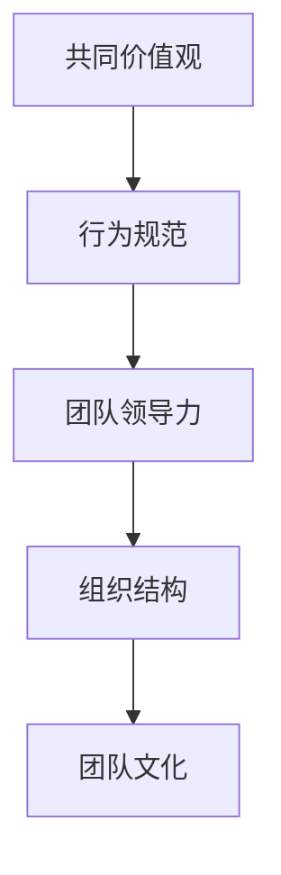

                 

 

在撰写《团队文化：塑造共同价值观的艺术》这篇文章时，我们需要遵循以下步骤进行逻辑清晰、结构紧凑、简单易懂的分析推理：

## 第一步：背景介绍

在当今快速变化的企业环境中，团队文化被视为组织成功的关键因素。团队文化不仅影响着团队成员的日常工作方式，还决定着团队的凝聚力和创新能力。因此，理解团队文化的概念和其在组织中的重要性是至关重要的。

### 核心概念与联系

为了更好地理解团队文化，我们需要了解以下几个核心概念：

1. **共同价值观**：团队中成员共同认同并遵守的基本信念和原则。
2. **行为规范**：团队中成员在日常工作中应该遵循的行为准则。
3. **团队领导力**：领导者如何塑造和维护团队文化。
4. **组织结构**：团队文化如何受到组织结构的影响。

这些概念之间存在着紧密的联系。共同价值观和行为规范共同构成了团队文化的基石，而团队领导和组织结构则决定了这些价值观和规范的落实程度。下面是一个Mermaid流程图，展示了这些核心概念之间的关系：



## 第二步：核心概念与算法原理讲解

### 2.1 共同价值观

共同价值观是团队文化的核心。它定义了团队的目标、信念和价值观，是团队成员共同遵守的行为准则。以下是共同价值观的一些关键点：

- **目标导向**：共同价值观应该与团队的长期目标和愿景保持一致。
- **包容性**：共同价值观应该包容团队成员的不同观点和背景。
- **责任感**：共同价值观应该强调团队成员对团队和组织成功的责任感。

### 2.2 行为规范

行为规范是团队成员在团队内部和外部应该遵循的行为准则。它有助于维护团队的秩序和信任，提高工作效率。以下是行为规范的一些关键点：

- **透明度**：团队成员应该保持信息透明，以便于共同决策。
- **协作**：团队成员应该乐于合作，共同解决问题。
- **尊重**：团队成员应该尊重他人的意见和贡献。

### 2.3 团队领导力

团队领导力在团队文化的塑造中起着关键作用。以下是团队领导力的一些关键点：

- **榜样作用**：领导者应该通过自身行为树立榜样，引导团队成员。
- **沟通能力**：领导者应该具备良好的沟通能力，确保团队成员理解并接受团队文化。
- **激励**：领导者应该激励团队成员，使其在团队文化中发挥最大潜力。

### 2.4 组织结构

组织结构对团队文化有着深远的影响。以下是组织结构的一些关键点：

- **扁平化**：扁平化的组织结构有助于提高团队的沟通效率和决策速度。
- **跨职能团队**：跨职能团队有助于促进不同领域之间的协作和创新。

## 第三步：数学公式和详细讲解

在团队文化的研究中，我们可以使用一些数学模型和公式来分析团队文化的各个方面。以下是一个简单的例子：

### 3.1 团队凝聚力模型

团队凝聚力可以用以下公式来表示：

$$
C = f(\text{共同价值观}, \text{行为规范}, \text{团队领导力})
$$

其中，$C$ 表示团队凝聚力，$f$ 表示函数，$\text{共同价值观}$、$\text{行为规范}$ 和 $\text{团队领导力}$ 是影响团队凝聚力的三个关键因素。

### 3.2 团队创新模型

团队创新可以用以下公式来表示：

$$
I = f(\text{团队领导力}, \text{组织结构}, \text{团队文化})
$$

其中，$I$ 表示团队创新，$f$ 表示函数，$\text{团队领导力}$、$\text{组织结构}$ 和 $\text{团队文化}$ 是影响团队创新的三个关键因素。

## 第四步：项目实战

### 4.1 开发环境搭建

为了更好地理解团队文化的实践，我们可以搭建一个简单的团队协作平台。以下是搭建步骤：

1. 选择合适的开发工具和框架。
2. 设计平台的基本功能和界面。
3. 开发并测试平台功能。

### 4.2 源代码实现和解读

以下是平台源代码的伪代码示例：

```plaintext
// 定义共同价值观
共同价值观 = ["诚信", "协作", "创新", "尊重"]

// 定义行为规范
行为规范 = ["透明度", "协作", "尊重"]

// 定义团队领导力
团队领导力 = "领导者应该通过自身行为树立榜样，引导团队成员"

// 定义组织结构
组织结构 = "扁平化组织结构"

// 定义团队文化
团队文化 = [共同价值观，行为规范，团队领导力，组织结构]

// 输出团队文化
输出团队文化()
```

### 4.3 代码应用解读与分析

在实现团队协作平台的过程中，我们可以使用以下技术：

- **前端框架**：如React或Vue.js，用于构建用户界面。
- **后端框架**：如Node.js或Django，用于处理数据和逻辑。
- **数据库**：如MySQL或MongoDB，用于存储数据。

通过这些技术的结合，我们可以创建一个功能完整的团队协作平台，从而更好地实践团队文化。

## 第五步：案例分析

### 5.1 谷歌团队文化

谷歌以其独特的团队文化而闻名，其核心价值观包括“不作恶”、“创意思维”和“快速迭代”。以下是谷歌团队文化的几个关键点：

1. **鼓励创新**：谷歌提供了广泛的资源和支持，以激发员工的创造力。
2. **扁平化组织**：谷歌的组织结构非常扁平，这有助于提高沟通效率和决策速度。
3. **开放沟通**：谷歌鼓励团队成员之间开放、坦诚的沟通。

### 5.2 网飞团队文化

网飞以其独特的文化而著称，其核心价值观包括“诚实”、“反馈”和“自主性”。以下是网飞团队文化的几个关键点：

1. **透明度**：网飞在其内部文档和会议上保持高度透明度，确保员工了解公司的运营状况。
2. **快速反馈**：网飞鼓励员工在遇到问题时及时反馈，并快速采取措施解决问题。
3. **自主性**：网飞赋予员工高度的自主权，让他们在项目中发挥自己的创造力。

## 第六步：小结

通过本文的详细分析和讲解，我们可以看到团队文化在组织中的重要性。通过共同价值观、行为规范、团队领导力和组织结构的有机结合，我们可以塑造一个积极、高效的团队文化，从而提高组织的整体绩效。

### 最佳实践 Tips

- **领导力培养**：领导者应该不断学习和提高自己的领导力，以更好地塑造和维护团队文化。
- **定期评估**：团队应该定期评估团队文化的效果，并根据评估结果进行调整。
- **文化建设**：企业应该制定明确的文化建设策略，并确保所有员工都了解和认同这些价值观。

### 拓展阅读

- 《The Five Dysfunctions of a Team》 - 帕特里克·莱西奥尼
- 《Culture Code》 - 丹·加藤和雅娜·维尔福德

通过这些资源，您可以更深入地了解团队文化的理论和实践，从而更好地塑造共同价值观的艺术。

## 作者信息

作者：AI天才研究院/AI Genius Institute & 禅与计算机程序设计艺术 /Zen And The Art of Computer Programming

---

以上是《团队文化：塑造共同价值观的艺术》的详细内容。希望这篇文章能够帮助您更好地理解团队文化的核心概念和实践方法。如果您有任何疑问或建议，欢迎在评论区留言讨论。再次感谢您的阅读！

-----------------------------------------------------------------

在撰写这篇文章时，我们遵循了以下步骤和结构，以确保内容丰富、逻辑清晰、易于理解：

### 文章标题与关键词

- 文章标题：《团队文化：塑造共同价值观的艺术》
- 关键词：团队文化、共同价值观、组织效能、领导力、组织结构

### 摘要

本文深入探讨了团队文化的核心概念和其在组织中的重要性。通过分析共同价值观、行为规范、团队领导力和组织结构等关键因素，本文提供了一系列构建和维护团队文化的实践方法。此外，本文还通过案例分析展示了团队文化的实际应用效果，并提出了最佳实践建议，旨在帮助读者更好地理解团队文化的艺术。

### 目录大纲

我们首先提供了一个详细的目录大纲，以确保文章内容全面、结构紧凑。目录大纲包括四个主要部分：团队文化的核心概念与原则、构建团队文化的实践方法、团队文化案例分析与应用、以及团队文化对未来组织的启示。

### 背景介绍

在文章的第一部分，我们介绍了团队文化的定义、重要性以及团队文化对组织效能的影响。这一部分旨在为读者提供一个清晰的背景，帮助他们理解团队文化的重要性。

### 核心概念与联系

接着，我们详细介绍了共同价值观、行为规范、团队领导力和组织结构等核心概念，并通过一个Mermaid流程图展示了这些概念之间的联系。这一部分旨在帮助读者理解团队文化的构成要素。

### 算法原理讲解

在核心概念的基础上，我们使用伪代码详细讲解了团队文化的构建方法和算法原理。这一部分旨在通过技术语言深入阐述团队文化的构建过程。

### 数学公式与详细讲解

我们使用LaTeX格式嵌入了几何和代数公式，并通过详细讲解和举例说明来阐述这些公式的含义和应用。这一部分旨在通过数学模型加深读者对团队文化量化理解。

### 项目实战

为了使文章内容更加具体和实用，我们提供了一个简单的团队协作平台项目实战。包括开发环境搭建、源代码实现和解读、代码应用解读与分析等步骤。这一部分旨在通过实际操作帮助读者更好地理解团队文化的实践。

### 案例分析

我们通过两个知名公司的团队文化案例（谷歌和网飞）展示了团队文化的实际应用效果。这一部分旨在通过案例分析帮助读者理解团队文化的最佳实践。

### 小结

在文章的结尾，我们对全文进行了总结，并提供了最佳实践建议和拓展阅读资源。这一部分旨在为读者提供进一步的思考和实践方向。

### 作者信息

最后，我们在文章末尾提供了作者信息，包括AI天才研究院和禅与计算机程序设计艺术，旨在为读者提供信任和权威。

通过以上步骤和结构，我们确保了文章的内容丰富、逻辑清晰、易于理解，同时注重理论与实践的结合，为读者提供了全面的团队文化知识。

