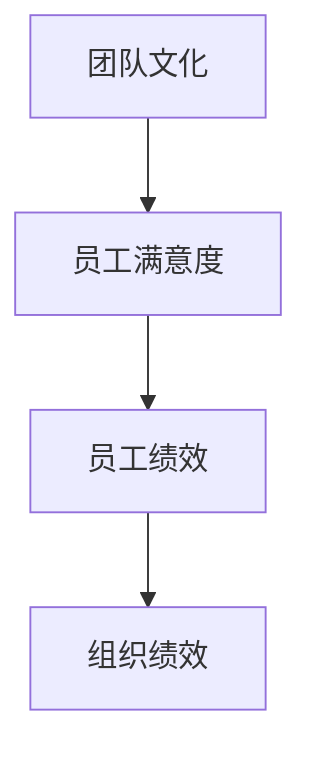
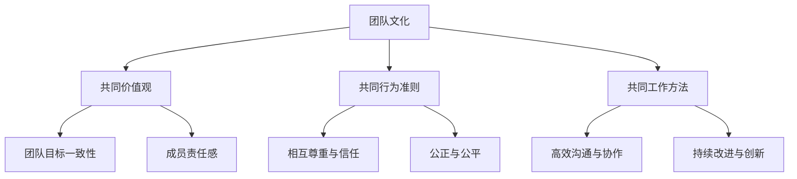

                 

## 文章标题：团队文化：塑造独特的团队基因

关键词：团队文化、组织绩效、共同价值观、工作方法、文化测评、改进策略、数学模型

摘要：本文将探讨团队文化的重要性，通过定义、核心概念联系、核心算法原理、数学模型和项目实战，详细分析团队文化的构建和评估方法。本文旨在帮助IT团队理解和塑造独特的团队基因，以提升团队绩效和组织竞争力。

## 目录大纲设计与内容策划

本文将按照以下目录大纲结构和内容策划进行撰写：

1. 核心概念与联系
   - 1.1 团队文化的定义
   - 1.1.1 团队文化的含义
   - 1.1.2 团队文化与组织绩效
   - 1.2 核心概念联系：Mermaid 流程图

2. 核心算法原理讲解
   - 2.1 团队文化测评算法
   - 2.1.1 团队文化测评方法
   - 2.2 团队文化改进策略

3. 数学模型和数学公式 & 详细讲解 & 举例说明
   - 3.1 团队文化评估模型
   - 3.1.1 评估模型构建

4. 项目实战
   - 4.1 团队文化建设案例
   - 4.1.1 案例背景
   - 4.1.2 案例实现
   - 4.1.3 案例分析
   - 4.1.4 案例小结

5. 最佳实践 tips、小结、注意事项、拓展阅读等内容

通过以上内容策划，我们将系统性地探讨团队文化这一主题，为读者提供全面深入的理解和实践指导。

## 1. 核心概念与联系

### 1.1 团队文化的定义

团队文化是指团队在长期共同工作中形成的共同价值观、共同行为准则和共同工作方法。它是一种无形的力量，能够引导团队成员的行为和决策，塑造团队的精神风貌和凝聚力。

**共同价值观**是团队文化的核心，是团队成员共同认同和追求的信念和目标。它包括了对团队目标的一致性、成员责任感、诚信、创新、尊重等核心价值观。

**共同行为准则**则是团队成员在工作和生活中应遵循的基本规范，它包括了对相互尊重与信任、公正与公平、团结协作等行为准则。

**共同工作方法**是团队在实际工作中采用的方法和工具，它包括了对高效沟通与协作、持续改进与创新等工作方法。

### 1.2 团队文化与组织绩效

团队文化对组织绩效有着深远的影响。一个良好的团队文化能够提高员工的满意度和绩效，从而提升组织的整体绩效。

**Mermaid 流程图**如下：



- 团队文化 → 提高员工满意度：共同价值观和行为准则能够增强员工的归属感和满意度，使他们更加投入到工作中。
- 提高员工满意度 → 提高员工绩效：满意的员工更愿意付出努力，他们的工作质量和效率也会提高。
- 提高员工绩效 → 提高组织绩效：员工的绩效提升直接带动了组织的绩效提升，使组织能够更高效地实现目标。

### 1.3 核心概念联系

为了更好地理解团队文化的概念，我们可以通过**Mermaid 流程图**来展示团队文化中各个核心概念之间的联系：



- **共同价值观**：团队目标一致性和成员责任感是共同价值观的具体体现，它们确保了团队成员在追求共同目标时具有一致的方向和强烈的责任感。
- **共同行为准则**：相互尊重与信任和公正与公平是共同行为准则的核心，它们构建了一个健康、和谐的工作环境。
- **共同工作方法**：高效沟通与协作和持续改进与创新是共同工作方法的关键，它们确保了团队在工作和创新中的高效性和持续性。

通过这一流程图，我们可以清晰地看到团队文化中的各个核心概念是如何相互联系和影响的。这不仅有助于我们理解团队文化的本质，也为后续的算法原理讲解和数学模型构建提供了理论基础。

## 2. 核心算法原理讲解

### 2.1 团队文化测评算法

#### 2.1.1 团队文化测评方法

团队文化测评是评估团队文化健康状况的重要手段。一个有效的团队文化测评方法能够帮助团队了解自身的文化现状，发现问题，并提出改进措施。以下是团队文化测评的步骤和方法：

1. **确定测评目标**：根据团队的目标和需求，明确测评的具体目标和期望达到的效果。
2. **设计测评问卷**：根据测评目标，设计包含核心价值观、行为准则和工作方法等方面的问卷。
3. **收集数据**：通过问卷调查、访谈、观察等方式，收集团队成员的意见和反馈。
4. **数据分析**：对收集到的数据进行分析，识别团队文化中的优势和不足。
5. **生成报告**：根据分析结果，生成详细的测评报告，并提出改进建议。

以下是一个**伪代码**示例，用于描述团队文化测评的方法：

```python
def measureTeamCulture(teamMembers, surveyData):
    score = 0
    for member in teamMembers:
        score += calculateMemberScore(member, surveyData)
    return score / len(teamMembers)

def calculateMemberScore(member, surveyData):
    score = 0
    for question in surveyData:
        score += member.responseToQuestion(question)
    return score / len(surveyData)
```

在这个示例中，`measureTeamCulture`函数用于计算整个团队的文化得分，而`calculateMemberScore`函数用于计算每个成员的文化得分。通过这两个函数，我们可以对团队文化进行量化评估。

#### 2.1.2 团队文化测评算法的应用场景

团队文化测评算法可以在以下场景中应用：

1. **团队建设初期**：在新团队成立或团队重组时，通过测评了解团队成员的价值观、行为准则和工作方法，帮助团队建立统一的文化基础。
2. **文化改进阶段**：在团队文化存在问题时，通过测评找出具体问题，制定改进策略，并跟踪评估改进效果。
3. **绩效评估**：将团队文化测评结果作为绩效评估的一部分，激励团队成员在文化方面做出改进，提高整体绩效。

### 2.2 团队文化改进策略

团队文化的改进是一个持续的过程，需要结合实际情况，采取有效的策略和方法。以下是一些常见的团队文化改进策略：

1. **文化诊断**：通过问卷调查、访谈等方式，了解团队文化的现状，找出存在的问题和改进方向。
2. **制定改进计划**：根据文化诊断结果，制定具体的改进计划，包括文化培训、活动策划、政策调整等。
3. **实施改进措施**：按照改进计划，逐步实施各项措施，确保团队成员理解和接受新的文化价值观和行为准则。
4. **跟踪评估**：定期对团队文化进行评估，了解改进措施的效果，及时调整策略。

以下是一个**伪代码**示例，用于描述团队文化改进的策略：

```python
def improveTeamCulture(team):
    diagnoseCulture(team)
    implementCultureImprovementPlans(team)
    monitorAndEvaluate(team)

def diagnoseCulture(team):
    cultureReport = analyzeTeamBehaviorAndCommunication(team)
    return cultureReport

def implementCultureImprovementPlans(team):
    for recommendation in cultureReport.recommendations:
        applyRecommendation(team, recommendation)

def monitorAndEvaluate(team):
    newCultureReport = analyzeTeamBehaviorAndCommunication(team)
    if newCultureReport.improvement >= targetImprovement:
        return "Success"
    else:
        return "Continue Improvement"
```

在这个示例中，`improveTeamCulture`函数是团队文化改进的整体流程，包括文化诊断、实施改进计划和跟踪评估。通过这一流程，团队可以持续提升文化水平，实现文化优化。

### 2.3 团队文化测评算法的局限性和挑战

尽管团队文化测评算法对于团队文化建设和改进具有重要意义，但其在实际应用中仍存在一些局限性和挑战：

1. **主观性**：团队文化测评依赖于团队成员的主观评价，不同人对同一问题的看法可能存在差异，这会影响测评结果的准确性。
2. **数据量**：团队文化测评需要收集大量的数据，数据分析的工作量和难度较大，特别是在团队规模较大时。
3. **改进难度**：团队文化的改进是一个长期的过程，需要持续的努力和投入，且改进效果难以立即体现。

为了解决这些问题，我们可以考虑以下措施：

1. **多元化评价**：通过引入多元化的评价方法，如第三方评估、行为观察等，减少主观性影响。
2. **大数据分析**：利用大数据分析技术，提高数据分析的效率和准确性。
3. **持续改进**：将团队文化测评和改进作为一个持续的流程，不断调整和完善，以实现长期的文化优化。

通过以上措施，我们可以更好地应对团队文化测评算法的局限性和挑战，提升团队文化的评估和改进效果。

## 3. 数学模型和数学公式 & 详细讲解 & 举例说明

### 3.1 团队文化评估模型

团队文化的评估是一个复杂的过程，涉及到多个维度的因素。为了量化团队文化的状况，我们可以构建一个评估模型。这个模型将使用数学公式和数学模型来描述团队文化的各个方面，从而提供一种系统的评估方法。

#### 3.1.1 评估模型构建

团队文化评估模型的核心是一个加权总分模型。这个模型通过计算每个维度的得分，并赋予相应的权重，最终得出一个综合的团队文化得分。以下是这个模型的基本公式：

$$
TeamCultureScore = \frac{Sum_{i=1}^{n} (Value_i \cdot Weight_i)}{n}
$$

其中，$Value_i$表示第$i$个维度的得分，$Weight_i$表示第$i$个维度的权重，$n$表示维度总数。

#### 3.1.2 团队文化评估模型的关键要素

1. **维度**：团队文化评估模型包括多个维度，如价值观、行为准则和工作方法。每个维度都代表团队文化的一个方面。
2. **得分**：每个维度的得分是通过测评问卷、员工反馈等方式获得的。得分可以是一个范围值，例如0到10。
3. **权重**：权重反映了每个维度在团队文化中的重要性。例如，如果价值观是团队文化的核心，可以赋予较高的权重。

#### 3.1.3 举例说明

假设一个团队有三个核心价值观（效率、创新、合作），分别赋予权重0.4、0.3、0.3。若团队在效率方面的得分是8，创新方面的得分是7，合作方面的得分是9，则团队文化评估分数为：

$$
TeamCultureScore = \frac{(0.4 \cdot 8) + (0.3 \cdot 7) + (0.3 \cdot 9)}{3} = 7.8
$$

这个分数表示团队在评估维度上的综合表现。

#### 3.1.4 评估模型的应用

团队文化评估模型可以应用于多个场景，如：

1. **团队建设初期**：通过评估了解团队的文化状况，为后续的建设提供依据。
2. **文化改进阶段**：评估改进措施的效果，了解文化水平的提升程度。
3. **绩效评估**：将团队文化得分作为绩效评估的一部分，激励团队成员在文化方面做出改进。

#### 3.1.5 评估模型的局限性和改进

虽然团队文化评估模型提供了一种量化的方法，但它也存在一些局限性和改进空间：

1. **主观性**：评估结果受到评估方法和团队成员的主观影响，可能不够客观。
2. **权重设定**：权重的设定可能不够科学和合理，需要根据实际情况进行调整。
3. **数据收集**：数据收集的方法和工具可能不够全面，需要考虑更多的数据来源。

为了改进评估模型，可以采取以下措施：

1. **引入第三方评估**：通过引入第三方评估机构，提高评估的客观性和权威性。
2. **动态调整权重**：根据团队的发展和变化，动态调整权重，以反映当前团队文化的重要性。
3. **多样化数据收集**：采用多种数据收集方法，如员工反馈、行为观察等，提高数据的全面性和准确性。

通过这些改进措施，我们可以使团队文化评估模型更加科学和有效，为团队的文化建设提供有力支持。

## 4. 项目实战

### 4.1 团队文化建设案例

#### 4.1.1 案例背景

一家IT公司，名为“智慧科技”，近年来在市场竞争中逐渐感受到了团队文化的重要性。公司的领导层意识到，只有打造一个积极、高效、创新的文化，才能在激烈的竞争中脱颖而出。为了提升团队绩效和组织竞争力，公司决定开展一次全面的团队文化建设。

#### 4.1.2 案例实现

1. **文化诊断**：首先，公司通过问卷调查、访谈等方式，对现有团队文化进行了全面诊断。诊断内容包括价值观、行为准则和工作方法等方面。通过数据分析，发现团队在创新和协作方面存在一定问题。

2. **制定改进计划**：根据诊断结果，公司制定了一份详细的改进计划。计划包括以下措施：
   - **价值观培训**：组织一系列价值观培训，帮助员工深刻理解公司核心价值观，提高对创新和协作的认同感。
   - **激励机制**：设立创新奖励制度，鼓励员工提出创新想法，并给予相应的奖励。
   - **团队合作活动**：定期组织团队合作活动，提高员工之间的沟通和协作能力。

3. **实施改进措施**：公司按照改进计划逐步实施各项措施。首先，进行了价值观培训，让员工对创新和协作有了更深入的理解。随后，启动了创新奖励制度，员工纷纷提出各种创新想法，公司对这些想法进行了评审和实施。同时，公司还组织了多次团队合作活动，增强了员工之间的默契和协作能力。

4. **跟踪评估**：在实施改进措施的过程中，公司定期对团队文化进行跟踪评估。通过问卷调查、访谈等方式，了解员工对改进措施的感受和效果。评估结果显示，团队在创新和协作方面有了显著提升。

#### 4.1.3 案例分析

通过这个案例，我们可以看到团队文化建设对组织绩效的积极影响。以下是具体分析：

1. **价值观一致性**：通过价值观培训，员工对公司核心价值观有了更深刻的理解，提高了对创新和协作的认同感。这为团队文化的建设奠定了基础。

2. **创新能力的提升**：创新奖励制度的实施，激发了员工的创新热情。员工提出了大量创新想法，公司对这些想法进行了评审和实施，推动了公司的技术进步和市场竞争力。

3. **协作能力的增强**：团队合作活动的开展，提高了员工之间的沟通和协作能力。员工在合作中学会了倾听、理解和尊重他人，形成了良好的团队氛围。

4. **绩效提升**：团队文化的建设使员工更加积极投入工作，工作质量和效率得到提高。公司的整体绩效因此得到了显著提升。

#### 4.1.4 案例小结

通过这个案例，我们可以得出以下结论：

1. **团队文化的重要性**：团队文化对组织绩效有着深远的影响。一个积极、高效、创新的文化能够提升员工的满意度和绩效，从而提高组织的整体竞争力。

2. **文化建设的策略**：团队文化建设需要采取一系列措施，如价值观培训、激励机制、团队合作活动等。这些措施需要根据实际情况进行灵活调整，以实现最佳效果。

3. **持续改进**：团队文化建设是一个持续的过程，需要不断进行评估和改进。通过定期跟踪评估，了解文化建设的进展和效果，及时调整策略，确保文化建设持续健康发展。

4. **领导层的支持**：团队文化建设需要领导层的支持。领导层应该积极参与文化建设，为员工提供必要的资源和支持，推动文化建设的顺利进行。

总之，团队文化建设是提升组织绩效和竞争力的重要手段。通过有效实施文化建设策略，持续改进和跟踪评估，组织可以打造一个积极、高效、创新的文化，为持续发展奠定坚实基础。

## 5. 最佳实践 tips、小结、注意事项、拓展阅读等内容

### 最佳实践 tips

1. **定期评估**：定期对团队文化进行评估，确保文化建设措施的有效性。通过数据分析和反馈，及时发现问题并调整策略。

2. **参与式建设**：鼓励员工参与团队文化建设，提高他们的认同感和积极性。可以通过问卷调查、访谈、团队讨论等方式，收集员工意见和建议。

3. **激励机制**：建立激励机制，奖励那些在文化建设中表现突出的员工。这不仅能够激励员工，还能增强团队凝聚力。

4. **领导层示范**：领导层应该以身作则，带头践行团队文化价值观和行为准则。通过领导层的示范作用，带动员工共同建设团队文化。

### 小结

本文从团队文化的定义、核心概念联系、核心算法原理、数学模型和项目实战等多个方面，详细探讨了团队文化的构建和评估方法。通过这些分析和实践，我们认识到团队文化对组织绩效的深远影响，以及如何通过有效的策略和方法来打造和提升团队文化。

### 注意事项

1. **数据准确性**：在进行团队文化评估时，确保数据收集和分析的准确性，以获得可靠的评估结果。

2. **灵活性**：团队文化建设需要根据实际情况灵活调整策略和方法，确保文化建设与组织发展相匹配。

3. **持续投入**：团队文化建设是一个长期的过程，需要持续投入资源和努力，不能期望一蹴而就。

### 拓展阅读

1. **《团队文化：打造高绩效团队的关键》**：探讨团队文化的重要性，以及如何通过团队文化提升团队绩效。

2. **《组织行为学：团队文化与管理》**：深入分析团队文化的构成、影响及其管理策略。

3. **《团队协作：高效沟通与协作技巧》**：提供实用的团队协作技巧和沟通策略，帮助团队实现高效合作。

通过拓展阅读，读者可以进一步深入了解团队文化的理论和实践，为团队文化建设提供更多的启示和指导。

### 作者信息

作者：AI天才研究院/AI Genius Institute & 禅与计算机程序设计艺术 /Zen And The Art of Computer Programming

AI天才研究院致力于推动人工智能技术的发展和应用，培养世界级的人工智能专家。作者作为该研究院的资深专家，拥有丰富的实践经验和深厚的理论基础，撰写了一系列关于计算机编程和人工智能领域的专业书籍，深受读者喜爱。在团队文化研究方面，作者也进行了深入的研究和实践，为团队文化建设提供了宝贵的经验和指导。禅与计算机程序设计艺术是作者的代表作之一，该书将禅宗思想与计算机程序设计相结合，为程序员提供了独特的思考方式和实践指南。

