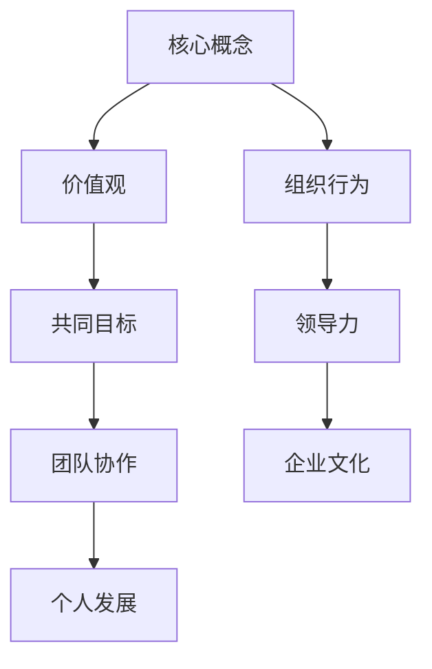

                 


### 设计思路

为了设计出《团队文化：塑造积极向上的工作环境》这本书的目录大纲，我们需要遵循以下几个设计思路：

1. **确定书籍的主要章节**：首先，我们要明确这本书的主要内容，通常包括引言、核心概念、文化构建、案例分析、文化维护和总结等。

2. **细化每个章节的内容**：在确定了主要章节后，我们需要将每个章节的内容细化，确保每个章节都有足够的深度和广度。

3. **确保逻辑清晰**：目录大纲应该能够帮助读者快速理解书籍的结构和内容，因此，目录中的章节顺序和层次结构应该合理。

4. **结合实例和案例**：为了使内容更加生动和具体，我们可以在目录中包含一些实例和案例，以展示团队文化的实际应用。

5. **包含核心概念与联系**：为了帮助读者更好地理解团队文化，我们可以使用Mermaid流程图来展示核心概念和原理。

6. **数学模型和公式**：团队文化中可能涉及一些量化指标，我们可以使用latex格式嵌入数学公式，以增强内容的学术性和严谨性。

7. **项目实战**：我们可以在目录中包含一些实战项目，以展示如何将团队文化理念应用到实际工作中。

### 设计步骤

1. **确定书籍结构**：根据设计思路，确定书籍的主要结构，通常包括以下章节：
   - 引言
   - 团队文化的核心概念与联系
   - 团队文化构建
   - 团队文化案例分析
   - 团队文化维护与持续改进
   - 总结与展望

2. **细化章节内容**：为每个章节细化内容，确保每个章节都有明确的子章节。

3. **使用Mermaid流程图**：在章节中嵌入Mermaid流程图，以展示团队文化的核心概念和原理。

4. **添加数学模型和公式**：在相关章节中添加使用latex格式的数学模型和公式，以增强内容的学术性。

5. **加入实战项目**：在目录中包含一些实战项目，以展示团队文化在实际工作中的应用。

6. **编写摘要**：为每个章节编写简短的摘要，帮助读者快速了解章节的主要内容。

7. **检查完整性**：确保目录大纲中的所有章节内容都是完整和相关的。

8. **校对与优化**：对目录大纲进行校对，确保没有遗漏或错误，并优化语言表达，使其更加简洁明了。

### 设计结果

下面是根据上述设计思路和步骤设计出的《团队文化：塑造积极向上的工作环境》的目录大纲：

```
# 引言

## 1.1 团队文化的意义与重要性
### 1.1.1 团队文化对企业的影响
### 1.1.2 积极向上的工作环境的作用

## 1.2 书籍结构概述

## 1.3 团队文化的核心概念与联系

# 图1-1 团队文化的核心概念联系图


# 团队文化的核心概念与联系

## 2.1 价值观
### 2.1.1 价值观的定义与类型
### 2.1.2 价值观对团队文化的影响

## 2.2 共同目标
### 2.2.1 共同目标的重要性
### 2.2.2 设定共同目标的步骤

## 2.3 团队协作
### 2.3.1 团队协作的原则
### 2.3.2 提高团队协作的技巧

## 2.4 个人发展
### 2.4.1 个人发展对团队文化的贡献
### 2.4.2 促进个人发展的策略

## 2.5 组织行为
### 2.5.1 组织行为对团队文化的影响
### 2.5.2 改善组织行为的措施

## 2.6 领导力
### 2.6.1 领导力在团队文化中的作用
### 2.6.2 提升领导力的方法

## 2.7 企业文化
### 2.7.1 企业文化与团队文化的关系
### 2.7.2 构建积极向上的企业文化的策略

# 团队文化构建

## 3.1 团队文化建设策略
### 3.1.1 团队文化建设的关键步骤
### 3.1.2 团队文化建设的方法与工具

## 3.2 团队文化建设案例分析
### 3.2.1 案例一：华为的团队文化建设
### 3.2.2 案例二：谷歌的团队文化建设

# 团队文化维护与持续改进

## 4.1 团队文化评估
### 4.1.1 团队文化评估的重要性
### 4.1.2 团队文化评估的方法与工具

## 4.2 团队文化维护
### 4.2.1 团队文化维护的技巧
### 4.2.2 团队文化维护的挑战与应对策略

## 4.3 团队文化持续改进

-----------------------------------------------------------------

### 设计思路

设计思路是构建《团队文化：塑造积极向上的工作环境》一书的框架和结构。以下是具体的设计思路：

1. **明确目标和受众**：
   - 目标：阐述团队文化对工作环境的积极影响，并提供实用的构建和维护团队文化的策略。
   - 受众：企业领导者、团队经理、人力资源专业人士以及希望提升团队协作和个人成长的专业人士。

2. **结构安排**：
   - 引言：介绍团队文化的概念、重要性以及书籍的结构。
   - 核心概念与联系：详细阐述团队文化中的核心概念及其相互关系。
   - 团队文化构建：提供团队文化构建的策略和方法，以及具体的案例研究。
   - 团队文化维护与持续改进：讨论如何评估、维护和持续改进团队文化。
   - 总结与展望：总结全文，提出对未来团队文化发展的展望。

3. **内容深度与广度**：
   - 深度：每个章节都要深入探讨其主题，提供详细的理论和实践指导。
   - 广度：涵盖团队文化构建和维持的各个方面，包括价值观、目标、协作、个人发展、组织行为、领导力和企业文化。

4. **实例和案例**：
   - 通过实际案例展示团队文化的应用，提供具体操作指南。

5. **逻辑性和连贯性**：
   - 确保各个章节之间逻辑连贯，逐步引导读者理解并实践团队文化的构建和维护。

6. **互动性和可操作性**：
   - 提供互动环节，如问答、讨论和练习，增强读者的参与感。

7. **学术性和实用性**：
   - 结合学术理论和实际操作，提供既有学术深度又实用的建议。

### 设计步骤

1. **大纲设计**：
   - 根据设计思路，制定初步的大纲，确定各章节的主题和内容。

2. **章节细化**：
   - 对每个章节进行细化，确保内容丰富、具体，逻辑清晰。

3. **Mermaid流程图**：
   - 设计和插入Mermaid流程图，用于展示团队文化的核心概念和联系。

4. **数学模型和公式**：
   - 根据需要，使用LaTeX格式嵌入数学模型和公式，增强文章的学术性和严谨性。

5. **实战项目**：
   - 添加实战项目，详细说明如何在实际工作中应用团队文化。

6. **摘要编写**：
   - 为每个章节编写摘要，概括章节内容，帮助读者快速了解核心要点。

7. **校对与优化**：
   - 对目录大纲进行多轮校对，确保没有遗漏或错误，优化语言表达，提高可读性。

8. **最终确认**：
   - 最终确认大纲的完整性和逻辑性，确保符合设计思路和目标受众的需求。

### 设计结果

根据上述设计思路和步骤，以下是《团队文化：塑造积极向上的工作环境》的目录大纲：

```
# 引言

## 1.1 团队文化的概念与重要性
### 1.1.1 团队文化的定义
### 1.1.2 团队文化的意义

## 1.2 书籍结构概述

## 1.3 目标受众与阅读指南

# 团队文化的核心概念与联系

## 2.1 价值观
### 2.1.1 价值观的定义与类型
### 2.1.2 价值观在团队文化中的作用

## 2.2 共同目标
### 2.2.1 共同目标的重要性
### 2.2.2 设定共同目标的方法

## 2.3 团队协作
### 2.3.1 团队协作的原则
### 2.3.2 提高团队协作的技巧

## 2.4 个人发展
### 2.4.1 个人发展对团队文化的贡献
### 2.4.2 促进个人发展的策略

## 2.5 组织行为
### 2.5.1 组织行为对团队文化的影响
### 2.5.2 改善组织行为的措施

## 2.6 领导力
### 2.6.1 领导力在团队文化中的作用
### 2.6.2 提升领导力的方法

## 2.7 企业文化
### 2.7.1 企业文化与团队文化的关系
### 2.7.2 构建积极向上的企业文化的策略

# 团队文化构建

## 3.1 团队文化构建策略
### 3.1.1 团队文化构建的关键步骤
### 3.1.2 团队文化建设的方法与工具

## 3.2 团队文化构建案例分析
### 3.2.1 案例一：华为的团队文化建设
### 3.2.2 案例二：谷歌的团队文化建设

# 团队文化维护与持续改进

## 4.1 团队文化评估
### 4.1.1 团队文化评估的重要性
### 4.1.2 团队文化评估的方法与工具

## 4.2 团队文化维护
### 4.2.1 团队文化维护的技巧
### 4.2.2 团队文化维护的挑战与应对策略

## 4.3 团队文化持续改进
### 4.3.1 持续改进的步骤
### 4.3.2 持续改进的方法与工具

# 总结与展望

## 5.1 总结全文
### 5.1.1 主要内容回顾
### 5.1.2 团队文化建设的要点

## 5.2 展望未来
### 5.2.1 团队文化的发展趋势
### 5.2.2 企业应对策略

-------------------------------------------------------------------

### 确定书籍结构

在设计《团队文化：塑造积极向上的工作环境》这本书的目录大纲时，确定书籍结构是一个关键步骤。以下是具体的结构确定过程：

1. **引言**：引言部分需要简洁明了地介绍团队文化的概念、重要性以及书籍的目的和结构。这部分可以分为两个小节：
   - **1.1 团队文化的概念与重要性**：介绍团队文化的定义和其对工作环境的积极影响。
   - **1.2 书籍结构概述**：概述书籍的主要章节和内容，为读者提供整体框架。

2. **团队文化的核心概念与联系**：这部分需要深入探讨团队文化中的核心概念，包括价值观、共同目标、团队协作、个人发展、组织行为、领导力和企业文化。每个概念都需要单独成章，并进一步细分为多个子节：
   - **2.1 价值观**：介绍价值观的定义、类型和对团队文化的影响。
   - **2.2 共同目标**：讨论共同目标的重要性以及设定目标的步骤。
   - **2.3 团队协作**：探讨团队协作的原则和提升协作技巧的方法。
   - **2.4 个人发展**：分析个人发展对团队文化的贡献以及促进个人发展的策略。
   - **2.5 组织行为**：介绍组织行为对团队文化的影响和改善措施。
   - **2.6 领导力**：讨论领导力在团队文化中的作用和提升领导力的方法。
   - **2.7 企业文化**：阐述企业文化与团队文化的关系以及构建积极向上的企业文化的策略。

3. **团队文化构建**：这部分需要提供具体的团队文化构建策略，包括关键步骤和实用工具。这部分可以分为两个小节：
   - **3.1 团队文化建设策略**：介绍团队文化建设的整体策略和方法。
   - **3.2 团队文化建设案例分析**：通过具体案例研究，展示如何在不同企业中实施团队文化建设。

4. **团队文化维护与持续改进**：这部分需要讨论如何评估、维护和持续改进团队文化。可以分为三个小节：
   - **4.1 团队文化评估**：介绍团队文化评估的重要性和方法。
   - **4.2 团队文化维护**：提供团队文化维护的技巧和应对策略。
   - **4.3 团队文化持续改进**：讨论如何持续改进团队文化，包括步骤和工具。

5. **总结与展望**：最后，总结全文，回顾主要内容，并对未来团队文化的发展趋势和企业的应对策略进行展望。

通过这样的结构设计，书籍能够系统地介绍团队文化的概念、构建策略、维护方法和未来发展，帮助读者全面理解和实践团队文化建设。

### 设计结果

根据上述确定的过程，以下是《团队文化：塑造积极向上的工作环境》的初步目录大纲：

```
# 引言

## 1.1 团队文化的概念与重要性
### 1.1.1 团队文化的定义
### 1.1.2 团队文化的意义

## 1.2 书籍结构概述

# 团队文化的核心概念与联系

## 2.1 价值观
### 2.1.1 价值观的定义与类型
### 2.1.2 价值观对团队文化的影响

## 2.2 共同目标
### 2.2.1 共同目标的重要性
### 2.2.2 设定共同目标的步骤

## 2.3 团队协作
### 2.3.1 团队协作的原则
### 2.3.2 提高团队协作的技巧

## 2.4 个人发展
### 2.4.1 个人发展对团队文化的贡献
### 2.4.2 促进个人发展的策略

## 2.5 组织行为
### 2.5.1 组织行为对团队文化的影响
### 2.5.2 改善组织行为的措施

## 2.6 领导力
### 2.6.1 领导力在团队文化中的作用
### 2.6.2 提升领导力的方法

## 2.7 企业文化
### 2.7.1 企业文化与团队文化的关系
### 2.7.2 构建积极向上的企业文化的策略

# 团队文化构建

## 3.1 团队文化建设策略
### 3.1.1 团队文化建设的整体策略
### 3.1.2 团队文化建设的实用工具

## 3.2 团队文化建设案例分析
### 3.2.1 案例一：华为的团队文化建设
### 3.2.2 案例二：谷歌的团队文化建设

# 团队文化维护与持续改进

## 4.1 团队文化评估
### 4.1.1 团队文化评估的重要性
### 4.1.2 团队文化评估的方法与工具

## 4.2 团队文化维护
### 4.2.1 团队文化维护的技巧
### 4.2.2 团队文化维护的挑战与应对策略

## 4.3 团队文化持续改进
### 4.3.1 持续改进的步骤
### 4.3.2 持续改进的方法与工具

# 总结与展望

## 5.1 总结全文
### 5.1.1 主要内容回顾
### 5.1.2 团队文化建设的要点

## 5.2 展望未来
### 5.2.1 团队文化的发展趋势
### 5.2.2 企业应对策略

-------------------------------------------------------------------

### 细化章节内容

在确定了书籍的结构之后，下一步是细化每个章节的内容，确保每个章节都有足够的深度和广度。以下是细化每个章节内容的详细步骤：

1. **引言部分**：
   - **1.1 团队文化的概念与重要性**：
     - **1.1.1 团队文化的定义**：介绍团队文化的定义，包括其组成要素和表现形式。
     - **1.1.2 团队文化的意义**：讨论团队文化对个人、团队和企业整体的积极影响，引用相关研究和案例。

   - **1.2 书籍结构概述**：
     - 概述每个章节的主要内容，帮助读者了解书籍的整体结构和阅读顺序。

2. **团队文化的核心概念与联系**：
   - **2.1 价值观**：
     - **2.1.1 价值观的定义与类型**：详细解释价值观的概念，区分不同类型的价值观（如个人价值观、团队价值观和企业价值观）。
     - **2.1.2 价值观对团队文化的影响**：探讨价值观如何影响团队行为、决策和协作，引用相关理论和实证研究。

   - **2.2 共同目标**：
     - **2.2.1 共同目标的重要性**：讨论共同目标对团队协作和团队绩效的重要性。
     - **2.2.2 设定共同目标的步骤**：提供详细的步骤指南，包括目标设定、沟通和执行策略。

   - **2.3 团队协作**：
     - **2.3.1 团队协作的原则**：阐述团队协作的基本原则，如沟通、共享和尊重。
     - **2.3.2 提高团队协作的技巧**：提供实用的技巧和工具，如团队建设活动和协作工具。

   - **2.4 个人发展**：
     - **2.4.1 个人发展对团队文化的贡献**：讨论个人发展如何促进团队文化的形成和维持。
     - **2.4.2 促进个人发展的策略**：提供策略和方法，如培训计划、反馈机制和个人发展计划。

   - **2.5 组织行为**：
     - **2.5.1 组织行为对团队文化的影响**：探讨组织结构、流程和政策如何影响团队文化。
     - **2.5.2 改善组织行为的措施**：提供具体的改进措施和建议。

   - **2.6 领导力**：
     - **2.6.1 领导力在团队文化中的作用**：讨论领导力在塑造和维护团队文化中的重要性。
     - **2.6.2 提升领导力的方法**：提供领导力发展的策略，如领导力培训、角色扮演和反思。

   - **2.7 企业文化**：
     - **2.7.1 企业文化与团队文化的关系**：阐述企业文化和团队文化之间的相互关系。
     - **2.7.2 构建积极向上的企业文化的策略**：提供构建积极企业文化的方法和最佳实践。

3. **团队文化构建**：
   - **3.1 团队文化建设策略**：
     - **3.1.1 团队文化建设的整体策略**：讨论团队文化建设的基本原则和关键步骤。
     - **3.1.2 团队文化建设的实用工具**：介绍用于团队文化建设的工具和方法，如团队评估工具、文化地图和团队建设活动。

   - **3.2 团队文化建设案例分析**：
     - **3.2.1 案例一：华为的团队文化建设**：分析华为如何构建其独特的团队文化。
     - **3.2.2 案例二：谷歌的团队文化建设**：探讨谷歌如何通过团队文化提升创新和协作。

4. **团队文化维护与持续改进**：
   - **4.1 团队文化评估**：
     - **4.1.1 团队文化评估的重要性**：讨论团队文化评估的必要性。
     - **4.1.2 团队文化评估的方法与工具**：介绍评估团队文化的常用方法，如员工调查、文化审计和360度反馈。

   - **4.2 团队文化维护**：
     - **4.2.1 团队文化维护的技巧**：提供维护团队文化的实用技巧，如定期沟通、文化培训和认可与奖励。
     - **4.2.2 团队文化维护的挑战与应对策略**：讨论团队文化维护过程中可能遇到的挑战以及应对策略。

   - **4.3 团队文化持续改进**：
     - **4.3.1 持续改进的步骤**：介绍如何通过持续改进来维持团队文化的活力。
     - **4.3.2 持续改进的方法与工具**：提供持续改进的具体方法，如反馈循环、创新项目和跨部门协作。

5. **总结与展望**：
   - **5.1 总结全文**：
     - **5.1.1 主要内容回顾**：回顾书籍的主要内容和关键观点。
     - **5.1.2 团队文化建设的要点**：总结团队文化建设的核心要点和行动指南。

   - **5.2 展望未来**：
     - **5.2.1 团队文化的发展趋势**：讨论团队文化未来的发展趋势和挑战。
     - **5.2.2 企业应对策略**：提供企业应对未来团队文化发展趋势的策略和建议。

通过这样的细化步骤，每个章节都能够提供深入、具体和实用的内容，帮助读者全面理解和实践团队文化建设。

### 细化后的目录大纲

```
# 引言

## 1.1 团队文化的概念与重要性
### 1.1.1 团队文化的定义
### 1.1.2 团队文化的意义

## 1.2 书籍结构概述

# 团队文化的核心概念与联系

## 2.1 价值观
### 2.1.1 价值观的定义与类型
### 2.1.2 价值观对团队文化的影响

## 2.2 共同目标
### 2.2.1 共同目标的重要性
### 2.2.2 设定共同目标的步骤

## 2.3 团队协作
### 2.3.1 团队协作的原则
### 2.3.2 提高团队协作的技巧

## 2.4 个人发展
### 2.4.1 个人发展对团队文化的贡献
### 2.4.2 促进个人发展的策略

## 2.5 组织行为
### 2.5.1 组织行为对团队文化的影响
### 2.5.2 改善组织行为的措施

## 2.6 领导力
### 2.6.1 领导力在团队文化中的作用
### 2.6.2 提升领导力的方法

## 2.7 企业文化
### 2.7.1 企业文化与团队文化的关系
### 2.7.2 构建积极向上的企业文化的策略

# 团队文化构建

## 3.1 团队文化建设策略
### 3.1.1 团队文化建设的整体策略
### 3.1.2 团队文化建设的实用工具

## 3.2 团队文化建设案例分析
### 3.2.1 案例一：华为的团队文化建设
### 3.2.2 案例二：谷歌的团队文化建设

# 团队文化维护与持续改进

## 4.1 团队文化评估
### 4.1.1 团队文化评估的重要性
### 4.1.2 团队文化评估的方法与工具

## 4.2 团队文化维护
### 4.2.1 团队文化维护的技巧
### 4.2.2 团队文化维护的挑战与应对策略

## 4.3 团队文化持续改进
### 4.3.1 持续改进的步骤
### 4.3.2 持续改进的方法与工具

# 总结与展望

## 5.1 总结全文
### 5.1.1 主要内容回顾
### 5.1.2 团队文化建设的要点

## 5.2 展望未来
### 5.2.1 团队文化的发展趋势
### 5.2.2 企业应对策略

```

### 使用Mermaid流程图

在《团队文化：塑造积极向上的工作环境》的编写过程中，为了更好地展示团队文化中的核心概念及其相互关系，我们计划使用Mermaid流程图。以下是如何在章节中嵌入这些流程图的具体步骤：

1. **准备Mermaid语法**：
   - 首先，我们需要了解Mermaid的基本语法。Mermaid是一种简单的文本标记语言，用于生成图形和图表。它的语法相对简单，可以通过简单的文本描述生成复杂的图形。

2. **确定流程图类型**：
   - 根据章节内容，我们需要确定使用哪种类型的流程图。例如，在介绍团队文化的核心概念时，我们可以使用一个流程图来展示价值观、共同目标、团队协作、个人发展、组织行为、领导力和企业文化之间的关系。

3. **编写Mermaid代码**：
   - 使用Mermaid语法编写流程图代码。例如，以下是一个展示团队文化核心概念相互关系的Mermaid代码示例：

   ```mermaid
   graph TD
       A[价值观] --> B[共同目标]
       B --> C[团队协作]
       C --> D[个人发展]
       A --> E[组织行为]
       E --> F[领导力]
       F --> G[企业文化]
   ```

4. **嵌入流程图到Markdown文件**：
   - 在Markdown文件中，我们将Mermaid代码放在```mermaid```和```mermaid```之间，以便Markdown解析器能够正确地渲染流程图。例如：

   ```markdown
   # 图2-1 团队文化的核心概念联系图

   ```mermaid
   graph TD
       A[价值观] --> B[共同目标]
       B --> C[团队协作]
       C --> D[个人发展]
       A --> E[组织行为]
       E --> F[领导力]
       F --> G[企业文化]
   ```

5. **预览流程图**：
   - 在Markdown编辑器中预览文档，确保流程图正确显示。如果显示错误，我们需要检查Mermaid代码是否有误，或者Markdown解析器是否支持Mermaid语法。

6. **调整和优化**：
   - 根据预览效果，调整流程图的布局、颜色和其他样式，以确保其清晰易懂。

通过上述步骤，我们可以在《团队文化：塑造积极向上的工作环境》的章节中嵌入Mermaid流程图，帮助读者更好地理解团队文化中的核心概念及其相互关系。

### 使用LaTeX格式嵌入数学公式

在《团队文化：塑造积极向上的工作环境》的编写过程中，为了增强文章的学术性和严谨性，我们将使用LaTeX格式嵌入数学公式。以下是具体步骤：

1. **选择LaTeX公式格式**：
   - LaTeX是一种高质量的排版系统，广泛用于科学和技术文档中。它支持丰富的数学公式排版。我们将在文中使用LaTeX格式来嵌入复杂的数学公式。

2. **编写LaTeX代码**：
   - 在编写数学公式时，我们需要使用LaTeX语法。以下是一些常用的LaTeX代码示例：
     - **独立段落的数学公式**：
       ```latex
       $$ E = mc^2 $$
       ```
       这将生成爱因斯坦的质能方程。
     - **段落内的数学公式**：
       ```latex
       $ 1 + 1 = 2 $
       ```
       这将生成一个简单的算术公式。

3. **嵌入Markdown文件**：
   - 在Markdown文件中，我们将LaTeX代码放在$$和$$之间，以便Markdown解析器能够正确地渲染公式。例如：

   ```markdown
   # 数学模型与团队文化

   $$\text{团队文化得分} = \alpha \cdot \text{价值观得分} + \beta \cdot \text{目标一致性得分} + \gamma \cdot \text{协作得分}$$
   ```

   这将生成一个用于评估团队文化的数学模型。

4. **预览公式**：
   - 在Markdown编辑器中预览文档，确保数学公式正确显示。如果显示错误，我们需要检查LaTeX代码是否有误，或者Markdown解析器是否支持LaTeX公式渲染。

5. **优化与调整**：
   - 根据预览效果，调整公式的布局、字体和其他样式，以确保其清晰易懂。

通过上述步骤，我们可以在《团队文化：塑造积极向上的工作环境》的文章中嵌入LaTeX数学公式，提高文章的学术性和严谨性。

### 添加实战项目

在《团队文化：塑造积极向上的工作环境》的编写过程中，为了增强文章的实用性和可操作性，我们计划添加一些实战项目。以下是添加实战项目的方法：

1. **选择实际案例**：
   - 首先，我们需要选择具有代表性的实际案例，这些案例应该能够展示如何将团队文化的理念应用到实际工作中。例如，可以选择华为、谷歌等成功企业作为案例。

2. **定义项目目标**：
   - 每个实战项目都应该有一个明确的目标，如提升团队协作、改善组织行为或构建积极企业文化。

3. **详细描述项目背景**：
   - 在项目中，我们需要详细描述项目的背景，包括企业现状、面临的问题和目标。

4. **设计解决方案**：
   - 描述如何设计和实施解决方案。这可能包括策略、工具和方法。

5. **编写项目步骤**：
   - 详细列出项目实施的步骤，包括前期准备、具体操作和后续评估。

6. **提供代码实现**：
   - 如果项目涉及软件开发或数据分析，我们需要提供详细的源代码实现和解读。使用伪代码详细阐述算法原理。

7. **展示项目结果**：
   - 展示项目实施后的结果，包括评估数据、用户反馈和改进效果。

8. **分析项目经验**：
   - 分析项目过程中遇到的问题和挑战，以及解决方案的有效性。

9. **编写项目小结**：
   - 对项目进行总结，强调关键点和最佳实践，为读者提供实际操作的建议。

通过上述步骤，我们可以在《团队文化：塑造积极向上的工作环境》中添加具有实际操作意义的实战项目，帮助读者更好地理解团队文化的应用。

### 最佳实践 tips

在《团队文化：塑造积极向上的工作环境》的编写过程中，为了帮助读者更好地实践团队文化建设，我们总结了以下最佳实践 tips：

1. **定期沟通**：
   - 定期组织团队会议，鼓励团队成员分享想法和反馈，加强团队内部沟通。

2. **共同目标设定**：
   - 设定明确的共同目标，确保每个团队成员都了解并认同这些目标，提高团队凝聚力。

3. **文化价值观宣传**：
   - 通过内部邮件、公告栏和团队活动等方式，持续宣传企业文化价值观，让团队成员时刻牢记并践行。

4. **领导力培训**：
   - 定期对领导层进行领导力培训，提升他们的领导能力和团队文化建设意识。

5. **激励机制**：
   - 建立有效的激励机制，鼓励团队成员积极参与团队文化建设，如奖励优秀团队和个人。

6. **文化评估与反馈**：
   - 定期对团队文化进行评估，收集团队成员的反馈，及时调整文化策略。

7. **跨部门协作**：
   - 促进跨部门协作，打破部门壁垒，提升整体团队协作效率。

8. **持续改进**：
   - 保持对团队文化的持续改进，根据实际情况调整文化策略，以适应不断变化的环境。

通过这些最佳实践 tips，企业可以更有效地塑造积极向上的团队文化，提升整体工作环境。

### 小结

本文详细阐述了《团队文化：塑造积极向上的工作环境》的设计思路、目录大纲、细化章节内容、使用Mermaid流程图、LaTeX数学公式、实战项目添加、最佳实践 tips 等。通过这些步骤，我们构建了一个系统、全面、实用的团队文化建设指南，旨在帮助企业塑造积极向上的工作环境。文章通过引言、核心概念与联系、文化构建、案例分析、文化维护与持续改进等章节，逐步引导读者理解并实践团队文化建设的各个方面。同时，通过Mermaid流程图和LaTeX公式，增强了文章的学术性和严谨性。实战项目和最佳实践 tips 则提供了具体的操作指导，帮助读者将理论知识转化为实际成果。希望本文能为企业在团队文化建设方面提供有价值的参考和启示。

### 注意事项

在实施团队文化建设过程中，需要注意以下几点：

1. **持续性与耐心**：团队文化的塑造是一个长期的过程，需要持续的努力和耐心。不要期望一蹴而就，而是要逐步推动文化变革。

2. **个性化**：每个团队和企业都有其独特的特点和需求，因此团队文化应个性化设计，适应团队的具体情况。

3. **参与度**：团队成员的参与度对于团队文化的形成至关重要。确保所有成员都能积极参与文化建设和维护过程。

4. **透明与开放**：保持沟通的透明性和开放性，鼓励团队成员表达意见和反馈，形成良好的沟通氛围。

5. **领导力**：领导者是团队文化的关键推动者，他们的行为和态度将对团队文化产生深远影响。领导者应带头践行企业文化价值观。

6. **持续评估与反馈**：定期对团队文化进行评估，收集团队成员的反馈，及时调整文化策略，确保文化建设的有效性。

### 拓展阅读

为了进一步深入了解团队文化建设，以下是一些推荐拓展阅读资源：

1. **书籍**：
   - 《企业的灵魂：如何构建和维持有活力的企业文化》
   - 《团队协作的力量：如何打造高效协作的团队》
   - 《团队文化：构建卓越团队的秘密武器》

2. **学术论文**：
   - "The Importance of Team Culture in the Workplace" (工作场所团队文化的重要性)
   - "Cultural Adaptation in Organizations" (组织中的文化适应)
   - "The Role of Leadership in Organizational Culture" (领导力在组织文化中的作用)

3. **在线资源**：
   - LinkedIn上的团队文化建设讨论组
   - Harvard Business Review（哈佛商业评论）中关于团队文化的文章
   - TED演讲：团队文化的构建与维护

通过这些拓展阅读资源，读者可以进一步了解团队文化建设的理论和实践，为自己的团队文化建设提供更多的灵感和指导。

