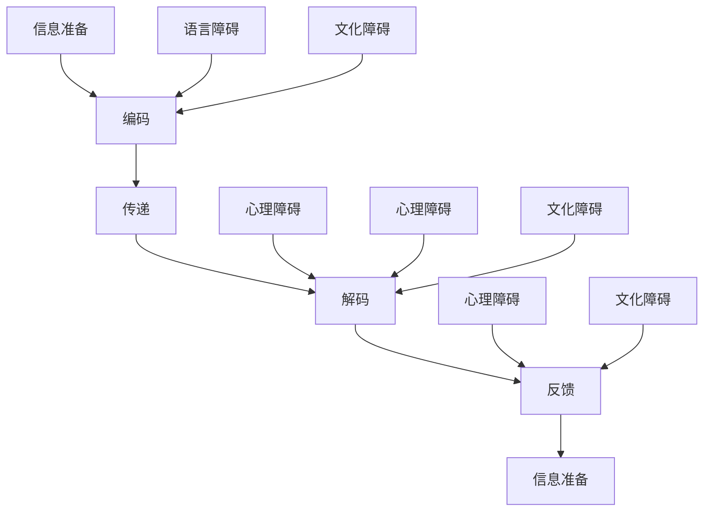
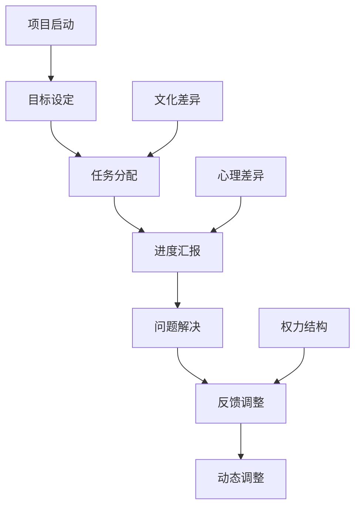
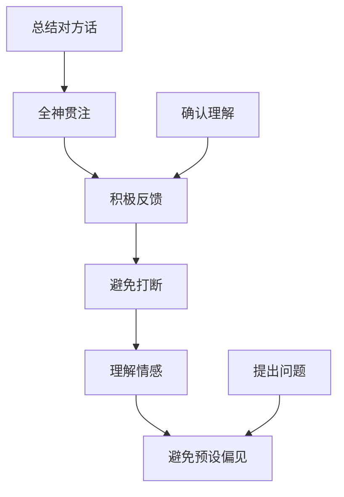
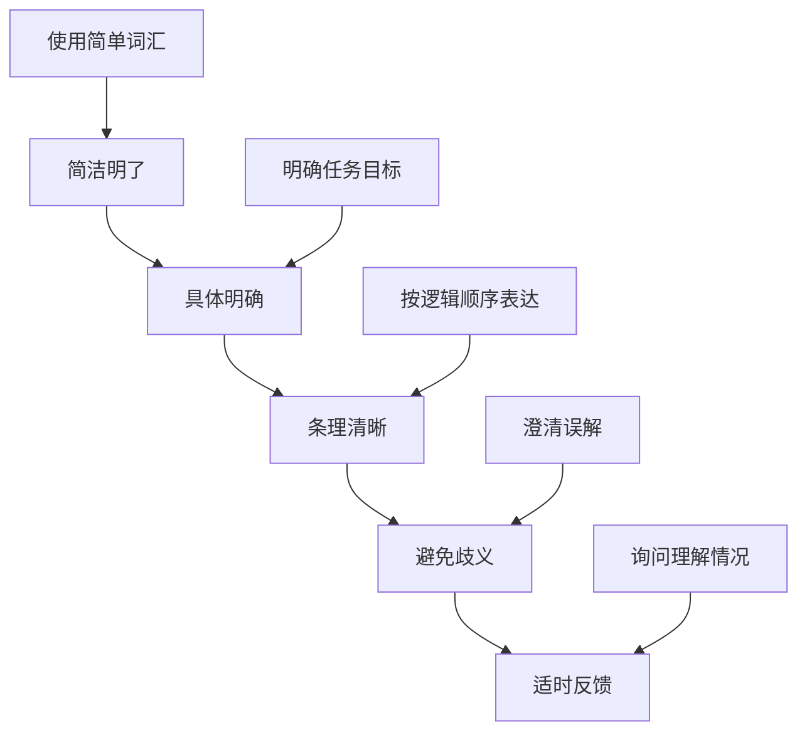
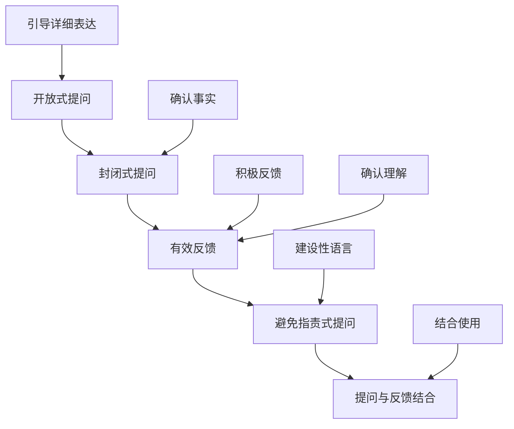
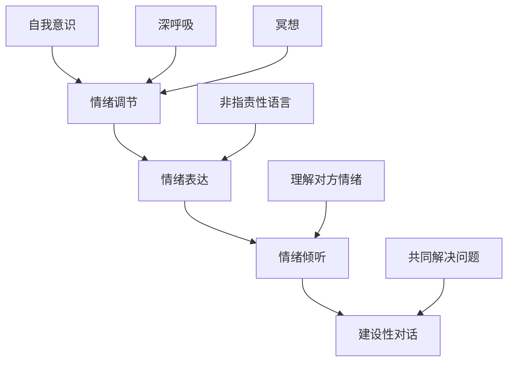
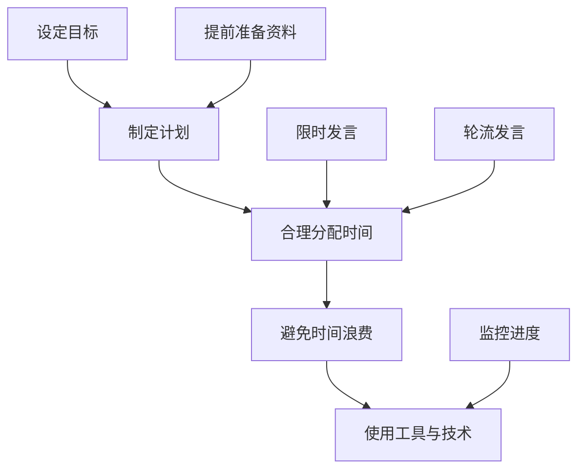

                 

### 1.1 书籍目的与背景

在现今快速发展的信息化社会中，团队沟通作为组织运作的核心要素之一，其重要性日益凸显。有效的团队沟通不仅能提升工作效率，还能促进团队凝聚力和创新能力的提升。然而，沟通障碍问题却时常困扰着各种规模的团队，成为制约组织发展的瓶颈。

本书旨在为读者提供一套系统化的团队沟通优化方法，通过深入剖析沟通障碍的本质，探讨有效沟通的技巧，从而帮助团队消除沟通障碍，提升整体沟通效率。书中内容涵盖基础概念、沟通技巧提升、案例分析、工具与方法、文化与环境构建以及评估与反馈等多个方面，力求为团队沟通优化提供全面的解决方案。

编写本书的背景主要源于以下几点：首先，随着企业规模的扩大和全球化进程的加速，团队结构变得越来越复杂，团队成员的多样性和分散性使得沟通变得更加困难。其次，信息技术的迅猛发展带来了沟通方式的多样化，但同时也增加了沟通的复杂性。最后，团队沟通效率低下导致的资源浪费和项目延期等问题日益突出，亟需找到有效的解决途径。

本书的读者对象主要包括企业管理者、团队负责人、项目经理以及广大职场人士。通过阅读本书，读者可以了解沟通障碍的类型及其对团队绩效的影响，掌握改善沟通的具体策略和技巧，从而提升团队整体沟通能力。此外，本书也适合作为高校相关课程的教学参考书，帮助学生更好地理解团队沟通的原理和实践。

总的来说，本书旨在帮助读者从理论和实践两个层面深入了解团队沟通，提供实用的方法和工具，助力团队在沟通中实现协同高效的工作状态。

### 1.2 团队沟通的重要性

团队沟通在组织运作中扮演着至关重要的角色。首先，它直接影响团队的协作效率。在团队项目中，团队成员需要相互协作、共享信息、协调进度，这些活动都依赖于有效的沟通。良好的沟通能够确保信息传递的准确性和及时性，从而避免因误解或信息不对称导致的工作效率低下。

其次，团队沟通对团队绩效有着直接的促进作用。通过有效的沟通，团队成员可以更好地理解项目的目标和要求，明确各自的角色和责任，从而减少重复工作、避免资源浪费。同时，沟通能够促进团队成员之间的相互理解和支持，增强团队的凝聚力和协作精神，这对于项目的成功至关重要。

另外，团队沟通也是组织文化的重要组成部分。一个开放、透明、支持性的沟通环境能够促进团队内部的信任和合作，有助于形成积极向上的组织氛围。这种文化不仅能够提升员工的工作满意度和忠诚度，还能提高组织的创新能力和竞争力。

然而，团队沟通不良的后果也是不可忽视的。沟通障碍可能导致团队成员之间的误解和冲突，影响团队的凝聚力和工作效率。项目进度延误、质量下降和成本超支等问题都可能源于沟通不畅。此外，长期存在沟通障碍的团队可能失去对组织使命和目标的认同，进而影响组织的整体绩效。

综上所述，团队沟通在组织中的重要性不容小觑。一个高效、和谐的沟通环境不仅能够提升团队的协作效率，还能促进组织整体绩效的提升。因此，管理者应高度重视团队沟通问题，采取积极措施消除沟通障碍，为团队创造一个良好的沟通氛围。

### 1.3 沟通障碍对团队的影响

沟通障碍对团队的影响是多方面的，首先在信息传递方面，沟通障碍会导致信息失真和延误。信息在传递过程中可能因为语言表达不清、误解或信息缺失而变形，导致团队成员对任务的理解出现偏差，进而影响工作的准确性和效率。此外，沟通障碍还会导致信息滞后，信息无法及时传递到需要的人手中，使得团队成员无法迅速作出反应，从而延误项目进度。

在团队成员关系方面，沟通障碍常常是团队冲突的根源。当团队成员之间缺乏有效沟通时，容易产生误解和猜疑，导致关系紧张。长期的沟通不畅可能导致信任危机，团队成员之间的合作意愿降低，协作效率下降。此外，沟通障碍还会导致领导与下属之间的隔阂，影响管理层的决策效果，降低团队的凝聚力和执行力。

在团队绩效方面，沟通障碍对项目成果的影响尤为显著。沟通不畅不仅会导致项目进度延误、资源浪费，还可能影响项目的质量。团队成员无法及时沟通和协调，可能导致重复工作、资源浪费，甚至出现错误和遗漏。此外，沟通障碍还会削弱团队的创新能力和解决问题的能力，影响项目的创新性和竞争力。

为解决这些沟通障碍，团队需要采取一系列管理策略。首先，管理层应重视沟通问题，建立明确的沟通机制和流程，确保信息传递的畅通和及时。其次，团队应定期进行沟通培训，提高成员的沟通技巧和表达能力，减少误解和冲突。此外，团队可以通过引入沟通工具和技术，如项目管理软件、即时通讯工具等，提升沟通效率。

最后，构建良好的团队文化也是解决沟通障碍的重要手段。一个开放、透明、支持性的团队文化能够促进团队成员之间的沟通和合作，增强团队凝聚力和信任感。管理层应通过营造良好的沟通氛围，鼓励团队成员积极参与沟通，共同解决问题，从而提高团队的整体绩效。

### 2.1 沟通的基本理论

沟通作为一种基本的社会活动，其理论基础涵盖了多个学科领域，包括社会学、心理学、语言学和传播学等。理解这些理论对于消除沟通障碍、提升团队沟通效率具有重要意义。

首先，沟通的定义与模型是沟通理论的核心。沟通可以被定义为信息从发送者到接收者的传递过程。这个过程包括信息编码（发送者将信息转化为可传递的形式）、传递（信息通过媒介进行传递）、解码（接收者将接收到的信息还原为有意义的内容）以及反馈（接收者对信息的理解和反应）。经典的沟通模型包括单向沟通模型、双向沟通模型和互动沟通模型。单向沟通模型强调信息的传递，而双向沟通模型则注重信息的反馈和互动。互动沟通模型则将沟通视为一个动态循环过程，强调信息的反复传递和调整。

其次，沟通的要素与过程也是沟通理论的重要组成部分。沟通的要素包括沟通主体（发送者和接收者）、沟通内容（信息本身）、沟通媒介（传递信息的工具或渠道）和沟通情境（沟通发生的背景和环境）。沟通过程则可以分为信息准备、信息传递、信息接收和信息反馈四个阶段。每个阶段都可能出现沟通障碍，如信息准备阶段的语言表达不清、信息传递阶段的媒介选择不当、信息接收阶段的理解偏差和信息反馈阶段的反馈不及时等。

沟通障碍的影响因素复杂多样，主要包括语言障碍、心理障碍和文化障碍等。语言障碍是指由于语言表达不清、用词不当或语言习惯不同导致的沟通困难。心理障碍包括情绪障碍、认知障碍和个性障碍等，如焦虑、自负、偏见和自我中心等。文化障碍则由于文化背景、价值观和信仰的差异导致沟通不畅。

为了更好地理解沟通障碍，我们可以通过一个简单的Mermaid流程图来展示沟通的基本过程及其障碍点：

在这个流程图中，A到F表示沟通的基本过程，而G1到G7表示可能导致沟通障碍的各种因素。通过这个流程图，我们可以更直观地理解沟通过程中可能出现的障碍，并找到针对性的解决方法。

理解沟通的基本理论，有助于我们识别和消除团队沟通中的障碍。例如，通过培训提高团队成员的语言表达能力和情绪管理技巧，可以帮助克服语言和心理障碍；通过建立跨文化沟通策略，可以减少文化差异带来的沟通障碍。总之，沟通理论为我们提供了理解沟通现象和解决沟通问题的理论基础，是提升团队沟通效率的重要工具。

### 2.2 团队沟通的特点

团队沟通具有多个独特的特点，这些特点决定了其不同于个体沟通的方式和方法。首先，团队沟通的动态性是其显著特征之一。团队沟通不是一个静态的过程，而是随着团队目标的调整、成员角色的变化以及外部环境的影响不断演变。例如，在项目启动阶段，沟通的重点可能是任务分配和目标设定；而在项目执行阶段，沟通则需要更多地关注进度汇报和问题解决。

其次，团队沟通的目标导向性也极为重要。团队沟通的每一个环节都围绕着项目目标和团队使命展开。团队成员通过沟通明确各自的责任和任务，确保每个人都在朝着共同的目标努力。例如，在一个软件开发项目中，团队成员需要通过沟通来确保代码的集成和功能测试的顺利进行，从而按时交付高质量的产品。

团队沟通的复杂性是另一个不容忽视的特点。团队成员来自不同的背景，拥有不同的技能和经验，这使得沟通过程变得复杂且多样化。沟通不仅需要考虑语言和表达方式，还需要处理个体之间的心理差异和团队内部的权力结构。例如，在一个跨文化团队中，团队成员可能来自不同的国家和地区，他们可能有不同的工作习惯、沟通风格和文化价值观，这些差异可能会增加沟通的难度。

为了更好地理解这些特点，我们可以通过一个Mermaid流程图来展示团队沟通的基本过程和特点：

在这个流程图中，A到G表示团队沟通的基本过程，而H到J表示团队沟通的特点。通过这个流程图，我们可以更清晰地看到团队沟通的动态性、目标导向性和复杂性，以及这些特点如何影响沟通的实际效果。

理解团队沟通的特点，有助于我们制定更加有效的沟通策略。例如，在面对动态变化时，团队需要灵活调整沟通方式，确保信息传递的准确性和及时性；在处理目标导向性时，团队应确保沟通内容与项目目标紧密相关，避免偏离主题；在应对复杂性时，团队应采取多样化的沟通方法和工具，以适应不同成员的需求和背景。

总之，团队沟通的特点决定了其独特的挑战和需求，通过深入理解这些特点，我们可以更好地应对团队沟通中的各种问题，提升整体沟通效果。

### 2.3 常见的沟通障碍

在团队沟通中，常见的沟通障碍主要包括语言障碍、结构障碍、心理障碍和文化障碍等。这些障碍不仅会影响信息传递的准确性，还可能引发团队成员之间的误解和冲突，从而降低团队协作效率。

首先，语言障碍是团队沟通中最为常见的问题之一。语言障碍包括语言表达不清、用词不当、语言习惯不同等。例如，在跨文化团队中，团队成员可能来自不同的语言背景，他们使用不同的词汇和表达方式，这可能导致信息传递的误差。此外，一些专业术语和行话也可能使非专业人员难以理解，从而影响沟通效果。

其次，结构障碍也是导致沟通不畅的重要原因。结构障碍主要包括组织结构不合理、沟通渠道不畅通、信息传递路径过长等。例如，在一个层级结构复杂的组织中，信息可能需要经过多个层级的传递，这不仅会延误信息到达的时间，还可能增加信息失真的风险。此外，如果团队成员没有明确的沟通职责和权限，也容易导致信息传递的混乱和低效。

心理障碍则是影响团队沟通的深层次因素。心理障碍包括情绪障碍、认知障碍和个性障碍等。情绪障碍如焦虑、愤怒和紧张等，可能会影响团队成员的情绪状态，导致他们在沟通中难以保持冷静和理性。认知障碍则包括偏见、自负和过度自信等，这些心理因素可能导致团队成员在沟通中难以接受他人的观点，从而阻碍有效的沟通。个性障碍如自我中心和固执等，也会阻碍团队内部的开放性和合作性，影响沟通的顺畅进行。

最后，文化障碍是跨国团队和多元文化团队中普遍存在的问题。文化障碍主要包括文化差异、价值观差异和信仰差异等。不同文化背景的团队成员可能在沟通风格、决策方式和行为准则等方面存在显著差异，这可能导致沟通中的误解和冲突。例如，一些文化倾向于直接表达和决策，而另一些文化则更倾向于间接和协商，这种差异可能导致沟通中的冲突和摩擦。

为克服这些沟通障碍，团队可以采取以下策略：

1. **提升语言能力**：团队成员应通过培训和学习提升自己的语言表达能力，特别是跨文化团队中的成员应熟悉对方的文化背景和语言习惯，以减少语言障碍。

2. **优化沟通结构**：组织应设计合理的沟通结构，确保信息传递的畅通和高效。例如，可以设立专门的沟通岗位或信息传递渠道，减少信息传递的层级和路径。

3. **培养心理素质**：团队成员应通过心理训练和情绪管理提升自己的心理素质，学会在沟通中保持冷静和理性，避免情绪化的行为。

4. **增强文化理解**：组织应鼓励团队成员了解和尊重不同的文化背景，通过跨文化培训和文化交流活动增强团队成员之间的文化理解，减少文化障碍。

通过这些策略，团队可以有效克服沟通障碍，提升沟通效率，从而更好地实现团队目标。

### 3.1 倾听技巧

倾听技巧在团队沟通中至关重要，它是确保信息准确传递和理解的关键。有效的倾听不仅能提高沟通效率，还能增强团队成员之间的信任和合作。以下是几种提升倾听技巧的方法：

首先，全神贯注地听。在沟通过程中，倾听者应保持专注，避免分心。这可以通过关闭手机、排除干扰因素等方式来实现。全神贯注的倾听不仅能够确保接收者准确理解信息，还能向发送者传递出尊重和关注。

其次，积极反馈。在倾听过程中，倾听者应通过点头、眼神接触和肢体语言等非语言信号，表明自己正在认真倾听。此外，适时地提出问题或总结对方的话，可以帮助确认自己的理解是否准确，同时也鼓励发送者继续表达。

第三，避免打断。在沟通中，倾听者应避免急于表达自己的观点或意见，打断对方的发言。这不仅会阻碍沟通的流畅性，还可能使发送者感到不被尊重。在对方表达完毕后，再提出疑问或进行补充，有助于建立良好的沟通氛围。

第四，理解情感。在倾听过程中，倾听者不仅要理解对方的话语内容，还要关注对方的情感状态。通过语气、语调、面部表情等非语言信号，倾听者可以更好地把握对方的情绪，从而更准确地理解其真实意图。

最后，避免预设偏见。倾听者应保持开放的心态，避免根据个人经验或偏见来评判对方的发言。这有助于消除误解和冲突，建立基于事实和理解的沟通。

以下是一个简单的倾听技巧流程图，展示上述要点：

通过这个流程图，我们可以更清晰地看到有效倾听的步骤和方法。通过实践这些技巧，团队成员可以显著提高沟通质量，减少误解和冲突，从而提升团队协作效率。

### 3.2 明确表达

明确表达是有效沟通的另一个重要方面。团队成员在沟通过程中，需要确保信息传递的准确性和清晰度，避免因表述不清而导致误解。以下是一些提高明确表达技巧的方法：

首先，简洁明了。在表达观点时，应尽量简洁明了，避免使用冗长、复杂的句子和词汇。简洁的表达能够减少信息传递过程中的冗余，提高沟通效率。例如，使用简单的词汇和短句代替复杂的术语和长篇大论。

其次，具体明确。在描述任务、目标和问题时，应尽量具体和明确。具体明确的信息有助于团队成员更好地理解任务要求，从而减少因模糊不清而产生的误解。例如，在分配任务时，不仅说明任务内容，还应明确任务的目标、截止时间和验收标准。

第三，条理清晰。在表达观点时，应遵循逻辑顺序，确保信息传达的条理性。有条理的表达能够帮助团队成员更容易地理解和吸收信息。例如，在汇报项目进度时，可以按照时间顺序、任务类别或工作重点来组织信息。

第四，避免歧义。在沟通中，应尽量避免使用可能引起歧义的表达方式。对于可能产生误解的词汇或句子，应进行澄清，确保信息的准确性。例如，在讨论项目风险时，应明确风险的定义、可能的影响和应对措施，避免产生模糊的描述。

第五，适时反馈。在表达过程中，适时地询问对方的理解情况，可以确保信息传达的准确性。通过反馈，发送者可以了解接收者对信息的理解程度，及时调整表达方式，避免误解。

以下是一个简单的明确表达技巧流程图，展示上述要点：

通过这个流程图，我们可以更清晰地看到明确表达的关键技巧。实践这些技巧，团队成员可以显著提高沟通质量，减少误解和冲突，从而提升团队协作效率。

### 3.3 提问与反馈技巧

在团队沟通中，提问与反馈是确保信息准确理解和有效传递的重要手段。恰当的提问和有效的反馈不仅有助于澄清模糊的信息，还能促进团队成员之间的互动和合作。以下是几种提高提问与反馈技巧的方法：

首先，开放式提问。开放式提问是一种能够引导对方详细表达自己观点和想法的提问方式。这类问题通常以“什么”、“如何”、“为什么”等开头，能够鼓励对方提供更多的信息。例如，“你能详细解释一下这个任务的背景和目标吗？”这种提问方式可以促使对方深入阐述，从而确保团队成员对任务的理解一致。

其次，封闭式提问。封闭式提问通常用于确认某个信息或事实，这类问题通常可以用简短的回答（如“是”或“不是”）来回答。例如，“这个任务截止日期是下周三对吗？”这种问题可以迅速澄清事实，避免因误解而产生的矛盾。

第三，反馈技巧。有效的反馈应包括对信息的确认和理解。在提供反馈时，应尽量使用积极和建设性的语言。例如，“我理解你的意思是……，这样是否准确？”这种反馈方式不仅表明了倾听者的理解，还为对方提供了澄清和确认的机会。此外，及时反馈也是非常重要的，因为延迟的反馈可能导致误解和错误的积累。

第四，避免指责式提问。在提问时，应避免使用指责或攻击性的语言，因为这会破坏沟通氛围，导致对方产生防御心理。例如，将“你为什么没有按时完成任务？”改为“我们能否讨论一下任务延期的问题，看看是否有改进的空间？”这样可以更有效地促进沟通。

第五，提问与反馈的结合。在沟通中，提问和反馈应结合起来使用。通过提问，可以引导对方提供更多信息；而通过反馈，可以确认信息的准确性。例如，在项目会议上，项目经理可以通过提问了解团队成员的进展情况，并通过反馈确认信息的理解是否一致。

以下是一个简单的提问与反馈技巧流程图，展示上述要点：

通过这个流程图，我们可以更清晰地看到提问与反馈的关键技巧。实践这些技巧，团队成员可以更有效地进行沟通，减少误解和冲突，从而提升团队协作效率。

### 3.4 情绪管理

情绪管理是提升团队沟通效率的重要一环。情绪管理不仅关乎个人心理健康，还直接影响团队的协作氛围和工作效率。以下是一些情绪管理的方法和策略，帮助团队成员在沟通中保持冷静和理性：

首先，自我意识。了解自己的情绪状态是情绪管理的第一步。通过自我观察和反思，团队成员可以识别自己情绪的触发点和变化规律。例如，在感到焦虑或紧张时，可以通过深呼吸或短暂的休息来调节情绪。

其次，情绪调节。当情绪出现波动时，采取适当的调节方法可以缓解负面情绪。常见的调节方法包括深呼吸、冥想、运动等。例如，在紧张的会议或项目讨论中，短暂的深呼吸可以帮助团队成员恢复冷静。

第三，情绪表达。在沟通中，恰当的情绪表达能够传达真实的感受，同时避免过度情绪化。团队成员应学会使用非指责性的语言表达情绪，例如，“我感到有些焦虑，担心任务无法按时完成。”这种表达方式不仅传达了情绪，还表明了对问题的关注和解决方案的期望。

第四，情绪倾听。在沟通中，倾听对方的情绪表达同样重要。通过倾听，团队成员可以理解对方的情绪状态，从而采取适当的应对措施。例如，在团队成员情绪激动时，倾听者可以通过保持冷静和耐心来缓解对方的情绪。

第五，建设性对话。在处理情绪问题时，应避免使用攻击性或指责性的语言。相反，应采用建设性的对话方式，共同寻找解决问题的方法。例如，“我理解你的担忧，我们可以一起讨论如何解决这个问题。”

以下是一个简单的情绪管理策略流程图，展示上述要点：

通过这个流程图，我们可以更清晰地看到情绪管理的方法和策略。实践这些技巧，团队成员可以更好地控制情绪，提升沟通质量，从而促进团队的协作和效率。

### 3.5 时间管理

时间管理在团队沟通中至关重要，它不仅有助于提高工作效率，还能确保项目按时交付。以下是几种有效的时间管理策略，帮助团队成员更好地安排沟通活动：

首先，设定明确的目标。在开始沟通前，应明确沟通的目标和期望结果。这有助于团队成员集中精力，避免在沟通过程中偏离主题。例如，在项目会议中，可以提前列出讨论的议题和目标，确保会议内容有序进行。

其次，制定详细的计划。沟通活动应按照详细的计划进行，包括会议时间、议程、参与人员和预期成果等。例如，可以提前准备会议议程，分配发言时间和任务，确保会议高效有序。

第三，合理分配时间。在沟通过程中，应合理分配时间，确保每个议题都能得到充分讨论。例如，在团队会议中，可以通过限时发言和轮流发言的方式，避免单个议题占用过多时间。

第四，避免时间浪费。在沟通中，应尽量避免不必要的讨论和重复的内容。例如，通过提前准备资料和进行简短的预讨论，可以减少会议中的冗余信息。

第五，使用工具与技术。利用各种时间管理工具和技术，如日历、提醒软件和项目管理工具，可以帮助团队成员更好地安排和跟踪沟通活动。例如，使用项目管理工具可以实时监控项目进度和沟通情况，确保任务按时完成。

以下是一个简单的时间管理策略流程图，展示上述要点：

通过这个流程图，我们可以更清晰地看到时间管理的方法和策略。实践这些技巧，团队成员可以更高效地安排和进行沟通活动，从而提升团队协作效率。

### 4.1 成功沟通优化案例分析

为了更好地理解如何通过沟通优化提升团队效率，以下将通过两个具体案例，展示沟通优化在实际应用中的成功经验。

#### 案例一：一家大型软件公司的沟通优化实践

某大型软件公司在项目开发过程中遇到了沟通不畅的问题，导致项目进度延误和成本超支。经过分析，公司发现主要问题在于沟通结构不合理和团队成员语言表达能力不足。为了解决这些问题，公司采取了一系列措施：

1. **优化沟通结构**：公司重新设计了沟通架构，设立了专门的沟通岗位，负责协调和传递项目信息。此外，明确了各层级的沟通职责和权限，确保信息传递的畅通和高效。

2. **语言培训**：公司组织了多场语言培训，提高了团队成员的语言表达能力和跨文化沟通技巧。特别是针对国际团队成员，开展了专门的语言和文化适应性培训。

3. **引入沟通工具**：公司引入了项目管理软件和即时通讯工具，提升了沟通效率和透明度。团队成员可以通过这些工具实时共享信息和进度，减少了信息传递的延误。

通过这些措施，公司的沟通效率显著提高，项目进度得以按时完成，成本也得到了有效控制。

#### 案例二：一家初创企业的敏捷团队沟通优化

另一家初创企业在团队协作过程中，由于团队成员分散在不同地点，沟通效率低下，项目进展缓慢。为了改善这一状况，企业采取了以下策略：

1. **敏捷沟通框架**：企业采用了敏捷开发方法，建立了每日站会、迭代回顾和迭代计划会议等沟通机制。这些机制有助于团队成员及时沟通项目进展和问题，确保信息的快速传递和反馈。

2. **文化塑造**：企业通过团队建设活动和开放的沟通氛围，培养了团队成员之间的信任和协作精神。例如，定期组织团建活动，鼓励团队成员分享经验和想法，从而增强团队的凝聚力。

3. **使用协作工具**：企业引入了项目管理软件和协作平台，如Trello和Slack，帮助团队成员高效地进行任务分配、进度跟踪和沟通。这些工具不仅提高了沟通效率，还确保了信息的透明和实时更新。

通过这些沟通优化措施，初创企业的团队协作效率显著提升，项目周期缩短，产品交付质量也得到了保证。

这两个案例表明，通过合理的沟通优化措施，企业可以显著提升团队沟通效率，从而促进项目成功。实践证明，优化沟通结构、提升语言能力、引入沟通工具和建立积极的文化氛围都是实现有效沟通的关键因素。

### 4.2 沟通失败案例分析

沟通失败在团队项目中并不少见，其后果往往严重影响了项目进度和团队士气。以下将通过一个具体案例，分析沟通失败的原因及其对项目的影响，并提出改进建议。

#### 案例背景

某科技公司在开发一款智能家居产品时，由于沟通不畅导致项目进度严重延误，最终影响了产品的上市时间。项目团队由软件工程师、硬件工程师和产品经理组成，分别分布在不同的办公地点。在项目开发过程中，团队成员经常因为信息传递不准确、任务分工不清晰和需求变更沟通不及时等问题而发生冲突。

#### 沟通失败原因

1. **沟通结构不合理**：项目初期，团队没有建立明确的沟通渠道和流程，信息传递路径过长，导致信息延误和失真。团队成员之间的沟通主要依赖于邮件和电话，信息传递效率低下。

2. **信息不对称**：部分团队成员对项目需求的理解不一致，导致在开发过程中频繁出现需求变更和返工。例如，软件工程师根据产品经理的初步需求开发了功能模块，但后续发现硬件工程师对需求的理解有偏差，导致模块无法正常集成。

3. **缺乏反馈机制**：团队没有建立有效的反馈机制，导致问题无法及时发现和解决。例如，在项目中期，软件工程师发现代码存在性能问题，但由于未及时反馈给产品经理，导致问题被忽略，最终影响了整个系统的稳定性。

4. **文化差异**：团队成员来自不同的文化背景，沟通风格和价值观存在差异。例如，软件工程师倾向于直接提出问题和解决方案，而硬件工程师则更倾向于通过内部讨论来解决问题，这种差异导致了沟通不畅和冲突。

#### 沟通失败对项目的影响

1. **项目进度延误**：由于沟通不畅，项目多次出现需求变更和返工，导致项目进度严重滞后。原本计划在六个月内完成的开发任务，最终拖延了近三个月。

2. **成本增加**：频繁的需求变更和返工导致项目成本增加，预算超支。此外，为了追赶进度，团队不得不加班加点，进一步增加了人力成本。

3. **团队士气低落**：沟通失败导致团队成员之间关系紧张，工作效率下降，团队士气受到影响。团队成员对项目进展缺乏信心，导致心理压力增大。

#### 改进建议

1. **建立有效的沟通渠道**：设立专门的沟通岗位，负责协调和传递项目信息。引入项目管理软件和即时通讯工具，确保信息传递的及时性和准确性。

2. **明确任务分工和需求**：在项目初期，应明确每个团队成员的任务和职责，确保需求清晰。通过文档和会议等形式，确保所有成员对需求的理解一致。

3. **建立反馈机制**：建立定期反馈机制，确保问题能够及时发现和解决。例如，每周召开一次项目会议，汇报项目进展和遇到的问题，共同讨论解决方案。

4. **加强文化融合**：组织跨文化培训，提高团队成员的文化敏感度和沟通技巧。鼓励团队成员尊重和理解彼此的文化差异，建立和谐的团队氛围。

通过以上改进措施，可以有效避免沟通失败，提升团队协作效率，确保项目顺利进行。

### 4.3 案例总结与启示

通过对以上成功和失败的沟通优化案例分析，我们可以得出以下总结与启示：

1. **沟通优化的重要性**：有效的沟通优化是确保项目成功的关键。通过优化沟通结构、明确任务分工、建立反馈机制和加强文化融合，团队可以显著提升沟通效率，减少误解和冲突，确保项目按计划进行。

2. **具体措施的有效性**：成功案例表明，建立有效的沟通渠道、引入沟通工具、明确需求和建立反馈机制等措施是行之有效的。这些措施不仅提升了沟通效率，还增强了团队的协作和信任。

3. **沟通失败的风险**：沟通失败可能导致项目进度延误、成本增加和团队士气低落。因此，在项目初期应高度重视沟通问题，及时识别和解决沟通障碍，防止问题积累和扩大。

4. **持续改进的重要性**：沟通优化不是一次性的任务，而是一个持续改进的过程。团队应定期评估沟通效果，根据实际情况调整沟通策略和措施，确保沟通始终高效和顺畅。

总之，通过有效的沟通优化，团队可以更好地应对复杂的项目挑战，提升整体协作效率和项目成功率。未来，组织应持续关注和改进团队沟通，为项目成功奠定坚实基础。

### 5.1 沟通分析工具

在团队沟通优化中，沟通分析工具扮演着关键角色，能够帮助团队识别和解决沟通问题。以下是一些常用的沟通分析工具及其功能：

#### 5.1.1 SWOT分析

SWOT分析是一种战略规划工具，用于评估团队的优势、劣势、机会和威胁。通过SWOT分析，团队可以明确自身在沟通中的优势与劣势，从而制定针对性的改进措施。例如，如果团队发现内部沟通渠道不畅通，这是劣势之一，团队可以通过优化沟通结构来改善。

#### 5.1.2 5W2H分析法

5W2H分析法是一种结构化的沟通工具，通过询问“什么（What）、为什么（Why）、谁（Who）、何时（When）、哪里（Where）、如何（How）、多少（How much）”等问题，帮助团队全面理解沟通需求。这种方法能够确保所有关键信息都得到充分讨论，从而避免遗漏重要细节。

#### 5.1.3 访谈法

访谈法是通过与团队成员进行一对一或小组访谈，了解他们在沟通中的实际体验和意见。这种方法可以获取深入、具体的反馈，有助于识别沟通中的具体问题和潜在障碍。例如，通过访谈可以了解团队成员对现有沟通工具的使用感受，从而评估这些工具的适用性。

#### 5.1.4 数据分析工具

数据分析工具如Excel、Tableau等，可以用于分析团队沟通的量化数据，如会议频率、信息传递速度和反馈时间等。通过数据分析，团队可以直观地了解沟通效率，并发现改进的潜在方向。

#### 5.1.5 Mermaid流程图

Mermaid流程图是一种用于绘制流程图的工具，可以帮助团队可视化沟通流程和流程中的关键环节。通过流程图，团队可以清晰地看到沟通的每一个步骤和可能的障碍点，从而更好地优化沟通流程。

这些沟通分析工具各具特色，可以根据团队的具体需求选择合适的工具。通过综合使用这些工具，团队可以全面评估和改善沟通效果，提升整体协作效率。

### 5.2 沟通技巧训练工具

为了提升团队成员的沟通技巧，各种沟通技巧训练工具被广泛应用。这些工具不仅帮助团队成员学习和实践有效的沟通策略，还能通过模拟和反馈机制提高实际沟通能力。以下是一些常见的沟通技巧训练工具及其应用方法：

#### 5.2.1 沟通模拟软件

沟通模拟软件是一种通过虚拟环境模拟真实沟通场景的工具。例如，一些软件提供了对话模拟功能，允许团队成员进行角色扮演，模拟项目会议、团队讨论和跨文化沟通等场景。通过这种模拟，团队成员可以在安全的环境中练习沟通技巧，如明确表达、有效倾听和反馈技巧。模拟软件通常还提供即时反馈和评分机制，帮助团队成员了解自己的沟通表现，并及时进行调整。

#### 5.2.2 沟通培训课程

沟通培训课程是通过系统化的培训内容，帮助团队成员掌握沟通技巧。这些课程通常包括讲座、案例分析、角色扮演和小组讨论等多种形式。例如，一些培训课程专注于提升团队成员的语言表达能力、非语言沟通技巧和心理素质。通过这些课程，团队成员可以系统地学习沟通理论，并在实际案例中应用所学知识，从而提升沟通效果。

#### 5.2.3 在线学习平台

在线学习平台提供丰富的沟通技巧学习资源和练习题。例如，通过这些平台，团队成员可以观看沟通技巧的视频教程，完成在线测试和练习，并获得实时反馈。此外，一些在线平台还提供一对一的导师辅导服务，帮助团队成员解决具体的沟通问题。这些平台不仅方便灵活，还能根据个人需求进行定制化学习。

#### 5.2.4 沟通反馈工具

沟通反馈工具通过记录和分析团队成员的沟通行为，提供具体的反馈和建议。例如，一些工具可以在会议结束后生成详细的会议记录和沟通报告，包括每个成员的发言次数、发言内容和反馈质量等。这些反馈工具有助于团队成员了解自己的沟通表现，并发现需要改进的领域。此外，一些工具还支持团队成员之间的互评功能，通过相互反馈来提升整体沟通能力。

通过综合使用这些沟通技巧训练工具，团队成员可以系统地学习沟通理论，实践沟通技巧，并获得实时反馈，从而不断提高沟通能力。这些工具不仅有助于提升个人沟通技巧，还能促进团队的协作效率和整体沟通效果的提升。

### 5.3 沟通平台与工具

在现代团队沟通中，沟通平台和工具的选择和使用至关重要。这些平台和工具不仅能够提升沟通效率，还能帮助团队更好地管理和协调各项工作。以下介绍几种常见的沟通平台和工具及其应用场景。

#### 5.3.1 项目管理工具

项目管理工具如JIRA、Trello和Asana等，是团队协作和沟通的核心平台。这些工具提供了任务分配、进度跟踪和协作功能，帮助团队成员清晰地了解项目的状态和各自的职责。例如，JIRA允许团队成员创建和跟踪任务，设置任务优先级和截止日期，并通过通知和讨论功能保持沟通畅通。Trello和Asana则提供了可视化的看板和卡片系统，便于团队成员直观地了解项目的进展情况。

#### 5.3.2 即时通讯工具

即时通讯工具如Slack、Microsoft Teams和WhatsApp等，是团队内部沟通的重要工具。这些工具支持文本、语音和视频通讯，提供实时消息传递和文件共享功能，极大地提升了沟通的效率和便利性。例如，Slack允许创建多个聊天室，将团队成员分配到不同的频道中，便于按主题或项目进行沟通。Microsoft Teams则结合了视频会议、即时消息和文档共享功能，为团队提供了全面的沟通和协作解决方案。

#### 5.3.3 视频会议工具

视频会议工具如Zoom、Google Meet和Microsoft Teams等，是远程团队和跨地区团队进行面对面沟通的关键工具。这些工具支持多人视频会议、屏幕共享和实时讨论，使得团队成员可以随时随地召开会议，讨论项目进展和解决问题。例如，Zoom提供了高质量的音视频传输和互动功能，支持远程协作和虚拟会议，适用于各种规模的团队。

#### 5.3.4 文档共享与管理工具

文档共享与管理工具如Google Drive、OneDrive和Dropbox等，是团队协作中不可或缺的工具。这些工具允许团队成员共享和编辑文档，实时更新项目文件，确保所有成员都能访问最新版本。例如，Google Drive支持多人在线编辑文档，团队成员可以实时协作，避免了因版本冲突导致的沟通障碍。OneDrive和Dropbox则提供了云存储服务，方便团队成员在不同设备和地点访问和共享文件。

通过合理选择和使用这些沟通平台和工具，团队可以显著提升沟通效率，减少误解和冲突，确保项目顺利进行。每种工具都有其独特的优势和适用场景，团队应根据具体需求进行选择和整合，以实现最佳沟通效果。

### 6.1 组织文化对沟通的影响

组织文化在团队沟通中扮演着至关重要的角色，它不仅影响着团队成员的沟通方式，还决定了沟通的有效性和团队的整体绩效。一个积极向上的组织文化可以促进团队沟通，增强团队成员之间的信任和合作，从而提升团队的整体效率和创新能力。

首先，开放透明的组织文化有助于提升沟通的效率。在这种文化背景下，团队成员更容易分享信息、表达观点和提出建议，无需担心因表达不当而受到批评或惩罚。这种开放的氛围能够减少信息封锁和权力集中，确保信息在团队内自由流动。例如，谷歌公司以其开放透明的文化而著称，鼓励员工自由交流、分享创意，这使得谷歌在技术革新和产品开发方面取得了显著成就。

其次，支持性的组织文化能够促进团队成员之间的信任和合作。在这种文化中，团队成员感受到管理层和同事的支持，愿意在沟通中开放自己，接受他人的反馈和建议。支持性的组织文化强调团队协作和共同目标，使团队成员在沟通中更加注重团队利益而非个人利益。例如，惠普公司通过其“开放门政策”鼓励员工与管理层直接沟通，这种支持性的文化极大地增强了员工的归属感和沟通效果。

再次，积极的组织文化能够提升团队成员的士气和工作动力，从而增强沟通的积极性。在一个积极向上的文化氛围中，团队成员感受到组织的关心和支持，工作压力得到缓解，这有助于他们在沟通中保持开放和积极的态度。例如，诺基亚公司通过其“创新文化”鼓励员工不断尝试新事物，这种积极的氛围激发了员工的创造力和沟通动力，促进了公司的发展。

最后，组织文化对跨文化团队沟通也具有重要影响。在一个尊重多元文化和多样性的文化中，团队成员更容易理解和接受不同的观点和沟通方式，从而减少文化冲突和沟通障碍。例如，国际咨询公司麦肯锡（McKinsey & Company）通过其多元化的企业文化，吸引了来自世界各地的优秀人才，并通过跨文化培训和文化交流活动，增强了团队成员之间的沟通和理解。

总之，组织文化对团队沟通具有重要影响。一个开放透明、支持性、积极和尊重多元文化的组织文化，能够促进团队沟通，提升整体效率和创新能力。为了实现有效的团队沟通，组织应努力营造和维持这种积极的组织文化，为团队成员提供一个良好的沟通环境。

### 6.2 管理层在沟通优化中的作用

在团队沟通优化中，管理层的作用至关重要。管理层不仅负责制定沟通策略和优化方案，还必须以身作则，推动团队成员积极参与沟通，并确保沟通目标的实现。以下是管理层在沟通优化中的几个关键角色和行动建议：

#### 1. 制定明确的沟通策略

管理层应首先制定一套明确的沟通策略，确保团队内部的沟通有章可循。这包括设定沟通目标、确定沟通频率和方式、明确沟通渠道和责任分配等。例如，可以制定定期团队会议、项目进展汇报和即时反馈机制等，以确保信息在团队内及时、准确传递。

#### 2. 身教重于言传

管理层应通过自身的言行示范，树立良好的沟通榜样。领导者的沟通方式直接影响团队成员的沟通态度和行为。例如，领导者在会议中应保持开放和尊重的态度，鼓励团队成员积极表达意见，避免独揽话语权，从而营造一个开放和包容的沟通氛围。

#### 3. 强化沟通培训

管理层应定期组织沟通培训，提高团队成员的沟通技巧和表达能力。这些培训可以包括倾听技巧、表达技巧、情绪管理技巧等。通过培训，团队成员可以更好地理解沟通的重要性和方法，提高沟通效率。

#### 4. 建立反馈机制

管理层应建立有效的反馈机制，确保团队成员能够及时了解自己的沟通表现，并得到改进建议。例如，可以设立匿名反馈渠道，让团队成员可以自由表达对沟通过程的意见和建议。管理层应认真对待这些反馈，并采取相应措施进行改进。

#### 5. 营造积极的文化氛围

管理层应通过各种方式，营造一个积极、开放和包容的团队文化，鼓励团队成员在沟通中相互尊重、支持和合作。例如，可以通过团队建设活动、文化活动等方式，增强团队成员之间的信任和合作意识。

#### 6. 鼓励跨部门沟通

管理层应鼓励跨部门沟通，打破部门之间的壁垒，促进信息共享和协作。可以通过设立跨部门项目组、定期组织跨部门会议等方式，促进不同部门之间的沟通与合作。

#### 7. 评估和奖励沟通绩效

管理层应定期评估团队的沟通效果，对表现出色的团队成员给予奖励和认可。这不仅能激励团队成员积极沟通，还能提升团队的整体沟通水平。

通过以上措施，管理层可以在团队沟通优化中发挥重要作用，提升团队的协作效率，确保项目成功实施。

### 6.3 沟通环境建设策略

构建一个良好的沟通环境是团队沟通优化的关键。以下是几个有效的策略，帮助团队建立一个高效、和谐、支持性的沟通环境：

#### 1. 明确沟通目标和期望

在团队成立之初，管理层应与团队成员一起明确沟通的目标和期望。这包括沟通的内容、频率、方式和目标等。通过共同设定沟通目标，团队成员可以明确自己的沟通责任，从而提高沟通的针对性和效率。

#### 2. 设计合理的沟通结构

团队应根据项目需求和成员的角色，设计合理的沟通结构。这包括确定沟通的层级和渠道，明确各级别沟通的职责和权限。例如，可以设立项目管理委员会、跨部门沟通小组和日常沟通会议等，确保信息在不同层级和部门之间顺畅传递。

#### 3. 提供必要的沟通工具和资源

为了确保沟通的有效性，团队应提供必要的沟通工具和资源。这些工具包括项目管理软件、即时通讯工具、视频会议系统等。此外，团队还应确保这些工具的使用培训和支持，帮助成员熟练使用这些工具，提高沟通效率。

#### 4. 培养良好的沟通习惯

良好的沟通习惯是高效沟通的基础。团队应通过培训和引导，培养成员的以下良好习惯：主动沟通、明确表达、倾听他人、尊重差异、及时反馈等。通过这些习惯的培养，团队成员可以在日常沟通中更加自信和高效。

#### 5. 建立积极的沟通氛围

一个积极的沟通氛围有助于团队成员放松心态，开放表达自己的观点和感受。团队可以通过以下方式建立积极的沟通氛围：鼓励开放和诚实的沟通、认可和奖励积极沟通的行为、尊重和接纳不同的意见和观点。

#### 6. 定期评估和反馈

为了持续优化沟通环境，团队应定期评估沟通的效果，收集成员的反馈和建议。这可以通过问卷调查、面谈、小组讨论等方式进行。管理层应根据评估结果和反馈，调整和改进沟通策略，确保沟通环境不断优化。

#### 7. 强化跨文化沟通能力

对于跨国团队和多元文化团队，强化跨文化沟通能力尤为重要。团队可以通过跨文化培训、文化交流活动等方式，提高成员对不同文化的理解和适应能力，减少文化差异带来的沟通障碍。

通过实施这些策略，团队可以建立一个高效、和谐、支持性的沟通环境，提升整体沟通效果，促进团队的协作和成长。

### 7.1 沟通效果评估方法

为了确保团队沟通的有效性，建立一套科学的沟通效果评估方法是至关重要的。以下介绍几种常用的评估方法及其具体实施步骤：

#### 7.1.1 沟通满意度调查

沟通满意度调查是一种通过问卷或访谈形式，了解团队成员对沟通满意度的方法。这种方法可以通过以下步骤实施：

1. **设计问卷或访谈提纲**：根据团队的具体需求和沟通情况，设计包含多个维度的问卷或访谈提纲，如沟通频率、信息准确性、反馈及时性等。
2. **收集数据**：通过在线问卷、纸质问卷或面对面访谈等方式，收集团队成员的反馈数据。
3. **分析数据**：对收集到的数据进行统计分析，识别沟通中存在的问题和改进点。
4. **反馈结果**：将分析结果反馈给团队成员，并讨论改进措施。

#### 7.1.2 沟通效率分析

沟通效率分析是通过量化的数据，评估团队沟通的效率。这种方法可以采用以下步骤：

1. **确定评估指标**：根据团队的具体情况，确定沟通效率的评估指标，如会议时间、信息传递速度、任务完成时间等。
2. **收集数据**：记录和分析相关的沟通数据，如会议记录、信息传递记录、任务进度等。
3. **计算效率**：使用计算公式，如会议效率指标（会议时间/任务完成时间）、信息传递效率指标（信息传递时间/任务完成时间）等，计算沟通效率。
4. **分析结果**：对比不同时间段或不同团队的沟通效率，识别效率较高的环节和需要改进的领域。

#### 7.1.3 成果评估

成果评估是通过评估沟通对项目成果的影响，来判断沟通的有效性。这种方法可以采用以下步骤：

1. **确定成果指标**：根据项目的目标，确定沟通效果的评价指标，如项目进度、质量、成本等。
2. **收集数据**：记录和分析项目的实际成果数据，如项目完成时间、产品质量评分、成本超支情况等。
3. **对比分析**：对比沟通前后的项目成果数据，评估沟通对成果的影响。
4. **总结反馈**：总结沟通对项目成果的具体贡献和存在的问题，为后续沟通优化提供依据。

通过这些评估方法，团队可以全面了解沟通的效果，发现存在的问题，并采取相应的改进措施，从而不断提升沟通效率和质量。

### 7.2 反馈机制建设

建立有效的反馈机制是团队沟通优化的重要一环，它有助于及时识别和解决沟通问题，促进团队成员之间的相互理解和协作。以下是构建反馈机制的基本步骤及其关键要素：

#### 7.2.1 明确反馈目标

首先，团队需要明确反馈的目标，即希望通过反馈实现什么结果。这包括提升沟通效率、改善团队成员之间的理解、增强团队凝聚力等。明确的目标有助于确保反馈机制的设计和实施具有针对性。

#### 7.2.2 确定反馈渠道

接下来，团队应确定多种反馈渠道，确保反馈信息能够畅通无阻地传递。这些渠道可以包括以下几种：

1. **匿名反馈**：提供匿名反馈选项，鼓励团队成员大胆提出意见和建议，避免因担心报复而不敢发声。
2. **定期会议**：设立定期反馈会议，如每月一次，让团队成员有机会面对面交流，分享经验和反馈。
3. **在线平台**：使用在线反馈平台或工具，如问卷星、钉钉等，方便团队成员随时提交反馈。
4. **一对一交流**：管理层应定期与团队成员进行一对一交流，了解他们的工作情况和沟通体验。

#### 7.2.3 制定反馈流程

为了确保反馈机制的有效运行，团队需要制定详细的反馈流程，包括以下步骤：

1. **收集反馈**：通过多种渠道收集团队成员的反馈，确保信息的全面性和真实性。
2. **分类整理**：将收集到的反馈按照主题或类别进行分类整理，便于分析和处理。
3. **评估反馈**：对反馈进行评估，确定其重要性和可行性，并制定相应的改进措施。
4. **反馈结果**：将评估结果和改进措施反馈给团队成员，确保他们了解反馈的处理情况和后续改进计划。
5. **跟踪改进**：定期跟踪改进措施的实施情况，确保反馈得到有效落实。

#### 7.2.4 关键要素

在构建反馈机制时，以下关键要素至关重要：

1. **开放性**：确保反馈渠道的开放性，鼓励团队成员自由表达意见和建议。
2. **及时性**：确保反馈能够及时收集和处理，避免问题的积累和扩大。
3. **尊重性**：对团队成员的反馈给予足够的尊重，避免指责或批评，营造积极向上的沟通氛围。
4. **系统性**：将反馈机制纳入团队管理流程中，形成系统化的反馈和管理体系。

通过上述步骤和关键要素，团队可以建立一套有效的反馈机制，促进沟通的不断优化和团队绩效的提升。

### 7.3 改进沟通策略

为了持续提升团队沟通效果，团队需要根据实际情况不断调整和优化沟通策略。以下是几个关键步骤和最佳实践，帮助团队改进沟通策略：

#### 7.3.1 定期评估沟通效果

首先，团队应定期评估沟通效果，通过问卷调查、访谈和数据分析等方法，收集团队成员对沟通过程的反馈。这些评估结果可以揭示沟通中的问题和改进方向。

#### 7.3.2 制定改进计划

根据评估结果，团队应制定详细的改进计划。改进计划应包括以下内容：

1. **具体目标**：明确改进的目标和期望结果，如提升沟通效率、减少误解等。
2. **改进措施**：制定具体的改进措施，如引入新的沟通工具、优化沟通结构、加强沟通培训等。
3. **责任分配**：明确每个成员在改进计划中的职责和任务，确保改进措施能够有效落实。
4. **时间表**：制定详细的实施时间表，确保改进措施按计划推进。

#### 7.3.3 实施改进措施

在实施改进措施时，团队应采取以下策略：

1. **逐步推进**：逐步实施改进措施，避免一次性引入过多变化，确保团队成员能够适应新的沟通方式。
2. **培训与支持**：提供必要的培训和支持，帮助团队成员掌握新的沟通工具和方法，确保改进措施的有效实施。
3. **持续监控**：定期监控改进措施的实施情况，及时调整和优化，确保沟通效果的持续提升。

#### 7.3.4 最佳实践

以下是一些最佳实践，帮助团队在改进沟通策略时取得更好的效果：

1. **建立沟通委员会**：设立专门的沟通委员会，负责监督和推动团队沟通的改进工作，确保沟通策略的持续优化。
2. **定期沟通反馈**：建立定期沟通反馈机制，如每月一次的沟通会议，让团队成员有机会分享经验和反馈，及时调整沟通策略。
3. **跨部门合作**：鼓励跨部门合作，促进信息共享和资源整合，提高沟通的效率和效果。
4. **文化塑造**：通过文化塑造活动，如团队建设、文化讲座等，培养团队成员的沟通意识和能力，营造良好的沟通氛围。

通过以上步骤和最佳实践，团队可以持续优化沟通策略，提升整体沟通效果，从而更好地实现团队目标。

### 7.4 持续优化路径

为了确保团队沟通的持续优化，团队应制定并执行一个长期的持续优化路径。以下是一些关键步骤和策略，帮助团队在不断变化的环境中保持高效沟通：

#### 7.4.1 设定长期目标

首先，团队应设定明确的长期目标，这些目标应与团队的战略目标和愿景相一致。例如，可以设定提升沟通效率、增强团队凝聚力、提高项目成功率等目标。这些目标将为团队的沟通优化提供方向和动力。

#### 7.4.2 定期评估与反馈

团队应定期（如每季度或半年）对沟通效果进行评估，通过员工满意度调查、沟通效率分析等方式，收集团队成员的反馈。这些评估结果将帮助团队识别沟通中的问题和改进点。

#### 7.4.3 不断调整沟通策略

根据评估结果和反馈，团队应不断调整沟通策略。这可能包括引入新的沟通工具、优化沟通结构、改进沟通流程等。团队应确保这些调整能够适应团队和项目的实际需求，并能够被团队成员接受和执行。

#### 7.4.4 培养持续改进文化

团队应培养一种持续改进的文化，鼓励团队成员不断反思和优化自己的沟通方式。这可以通过定期组织培训、分享最佳实践、开展团队建设活动等方式实现。持续改进文化的建立将有助于团队在长期内保持高效的沟通。

#### 7.4.5 持续学习与适应

随着外部环境和内部需求的变化，团队需要持续学习和适应。例如，随着信息技术的发展，团队可能需要学习如何使用新的沟通工具和平台。通过持续学习和适应，团队可以确保其沟通策略始终与时代同步。

#### 7.4.6 建立长期支持系统

团队应建立一套长期的支持系统，包括技术支持、管理支持和培训支持等。这些支持系统将帮助团队成员在遇到沟通问题时能够得到及时的帮助和指导，从而确保沟通的持续优化。

通过以上步骤和策略，团队可以构建一个长期、可持续的沟通优化路径，确保团队在变化的环境中保持高效沟通，从而实现长期成功。

### 7.5 最佳实践 tips、小结、注意事项、拓展阅读

#### 最佳实践 Tips

1. **明确沟通目标**：在每次沟通前，明确沟通的目标和预期结果，确保团队成员聚焦于关键信息。
2. **定期沟通会议**：设立固定的沟通会议时间，如每周一次，确保团队成员有机会及时交流进展和问题。
3. **利用技术工具**：合理使用沟通工具，如Slack、Microsoft Teams等，提高沟通效率。
4. **反馈与改进**：建立反馈机制，鼓励团队成员提出意见和建议，及时调整沟通策略。

#### 小结

本文详细探讨了团队沟通优化的重要性，分析了沟通障碍的类型及其影响，并提出了多种优化沟通的策略和工具。通过优化沟通，团队可以提升协作效率、增强团队凝聚力和创新能力。

#### 注意事项

1. **避免单一沟通方式**：多样化沟通方式，如面对面交流、电子邮件和即时通讯工具，以适应不同场景和需求。
2. **尊重文化差异**：在跨文化团队中，注意尊重不同的文化背景和沟通习惯。
3. **持续反馈与改进**：沟通优化不是一次性的任务，需要持续评估和改进。

#### 拓展阅读

1. 《五分钟沟通法》——约翰·泽拉兹尼（John Zeleznikow）
2. 《有效沟通》——斯蒂芬·罗宾斯（Stephen Robbins）
3. 《非暴力沟通》——马歇尔·卢森堡（Marshall B. Rosenberg）
4. 《沟通力》——戴尔·卡耐基（Dale Carnegie）

通过阅读这些书籍，读者可以进一步深入了解沟通理论和实践，提升自身的沟通能力。

