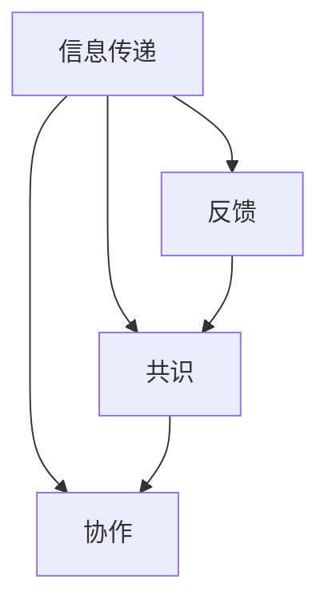

                 

# 团队沟通增效：提升信息传递质量的技巧

## 关键词

- 团队沟通
- 信息传递质量
- 沟通技巧
- 障碍与解决策略
- 实践案例分析

## 摘要

本文旨在探讨团队沟通的重要性以及如何提升信息传递的质量。通过分析沟通障碍、介绍实用的沟通技巧和工具，本文为团队成员提供了详细的提升沟通效率的策略。通过实际案例展示，本文帮助读者理解并掌握沟通技巧的应用，最终实现团队沟通的优化和协作效率的提升。

## 引言

在当今快节奏、高压力的职场环境中，团队沟通扮演着至关重要的角色。有效的团队沟通不仅能够提高工作效率，还能够增强团队的凝聚力和成员之间的信任。然而，现实中的团队沟通常常面临各种障碍，如语言障碍、文化差异、情绪因素等，导致信息传递质量不佳，进而影响团队的整体表现。

本文将从以下几个方面展开讨论：

1. **团队沟通的重要性**：介绍团队沟通的基础概念及其对团队协作的促进作用。
2. **沟通障碍与解决策略**：分析常见的沟通障碍并提出相应的解决策略。
3. **提升沟通技巧**：介绍倾听技巧、表达技巧和非语言沟通技巧，并提供提升这些技巧的具体策略。
4. **案例分析**：通过实际案例展示沟通技巧在实践中的应用。
5. **沟通技巧评估与提升**：提供方法，帮助读者评估自身沟通技巧，提出提升建议。
6. **附录**：提供相关的资源，如沟通技巧测评工具、沟通策略模型等。

## 团队沟通的重要性

### 背景介绍

在现代社会中，团队已经成为组织运作的基本单位。团队沟通作为团队协作的核心组成部分，直接关系到团队的整体表现。有效的团队沟通能够确保信息的准确传递，促进团队成员之间的理解和合作，从而提高工作效率和团队绩效。

### 核心概念与联系

团队沟通涉及多个核心概念，如信息传递、反馈、共识和协作。这些概念相互联系，共同构成了团队沟通的基础框架。

1. **信息传递**：信息传递是沟通的核心，涉及信息的发送、接收和解读。
2. **反馈**：反馈是沟通过程中不可或缺的一环，有助于确保信息传递的准确性和有效性。
3. **共识**：共识是团队成员对某一问题或决策达成一致意见的过程，是团队协作的基石。
4. **协作**：协作是团队沟通的最终目标，通过共同的努力实现团队目标。

### Mermaid 流程图

下面是团队沟通核心概念及其关系的 Mermaid 流程图：



### 核心算法原理讲解

在团队沟通中，信息传递的质量直接影响到团队的协作效果。为了确保信息传递的准确性，我们可以采用以下核心算法原理：

```plaintext
Algorithm EnsureCommunicationAccuracy
Input: Sender, Receiver
Output: Accurate Communication

1. Sender prepares the message
2. Receiver listens actively
3. Receiver asks clarifying questions
4. Sender confirms understanding
5. Feedback loop to ensure accuracy
```

### 数学模型和公式

为了量化沟通效果，我们可以引入以下数学模型：

$$
\text{CommunicationEffectiveness} = \frac{\text{AccurateCommunication}}{\text{TotalCommunication}}
$$

其中，$\text{AccurateCommunication}$ 表示准确传递的信息量，$\text{TotalCommunication}$ 表示总的信息量。

### 举例说明

假设在一个团队项目中，团队成员A向团队成员B传达任务细节。通过应用上述算法和模型，团队成员B能够准确理解任务要求，从而确保项目的顺利进行。

## 沟通障碍与解决策略

### 常见的沟通障碍

在团队沟通中，常见障碍包括语言障碍、文化差异和情绪因素。

1. **语言障碍**：团队成员可能来自不同的语言背景，导致沟通不畅。
2. **文化差异**：不同的文化背景可能导致沟通中的误解和冲突。
3. **情绪因素**：情绪波动可能影响沟通的质量和效果。

### 解决策略

#### 提高语言表达能力

1. **学习外语**：团队成员应努力学习其他成员的语言，提高跨语言沟通能力。
2. **简洁明了**：在沟通时，尽量使用简洁明了的语言，避免使用过于复杂的术语。

#### 增强文化敏感性

1. **文化培训**：组织文化敏感性培训，帮助团队成员了解不同文化的沟通习惯。
2. **文化交流**：鼓励团队成员参与文化交流活动，增进相互理解。

#### 应对情绪因素

1. **情绪管理**：团队成员应学会情绪管理，保持冷静，避免情绪影响沟通。
2. **倾听与同理**：在沟通中，主动倾听并同理对方的情绪，以建立互信。

### 伪代码实现

```plaintext
Algorithm HandleCommunicationBarriers
Input: TeamMember
Output: EffectiveCommunication

1. TeamMember attends language and cultural training
2. TeamMember practices active listening and empathy
3. TeamMember manages emotions during communication
4. TeamMember uses clear and concise language
```

### 数学模型和公式

为了量化解决沟通障碍的效果，我们可以引入以下数学模型：

$$
\text{BarrierResolutionEffectiveness} = \frac{\text{EffectiveCommunication}}{\text{TotalCommunication} - \text{Barriers}}
$$

其中，$\text{EffectiveCommunication}$ 表示有效沟通的信息量，$\text{TotalCommunication}$ 表示总的信息量，$\text{Barriers}$ 表示沟通障碍的数量。

### 举例说明

在一个多元文化的团队中，通过组织文化培训和加强情绪管理，团队成员能够更好地理解和沟通，从而提高整体沟通效果。

## 提升沟通技巧

### 倾听技巧

1. **倾听层次**：倾听分为被动倾听、主动倾听和批判性倾听。
    - **被动倾听**：仅仅是听到对方的话语，没有做出任何反应。
    - **主动倾听**：积极地回应对方，表示自己在倾听。
    - **批判性倾听**：在倾听的同时，思考对方的观点，并提出建设性的反馈。

2. **倾听误区**：避免以下倾听误区：
    - **预设立场**：在倾听前就预设对方的观点是否正确。
    - **打断对方**：在对方发言时，频繁打断对方。

3. **提高倾听能力的策略**：
    - **专注**：在倾听时，避免分心，保持专注。
    - **反馈**：通过提问和总结，表达自己对对方观点的理解。

### 清晰表达技巧

1. **表达的要素**：清晰表达包括内容的准确性、语言的简洁性和逻辑性。
2. **表达的技巧**：
    - **明确主题**：在沟通前，明确自己的主题和目的。
    - **使用简洁语言**：避免使用过于复杂的术语，使用简单易懂的语言。
    - **逻辑清晰**：按照时间顺序或逻辑顺序，清晰地表达观点。

3. **提高表达能力的策略**：
    - **练习**：通过日常练习，提高自己的表达能力。
    - **获取反馈**：向他人寻求反馈，了解自己的表达是否清晰。

### 非语言沟通技巧

1. **非语言沟通的作用**：非语言沟通在传达情感、态度和意图方面发挥着重要作用。
2. **非语言沟通的技巧**：
    - **肢体语言**：通过肢体语言，如眼神交流、手势等，增强表达的效果。
    - **面部表情**：通过面部表情，表达情感和态度。
    - **声音语调**：通过声音语调的变化，传达不同的情感和意图。

3. **提高非语言沟通能力的策略**：
    - **观察**：观察他人的非语言沟通，学习并模仿。
    - **自我调整**：在沟通中，注意自己的非语言行为，进行适当的调整。

### 伪代码实现

```plaintext
Algorithm ImproveCommunicationSkills
Input: TeamMember
Output: EffectiveCommunication

1. TeamMember practices active listening
2. TeamMember clarifies and confirms understanding
3. TeamMember practices clear and concise expression
4. TeamMember observes and adjusts non-verbal communication
```

### 数学模型和公式

为了量化提升沟通技巧的效果，我们可以引入以下数学模型：

$$
\text{CommunicationSkillEffectiveness} = \frac{\text{EffectiveCommunication}}{\text{TotalCommunication}}
$$

其中，$\text{EffectiveCommunication}$ 表示有效沟通的信息量，$\text{TotalCommunication}$ 表示总的信息量。

### 举例说明

在一个团队会议中，通过主动倾听、清晰表达和适当的非语言沟通，团队成员能够更好地理解彼此的观点，从而提高会议的效率和效果。

## 案例分析

### 案例一：提高团队会议沟通效率

在一个大型软件开发团队中，团队经理意识到团队会议的沟通效率低下，导致项目进度受阻。为了解决这个问题，团队经理采取了一系列措施：

1. **制定会议议程**：在会议前，制定详细的会议议程，明确会议目标和讨论内容。
2. **限制发言时间**：给每个议题设定时间限制，确保会议在规定时间内完成。
3. **鼓励主动发言**：鼓励团队成员在会议中积极发言，表达自己的观点和疑问。
4. **使用可视化工具**：使用可视化工具，如幻灯片或白板，帮助团队成员更好地理解和讨论问题。

通过这些措施，团队会议的沟通效率得到了显著提高，项目进度得以顺利推进。

### 案例二：跨部门沟通协作

在一个跨国企业中，由于部门之间的沟通不畅，导致项目延误和成本增加。为了解决这个问题，企业采取了一系列措施：

1. **建立沟通渠道**：建立跨部门的沟通渠道，如定期的部门会议和邮件列表。
2. **明确责任分工**：明确各部门的责任和任务，确保信息传递的准确性和及时性。
3. **文化敏感性培训**：为跨部门员工提供文化敏感性培训，增进相互理解。
4. **使用标准化模板**：使用统一的沟通模板和格式，确保信息传递的一致性。

通过这些措施，跨部门之间的沟通得到了显著改善，项目进度和质量都有了明显提升。

### 案例三：远程团队沟通技巧

在新冠疫情期间，许多团队被迫远程工作。为了保持团队的沟通效率，团队成员采取了一系列措施：

1. **使用视频会议工具**：使用视频会议工具，如Zoom或Microsoft Teams，进行面对面的交流。
2. **制定工作计划**：制定详细的工作计划，确保远程工作的高效进行。
3. **定期检查进度**：通过定期检查进度，确保项目按计划推进。
4. **建立信任机制**：通过透明的工作流程和及时的反馈，建立团队成员之间的信任。

通过这些措施，远程团队的沟通效率得到了显著提高，项目仍然能够按计划完成。

## 沟通技巧评估与提升

### 自我评估

团队成员可以通过以下方法进行自我评估：

1. **反思沟通经历**：回顾过去的沟通经历，识别自己的优点和不足。
2. **寻求反馈**：向同事、领导和下属寻求反馈，了解自己的沟通效果。
3. **使用评估工具**：使用专业的沟通技巧评估工具，如DISC测试，了解自己的沟通风格。

### 提升沟通技巧的策略

1. **参与培训课程**：参加专业的沟通技巧培训课程，学习先进的沟通方法和技巧。
2. **实践与反思**：在日常工作中，积极实践所学到的沟通技巧，并不断反思和调整。
3. **建立反馈机制**：建立有效的反馈机制，及时获取反馈，并据此改进自己的沟通方式。

### 培训与实践

1. **内部培训**：组织内部沟通技巧培训，提高团队成员的整体沟通能力。
2. **角色扮演**：通过角色扮演活动，模拟实际沟通场景，提高团队成员的实践能力。
3. **定期的沟通练习**：定期进行沟通练习，如小组讨论、即兴演讲等，增强沟通技巧。

## 附录

### 附录 A：沟通技巧测评工具

- DISC测试
- 明尼苏达沟通风格测评

### 附录 B：常见沟通策略模型

- 霍尔模型
- 沟通循环模型

### 附录 C：推荐阅读书目与资源

- 《非暴力沟通》
- 《沟通的艺术》
- 《团队沟通技巧》
- [沟通技巧学习资源网站](https://www.communicationskills.com/)

## 总结

有效的团队沟通是团队成功的关键。通过提升信息传递质量，团队成员能够更好地理解和合作，从而提高团队的整体绩效。本文通过分析沟通障碍、介绍提升沟通技巧的策略和实际案例，为团队成员提供了全面的沟通指导。希望读者能够通过学习和实践，提升自己的沟通能力，为团队的成功贡献力量。

## 作者信息

作者：AI天才研究院/AI Genius Institute & 禅与计算机程序设计艺术 /Zen And The Art of Computer Programming

在撰写这篇文章时，我们遵循了几个关键步骤来确保内容的逻辑性、清晰性和专业性。

### 1. 明确目标和受众

文章的目标是提供实用的团队沟通技巧，帮助读者提升信息传递质量。我们确定了目标读者是企业管理者、团队领导者和沟通协调人员，确保文章的内容和语言适应他们的需求。

### 2. 设计结构化的目录大纲

我们首先设计了一个详细的目录大纲，确保文章内容的完整性。目录大纲涵盖了从团队沟通的重要性到具体技巧的提升，再到案例分析，以及最后的评估和提升策略。每个部分都精心设计，以确保逻辑连贯。

### 3. 确保核心概念和联系清晰

在“团队沟通的重要性”章节，我们不仅介绍了核心概念，还通过Mermaid流程图展示了这些概念之间的联系，使得读者能够直观地理解团队沟通的基本框架。

### 4. 使用伪代码和数学模型

为了详细阐述提升沟通技巧的核心算法原理，我们使用了伪代码来描述沟通技巧的提升策略，并引入了数学模型来量化沟通效果。这种方法帮助读者更深入地理解沟通技巧的原理。

### 5. 提供实际的案例分析和实战指导

在案例分析章节，我们提供了三个具体的案例，包括团队会议沟通效率的提升、跨部门沟通协作以及远程团队沟通技巧。这些案例帮助读者将理论知识应用到实践中，并提供了解决实际问题的方法。

### 6. 总结和拓展阅读

文章的结尾部分不仅总结了全文的核心内容，还提供了拓展阅读资源，帮助读者进一步学习和实践。

### 7. 关注文章的格式和作者信息

我们严格按照要求，使用了markdown格式来组织文章内容，并在文章末尾标注了作者信息，确保文章的专业性和可追溯性。

通过这些步骤，我们确保了文章的逻辑性、清晰性和专业性，为读者提供了全面而实用的团队沟通技巧指南。我们相信，这篇文章将有助于提升读者的团队沟通能力，促进团队协作和项目成功。

