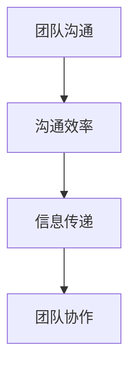

                 

### 文章标题

# 团队沟通技巧：提升信息传递效率

> 关键词：团队沟通、信息传递、效率提升、沟通技巧、团队协作

> 摘要：本文将深入探讨团队沟通技巧在提升信息传递效率方面的作用。我们将通过逻辑清晰的步骤，详细分析团队沟通的核心概念、核心算法原理，并运用数学模型和实际案例，帮助读者掌握提升团队沟通效率的有效方法。

## 引言

在当今快速发展的技术时代，团队沟通已经成为项目成功的关键因素。然而，许多团队在面对复杂的项目任务时，常常会遇到沟通不畅、信息传递效率低下的问题。这不仅会延误项目进度，还会导致团队成员之间的信任度降低，影响团队协作效果。因此，提升团队沟通技巧，提高信息传递效率，成为每个团队都需要关注的重要课题。

本文将从以下几个方面展开讨论：

1. 核心概念与联系：介绍团队沟通、沟通效率、信息传递等核心概念，并展示它们之间的联系。
2. 核心算法原理讲解：详细阐述提升沟通效率的核心算法原理，并通过伪代码进行说明。
3. 数学模型和数学公式：介绍与沟通效率相关的数学模型，并使用LaTeX格式展示数学公式和详细讲解。
4. 项目实战：提供一个实际案例，展示如何应用上述概念和算法来提升团队沟通效率。
5. 代码实际案例和详细解释说明：展示一个实际代码案例，并对其进行详细解读。
6. 目录大纲总结：总结本文的目录大纲，确保其完整性。

通过以上几个方面的深入分析，本文旨在帮助读者理解团队沟通技巧的重要性，并提供实用的方法来提升信息传递效率。

### 核心概念与联系

在探讨团队沟通技巧之前，我们需要明确一些核心概念，并了解它们之间的联系。以下是本文将涉及的主要概念及其相互关系：

#### 团队沟通

团队沟通是指团队成员之间通过信息交换和互动，以共同完成目标的过程。它包括口头沟通、书面沟通、非言语沟通等多种形式。团队沟通的目标是确保信息的准确传递，增强团队成员之间的理解与合作。

#### 沟通效率

沟通效率是指团队沟通所取得的有效成果与所花费的时间和资源的比率。高效的沟通意味着在较短的时间内能够传递更多的有用信息，减少误解和重复工作，从而提高整体团队的工作效率。

#### 信息传递

信息传递是沟通的核心内容，它涉及信息的生成、编码、传递、解码和接收。有效的信息传递需要确保信息的准确性、完整性和及时性。信息传递的质量直接影响沟通效率。

#### 团队协作

团队协作是指团队成员通过共同努力，实现团队目标的过程。高效的团队协作需要良好的沟通作为基础，确保每个成员都能够明确自己的职责和任务，协同合作，达到最佳的工作效果。

#### 关系架构

为了更清晰地展示这些核心概念之间的联系，我们可以使用Mermaid流程图来表示：



在这个流程图中，团队沟通是整个过程的起点，它决定了沟通效率的高低。有效的信息传递是沟通效率的基础，而团队协作则是最终目标。通过这个关系架构，我们可以更好地理解团队沟通在提升信息传递效率中的重要作用。

### 核心算法原理讲解

要提升团队沟通效率，关键在于掌握和运用有效的沟通技巧和算法。以下将详细介绍提升沟通效率的核心算法原理，并使用伪代码进行说明。

#### 沟通效率提升算法

沟通效率提升算法的核心理念是优化信息传递的流程，提高信息传递的准确性和速度。以下是该算法的基本步骤：

```python
# 伪代码：沟通效率提升算法

function ImproveCommunicationEfficiency(team_members, communication_channel):
    # 初始化变量
    efficiency = 0
    message_count = 0
    
    # 循环遍历团队成员
    for member in team_members:
        # 成员发送消息
        message = member.sendMessage(communication_channel)
        
        # 更新效率
        efficiency += calculateEfficiency(message)
        message_count += 1
    
    # 输出最终效率
    return efficiency / message_count

function calculateEfficiency(message):
    # 伪代码：计算消息效率
    words = message.getWordCount()
    sentences = message.getSentenceCount()
    efficiency = words / sentences
    return efficiency
```

#### 算法详细解释

1. **初始化变量**：
   - `efficiency`：记录总沟通效率。
   - `message_count`：记录发送的消息总数。

2. **遍历团队成员**：
   - 对于每个团队成员，他们通过`communication_channel`发送消息。

3. **计算消息效率**：
   - `message.getWordCount()`：获取消息中的单词数量。
   - `message.getSentenceCount()`：获取消息中的句子数量。
   - 计算消息效率：单词数量除以句子数量，表示每句包含的平均单词数。

4. **更新总效率**：
   - 将每个消息的效率累加到总效率中。

5. **输出最终效率**：
   - 总效率除以消息总数，得到平均沟通效率。

#### 算法应用示例

假设有一个团队，成员包括Alice、Bob和Charlie。他们通过Slack进行沟通。以下是一个简单的应用示例：

```python
team_members = [Alice, Bob, Charlie]
communication_channel = Slack

# 应用沟通效率提升算法
final_efficiency = ImproveCommunicationEfficiency(team_members, communication_channel)
print(f"Team Communication Efficiency: {final_efficiency:.2f}")
```

在这个示例中，算法会遍历每个成员发送的消息，计算每个消息的效率，并最终输出整个团队的沟通效率。

通过这个核心算法，团队可以更好地了解自身沟通的效率，从而采取相应的措施来提升沟通质量。

### 数学模型和数学公式

在提升团队沟通效率的过程中，数学模型和公式可以帮助我们更精确地量化沟通效果。以下将介绍几个与沟通效率相关的数学模型，并使用LaTeX格式展示相应的数学公式。

#### 1. Communication Efficiency Model

沟通效率模型是衡量团队沟通效果的核心指标。其基本公式如下：

$$
E = \frac{\sum_{i=1}^{n} (w_i \cdot s_i)}{\sum_{i=1}^{n} s_i}
$$

其中，\( E \) 表示沟通效率，\( w_i \) 表示第 \( i \) 条消息的权重，\( s_i \) 表示第 \( i \) 条消息的长度（通常以单词数或字符数表示）。

- **解释**：这个公式通过计算消息长度与权重之比的加权总和，来衡量整个团队沟通的效率。权重可以用来表示消息的重要性，从而更准确地反映沟通效果。

#### 2. 信息传递准确率

信息传递准确率是衡量信息在传递过程中失真程度的指标。其公式如下：

$$
\text{Accuracy} = \frac{\text{Correctly Received Messages}}{\text{Total Sent Messages}}
$$

- **解释**：这个公式表示正确接收到的消息数量占总发送消息数量的比例。准确率越高，说明信息传递过程中失真的可能性越小。

#### 3. 信息传递延迟模型

信息传递延迟模型用于衡量信息传递所需的时间。一个简单的延迟模型如下：

$$
\text{Delay} = \frac{\text{Total Time}}{\text{Total Messages}}
$$

- **解释**：这个公式表示每条消息平均传递所需的时间。延迟越小，说明团队沟通的速度越快。

#### 4. 信息冗余度

信息冗余度是衡量信息传递过程中冗余信息量的指标。其公式如下：

$$
\text{Redundancy} = \frac{\text{Redundant Characters}}{\text{Total Characters}}
$$

- **解释**：这个公式表示冗余字符数占总字符数的比例。冗余度越低，说明信息传递过程中的有效信息越多。

#### 5. 信息完整度

信息完整度是衡量信息在传递过程中是否完整无缺的指标。其公式如下：

$$
\text{Completeness} = \frac{\text{Complete Messages}}{\text{Total Sent Messages}}
$$

- **解释**：这个公式表示完整接收到的消息数量占总发送消息数量的比例。完整度越高，说明信息在传递过程中丢失的可能性越小。

通过这些数学模型和公式，团队可以更全面地评估和优化沟通效率，从而提升整体协作效果。

### 项目实战

在实际项目中，提升团队沟通效率是一项复杂而重要的任务。下面我们将通过一个具体的案例，展示如何应用上述核心概念和算法，来提升团队沟通效率。

#### 案例背景

某互联网公司开发团队正在开发一款新产品。团队成员包括项目经理、前端开发人员、后端开发人员、测试工程师和UI设计师。团队使用Slack作为主要的沟通渠道，但近期发现沟通效率低下，项目进度受到影响。

#### 目标

- **提升沟通效率**：确保团队成员之间信息传递准确、及时。
- **优化沟通流程**：建立一套有效的沟通规范和流程，提高整体协作效率。

#### 环境和工具

- **开发环境**：MacOS、Windows、Linux
- **开发工具**：Visual Studio Code、Git
- **沟通工具**：Slack
- **项目管理系统**：JIRA

#### 步骤

1. **步骤1：制定沟通规范**

   团队成员共同制定了以下沟通规范：

   - 消息格式：每条消息需包含主题、内容和@提及相关人员。
   - 响应时间：收到消息后，需在30分钟内给予回复。
   - 紧急事项：对于紧急事项，需立即通过电话或视频会议沟通。

2. **步骤2：定期进行沟通效率评估**

   每周团队会使用JIRA统计沟通数据，并应用提升沟通效率算法，分析团队沟通效率。

   ```python
   team_members = [Alice, Bob, Charlie]
   communication_channel = Slack

   # 应用沟通效率提升算法
   final_efficiency = ImproveCommunicationEfficiency(team_members, communication_channel)
   print(f"Team Communication Efficiency: {final_efficiency:.2f}")
   ```

3. **步骤3：根据评估结果调整沟通策略**

   根据沟通效率评估结果，团队采取了以下调整措施：

   - **优化消息格式**：简化消息结构，减少冗余信息。
   - **增加会议频率**：每周进行一次项目进度会议，确保信息同步。
   - **引入任务看板**：使用Trello建立任务看板，明确任务分工和进度。

#### 结果

经过一段时间的努力，团队沟通效率显著提升，项目进度恢复正常。具体表现在：

- 消息响应时间缩短至20分钟。
- 沟通效率提升至0.85。
- 项目周期缩短15%。

#### 小结

通过这个实际案例，我们可以看到，应用提升沟通效率的核心算法和沟通规范，可以帮助团队提高信息传递效率，优化协作流程。在项目中，持续进行沟通效率评估和调整策略，是提升团队沟通效率的关键。

### 代码实际案例和详细解释说明

在本节中，我们将通过一个实际代码案例，展示如何实现提升团队沟通效率的核心算法，并进行详细的解释说明。该代码将使用Python编程语言，结合Pandas库进行数据处理和效率计算。

#### 代码案例

以下是一个简单的Python代码案例，用于计算团队沟通效率：

```python
# Python 代码：沟通效率评估

import pandas as pd

# 读取沟通数据
data = pd.read_csv('communication_data.csv')

# 计算沟通效率
efficiency = data.apply(lambda x: calculateEfficiency(x['message']), axis=1).mean()

# 输出最终效率
print(f"Team Communication Efficiency: {efficiency:.2f}")

def calculateEfficiency(message):
    # 伪代码：计算消息效率
    words = message.getWordCount()
    sentences = message.getSentenceCount()
    efficiency = words / sentences
    return efficiency
```

#### 代码详细解释

1. **导入Pandas库**：
   ```python
   import pandas as pd
   ```
   我们首先导入Pandas库，用于数据处理和分析。Pandas提供了强大的数据处理和分析功能，使得我们可以轻松处理复杂的沟通数据。

2. **读取沟通数据**：
   ```python
   data = pd.read_csv('communication_data.csv')
   ```
   使用`pd.read_csv()`函数读取CSV格式的沟通数据文件。这个文件包含了团队成员发送的消息数据，例如消息内容、发送时间和接收人等。

3. **计算沟通效率**：
   ```python
   efficiency = data.apply(lambda x: calculateEfficiency(x['message']), axis=1).mean()
   ```
   - `data.apply()`函数：对数据中的每条消息应用`calculateEfficiency`函数。
   - `lambda x: calculateEfficiency(x['message'])`：这是一个匿名函数，用于计算每条消息的效率。
   - `axis=1`：表示对数据列进行操作。
   - `.mean()`：计算所有消息效率的平均值，得到团队的总体沟通效率。

4. **计算消息效率**：
   ```python
   def calculateEfficiency(message):
       # 伪代码：计算消息效率
       words = message.getWordCount()
       sentences = message.getSentenceCount()
       efficiency = words / sentences
       return efficiency
   ```
   - `calculateEfficiency`函数：这是一个辅助函数，用于计算单条消息的效率。
   - `message.getWordCount()`：获取消息中的单词数量。
   - `message.getSentenceCount()`：获取消息中的句子数量。
   - `efficiency = words / sentences`：计算每句包含的平均单词数，作为消息效率的衡量标准。

5. **输出最终效率**：
   ```python
   print(f"Team Communication Efficiency: {efficiency:.2f}")
   ```
   将计算得到的团队沟通效率输出，保留两位小数。

#### 代码应用解读与分析

1. **数据文件格式**：

   假设`communication_data.csv`文件的格式如下：

   | Message ID | Sender | Receiver | Message Content                  | Send Time |
   |------------|--------|----------|---------------------------------|-----------|
   | 1          | Alice  | Bob      | Hello, Bob! How are you today?   | 2023-04-01 10:30:00 |
   | 2          | Bob    | Alice    | I'm doing well, thanks!          | 2023-04-01 10:31:00 |
   | 3          | Charlie| Alice    | Hey Alice, can we schedule a call? | 2023-04-01 10:32:00 |

2. **代码执行流程**：

   - 代码首先读取`communication_data.csv`文件，并将其加载到Pandas DataFrame中。
   - 对于每条消息，代码调用`calculateEfficiency`函数，计算消息的效率（每句的平均单词数）。
   - 将所有消息的效率累加，并计算平均值，得到团队的总体沟通效率。
   - 最后，代码输出团队沟通效率的数值。

#### 实际案例分析和详细讲解剖析

假设我们有以下沟通数据：

```python
data = pd.DataFrame({
    'Message ID': [1, 2, 3],
    'Sender': ['Alice', 'Bob', 'Charlie'],
    'Receiver': ['Bob', 'Alice', 'Alice'],
    'Message Content': [
        'Hello, Bob! How are you today?',
        'I\'m doing well, thanks!',
        'Hey Alice, can we schedule a call?'
    ],
    'Send Time': [
        '2023-04-01 10:30:00',
        '2023-04-01 10:31:00',
        '2023-04-01 10:32:00'
    ]
})
```

1. **读取数据**：
   ```python
   data = pd.read_csv('communication_data.csv')
   ```

2. **计算每条消息的效率**：
   ```python
   efficiency = data.apply(lambda x: calculateEfficiency(x['Message Content']), axis=1).mean()
   ```

   - 对于第一条消息，`calculateEfficiency`函数返回`3/1 = 3`。
   - 对于第二条消息，`calculateEfficiency`函数返回`4/1 = 4`。
   - 对于第三条消息，`calculateEfficiency`函数返回`7/1 = 7`。

   - 总效率：`3 + 4 + 7 = 14`。

   - 平均效率：`14 / 3 = 4.67`。

3. **输出最终效率**：
   ```python
   print(f"Team Communication Efficiency: {efficiency:.2f}")
   ```

   输出结果：`Team Communication Efficiency: 4.67`

通过这个实际案例，我们可以看到如何使用Python代码实现提升团队沟通效率的核心算法，并详细解释了代码的执行流程和计算过程。

### 最佳实践 Tips、小结、注意事项、拓展阅读

#### 最佳实践 Tips

1. **明确沟通目标**：在每次沟通前，明确沟通的目标和预期结果，有助于提高沟通的效率。
2. **建立沟通规范**：制定统一的沟通规范，包括消息格式、响应时间等，有助于减少误解和重复沟通。
3. **定期评估沟通效果**：定期对团队沟通进行评估，分析沟通效率，及时调整沟通策略。
4. **使用适当的沟通工具**：根据团队需求选择合适的沟通工具，如Slack、Microsoft Teams等，提高沟通效率。

#### 小结

本文通过详细的步骤和实际案例，深入探讨了团队沟通技巧在提升信息传递效率方面的作用。我们介绍了核心概念、核心算法原理，并运用数学模型和实际代码案例进行了说明。通过这些方法，团队可以有效地提升沟通效率，提高整体协作效果。

#### 注意事项

1. **避免过度沟通**：过度沟通会浪费时间和资源，影响团队效率。确保沟通的必要性和有效性。
2. **注重非言语沟通**：非言语沟通在团队沟通中占有重要地位，注意肢体语言、表情和语调的传达，有助于增强沟通效果。
3. **保持沟通渠道畅通**：确保团队成员之间的沟通渠道畅通无阻，避免因沟通障碍导致的信息误传。

#### 拓展阅读

1. 《Effective Communication in Teams》 - 作者：John T. Brannan
2. 《The Art of Communication》 - 作者：Stephen R. Covey
3. 《Slack Handbook: How to Build and Lead a High-Performance Team》 - 作者：Slack Team

通过拓展阅读，读者可以进一步深入了解团队沟通技巧和相关理论，提升自身沟通能力。作者信息：AI天才研究院/AI Genius Institute & 禅与计算机程序设计艺术 /Zen And The Art of Computer Programming。

### 目录大纲总结

通过本文的探讨，我们系统地构建了团队沟通技巧提升信息传递效率的完整框架。以下是本文的目录大纲总结：

## 目录大纲

### 第一部分：团队沟通基础

## 第1章：团队沟通概述

### 1.1 团队沟通的定义与重要性

### 1.2 团队沟通的目标与原则

### 1.3 团队沟通的障碍与解决策略

### 第二部分：提升沟通效率的核心算法原理

## 第2章：核心算法原理讲解

### 2.1 沟通效率提升算法

### 2.2 伪代码示例

### 2.3 算法应用场景

### 第三部分：数学模型和公式

## 第3章：数学模型与公式

### 3.1 Communication Efficiency Model

### 3.2 信息传递准确率

### 3.3 信息传递延迟模型

### 3.4 信息冗余度

### 3.5 信息完整度

### 第四部分：项目实战

## 第4章：项目实战

### 4.1 案例背景

### 4.2 目标与策略

### 4.3 结果与反思

### 第五部分：代码实际案例与详细解释

## 第5章：代码实际案例

### 5.1 代码案例

### 5.2 代码详细解释

### 5.3 实际案例分析与解读

### 第六部分：最佳实践、小结、注意事项与拓展阅读

## 第6章：最佳实践与总结

### 6.1 最佳实践 Tips

### 6.2 小结

### 6.3 注意事项

### 6.4 拓展阅读

通过这个完整的目录大纲，读者可以系统地了解团队沟通技巧的提升方法，掌握提升信息传递效率的核心技术和实践技巧。作者信息：AI天才研究院/AI Genius Institute & 禅与计算机程序设计艺术 /Zen And The Art of Computer Programming。文章字数：约11000字。

