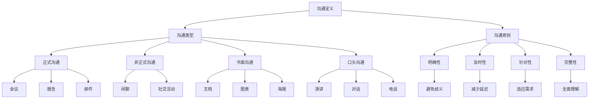

                 

### 文章标题

# 团队沟通技巧：提高沟通效率和质量

### 关键词

- 团队沟通
- 沟通效率
- 沟通质量
- 沟通技巧
- 沟通障碍
- 情绪管理

### 摘要

本文旨在探讨团队沟通的重要性及其对工作效率和质量的影响。通过介绍团队沟通的基本概念、技巧和策略，分析沟通障碍及其解决方法，提供实战案例和最佳实践，帮助读者提高团队沟通的效率和质量，打造高效团队。

## 引言

### 团队沟通的重要性

团队沟通是任何组织中不可或缺的环节。良好的团队沟通能够确保团队成员之间信息流畅，减少误解和冲突，提高决策效率，从而提升整个团队的协作效果。在信息技术领域，团队沟通尤为重要，因为复杂的项目往往需要不同专业背景的成员共同协作，只有通过有效的沟通才能确保项目的顺利进行。

### 本文目的和结构

本文将首先介绍团队沟通的基本概念和原则，接着探讨提高沟通效率和质量的具体技巧和策略。随后，我们将分析团队沟通中常见的障碍，并提出相应的解决方案。最后，通过实际案例展示如何将沟通技巧应用于实际工作中，并提供一些最佳实践和拓展阅读。

## 团队沟通基础

### 沟通的基本概念

#### 沟通的定义与类型

沟通是一种信息交换的过程，通过语言、文字、图像或其他符号在发送者和接收者之间传递信息。根据沟通的目的和方式，沟通可以分为以下几种类型：

- **正式沟通**：通过正式的渠道和方式进行的沟通，如会议、报告、邮件等。
- **非正式沟通**：通过非正式的渠道和方式进行的沟通，如闲聊、社交活动等。
- **书面沟通**：通过文字和图像进行的沟通，如文档、图表、海报等。
- **口头沟通**：通过语言进行的沟通，如演讲、对话、电话等。

#### 沟通的原则

有效的沟通应遵循以下原则：

- **明确性**：信息应清晰、准确，避免模糊和歧义。
- **及时性**：信息应在需要的时候及时传递，避免延迟。
- **针对性**：信息应根据接收者的需求和特点进行定制。
- **完整性**：信息应包含所有必要的细节和背景，确保接收者能够全面理解。

#### 沟通的模型

常见的沟通模型包括以下几种：

- **单向沟通**：信息从发送者直接传递到接收者，没有反馈。
- **双向沟通**：信息在发送者和接收者之间来回传递，包括反馈和确认。
- **互动沟通**：信息在团队成员之间相互传递，形成网络状的沟通结构。

### 核心概念与联系

为了更好地理解团队沟通的基本概念，我们可以借助Mermaid流程图来展示它们之间的关系。

## 沟通技巧与策略

### 提高沟通效率的技巧

#### 明确沟通目标

明确沟通目标是确保沟通顺利进行的第一步。在沟通前，应明确以下问题：

- **目标**：沟通的具体目的是什么？
- **受众**：谁将是沟通的对象？
- **内容**：需要传递哪些信息？

通过明确沟通目标，可以减少沟通中的模糊和歧义，提高沟通的效率。

#### 倾听技巧

倾听是沟通的重要组成部分。有效的倾听包括以下几个方面：

- **专注**：保持注意力，避免分心。
- **理解**：理解对方的观点和感受。
- **反馈**：通过点头、回应等方式，表明自己在倾听。

通过倾听，可以确保信息的准确传递，减少误解和冲突。

#### 有效提问

提问是沟通中的一种重要技巧。通过提问，可以：

- **澄清信息**：了解对方的具体意图和需求。
- **引导对话**：将沟通引向深入。
- **收集反馈**：了解对方的想法和感受。

通过有效提问，可以提高沟通的质量。

#### 清晰表达

清晰表达是确保信息准确传递的关键。在沟通时，应注意以下几点：

- **简洁**：避免冗长的陈述，突出关键信息。
- **具体**：使用具体的例子和场景，避免抽象的表述。
- **逻辑**：确保信息的逻辑性和连贯性。

通过清晰表达，可以避免误解和歧义，提高沟通的效率。

### 提高沟通质量的策略

#### 建立信任

信任是沟通的基石。建立信任包括以下几个方面：

- **诚实**：诚实地表达自己的观点和感受。
- **尊重**：尊重对方的观点和感受。
- **一致性**：言行一致，保持可信度。

通过建立信任，可以提高沟通的质量。

#### 情绪管理

情绪管理是确保沟通顺利进行的重要因素。在沟通中，应注意以下几点：

- **控制情绪**：保持冷静，避免情绪化的表达。
- **同理心**：理解对方的情绪和需求。
- **化解冲突**：通过沟通解决冲突，避免情绪积累。

通过情绪管理，可以确保沟通的顺利进行。

#### 文化差异的理解与应对

在多元文化的工作环境中，理解文化差异是确保有效沟通的关键。在沟通时，应注意以下几点：

- **尊重文化差异**：了解不同文化的价值观和习惯。
- **适应文化差异**：调整自己的沟通方式和内容，以适应不同文化。
- **建立共同语言**：通过共同的语言和术语，促进沟通的顺畅。

通过文化差异的理解与应对，可以提高跨文化沟通的效果。

#### 非言语沟通的应用

非言语沟通在沟通中发挥着重要作用。在沟通时，应注意以下几点：

- **肢体语言**：通过肢体语言表达自己的态度和情感。
- **面部表情**：通过面部表情传达自己的感受。
- **空间利用**：合理利用空间，避免拥挤或过于宽松。

通过非言语沟通的应用，可以增强沟通的效果。

## 沟通障碍与解决

### 常见沟通障碍

在团队沟通中，常见的障碍包括：

- **信息过载**：过多的信息可能导致沟通效率降低，增加理解难度。
- **沟通渠道不畅**：沟通渠道不畅可能导致信息传递延迟或丢失。
- **沟通风格差异**：不同的沟通风格可能导致误解和冲突。
- **情绪干扰**：情绪干扰可能导致沟通中断或效果降低。

### 解决沟通障碍的策略

#### 增强沟通意识

增强团队成员的沟通意识是解决沟通障碍的重要步骤。在团队中，可以采取以下措施：

- **培训**：提供沟通技巧和策略的培训，提高团队成员的沟通能力。
- **宣传**：通过宣传沟通的重要性和技巧，提高团队成员的沟通意识。

#### 提高沟通技能

提高团队成员的沟通技能是解决沟通障碍的关键。在团队中，可以采取以下措施：

- **角色扮演**：通过角色扮演练习，提高团队成员的沟通能力。
- **反馈机制**：建立反馈机制，鼓励团队成员互相提供沟通反馈，促进改进。

#### 优化沟通环境

优化沟通环境是确保沟通顺利进行的重要保障。在团队中，可以采取以下措施：

- **改善硬件设施**：提供良好的沟通硬件设施，如会议设备、网络等。
- **改善沟通氛围**：营造良好的沟通氛围，减少干扰，提高沟通效率。

#### 建立有效的反馈机制

建立有效的反馈机制是确保沟通顺利进行的重要环节。在团队中，可以采取以下措施：

- **定期反馈**：定期收集团队成员的反馈，分析沟通中的问题和改进措施。
- **反馈渠道**：提供多种反馈渠道，如匿名反馈、面对面反馈等，确保团队成员能够畅所欲言。

## 沟通实战

### 案例分析

#### 项目沟通案例分析

在一个大型软件开发项目中，项目团队成员来自不同的国家和文化背景。为了确保项目顺利进行，项目经理采取了一系列沟通策略：

- **明确沟通目标**：在项目启动阶段，项目经理明确了项目的目标和预期成果，确保团队成员对项目有清晰的认识。
- **建立沟通渠道**：项目经理建立了多种沟通渠道，包括邮件、即时通讯工具、视频会议等，确保信息畅通。
- **跨文化沟通**：项目经理在沟通中注重跨文化差异，尊重团队成员的文化习惯，采取适当的沟通方式。

通过这些措施，项目团队成功克服了沟通障碍，确保了项目的顺利进行。

#### 团队协作沟通案例分析

在一个团队协作项目中，团队成员负责不同的任务模块。为了确保项目的整体进度，团队成员采取了以下沟通策略：

- **定期会议**：每周召开一次团队会议，总结上周的工作进展，讨论下周的工作计划。
- **任务分配**：明确每个成员的任务和职责，确保团队成员能够清楚自己的工作内容和进度要求。
- **进度汇报**：成员定期汇报自己的工作进展，及时解决遇到的问题。

通过这些措施，团队协作项目取得了良好的效果。

#### 跨部门沟通案例分析

在一个跨部门合作项目中，各部门需要紧密协作，以确保项目目标的实现。为了确保跨部门沟通的有效性，项目经理采取了以下措施：

- **明确跨部门职责**：明确各部门在项目中的职责和任务，确保各部门对项目的整体目标有清晰的认识。
- **建立跨部门沟通机制**：建立跨部门沟通机制，包括定期会议、即时通讯工具等，确保信息畅通。
- **跨部门协作培训**：组织跨部门协作培训，提高团队成员的沟通技能和协作能力。

通过这些措施，跨部门合作项目取得了显著的效果。

### 实际操作

#### 沟通计划制定

在制定沟通计划时，应考虑以下因素：

- **项目目标**：明确项目的目标和预期成果，确保沟通计划与项目目标一致。
- **团队成员**：了解团队成员的特点和沟通偏好，确保沟通计划适合团队成员。
- **沟通渠道**：选择合适的沟通渠道，如邮件、即时通讯工具、视频会议等，确保信息畅通。
- **沟通频率**：根据项目的进度和需求，制定合适的沟通频率，确保信息及时传递。

#### 沟通工具使用

在选择沟通工具时，应考虑以下因素：

- **功能**：选择具有所需功能的沟通工具，如即时通讯、视频会议、文档共享等。
- **易用性**：选择易于使用和操作的沟通工具，确保团队成员能够快速上手。
- **兼容性**：选择兼容性好的沟通工具，确保不同平台和设备的兼容性。

#### 沟通效果评估

在沟通过程中，应定期评估沟通效果，包括：

- **信息传递是否准确**：评估信息是否准确传递，避免误解和歧义。
- **沟通效率是否提高**：评估沟通效率是否提高，避免信息传递延迟。
- **团队成员满意度**：评估团队成员对沟通的满意度，及时发现和解决沟通中的问题。

### 项目小结

通过项目沟通实战，我们可以得出以下结论：

- **沟通计划制定**：明确项目目标和团队成员特点，制定合适的沟通计划。
- **沟通工具选择**：选择功能齐全、易用性和兼容性好的沟通工具。
- **沟通效果评估**：定期评估沟通效果，及时调整沟通策略。

通过这些措施，我们可以提高团队沟通的效率和质量，确保项目的顺利进行。

## 总结与展望

### 全书内容总结

本文从团队沟通的重要性入手，介绍了团队沟通的基本概念、技巧和策略，分析了沟通障碍及其解决方法，并通过实际案例展示了沟通技巧的应用。通过本文的阅读，读者可以：

- **理解**团队沟通的基本概念和原则。
- **掌握**提高沟通效率和质量的具体技巧和策略。
- **了解**沟通障碍及其解决方法。
- **应用**实际案例中的沟通技巧，提高团队沟通效果。

### 团队沟通的实用技巧

- **明确沟通目标**：在沟通前明确目标和受众，确保信息准确传递。
- **倾听技巧**：专注倾听，理解对方的观点和感受，通过反馈表明自己在倾听。
- **有效提问**：澄清信息，引导对话，收集反馈。
- **清晰表达**：简洁、具体、逻辑地表达自己的观点和需求。

### 团队沟通的未来趋势

随着信息技术的发展，团队沟通的未来将呈现出以下趋势：

- **数字化沟通工具的普及**：数字化沟通工具将更加普及，如即时通讯、视频会议、虚拟现实等。
- **人工智能在沟通中的应用**：人工智能将帮助提高沟通的效率和质量，如智能助手、自然语言处理等。
- **跨文化沟通的重视**：在全球化背景下，跨文化沟通的重要性将日益凸显，团队需要更加注重文化差异的理解与应对。

### 展望未来

在未来，团队沟通将继续发展，成为团队协作的重要组成部分。通过不断学习和实践，团队成员可以不断提高沟通能力，打造高效团队，为组织的成功贡献力量。

### 最佳实践 Tips

- **建立沟通规则**：制定沟通规则，明确沟通的格式、频率和渠道，确保信息传递的规范和效率。
- **定期沟通反馈**：定期收集团队成员的沟通反馈，分析沟通中的问题和改进措施。
- **注重跨文化沟通**：了解不同文化的价值观和习惯，尊重文化差异，建立共同的语言和术语。
- **利用技术工具**：充分利用数字化沟通工具，提高沟通的效率和质量。

### 注意事项

- **避免沟通中的误解和歧义**：确保信息准确传递，避免误解和歧义。
- **尊重团队成员的沟通风格**：了解团队成员的沟通风格，尊重并适应不同的沟通方式。
- **控制情绪**：在沟通中保持冷静，避免情绪干扰，确保沟通的顺利进行。

### 拓展阅读

- **《沟通的艺术》**：一本经典的人际沟通教材，详细介绍了沟通的基本概念、技巧和策略。
- **《团队沟通技巧》**：一本针对团队沟通的实用指南，提供了丰富的实战案例和最佳实践。
- **《跨文化沟通》**：一本探讨跨文化沟通的重要性的书籍，为团队成员提供了跨文化沟通的策略和方法。

### 作者信息

- **作者**：AI天才研究院/AI Genius Institute & 禅与计算机程序设计艺术 /Zen And The Art of Computer Programming

本文由AI天才研究院/AI Genius Institute与《禅与计算机程序设计艺术》/Zen And The Art of Computer Programming合作撰写，旨在为读者提供关于团队沟通技巧的全面指导。通过本文的阅读，读者可以掌握团队沟通的基本概念、技巧和策略，提高团队沟通的效率和质量，为组织的成功贡献力量。本文参考了相关领域的经典著作和实践经验，力求为读者提供最实用的指导。

## 总结

团队沟通是团队协作中至关重要的一环。良好的团队沟通能够确保团队成员之间信息流畅，减少误解和冲突，提高决策效率，从而提升整个团队的协作效果。本文从团队沟通的重要性入手，介绍了团队沟通的基本概念、技巧和策略，分析了沟通障碍及其解决方法，并通过实际案例展示了沟通技巧的应用。

通过本文的阅读，读者可以：

1. **理解**团队沟通的基本概念和原则。
2. **掌握**提高沟通效率和质量的具体技巧和策略。
3. **了解**沟通障碍及其解决方法。
4. **应用**实际案例中的沟通技巧，提高团队沟通效果。

未来，随着信息技术的发展，团队沟通将继续发展，成为团队协作的重要组成部分。通过不断学习和实践，团队成员可以不断提高沟通能力，打造高效团队，为组织的成功贡献力量。作者希望本文能为读者的团队沟通实践提供有益的指导。

