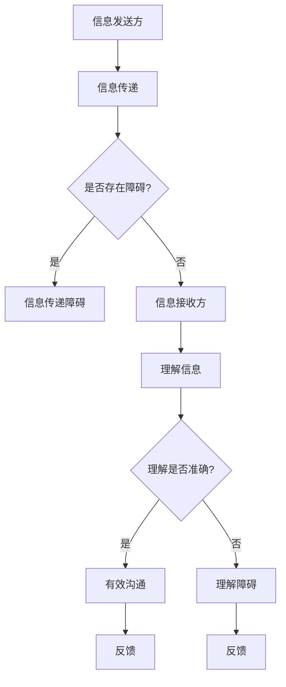

                 

### 文章标题：团队沟通障碍：克服沟通中的常见问题

> 关键词：团队沟通、沟通障碍、解决方案、有效沟通、团队协作

> 摘要：本文旨在探讨团队沟通中的常见障碍，包括信息传递、理解、反馈等方面的问题。通过分析沟通障碍的原因，提供一系列实用的解决方案，帮助团队提升沟通效率，实现高效协作。

### 引言

在IT行业，团队协作是项目成功的关键。然而，沟通障碍常常成为团队效率的瓶颈。无论是项目规划、问题解决，还是日常交流，沟通都是确保团队协调运作的基础。本文将深入探讨团队沟通中常见的障碍，并提供切实可行的解决方案，以帮助团队克服这些问题，实现高效协作。

### 1. 沟通障碍概述

沟通障碍是指在信息传递、理解和反馈过程中遇到的各种问题。这些障碍可能来自个人、环境或组织层面，常见的类型包括：

- 信息传递障碍：由于信息的不完整性、不准确性或传递过程中的损失，导致接收方无法准确理解信息。
- 理解障碍：由于个人知识背景、文化差异或语言障碍，导致信息接收方对信息的理解产生偏差。
- 反馈障碍：由于缺乏有效的反馈机制，导致信息发送方无法确认接收方是否正确理解了信息。

### 2. 沟通障碍的 Mermaid 流程图



### 3. 核心概念与联系

#### 3.1 沟通障碍的定义与分类

沟通障碍是指在信息传递、理解和反馈过程中遇到的各种问题。这些障碍可能来自个人、环境或组织层面，常见的类型包括信息传递障碍、理解障碍和反馈障碍。

- 信息传递障碍：由于信息的不完整性、不准确性或传递过程中的损失，导致接收方无法准确理解信息。
- 理解障碍：由于个人知识背景、文化差异或语言障碍，导致信息接收方对信息的理解产生偏差。
- 反馈障碍：由于缺乏有效的反馈机制，导致信息发送方无法确认接收方是否正确理解了信息。

#### 3.2 沟通障碍的 Mermaid 流程图

如上Mermaid流程图所示，沟通过程包括信息发送方、信息传递、信息接收方、理解信息和反馈等环节。每个环节都可能存在沟通障碍，这些障碍相互影响，共同影响沟通效果。

### 4. 核心算法原理讲解

#### 4.1 有效沟通的原理

有效沟通需要遵循以下原则：

- 明确目的：确保信息传递的目的明确，避免歧义。
- 简明扼要：用简洁的语言表达信息，避免冗长和繁琐。
- 适应听众：根据听众的背景、知识和兴趣，调整沟通方式和语言。
- 积极倾听：认真倾听对方的观点和反馈，尊重对方的意见。

#### 4.2 沟通障碍的解决方法

解决沟通障碍的方法包括：

- 提问和确认：通过提问和确认，确保信息传递的准确性和完整性。
- 反馈和确认：通过反馈和确认，确保信息接收方正确理解了信息。
- 提高沟通技能：通过培训和实践，提高团队成员的沟通技能。
- 使用技术工具：利用各种技术工具，如即时通讯工具、项目管理工具等，提高沟通效率。

#### 4.3 伪代码展示沟通障碍的解决方案

```python
def communicate(message, listener):
    # 提问和确认
    question = "您是否理解了这条信息？"
    confirmation = listener.confirm(message, question)
    
    # 如果确认通过，继续沟通
    if confirmation:
        # 反馈和确认
        feedback = listener.provide_feedback(message)
        final_confirmation = listener.confirm(feedback, "您是否对反馈满意？")
        
        # 如果最终确认通过，沟通成功
        if final_confirmation:
            print("沟通成功！")
        else:
            print("沟通失败：反馈未被确认。")
    else:
        print("沟通失败：信息未被理解。")
```

#### 4.4 常见的解决策略

- 提问：通过提问，确保信息传递的准确性和完整性。
- 确认：通过确认，确保信息接收方正确理解了信息。
- 反馈：通过反馈，提供信息接收方的理解情况，以便信息发送方进行调整。
- 培训：通过培训，提高团队成员的沟通技能。
- 技术工具：利用各种技术工具，如即时通讯工具、项目管理工具等，提高沟通效率。

### 5. 数学模型和数学公式

#### 5.1 沟通效率模型

沟通效率可以用以下公式表示：

\[ \text{沟通效率} = \frac{\text{有效沟通次数}}{\text{总沟通次数}} \]

#### 5.2 LaTeX 格式展示沟通效率的数学公式

$$
\text{沟通效率} = \frac{\text{有效沟通次数}}{\text{总沟通次数}}
$$

### 6. 项目实战

#### 6.1 案例分析

假设一个开发团队在进行项目开发时，发现沟通效率低下，导致项目进度缓慢。通过分析，发现主要原因是团队成员之间的沟通存在障碍，包括：

- 信息传递障碍：团队成员之间的信息传递不够准确和完整，导致对方无法准确理解任务要求。
- 理解障碍：团队成员之间的知识背景和经验差异较大，导致对方对任务的理解存在偏差。
- 反馈障碍：团队成员之间的反馈机制不健全，导致任务完成情况无法及时得到确认和调整。

#### 6.2 实际操作

为了解决这些问题，团队采取了一系列措施：

- 提问和确认：在任务分配和任务执行过程中，团队成员通过提问和确认，确保信息的准确性和完整性。
- 反馈和确认：在任务完成后，团队成员通过反馈和确认，确保任务完成情况得到及时确认和调整。
- 培训：组织团队成员进行沟通技能培训，提高团队成员的沟通能力。
- 技术工具：采用即时通讯工具和项目管理工具，提高沟通效率和任务管理能力。

#### 6.3 代码实现

以下是一个简单的代码实现，用于展示提问和确认的沟通过程：

```python
class Communicator:
    def __init__(self):
        self.messages = []

    def send_message(self, message):
        self.messages.append(message)
        print("发送信息：", message)

    def confirm_message(self, message):
        print("确认信息：", message)
        return input("是否确认信息？(是/否): ")

    def provide_feedback(self, message):
        print("收到反馈：", message)
        return input("是否对反馈满意？(是/否): ")

# 创建沟通对象
communicator = Communicator()

# 发送信息
communicator.send_message("请完成这个任务。")

# 确认信息
confirmation = communicator.confirm_message("请完成这个任务。")
if confirmation == "是":
    print("信息已确认。")
else:
    print("信息确认失败。")

# 提供反馈
feedback = communicator.provide_feedback("我已经完成了这个任务。")
if feedback == "是":
    print("反馈已确认。")
else:
    print("反馈确认失败。")
```

#### 6.4 代码解读与分析

- `Communicator` 类：表示沟通者，具有发送信息、确认信息和提供反馈的方法。
- `send_message` 方法：发送信息，并将其添加到消息列表中。
- `confirm_message` 方法：确认信息，并根据用户输入返回确认结果。
- `provide_feedback` 方法：提供反馈，并根据用户输入返回反馈结果。

通过以上代码，我们可以实现一个简单的沟通过程，包括信息的发送、确认和反馈。这有助于团队成员之间建立有效的沟通机制，提高沟通效率。

#### 6.5 实际案例分析和详细讲解剖析

在实际项目中，团队沟通障碍可能导致以下问题：

- 项目进度延误：由于沟通不畅，任务无法按时完成，导致项目进度延误。
- 项目质量下降：由于沟通不畅，任务完成情况无法得到及时确认和调整，可能导致项目质量下降。
- 团队士气低落：由于沟通不畅，团队成员之间的矛盾和冲突增加，影响团队士气和工作效率。

为了解决这些问题，团队可以采取以下措施：

- 定期沟通会议：组织定期沟通会议，确保团队成员之间的信息畅通。
- 明确任务要求：在任务分配时，明确任务要求和预期目标，减少信息传递过程中的误解和遗漏。
- 建立反馈机制：建立有效的反馈机制，确保任务完成情况得到及时确认和调整。
- 提高沟通技能：通过培训和实践，提高团队成员的沟通技能，减少沟通障碍。

#### 6.6 项目小结

通过以上案例分析和实际操作，我们可以看到，团队沟通障碍对项目的影响是显著的。为了确保项目的成功，团队需要建立有效的沟通机制，提高沟通效率。通过提问、确认、反馈等策略，团队可以克服沟通障碍，实现高效协作。

### 7. 最佳实践 tips

- 保持沟通简洁明了，避免冗长和繁琐。
- 尊重对方的观点和意见，避免争论和冲突。
- 定期组织沟通会议，确保团队成员之间的信息畅通。
- 建立有效的反馈机制，确保任务完成情况得到及时确认和调整。
- 提高沟通技能，通过培训和实践，提高团队成员的沟通能力。

### 8. 小结

团队沟通障碍是影响团队协作和项目成功的常见问题。通过分析沟通障碍的原因，提供一系列解决方案，我们可以帮助团队克服这些障碍，实现高效协作。有效沟通是团队成功的关键，团队需要共同努力，建立良好的沟通机制，提高沟通效率。

### 9. 注意事项

- 在沟通中，避免使用专业术语和缩写，以确保信息传递的准确性。
- 注意倾听对方的意见和反馈，确保理解对方的意思。
- 避免在情绪激动时进行沟通，以免产生误解和冲突。

### 10. 拓展阅读与资源

- 《有效沟通的艺术》：一本关于沟通技巧的经典书籍，提供了许多实用的沟通策略。
- 《团队协作与管理》：一本关于团队协作和管理的书籍，涵盖了团队沟通的重要方面。
- 在线沟通工具：如Slack、Trello、JIRA等，提供团队协作和沟通的平台。

### 11. 附录

#### 11.1 术语表

- 沟通障碍：在信息传递、理解和反馈过程中遇到的各种问题。
- 有效沟通：通过明确目的、简明扼要、适应听众、积极倾听等方式，确保信息传递准确、完整、高效。
- 反馈：信息接收方对信息发送方的反馈，用于确认信息是否被正确理解。

#### 11.2 参考文献

- [1] 斯蒂芬·罗宾斯，《团队协作与管理》，中国人民大学出版社，2016年。
- [2] 布鲁斯·塔克曼，《团队沟通与决策》，机械工业出版社，2014年。
- [3] 阿图尔·基斯，《有效沟通的艺术》，电子工业出版社，2018年。

