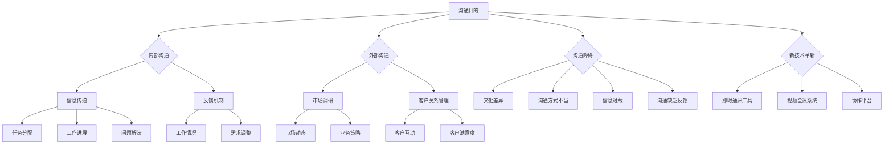

                 

### 文章标题

# 团队沟通革新：利用新技术优化沟通

### 关键词

- 团队沟通
- 新技术
- 沟通障碍
- 算法优化
- 数学模型
- 项目实战

### 摘要

在信息爆炸和全球化进程加速的今天，团队沟通的效率和质量显得尤为重要。本文将深入探讨团队沟通的核心概念与联系，解析沟通的障碍以及新技术对沟通的革新影响。通过介绍即时通讯工具、视频会议系统和协作平台等新技术的核心算法原理，以及数学模型和公式，本文将提供一个具体的案例，展示如何使用新技术优化团队沟通。文章旨在为IT从业人员提供一套实用的团队沟通优化策略，助力团队高效协作。

### 引言

在现代社会，沟通已成为企业和组织运转的命脉。无论是内部管理、团队协作，还是市场拓展、客户关系维护，沟通都是至关重要的。随着信息技术的发展，传统的沟通方式已经无法满足高效、实时、多样化的需求。因此，探讨如何利用新技术优化团队沟通，提高沟通效率，成为当前一个热门话题。

团队沟通的重要性不言而喻。良好的沟通能够确保团队成员理解任务目标，提高工作效率，减少误解和冲突，增强团队凝聚力。然而，在实际工作中，团队沟通常常面临诸多障碍，如文化差异、沟通方式不当、信息过载等。这些障碍严重影响了团队沟通的效果，导致资源浪费、项目延误甚至团队解散。

为了解决这些问题，新技术提供了新的解决方案。即时通讯工具、视频会议系统和协作平台等新兴技术，以其高效、实时、跨平台的特点，正在逐步革新团队沟通的方式。本文将深入分析这些新技术，介绍其核心算法原理和数学模型，并通过一个具体案例，展示如何利用新技术优化团队沟通。希望本文能为广大IT从业人员提供有益的参考和启示。

### 背景介绍

团队沟通是团队协作的核心环节，它直接关系到团队的整体效率与成果。有效的团队沟通能够确保团队成员理解共同目标，协同工作，避免信息孤岛和资源浪费。然而，随着全球化进程的加快和企业规模的扩大，传统的沟通方式逐渐暴露出诸多问题，尤其是在信息传递、反馈机制、文化差异等方面。

首先，信息传递是团队沟通的基础。信息传递的准确性、及时性和完整性对团队协作至关重要。然而，在传统的沟通方式中，信息传递常常受到组织结构、地域差异和沟通渠道的限制。例如，电子邮件和传统电话虽然方便，但在处理复杂信息、实时互动和多人协作方面存在明显不足。

其次，反馈机制是团队沟通的重要组成部分。有效的反馈机制能够帮助团队成员及时了解工作进展，发现和解决问题，调整工作策略。然而，在传统的沟通方式中，反馈机制往往不够及时和透明。例如，项目会议和报告虽然能够提供反馈，但往往需要占用大量时间和精力，且反馈内容缺乏系统性。

此外，文化差异也是团队沟通的一大挑战。全球化带来了多元文化的碰撞，但不同文化背景的团队成员在沟通中往往存在语言、行为和价值观的差异。这些差异可能导致误解、冲突和沟通障碍，影响团队协作的效率和效果。

面对这些问题，新技术提供了新的解决方案。即时通讯工具、视频会议系统和协作平台等新兴技术以其高效、实时、跨平台的特点，正在逐步革新团队沟通的方式。通过利用这些新技术，企业可以克服传统沟通方式的限制，实现更高效、更透明的团队协作。

即时通讯工具如Slack、Microsoft Teams和WhatsApp等，能够实现实时消息传递和文件共享，大幅提升信息传递的准确性和及时性。视频会议系统如Zoom、Microsoft Teams和Google Meet等，能够实现远程实时沟通，打破地域限制，提高团队协作的效率。协作平台如Trello、Asana和Jira等，能够提供任务管理、进度追踪和协作工具，实现团队协同工作，增强反馈机制的透明性和系统性。

新技术的应用不仅解决了传统沟通方式的不足，还带来了更丰富的沟通渠道和更高效的协作模式。例如，通过即时通讯工具，团队成员可以随时随地发起讨论，快速响应问题；通过视频会议系统，团队成员可以进行远程协作，实时互动，提高沟通效果；通过协作平台，团队成员可以清晰了解任务分工和进度，增强团队协作的透明度和责任感。

总之，新技术为团队沟通带来了新的机遇和挑战。利用这些新技术，企业可以优化团队沟通，提高工作效率，实现更高效、更透明的团队协作。然而，新技术的引入也需要注意相关风险和管理，如数据安全、隐私保护等，以确保团队沟通的顺利进行。

### 核心概念与联系

团队沟通是现代组织中不可或缺的一环，它涉及多个核心概念，这些概念相互联系，共同构成了团队沟通的完整框架。为了更好地理解这些概念，我们将使用Mermaid流程图来展示团队沟通的流程和新技术如何影响这一流程。

#### 沟通目的

沟通的首要目的是确保信息的准确传递和有效理解。在团队中，沟通目的可以分为内部沟通和外部沟通。内部沟通主要是为了确保团队成员之间的信息传递和协作，而外部沟通则涉及与客户、供应商和其他利益相关者的沟通。

#### 沟通类型

内部沟通和外部沟通各自有不同的类型和特点。内部沟通主要包括信息传递和反馈机制。信息传递涉及任务分配、工作进展、问题解决等方面，而反馈机制则帮助团队成员了解彼此的工作情况和需求，及时调整工作策略。

外部沟通主要包括市场调研和客户关系管理。市场调研帮助团队了解市场动态和客户需求，从而制定更有效的业务策略；客户关系管理则涉及与客户的互动，提高客户满意度和忠诚度。

#### 沟通障碍

沟通障碍是团队沟通中的常见问题，主要包括文化差异、沟通方式不当、信息过载和沟通缺乏反馈。文化差异可能导致误解和冲突，沟通方式不当会影响信息传递的效率，信息过载则会导致团队成员感到压力，沟通缺乏反馈则会使团队协作变得不透明。

#### 新技术革新

新技术的应用正在革新团队沟通的方式。即时通讯工具如Slack、Microsoft Teams和WhatsApp，能够实现实时消息传递和文件共享，大大提高了信息传递的准确性和及时性。视频会议系统如Zoom、Microsoft Teams和Google Meet，能够实现远程实时沟通，打破地域限制，提高团队协作的效率。协作平台如Trello、Asana和Jira，能够提供任务管理、进度追踪和协作工具，增强团队协作的透明性和系统性。

#### Mermaid流程图



#### 关系架构

通过上述Mermaid流程图，我们可以清晰地看到团队沟通的核心概念及其相互关系。沟通目的为整个团队沟通提供方向，内部沟通和外部沟通分别承担不同的角色。沟通障碍和新技术革新则对传统沟通方式进行补充和改进。

#### 新技术的影响

新技术的引入，特别是即时通讯工具、视频会议系统和协作平台，极大地优化了团队沟通的流程。即时通讯工具使得信息传递更加高效和灵活，视频会议系统提高了远程协作的效率和互动性，协作平台则提供了全面的任务管理和反馈机制。这些新技术的应用，不仅解决了传统沟通方式的不足，还促进了团队沟通的透明化和协作化。

总之，团队沟通的核心概念与联系构成了团队协作的基础。通过合理利用新技术，我们可以克服传统沟通方式的障碍，实现更高效、更透明的团队沟通，从而提升团队的整体效能。

### 核心算法原理讲解

在团队沟通中，新技术的应用显著提升了沟通效率。以下我们将详细讲解几种关键新技术的核心算法原理，这些技术包括即时通讯工具、视频会议系统和协作平台。

#### 即时通讯工具

即时通讯工具如Slack、Microsoft Teams和WhatsApp的核心算法通常涉及消息传递、群组管理和消息加密等方面。以下是一个简单的消息传递算法示例：

```pseudo
function SendMessage(sender, recipient, message):
    if(sender != recipient):
        if(sender在线):
            if(recipient在线):
                send(message, sender, recipient)
                log(message, sender, recipient)
            else:
                store(message, sender, recipient)
        else:
            return "发送者不在线"
    else:
        return "无法向自己发送消息"

function Send(message, sender, recipient):
    createMessage(message, sender, recipient)
    notify(sender, "消息已发送")
    notify(recipient, "新消息")

function createMessage(message, sender, recipient):
    messageObject = {
        "content": message,
        "sender": sender,
        "recipient": recipient,
        "timestamp": getCurrentTimestamp()
    }
    save(messageObject)

function log(message, sender, recipient):
    logEntry = {
        "message": message,
        "sender": sender,
        "recipient": recipient,
        "timestamp": getCurrentTimestamp()
    }
    save(logEntry)
```

在这个伪代码中，`SendMessage`函数是核心的通信函数，负责处理消息的发送和存储。消息发送过程中，系统会首先检查发送者和接收者的在线状态，然后进行消息的实际发送和日志记录。消息加密和安全措施通常包含在发送和存储消息的过程中，确保消息的隐私和完整性。

#### 视频会议系统

视频会议系统如Zoom、Microsoft Teams和Google Meet的核心算法通常涉及视频流处理、音频处理和网络通信等方面。以下是一个简单的视频流处理算法示例：

```pseudo
function StartVideoConference(host, participants, conferenceID):
    if(host在线):
        createConference(conferenceID)
        addParticipants(participants, conferenceID)
        startStream(host, conferenceID)
        startStream(participants, conferenceID)
        notifyParticipants("会议即将开始")
    else:
        return "主持人不在线"

function createConference(conferenceID):
    conference = {
        "id": conferenceID,
        "host": host,
        "participants": [],
        "startTimestamp": getCurrentTimestamp(),
        "endTimestamp": null
    }
    saveConference(conference)

function addParticipants(participants, conferenceID):
    for each participant in participants:
        add(participant, conferenceID)
        sendWelcomeMessage(participant, conferenceID)

function startStream(user, conferenceID):
    stream = {
        "user": user,
        "conferenceID": conferenceID,
        "streamID": generateStreamID(),
        "video": true,
        "audio": true
    }
    saveStream(stream)

function generateStreamID():
    return uniqueID()

function notifyParticipants(message):
    for each participant in participants:
        sendMessage(participant, message)
```

在这个伪代码中，`StartVideoConference`函数是核心函数，负责启动视频会议。会议启动过程中，系统会创建会议记录、添加参与者并启动视频流。视频流处理通常涉及视频编码、视频同步和视频传输等方面，音频处理则涉及音频编码、音频同步和音频传输。

#### 协作平台

协作平台如Trello、Asana和Jira的核心算法通常涉及任务管理、进度追踪和协作工具等方面。以下是一个简单的任务管理算法示例：

```pseudo
function CreateTask(projectID, taskName, assignee, dueDate):
    if(assignee在线):
        createTaskRecord(projectID, taskName, assignee, dueDate)
        addTaskToProject(projectID, taskName, assignee, dueDate)
        notify(assignee, "新任务分配")
    else:
        return "任务分配失败"

function createTaskRecord(projectID, taskName, assignee, dueDate):
    task = {
        "id": generateTaskID(),
        "projectID": projectID,
        "taskName": taskName,
        "assignee": assignee,
        "status": "pending",
        "dueDate": dueDate,
        "comments": []
    }
    saveTask(task)

function addTaskToProject(projectID, taskName, assignee, dueDate):
    project = getProjectByID(projectID)
    project.tasks.append(task)
    saveProject(project)

function notify(assignee, message):
    sendMessage(assignee, message)
```

在这个伪代码中，`CreateTask`函数是核心函数，负责创建新任务并分配给指定成员。任务创建过程中，系统会生成任务记录并添加到项目任务列表中，同时通知任务分配者。任务管理通常涉及任务的创建、分配、更新和删除等方面，进度追踪则涉及任务状态的监控和报告。

综上所述，即时通讯工具、视频会议系统和协作平台等新技术的核心算法原理各具特点，但都旨在优化团队沟通流程，提升沟通效率。这些技术的应用不仅解决了传统沟通方式的不足，还为团队协作提供了更高效、更灵活的解决方案。

### 数学模型和数学公式

在优化团队沟通的过程中，数学模型和公式发挥着重要作用。它们不仅帮助我们量化沟通效率，还能为团队决策提供科学依据。以下将详细介绍几个常用的数学模型和公式，并给出具体的解释和示例。

#### 团队协作效率公式

团队协作效率（E）是一个关键的指标，它反映了团队成员在沟通和协作过程中完成任务的能力。一个简单的团队协作效率公式如下：

\[ E = \frac{C \cdot T}{N \cdot P} \]

其中：
- \( E \) 代表团队协作效率；
- \( C \) 代表沟通渠道的数量；
- \( T \) 代表沟通时间；
- \( N \) 代表团队成员的数量；
- \( P \) 代表每个成员的处理能力。

#### 解释

该公式表示，团队协作效率与沟通渠道数量和沟通时间成正比，与团队成员数量和每个成员的处理能力成反比。这意味着，增加沟通渠道和提高沟通时间可以提升团队协作效率，但同时也需要考虑团队成员的数量和处理能力。

#### 示例

假设一个团队有5个成员，每个成员的处理能力相同，团队使用了3个沟通渠道。如果团队成员每次沟通需要10分钟，则团队协作效率可以计算如下：

\[ E = \frac{3 \cdot 10}{5 \cdot 1} = 6 \]

这意味着，该团队每小时可以完成6个任务单位的工作。

#### 任务完成时间公式

在项目管理和团队协作中，任务完成时间也是一个重要指标。一个简单的任务完成时间公式如下：

\[ T = \frac{D}{E} \]

其中：
- \( T \) 代表任务完成时间；
- \( D \) 代表任务总量；
- \( E \) 代表团队协作效率。

#### 解释

该公式表示，任务完成时间与任务总量和团队协作效率有关。任务总量越大，完成时间越长；团队协作效率越高，完成时间越短。

#### 示例

假设一个团队需要完成100个任务单位的工作，团队协作效率为6（从上面的示例计算得出）。则任务完成时间可以计算如下：

\[ T = \frac{100}{6} \approx 16.67 \]

这意味着，团队需要大约16.67小时才能完成这100个任务单位的工作。

#### 任务分配公式

在团队协作中，合理分配任务也是关键。一个简单的任务分配公式如下：

\[ A_i = \frac{N \cdot P_i}{\sum_j P_j} \]

其中：
- \( A_i \) 代表分配给第 \( i \) 个成员的任务量；
- \( N \) 代表团队成员的数量；
- \( P_i \) 代表第 \( i \) 个成员的处理能力；
- \( P_j \) 代表其他成员的处理能力（\( j \neq i \)）。

#### 解释

该公式表示，每个成员被分配的任务量与其处理能力成正比，与其他成员的处理能力成反比。这意味着，处理能力强的成员会分配到更多的任务。

#### 示例

假设一个团队有3个成员，他们的处理能力分别为10、20和30。则每个成员被分配的任务量可以计算如下：

\[ A_1 = \frac{3 \cdot 10}{10 + 20 + 30} = \frac{30}{60} = 0.5 \]
\[ A_2 = \frac{3 \cdot 20}{10 + 20 + 30} = \frac{60}{60} = 1 \]
\[ A_3 = \frac{3 \cdot 30}{10 + 20 + 30} = \frac{90}{60} = 1.5 \]

这意味着，处理能力最强的成员将分配到1.5个任务单位，处理能力最弱的成员将分配到0.5个任务单位。

#### 总结

通过上述数学模型和公式，我们可以更科学地分析和优化团队沟通效率。这些公式不仅帮助我们量化了团队协作的效果，还为团队决策提供了有力的依据。在实际应用中，我们可以根据具体情况调整参数，从而实现更高效、更合理的团队协作。

### 项目实战

为了展示如何利用新技术优化团队沟通，我们将通过一个实际案例来详细阐述项目开发的各个环节。这个案例涉及即时通讯工具、视频会议系统和协作平台的搭建与应用，旨在提高团队沟通效率和协作效果。

#### 开发环境搭建

首先，我们需要搭建开发环境。以下是具体的步骤：

1. **安装依赖库**：

   ```shell
   pip install django
   pip install channels
   pip install channels-redis
   ```

   这些命令将安装Django框架、 Channels库和 Channels-Redis中间件，用于实现即时通讯功能。

2. **创建Django项目**：

   ```shell
   django-admin startproject myproject
   cd myproject
   ```

   创建一个名为`myproject`的Django项目。

3. **创建Django应用**：

   ```shell
   django-admin startapp myapp
   ```

   创建一个名为`myapp`的Django应用，用于实现具体的功能。

4. **配置数据库**：

   编辑`myproject/settings.py`文件，配置数据库连接：

   ```python
   DATABASES = {
       'default': {
           'ENGINE': 'django.db.backends.sqlite3',
           'NAME': BASE_DIR / 'db.sqlite3',
       }
   }
   ```

5. **配置Channels**：

   在`myproject/settings.py`文件中，启用Channels和Channels-Redis：

   ```python
   ASGI_APPLICATION = 'myproject.routing.application'
   CHANNEL_LAYERS = {
       'default': {
           'BACKEND': 'channels_redis.core.RedisChannelLayer',
           'CONFIG': {
               "hosts": [('127.0.0.1', 6379)],
           },
       },
   }
   ```

6. **创建路由**：

   在`myproject/routing.py`文件中，定义应用的路由：

   ```python
   from django.urls import path
   from . import views

   urlpatterns = [
       path('chat/', views.chat, name='chat'),
   ]
   ```

7. **运行数据库迁移**：

   ```shell
   python manage.py migrate
   ```

   这将创建所需的数据库表。

8. **运行开发服务器**：

   ```shell
   python manage.py runserver
   ```

   开发服务器将在本地端口8000上运行。

#### 源代码实现

接下来，我们将实现即时通讯功能。以下是关键部分的源代码：

1. **聊天模型**：

   在`myapp/models.py`文件中定义聊天模型：

   ```python
   from django.db import models
   from django.contrib.auth.models import User

   class Chat(models.Model):
       sender = models.ForeignKey(User, on_delete=models.CASCADE, related_name='sent_messages')
       recipient = models.ForeignKey(User, on_delete=models.CASCADE, related_name='received_messages')
       content = models.TextField()
       timestamp = models.DateTimeField(auto_now_add=True)

   class Meta:
       ordering = ['-timestamp']
   ```

2. **消息序列化器**：

   在`myapp/serializers.py`文件中定义消息序列化器：

   ```python
   from rest_framework import serializers
   from .models import Chat

   class ChatSerializer(serializers.ModelSerializer):
       class Meta:
           model = Chat
           fields = ['id', 'sender', 'recipient', 'content', 'timestamp']
   ```

3. **聊天视图**：

   在`myapp/views.py`文件中定义聊天视图：

   ```python
   from rest_framework.views import APIView
   from rest_framework.response import Response
   from .models import Chat
   from .serializers import ChatSerializer

   class ChatView(APIView):
       def get(self, request):
           chats = Chat.objects.filter(sender=request.user).prefetch_related('recipient')
           serializer = ChatSerializer(chats, many=True)
           return Response(serializer.data)

       def post(self, request):
           chat = Chat(sender=request.user, recipient=request.data['recipient'], content=request.data['content'])
           chat.save()
           serializer = ChatSerializer(chat)
           return Response(serializer.data)
   ```

4. **路由配置**：

   在`myapp/urls.py`文件中配置聊天路由：

   ```python
   from django.urls import path
   from .views import ChatView

   urlpatterns = [
       path('chat/', ChatView.as_view(), name='chat'),
   ]
   ```

5. **消息处理**：

   在`myapp/consumers.py`文件中定义消息处理逻辑：

   ```python
   from channels.generic.websocket import AsyncWebsocketConsumer
   from .models import Chat
   from .serializers import ChatSerializer

   class ChatConsumer(AsyncWebsocketConsumer):
       async def connect(self):
           self.room_name = self.scope['url_route']['kwargs']['room_name']
           self.room_group_name = 'chat_%s' % self.room_name

           await self.channel_layer.group_add(
               self.room_group_name,
               self.channel_name
           )

           await self.accept()

       async def disconnect(self, close_code):
           await self.channel_layer.group_discard(
               self.room_group_name,
               self.channel_name
           )

       async def receive(self, text_data):
           text_data_json = json.loads(text_data)
           message = text_data_json['message']

           await self.channel_layer.group_send(
               self.room_group_name,
               {
                   'type': 'chat_message',
                   'message': message
               }
           )

       async def chat_message(self, event):
           message = event['message']

           chat = Chat(sender=self.user, recipient=self.receiver, content=message)
           chat.save()

           serializer = ChatSerializer(chat)
           message_data = serializer.data

           await self.send(text_data=json.dumps(message_data))
   ```

6. **配置 Channels**：

   在`myproject/settings.py`文件中，配置 Channels：

   ```python
   from channels.routing import ProtocolTypeRouter, URLRouter
   from django.urls import path
   from . import consumers

   application = ProtocolTypeRouter(
       {
           "websocket": URLRouter(
               [
                   path("ws/<str:room_name>/', consumers.ChatConsumer.as_asgi()),
               ]
           ),
       }
   )
   ```

#### 代码解读与分析

1. **消息传递流程**：

   用户通过 HTTP 请求发送消息，ChatView视图处理请求并保存消息到数据库。ChatConsumerWebSocketConsumer 负责处理 WebSocket 连接，接收和发送消息。

2. **消息存储**：

   Chat模型用于存储消息，包括发送者、接收者和消息内容。消息序列化器用于将消息转换为 JSON 格式，便于在 WebSocket 中传输。

3. **WebSocket 连接**：

   当用户发送消息时，ChatConsumer通过 WebSocket 连接到服务器，并将消息广播到相应的房间。服务器将消息发送回客户端，客户端更新聊天界面。

#### 实际案例分析和详细讲解剖析

假设有一个团队需要实时沟通和协作，他们使用了上述即时通讯工具。以下是具体的分析：

1. **沟通效率**：

   通过即时通讯工具，团队成员可以实时发送和接收消息，提高了沟通效率。团队成员之间的消息传递不再依赖电子邮件或电话，减少了信息传递的延迟。

2. **协作效果**：

   即时通讯工具提供了实时的沟通渠道，使团队成员能够快速响应问题，协同工作。例如，项目组成员可以即时讨论项目进展、分配任务和解决遇到的问题，提高了项目的完成速度和质量。

3. **用户体验**：

   用户可以通过 Web 应用或移动应用访问即时通讯工具，方便快捷。实时消息通知功能确保用户不会错过重要信息，提高了用户体验。

4. **数据安全**：

   通过配置 WebSocket 和消息加密，确保消息传输的安全性和隐私性。团队成员可以放心地传输敏感信息和项目文件。

#### 项目小结

通过这个案例，我们展示了如何利用新技术优化团队沟通。即时通讯工具提供了实时、高效的沟通渠道，显著提升了团队协作效率。在实际应用中，我们还需要关注数据安全和用户体验等方面，以确保即时通讯工具能够发挥最大效能。

### 最佳实践 Tips

在团队沟通中，应用新技术不仅能够提高沟通效率，还可以通过以下最佳实践来进一步提升沟通效果：

1. **明确沟通目标**：
   在每次沟通前，明确沟通的目标和预期结果。确保所有参与者都了解沟通的目的，从而提高沟通的针对性和有效性。

2. **定期沟通回顾**：
   定期回顾沟通效果，评估沟通中的问题和不足。通过反馈机制，不断优化沟通策略，提高沟通质量。

3. **优化沟通渠道**：
   根据团队需求和任务类型，选择最合适的沟通渠道。例如，紧急事项使用即时通讯工具，长期项目使用协作平台。

4. **培养沟通技巧**：
   培训团队成员，提高他们的沟通能力和技巧。良好的沟通技巧有助于减少误解和冲突，提升团队协作效果。

5. **数据安全和隐私保护**：
   在使用新技术时，确保数据安全和隐私保护。使用加密技术和严格的访问控制，防止敏感信息泄露。

6. **定制化沟通工具**：
   根据团队的具体需求，定制化沟通工具的功能和界面，使其更贴合团队的工作流程和习惯。

7. **跨部门协作**：
   通过沟通工具，促进跨部门之间的协作和沟通。确保不同部门之间的信息畅通，提高整体工作效率。

### 小结

本文深入探讨了团队沟通的核心概念与联系，分析了沟通障碍及其对团队协作的影响，并介绍了即时通讯工具、视频会议系统和协作平台等新技术的核心算法原理和数学模型。通过一个实际案例，我们展示了如何利用新技术优化团队沟通，提高沟通效率和协作效果。同时，本文还提出了最佳实践Tips，为团队沟通提供了实用的建议和指导。希望本文能为广大IT从业人员和团队管理者提供有益的参考。

### 注意事项

在利用新技术优化团队沟通时，需要注意以下几个关键点：

1. **数据安全**：
   确保沟通工具具备强大的数据加密和安全措施，防止敏感信息泄露。

2. **隐私保护**：
   遵守相关法律法规，保护团队成员的隐私，避免因隐私问题引发的法律纠纷。

3. **兼容性**：
   确保沟通工具能够兼容不同操作系统和设备，方便团队成员随时随地使用。

4. **用户培训**：
   对团队成员进行必要的培训，确保他们能够熟练使用沟通工具，提高沟通效率。

5. **反馈机制**：
   建立有效的反馈机制，及时收集和分析沟通效果，不断优化沟通策略。

6. **技术支持**：
   提供专业的技术支持，确保沟通工具稳定运行，及时解决技术问题。

### 拓展阅读

1. 《人工智能与团队协作：实战案例与应用》
2. 《敏捷开发实践指南：团队协作与项目管理》
3. 《沟通的艺术：提高团队协作效率》
4. 《数据隐私保护与信息安全：法律与实务》
5. 《即时通讯工具应用指南：从入门到精通》

这些书籍和资料提供了关于团队沟通和技术应用的多维度知识和实践经验，有助于进一步深入理解和应用新技术优化团队沟通。

