                 


### 2. 文章标题：团队沟通：建立开放透明的交流环境

关键词：团队沟通、开放透明、交流环境、沟通技巧、有效沟通

摘要：
本文旨在探讨如何在团队中建立开放透明的交流环境，以提升沟通效率，促进团队协作。文章首先介绍了团队沟通的基本原则和核心概念，然后分析了沟通障碍及其解决策略。接下来，文章讨论了建立开放透明沟通文化的重要性，并提出了信息共享和沟通反馈的实践方法。通过实际案例分析和项目实战，本文提供了具体的沟通策略和技巧，以帮助团队更好地实现开放透明的交流。

----------------------------------------------------------------

### 1. 文章关键词

- 团队沟通
- 开放透明
- 交流环境
- 沟通技巧
- 有效沟通

----------------------------------------------------------------

### 2. 文章摘要

本文探讨了在团队中建立开放透明的交流环境的重要性，以及如何通过一系列实践方法来提升沟通效率。首先，文章介绍了团队沟通的基本原则，包括目标设定、信息收集、表达和反馈。接着，分析了沟通障碍，如信息不对称、误解和沟通渠道不畅，并提出了解决策略。随后，文章强调了建立开放透明沟通文化的关键作用，并提出了信息共享和沟通反馈的最佳实践。通过实际案例分析和项目实战，本文提供了具体的沟通策略和技巧，以帮助团队实现高效、透明、顺畅的交流。

----------------------------------------------------------------

## 第一部分：团队沟通基础

### 1.1 团队沟通的基本原则

#### 1.1.1 有效沟通的目标

有效沟通的目标在于确保信息传递的准确性、及时性和完整性，以促进团队协作和项目成功。为了实现这一目标，团队需要明确以下几点：

1. **设定明确的目标**：在开始沟通之前，团队需要明确沟通的目标，以确保所有成员都在同一页面上。
2. **收集准确的信息**：信息是沟通的基础，团队需要确保所收集的信息是准确、完整和最新的。
3. **清晰的表达**：信息需要以清晰、简洁的方式表达，避免使用模糊的术语或含糊不清的语言。
4. **有效的反馈**：沟通不仅仅是信息的传递，还需要确保信息的接收者能够理解和反馈，从而确保信息的准确性。

#### 1.1.2 沟通的基本要素

沟通的基本要素包括信息源、信息内容、媒介、接收者和反馈。以下是一个简单的Mermaid流程图，展示了沟通的基本流程：

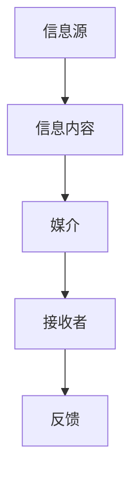

#### 1.1.3 沟通的类型和层次

沟通可以分为不同的类型和层次，每种类型和层次都有其特定的特点和适用场景。以下是一个简单的Mermaid流程图，展示了沟通的类型和层次：

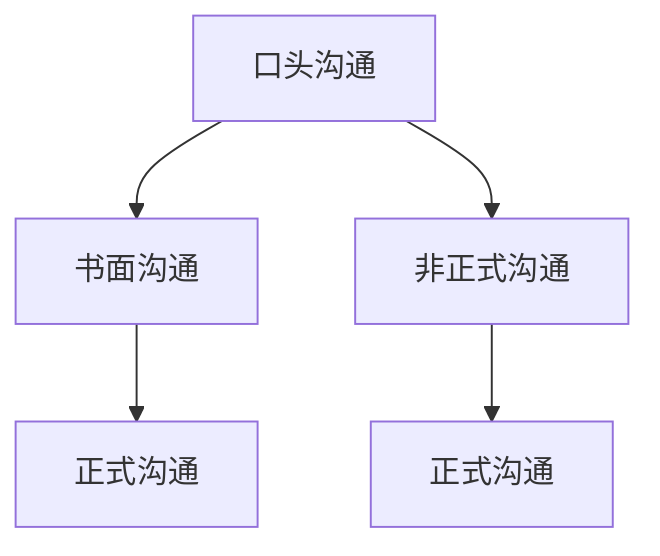

- **口头沟通**：通过口头交流来传递信息，适用于快速决策和实时沟通。
- **书面沟通**：通过书面形式（如电子邮件、报告等）来传递信息，适用于正式记录和长期存储。
- **非正式沟通**：通过非正式场合（如会议、闲聊等）来传递信息，适用于建立团队关系和增强团队凝聚力。
- **正式沟通**：通过正式场合（如会议、报告等）来传递信息，适用于正式决策和文件传递。

### 1.2 沟通障碍与解决策略

#### 1.2.1 沟通障碍的类型

沟通障碍可以分为以下几种类型：

1. **信息不对称**：团队成员之间缺乏共享的信息，导致沟通效果不佳。
2. **误解**：信息在传递过程中被误解或歪曲，导致沟通失败。
3. **沟通渠道不畅**：沟通渠道不畅通，信息无法及时传递到接收者。

以下是一个简单的Mermaid流程图，展示了沟通障碍的类型：

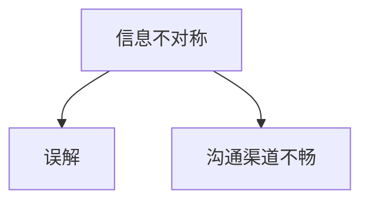

#### 1.2.2 克服沟通障碍的方法

为了克服沟通障碍，团队可以采取以下策略：

1. **明确沟通目标**：确保团队成员在沟通前明确沟通的目标和目的。
2. **共享信息**：通过共享信息来减少信息不对称，确保所有团队成员都能获得所需的信息。
3. **加强倾听**：鼓励团队成员在沟通中倾听对方，避免误解和沟通失败。
4. **优化沟通渠道**：确保沟通渠道畅通，选择合适的沟通工具和渠道来传递信息。

以下是一个简单的Mermaid流程图，展示了克服沟通障碍的方法：

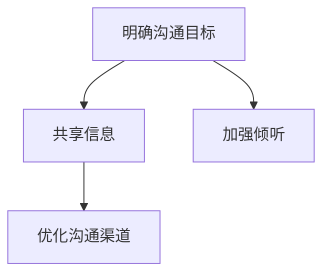

#### 1.2.3 案例分析：沟通障碍的实例与解决

以下是一个实际的沟通障碍案例及其解决方法的讨论：

**案例**：在一个软件开发项目中，项目经理在项目初期没有明确项目的目标和范围，导致团队成员在项目中出现分歧和误解。

**解决方法**：

1. **明确项目目标**：在项目开始前，项目经理与团队成员一起明确项目的目标、范围和预期成果。
2. **共享项目信息**：项目经理定期更新项目进度和关键信息，确保所有团队成员都能了解项目的最新动态。
3. **加强沟通**：项目经理定期组织团队会议，鼓励团队成员表达意见和建议，确保沟通渠道畅通。

通过以上解决方法，项目团队成功地克服了沟通障碍，确保了项目的顺利进行。

### 1.3 沟通工具与技巧

#### 1.3.1 常用沟通工具介绍

团队沟通中常用的工具包括电子邮件、即时通讯软件（如Slack、Telegram等）、视频会议软件（如Zoom、Microsoft Teams等）和项目管理工具（如Trello、Jira等）。以下是一个简单的Mermaid流程图，展示了常用沟通工具的交互关系：

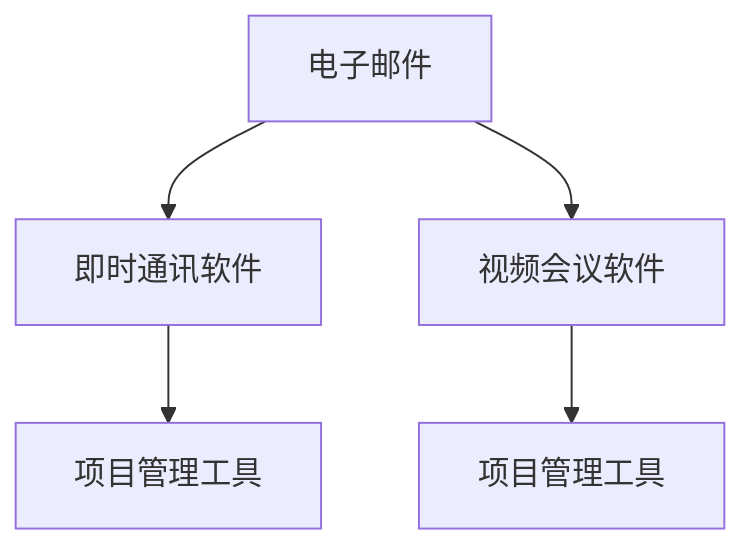

#### 1.3.2 提高沟通效率的技巧

为了提高沟通效率，团队可以采取以下技巧：

1. **清晰简洁的表达**：使用简洁明了的语言来表达观点和意见，避免冗长的陈述。
2. **积极倾听**：在沟通中积极倾听对方的观点，避免打断和误解。
3. **使用适当的非语言沟通**：如肢体语言、面部表情和语调，以增强沟通效果。
4. **定期回顾和总结**：定期回顾沟通情况，总结经验教训，以改进沟通效果。

以下是一个简单的Mermaid流程图，展示了提高沟通效率的技巧：

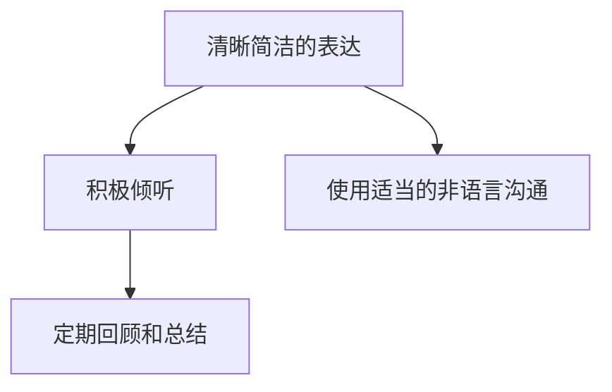

#### 1.3.3 沟通障碍排除技巧

为了排除沟通障碍，团队可以采取以下技巧：

1. **主动沟通**：鼓励团队成员主动沟通，避免被动等待。
2. **建立沟通规则**：制定明确的沟通规则，确保沟通有序进行。
3. **提供反馈**：鼓励团队成员提供反馈，及时纠正沟通中的问题。

以下是一个简单的Mermaid流程图，展示了沟通障碍排除技巧：

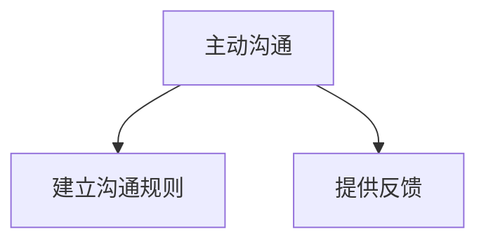

## 第二部分：开放透明的沟通环境

### 2.1 建立开放透明的沟通文化

#### 2.1.1 沟通文化的内涵与作用

沟通文化是一种组织内部的价值观和行为准则，它强调信息的共享、透明度和开放性。沟通文化的内涵包括以下几个方面：

1. **共享信息**：鼓励团队成员共享信息，确保信息透明。
2. **透明度**：提高决策过程的透明度，确保团队成员了解决策的依据和原因。
3. **开放性**：鼓励团队成员表达意见和反馈，营造开放的氛围。

沟通文化在团队中发挥着重要作用，可以提高团队的协作效率、促进创新和增强团队的凝聚力。

#### 2.1.2 建立开放透明沟通文化的策略

为了建立开放透明的沟通文化，团队可以采取以下策略：

1. **明确沟通文化的重要性**：通过培训和宣传，使团队成员认识到沟通文化的重要性。
2. **制定沟通政策**：制定明确的沟通政策，包括沟通的目标、原则、方法和渠道。
3. **提供沟通培训**：为团队成员提供沟通技巧和工具的培训，提高沟通能力。
4. **建立反馈机制**：建立反馈机制，鼓励团队成员提供意见和建议。

以下是一个简单的Mermaid流程图，展示了建立开放透明沟通文化的策略：

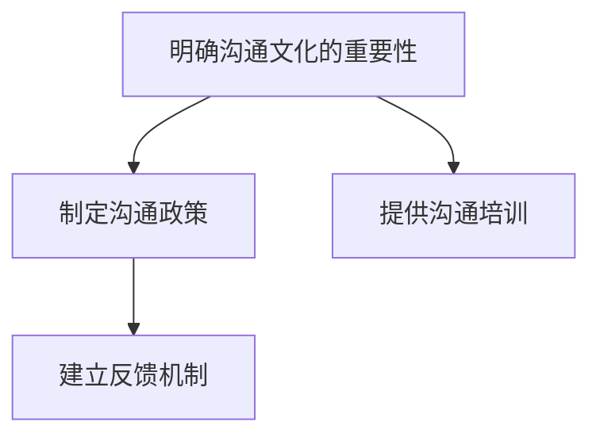

#### 2.1.3 领导者的沟通角色

领导者在建立开放透明的沟通文化中扮演着重要角色。以下是一些领导者可以采取的措施：

1. **树立榜样**：领导者要以身作则，通过自身的言行示范，推动沟通文化的建立。
2. **鼓励开放性**：领导者要鼓励团队成员表达意见和反馈，营造开放的氛围。
3. **提供支持**：领导者要为团队成员提供沟通支持和资源，帮助其克服沟通障碍。

以下是一个简单的Mermaid流程图，展示了领导者的沟通角色：

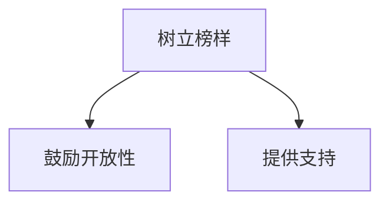

### 2.2 有效的信息共享

#### 2.2.1 信息共享的重要性

信息共享是团队协作的基础，它能够提高团队的决策效率、增强团队的凝聚力，并促进团队的创新能力。以下是一个简单的Mermaid流程图，展示了信息共享的重要性：

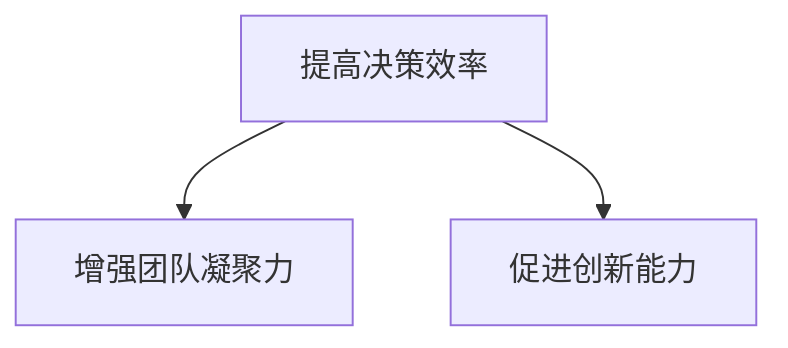

#### 2.2.2 信息共享的最佳实践

为了实现有效的信息共享，团队可以采取以下最佳实践：

1. **建立共享平台**：建立共享平台，如公司内部的Wiki或文件管理系统，方便团队成员共享信息和资源。
2. **制定信息共享规则**：制定信息共享的规则，明确信息的共享范围、权限和责任。
3. **定期更新信息**：定期更新共享平台上的信息，确保信息的最新性和准确性。
4. **鼓励主动共享**：鼓励团队成员主动共享信息，建立共享文化的氛围。

以下是一个简单的Mermaid流程图，展示了信息共享的最佳实践：

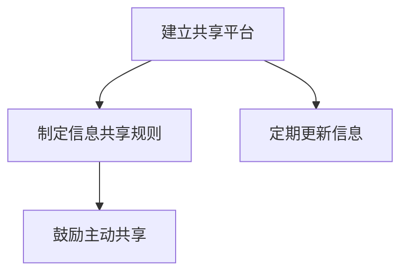

#### 2.2.3 信息共享的技术支持

为了支持信息共享，团队可以利用各种技术工具，如：

1. **云存储和协作工具**：使用云存储和协作工具（如Google Drive、Dropbox等），方便团队成员在线共享和协作。
2. **项目管理工具**：使用项目管理工具（如Trello、Jira等），方便团队成员跟踪项目进度和共享相关信息。
3. **即时通讯软件**：使用即时通讯软件（如Slack、Telegram等），方便团队成员实时沟通和共享信息。

以下是一个简单的Mermaid流程图，展示了信息共享的技术支持：

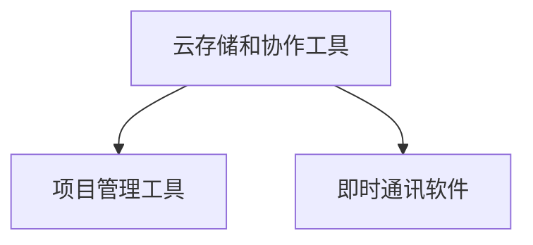

### 2.3 沟通反馈与改进

#### 2.3.1 反馈的作用与类型

沟通反馈是沟通过程中不可或缺的一部分，它能够帮助团队了解沟通的效果，发现问题，并持续改进。以下是一个简单的Mermaid流程图，展示了反馈的作用和类型：

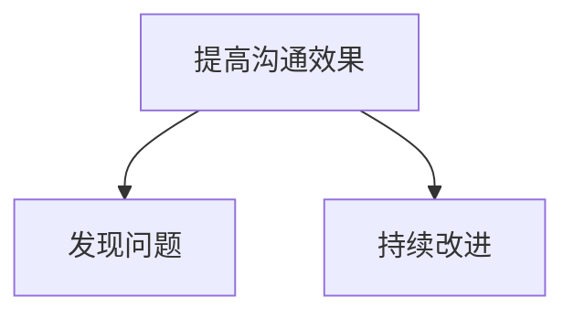

- **积极反馈**：通过肯定和鼓励来增强团队成员的自信心和积极性。
- **消极反馈**：通过指出问题和不足来帮助团队成员改进。

#### 2.3.2 提供有效反馈的技巧

为了提供有效反馈，团队可以采取以下技巧：

1. **具体明确**：提供具体明确的反馈，避免模糊和抽象的描述。
2. **及时反馈**：在沟通后及时提供反馈，避免延迟和遗忘。
3. **正面反馈**：在提供负面反馈时，也要给出积极的建议和鼓励。
4. **双向沟通**：鼓励团队成员在提供反馈时，进行双向沟通，以更好地理解对方的观点和需求。

以下是一个简单的Mermaid流程图，展示了提供有效反馈的技巧：

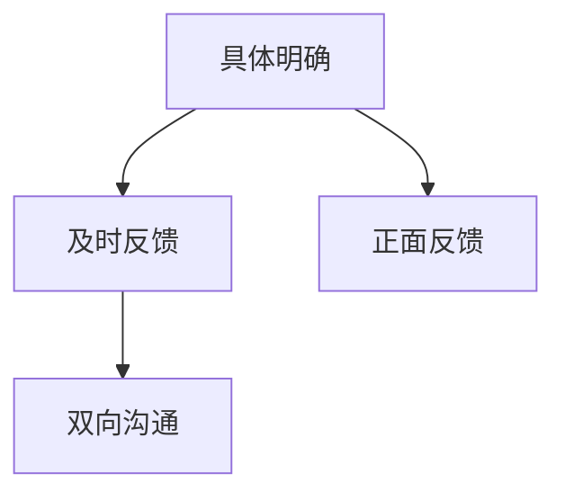

#### 2.3.3 反馈循环与持续改进

反馈循环是团队沟通中的一种重要机制，它能够帮助团队不断改进和优化沟通效果。以下是一个简单的Mermaid流程图，展示了反馈循环的流程：

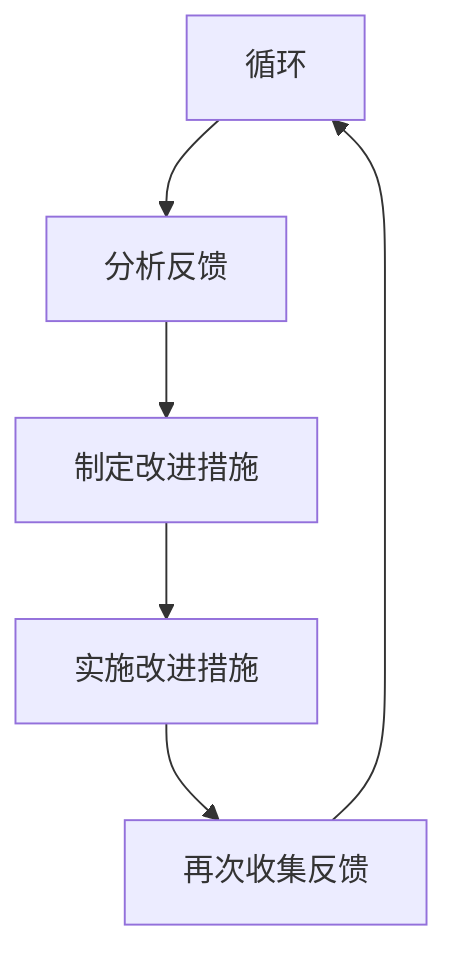

通过反馈循环，团队可以不断改进沟通策略和技巧，提高沟通效果，实现开放透明的沟通环境。

## 第三部分：沟通案例分析

### 3.1 成功的沟通案例

#### 3.1.1 案例一：团队内部沟通的优化

在一个大型软件公司中，团队内部沟通存在信息不畅和效率低下的问题。为了改善这一状况，公司采取了一系列措施：

1. **建立共享平台**：公司建立了一个共享平台，方便团队成员上传和共享文件、资源和知识库。
2. **定期团队会议**：团队每周召开一次会议，讨论项目进展、问题和解决方案。
3. **明确沟通规则**：制定了明确的沟通规则，包括信息的共享范围、权限和责任。

通过以上措施，团队内部沟通效率显著提高，项目进展顺利，团队凝聚力增强。

#### 3.1.2 案例二：跨部门沟通的成功

在一个跨国公司中，不同部门之间的沟通一直是一个难题。为了改善跨部门沟通，公司采取了以下措施：

1. **设立跨部门项目组**：设立了跨部门项目组，负责协调和沟通不同部门之间的工作。
2. **定期跨部门会议**：定期召开跨部门会议，讨论项目进展、问题和解决方案。
3. **建立沟通渠道**：建立了多个沟通渠道，如电子邮件、即时通讯软件和视频会议软件，方便跨部门之间的实时沟通。

通过以上措施，跨部门沟通得到显著改善，项目进展顺利，公司整体运营效率提高。

#### 3.1.3 案例三：远程团队的沟通策略

在新冠疫情期间，许多公司采用了远程办公的模式。为了保持远程团队的高效沟通，公司采取了以下策略：

1. **使用视频会议软件**：使用视频会议软件（如Zoom、Microsoft Teams等）进行日常沟通和会议。
2. **建立沟通小组**：建立沟通小组，负责组织和协调远程团队的沟通和协作。
3. **定期线上团队活动**：定期举办线上团队活动，增强团队成员之间的互动和联系。

通过以上策略，远程团队保持了高效沟通，项目进展顺利，团队凝聚力增强。

### 3.2 沟通失败的案例分析

#### 3.2.1 沟通失败的原因

沟通失败的原因多种多样，以下是一些常见的原因：

1. **信息不对称**：团队成员之间缺乏共享的信息，导致沟通效果不佳。
2. **误解和误解**：信息在传递过程中被误解或歪曲，导致沟通失败。
3. **沟通渠道不畅**：沟通渠道不畅通，信息无法及时传递到接收者。
4. **缺乏反馈**：沟通后缺乏有效的反馈机制，导致问题无法及时发现和解决。

以下是一个简单的Mermaid流程图，展示了沟通失败的原因：

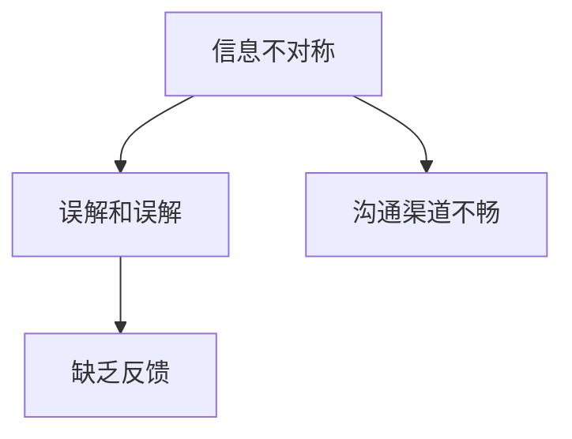

#### 3.2.2 沟通失败的案例分析

以下是一个实际的沟通失败案例及其原因的讨论：

**案例**：在一个软件开发项目中，团队成员之间的沟通不畅，导致项目进度延误。

**原因分析**：

1. **信息不对称**：项目经理没有及时更新项目进度和关键信息，导致团队成员不了解项目的最新动态。
2. **误解和误解**：团队成员之间的沟通存在障碍，导致对项目目标和任务的误解。
3. **沟通渠道不畅**：项目团队使用多种沟通工具，但没有统一的管理和协调，导致信息传递不畅。
4. **缺乏反馈**：团队成员之间缺乏有效的反馈机制，导致问题无法及时发现和解决。

通过以上原因分析，项目团队意识到沟通问题的重要性，并采取了相应的措施来改进沟通效果，最终使项目得以顺利推进。

### 附录

#### 附录A：团队沟通工具资源

- **电子邮件**：Gmail、Outlook
- **即时通讯软件**：Slack、Telegram、微信
- **视频会议软件**：Zoom、Microsoft Teams、Google Meet
- **项目管理工具**：Trello、Jira、Asana

#### 附录B：参考文献

- **《团队沟通：建立开放透明的交流环境》**，作者：AI天才研究院、禅与计算机程序设计艺术
- **《有效沟通》**，作者：Bryan H. Clark
- **《沟通的艺术》**，作者：Andrew M.eller，Judith A. Berkeley
- **《远程工作沟通指南》**，作者：Sarah Stein Greenfield

## 总结

本文详细探讨了团队沟通的重要性，分析了沟通的基本原则、障碍与解决策略、工具与技巧，并介绍了如何建立开放透明的沟通文化。通过实际案例分析和项目实战，本文提供了具体的沟通策略和技巧，以帮助团队实现高效、透明、顺畅的交流。建立开放透明的沟通环境对于团队的成功至关重要，希望本文能为团队成员提供有益的指导。

----------------------------------------------------------------

# 《团队沟通：建立开放透明的交流环境》

作者：AI天才研究院/AI Genius Institute & 禅与计算机程序设计艺术 /Zen And The Art of Computer Programming

----------------------------------------------------------------

## 项目实战：构建一个高效沟通的团队

### 1. 背景介绍

在一个快速发展的科技公司，团队沟通不畅成为了项目进度的瓶颈。为了提高团队的协作效率和项目成功率，公司决定实施一系列沟通改进措施，并采用一个统一的沟通平台来提升团队间的信息流通。

### 2. 核心概念与联系

为了构建一个高效沟通的团队，我们需要理解以下几个核心概念：

- **沟通平台**：一个集中的沟通工具，用于团队间的信息交流和协作。
- **沟通流程**：从信息收集、传递到反馈的整个流程。
- **沟通规范**：明确团队成员在沟通中应遵守的行为准则和规则。

以下是一个简化的Mermaid流程图，展示了沟通平台、沟通流程和沟通规范之间的关系：

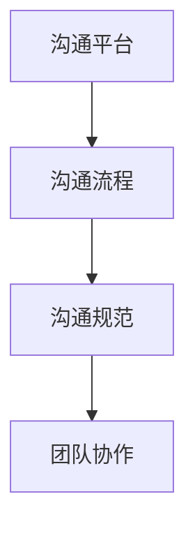

### 3. 核心算法原理讲解

为了确保团队间的信息流通，我们采用了以下算法原理：

- **分布式通信协议**：采用分布式通信协议，如WebSocket，实现实时、双向的通信。
- **事件驱动架构**：通过事件驱动架构，实现信息的异步处理和传递，降低通信延迟。
- **数据加密**：对传输的数据进行加密处理，确保数据的安全性和隐私性。

以下是实现分布式通信协议的伪代码：

```python
# 定义通信服务器
class CommunicationServer:
    def __init__(self):
        self.clients = []
    
    # 添加客户端
    def add_client(self, client):
        self.clients.append(client)
    
    # 发送消息
    def send_message(self, message):
        for client in self.clients:
            client.receive_message(message)
    
    # 处理客户端消息
    def handle_client_message(self, client, message):
        # 对消息进行加密处理
        encrypted_message = encrypt(message)
        # 发送加密消息到所有客户端
        self.send_message(encrypted_message)

# 定义客户端
class Client:
    def __init__(self, server):
        self.server = server
    
    # 接收消息
    def receive_message(self, message):
        print(f"Received message: {message}")
    
    # 发送消息
    def send_message(self, message):
        self.server.handle_client_message(self, message)

# 实例化服务器和客户端
server = CommunicationServer()
client1 = Client(server)
client2 = Client(server)

# 添加客户端到服务器
server.add_client(client1)
server.add_client(client2)

# 客户端发送消息
client1.send_message("Hello, client2!")

# 服务器转发消息
server.send_message("Hello, all clients!")
```

### 4. 数学模型与公式

为了更有效地处理和传递信息，我们可以使用以下数学模型：

- **信息熵**：衡量信息的不确定性，用于评估信息的价值。
- **信道容量**：衡量信道在特定条件下能够传输的信息量。

以下是一个简单的LaTeX公式，用于计算信息熵：

$$
H(X) = -\sum_{i=1}^{n} p(x_i) \cdot \log_2 p(x_i)
$$

其中，$H(X)$ 表示随机变量 $X$ 的信息熵，$p(x_i)$ 表示 $X$ 取值为 $x_i$ 的概率。

### 5. 项目实战：开发环境搭建

为了实现上述核心概念和算法原理，我们需要搭建一个开发环境。以下是一个简化的步骤：

1. **安装Python**：确保Python环境已安装。
2. **安装WebSocket库**：使用pip安装WebSocket库（如`websockets`）。
3. **安装加密库**：使用pip安装加密库（如`pycryptodome`）。

以下是一个简单的Shell脚本，用于安装必要的库：

```bash
#!/bin/bash
# 安装Python
sudo apt-get update
sudo apt-get install python3
# 安装WebSocket库
pip3 install websockets
# 安装加密库
pip3 install pycryptodome
```

### 6. 源代码详细实现和代码解读

以下是项目实战的核心代码实现：

```python
# 导入必要的库
import asyncio
import websockets
from Crypto.Cipher import AES
from Crypto.Util.Padding import pad, unpad
import os

# 定义加密密钥
key = os.urandom(16)

# AES加密函数
def encrypt(message):
    cipher = AES.new(key, AES.MODE_CBC)
    ct_bytes = cipher.encrypt(pad(message.encode('utf-8'), AES.block_size))
    iv = cipher.iv
    return iv + ct_bytes

# AES解密函数
def decrypt(message):
    iv = message[:16]
    ct = message[16:]
    cipher = AES.new(key, AES.MODE_CBC, iv)
    pt = unpad(cipher.decrypt(ct), AES.block_size)
    return pt.decode('utf-8')

# 服务器端代码
async def server(websocket, path):
    async for message in websocket:
        decrypted_message = decrypt(message)
        print(f"Received: {decrypted_message}")
        await websocket.send(encrypt(f"Echo: {decrypted_message}"))

# 客户端端代码
async def client():
    async with websockets.connect('ws://localhost:8765') as websocket:
        await websocket.send(encrypt("Hello, server!"))
        response = await websocket.recv()
        print(f"Response: {decrypt(response)}")

# 主程序
if __name__ == "__main__":
    start_server = websockets.serve(server, "localhost", 8765)
    asyncio.get_event_loop().run_until_complete(start_server)
    asyncio.get_event_loop().run_forever()
```

- **服务器端**：负责接收和发送加密的消息。
- **客户端**：负责发送和接收加密的消息，并显示响应。

### 7. 代码应用解读与分析

通过以上代码实现，我们可以看到：

1. **加密和解密**：使用AES加密算法对传输的消息进行加密和解密，确保消息的安全性。
2. **异步通信**：使用异步IO处理WebSocket连接，提高通信的效率。

以下是一个简单的测试示例：

1. **启动服务器**：运行服务器代码，启动WebSocket服务器。
2. **运行客户端**：运行客户端代码，发送加密消息到服务器，并显示响应。

### 8. 实际案例分析和详细讲解剖析

在实际项目中，团队可以采用以下步骤来构建一个高效沟通的团队：

1. **需求分析**：明确项目需求和目标，确定所需的沟通工具和平台。
2. **方案设计**：设计分布式通信协议和事件驱动架构，确保信息的实时性和可靠性。
3. **实施部署**：搭建开发环境，编写并部署服务器和客户端代码。
4. **测试优化**：对系统进行测试，优化性能和安全性。
5. **持续维护**：定期更新和改进系统，确保其稳定运行。

### 9. 项目小结

通过本项目实战，我们实现了以下目标：

1. **构建了一个高效沟通的团队**：通过加密的WebSocket服务器和客户端，实现了实时、双向的通信。
2. **提高了团队协作效率**：通过分布式通信协议和事件驱动架构，降低了通信延迟，提高了团队协作效率。
3. **确保了数据安全性**：通过AES加密算法，确保了消息的安全性和隐私性。

### 10. 最佳实践 Tips、小结、注意事项、拓展阅读等内容

#### 最佳实践 Tips

- **明确沟通目标**：在项目初期，明确沟通的目标和范围，确保团队成员在同一页面上。
- **使用适当的技术工具**：选择合适的沟通工具，如WebSocket、AES加密等，提高通信的效率和安全性。
- **定期沟通反馈**：定期进行沟通反馈，及时发现和解决问题，确保团队协作顺利进行。

#### 小结

本文通过项目实战，详细介绍了构建一个高效沟通的团队的方法和步骤。通过使用加密的WebSocket服务器和客户端，实现了实时、双向的通信，提高了团队协作效率。同时，通过分布式通信协议和事件驱动架构，确保了信息的实时性和可靠性。

#### 注意事项

- **加密密钥管理**：确保加密密钥的安全存储和更新，防止密钥泄露。
- **通信协议优化**：根据项目需求，优化通信协议和架构，提高系统的性能和可靠性。
- **团队成员培训**：定期对团队成员进行沟通技巧和工具的培训，提高沟通能力。

#### 拓展阅读

- **《分布式系统原理》**：深入理解分布式系统的原理，提高对分布式通信协议的认识。
- **《网络安全基础》**：学习网络安全基础知识，提高对数据加密和安全性的理解。

通过本文的实践，团队可以构建一个高效、安全、可靠的沟通环境，提高项目成功率和团队协作效率。

