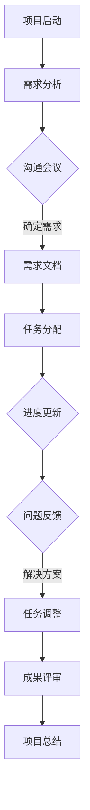

                 

### 文章标题

《团队沟通：构建开放透明的沟通文化》

### 关键词

团队沟通、开放透明、沟通文化、有效策略、冲突解决、领导者艺术、技术应用、案例分析

### 摘要

在现代IT行业中，团队沟通的效率和质量直接影响到项目成功与否。本文旨在探讨如何构建开放透明的沟通文化，以提升团队协作效果。通过分析团队沟通的重要性、核心概念、有效策略、冲突解决技巧、领导者艺术以及技术在团队沟通中的应用，本文提供了全面且实用的指导，助力团队在复杂的项目中实现高效协作，为IT行业中的团队管理者提供实战经验和最佳实践建议。本文还通过案例分析，分享了构建开放透明沟通文化的具体方法和成功经验，为读者提供了可操作的实施路径。总之，本文不仅为团队成员提供了沟通技能的提升途径，也为团队管理者构建了高效沟通的管理框架。

## 第1章 引言

### 1.1 团队沟通的重要性

在当今快速发展的IT行业中，团队沟通的重要性不言而喻。随着项目复杂性的增加和团队成员多样性的提升，如何高效地沟通成为了团队成功的关键因素之一。良好的团队沟通不仅能提高工作效率，还能增强团队凝聚力，减少误解和冲突，从而实现项目的顺利推进。

首先，团队沟通是知识共享的重要途径。在一个项目团队中，每个成员都拥有特定的技能和知识，通过有效的沟通，这些知识可以迅速传递和共享，使整个团队能够迅速应对项目中的各种挑战。例如，在软件开发过程中，前端开发人员与后端开发人员之间的沟通可以确保前端界面与后端功能的无缝对接，从而提高软件的质量和用户体验。

其次，团队沟通有助于团队目标的统一。一个明确且被全体成员认可的项目目标是团队努力的方向，而良好的沟通则是确保团队成员对目标有共同理解的重要保障。通过定期的会议、讨论和报告，团队成员可以及时了解项目进展，调整工作方向，确保团队始终保持在一个正确的轨道上。

此外，团队沟通还能够提高团队的整体工作效率。通过有效的沟通，团队成员可以明确各自的工作职责和任务，避免重复劳动和资源浪费。例如，项目经理通过沟通可以了解团队成员的工作进度和困难，及时提供支持和资源，确保项目按时交付。

最后，团队沟通是团队文化建设的重要组成部分。一个开放、透明和包容的沟通文化可以增强团队成员之间的信任和协作，使团队更加团结一致，面对外部挑战时更具凝聚力。例如，通过定期的团队建设活动，团队成员可以更好地了解彼此，增强团队之间的默契和信任。

总之，团队沟通在IT行业中具有至关重要的地位。它不仅是知识共享和目标统一的保障，也是提高工作效率和团队文化建设的重要手段。因此，构建高效的团队沟通机制，对于现代IT团队的成功至关重要。

### 1.2 开放透明的沟通文化

开放透明的沟通文化是构建高效团队的关键要素。这种文化强调信息的自由流动，鼓励团队成员之间坦诚地交流思想和意见，从而促进知识共享、协作和创新。在开放透明的沟通文化中，团队成员不仅能够及时获取所需信息，还能积极参与决策过程，从而增强对项目的认同感和责任感。

首先，开放透明的沟通文化有助于建立信任。在一个开放的环境中，团队成员能够感受到他们的意见和贡献是被重视和认可的，这有助于建立团队成员之间的信任。例如，在项目会议上，领导者和团队成员可以坦诚地讨论项目中的问题和挑战，而不是隐藏问题或隐瞒信息。这种开放性可以减少误解和猜疑，增强团队内部的信任和合作。

其次，开放透明的沟通文化有助于知识共享。在团队内部，每个成员都可能拥有独特的技能和经验。通过开放透明的沟通，这些知识和经验可以更高效地共享和传播。例如，在代码评审过程中，开发者可以互相学习和借鉴对方的技术和经验，从而提高整个团队的技术水平。此外，定期的知识分享会和技术讨论也能促进团队成员之间的知识共享。

此外，开放透明的沟通文化有助于激发创新。在一个开放的环境中，团队成员可以自由地提出新的想法和观点，这些想法可能会带来新的解决方案和改进措施。例如，在头脑风暴会议中，团队成员可以集思广益，提出各种创新的想法，通过讨论和反馈，最终筛选出可行的方案。这种创新的文化可以推动团队不断进步和成长。

最后，开放透明的沟通文化有助于提高决策质量。在开放透明的沟通文化中，团队成员可以充分参与到决策过程中，提供自己的见解和建议。通过集体讨论和协作，可以更全面地考虑问题，减少决策失误。例如，在项目规划阶段，团队成员可以通过会议和讨论，共同制定项目目标和计划，确保项目的可行性和成功率。

总之，开放透明的沟通文化是构建高效团队的基础。它不仅有助于建立信任、知识共享和激发创新，还能提高决策质量，为团队的成功提供坚实保障。

### 第2章 团队沟通的核心概念与联系

#### 2.1 团队沟通的基本原则

团队沟通是一项复杂而细致的工作，遵循基本原则是确保沟通有效性的基础。以下是一些核心的团队沟通原则：

首先，**尊重与倾听**是沟通的基石。每个团队成员都有其独特的观点和经验，尊重和倾听是建立良好沟通氛围的关键。领导者应鼓励团队成员自由表达意见，并且在讨论中给予足够的重视。这不仅有助于建立信任，还能促进团队内部的多元化思维。

其次，**透明与开放**是团队沟通的核心原则之一。开放透明的沟通环境能够确保信息流畅地流动，避免误解和猜疑。领导者应当鼓励团队成员分享项目进展、问题和解决方案，确保每个人都能了解到项目的全貌。

第三，**清晰与简洁**是有效沟通的重要原则。在沟通过程中，应尽量使用简洁明了的语言，避免使用模糊或歧义的表达。具体来说，可以通过使用明确的词汇、简洁的句子结构和具体的例子来提高沟通的清晰度。

第四，**及时反馈**是确保沟通效果的重要手段。无论是正面反馈还是负面反馈，及时给予反馈能够帮助团队成员快速了解沟通内容，并做出相应的调整。例如，在项目进展报告中，项目经理应及时提供反馈，指出优点和改进空间。

第五，**共识与协作**是团队沟通的目标之一。通过有效的沟通，团队应达成共识，明确共同的目标和任务分工。共识有助于团队成员团结协作，避免因意见分歧而影响项目进度。

第六，**同理心与支持**是提升沟通质量的重要因素。在团队沟通中，领导者应展现出对团队成员的理解和支持，尤其是在面对困难和挑战时。同理心能够增强团队成员之间的情感联系，提高团队的凝聚力。

最后，**持续改进**是团队沟通的持续目标。团队应不断反思和优化沟通流程，通过培训和实践提升沟通技能，确保沟通始终保持高效和有效。

#### 2.2 沟通中的常见障碍

尽管遵循上述基本原则，但团队沟通中仍然存在多种障碍，这些障碍会削弱沟通的有效性。以下是一些常见的沟通障碍及其解决策略：

首先，**语言障碍**是最普遍的障碍之一。团队成员来自不同的背景和文化，他们可能使用不同的词汇、语法和表达方式。这种语言差异可能导致误解和沟通不畅。解决这一问题的方法包括使用简单和明确的语言，避免使用行话和专业术语。此外，团队成员可以相互学习对方的语言和表达方式，提高跨文化沟通的效率。

其次，**信息过载**也是常见的沟通障碍。在复杂的项目中，信息量非常大，团队成员可能难以处理和吸收所有信息。这可能导致重要信息被忽略，影响项目进展。为了解决这一问题，团队可以采用分阶段沟通的方法，将大量信息分解为若干个关键部分，逐步传达。同时，利用工具如会议纪要和任务管理软件，帮助团队成员记录和跟踪信息。

第三，**情绪障碍**会影响沟通的效果。团队成员可能会因为个人情绪或压力而表现出消极态度，这种情绪传染会给团队带来负面影响。解决情绪障碍的方法包括建立开放的沟通环境，鼓励团队成员表达自己的情绪和感受，并提供情感支持。此外，领导者可以通过定期团队建设活动和压力管理培训，帮助团队成员缓解情绪压力。

第四，**权力障碍**也是沟通中的一大挑战。在团队中，不同成员可能有不同的权力和职责，这可能导致某些成员的沟通受到限制。为了克服权力障碍，团队应明确角色和职责，确保每个成员都有机会表达自己的意见。同时，领导者应鼓励平等对话，避免权力压制和偏见。

最后，**物理障碍**如地理位置分散和工作时间差异也会影响团队沟通。为了解决这一问题，团队可以采用视频会议、即时通讯工具和在线协作平台，确保团队成员即使在不同地点也能保持有效的沟通。

#### 2.3 Mermaid流程图：团队沟通的基本流程

以下是一个使用Mermaid绘制的团队沟通基本流程图，展示了团队成员在不同沟通场景下的互动和关键节点。



#### 2.4 案例研究：成功团队沟通的要素

以某知名IT公司的成功项目为例，该项目的成功离不开高效的团队沟通。以下是对该项目中成功沟通要素的分析：

首先，**明确的目标和角色分工**是该项目的成功基础。项目启动阶段，团队成员明确了自己的职责和任务，这有助于提高沟通的针对性和效率。

其次，**定期的沟通会议**是项目顺利推进的关键。每周的进度更新会议和需求讨论会确保了团队成员之间信息的畅通，及时解决了项目中的问题。

第三，**开放透明的沟通环境**使得团队成员能够自由地表达意见和反馈，减少了误解和猜疑。特别是在遇到困难和挑战时，团队成员能够坦诚地讨论并共同寻找解决方案。

第四，**使用技术工具**如视频会议软件和协作平台，使得分散的团队成员能够实时沟通和协作，提高了沟通的效率和效果。

最后，**持续的反馈和改进**机制确保了项目始终朝着正确的方向前进。在项目过程中，通过定期的评审和反思，团队不断优化沟通流程，提高了整体工作效率。

通过上述案例分析，我们可以看到，成功团队沟通的要素包括明确的目标和角色分工、定期的沟通会议、开放透明的沟通环境、技术工具的合理使用以及持续的反馈和改进。这些要素共同作用，确保了团队的高效协作和项目的成功。

### 第3章 开放透明的沟通文化

#### 3.1 开放透明沟通的文化构建

构建开放透明的沟通文化是提升团队协作效率和项目成功率的关键。以下步骤可以帮助团队逐步建立这种文化：

首先，**确立沟通文化的重要性**。团队领导应明确沟通文化在项目成功中的关键作用，并通过会议和培训向全体成员传达这一理念。领导者可以通过分享成功案例和失败教训，让团队成员认识到开放透明沟通的价值。

其次，**设定明确的沟通目标**。每个项目或团队都应明确沟通的目标，包括信息传递的速度、准确性、以及沟通的透明度。这些目标应与项目目标和团队价值观紧密结合，确保沟通活动有明确的方向。

第三，**建立沟通机制**。团队应制定并遵循一套统一的沟通流程和规则，包括会议安排、信息发布、反馈机制等。这些机制应确保信息的及时传达和反馈，避免信息孤岛和沟通不畅。

第四，**培养开放透明的沟通态度**。团队成员应树立开放透明的态度，勇于表达自己的意见和疑问，同时尊重和理解他人的观点。领导者应通过鼓励和支持，营造一个无障碍的沟通环境。

第五，**利用技术工具**。现代技术为团队沟通提供了丰富的工具和平台，如即时通讯软件、协作平台和项目管理工具。这些工具可以大大提高沟通的效率和透明度。

第六，**定期评估和改进**。团队应定期评估沟通文化建设的进展，通过反馈和反思，不断优化沟通流程和机制。这可以确保沟通文化持续发展和完善。

#### 3.2 领导者如何在团队中推广开放透明的沟通文化

领导者是推动团队沟通文化变革的关键力量。以下是一些具体策略，帮助领导者有效推广开放透明的沟通文化：

首先，**树立榜样**。领导者应以身作则，通过自身的行为树立开放透明的典范。例如，在会议中鼓励团队成员自由发言，认真倾听每一个人的意见，并积极回应。

其次，**明确沟通期望**。领导者应明确传达团队的沟通期望，包括开放性、透明度和及时性。通过制定明确的沟通标准和行为准则，让团队成员知道什么是被期望的沟通方式。

第三，**鼓励反馈**。领导者应鼓励团队成员提供反馈，无论是正面的还是负面的。通过建立一个反馈机制，领导者可以及时了解团队成员的沟通感受和需求，从而不断改进沟通策略。

第四，**建立信任**。信任是开放透明沟通的基础。领导者应通过诚信和透明的方式行事，建立起团队成员之间的信任。例如，在项目决策中，领导者应公开讨论决策过程和理由，增加决策的透明度。

第五，**提供培训**。领导者可以组织沟通技巧培训，帮助团队成员提高沟通能力。这些培训可以涵盖倾听技巧、有效表达、冲突解决等多个方面，提高团队成员的沟通效率。

第六，**利用团队建设活动**。通过定期的团队建设活动，如团队拓展训练和团队讨论会，领导者可以增强团队成员之间的情感联系，提高团队的凝聚力，从而促进开放透明的沟通文化。

#### 3.3 案例研究：开放透明沟通的企业实践

以某知名互联网公司的成功实践为例，该公司通过一系列措施，成功构建了开放透明的沟通文化，显著提升了团队协作效率和项目成功率。

首先，该公司在项目启动阶段就明确传达了沟通文化的重要性，并通过全员培训强化了团队成员对开放透明沟通的理解和认同。

其次，公司建立了完善的沟通机制，包括每周的例会、定期的项目汇报和即时通讯工具的使用。这些机制确保了信息的及时传达和反馈，有效避免了信息孤岛和沟通不畅。

第三，公司鼓励团队成员在沟通中积极表达自己的意见和反馈，并建立了反馈机制，使团队成员能够及时了解沟通效果和改进空间。

第四，公司领导以身作则，通过定期开放内部会议和决策讨论，增加了项目决策的透明度，增强了团队成员的信任和参与感。

第五，公司利用多种技术工具，如协作平台和即时通讯工具，提高了沟通的效率和效果。这些工具不仅方便了团队成员之间的实时沟通，还确保了信息的准确传递。

最后，公司通过定期的团队建设活动，增强了团队成员之间的情感联系和信任，进一步巩固了开放透明的沟通文化。

通过上述措施，该公司在多个项目中实现了高效协作，显著提高了项目成功率和团队士气，为其他企业提供了宝贵的经验和借鉴。

### 第4章 团队沟通的有效策略

#### 4.1 有效的沟通准备

有效的沟通准备是确保沟通顺利进行的基础。以下是一些关键步骤和技巧，帮助团队成员在沟通前做好充分准备：

首先，**明确沟通目标和内容**。在沟通前，应明确沟通的目标和主要内容，确保双方或多方在沟通前有共同的理解和预期。例如，在项目会议前，项目经理可以准备一份会议议程，列出需要讨论的各个主题和目标，确保会议的效率和针对性。

其次，**了解听众的需求和背景**。了解沟通对象的背景、需求和期望，可以帮助准备更有针对性的沟通内容。例如，在向技术团队介绍新功能时，可以侧重于技术细节和实现方法；而在向非技术人员介绍时，可以简化技术术语，强调功能和业务价值。

第三，**制定沟通计划和流程**。制定详细的沟通计划，包括沟通时间、地点、参与人员、沟通方式和议程安排等，可以确保沟通的有序进行。例如，在项目会议中，可以事先安排每个议题的讨论时间，确保会议内容不偏离主题。

第四，**准备必要的材料和信息**。在沟通前，应准备好所有必要的材料和信息，如文档、数据、演示文稿等。这些材料可以帮助沟通更具体、更清晰，避免因信息缺失而导致的误解和延误。

第五，**预演和练习**。为了提高沟通效果，团队成员可以在会议前进行预演和练习。通过模拟实际的沟通场景，团队成员可以熟悉沟通流程和内容，及时发现和纠正潜在问题，增强自信心。

第六，**设置沟通的基调**。在沟通开始前，可以通过简短的自我介绍或开场白，设置沟通的基调。例如，使用积极、友好和开放的语言，可以营造一个轻松、合作的氛围，有助于促进有效沟通。

#### 4.2 沟通中的聆听技巧

聆听是沟通的重要组成部分，良好的聆听技巧可以帮助团队成员更准确地理解和吸收信息，提高沟通效果。以下是一些有效的聆听技巧：

首先，**保持专注**。在沟通过程中，应保持专注，避免分心。这可以通过关闭手机、将笔记本放在一边等方式来实现。专注聆听不仅有助于捕捉到关键信息，还能向发言者传达出对他们的尊重和重视。

其次，**积极反馈**。通过积极的反馈，如点头、微笑或简短的回应（如“我明白”、“有意思”），可以表明自己在认真倾听，并且理解对方的意思。这不仅能鼓励发言者继续表达，还能帮助自己在聆听过程中更好地消化和理解信息。

第三，**避免打断**。在对方发言时，应避免打断或插话。这不仅会打断对方的思路，还可能让对方感到不被尊重。在对方说完后，再提出自己的问题和意见，这样可以确保对话的流畅和完整性。

第四，**总结和确认**。在聆听过程中，可以适时地对对方的信息进行总结和确认。例如，可以重复对方的关键观点或问题，确保自己理解无误。这不仅可以避免误解，还能帮助对方感受到自己的关注和理解。

第五，**倾听非言语信息**。沟通不仅包括言语信息，还包括非言语信息，如肢体语言、面部表情和语调等。通过观察这些非言语信息，可以更全面地理解对方的情感和意图，从而提高沟通的效果。

第六，**保持开放心态**。在聆听过程中，应保持开放心态，尽量理解对方的观点和意见，即使与自己不同。这有助于建立良好的沟通氛围，促进双方的合作和共识。

#### 4.3 有效表达信息的方法

有效表达信息是确保沟通成功的重要环节。以下是一些有效表达信息的方法：

首先，**简洁明了**。在表达信息时，应尽量使用简洁明了的语言，避免使用复杂的词汇和句子结构。简洁明了的表达不仅有助于对方快速理解，还能避免因冗长而导致的误解。

其次，**结构清晰**。在表达信息时，可以采用结构化的方法，如“总分总”结构，首先提出核心观点，然后逐步展开细节，最后进行总结。这样可以帮助对方更快地抓住关键信息，并理解整个沟通过程。

第三，**使用例子和图表**。通过具体的例子和图表，可以更直观地传达信息，使对方更容易理解和记忆。例如，在解释复杂的技术原理时，可以使用图表或流程图，使概念更加清晰。

第四，**注意语调和语气**。在表达信息时，应注意语调和语气，避免使用过于严厉或激动的语言，以免引起对方的反感或误解。使用平和、礼貌的语言，可以营造一个友好、合作的沟通氛围。

第五，**重复和强调关键信息**。在关键信息之后，可以适当重复或强调，以确保对方充分理解。例如，在介绍项目进展时，可以重复项目的目标和关键里程碑，确保团队成员对项目有共同的理解。

第六，**使用开放式问题**。在表达信息后，可以使用开放式问题，鼓励对方提出问题和意见，从而促进双向沟通。例如，在项目讨论中，可以问：“大家觉得这个方案有哪些优点和不足？”这样不仅可以帮助自己了解对方的想法，还能促进团队的思考和讨论。

#### 4.4 面向不同受众的沟通策略

在团队沟通中，不同受众（如技术团队、管理层、客户等）有不同的需求和期望。以下是一些面向不同受众的沟通策略：

首先，**技术团队**。技术团队的成员通常对技术细节和实现方法有较高的兴趣。在沟通时，可以更多地讨论技术方案、代码实现和系统架构等。同时，应确保使用专业术语和逻辑框架，以便技术团队更好地理解和应用。

其次，**管理层**。管理层更关注项目的进度、成本和风险。在沟通时，应突出项目的关键里程碑、预算和风险管理计划，同时简化技术术语，使其更容易理解。可以使用数据和图表来直观展示项目进展。

第三，**客户**。客户关注项目的业务价值和用户体验。在沟通时，应强调项目的业务目标、客户需求和价值体现。可以使用用户故事、原型设计和用户测试结果，帮助客户更直观地了解项目。

#### 4.5 伪代码示例：沟通策略的实施步骤

以下是一个伪代码示例，展示了如何实施上述沟通策略：

```plaintext
function effective_communication(targetAudience, messageContent) {
    if (targetAudience == "technicalTeam") {
        messageStyle = "technical";
        messageContent = simplifyTechnicalContent(messageContent);
    } else if (targetAudience == "management") {
        messageStyle = "business";
        messageContent = summarizeBusinessImpacts(messageContent);
    } else if (targetAudience == "customer") {
        messageStyle = "user-centric";
        messageContent = highlightUserValue(messageContent);
    }
    
    communicationPlan = createCommunicationPlan(messageStyle, messageContent);
    prepareMaterials(communicationPlan.materials);
    rehearsePresentation(communicationPlan.agenda);
    
    performPresentation(communicationPlan);
    collectFeedback();
    
    if (feedback != "satisfied") {
        refineMessageContent(messageContent);
        repeat();
    }
}
```

通过上述伪代码示例，我们可以看到，根据不同的受众，采用不同的沟通策略和风格，确保信息传达的准确性和有效性。

### 第5章 面对冲突的沟通技巧

#### 5.1 冲突的类型与原因

在团队沟通中，冲突是不可避免的。了解冲突的类型和原因，有助于我们更好地应对和处理冲突，提高团队的整体协作效率。

首先，**个人性格冲突**是最常见的冲突类型之一。团队成员由于性格、价值观和处事方式的差异，可能会在观点和意见上产生分歧。例如，一个倾向于直接表达的成员可能会觉得另一个含蓄成员的沟通方式过于间接，导致双方产生误解和不满。

其次，**利益冲突**也是团队冲突的一个重要原因。团队成员在资源分配、任务优先级和成果评估等方面可能存在不同的利益诉求。例如，两个团队成员可能在项目进度和任务分配上产生矛盾，一个希望尽早完成自己的任务以便开始下一个项目，而另一个则希望确保自己的任务得到充分的关注和资源。

第三，**目标冲突**是导致团队冲突的另一个重要原因。团队成员可能对项目的目标有不同的理解和期望，这可能导致在项目执行过程中产生分歧。例如，一个成员可能认为项目的首要目标是提高用户体验，而另一个成员则认为优化性能更为重要。

第四，**沟通障碍**也是冲突的来源之一。团队成员之间的沟通不畅或误解可能导致冲突的产生。例如，一个成员可能误解另一个成员的意图或观点，导致双方在讨论中产生矛盾。

最后，**外部压力**也是引发团队冲突的一个重要原因。项目中的外部压力，如时间紧迫、预算限制和客户需求变化等，可能导致团队成员之间的紧张和冲突。例如，一个成员可能因为时间压力而抱怨另一个成员的进度缓慢，从而引发冲突。

#### 5.2 冲突管理的原则

有效的冲突管理是确保团队协作顺利进行的重要环节。以下是一些冲突管理的基本原则：

首先，**保持冷静**。面对冲突时，保持冷静和理性是至关重要的。情绪化的反应可能会加剧冲突，导致问题无法得到妥善解决。领导者应通过自身的行为树立榜样，鼓励团队成员在冲突中保持冷静和客观。

其次，**倾听和理解**。有效的冲突管理需要倾听和理解双方的观点和立场。通过认真倾听，领导者可以更全面地了解冲突的根源，从而找到合适的解决方案。同时，倾听也有助于缓解对方的情绪，促进双方的沟通和合作。

第三，**寻求共识**。在处理冲突时，寻求共识是解决问题的关键。领导者应通过讨论和协商，帮助团队成员找到共同点和共识，从而达成一致。例如，在利益冲突中，可以通过资源重新分配或优先级调整，找到双方都能接受的解决方案。

第四，**保持透明和公正**。在冲突管理中，透明和公正是赢得团队成员信任的关键。领导者应在处理冲突时，公开讨论问题的各个方面，并确保所有决策都是公正和合理的。这有助于消除团队成员的疑虑和不满。

第五，**及时介入**。冲突管理需要及时介入，防止问题扩大和恶化。一旦发现团队中存在冲突，领导者应立即采取行动，介入并引导双方进行沟通和协商。及时介入可以避免冲突升级，减少对项目的影响。

第六，**建立反馈机制**。在冲突管理过程中，建立反馈机制有助于了解冲突处理的效果和改进空间。领导者可以通过定期的团队会议或匿名反馈问卷，收集团队成员的意见和建议，不断优化冲突管理流程。

#### 5.3 沟通技巧在冲突解决中的应用

在冲突解决过程中，有效的沟通技巧是至关重要的。以下是一些具体技巧，帮助团队成员在冲突中保持沟通的有效性：

首先，**使用“我”语言**。在表达意见和感受时，使用“我”语言（如“我觉得”或“我感到”）可以减少对方的防御性，促进开放和坦诚的沟通。例如，在表达对项目进度的担忧时，可以说“我感到项目进度可能无法按计划完成”，而不是“你们进度太慢了”。

其次，**积极倾听**。在冲突中，积极倾听对方的意见和感受，可以帮助更好地理解对方的立场，并找到共同的解决方案。通过重复对方的关键点（如“我理解你的观点是...”，）可以确认自己理解无误，同时给予对方被重视的感觉。

第三，**寻求共同点**。在冲突解决中，寻找共同点是建立共识的关键。领导者可以引导团队成员探讨彼此的目标和利益，找到共同点和利益交集。例如，在讨论项目优先级时，可以询问“我们是否都希望项目按时交付？”

第四，**使用第三方介入**。在复杂或难以解决的冲突中，可以邀请第三方（如项目经理或团队顾问）介入，帮助调解和提供中立的意见。第三方介入可以提供新的视角和解决方案，有助于缓解紧张气氛。

第五，**设定解决方案的期限**。在冲突解决过程中，设定一个明确的解决方案期限有助于推动双方达成共识。通过设定时间限制，可以激发双方的合作意愿，避免拖延和持续冲突。

#### 5.4 案例研究：团队冲突的解决案例

以下是一个团队冲突解决的案例，通过分析案例，我们可以了解冲突解决的具体步骤和策略。

**案例背景**：

某IT公司的开发团队在开发一个新项目时，由于任务分配和进度安排问题，团队成员之间产生了严重冲突。项目组长认为团队成员A没有按时完成自己的任务，导致项目进度延误。而团队成员A则认为任务分配不公平，工作量过大，导致自己无法按时完成任务。

**案例分析**：

1. **识别冲突**：项目经理在团队会议上发现了这一冲突，并立即进行了干预。

2. **了解各方立场**：项目经理分别与项目组长和团队成员A进行了私下沟通，详细了解了双方的立场和原因。

3. **组织调解会议**：项目经理组织了一次调解会议，邀请双方一起参加。在会议中，项目经理引导双方进行了坦诚的对话，确保每个人都能够充分表达自己的观点。

4. **寻找共识**：在调解过程中，项目经理帮助双方找到了共识，即项目进度是团队共同的目标。双方都承认项目延误对自己和团队都有负面影响，因此愿意共同努力解决问题。

5. **提出解决方案**：项目经理提出了一些解决方案，包括重新分配任务、提供额外支持和延长任务期限等。双方对这些方案进行了讨论，并最终达成了一致。

6. **监督执行**：项目经理监督解决方案的执行，定期跟进项目进度，确保问题得到有效解决。

**案例启示**：

通过这个案例，我们可以看到，有效的冲突解决需要以下几个关键步骤：

1. 及时识别和干预冲突。
2. 充分了解各方立场和原因。
3. 组织调解会议，确保双方都有机会表达观点。
4. 寻找共识，找到共同的解决方案。
5. 监督解决方案的执行，确保问题得到解决。

总之，通过有效的冲突管理，团队可以克服冲突带来的负面影响，实现高效协作，推动项目成功。

### 第6章 领导者的沟通艺术

#### 6.1 领导沟通的特点与要求

领导者的沟通艺术在团队中起着至关重要的作用。有效的领导者沟通不仅能够传递信息和指令，还能够激励团队成员、建立信任并促进团队的凝聚力。以下是一些领导者沟通的特点与要求：

首先，**清晰明确**是领导者沟通的首要要求。领导者需要确保自己的信息传达准确、明确，避免模糊不清或歧义。例如，在项目规划中，领导者应明确任务目标、预期成果和时间表，确保团队成员对任务有共同的理解。

其次，**真诚与开放**是建立信任的关键。领导者应真诚地与团队成员沟通，不隐瞒真实情况和问题。例如，在项目遇到困难时，领导者应坦诚地与团队成员讨论挑战，共同寻找解决方案，而不是试图掩盖问题。

第三，**倾听与理解**是领导者沟通的核心。领导者应积极倾听团队成员的意见和反馈，理解他们的需求和困扰。通过倾听，领导者可以更好地了解团队成员的感受和想法，从而做出更符合团队需求的决策。

第四，**激励与鼓励**是领导者沟通的重要组成部分。领导者应通过肯定和鼓励，激励团队成员发挥潜力、克服困难。例如，在项目成功时，领导者可以通过公开表扬和奖励，增强团队成员的成就感和归属感。

第五，**示范作用**是领导者沟通的重要特点。领导者通过自身的行为和态度，为团队成员树立榜样。例如，领导者应保持积极的态度、高效的工作习惯，从而影响和激励团队成员。

第六，**灵活性与适应性**是领导者应对不同沟通场景和需求的关键。领导者应根据不同团队成员的沟通风格和项目需求，灵活调整沟通方式和策略，以确保沟通的有效性。

#### 6.2 领导者如何建立信任

建立信任是领导者沟通的重要目标之一，信任是团队协作的基石。以下是一些领导者建立信任的具体方法：

首先，**诚实与透明**是建立信任的基础。领导者应始终保持诚实，公开透明地与团队成员分享信息。例如，在项目进展中，领导者应及时通报项目的实际状况，包括问题和挑战，避免隐瞒重要信息。

其次，**保持一致性**是增强信任的关键。领导者应确保自己的行为和决策与传达的价值观和原则一致。例如，如果领导者提倡创新，那么在决策过程中也应体现这一价值观，而不是仅停留在口号上。

第三，**倾听与反馈**是建立信任的重要手段。领导者应积极倾听团队成员的意见和反馈，并在决策中充分考虑这些意见。同时，领导者应提供及时的反馈，帮助团队成员了解自己的表现和改进方向。

第四，**以身作则**是领导者建立信任的重要方式。领导者通过自己的行为和态度，展示对团队价值观的承诺。例如，领导者应遵守时间管理，准时参加会议和任务交付，树立良好的工作榜样。

第五，**公平与公正**是增强信任的重要保障。领导者应在团队中保持公平和公正，确保每个人都能得到公平的机会和待遇。例如，在资源分配和绩效评估中，领导者应确保公平性，避免偏袒和偏见。

最后，**尊重与支持**是建立信任的关键。领导者应尊重每个团队成员的个人差异和贡献，并提供必要的支持和资源。例如，在团队成员遇到困难时，领导者应及时提供帮助，共同解决问题。

#### 6.3 领导者如何激励团队

激励团队是领导者的重要职责之一，有效的激励机制能够提高团队成员的工作动力和绩效。以下是一些领导者激励团队的方法：

首先，**认可与表扬**是激励团队的重要手段。领导者应经常对团队成员的成就和努力给予认可和表扬。例如，在项目成功时，领导者可以通过公开表扬、颁发奖状或奖金等形式，表彰团队成员的贡献。

其次，**设定明确的目标**有助于激发团队成员的积极性。领导者应与团队成员共同制定明确、可衡量的目标，并确保每个人都清楚自己的责任和期望。例如，在项目规划中，领导者可以设定具体的里程碑和时间节点，帮助团队成员明确自己的任务和目标。

第三，**提供成长机会**是激励团队的关键。领导者应鼓励团队成员不断学习和成长，提供培训、晋升和职业发展规划等机会。例如，领导者可以组织技术分享会、职业发展研讨会，帮助团队成员提升技能和知识。

第四，**奖励与福利**是激励团队的辅助手段。领导者可以通过提供奖金、晋升机会、带薪休假等福利，激发团队成员的工作积极性。例如，在完成重要项目后，领导者可以提供额外的奖金或奖励假期，作为对团队成员努力的认可。

第五，**参与决策**可以增强团队成员的参与感和责任感。领导者应鼓励团队成员参与到项目决策过程中，让他们感受到自己的意见和贡献被重视。例如，在制定项目计划时，领导者可以邀请团队成员参与讨论，共同决定项目的方向和策略。

最后，**关注团队成员的需求**是激励团队的基础。领导者应了解团队成员的个人需求和困扰，并提供必要的支持和帮助。例如，在团队成员遇到家庭或个人问题时，领导者可以提供灵活的工作安排或心理支持，帮助他们克服困难。

通过上述方法，领导者可以有效地激励团队，提高团队成员的工作动力和绩效，从而推动团队和项目的成功。

#### 6.4 案例研究：优秀领导者的沟通实践

以下是一个关于优秀领导者的沟通实践案例，通过分析案例，我们可以了解如何在团队中构建有效的沟通文化。

**案例背景**：

某互联网公司的一个开发团队在负责一个重要的新项目时，由于团队成员背景和技能差异较大，沟通不畅和任务分配不均导致项目进展缓慢。团队士气低落，项目风险增加。

**案例分析**：

1. **识别问题**：团队领导李明首先意识到团队沟通不畅和任务分配不均是问题的关键。

2. **倾听与理解**：李明邀请团队成员进行一对一沟通，倾听他们的意见和困扰。通过这些交流，他了解到团队成员对任务分配和沟通方式的看法，以及他们在项目中的具体需求和期望。

3. **制定沟通计划**：基于团队成员的反馈，李明制定了详细的沟通计划。包括每周一次的团队会议、定期的任务进度更新和即时通讯工具的使用，确保信息的及时传达和反馈。

4. **透明与开放**：李明倡导开放透明的沟通文化，鼓励团队成员在会议和即时通讯平台上分享自己的观点和问题。他确保团队中的每个成员都有机会表达自己的意见，并积极回应他们的反馈。

5. **设立目标和角色分工**：李明与团队共同制定了明确的项目目标和角色分工，确保每个成员都清楚自己的职责和任务。他通过明确的目标和分工，提高了团队的协作效率。

6. **激励与支持**：李明通过认可和奖励机制激励团队成员。他定期表扬团队成员的成就，并提供成长和发展的机会。这增强了团队成员的积极性和归属感。

7. **监督与反馈**：李明定期监督项目的进展，并通过反馈会议和即时通讯工具与团队成员保持沟通。他及时解决团队成员遇到的问题，提供必要的支持和资源。

**案例启示**：

通过这个案例，我们可以看到，优秀领导者的沟通实践包括以下几个关键要素：

1. 倾听与理解团队成员的需求和意见。
2. 制定透明的沟通计划和机制。
3. 倡导开放和诚实的沟通文化。
4. 设立明确的目标和角色分工。
5. 激励和支持团队成员的成长。
6. 定期监督和反馈，确保项目的顺利进行。

总之，通过有效的沟通实践，领导者可以构建一个高效、和谐和富有凝聚力的团队，为项目的成功提供有力保障。

### 第7章 技术在团队沟通中的应用

#### 7.1 团队协作工具的选择

在现代IT行业中，选择合适的团队协作工具是提高沟通效率、确保项目顺利进行的关键。以下是一些常见的团队协作工具及其特点和适用场景：

首先，**即时通讯工具**如Slack、Microsoft Teams和WhatsApp等，这些工具提供了实时沟通的便捷性，适合团队成员之间日常交流和快速问题解决。Slack以其灵活的渠道管理和集成多种第三方服务而著称，适用于企业规模较大的团队。Microsoft Teams则整合了语音、视频通话、文档共享和协作等功能，适合在大型企业中广泛使用。WhatsApp以其简单易用和广泛的用户基础，适用于跨国团队和远程工作场景。

其次，**项目管理工具**如JIRA、Trello和Asana等，这些工具可以帮助团队管理任务、跟踪进度和分配资源。JIRA以其强大的项目管理和敏捷开发功能而闻名，适合软件开发团队使用。Trello采用看板式设计，直观易用，适合小型项目和团队协作。Asana则提供了全面的任务管理功能，支持多种视图和协作方式，适用于各种规模和类型的团队。

第三，**文档协作工具**如Google Docs、Microsoft Office 365和Notion等，这些工具支持多人实时编辑文档，提高了团队的协作效率。Google Docs提供了实时协作、版本控制和云端存储功能，适合远程团队协作。Microsoft Office 365则提供了强大的文档编辑和共享功能，适用于企业内部协作。Notion以其灵活的模块化设计和集成多种功能而受到欢迎，适合需要复杂信息管理和知识共享的团队。

第四，**视频会议工具**如Zoom、Microsoft Teams和Google Meet等，这些工具提供了在线会议、视频通话和屏幕共享功能，适合远程团队进行面对面的沟通和协作。Zoom以其高清视频和音频质量、强大的会议功能以及灵活的集成服务而受到广泛使用。Microsoft Teams则集成了Office 365的文档协作和通信功能，适合企业内部使用。Google Meet提供了简洁易用的界面和强大的会议功能，适合远程协作和在线培训。

第五，**代码管理工具**如GitLab、GitHub和Bitbucket等，这些工具帮助团队管理代码库、进行版本控制和代码审查。GitLab和GitHub提供了强大的代码管理功能，支持多人协作和自动化流程，适合软件开发团队。Bitbucket则提供了丰富的集成服务和安全性，适合在团队规模较小或安全性要求较高的环境中使用。

#### 7.2 实时沟通技术的应用

实时沟通技术在团队协作中发挥着重要作用，它们能够快速传递信息、解决突发问题、提高响应速度和决策效率。以下是一些实时沟通技术的应用场景和最佳实践：

首先，**实时消息**在团队协作中的应用非常广泛。通过即时通讯工具，团队成员可以快速发送消息、请求反馈或报告进展。为了确保沟通效率，团队应建立清晰的沟通渠道和规范，如专门用于任务讨论的渠道、紧急问题反馈的渠道等。同时，团队成员应尽量使用简洁明了的语言，避免发送冗长和不必要的消息。

其次，**视频会议**在远程协作和跨地域团队中尤为重要。通过视频会议工具，团队成员可以进行面对面的交流，分享屏幕、讨论解决方案和协作完成任务。为了确保视频会议的效果，团队应提前准备好会议议程、确保网络畅通、使用高质量的摄像头和麦克风，并鼓励参与者在会议中积极参与和表达意见。

第三，**屏幕共享**技术可以帮助团队成员在会议中实时演示和协作。通过屏幕共享，开发者可以实时展示代码或设计，项目经理可以演示项目进度，团队成员可以共同讨论和解决问题。为了提高屏幕共享的效率，团队应选择稳定和易用的屏幕共享工具，并确保演示内容清晰、简洁。

第四，**在线协作文档**的应用可以大大提高团队的协作效率。通过实时编辑和协作，团队成员可以共同编辑文档、更新信息、评论和反馈。为了确保协作效果，团队应建立文档版本管理机制，避免多人同时编辑导致的冲突和混乱。同时，团队成员应遵守文档编辑规范，保持文档内容的一致性和准确性。

第五，**实时反馈机制**可以帮助团队快速识别和解决问题。通过在线投票、调查问卷和即时反馈工具，团队成员可以快速收集意见和反馈，确保项目在各个阶段都能得到及时的改进。为了提高反馈效率，团队应定期开展反馈会议，鼓励成员提出问题和建议，并及时采取行动解决问题。

#### 7.3 沟通数据的安全性和隐私保护

随着团队协作工具的广泛应用，沟通数据的安全性和隐私保护变得越来越重要。以下是一些保障沟通数据安全性和隐私保护的措施：

首先，**选择安全的协作工具**。团队应选择经过认证和安全审查的协作工具，确保数据传输和存储过程中的安全性。例如，选择具有加密传输和存储功能的工具，可以有效防止数据泄露。

其次，**设置严格的访问控制**。团队应设置访问权限，确保只有授权人员才能访问和编辑敏感数据。例如，通过用户身份验证和权限分配机制，防止未经授权的人员访问敏感信息。

第三，**定期备份数据**。团队应定期备份沟通数据，以防止数据丢失或损坏。通过云端备份和本地备份相结合的方式，确保数据的安全和可恢复性。

第四，**培训团队成员**。团队应定期进行安全培训，提高成员的数据安全意识和操作规范。例如，教育成员如何识别和防范网络钓鱼、恶意软件等威胁，提高团队的整体安全水平。

第五，**监控和审计沟通数据**。团队应建立监控和审计机制，对沟通数据进行实时监控和定期审计，及时发现和处理安全隐患。例如，通过日志分析、异常检测等技术手段，确保数据的安全性和合规性。

通过上述措施，团队可以有效保障沟通数据的安全性和隐私保护，为团队的协作提供坚实的安全保障。

#### 7.4 案例研究：技术赋能团队沟通的实例

以下是一个技术赋能团队沟通的实例，通过分析案例，我们可以了解技术如何提高团队沟通的效率和质量。

**案例背景**：

某全球知名的互联网公司，其研发团队由于分布在全球不同地区，传统的沟通方式效率低下，导致项目进度延误和团队成员沟通不畅。

**解决方案**：

1. **选择合适的协作工具**：公司选择了Slack作为即时通讯工具，Trello和JIRA作为项目管理工具，Google Docs作为文档协作工具，Zoom作为视频会议工具。这些工具提供了实时沟通、任务管理、文档编辑和视频会议的功能，满足了团队在不同场景下的沟通需求。

2. **建立清晰的沟通渠道和规范**：公司为每个项目建立了专门的Slack渠道，用于日常交流和任务讨论。同时，设置了紧急问题反馈渠道和知识分享渠道，确保团队成员能够快速获取所需信息和资源。

3. **实施实时反馈机制**：公司通过Trello和JIRA的实时反馈功能，定期收集团队成员的意见和建议，及时解决问题和优化流程。同时，通过Zoom的在线投票功能，快速获取团队成员的决策意见。

4. **保障数据安全性和隐私保护**：公司实施了严格的访问控制和数据备份机制，确保敏感数据的安全和隐私。同时，定期开展安全培训，提高团队成员的数据安全意识。

**案例效果**：

通过技术赋能的沟通解决方案，该公司的研发团队沟通效率显著提高，项目进度延误情况明显减少。团队成员之间的信息共享和协作更加顺畅，项目的成功率得到了大幅提升。此外，公司还通过定期的沟通评估和反馈，不断优化沟通流程和工具，确保技术赋能的沟通策略持续有效。

**案例启示**：

通过这个案例，我们可以看到，技术工具在团队沟通中的应用，可以有效提高沟通效率、确保项目顺利进行。关键在于选择合适的工具、建立清晰的沟通渠道和规范、实施实时反馈机制和保障数据安全性和隐私保护。只有通过全面的解决方案，才能真正发挥技术赋能沟通的优势。

### 第8章 案例研究：构建开放透明的沟通文化

#### 8.1 案例背景

某全球知名的IT公司，其开发团队由于沟通不畅和冲突频繁，导致项目进度严重延误，团队士气低下。为了改变这一现状，公司决定构建开放透明的沟通文化，以提高团队协作效率和项目成功率。

#### 8.2 案例分析

1. **识别问题**：公司通过内部调查和团队会议，识别了沟通不畅和冲突频发的具体原因，包括信息孤岛、沟通渠道混乱、领导缺乏透明度等。

2. **制定策略**：为了构建开放透明的沟通文化，公司制定了以下策略：
   - 建立明确的沟通目标和机制。
   - 推广“我”语言和积极倾听技巧。
   - 利用现代技术工具提高沟通效率。
   - 定期开展团队建设和沟通培训。

3. **实施行动**：
   - 公司引入了Slack作为主要沟通平台，建立了项目相关的专属渠道，确保信息的及时传递和反馈。
   - 推广“我”语言和积极倾听技巧，通过内部培训和讨论会，提高团队成员的沟通能力。
   - 定期举办团队建设活动和沟通培训，增强团队成员之间的信任和协作。
   - 引入了JIRA和Google Docs等工具，提高了任务管理和文档协作的效率。

4. **评估与反馈**：公司通过定期的团队反馈和沟通评估，持续优化沟通文化和流程。通过收集团队成员的反馈，公司不断改进沟通机制和工具，确保开放透明的沟通文化得以持续发展。

#### 8.3 案例启示

通过上述案例，我们可以得出以下启示：

1. **明确沟通目标和机制**：建立明确的沟通目标和机制是构建开放透明沟通文化的基础。公司通过制定详细的沟通计划和流程，确保信息的准确传递和反馈。

2. **推广“我”语言和积极倾听技巧**：通过推广“我”语言和积极倾听技巧，可以提高团队成员的沟通能力，减少误解和冲突。

3. **利用现代技术工具**：现代技术工具能够大大提高沟通效率，例如Slack、JIRA和Google Docs等工具，为团队成员提供了便捷的沟通平台和任务管理工具。

4. **定期评估和反馈**：定期的沟通评估和反馈是确保开放透明沟通文化持续发展的关键。通过收集团队成员的反馈，公司可以不断优化沟通流程和工具，确保沟通机制的有效性和适应性。

总之，构建开放透明的沟通文化需要系统的策略和持续的努力。通过上述案例，我们可以看到，开放透明的沟通文化不仅有助于提高团队协作效率，还能增强团队凝聚力和项目成功率。这为其他企业提供了宝贵的经验和借鉴。

### 附录：资源与工具

#### 附录1：团队沟通相关资源

为了帮助团队构建开放透明的沟通文化，以下是一些推荐的资源与工具：

1. **书籍**：
   - 《非暴力沟通》（Nonviolent Communication）by Marshall B. Rosenberg
   - 《沟通的艺术》（Communication Skills: How to Communicate Effectively at Work）by Peter Clark
   - 《团队的智慧》（The Wisdom of Teams）by Jon Katzenbach and Douglas K. Smith

2. **在线课程**：
   - Coursera的“Effective Communication”课程
   - edX的“Communicating Across Cultures”课程
   - LinkedIn Learning的“Communication Skills for Leaders”课程

3. **博客和网站**：
   - Harvard Business Review（HBR）的沟通专栏
   - Medium上的“Leadership and Communication”系列文章
   - MindTools的沟通技巧资源库

4. **社交媒体**：
   - 加入LinkedIn上的“Leadership and Communication”小组，参与专业讨论
   - 关注Twitter上的“EffectiveCommunicationTips”账号，获取实时沟通技巧

#### 附录2：团队协作工具推荐

以下是一些广泛使用的团队协作工具，有助于提高团队沟通效率和项目成功率：

1. **即时通讯工具**：
   - Slack：提供丰富的集成服务和灵活的渠道管理。
   - Microsoft Teams：整合了通信、文档协作和视频会议功能。
   - WhatsApp：简单易用，适合跨国团队和远程工作。

2. **项目管理工具**：
   - JIRA：强大的项目管理工具，适合软件开发团队。
   - Trello：直观易用的看板式设计，适合小型项目和团队协作。
   - Asana：提供全面的任务管理功能，支持多种视图和协作方式。

3. **文档协作工具**：
   - Google Docs：实时协作、版本控制和云端存储。
   - Microsoft Office 365：强大的文档编辑和共享功能。
   - Notion：灵活的模块化设计和集成多种功能。

4. **视频会议工具**：
   - Zoom：提供高清视频和音频质量、强大的会议功能。
   - Microsoft Teams：整合了Office 365的文档协作和通信功能。
   - Google Meet：简洁易用的界面和强大的会议功能。

通过使用这些工具，团队可以更加高效地沟通和协作，为项目的顺利推进提供有力支持。同时，建议根据团队的具体需求和规模，选择最适合的工具组合，以确保最佳的工作体验和效果。

### 作者信息

作者：AI天才研究院/AI Genius Institute & 禅与计算机程序设计艺术 /Zen And The Art of Computer Programming

