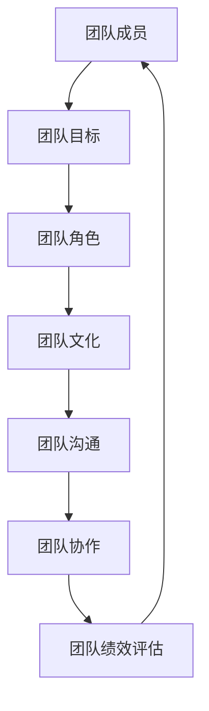

                 

### 文章标题

《团队潜能激发：挖掘最大价值的方法》

### 关键词

团队建设、潜能挖掘、激励机制、沟通协作、绩效评估、团队优化

### 摘要

本文旨在探讨如何通过科学的方法激发团队的潜能，以实现最大价值。通过对团队建设基础、团队成员激励、团队沟通与协作等关键要素的分析，本文提供了一系列实用的方法和策略，旨在帮助IT领域的企业和组织提升团队绩效，实现可持续发展。

## 第一部分：团队建设与潜能挖掘原理

### 第1章：团队建设基础

#### 1.1 团队概念与构成

团队是一个由多个成员组成的共同体，共同追求某个目标或完成某项任务。团队成员之间的相互作用和协作是团队发挥作用的基础。为了更好地理解团队的概念与构成，我们可以使用Mermaid流程图来展示团队的基本构成和关系。



在这个模型中，团队成员是团队的核心组成部分，他们共同构成了团队的角色。团队角色包括领导、开发人员、测试人员等，每个角色都有其特定的职责和功能。团队文化则是团队在长期发展中形成的共同价值观和行为规范，对团队的整体表现和成员的潜能激发具有重要影响。团队沟通与协作是团队运作的纽带，高效的沟通和协作能够提高团队的工作效率和创新能力。团队绩效评估则是团队建设的反馈机制，通过评估团队的绩效来不断优化团队建设和运作。

#### 1.2 团队潜能挖掘原理

团队潜能是指团队成员在特定条件下能够发挥的最大能力和潜力。团队潜能的挖掘不仅取决于团队成员的个人能力，还受到团队环境、激励机制、沟通协作等多种因素的影响。以下是团队潜能挖掘的基本原理：

1. **个人能力与团队目标匹配**：团队成员的能力应当与团队目标相匹配，确保团队成员能够充分发挥其潜力。
2. **激励机制**：通过合理的激励机制，激发团队成员的积极性和创造力，提高团队的潜能。
3. **团队环境**：一个良好的团队环境能够促进团队成员之间的信任和合作，有助于挖掘团队的潜能。
4. **沟通协作**：高效的沟通和协作能够减少团队成员之间的摩擦，提高团队的整体效能。

#### 1.3 团队建设的重要性

团队建设对组织的成功至关重要。一个良好的团队能够提高组织的整体绩效，增强组织的竞争力。以下是团队建设对组织成功的关键性：

1. **提高工作效率**：通过明确团队目标和角色分工，可以提高团队成员的工作效率。
2. **促进创新**：团队成员之间的协作和沟通能够激发创新思维，推动组织的创新发展。
3. **提升员工满意度**：良好的团队建设能够提升员工的工作满意度和归属感，降低员工流失率。
4. **增强团队凝聚力**：通过团队建设，可以增强团队成员之间的凝聚力，形成强大的团队合力。

为了实现团队建设的优化，我们可以采用以下算法：

```plaintext
// 团队建设优化算法伪代码
function TeamBuildingOptimization(teamMembers, goals, roles, culture, communication, collaboration, performanceEvaluation) {
    // 定义目标函数
    objectiveFunction = CalculatePerformance(teamMembers, goals, roles, culture, communication, collaboration, performanceEvaluation)
    
    // 执行优化过程
    do {
        // 更新团队成员能力
        UpdateMemberCapabilities(teamMembers)
        
        // 评估团队绩效
        performanceEvaluation = EvaluateTeamPerformance(teamMembers, goals, roles, culture, communication, collaboration)
        
        // 更新目标函数
        objectiveFunction = CalculatePerformance(teamMembers, goals, roles, culture, communication, collaboration, performanceEvaluation)
        
    } while (performanceEvaluation < optimalPerformance)
}
```

通过不断优化团队成员的能力和团队环境，我们可以提高团队的整体绩效，实现团队建设的最大化价值。

## 第二部分：团队潜能激发方法

### 第2章：激发团队潜能的关键要素

#### 2.1 团队成员激励

团队成员激励是激发团队潜能的重要手段。通过合理的激励机制，可以激发团队成员的积极性和创造力，提高团队的整体效能。团队成员激励的关键要素包括奖励、挑战、资源和支持系统。

1. **奖励**：奖励是激励团队成员的重要手段。奖励可以分为物质奖励和精神奖励两种。物质奖励包括奖金、晋升机会等，精神奖励包括荣誉称号、表彰等。合理的奖励机制能够激发团队成员的积极性，提高工作效率。
2. **挑战**：挑战是激发团队成员潜力的关键。通过设定具有挑战性的目标和任务，可以激发团队成员的斗志，提高团队的创新能力和解决问题的能力。
3. **资源**：资源包括人力资源、技术资源、财务资源等。充足的资源能够为团队成员提供更好的工作环境和条件，有助于激发团队的潜能。
4. **支持系统**：支持系统包括管理支持、技术支持、心理支持等。一个完善的支持系统能够为团队成员提供必要的帮助和支持，解决他们在工作中遇到的问题，提高团队的整体效能。

以下是一个团队成员激励机制的数学模型：

$$
激励效果 = f(奖励, 挑战, 资源, 支持系统)
$$

其中，$f$ 表示激励效果与各个要素之间的函数关系。通过调整各个要素的权重，可以优化激励机制，提高团队成员的激励效果。

#### 2.2 团队沟通与协作

团队沟通与协作是团队潜能激发的重要环节。高效的沟通和协作能够提高团队的工作效率和创新能力。团队沟通与协作的关键要素包括沟通渠道、协作工具和协作流程。

1. **沟通渠道**：沟通渠道是团队成员之间进行信息交流的途径。包括面对面沟通、电子邮件、即时通讯工具等。选择合适的沟通渠道可以提高沟通效率，减少信息传递的误差。
2. **协作工具**：协作工具是团队成员进行协同工作的辅助工具。包括文档共享、项目管理工具、代码协同编辑工具等。合理的协作工具可以提高团队的协作效率，促进团队成员之间的沟通和合作。
3. **协作流程**：协作流程是团队成员在协作过程中遵循的规范和步骤。包括任务分配、进度跟踪、问题反馈等。规范的协作流程有助于提高团队的工作效率，确保协作的顺利进行。

以下是一个团队沟通与协作优化的算法：

```plaintext
// 团队沟通与协作优化算法伪代码
function OptimizeCommunicationAndCollaboration(teamMembers, communicationChannels, collaborationTools) {
    // 初始化变量
    optimalCommunication = InitializeOptimalCommunication(teamMembers)
    optimalCollaboration = InitializeOptimalCollaboration(teamMembers)
    
    // 执行优化过程
    do {
        // 更新沟通渠道
        optimalCommunication = UpdateCommunicationChannels(teamMembers, communicationChannels)
        
        // 更新协作工具
        optimalCollaboration = UpdateCollaborationTools(teamMembers, collaborationTools)
        
        // 评估团队绩效
        performanceEvaluation = EvaluateTeamPerformance(teamMembers, optimalCommunication, optimalCollaboration)
        
    } while (performanceEvaluation < optimalPerformance)
}
```

通过不断优化沟通渠道和协作工具，可以提高团队的沟通效率和协作能力，激发团队的潜能。

### 第3章：团队潜能激发的实践与应用

#### 3.1 团队潜能激发的实践

团队潜能激发是一个系统工程，需要结合实际情况进行实施。以下是一些团队潜能激发的实践方法：

1. **建立明确的团队目标**：明确团队的目标和愿景，确保团队成员对目标有清晰的认识和认同，从而激发团队的潜能。
2. **优化团队环境**：创造一个良好的团队环境，包括提供充足的资源、建立良好的沟通渠道和协作机制等，为团队成员提供良好的工作条件。
3. **实施激励机制**：设计合理的激励机制，包括物质奖励和精神奖励，激发团队成员的积极性和创造力。
4. **加强团队建设**：通过团队建设活动，如团队拓展训练、团队讨论等，增强团队成员之间的信任和合作，提高团队的凝聚力。
5. **持续改进**：通过定期评估团队绩效，找出存在的问题和改进点，持续优化团队建设和运作。

#### 3.2 团队潜能激发的应用

团队潜能激发在IT领域具有广泛的应用。以下是一些应用实例：

1. **软件开发团队**：通过优化团队沟通与协作，提高软件开发效率，降低开发成本，提高软件质量。
2. **项目管理团队**：通过实施有效的激励机制，激发项目团队成员的积极性和创造力，确保项目按时、按质完成。
3. **产品运营团队**：通过优化团队环境，提高团队的工作效率，推动产品的持续迭代和优化。
4. **技术支持团队**：通过加强团队建设，提高团队的技术水平和客户服务能力，提升客户满意度。

#### 3.3 团队潜能激发案例分析

以下是一个团队潜能激发的案例分析：

**案例背景**：某IT公司的软件开发团队在项目开发过程中，遇到了项目进度延误、质量不达标等问题。为了激发团队的潜能，公司决定实施一系列的潜能激发措施。

**实施措施**：

1. **明确团队目标**：与团队成员共同制定明确的项目目标，确保团队成员对目标有清晰的认识。
2. **优化团队环境**：为团队成员提供充足的技术支持和资源，确保团队成员有足够的时间和能力完成工作。
3. **实施激励机制**：设立项目奖金，对按时完成任务的团队成员进行奖励，激发团队成员的积极性。
4. **加强团队建设**：组织团队拓展训练，增强团队成员之间的信任和合作，提高团队的凝聚力。

**实施效果**：通过实施潜能激发措施，团队的工作效率和质量得到了显著提升，项目进度按时完成，项目质量得到保障。团队成员的工作满意度和归属感也得到提高。

### 结论

团队潜能激发是提升团队绩效和实现组织成功的关键。通过科学的方法和策略，可以激发团队的潜能，实现最大价值。本文介绍了团队建设基础、团队成员激励、团队沟通与协作等关键要素，并提供了一系列的实践与应用方法。希望本文能为IT领域的企业和组织提供有益的参考和指导。

## 作者信息

作者：AI天才研究院/AI Genius Institute & 禅与计算机程序设计艺术 /Zen And The Art of Computer Programming

AI天才研究院致力于推动人工智能技术的发展和应用，为IT领域的企业和组织提供专业的技术支持和咨询服务。同时，作者还致力于将禅宗哲学与计算机程序设计相结合，创作了《禅与计算机程序设计艺术》这一经典著作，为编程领域提供了独特的视角和方法。

通过本文，我们希望能够为IT领域的企业和组织提供关于团队潜能激发的深入见解和实用方法，帮助团队实现最大价值，推动组织的发展与成功。感谢您的阅读，期待与您在未来的技术交流中再次相遇。

