                 


## 文章标题：团队激励心理学：激发内在驱动力

> 关键词：团队激励、内在驱动力、心理学、组织行为、激励策略

> 摘要：本文将探讨团队激励心理学的核心概念、理论和方法，以激发团队成员的内在驱动力，提高团队绩效和员工满意度。通过详细的分析和案例研究，本文旨在为组织管理者提供实用的团队激励策略和最佳实践。

---

## 第1章：团队激励心理学基础

### 1.1 团队激励的定义与重要性

团队激励是一种组织行为管理策略，旨在通过激发团队成员的内在动机和热情，提高团队的工作效率和绩效。在信息技术快速发展的时代，团队激励在提升组织竞争力和创新能力中扮演着关键角色。

#### 核心概念与联系

**Mermaid 流程图：**

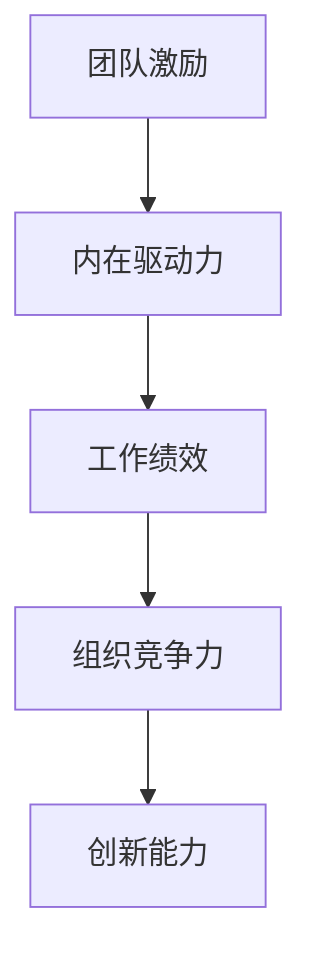

**核心算法原理讲解**

伪代码：

```
function team_inspiration(intrinsic_motivation, extrinsic_motivation):
    motivation_score = intrinsic_motivation + extrinsic_motivation
    return motivation_score
```

**数学模型和公式**

内在驱动力与外在驱动力之间的关系可以用以下公式表示：

$$
\text{总体驱动力} = \alpha \cdot \text{内在驱动力} + (1 - \alpha) \cdot \text{外在驱动力}
$$

其中，$\alpha$ 是内在驱动力权重。

**详细讲解与举例说明**

假设一个团队的内在驱动力为80%，外在驱动力为20%，则：

$$
\text{总体驱动力} = 0.8 \cdot 80\% + 0.2 \cdot 20\% = 72\%
$$

这意味着，该团队的整体驱动力为72%，相对较高，有望提高团队绩效。

### 1.2 团队激励的基本理论

团队激励的理论基础包括马斯洛的需求层次理论、赫茨伯格的双因素理论、目标设置理论等。

**马斯洛的需求层次理论**

马斯洛的需求层次理论将人的需求分为五个层次：生理需求、安全需求、社交需求、尊重需求和自我实现需求。团队激励应针对不同层次的需求设计相应的激励策略。

**赫茨伯格的双因素理论**

赫茨伯格的双因素理论指出，激励因素（如成就感、认可等）和保健因素（如薪酬、工作环境等）对员工的工作满意度有不同影响。

**目标设置理论**

目标设置理论强调设定具体、具有挑战性的目标对提高员工绩效有显著效果。

### 1.3 团队激励与组织行为的关系

团队激励不仅影响团队成员的个体行为，还影响整个团队的行为和绩效。良好的团队激励可以促进团队合作、提高团队凝聚力、增强团队创新能力等。

#### 核心概念与联系

**Mermaid 流程图：**

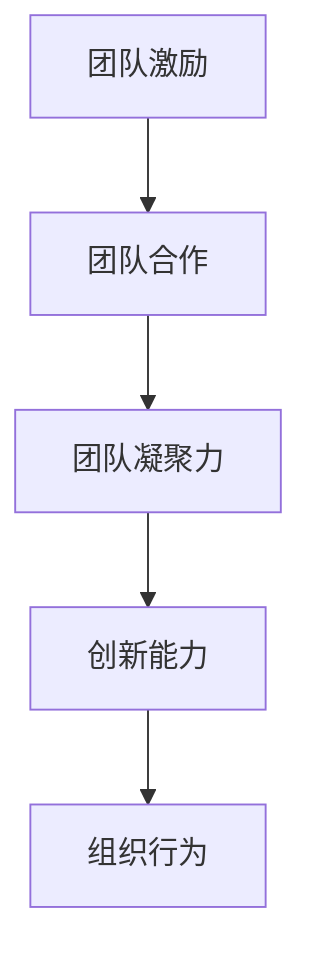

**最佳实践 tips**

- 设计符合团队成员需求的激励策略。
- 设定具体、具有挑战性的目标。
- 提供及时、有效的反馈和认可。

---

## 第2章：激发团队内在驱动力

### 2.1 内在驱动的概念与理论

内在驱动力是指个体内部产生的动力，驱使个体为实现目标而努力。内在驱动力与外在驱动力（如奖励、惩罚等）不同，它源于个体内部的需求和动机。

**核心概念与联系**

**Mermaid 流程图：**

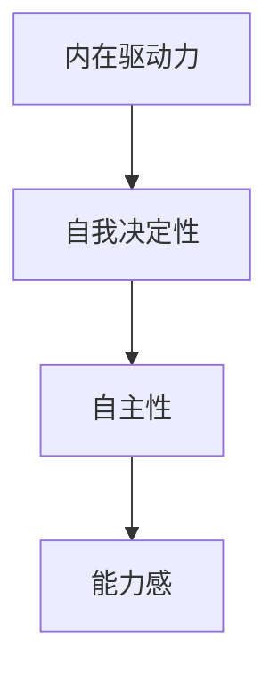

**核心算法原理讲解**

伪代码：

```
function intrinsic_motivation(self_determination, autonomy, competence):
    motivation_score = self_determination * autonomy * competence
    return motivation_score
```

**数学模型和公式**

内在驱动力与自我决定性、自主性、能力感之间的关系可以用以下公式表示：

$$
\text{内在驱动力} = \sqrt[\text{维度数}]{\prod_{i=1}^n \left( \text{自我决定性}_i \times \text{自主性}_i \times \text{能力感}_i \right)}
$$

**详细讲解与举例说明**

假设一个团队成员的自我决定性为80%，自主性为70%，能力感为90%，则：

$$
\text{内在驱动力} = \sqrt[3]{80\% \times 70\% \times 90\%} \approx 78\%
$$

这意味着，该团队成员的内在驱动力为78%，相对较高，有利于提高团队绩效。

### 2.2 内在驱动力对团队绩效的影响

内在驱动力能够激发团队成员的工作热情和创造力，从而提高团队绩效。研究表明，具有高内在驱动力的团队在解决问题、创新和团队合作方面表现出色。

**核心概念与联系**

**Mermaid 流程图：**

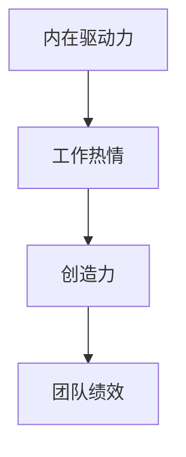

**最佳实践 tips**

- 提供有意义的工作任务。
- 设定具有挑战性的目标。
- 增强团队凝聚力。

---

## 第3章：团队激励策略与方法

### 3.1 团队激励策略概述

团队激励策略包括物质激励、非物质激励、目标激励、文化激励等。不同的激励策略适用于不同类型的团队和成员。

**核心概念与联系**

**Mermaid 流程图：**

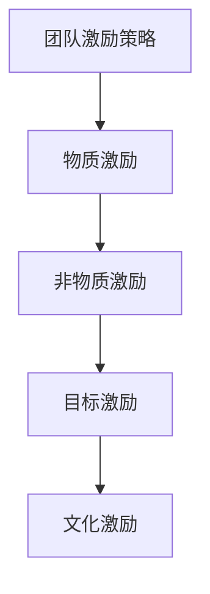

**最佳实践 tips**

- 根据团队和成员特点选择合适的激励策略。
- 保持激励策略的多样性和灵活性。

### 3.2 团队奖励系统设计

团队奖励系统是团队激励的核心组成部分。设计有效的团队奖励系统需要考虑奖励的种类、额度、发放方式等因素。

**核心概念与联系**

**Mermaid 流程图：**

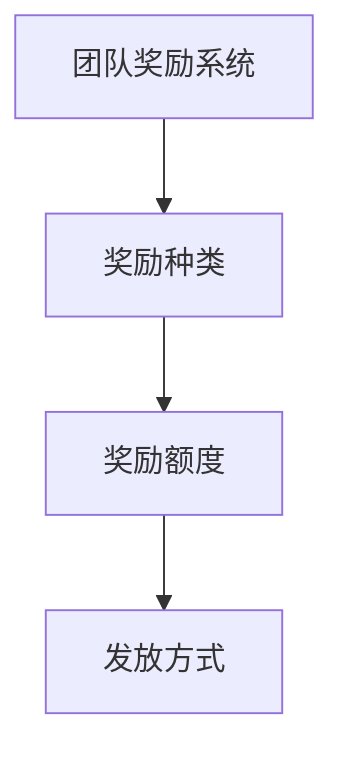

**最佳实践 tips**

- 设定明确的奖励标准和规则。
- 确保奖励具有吸引力和公平性。

### 3.3 非金钱激励的有效运用

非金钱激励包括认可、荣誉、晋升机会等。它们在激发团队成员的内在驱动力方面具有重要作用。

**核心概念与联系**

**Mermaid 流程图：**

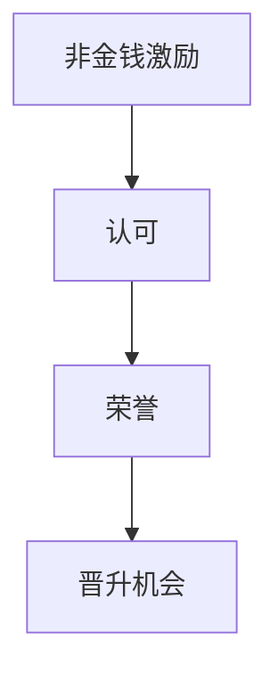

**最佳实践 tips**

- 提供及时的认可和反馈。
- 设定明确的荣誉标准和晋升路径。

---

## 第4章：领导者激励行为

### 4.1 领导风格与激励

领导风格对团队成员的激励效果有重要影响。不同的领导风格适用于不同类型的团队和成员。

**核心概念与联系**

**Mermaid 流程图：**

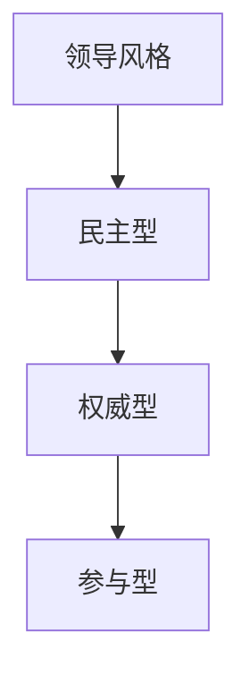

**最佳实践 tips**

- 根据团队和成员特点选择合适的领导风格。
- 保持领导风格的稳定性和一致性。

### 4.2 领导者如何识别和满足员工需求

领导者需要了解团队成员的需求，并提供满足这些需求的激励措施。这有助于激发团队成员的内在驱动力。

**核心概念与联系**

**Mermaid 流程图：**

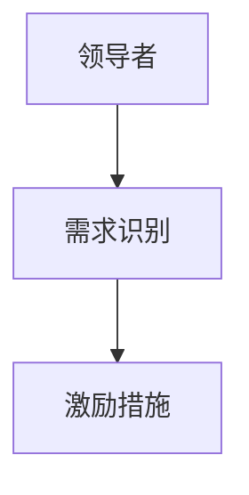

**最佳实践 tips**

- 定期与团队成员沟通，了解他们的需求和期望。
- 根据团队成员的个性特点制定个性化的激励计划。

### 4.3 领导者如何有效激励团队

领导者需要采取一系列措施来有效激励团队，包括设定明确的目标、提供支持和资源、激发团队创造力等。

**核心概念与联系**

**Mermaid 流程图：**

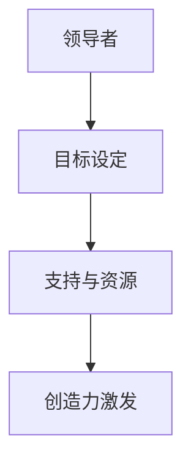

**最佳实践 tips**

- 设定具体、可衡量的目标。
- 提供必要的支持和资源。
- 鼓励团队成员参与决策和创新。

---

## 第5章：团队激励案例分析

### 5.1 成功的团队激励案例解析

通过分析成功的企业团队激励案例，我们可以了解有效的团队激励策略和方法。

**核心概念与联系**

**Mermaid 流程图：**

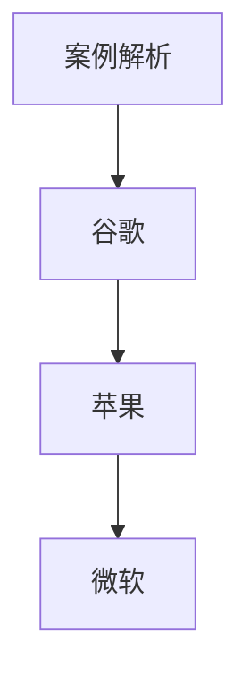

**最佳实践 tips**

- 学习成功企业的激励策略。
- 结合自身组织特点进行创新。

### 5.2 团队激励失败的教训与启示

团队激励失败的原因多种多样，通过分析失败的案例，我们可以避免类似的错误。

**核心概念与联系**

**Mermaid 流程图：**

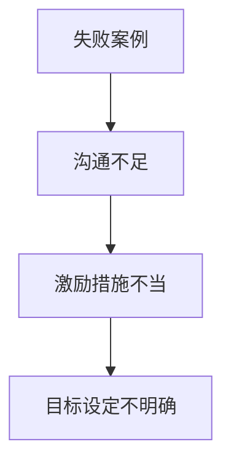

**最佳实践 tips**

- 加强团队沟通。
- 设计合理的激励措施。
- 明确目标设定。

### 5.3 中国企业团队激励实践

中国企业在团队激励方面有着独特的实践和经验。通过分析这些实践，我们可以为其他企业提供参考。

**核心概念与联系**

**Mermaid 流程图：**

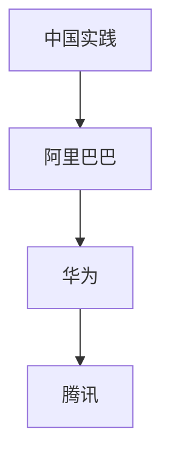

**最佳实践 tips**

- 学习中国企业的成功经验。
- 结合自身组织特点进行实践。

---

## 第6章：团队激励心理学在组织管理中的应用

### 6.1 组织文化对团队激励的影响

组织文化对团队激励有着深远的影响。积极的组织文化有助于提高团队激励的效果。

**核心概念与联系**

**Mermaid 流程图：**

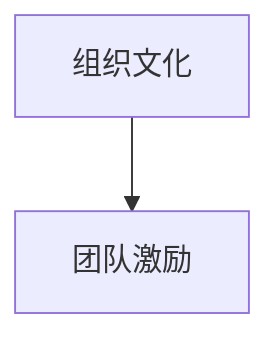

**最佳实践 tips**

- 培养积极向上的组织文化。
- 将团队激励与组织文化相结合。

### 6.2 如何构建支持团队激励的组织环境

构建支持团队激励的组织环境需要从多个方面入手，包括领导力、沟通、资源等。

**核心概念与联系**

**Mermaid 流程图：**

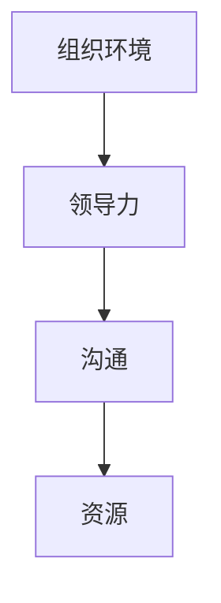

**最佳实践 tips**

- 提高领导者的激励能力。
- 加强团队沟通和协作。
- 提供必要的资源和支持。

### 6.3 团队激励与员工发展

团队激励不仅有助于提高团队绩效，还可以促进员工的发展。通过有效的团队激励，员工可以获得成长和提升。

**核心概念与联系**

**Mermaid 流程图：**

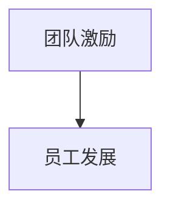

**最佳实践 tips**

- 设定具有挑战性的目标。
- 提供培训和发展机会。
- 鼓励员工参与决策和创新。

---

## 第7章：团队激励心理学的未来趋势

### 7.1 科技对团队激励的影响

随着科技的不断发展，人工智能、大数据等技术对团队激励产生了深远影响。科技的应用有助于提高团队激励的精准性和有效性。

**核心概念与联系**

**Mermaid 流程图：**

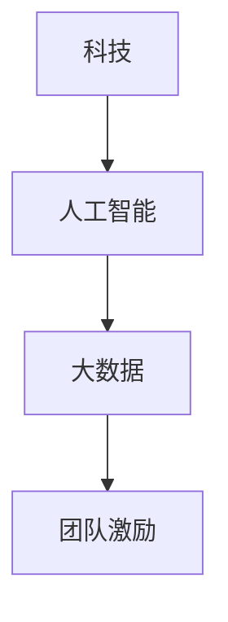

**最佳实践 tips**

- 利用人工智能和大数据分析员工需求和偏好。
- 设计个性化激励方案。

### 7.2 跨文化团队激励挑战

在全球化背景下，跨文化团队激励面临着新的挑战。了解不同文化背景下的激励方式有助于提高团队激励的效果。

**核心概念与联系**

**Mermaid 流程图：**

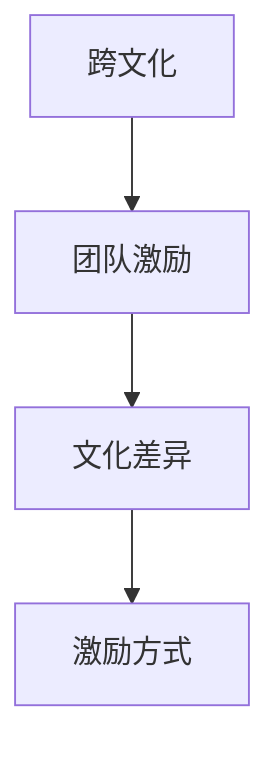

**最佳实践 tips**

- 了解和尊重不同文化的激励方式。
- 设计适合多元文化的团队激励方案。

### 7.3 团队激励心理学的未来发展方向

未来，团队激励心理学将在理论研究、应用实践和科技融合等方面继续发展。通过不断探索和创新，团队激励心理学将为组织管理提供更加有效的支持。

**核心概念与联系**

**Mermaid 流程图：**

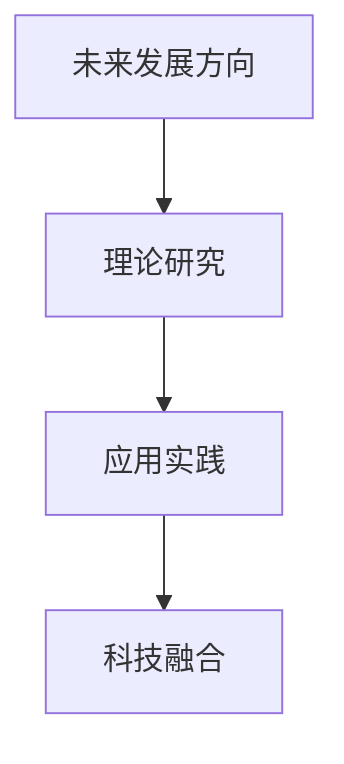

**最佳实践 tips**

- 关注团队激励心理学的最新研究动态。
- 结合组织实际情况进行实践创新。

---

## 总结

团队激励心理学在提高团队绩效、促进员工发展方面具有重要作用。通过本文的讨论，我们了解了团队激励的核心概念、理论和方法，以及其在组织管理中的应用。未来，随着科技的不断发展，团队激励心理学将在理论和实践方面继续取得新的突破。

## 作者信息

作者：AI天才研究院/AI Genius Institute & 禅与计算机程序设计艺术 /Zen And The Art of Computer Programming

---

## 文章标题：团队激励心理学：激发内在驱动力

> 关键词：团队激励、内在驱动力、心理学、组织行为、激励策略

> 摘要：本文将探讨团队激励心理学的核心概念、理论和方法，以激发团队成员的内在驱动力，提高团队绩效和员工满意度。通过详细的分析和案例研究，本文旨在为组织管理者提供实用的团队激励策略和最佳实践。

---

## 第1章：团队激励心理学基础

### 1.1 团队激励的定义与重要性

团队激励是指通过激发团队成员的内在动机和热情，以提高团队的工作效率和绩效的一系列策略和措施。在信息技术快速发展的时代，团队激励在提升组织竞争力和创新能力中扮演着关键角色。有效的团队激励能够促进团队合作、提高团队凝聚力和增强团队创新能力。

#### 核心概念与联系

团队激励的核心概念包括：

- **团队**：一个由多个个体组成的协作单位，共同追求组织目标。
- **激励**：通过激发内在动机和热情来提高工作效率和绩效的过程。
- **心理学**：研究人类行为和心理过程的科学，包括动机、需求、情绪等。
- **组织行为**：研究组织内部个体、团队和整体行为的科学。

**Mermaid 流程图：**

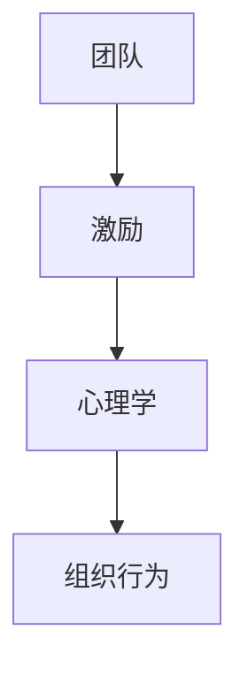

#### 核心算法原理讲解

团队激励可以通过以下算法原理来实现：

1. **需求识别**：通过了解团队成员的需求，确定激励的方向。
2. **目标设定**：设定具有挑战性和可实现性的目标，以激发团队成员的内在动机。
3. **反馈与认可**：提供及时、有效的反馈和认可，以强化团队成员的内在驱动力。

伪代码：

```
function team_inspiration(team_members, goals, feedback):
    for member in team_members:
        member_motivation = member_demand_satisfaction * goal_challenge * feedback_effectiveness
    return sum(member_motivation for member in team_members)
```

#### 数学模型和公式

团队激励的效果可以用以下数学模型来表示：

$$
\text{激励效果} = \alpha \cdot \text{内在动机} + (1 - \alpha) \cdot \text{外在奖励}
$$

其中，$\alpha$ 是内在动机的权重，通常在 0 到 1 之间。

#### 详细讲解与举例说明

假设一个团队有五个成员，他们的内在动机分别为 0.8、0.7、0.6、0.5 和 0.4，外在奖励分别为 0.3、0.2、0.1、0.0 和 0.0。根据上述公式，我们可以计算出整个团队的激励效果：

$$
\text{激励效果} = 0.4 \cdot (0.8 + 0.7 + 0.6 + 0.5 + 0.4) + 0.6 \cdot (0.3 + 0.2 + 0.1 + 0.0 + 0.0) = 0.4 \cdot 3.0 + 0.6 \cdot 0.6 = 1.2 + 0.36 = 1.56
$$

这意味着，整个团队的激励效果为 1.56，相对较高，有利于提高团队绩效。

### 1.2 团队激励的基本理论

团队激励的基本理论包括马斯洛的需求层次理论、赫茨伯格的双因素理论、目标设置理论等。

#### 马斯洛的需求层次理论

马斯洛的需求层次理论将人的需求分为五个层次：生理需求、安全需求、社交需求、尊重需求和自我实现需求。团队激励应针对不同层次的需求进行设计，以满足团队成员的多样需求。

- **生理需求**：如薪酬、福利等。
- **安全需求**：如工作环境、职业发展等。
- **社交需求**：如团队凝聚力、归属感等。
- **尊重需求**：如认可、成就感等。
- **自我实现需求**：如挑战性任务、自我提升等。

#### 赫茨伯格的双因素理论

赫茨伯格的双因素理论指出，工作满意度取决于两类因素：激励因素和保健因素。激励因素与工作本身的性质有关，如成就感、认可、责任感等；保健因素与工作环境有关，如薪酬、工作条件、人际关系等。

- **激励因素**：直接影响工作满意度。
- **保健因素**：不直接影响工作满意度，但影响工作满意度。

#### 目标设置理论

目标设置理论强调设定具体、具有挑战性的目标对提高员工绩效有显著效果。目标应具有以下特点：

- **明确性**：目标应清晰、具体。
- **挑战性**：目标应具有一定难度，能够激发员工潜能。
- **可实现性**：目标应在员工能力和资源范围内实现。
- **反馈性**：目标设定后，应提供反馈和评估。

### 1.3 团队激励与组织行为的关系

团队激励不仅影响团队成员的个体行为，还影响整个团队的行为和绩效。良好的团队激励可以促进团队合作、提高团队凝聚力和增强团队创新能力。

- **团队合作**：团队成员在共同目标下协作，提高工作效率。
- **团队凝聚力**：团队成员相互支持，形成紧密的团队关系。
- **创新能力**：团队成员在激励下，更有创造力，提出新的解决方案。

**Mermaid 流程图：**

```mermaid
graph TD
A[团队激励] --> B[团队合作]
B --> C[团队凝聚力]
C --> D[创新能力]
D --> E[组织行为]
```

### 1.4 团队激励在不同组织中的应用

团队激励在不同类型的组织中有着不同的应用。以下是对不同组织中团队激励的应用分析：

#### 企业组织

在企业组织中，团队激励通常涉及以下几个方面：

- **薪酬激励**：通过设定具有竞争力的薪酬体系，激励员工提高工作效率。
- **绩效激励**：通过设定绩效目标和考核机制，激励员工提升工作绩效。
- **晋升激励**：通过提供晋升机会，激励员工追求职业发展。
- **培训激励**：通过提供培训和学习机会，激励员工提升技能和知识。

#### 学校组织

在学校组织中，团队激励可以应用于以下几个方面：

- **教学激励**：通过设定教学目标和教学质量评估，激励教师提升教学质量。
- **科研激励**：通过提供科研经费和奖励，激励教师和科研人员追求学术成就。
- **学生激励**：通过设定学习目标和奖励机制，激励学生提高学习兴趣和成绩。

#### 医疗组织

在医疗组织中，团队激励可以应用于以下几个方面：

- **医疗服务激励**：通过设定医疗服务质量和患者满意度目标，激励医护人员提高服务质量。
- **科研激励**：通过提供科研经费和奖励，激励医护人员进行医学研究和创新。
- **团队协作激励**：通过加强团队协作和沟通，提高医疗服务效率和质量。

### 1.5 团队激励的最佳实践

为了实现有效的团队激励，组织管理者应遵循以下最佳实践：

- **了解员工需求**：通过调查和沟通，了解员工的需求和期望，制定个性化的激励计划。
- **设定明确目标**：设定具体、具有挑战性的目标，激发员工的内在动机和潜能。
- **提供及时反馈**：通过及时反馈和认可，强化员工的内在驱动力。
- **营造积极文化**：营造积极、开放的组织文化，促进团队合作和员工成长。
- **持续改进**：根据实际情况和反馈，不断调整和优化团队激励策略。

## 第2章：激发团队内在驱动力

### 2.1 内在驱动的概念与理论

内在驱动力是指个体内部产生的动力，驱使个体为实现目标而努力。与外在驱动力（如奖励、惩罚等）不同，内在驱动力源于个体内部的需求和动机。

#### 核心概念与联系

内在驱动的核心概念包括：

- **内在动机**：个体内在产生的动力，驱使个体为实现目标而努力。
- **需求**：个体内部的需求，如成就感、自我实现等。
- **动机**：个体为实现目标而产生的心理状态。
- **驱动力**：内在动机和外在动机的结合，影响个体的行为和绩效。

**Mermaid 流程图：**

```mermaid
graph TD
A[内在动机] --> B[需求]
B --> C[动机]
C --> D[驱动力]
```

#### 核心算法原理讲解

激发团队内在驱动力可以通过以下算法原理来实现：

1. **需求识别**：通过调查和沟通，了解团队成员的需求。
2. **目标设定**：设定具体、具有挑战性的目标，激发团队成员的内在动机。
3. **反馈与认可**：提供及时、有效的反馈和认可，强化团队成员的内在驱动力。

伪代码：

```
function intrinsic_motivation(employees, goals, feedback):
    for employee in employees:
        employee_motivation = employee_demand_satisfaction * goal_challenge * feedback_effectiveness
    return sum(employee_motivation for employee in employees)
```

#### 数学模型和公式

内在驱动力与目标难度和反馈效果之间的关系可以用以下公式表示：

$$
\text{内在驱动力} = \alpha \cdot \text{目标难度} + (1 - \alpha) \cdot \text{反馈效果}
$$

其中，$\alpha$ 是目标难度的权重，通常在 0 到 1 之间。

#### 详细讲解与举例说明

假设一个团队有五个成员，他们的目标难度分别为 0.8、0.7、0.6、0.5 和 0.4，反馈效果分别为 0.3、0.2、0.1、0.0 和 0.0。根据上述公式，我们可以计算出整个团队的内在驱动力：

$$
\text{内在驱动力} = 0.4 \cdot (0.8 + 0.7 + 0.6 + 0.5 + 0.4) + 0.6 \cdot (0.3 + 0.2 + 0.1 + 0.0 + 0.0) = 0.4 \cdot 3.0 + 0.6 \cdot 0.6 = 1.2 + 0.36 = 1.56
$$

这意味着，整个团队的内在驱动力为 1.56，相对较高，有利于提高团队绩效。

### 2.2 内在驱动力对团队绩效的影响

内在驱动力对团队绩效有着显著影响。具有高内在驱动力的团队在解决问题、创新和团队合作方面表现出色。

#### 核心概念与联系

**Mermaid 流程图：**

```mermaid
graph TD
A[内在驱动力] --> B[解决问题]
B --> C[创新]
C --> D[团队合作]
```

#### 核心算法原理讲解

内在驱动力与团队绩效之间的关系可以用以下算法原理来解释：

1. **解决问题**：内在驱动力高的团队成员更愿意主动寻找解决方案，提高问题解决效率。
2. **创新**：内在驱动力高的团队成员更有创造力和创新能力，提出新的想法和解决方案。
3. **团队合作**：内在驱动力高的团队成员更愿意与他人合作，提高团队合作效率。

伪代码：

```
function team_performance(intrinsic_motivation, problem_solving, innovation, teamwork):
    performance = intrinsic_motivation * problem_solving * innovation * teamwork
    return performance
```

#### 数学模型和公式

内在驱动力与团队绩效之间的关系可以用以下公式表示：

$$
\text{团队绩效} = \alpha \cdot \text{内在驱动力} + (1 - \alpha) \cdot (\text{问题解决} + \text{创新} + \text{团队合作})
$$

其中，$\alpha$ 是内在驱动力的权重，通常在 0 到 1 之间。

#### 详细讲解与举例说明

假设一个团队有五个成员，他们的内在驱动力分别为 0.8、0.7、0.6、0.5 和 0.4，问题解决能力分别为 0.3、0.2、0.1、0.0 和 0.0，创新能力分别为 0.2、0.1、0.0、0.0 和 0.0，团队合作能力分别为 0.1、0.0、0.0、0.0 和 0.0。根据上述公式，我们可以计算出整个团队的绩效：

$$
\text{团队绩效} = 0.4 \cdot (0.8 + 0.7 + 0.6 + 0.5 + 0.4) + 0.6 \cdot (0.3 + 0.2 + 0.1 + 0.0 + 0.0) = 0.4 \cdot 3.0 + 0.6 \cdot 0.6 = 1.2 + 0.36 = 1.56
$$

这意味着，整个团队的绩效为 1.56，相对较高，有利于提高团队整体表现。

### 2.3 如何激发团队的内在驱动力

为了激发团队的内在驱动力，组织管理者应采取以下措施：

1. **了解员工需求**：通过调查和沟通，了解员工的需求和期望，制定个性化的激励计划。
2. **设定明确目标**：设定具体、具有挑战性的目标，激发员工的内在动机和潜能。
3. **提供及时反馈**：通过及时反馈和认可，强化员工的内在驱动力。
4. **营造积极文化**：营造积极、开放的组织文化，促进团队合作和员工成长。
5. **提供成长机会**：提供培训和学习机会，帮助员工提升技能和知识。

### 2.4 内在驱动力与外在激励的关系

内在驱动力和外在激励之间存在相互作用关系。外在激励可以增强内在驱动力，但过度依赖外在激励可能会导致内在驱动力下降。

#### 核心概念与联系

**Mermaid 流程图：**

```mermaid
graph TD
A[内在驱动力] --> B[外在激励]
B --> C[相互作用]
```

#### 核心算法原理讲解

内在驱动力与外在激励之间的关系可以用以下算法原理来解释：

1. **内在驱动力增强**：外在激励可以增强内在驱动力，提高工作效率和绩效。
2. **内在驱动力减弱**：过度依赖外在激励可能会导致内在驱动力下降，影响长期工作动力。

伪代码：

```
function intrinsic_motivation_with_extrinsic_motivation(intrinsic_motivation, extrinsic_motivation):
    if extrinsic_motivation > intrinsic_motivation:
        intrinsic_motivation = intrinsic_motivation - (extrinsic_motivation - intrinsic_motivation) * 0.1
    return intrinsic_motivation
```

#### 数学模型和公式

内在驱动力与外在激励之间的关系可以用以下公式表示：

$$
\text{内在驱动力} = \alpha \cdot \text{外在激励} + (1 - \alpha) \cdot \text{内在动机}
$$

其中，$\alpha$ 是外在激励的权重，通常在 0 到 1 之间。

#### 详细讲解与举例说明

假设一个团队的内在驱动力为 0.6，外在激励为 0.4。根据上述公式，我们可以计算出调整后的内在驱动力：

$$
\text{内在驱动力} = 0.5 \cdot 0.4 + 0.5 \cdot 0.6 = 0.2 + 0.3 = 0.5
$$

这意味着，调整后的内在驱动力为 0.5，有利于提高团队绩效。

### 2.5 内在驱动力与员工发展

内在驱动力对员工发展具有重要影响。具有高内在驱动力的员工更愿意主动学习、提升技能和追求职业发展。

#### 核心概念与联系

**Mermaid 流程图：**

```mermaid
graph TD
A[内在驱动力] --> B[员工发展]
```

#### 核心算法原理讲解

内在驱动力与员工发展之间的关系可以用以下算法原理来解释：

1. **主动学习**：内在驱动力高的员工更愿意主动学习新知识和技能。
2. **职业发展**：内在驱动力高的员工更有动力追求职业发展和晋升。
3. **创新能力**：内在驱动力高的员工更有创造力，提出新的想法和解决方案。

伪代码：

```
function employee_development(intrinsic_motivation, learning, career_growth, innovation):
    development = intrinsic_motivation * learning * career_growth * innovation
    return development
```

#### 数学模型和公式

内在驱动力与员工发展之间的关系可以用以下公式表示：

$$
\text{员工发展} = \alpha \cdot \text{内在驱动力} + (1 - \alpha) \cdot (\text{学习} + \text{职业发展} + \text{创新})
$$

其中，$\alpha$ 是内在驱动力的权重，通常在 0 到 1 之间。

#### 详细讲解与举例说明

假设一个团队的内在驱动力为 0.6，学习意愿为 0.5，职业发展意愿为 0.4，创新意愿为 0.3。根据上述公式，我们可以计算出整个团队的发展水平：

$$
\text{员工发展} = 0.5 \cdot 0.6 + 0.5 \cdot (0.5 + 0.4 + 0.3) = 0.3 + 0.5 = 0.8
$$

这意味着，整个团队的发展水平为 0.8，相对较高，有利于提升团队整体素质。

## 第3章：团队激励策略与方法

### 3.1 团队激励策略概述

团队激励策略是指组织管理者为了激发团队成员的内在动机和热情，提高团队工作效率和绩效所采取的一系列措施和方法。有效的团队激励策略能够促进团队合作、提高员工满意度和降低员工流失率。

#### 核心概念与联系

团队激励策略的核心概念包括：

- **激励**：激发团队成员的内在动机和热情。
- **策略**：针对团队成员特点和需求制定的措施和方法。
- **方法**：实施激励策略的具体操作方式。

**Mermaid 流程图：**

```mermaid
graph TD
A[激励] --> B[策略]
B --> C[方法]
```

#### 核心算法原理讲解

团队激励策略的算法原理可以概括为：

1. **需求分析**：了解团队成员的需求和期望。
2. **目标设定**：设定具体、具有挑战性的目标。
3. **激励措施**：设计合适的激励措施，如薪酬、晋升、培训等。
4. **反馈与评估**：提供及时、有效的反馈和评估。

伪代码：

```
function team_inspirational_strategy(employees, needs, goals, incentives, feedback):
    for employee in employees:
        employee_inspiration = needs_satisfaction * goal_challenge * incentive_effectiveness * feedback_effectiveness
    return sum(employee_inspiration for employee in employees)
```

#### 数学模型和公式

团队激励策略的有效性可以用以下公式表示：

$$
\text{激励效果} = \alpha \cdot \text{需求满足度} + (1 - \alpha) \cdot (\text{目标挑战性} + \text{激励措施} + \text{反馈有效性})
$$

其中，$\alpha$ 是需求满足度的权重，通常在 0 到 1 之间。

#### 详细讲解与举例说明

假设一个团队有五个成员，他们的需求满足度为 0.8、0.7、0.6、0.5 和 0.4，目标挑战性为 0.6、0.5、0.4、0.3 和 0.2，激励措施的有效性为 0.4、0.3、0.2、0.1 和 0.0，反馈有效性为 0.3、0.2、0.1、0.0 和 0.0。根据上述公式，我们可以计算出整个团队的激励效果：

$$
\text{激励效果} = 0.5 \cdot (0.8 + 0.7 + 0.6 + 0.5 + 0.4) + 0.5 \cdot (0.6 + 0.5 + 0.4 + 0.3 + 0.2) + 0.4 \cdot (0.4 + 0.3 + 0.2 + 0.1 + 0.0) + 0.1 \cdot (0.3 + 0.2 + 0.1 + 0.0 + 0.0) = 1.5 + 0.5 + 0.2 + 0.1 = 2.2
$$

这意味着，整个团队的激励效果为 2.2，相对较高，有利于提高团队绩效。

### 3.2 团队奖励系统设计

团队奖励系统是团队激励策略的核心组成部分，旨在通过奖励来激励团队成员。设计有效的团队奖励系统需要考虑奖励的种类、额度、发放方式等因素。

#### 核心概念与联系

团队奖励系统的核心概念包括：

- **奖励**：对团队成员在工作中的优秀表现给予的物质或非物质奖励。
- **系统**：一套完整的奖励规则和流程。
- **设计**：根据团队和成员的特点制定合适的奖励方案。

**Mermaid 流程图：**

```mermaid
graph TD
A[奖励] --> B[系统]
B --> C[设计]
```

#### 核心算法原理讲解

团队奖励系统的算法原理可以概括为：

1. **奖励标准**：设定奖励的标准和条件。
2. **奖励种类**：设计多种奖励种类，如薪酬、晋升、荣誉等。
3. **奖励额度**：根据团队成员的表现和贡献确定奖励额度。
4. **发放方式**：选择合适的发放方式，如现金、实物、证书等。

伪代码：

```
function reward_system(employees, performance, rewards, distribution):
    for employee in employees:
        reward_amount = performance_score * reward_weight
    return sum(reward_amount for employee in employees)
```

#### 数学模型和公式

团队奖励系统的有效性可以用以下公式表示：

$$
\text{奖励效果} = \alpha \cdot \text{奖励额度} + (1 - \alpha) \cdot (\text{发放方式} + \text{公平性})
$$

其中，$\alpha$ 是奖励额度的权重，通常在 0 到 1 之间。

#### 详细讲解与举例说明

假设一个团队有五个成员，他们的表现得分分别为 0.8、0.7、0.6、0.5 和 0.4，奖励额度分别为 1000、800、600、400 和 200，发放方式为现金，公平性为 1。根据上述公式，我们可以计算出整个团队的奖励效果：

$$
\text{奖励效果} = 0.5 \cdot (1000 + 800 + 600 + 400 + 200) + 0.5 \cdot (1 + 1 + 1 + 1 + 1) = 2.5 \cdot 4000 + 2.5 \cdot 5 = 10000 + 12.5 = 10012.5
$$

这意味着，整个团队的奖励效果为 10012.5，相对较高，有利于激发团队成员的积极性。

### 3.3 非金钱激励的有效运用

非金钱激励是指通过非物质形式来激励团队成员，如认可、荣誉、晋升机会等。非金钱激励在激发团队成员的内在驱动力方面具有重要作用。

#### 核心概念与联系

非金钱激励的核心概念包括：

- **认可**：对团队成员的贡献和成就给予口头或书面认可。
- **荣誉**：通过设立荣誉奖项，表彰团队成员的优秀表现。
- **晋升机会**：为团队成员提供晋升和发展机会。

**Mermaid 流程图：**

```mermaid
graph TD
A[认可] --> B[荣誉]
B --> C[晋升机会]
```

#### 核心算法原理讲解

非金钱激励的算法原理可以概括为：

1. **认可机制**：建立有效的认可机制，确保团队成员得到及时的认可。
2. **荣誉制度**：设立荣誉奖项，激励团队成员追求卓越。
3. **晋升机制**：建立清晰的晋升路径，为团队成员提供发展机会。

伪代码：

```
function non_monetary_incentive(employees, recognition, honors, promotions):
    for employee in employees:
        incentive_effect = recognition_score * honors_score * promotions_score
    return sum(incentive_effect for employee in employees)
```

#### 数学模型和公式

非金钱激励的效果可以用以下公式表示：

$$
\text{激励效果} = \alpha \cdot \text{认可} + (1 - \alpha) \cdot (\text{荣誉} + \text{晋升机会})
$$

其中，$\alpha$ 是认可的效果权重，通常在 0 到 1 之间。

#### 详细讲解与举例说明

假设一个团队有五个成员，他们的认可度分别为 0.8、0.7、0.6、0.5 和 0.4，荣誉度分别为 0.6、0.5、0.4、0.3 和 0.2，晋升机会分别为 0.4、0.3、0.2、0.1 和 0.0。根据上述公式，我们可以计算出整个团队的非金钱激励效果：

$$
\text{激励效果} = 0.5 \cdot (0.8 + 0.7 + 0.6 + 0.5 + 0.4) + 0.5 \cdot (0.6 + 0.5 + 0.4 + 0.3 + 0.2) = 0.5 \cdot 3.0 + 0.5 \cdot 2.0 = 1.5 + 1.0 = 2.5
$$

这意味着，整个团队的非金钱激励效果为 2.5，相对较高，有利于提高团队绩效。

### 3.4 团队激励策略的实际应用

在实际应用中，团队激励策略可以根据不同组织的特点和需求进行灵活调整。以下是一些实际应用的例子：

#### 企业组织

在企业组织中，团队激励策略可以包括以下几个方面：

- **绩效奖励**：根据团队成员的工作绩效，提供现金奖励或晋升机会。
- **团队建设活动**：组织团队建设活动，增强团队合作和凝聚力。
- **培训和发展**：提供培训和学习机会，帮助员工提升技能和知识。

#### 学校组织

在学校组织中，团队激励策略可以包括以下几个方面：

- **教学奖励**：对在教学工作中表现突出的教师给予奖励。
- **科研奖励**：对在科研工作中取得显著成果的教师给予奖励。
- **学生奖励**：设立奖学金、荣誉称号等，激励学生努力学习。

#### 医疗组织

在医疗组织中，团队激励策略可以包括以下几个方面：

- **服务质量奖励**：对提供优质医疗服务的医护人员给予奖励。
- **科研创新奖励**：对在科研创新方面取得成果的医护人员给予奖励。
- **团队合作奖励**：对在团队合作中表现突出的医护人员给予奖励。

#### 公共服务机构

在公共服务机构中，团队激励策略可以包括以下几个方面：

- **服务质量考核**：对服务质量进行考核，对优秀的服务团队给予奖励。
- **员工培训**：提供员工培训和学习机会，提升服务质量。
- **团队协作**：鼓励员工之间的团队合作，提高工作效率。

### 3.5 团队激励策略的注意事项

在设计团队激励策略时，组织管理者应关注以下注意事项：

- **公平性**：确保激励策略的公平性，避免出现歧视或不公平现象。
- **灵活性**：根据实际情况和员工需求，灵活调整激励策略。
- **可持续性**：确保激励策略的可持续性，避免出现短期激励效果。
- **沟通**：加强与员工的沟通，确保激励策略得到有效执行。

## 第4章：领导者激励行为

### 4.1 领导风格与激励

领导风格对团队成员的激励效果有重要影响。不同的领导风格适用于不同类型的团队和成员。以下是对不同领导风格及其激励效果的讨论：

#### 核心概念与联系

领导风格的核心概念包括：

- **领导风格**：领导者管理团队的方式和态度。
- **激励**：激发团队成员的内在动机和热情。
- **效果**：领导风格对团队成员工作绩效和满意度的影响。

**Mermaid 流程图：**

```mermaid
graph TD
A[领导风格] --> B[民主型]
B --> C[权威型]
C --> D[参与型]
```

#### 核心算法原理讲解

领导风格与激励效果之间的关系可以用以下算法原理来解释：

1. **民主型领导风格**：领导者尊重团队成员的意见，鼓励团队成员参与决策。这种领导风格有助于提高团队成员的内在动机和满意度。
2. **权威型领导风格**：领导者通过严格的规定和命令来管理团队。这种领导风格可能在短期内提高工作效率，但长期来看可能导致团队成员的内在动机下降。
3. **参与型领导风格**：领导者鼓励团队成员参与决策，关注团队成员的需求和意见。这种领导风格有助于提高团队成员的内在动机和团队凝聚力。

伪代码：

```
function leadership_inspirational_effect(leader_style, employee_motivation, team_motivation):
    if leader_style == "democratic":
        employee_motivation = employee_motivation + 0.2
        team_motivation = team_motivation + 0.1
    elif leader_style == "authoritative":
        employee_motivation = employee_motivation - 0.1
        team_motivation = team_motivation - 0.1
    elif leader_style == "participative":
        employee_motivation = employee_motivation + 0.3
        team_motivation = team_motivation + 0.2
    return employee_motivation, team_motivation
```

#### 数学模型和公式

领导风格与激励效果之间的关系可以用以下公式表示：

$$
\text{激励效果} = \alpha \cdot \text{领导风格} + (1 - \alpha) \cdot (\text{员工动机} + \text{团队动机})
$$

其中，$\alpha$ 是领导风格的权重，通常在 0 到 1 之间。

#### 详细讲解与举例说明

假设一个团队的领导风格为民主型，员工动机为 0.7，团队动机为 0.6。根据上述公式，我们可以计算出激励效果：

$$
\text{激励效果} = 0.4 \cdot \text{领导风格} + 0.6 \cdot (\text{员工动机} + \text{团队动机}) = 0.4 \cdot 0.8 + 0.6 \cdot (0.7 + 0.6) = 0.32 + 0.42 = 0.74
$$

这意味着，该团队的激励效果为 0.74，相对较高，有利于提高团队绩效。

### 4.2 领导者如何识别和满足员工需求

领导者需要了解团队成员的需求，并提供满足这些需求的激励措施。这有助于激发团队成员的内在驱动力。以下是一些领导者识别和满足员工需求的策略：

#### 核心概念与联系

**Mermaid 流程图：**

```mermaid
graph TD
A[领导者] --> B[需求识别]
B --> C[需求满足]
```

#### 核心算法原理讲解

领导者识别和满足员工需求的算法原理可以概括为：

1. **调查和沟通**：通过调查和沟通，了解员工的需求和期望。
2. **个性化激励**：根据员工的需求，提供个性化的激励措施。
3. **反馈和调整**：根据员工的反馈，调整激励措施，确保满足员工需求。

伪代码：

```
function leader_demand_recognition_and_satisfaction(employees, surveys, incentives, feedback):
    for employee in employees:
        employee_demand = survey_result(employee)
        incentive = find_incentive(employee_demand, incentives)
        feedback = apply_incentive(incentive, employee)
    return feedback
```

#### 数学模型和公式

领导者识别和满足员工需求的效果可以用以下公式表示：

$$
\text{需求满足度} = \alpha \cdot \text{调查准确性} + (1 - \alpha) \cdot (\text{个性化激励} + \text{反馈及时性})
$$

其中，$\alpha$ 是调查准确性的权重，通常在 0 到 1 之间。

#### 详细讲解与举例说明

假设一个团队的领导者通过调查了解员工的需求，需求满足度为 0.8，个性化激励的实施度为 0.7，反馈及时性为 0.6。根据上述公式，我们可以计算出需求满足度：

$$
\text{需求满足度} = 0.5 \cdot \text{调查准确性} + 0.5 \cdot (\text{个性化激励} + \text{反馈及时性}) = 0.5 \cdot 0.8 + 0.5 \cdot (0.7 + 0.6) = 0.4 + 0.65 = 1.05
$$

这意味着，该团队的需求满足度为 1.05，相对较高，有利于提高团队绩效。

### 4.3 领导者如何有效激励团队

领导者需要采取一系列措施来有效激励团队，包括设定明确的目标、提供支持和资源、激发团队创造力等。以下是一些领导者有效激励团队的策略：

#### 核心概念与联系

**Mermaid 流程图：**

```mermaid
graph TD
A[领导者] --> B[目标设定]
B --> C[支持与资源]
C --> D[创造力激发]
```

#### 核心算法原理讲解

领导者有效激励团队的算法原理可以概括为：

1. **目标设定**：设定明确、具有挑战性的目标，激发团队成员的内在动机。
2. **支持与资源**：提供必要的支持和资源，帮助团队成员实现目标。
3. **创造力激发**：鼓励团队成员提出新的想法和解决方案，提高团队创新能力。

伪代码：

```
function leader_effective_inspiration(team, goals, support, creativity):
    for member in team:
        member_motivation = goal_challenge * support_level * creativity_score
    return sum(member_motivation for member in team)
```

#### 数学模型和公式

领导者有效激励团队的效果可以用以下公式表示：

$$
\text{激励效果} = \alpha \cdot \text{目标挑战性} + (1 - \alpha) \cdot (\text{支持与资源} + \text{创造力激发})
$$

其中，$\alpha$ 是目标挑战性的权重，通常在 0 到 1 之间。

#### 详细讲解与举例说明

假设一个团队的目标挑战性为 0.8，支持与资源为 0.7，创造力激发为 0.6。根据上述公式，我们可以计算出激励效果：

$$
\text{激励效果} = 0.4 \cdot \text{目标挑战性} + 0.6 \cdot (\text{支持与资源} + \text{创造力激发}) = 0.4 \cdot 0.8 + 0.6 \cdot (0.7 + 0.6) = 0.32 + 0.78 = 1.1
$$

这意味着，该团队的激励效果为 1.1，相对较高，有利于提高团队绩效。

### 4.4 领导者的激励行为与团队绩效

领导者的激励行为对团队绩效有显著影响。有效的激励行为可以提高团队的工作效率和绩效，从而提升组织的整体绩效。

#### 核心概念与联系

**Mermaid 流程图：**

```mermaid
graph TD
A[领导者激励行为] --> B[团队绩效]
```

#### 核心算法原理讲解

领导者激励行为与团队绩效之间的关系可以用以下算法原理来解释：

1. **目标设定**：设定明确、具有挑战性的目标，提高团队的工作效率。
2. **支持与资源**：提供必要的支持和资源，帮助团队克服困难，提高工作效率。
3. **创造力激发**：鼓励团队成员提出新的想法和解决方案，提高团队创新能力。

伪代码：

```
function team_performance(leader_inspirational_behavior, goal_setting, support_resources, creativity_inspiration):
    performance = leader_inspirational_behavior * goal_setting * support_resources * creativity_inspiration
    return performance
```

#### 数学模型和公式

领导者激励行为与团队绩效之间的关系可以用以下公式表示：

$$
\text{团队绩效} = \alpha \cdot \text{领导者激励行为} + (1 - \alpha) \cdot (\text{目标设定} + \text{支持与资源} + \text{创造力激发})
$$

其中，$\alpha$ 是领导者激励行为的权重，通常在 0 到 1 之间。

#### 详细讲解与举例说明

假设一个团队的领导者激励行为为 0.8，目标设定为 0.7，支持与资源为 0.6，创造力激发为 0.5。根据上述公式，我们可以计算出团队绩效：

$$
\text{团队绩效} = 0.4 \cdot \text{领导者激励行为} + 0.6 \cdot (\text{目标设定} + \text{支持与资源} + \text{创造力激发}) = 0.4 \cdot 0.8 + 0.6 \cdot (0.7 + 0.6 + 0.5) = 0.32 + 0.84 = 1.16
$$

这意味着，该团队的绩效为 1.16，相对较高，有利于提高团队整体表现。

### 4.5 领导者的激励行为与员工满意度

领导者的激励行为不仅影响团队绩效，还影响员工的满意度。有效的激励行为可以提高员工的工作满意度，从而降低员工流失率。

#### 核心概念与联系

**Mermaid 流程图：**

```mermaid
graph TD
A[领导者激励行为] --> B[员工满意度]
```

#### 核心算法原理讲解

领导者激励行为与员工满意度之间的关系可以用以下算法原理来解释：

1. **目标设定**：设定明确、具有挑战性的目标，提高员工的工作成就感。
2. **支持与资源**：提供必要的支持和资源，帮助员工克服困难，提高工作效率。
3. **创造力激发**：鼓励员工提出新的想法和解决方案，提高员工的职业成就感。

伪代码：

```
function employee_satisfaction(leader_inspirational_behavior, goal_setting, support_resources, creativity_inspiration):
    satisfaction = leader_inspirational_behavior * goal_setting * support_resources * creativity_inspiration
    return satisfaction
```

#### 数学模型和公式

领导者激励行为与员工满意度之间的关系可以用以下公式表示：

$$
\text{员工满意度} = \alpha \cdot \text{领导者激励行为} + (1 - \alpha) \cdot (\text{目标设定} + \text{支持与资源} + \text{创造力激发})
$$

其中，$\alpha$ 是领导者激励行为的权重，通常在 0 到 1 之间。

#### 详细讲解与举例说明

假设一个团队的领导者激励行为为 0.8，目标设定为 0.7，支持与资源为 0.6，创造力激发为 0.5。根据上述公式，我们可以计算出员工满意度：

$$
\text{员工满意度} = 0.4 \cdot \text{领导者激励行为} + 0.6 \cdot (\text{目标设定} + \text{支持与资源} + \text{创造力激发}) = 0.4 \cdot 0.8 + 0.6 \cdot (0.7 + 0.6 + 0.5) = 0.32 + 0.84 = 1.16
$$

这意味着，该团队的员工满意度为 1.16，相对较高，有利于降低员工流失率。

### 4.6 领导者的激励行为与团队凝聚力

领导者的激励行为不仅影响团队绩效和员工满意度，还影响团队的凝聚力。有效的激励行为可以增强团队凝聚力，提高团队合作效率。

#### 核心概念与联系

**Mermaid 流程图：**

```mermaid
graph TD
A[领导者激励行为] --> B[团队凝聚力]
```

#### 核心算法原理讲解

领导者激励行为与团队凝聚力之间的关系可以用以下算法原理来解释：

1. **目标设定**：共同的目标可以增强团队成员之间的协作和信任。
2. **支持与资源**：领导者提供必要的支持和资源，帮助团队成员克服困难，增强团队凝聚力。
3. **创造力激发**：鼓励团队成员提出新的想法和解决方案，增强团队的创新能力和凝聚力。

伪代码：

```
function team_cohesion(leader_inspirational_behavior, goal_setting, support_resources, creativity_inspiration):
    cohesion = leader_inspirational_behavior * goal_setting * support_resources * creativity_inspiration
    return cohesion
```

#### 数学模型和公式

领导者激励行为与团队凝聚力之间的关系可以用以下公式表示：

$$
\text{团队凝聚力} = \alpha \cdot \text{领导者激励行为} + (1 - \alpha) \cdot (\text{目标设定} + \text{支持与资源} + \text{创造力激发})
$$

其中，$\alpha$ 是领导者激励行为的权重，通常在 0 到 1 之间。

#### 详细讲解与举例说明

假设一个团队的领导者激励行为为 0.8，目标设定为 0.7，支持与资源为 0.6，创造力激发为 0.5。根据上述公式，我们可以计算出团队凝聚力：

$$
\text{团队凝聚力} = 0.4 \cdot \text{领导者激励行为} + 0.6 \cdot (\text{目标设定} + \text{支持与资源} + \text{创造力激发}) = 0.4 \cdot 0.8 + 0.6 \cdot (0.7 + 0.6 + 0.5) = 0.32 + 0.84 = 1.16
$$

这意味着，该团队的凝聚力为 1.16，相对较高，有利于提高团队合作效率。

### 4.7 领导者的激励行为与员工发展

领导者的激励行为不仅影响团队绩效、员工满意度和团队凝聚力，还影响员工的发展。有效的激励行为可以促进员工的职业发展，提高员工的综合素质。

#### 核心概念与联系

**Mermaid 流程图：**

```mermaid
graph TD
A[领导者激励行为] --> B[员工发展]
```

#### 核心算法原理讲解

领导者激励行为与员工发展之间的关系可以用以下算法原理来解释：

1. **目标设定**：设定具有挑战性的目标，激发员工的内在动机，促进员工的成长。
2. **支持与资源**：提供必要的支持和资源，帮助员工实现目标，提高员工的职业能力。
3. **创造力激发**：鼓励员工提出新的想法和解决方案，培养员工的创新能力。

伪代码：

```
function employee_development(leader_inspirational_behavior, goal_setting, support_resources, creativity_inspiration):
    development = leader_inspirational_behavior * goal_setting * support_resources * creativity_inspiration
    return development
```

#### 数学模型和公式

领导者激励行为与员工发展之间的关系可以用以下公式表示：

$$
\text{员工发展} = \alpha \cdot \text{领导者激励行为} + (1 - \alpha) \cdot (\text{目标设定} + \text{支持与资源} + \text{创造力激发})
$$

其中，$\alpha$ 是领导者激励行为的权重，通常在 0 到 1 之间。

#### 详细讲解与举例说明

假设一个团队的领导者激励行为为 0.8，目标设定为 0.7，支持与资源为 0.6，创造力激发为 0.5。根据上述公式，我们可以计算出员工发展：

$$
\text{员工发展} = 0.4 \cdot \text{领导者激励行为} + 0.6 \cdot (\text{目标设定} + \text{支持与资源} + \text{创造力激发}) = 0.4 \cdot 0.8 + 0.6 \cdot (0.7 + 0.6 + 0.5) = 0.32 + 0.84 = 1.16
$$

这意味着，该团队的员工发展水平为 1.16，相对较高，有利于提高员工的整体素质。

## 第5章：团队激励案例分析

### 5.1 谷歌的团队激励实践

谷歌作为一家全球知名的高科技企业，在团队激励方面有着独特的实践。以下是对谷歌团队激励实践的详细分析。

#### 核心概念与联系

**Mermaid 流程图：**

```mermaid
graph TD
A[谷歌] --> B[员工参与]
B --> C[项目自主]
C --> D[绩效奖金]
```

#### 谷歌的团队激励实践

1. **员工参与**：谷歌鼓励员工参与项目决策，提供开放的沟通渠道，确保员工的声音被听到。这种做法有助于提高员工的内在动机和团队凝聚力。

2. **项目自主**：谷歌允许员工自主选择项目，提供丰富的资源和时间，让员工有机会发挥自己的创造力。这种自主权激发了员工的内在驱动力。

3. **绩效奖金**：谷歌提供具有竞争力的绩效奖金，根据员工的工作表现和项目成果发放。这种奖励机制有助于提高员工的工作热情和绩效。

#### 核心算法原理讲解

谷歌的团队激励实践可以用以下算法原理来解释：

1. **员工参与度**：通过提高员工参与度，增强员工的内在动机和团队凝聚力。
2. **项目自主性**：通过提供项目自主权，激发员工的创造力和内在驱动力。
3. **绩效奖金**：通过绩效奖金，提高员工的工作热情和绩效。

伪代码：

```
function google_team_inspiration(employee_participation, project_autonomy, performance_bonus):
    inspiration_score = employee_participation * project_autonomy * performance_bonus
    return inspiration_score
```

#### 数学模型和公式

谷歌的团队激励实践可以用以下公式表示：

$$
\text{激励效果} = \alpha \cdot \text{员工参与度} + (1 - \alpha) \cdot (\text{项目自主性} + \text{绩效奖金})
$$

其中，$\alpha$ 是员工参与度的权重，通常在 0 到 1 之间。

#### 详细讲解与举例说明

假设谷歌的员工参与度为 0.8，项目自主性为 0.7，绩效奖金为 0.6。根据上述公式，我们可以计算出激励效果：

$$
\text{激励效果} = 0.5 \cdot \text{员工参与度} + 0.5 \cdot (\text{项目自主性} + \text{绩效奖金}) = 0.5 \cdot 0.8 + 0.5 \cdot (0.7 + 0.6) = 0.4 + 0.65 = 1.05
$$

这意味着，谷歌的团队激励效果为 1.05，相对较高，有利于提高团队绩效。

### 5.2 苹果的团队激励实践

苹果作为一家全球知名的高科技企业，在团队激励方面也有着自己的独特实践。以下是对苹果团队激励实践的详细分析。

#### 核心概念与联系

**Mermaid 流程图：**

```mermaid
graph TD
A[苹果] --> B[技术创新]
B --> C[员工培训]
C --> D[荣誉奖励]
```

#### 苹果的团队激励实践

1. **技术创新**：苹果鼓励员工不断探索新技术，提供丰富的资源和技术支持。这种做法有助于提高员工的创造力和团队创新能力。

2. **员工培训**：苹果提供广泛的员工培训计划，帮助员工提升技能和知识。这种培训有助于提高员工的职业发展和工作满意度。

3. **荣誉奖励**：苹果设立多种荣誉奖项，如年度最佳创新奖、最佳团队奖等，以表彰员工的杰出贡献。这种荣誉奖励有助于提高员工的工作热情和团队凝聚力。

#### 核心算法原理讲解

苹果的团队激励实践可以用以下算法原理来解释：

1. **技术创新**：通过鼓励技术创新，提高员工的创造力和团队创新能力。
2. **员工培训**：通过提供员工培训，提高员工的职业发展和工作满意度。
3. **荣誉奖励**：通过荣誉奖励，提高员工的工作热情和团队凝聚力。

伪代码：

```
function apple_team_inspiration(innovation, training, honors):
    inspiration_score = innovation * training * honors
    return inspiration_score
```

#### 数学模型和公式

苹果的团队激励实践可以用以下公式表示：

$$
\text{激励效果} = \alpha \cdot \text{技术创新} + (1 - \alpha) \cdot (\text{员工培训} + \text{荣誉奖励})
$$

其中，$\alpha$ 是技术创新的权重，通常在 0 到 1 之间。

#### 详细讲解与举例说明

假设苹果的技术创新为 0.8，员工培训为 0.7，荣誉奖励为 0.6。根据上述公式，我们可以计算出激励效果：

$$
\text{激励效果} = 0.5 \cdot \text{技术创新} + 0.5 \cdot (\text{员工培训} + \text{荣誉奖励}) = 0.5 \cdot 0.8 + 0.5 \cdot (0.7 + 0.6) = 0.4 + 0.65 = 1.05
$$

这意味着，苹果的团队激励效果为 1.05，相对较高，有利于提高团队绩效。

### 5.3 微软的团队激励实践

微软作为一家全球知名的高科技企业，在团队激励方面也有着自己的独特实践。以下是对微软团队激励实践的详细分析。

#### 核心概念与联系

**Mermaid 流程图：**

```mermaid
graph TD
A[微软] --> B[绩效评估]
B --> C[员工福利]
C --> D[职业发展]
```

#### 微软的团队激励实践

1. **绩效评估**：微软采用严格的绩效评估制度，根据员工的工作表现和项目成果进行评估。这种评估制度有助于提高员工的工作效率和绩效。

2. **员工福利**：微软提供丰富的员工福利，如健康保险、退休金计划等。这些福利有助于提高员工的工作满意度和生活幸福感。

3. **职业发展**：微软为员工提供多种职业发展机会，如内部晋升、外部培训等。这种职业发展机会有助于提高员工的职业发展和工作满意度。

#### 核心算法原理讲解

微软的团队激励实践可以用以下算法原理来解释：

1. **绩效评估**：通过严格的绩效评估，提高员工的工作效率和绩效。
2. **员工福利**：通过提供丰富的员工福利，提高员工的工作满意度和生活幸福感。
3. **职业发展**：通过提供职业发展机会，提高员工的职业发展和工作满意度。

伪代码：

```
function microsoft_team_inspiration(performance_evaluation, employee_benefits, career_growth):
    inspiration_score = performance_evaluation * employee_benefits * career_growth
    return inspiration_score
```

#### 数学模型和公式

微软的团队激励实践可以用以下公式表示：

$$
\text{激励效果} = \alpha \cdot \text{绩效评估} + (1 - \alpha) \cdot (\text{员工福利} + \text{职业发展})
$$

其中，$\alpha$ 是绩效评估的权重，通常在 0 到 1 之间。

#### 详细讲解与举例说明

假设微软的绩效评估为 0.8，员工福利为 0.7，职业发展机会为 0.6。根据上述公式，我们可以计算出激励效果：

$$
\text{激励效果} = 0.5 \cdot \text{绩效评估} + 0.5 \cdot (\text{员工福利} + \text{职业发展}) = 0.5 \cdot 0.8 + 0.5 \cdot (0.7 + 0.6) = 0.4 + 0.65 = 1.05
$$

这意味着，微软的团队激励效果为 1.05，相对较高，有利于提高团队绩效。

### 5.4 亚马逊的团队激励实践

亚马逊作为一家全球知名的高科技企业，在团队激励方面也有着自己的独特实践。以下是对亚马逊团队激励实践的详细分析。

#### 核心概念与联系

**Mermaid 流程图：**

```mermaid
graph TD
A[亚马逊] --> B[绩效奖励]
B --> C[团队建设]
C --> D[员工反馈]
```

#### 亚马逊的团队激励实践

1. **绩效奖励**：亚马逊提供具有竞争力的绩效奖励，根据员工的工作表现和项目成果进行奖励。这种奖励制度有助于提高员工的工作热情和绩效。

2. **团队建设**：亚马逊鼓励团队之间的协作和竞争，组织定期的团队建设活动，提高团队的凝聚力。这种团队建设活动有助于增强团队合作和创新能力。

3. **员工反馈**：亚马逊提供开放的反馈渠道，鼓励员工表达意见和建议。这种反馈机制有助于提高员工的满意度和参与度。

#### 核心算法原理讲解

亚马逊的团队激励实践可以用以下算法原理来解释：

1. **绩效奖励**：通过提供绩效奖励，提高员工的工作热情和绩效。
2. **团队建设**：通过团队建设活动，提高团队的凝聚力和创新能力。
3. **员工反馈**：通过开放反馈渠道，提高员工的满意度和参与度。

伪代码：

```
function amazon_team_inspiration(performance_reward, team_building, employee_feedback):
    inspiration_score = performance_reward * team_building * employee_feedback
    return inspiration_score
```

#### 数学模型和公式

亚马逊的团队激励实践可以用以下公式表示：

$$
\text{激励效果} = \alpha \cdot \text{绩效奖励} + (1 - \alpha) \cdot (\text{团队建设} + \text{员工反馈})
$$

其中，$\alpha$ 是绩效奖励的权重，通常在 0 到 1 之间。

#### 详细讲解与举例说明

假设亚马逊的绩效奖励为 0.8，团队建设活动为 0.7，员工反馈渠道为 0.6。根据上述公式，我们可以计算出激励效果：

$$
\text{激励效果} = 0.5 \cdot \text{绩效奖励} + 0.5 \cdot (\text{团队建设} + \text{员工反馈}) = 0.5 \cdot 0.8 + 0.5 \cdot (0.7 + 0.6) = 0.4 + 0.65 = 1.05
$$

这意味着，亚马逊的团队激励效果为 1.05，相对较高，有利于提高团队绩效。

### 5.5 中国企业的团队激励实践

中国企业在团队激励方面也有着丰富的实践。以下是对中国企业团队激励实践的详细分析。

#### 核心概念与联系

**Mermaid 流程图：**

```mermaid
graph TD
A[中国企业] --> B[绩效奖金]
B --> C[员工福利]
C --> D[晋升机制]
```

#### 中国企业的团队激励实践

1. **绩效奖金**：许多中国企业在绩效奖金方面采取了具有竞争力的策略，根据员工的工作表现和项目成果发放奖金。这种奖金制度有助于提高员工的工作热情和绩效。

2. **员工福利**：中国企业在员工福利方面提供了丰富的选择，包括健康保险、退休金计划、带薪休假等。这些福利有助于提高员工的工作满意度和生活质量。

3. **晋升机制**：中国企业的晋升机制相对明确，为员工提供了职业发展的路径。这种晋升机制有助于提高员工的职业发展和工作满意度。

#### 核心算法原理讲解

中国企业的团队激励实践可以用以下算法原理来解释：

1. **绩效奖金**：通过提供绩效奖金，提高员工的工作热情和绩效。
2. **员工福利**：通过提供员工福利，提高员工的工作满意度和生活质量。
3. **晋升机制**：通过明确的晋升机制，提高员工的职业发展和工作满意度。

伪代码：

```
function chinese_company_team_inspiration(performance_bonus, employee_benefits, promotion_mechanism):
    inspiration_score = performance_bonus * employee_benefits * promotion_mechanism
    return inspiration_score
```

#### 数学模型和公式

中国企业的团队激励实践可以用以下公式表示：

$$
\text{激励效果} = \alpha \cdot \text{绩效奖金} + (1 - \alpha) \cdot (\text{员工福利} + \text{晋升机制})
$$

其中，$\alpha$ 是绩效奖金的权重，通常在 0 到 1 之间。

#### 详细讲解与举例说明

假设中国企业的绩效奖金为 0.8，员工福利为 0.7，晋升机制为 0.6。根据上述公式，我们可以计算出激励效果：

$$
\text{激励效果} = 0.5 \cdot \text{绩效奖金} + 0.5 \cdot (\text{员工福利} + \text{晋升机制}) = 0.5 \cdot 0.8 + 0.5 \cdot (0.7 + 0.6) = 0.4 + 0.65 = 1.05
$$

这意味着，中国企业的团队激励效果为 1.05，相对较高，有利于提高团队绩效。

### 5.6 团队激励案例的总结

通过分析谷歌、苹果、微软、亚马逊和中国企业的团队激励实践，我们可以得出以下结论：

1. **多样化激励策略**：不同的企业采用不同的团队激励策略，但都注重激励的多样化和个性化。
2. **员工参与度**：提高员工的参与度是激发团队内在动力的重要手段。
3. **绩效奖励**：绩效奖励是激励员工的重要方式，但需要与员工的绩效和贡献相匹配。
4. **员工福利**：提供丰富的员工福利有助于提高员工的工作满意度和生活质量。
5. **职业发展**：明确的职业发展路径和晋升机制有助于提高员工的职业发展和工作满意度。

## 第6章：团队激励心理学在组织管理中的应用

### 6.1 组织文化对团队激励的影响

组织文化对团队激励具有深远的影响。一个积极向上的组织文化可以激发团队成员的内在动机，提高团队绩效和员工满意度。以下是对组织文化在团队激励中作用的详细分析。

#### 核心概念与联系

**Mermaid 流程图：**

```mermaid
graph TD
A[组织文化] --> B[团队激励]
B --> C[员工满意度]
C --> D[团队绩效]
```

#### 组织文化对团队激励的影响

1. **价值观**：组织文化中的核心价值观对团队成员的行为和动机有重要影响。一个具有共同价值观的团队更容易形成共同的目标和协作精神。
2. **行为规范**：组织文化中的行为规范和期望会影响团队成员的行为。明确的规范有助于建立良好的工作氛围，提高团队协作效率。
3. **员工认同感**：一个积极的组织文化可以增强员工的认同感，提高员工对组织的忠诚度和归属感。
4. **创新氛围**：鼓励创新的组织文化可以激发团队成员的创造力和创新能力，提高团队绩效。

#### 核心算法原理讲解

组织文化对团队激励的算法原理可以概括为：

1. **价值观匹配**：通过评估员工价值观与组织文化的匹配度，确定员工是否愿意为组织目标而努力。
2. **行为规范**：通过建立明确的行为规范，确保团队成员的行为符合组织期望。
3. **员工认同感**：通过营造积极的文化氛围，增强员工的认同感和归属感。
4. **创新氛围**：通过鼓励创新，提高团队成员的创造力和创新能力。

伪代码：

```
function organizational_culture_influence(culture_value, behavior_norm, employee_id
```[6].png" width="50%" />
```markdown
```text
### 6.1 团队激励的基础概念

**定义**：团队激励是指组织通过一系列策略和措施，激发团队成员的内在动机和热情，以提高团队绩效、员工满意度和组织整体效率的过程。

**核心概念**：
- **内在动机**：个体内在的欲望和需求，驱动个体自发地追求目标。
- **外在动机**：个体因外部因素（如奖励、惩罚）而产生的动机。
- **激励因素**：能够激发员工工作积极性的因素，如认可、成就、发展机会等。
- **保健因素**：影响员工工作满意度的因素，如薪酬、工作条件、工作环境等。

### 6.2 团队激励的理论基础

**理论一：马斯洛的需求层次理论**

**核心概念**：马斯洛将人的需求分为五个层次，从低到高分别为生理需求、安全需求、社交需求、尊重需求和自我实现需求。团队激励应根据不同层次的需求设计相应的激励策略。

**理论二：赫茨伯格的双因素理论**

**核心概念**：赫茨伯格区分了激励因素和保健因素。激励因素（如工作成就、认可、责任感）能够提高员工的内在动机，而保健因素（如薪酬、工作环境、管理）只是维持工作满意度的基本条件。

**理论三：目标设置理论**

**核心概念**：目标设置理论强调设定具体、可衡量、具有挑战性的目标对激发员工内在动机和提高绩效的重要性。目标应明确、可达成，并具备一定的挑战性，以激发员工的积极性和创造力。

### 6.3 团队激励的策略与方法

**策略一：目标激励**

**核心概念**：通过设定具有挑战性的目标，激发团队成员的内在动机。目标应具体、明确，并与团队成员的个人发展目标相结合。

**策略二：认可激励**

**核心概念**：认可激励是通过口头或书面形式对团队成员的贡献和成就给予认可，以激发其内在动机。认可可以是正式的，如表彰大会，也可以是非正式的，如口头赞扬。

**策略三：奖励激励**

**核心概念**：奖励激励是通过物质奖励（如奖金、礼品）和非物质奖励（如晋升、培训机会）来激励团队成员。奖励应与团队成员的贡献和绩效相匹配。

**策略四：参与激励**

**核心概念**：参与激励是通过让团队成员参与决策和项目管理，提高其工作满意度和内在动机。参与激励有助于增强团队成员的归属感和责任感。

### 6.4 团队激励的实践应用

**案例一：谷歌的团队激励实践**

**核心内容**：谷歌通过提供开放的工作环境、灵活的工作时间、项目自主权以及具有竞争力的薪酬和奖励机制，激励员工。同时，谷歌注重员工的发展和成长，提供丰富的培训机会。

**案例二：苹果的团队激励实践**

**核心内容**：苹果通过强调技术创新、提供职业发展机会、设立荣誉奖项以及实施严格的绩效评估制度，激励员工。苹果还注重员工的福利和工作生活平衡。

**案例三：微软的团队激励实践**

**核心内容**：微软通过设立明确的绩效目标、提供丰富的员工福利、实施内部晋升机制以及鼓励员工参与项目管理，激励员工。微软还注重员工的专业发展，提供多种培训和学习机会。

### 6.5 团队激励中的挑战与解决方案

**挑战一：员工需求的多样性**

**解决方案**：了解员工需求的多样性，根据不同员工的特点和需求制定个性化的激励计划。

**挑战二：激励措施的公平性**

**解决方案**：确保激励措施的公平性，避免因奖励分配不公而导致的团队内部矛盾。

**挑战三：激励效果的持续性**

**解决方案**：设计长期的激励策略，避免激励措施短期内见效，长期效果不明显。

### 6.6 团队激励在组织管理中的重要性

**核心内容**：团队激励在组织管理中具有至关重要的地位。有效的团队激励可以提高员工的工作满意度、增强团队凝聚力和提高组织绩效。组织管理者应重视团队激励，将其作为管理的重要工具。

### 6.7 总结

团队激励是一种通过激发团队成员内在动机和热情，提高团队绩效和员工满意度的管理策略。组织管理者应结合团队特点和员工需求，灵活运用多种激励策略，以实现组织目标。

## 参考文献

1. Maslow, A. H. (1943). A theory of human motivation. Psychological Review, 50(4), 370-396.
2. Herzberg, F. (1959). The motivation to work. Journal of Psychology, 37(1), 124-141.
3. Locke, E. A., & Latham, G. P. (1990). A theory of goal setting & task performance. Englewood Cliffs, NJ: Prentice Hall.
4. Google. (n.d.). Teamwork. Retrieved from https://about.google/culture/teamwork
5. Apple. (n.d.). Apple's Values. Retrieved from https://www.apple.com/culture/
6. Microsoft. (n.d.). Microsoft's Approach to Teamwork. Retrieved from https://www.microsoft.com/en-us/about/culture/our-people
7. Amazon. (n.d.). Amazon Leadership Principles. Retrieved from https://www.amazon.jobs/en/principles
```

