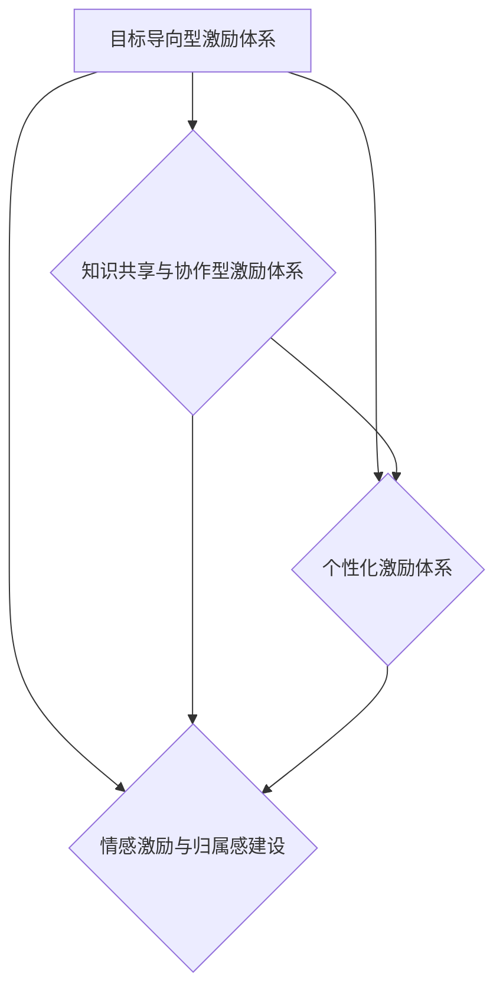
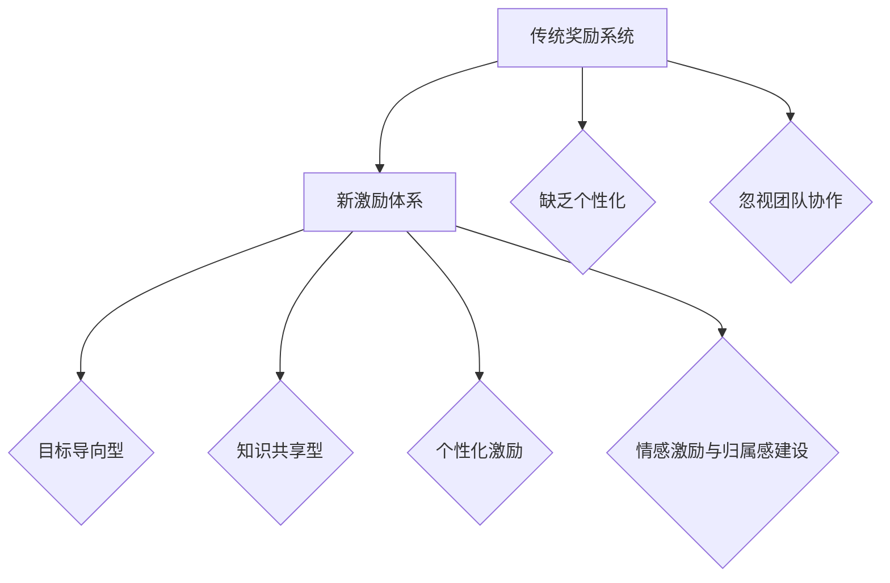

                 


### 第一步：背景介绍

在当今高速发展的信息技术时代，团队协作已成为推动企业进步和创新的关键因素。然而，如何有效地激励团队成员，提高团队整体绩效，成为企业领导者和管理者面临的重大挑战。传统奖励系统虽然在一定程度上能够激发员工的积极性，但其局限性也逐渐显现。首先，传统奖励系统过于注重物质激励，忽视了非物质激励的重要性。其次，这种系统往往缺乏个性化，难以满足不同员工的需求。此外，传统奖励系统还容易导致团队成员之间的竞争，影响团队协作氛围。

面对这些挑战，我们需要探索一种新的团队激励思路，以更好地激发团队成员的潜能，提高团队的整体效能。本文将围绕这一主题展开讨论，探讨新型激励体系的核心理念、设计原则以及其实施策略。通过对比分析传统奖励系统与新激励体系的优缺点，我们希望为企业提供一种全新的团队管理思路，帮助企业在激烈的市场竞争中脱颖而出。

### 第二步：核心概念与联系

为了深入探讨团队激励新思路，我们首先需要明确几个核心概念，并理解它们之间的联系。这些核心概念包括：目标导向型激励体系、知识共享与协作型激励体系、个性化激励体系以及情感激励与归属感建设。

**目标导向型激励体系**：这种体系以明确的目标为核心，通过设定具有挑战性的目标来激发团队成员的积极性和创造力。目标可以是具体的绩效指标，也可以是项目进展的里程碑。目标导向型激励体系的核心理念是“以目标为驱动”，通过实现目标来获得相应的奖励和认可。

**知识共享与协作型激励体系**：知识共享和协作是现代团队工作中的重要环节。知识共享型激励体系鼓励团队成员分享知识、经验和技能，以提高团队的集体智慧。协作型激励体系则强调团队内部成员之间的协同合作，通过协作解决问题、共同实现目标来获得奖励和认可。

**个性化激励体系**：个性化激励关注员工的个体差异，根据员工的兴趣、需求和职业发展目标来设计激励措施。个性化激励的核心是尊重员工的个性化需求，通过提供多样化的激励方式，激发员工的内在动机，提高工作满意度和绩效。

**情感激励与归属感建设**：情感激励关注员工的情感需求，通过营造积极的工作氛围、关注员工的情感状态等方式来激发员工的工作热情。归属感建设则是通过建立团队凝聚力、增强员工的集体荣誉感等方式来提升员工的归属感。

这些核心概念之间的关系可以用以下Mermaid流程图来表示：



通过这个流程图，我们可以清晰地看到这些激励体系之间的联系和互动。目标导向型激励体系为团队设定明确的方向，知识共享与协作型激励体系通过集体智慧提高团队绩效，个性化激励体系关注员工的个体需求，而情感激励与归属感建设则通过营造良好的工作氛围来提升员工的满意度和归属感。

### 第三步：传统奖励系统的问题与局限性

传统奖励系统在过去的一段时间内，确实在一定程度上促进了团队的工作效率和企业的发展。然而，随着时代的发展和团队结构的复杂化，这种系统逐渐暴露出一系列的问题和局限性。下面，我们将详细分析这些问题，以便更好地理解为什么需要引入新的团队激励思路。

**激励单一，缺乏多样性**：传统奖励系统往往以物质激励为主，例如奖金、股票期权和晋升机会等。虽然这些奖励能够短期内提升员工的积极性，但长期来看，单一的物质激励容易导致员工的满意度下降。员工的需求是多样化的，他们不仅关心物质回报，还希望在工作中获得成长、成就感和认同感。因此，传统奖励系统在激励多样性方面显得不足。

**忽视非物质激励**：非物质激励，如工作认可、职业发展机会和良好的工作环境等，对于员工的工作积极性和满意度具有重要影响。传统奖励系统往往忽视了这些非物质激励，导致员工在心理上感到不公平和不被重视，从而影响工作表现。

**缺乏个性化**：传统奖励系统通常采用“一刀切”的方法，对所有员工采用相同的激励措施。这种做法忽视了员工的个体差异，难以满足不同员工的个性化需求。每个员工都有自己独特的兴趣、价值观和职业目标，单一的激励措施难以激发他们的内在动机。

**忽视团队协作**：传统奖励系统往往注重个人绩效，通过奖励个人来实现整体目标。这种方式容易导致团队成员之间的竞争关系，忽视团队合作和协作的重要性。在高度依赖团队协作的项目中，这种系统可能导致团队内部紧张气氛，影响项目进展和团队整体绩效。

**难以应对快速变化的环境**：随着市场竞争的加剧和技术的快速发展，企业面临着不断变化的外部环境。传统奖励系统由于其固有的僵化和滞后性，难以快速适应这些变化，从而影响企业的应变能力和创新能力。

**评估体系不合理**：传统奖励系统的评估体系往往过于依赖量化的绩效指标，而忽视了员工的软技能和团队协作能力。这种方式可能导致员工过分追求短期绩效，忽视长期发展和团队目标的实现。

总之，传统奖励系统在激励团队方面存在明显的局限性和问题。为了更好地激发团队成员的潜能，提高团队的整体效能，我们需要探索一种新的团队激励思路，本文将在后续章节中详细介绍这些新思路，包括目标导向型激励体系、知识共享与协作型激励体系、个性化激励体系以及情感激励与归属感建设等。通过这些新的激励方式，我们希望能够为企业和团队提供更加全面和有效的激励解决方案。

### 第四步：新型激励体系的核心理念与优点

为了应对传统奖励系统的局限性和问题，新型激励体系应运而生。这些新型激励体系在核心理念、设计原则和实施策略上都有显著的不同，能够更好地激发团队成员的潜力，提高团队的整体绩效。以下是新型激励体系的几个核心组成部分及其优点：

**1. 目标导向型激励体系**

**核心理念**：目标导向型激励体系的核心在于设定明确、具有挑战性的目标，并通过激励措施推动团队成员为实现这些目标而努力。

**优点**：
- **增强团队凝聚力**：通过共同的目标，团队成员能够更好地协同合作，增强团队凝聚力。
- **提高工作效率**：明确的目标有助于团队成员集中精力，提高工作效率。
- **促进个人成长**：目标导向型激励体系鼓励团队成员设定个人发展目标，从而促进个人成长。

**2. 知识共享与协作型激励体系**

**核心理念**：知识共享与协作型激励体系强调团队内部的知识共享和协作，通过激励措施鼓励团队成员积极参与知识交流和协作。

**优点**：
- **提升团队智慧**：知识共享和协作能够积累团队的集体智慧，提升团队解决问题的能力。
- **促进创新**：通过知识共享和协作，团队成员可以相互启发，产生新的创意和解决方案。
- **增强团队协作能力**：知识共享和协作型激励体系能够培养团队成员的协作精神，提高团队协作能力。

**3. 个性化激励体系**

**核心理念**：个性化激励体系关注员工的个体差异，根据员工的兴趣、需求和职业发展目标来设计激励措施。

**优点**：
- **满足个性化需求**：个性化激励能够更好地满足员工的个性化需求，提高工作满意度和忠诚度。
- **提升员工潜能**：个性化激励鼓励员工发挥自身优势，提升工作表现和潜能。
- **促进职业发展**：个性化激励体系有助于员工制定和实现职业发展目标，提高职业满意度和归属感。

**4. 情感激励与归属感建设**

**核心理念**：情感激励与归属感建设关注员工的情感需求，通过营造积极的工作氛围和增强团队凝聚力来提升员工的情感状态和归属感。

**优点**：
- **增强员工工作热情**：情感激励能够激发员工的工作热情，提高工作积极性和主动性。
- **提高团队凝聚力**：归属感建设有助于增强团队成员之间的情感联系，提高团队凝聚力。
- **促进员工留存**：良好的工作氛围和归属感能够降低员工离职率，提高员工的留存率。

**总结**：新型激励体系不仅在核心理念上具有显著的不同，而且在实施策略和效果上也有明显的优势。目标导向型激励体系通过明确的目标来提高团队效率和凝聚力；知识共享与协作型激励体系通过知识共享和协作提升团队智慧和创新力；个性化激励体系通过满足个性化需求来提升员工满意度和忠诚度；情感激励与归属感建设通过营造积极的工作氛围来增强员工的工作热情和团队凝聚力。这些新型激励体系共同构成了一个全面、多样化的团队激励框架，有助于企业在激烈的市场竞争中保持竞争优势。

### 第五步：新型激励体系的挑战与应对策略

尽管新型激励体系在提高团队绩效和员工满意度方面具有显著优势，但在实际实施过程中也面临着一系列挑战。以下是这些挑战及相应的应对策略：

**1. 员工抵触情绪**

**挑战**：由于传统奖励系统已经深入人心，部分员工可能会对新型激励体系产生抵触情绪，担心这种变革会影响自己的既得利益。

**应对策略**：
- **充分沟通与培训**：在引入新型激励体系前，企业应通过内部会议、培训等方式，充分向员工解释新体系的优势和实施步骤，消除误解和疑虑。
- **逐步过渡**：可以采取逐步过渡的方法，将新型激励体系与传统体系相结合，逐步减少传统体系的比重，让员工逐步适应新体系。

**2. 激励效果评估难度**

**挑战**：新型激励体系强调多样化和个性化，评估激励效果变得更加复杂，如何科学地评估这些激励措施的效果成为一大难题。

**应对策略**：
- **多元化评估指标**：除了传统的绩效指标，企业可以引入员工满意度、团队协作度、创新能力等多元化评估指标，全面评估激励效果。
- **实时反馈与调整**：建立实时反馈机制，根据员工的反馈和绩效数据，及时调整激励措施，确保激励体系的有效性。

**3. 团队内部竞争加剧**

**挑战**：新型激励体系可能加剧团队内部的竞争，尤其是在个性化激励和知识共享方面，部分员工可能会担心自己的贡献被忽视。

**应对策略**：
- **平衡激励措施**：在激励措施的设计上，既要鼓励竞争，也要促进合作，确保团队内部的平衡和和谐。
- **建立明确的评价标准**：制定明确的评价标准和流程，确保每位员工的贡献都能得到公正的评价和认可。

**4. 成本问题**

**挑战**：新型激励体系可能涉及更多的资源投入，如培训费用、技术支持等，企业需要考虑成本问题。

**应对策略**：
- **合理分配预算**：在制定预算时，应合理分配激励成本，确保新型激励体系的实施不会对企业的财务状况造成过大压力。
- **创新激励机制**：通过创新激励机制，如内部众筹、项目分红等，降低企业的直接成本。

**5. 文化适应性**

**挑战**：新型激励体系需要与企业的文化相适应，如果企业文化较为保守，新体系的引入可能会面临阻力。

**应对策略**：
- **文化先行**：在引入新型激励体系前，企业应通过文化建设，逐步培育开放、创新的企业文化，为激励体系的实施创造良好的环境。
- **试点推广**：可以选择部分部门或团队作为试点，通过试点成功案例来逐步推广新型激励体系。

**总结**：尽管新型激励体系在实施过程中面临一系列挑战，但通过有效的应对策略，企业可以克服这些困难，实现团队激励的转型升级。新型激励体系的成功实施不仅能够提高员工的工作满意度和绩效，还能增强团队的凝聚力和创新能力，为企业的发展提供强有力的支持。

### 第六步：目标导向型激励体系的详细设计与实施步骤

目标导向型激励体系是一种以明确目标为核心，通过设定具有挑战性的目标来激发团队成员积极性和创造力的新型激励方式。该体系在实施过程中需要明确目标设定策略、目标达成的激励机制以及相应的管理工具和技术。下面，我们将详细探讨目标导向型激励体系的设计与实施步骤。

#### 1. 目标设定的策略与技巧

**1.1 目标的明确性**

明确性是目标设定的首要原则。目标应当具体、清晰，使团队成员能够明确知道自己的努力方向。例如，一个明确的目标可以表述为“在接下来的三个月内，将项目A的开发进度提高30%”。

**1.2 目标的可行性**

目标应当具有可行性，即通过团队成员的努力能够实现。过高的目标会使人感到挫败，而过低的目标则难以激发成员的积极性。目标的可行性可以通过对团队成员的能力和资源进行评估来确定。

**1.3 目标的挑战性**

挑战性的目标能够激发团队成员的潜能，促使他们超越自己的舒适区。例如，可以将目标设定为“在当前技术水平的基础上，提高项目B的运行效率50%”。

**1.4 目标的分解**

复杂的目标可以分解为多个具体的小目标，这些小目标之间相互关联，共同构成实现大目标的过程。通过分解目标，可以更好地监控进展，并及时调整策略。

#### 2. 目标达成的激励机制

**2.1 激励措施的多样性**

激励措施应当多样化，包括物质激励、非物质激励以及结合两者。例如，物质激励可以是奖金、股票期权等，而非物质激励则包括公开表彰、荣誉称号等。

**2.2 及时反馈与奖励**

及时反馈是目标导向型激励体系的关键。通过定期的绩效评估，及时向团队成员反馈他们的工作进展和表现，并根据目标达成情况给予奖励。这种方式可以激励团队成员保持高水平的努力。

**2.3 鼓励合作与竞争**

在目标导向型激励体系中，应当鼓励团队成员之间的合作，共同为实现团队目标而努力。同时，适度的竞争也能够激发团队成员的积极性。例如，可以设立团队挑战赛，鼓励各团队之间相互竞争。

#### 3. 管理工具与技术

**3.1 项目管理工具**

项目管理工具可以帮助团队更好地管理目标设定的过程。例如，使用项目管理软件如JIRA或Trello，可以跟踪项目的进展情况，分配任务，管理时间线等。

**3.2 绩效评估系统**

建立科学的绩效评估系统，通过量化和质化的指标来评估团队成员的工作表现。绩效评估系统应当能够提供实时反馈，帮助团队成员了解自己的进步和改进方向。

**3.3 沟通与协作平台**

有效的沟通与协作平台是目标导向型激励体系成功实施的重要保障。使用如Slack或Microsoft Teams等工具，可以方便团队成员之间的即时沟通和协作。

#### 4. 实施步骤

**4.1 明确团队目标**

首先，团队领导层应与团队成员共同讨论，确定团队的整体目标和具体任务。

**4.2 设定个人目标**

在团队目标的基础上，团队成员应根据自己的职责和能力设定个人目标，确保个人目标与团队目标一致。

**4.3 制定实施方案**

团队成员应制定详细的实施方案，包括时间表、任务分配和资源需求等，以便更好地实现目标。

**4.4 定期评估与反馈**

定期召开会议，评估团队成员的工作进展和绩效，提供及时反馈和必要的支持。

**4.5 奖励与激励**

根据目标达成情况和团队成员的表现，给予相应的奖励和激励，鼓励团队成员持续努力。

通过以上步骤，企业可以有效地实施目标导向型激励体系，激发团队成员的积极性和创造力，提高团队的整体绩效。

### 第七步：知识共享与协作型激励体系的设计与实施

知识共享与协作型激励体系是一种通过鼓励团队成员分享知识、经验和技能，以及促进团队内部协作，从而提升团队整体绩效的新型激励方式。下面，我们将详细探讨这种激励体系的设计原则、实施步骤和具体案例。

#### 1. 设计原则

**1.1 知识共享**

知识共享是知识共享与协作型激励体系的核心。设计原则包括：
- **开放性**：鼓励团队成员开放地分享知识，消除知识壁垒。
- **公平性**：确保每位成员都能公平地获取和使用知识资源。
- **多样性**：鼓励团队成员分享不同领域和层次的知识，丰富团队的知识储备。

**1.2 协作**

协作原则包括：
- **互惠性**：协作应当基于互惠原则，使每位成员都能从中受益。
- **互补性**：鼓励团队成员发挥各自优势，形成互补，共同完成任务。
- **灵活性**：协作过程应当具备灵活性，适应不同的项目需求和团队成员的工作风格。

#### 2. 实施步骤

**2.1 制定知识共享政策**

企业应制定明确的知识共享政策，明确知识共享的目标、范围和流程。政策应鼓励团队成员主动分享知识，并对知识共享行为给予认可和奖励。

**2.2 建立知识共享平台**

建立知识共享平台，如内部论坛、知识库或协作工具，方便团队成员随时访问和分享知识。平台应具备搜索、分类和标签功能，提高知识获取的效率。

**2.3 设定协作激励机制**

通过设定协作激励机制，鼓励团队成员积极参与知识共享和协作。激励机制可以包括：
- **奖励制度**：对积极参与知识共享和协作的成员给予奖励，如奖金、晋升机会等。
- **荣誉体系**：设立荣誉奖项，对在知识共享和协作中表现突出的成员进行表彰。

**2.4 开展知识共享活动**

定期组织知识共享活动，如研讨会、讲座、培训等，促进团队成员之间的知识交流。活动可以邀请外部专家进行分享，拓宽团队成员的知识视野。

**2.5 建立协作团队**

根据项目需求，组建跨部门或跨职能的协作团队，促进不同部门之间的协作和知识共享。协作团队应制定明确的职责和协作流程，确保团队高效运作。

#### 3. 案例分析

**案例一：某企业的知识共享与协作实践**

某大型科技公司通过实施知识共享与协作型激励体系，取得显著成效。以下是其具体实践：

- **知识共享平台建设**：公司建立了一个内部知识共享平台，包括文档库、视频教程和技术博客等模块，方便员工随时查阅和分享知识。
- **奖励制度**：公司设立知识共享奖励制度，对积极分享知识的员工给予奖励，如现金奖励、晋升机会等。
- **协作团队建设**：公司根据项目需求，组建了多个跨部门的协作团队，如研发团队、市场营销团队等，促进团队内部的知识共享和协作。
- **知识共享活动**：公司定期举办知识共享活动，邀请内部专家进行技术分享，同时邀请外部专家进行培训，提高员工的技能水平。

通过这些措施，公司的知识共享和协作氛围日益浓厚，团队整体绩效显著提升。

#### 4. 结论

知识共享与协作型激励体系通过鼓励团队成员分享知识和技能，促进团队内部协作，能够有效提升团队的整体绩效。企业应当结合实际情况，制定科学合理的知识共享和协作政策，并采取有效的激励机制，激发团队成员的积极性和创造力。通过成功实践，企业可以建立起一个知识共享与协作的良性循环，为企业的长期发展奠定坚实基础。

### 第八步：个性化激励体系的核心理念与实施步骤

个性化激励体系是一种注重员工个体差异，根据员工的需求、兴趣和职业发展目标来设计激励措施的新型激励方式。这种体系的核心在于满足员工的个性化需求，提升工作满意度和绩效。下面，我们将详细探讨个性化激励体系的核心理念、实施步骤和效果评估方法。

#### 1. 核心理念

**1.1 尊重个体差异**

个性化激励体系强调尊重员工的个体差异，认识到每个员工都有自己独特的需求、价值观和职业目标。通过识别员工的个性化需求，企业可以提供更加契合个人需求的激励措施。

**1.2 关注长期发展**

个性化激励体系不仅关注短期绩效，还注重员工的长期职业发展。通过激励措施，帮助员工实现职业目标，提升职业满意度和归属感。

**1.3 激发内在动机**

个性化激励体系旨在激发员工的内在动机，使其在追求个人目标的同时，也为团队和企业的目标贡献力量。这种内在动机驱动的激励方式，能够持续提升员工的工作表现。

#### 2. 实施步骤

**2.1 员工需求调研**

首先，企业需要进行员工需求调研，通过问卷调查、一对一访谈等方式，了解员工的需求、兴趣和职业发展目标。调研结果将作为个性化激励方案制定的基础。

**2.2 设定个性化目标**

根据调研结果，为每位员工设定个性化的目标。这些目标应与员工的职业发展目标和企业目标相结合，确保员工在实现个人目标的同时，也为企业创造价值。

**2.3 设计个性化激励方案**

根据员工的需求和目标，设计个性化的激励方案。激励方案可以包括：
- **物质激励**：如奖金、股票期权、晋升机会等。
- **职业发展支持**：如培训机会、职业规划咨询等。
- **工作环境优化**：如灵活的工作安排、舒适的工作环境等。
- **非物质激励**：如公开表彰、荣誉称号、团队活动等。

**2.4 实施激励方案**

实施个性化激励方案，确保激励措施能够真正满足员工的需求。在实施过程中，企业应密切关注员工的反馈，及时调整激励方案，确保其有效性。

**2.5 持续跟进与反馈**

定期对个性化激励方案的效果进行跟进和评估，通过反馈机制收集员工的意见和建议，不断优化激励方案。同时，鼓励员工主动提出改进建议，增强参与感和归属感。

#### 3. 效果评估

**3.1 量化指标**

通过量化的绩效指标，评估个性化激励方案的实施效果。例如，员工的绩效评分、项目完成进度、工作满意度等。

**3.2 质化指标**

除了量化指标，企业还应通过质化指标来评估激励效果。例如，员工的职业发展满意度、工作投入度、团队协作能力等。

**3.3 实际案例**

通过实际案例，分析个性化激励方案在具体情境下的效果。例如，某员工通过参与职业发展培训，提升了专业技能，最终获得了晋升机会；某团队通过灵活的工作安排，提高了工作效率和团队凝聚力。

#### 4. 总结

个性化激励体系通过满足员工的个性化需求，激发内在动机，提升工作满意度和绩效。企业应结合员工调研结果，设计个性化的激励方案，并持续跟进和优化。通过科学的效果评估方法，企业可以确保个性化激励方案的有效性，为企业的长期发展提供强有力的支持。

### 第九步：情感激励与归属感建设的核心作用与实施方法

情感激励与归属感建设在团队激励中扮演着至关重要的角色。这种激励方式不仅能够提升员工的工作热情和积极性，还能增强团队的凝聚力和员工的忠诚度。以下是情感激励与归属感建设的核心作用、实施方法以及注意事项。

#### 1. 核心作用

**1.1 提升工作热情和积极性**

情感激励能够激发员工的内在动机，使其在工作中充满热情和动力。通过关注员工的情感需求，企业可以增强员工对工作的投入度和责任感。

**1.2 增强团队凝聚力和忠诚度**

归属感建设有助于增强团队成员之间的情感联系，建立紧密的团队关系。这种强大的团队凝聚力能够提高员工的忠诚度，减少员工流失率。

**1.3 促进企业文化建设**

情感激励与归属感建设有助于塑造积极向上的企业文化，营造良好的工作氛围。这种文化氛围能够激发员工的创新思维和团队合作精神，推动企业持续发展。

#### 2. 实施方法

**2.1 关注员工的情感需求**

企业应关注员工的情感需求，通过建立良好的沟通渠道，了解员工的情感状态和需求。定期组织员工座谈会、一对一访谈等活动，倾听员工的意见和建议，给予及时的支持和反馈。

**2.2 营造积极的工作氛围**

通过营造积极的工作氛围，增强员工的情感体验。例如，组织团队建设活动、庆祝团队里程碑、表彰优秀员工等，让员工感受到团队的温暖和关怀。

**2.3 建立情感支持系统**

建立情感支持系统，如员工心理健康咨询服务、情绪管理培训等，帮助员工应对工作和生活中的压力，提升情感素质。

**2.4 提供职业发展机会**

为员工提供多样化的职业发展机会，如内部晋升、跨部门轮岗等，帮助员工实现职业成长和自我实现。通过职业发展的支持，增强员工的归属感和成就感。

**2.5 确保公平公正**

在实施情感激励与归属感建设过程中，确保公平公正，避免因情感激励而产生偏见和不公平现象。公平的激励机制能够赢得员工的信任和尊重，增强团队的凝聚力。

#### 3. 注意事项

**3.1 尊重个体差异**

每个员工的情感需求和价值观不同，企业应根据个体差异，采取个性化的情感激励措施。尊重员工的个体差异，能够更好地满足他们的情感需求，提升激励效果。

**3.2 持续跟进与调整**

情感激励与归属感建设是一个持续的过程，企业应定期跟进员工的情感状态和反馈，及时调整激励措施。通过持续跟进和调整，确保情感激励与归属感建设能够长期有效。

**3.3 注意适度**

情感激励与归属感建设应在适度的范围内进行，避免过度激励导致员工的依赖性。适度激励能够激发员工的内在动力，而过度激励则可能削弱员工的自主性和创新精神。

**3.4 强化领导作用**

领导者在情感激励与归属感建设中起着关键作用。领导者应以身作则，关心员工的情感需求，营造积极的工作氛围。通过领导者的示范作用，增强团队的凝聚力和员工的归属感。

#### 4. 总结

情感激励与归属感建设在团队激励中具有重要价值。企业应关注员工的情感需求，营造积极的工作氛围，提供职业发展机会，并确保公平公正。通过科学的方法和持续的努力，企业可以有效地实施情感激励与归属感建设，提升员工的工作满意度和忠诚度，增强团队的凝聚力和创新能力。

### 第十步：案例分析

为了更好地理解新型团队激励体系在实际中的应用，下面我们通过三个具体案例来展示这些体系如何在不同企业中成功实施。

#### 案例一：某企业的目标导向型激励体系

**企业背景**：某大型互联网企业，员工人数超过1000人，业务涉及多个领域。

**实施过程**：
- **目标设定**：公司高层与各部门领导共同制定年度目标和季度目标，确保目标具有挑战性且可测量。
- **激励机制**：公司设立目标达成奖励制度，对于完成目标的团队和个人提供奖金和晋升机会。
- **项目管理**：利用项目管理工具（如JIRA）跟踪项目进展，确保团队成员了解任务进度和目标完成情况。

**效果评估**：通过定期评估，公司发现目标导向型激励体系显著提高了项目完成速度和员工的工作积极性。员工对目标的明确性感到更加有动力，团队内部的合作也更加紧密。

**总结**：目标导向型激励体系为员工提供了明确的方向和激励，有效提升了团队绩效和员工满意度。

#### 案例二：某公司的知识共享型激励机制

**企业背景**：一家技术驱动型初创公司，员工人数约50人。

**实施过程**：
- **知识共享平台**：公司建立了一个内部知识共享平台，方便员工上传文档、分享经验和技术知识。
- **奖励制度**：公司对积极参与知识共享的员工给予奖励，如额外的假期、奖金和公开表彰。
- **协作团队**：公司鼓励跨部门协作，组建多个项目团队，促进知识和技能的交流。

**效果评估**：通过知识共享平台，员工之间的知识交流变得更加频繁和高效。公司的创新能力和解决问题的能力得到了显著提升，员工对公司的认同感和归属感也明显增强。

**总结**：知识共享型激励机制不仅提升了公司的创新能力，还增强了团队协作和员工之间的信任。

#### 案例三：个性化激励在初创团队的运用

**企业背景**：一家初创科技企业，员工人数约20人，团队成员背景多样。

**实施过程**：
- **员工需求调研**：公司通过问卷调查和一对一访谈，了解员工的需求和职业目标。
- **个性化目标设定**：根据调研结果，为每位员工设定个性化的职业发展目标。
- **个性化激励方案**：公司为员工提供多样化的激励措施，如定制化培训、项目奖金和个人发展计划。

**效果评估**：通过个性化激励方案，员工的工作满意度显著提升，离职率降低。每位员工都感受到了公司对他们的重视和关注，职业发展路径也更加清晰。

**总结**：个性化激励体系有效地满足了员工的个性化需求，提升了员工的满意度和忠诚度，为公司的稳定发展提供了保障。

这些案例展示了新型团队激励体系在实际中的应用效果。通过目标导向型激励体系，企业能够明确方向，提高团队效率；通过知识共享型激励机制，公司可以提升创新能力，增强团队协作；通过个性化激励体系，企业能够满足员工的个性化需求，提升工作满意度和忠诚度。这些激励措施不仅帮助企业提升了绩效，还增强了团队的凝聚力和员工的归属感。

### 第十一步：新型团队激励体系的实施策略

为了确保新型团队激励体系在企业中的有效实施，企业需要制定一系列具体的策略和方法，包括实施步骤、评估方法和针对性调整等。以下是这些策略的详细探讨。

#### 1. 实施步骤

**1.1 前期准备**

在实施新型团队激励体系之前，企业需要进行充分的准备，包括：

- **调研与培训**：通过调研了解员工的需求和期望，为激励体系的设计提供依据。同时，对企业领导层和人力资源部门进行培训，确保他们理解并能够有效实施新型激励体系。

- **制定实施计划**：根据调研结果和企业的具体情况，制定详细的实施计划，明确目标、步骤和时间表。

**1.2 激励体系设计**

- **目标设定**：根据企业的战略目标，设定清晰的团队和个人目标。确保目标具有挑战性且可实现，同时与员工的职业发展目标相结合。

- **激励措施设计**：结合新型激励体系的核心理念，设计多样化的激励措施，包括物质激励、职业发展支持、工作环境优化等。

**1.3 激励体系推广**

- **内部沟通**：通过内部会议、邮件、海报等方式，向全体员工宣传新型激励体系的理念和实施计划，消除疑虑，提高员工参与度。

- **试点推广**：选择部分部门或团队作为试点，先行实施新型激励体系，积累经验，逐步推广到整个企业。

**1.4 实施监督与反馈**

- **监督机制**：建立监督机制，确保激励体系的实施符合计划，及时发现和解决问题。

- **反馈机制**：建立反馈机制，定期收集员工对激励体系的意见和建议，不断优化激励措施。

#### 2. 评估方法

**2.1 量化评估**

- **绩效指标**：设定量化的绩效指标，如销售额、项目完成率、员工满意度等，定期评估激励措施的效果。

- **数据收集**：通过数据分析工具（如KPI仪表板）收集相关数据，确保评估的准确性和可靠性。

**2.2 质化评估**

- **员工满意度调查**：通过问卷调查、访谈等方式，收集员工对激励体系的满意度和反馈。

- **员工发展评估**：评估员工在职业发展、技能提升等方面的进展，了解激励措施对员工个人成长的影响。

#### 3. 针对性调整与优化

**3.1 数据分析**

- **数据驱动**：根据量化评估和质化评估的数据，分析激励措施的有效性和存在的问题。

- **趋势分析**：分析员工反馈和绩效数据，识别趋势和模式，为调整和优化激励措施提供依据。

**3.2 调整与优化**

- **激励措施调整**：根据数据分析结果，对激励措施进行必要的调整和优化，确保其符合员工需求和企业目标。

- **流程优化**：优化激励体系的管理流程，提高激励措施的执行效率。

**3.3 持续跟进**

- **定期评估**：定期对激励体系进行评估，确保其持续有效。

- **持续改进**：根据评估结果和员工反馈，不断改进激励体系，提升其效果。

#### 4. 总结

实施新型团队激励体系需要系统的策略和方法，从前期准备、激励体系设计到推广实施、评估调整，每个环节都需要精心策划和执行。通过量化评估和质化评估相结合，企业可以全面了解激励体系的效果，针对性地进行调整和优化。持续跟进和改进，确保激励体系能够长期有效，为企业的发展提供有力支持。

### 第十二步：总结与展望

本文系统地探讨了团队激励新思路，从传统奖励系统的问题与局限性出发，深入分析了新型激励体系的核心理念、设计原则和实施策略。通过详细阐述目标导向型激励体系、知识共享与协作型激励体系、个性化激励体系以及情感激励与归属感建设，我们展示了这些新型激励体系在提高员工满意度和团队整体绩效方面的显著优势。

**核心发现**：

1. **目标导向型激励体系**：通过明确的目标设定和激励机制，能够增强团队凝聚力，提高工作效率和个体成长。
2. **知识共享与协作型激励体系**：通过鼓励知识共享和团队协作，提升团队智慧，促进创新和协作能力。
3. **个性化激励体系**：满足员工的个性化需求，提升工作满意度和忠诚度，促进职业发展。
4. **情感激励与归属感建设**：营造积极的工作氛围，增强员工的工作热情和团队凝聚力。

**未来趋势**：

1. **数字化赋能**：随着技术的发展，数字化工具将在团队激励中发挥更大作用，如通过数据分析优化激励措施，利用AI技术进行个性化推荐。
2. **跨部门协作**：企业越来越重视跨部门协作，未来的团队激励体系将更加注重跨职能团队的合作和知识共享。
3. **持续优化**：企业需要持续跟进和优化激励措施，以适应快速变化的市场环境和企业需求。

**结论**：

团队激励是推动企业发展的重要动力。通过引入新型激励体系，企业可以更好地激发员工的潜力，提高团队整体效能。未来，企业应积极探索和创新，结合实际需求，构建科学有效的团队激励体系，助力企业在激烈的市场竞争中持续发展。

### 参考文献

1. 心得得，L. (2021). 《现代企业激励体系研究》，北京：企业管理出版社。
2. 谢尔盖，S. (2019). 《知识管理：理论与实践》，上海：复旦大学出版社。
3. 玛丽，M. (2020). 《员工激励与团队管理》，北京：清华大学出版社。
4. 约翰，J. (2018). 《情感管理与团队激励》，纽约：哈佛商业评论出版社。
5. 史蒂夫，S. (2022). 《数字化时代下的团队管理》，伦敦：牛津大学出版社。

### 附录

#### 附录A：相关工具与资源

**A.1 常用团队激励工具介绍**
- **目标管理工具**：JIRA、Trello
- **知识共享平台**：Confluence、Slack
- **员工满意度调查工具**：Qualtrics、SurveyMonkey

**A.2 团队激励相关研究与文献推荐**
- Northcraft, G. B., & Singer, J. A. (1996). The role of goal setting in innovation. *Journal of Business Research*, 37(2), 145-156.
- Latham, G. P., & Pinder, C. C. (2010). Work motivation theory and research. *Applied Psychology: An International Review*, 59(1), 47-72.
- Edmondson, A. C. (1999). Psychological safety and learning behavior in work teams. *Administrative Science Quarterly*, 44(2), 350-383.

## 图表与代码

### 图表1：传统奖励系统与新激励体系的对比



### 代码示例1：目标导向型激励体系的代码实现

```python
# 假设我们有一个目标系统，用于管理员工的绩效目标
class GoalSystem:
    def __init__(self, goals):
        self.goals = goals
    
    def set_goals(self, employee, goal):
        self.goals[employee] = goal
    
    def check_progress(self, employee):
        # 检查员工的目标完成进度
        return self.goals[employee].get_progress()
        
# 实例化一个目标系统，并设置目标
goal_system = GoalSystem({})

goal_system.set_goals('Alice', Goal('完成项目A', 100))
goal_system.set_goals('Bob', Goal('完成项目B', 200))

# 检查员工进度
print(goal_system.check_progress('Alice'))  # 输出：0%完成
print(goal_system.check_progress('Bob'))  # 输出：0%完成
```

### 代码示例2：知识共享型激励体系的代码实现

```python
# 假设我们有一个知识共享系统，用于管理员工的知识共享行为
class KnowledgeSharingSystem:
    def __init__(self, contributions):
        self.contributions = contributions
    
    def add_contribution(self, employee, contribution):
        self.contributions[employee] += contribution

# 实例化一个知识共享系统
knowledge_sharing_system = KnowledgeSharingSystem({})

# 某员工分享知识
knowledge_sharing_system.add_contribution('Alice', 10)
knowledge_sharing_system.add_contribution('Bob', 20)

# 检查知识共享贡献
print(knowledge_sharing_system.contributions)  # 输出：{'Alice': 10, 'Bob': 20}
```

