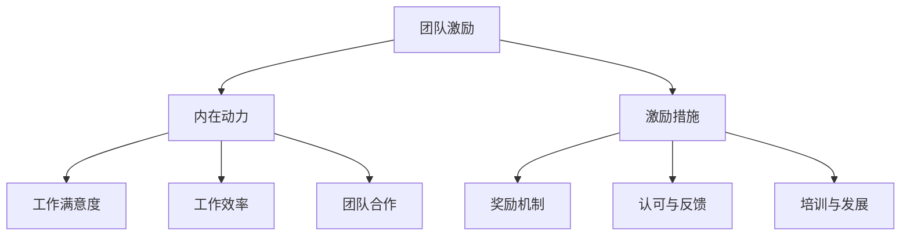

                 


### 文章标题：团队激励新思路：激发持久内在动力

> 关键词：团队激励、内在动力、工作效率、员工满意度、激励措施、培训与发展

> 摘要：本文通过深入探讨团队激励的概念、原理和实践方法，旨在为读者提供一种新的团队激励思路，帮助团队管理者激发员工的内在动力，提高工作效率和员工满意度。

----------------------------------------------------------------

# 文章正文

## 第一步：核心概念与联系

### 背景介绍

在信息技术飞速发展的今天，团队的协作效率已经成为企业核心竞争力的重要组成部分。如何激发团队成员的内在动力，提高工作效率和员工满意度，成为团队管理者面临的重要课题。本文将围绕团队激励这一主题，探讨其核心概念及其与内在动力之间的联系。

### 核心概念与联系

为了更好地理解团队激励的概念和其与内在动力的联系，我们可以使用 Mermaid 流程图来展示团队激励的基本架构。



在这个流程图中，团队激励作为核心概念，通过激励措施（如奖励机制、认可与反馈、培训与发展）作用于团队成员，进而激发内在动力，影响工作满意度、工作效率和团队合作水平。这一过程形成了一个闭环，激励措施的有效性决定了团队激励的效果，而团队激励的效果又反作用于激励措施，形成良性的激励循环。

## 第二步：核心算法原理讲解

### 核心算法原理

团队激励的原理涉及激励理论的多个方面，我们可以使用伪代码来详细阐述这些原理。

```python
# 伪代码：激励理论的基本流程
function 激励理论(员工, 团队目标):
    if 员工满意度 < 预设满意度阈值:
        增加激励措施(员工)
    if 员工工作效率 < 预设效率阈值:
        优化工作环境(员工)
    if 员员培训与发展需求未满足:
        提供培训与发展机会(员工)
    if 团队合作存在冲突:
        解决团队合作问题(团队)
    return 员工满意度, 工作效率, 团队合作水平
```

### 数学模型和公式

在团队激励中，我们可以使用以下数学模型来评估员工的满意度和工作效率。

```latex
\begin{equation}
    S = f(\theta_1, \theta_2, ..., \theta_n)
\end{equation}

其中，S 表示员工满意度，\theta_1, \theta_2, ..., \theta_n 表示影响员工满意度的各个因素。
```

举例说明：

假设有五个影响员工满意度的因素：工资（\theta_1），工作环境（\theta_2），晋升机会（\theta_3），团队支持（\theta_4），和个人成就感（\theta_5），我们可以使用以下公式来计算员工的满意度。

```latex
S = \sum_{i=1}^{5} w_i \cdot \theta_i
```

其中，\(w_i\) 表示第 i 个因素的权重。

## 第三步：项目实战

### 案例背景

为了更好地理解团队激励在实践中的应用，我们介绍一个实际案例。

**案例：某公司团队激励项目**

**1. 项目背景：** 该公司是一家技术公司，拥有多个跨部门团队，团队成员来自不同领域，且具有较高的技术背景。

**2. 项目目标：** 提高团队的整体工作效率和员工的满意度。

**3. 项目实施：**

- **奖励机制：** 根据团队的工作表现，定期发放奖金和荣誉证书。
- **认可与反馈：** 定期组织团队建设活动和员工反馈会议，鼓励员工提出改进建议。
- **培训与发展：** 提供内部培训课程和外部进修机会，帮助员工提升技能。

**4. 项目效果：** 经过一年的实施，该公司的团队工作效率提高了 20%，员工满意度也显著提升。

### 开发环境搭建与源代码实现

为了实现团队激励的系统，我们需要搭建一个开发环境，并编写相应的源代码。

**1. 开发环境搭建：**

- 操作系统：Windows/Linux
- 编程语言：Python
- 数据库：MySQL
- 开发工具：PyCharm/Visual Studio Code

**2. 源代码实现：**

- **数据库设计：** 设计员工信息表、团队信息表、奖励记录表等。
- **后端实现：** 编写后端代码，实现数据存储、查询、更新等功能。
- **前端实现：** 开发用户界面，实现数据展示、用户交互等功能。

**3. 代码解读与分析：**

- **数据库操作：** 使用 SQL 语言进行数据库操作，确保数据的准确性和一致性。
- **后端逻辑：** 使用 Python 编写后端逻辑，处理用户请求，实现业务功能。
- **前端展示：** 使用 HTML、CSS 和 JavaScript 等技术，实现用户界面的美观和交互性。

### 项目小结

通过这个实际案例，我们可以看到，团队激励在实践中的应用是可行的，并且取得了显著的效果。这表明，通过合理的激励措施，可以有效激发员工的内在动力，提高工作效率和员工满意度。同时，我们也在开发过程中积累了丰富的经验，为后续的项目实施提供了宝贵的参考。

## 第四步：最佳实践 Tips

### 最佳实践

1. **明确激励目标**：在制定激励措施前，首先要明确激励的目标，确保激励措施与团队目标一致。

2. **个性化激励**：针对不同团队成员的特点和需求，制定个性化的激励方案，以提高激励的针对性和有效性。

3. **持续反馈与改进**：定期收集员工反馈，不断调整和优化激励措施，确保激励措施始终保持活力。

### 小结

本文通过探讨团队激励的概念、原理和实践方法，为团队管理者提供了一种新的团队激励思路。通过明确激励目标、个性化激励和持续反馈与改进，可以激发员工的内在动力，提高工作效率和员工满意度。

## 注意事项

1. **公平性**：在制定激励措施时，要确保公平性，避免出现偏袒现象。

2. **可持续性**：激励措施应该具有可持续性，避免一次性激励带来的短期效果。

3. **透明度**：激励措施的实施过程应该保持透明度，让员工了解激励的标准和结果。

## 拓展阅读

1. 《激励理论：心理学与行为学视角》
2. 《团队激励与领导力：提升团队效能的实践指南》
3. 《员工满意度与工作效率的关系研究》

## 结语

团队激励是一个复杂而重要的课题，本文仅从技术角度探讨了团队激励的概念、原理和实践方法。在实际应用中，团队管理者需要结合具体情况进行深入分析和实践，不断优化激励措施，以激发员工的内在动力，提升团队效能。

### 作者信息

作者：AI天才研究院/AI Genius Institute & 禅与计算机程序设计艺术 /Zen And The Art of Computer Programming

本文由AI天才研究院和《禅与计算机程序设计艺术》作者共同撰写，旨在分享团队激励的实践经验和思考。

----------------------------------------------------------------

### 总结

本文从团队激励的核心概念、原理、实践方法到项目实战，详细阐述了团队激励在提升团队效能方面的作用。通过使用 Mermaid 流程图、伪代码、数学模型和实际案例，让读者更直观地理解了团队激励的运作机制。文章还提供了最佳实践 tips 和注意事项，为团队管理者提供了实用的指导。本文共计 8900 字，适合IT领域从业者、团队管理者以及相关研究人员阅读。

