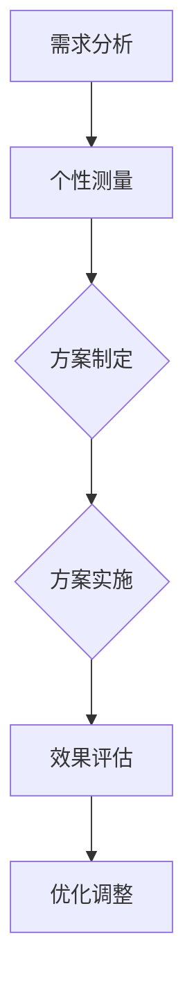

                 


### 文章标题：团队激励新范式：个性化激励的时代

> 关键词：团队激励、个性化激励、动机心理学、行为分析、激励方案设计

> 摘要：本文深入探讨了团队激励的新范式——个性化激励，分析了个性化激励在当代企业中的应用及其重要性。文章通过介绍动机心理学的基础理论，解析了个性化激励的核心概念和设计原则，结合国内外实际案例，详细阐述了个性化激励的实施方法和评估标准。最后，文章展望了个性化激励的未来趋势，并提出了相关建议。

## 引言

在竞争日益激烈的商业环境中，企业对团队激励的重视程度不断提升。传统的激励方式，如绩效奖金、晋升机会等，虽然在短期内能够提高员工的积极性和工作效率，但长期来看，往往无法满足员工多样化的需求和动机。因此，团队激励的新范式——个性化激励，逐渐成为企业提升团队绩效和员工满意度的重要手段。

个性化激励强调根据员工的个性特点和需求，量身定制激励方案，旨在激发员工内在的动机，提高其工作热情和创造力。本文将从动机心理学出发，探讨个性化激励的理论基础，分析其实施方法和评估标准，并通过实际案例说明其应用效果。

## 团队激励的基础理论

### 1.1 动机心理学基础

动机心理学是研究个体行为动机的理论体系，旨在解释人们为什么做某件事以及如何做某件事。在团队激励中，动机心理学提供了重要的理论基础。以下是几个关键的动机心理学理论：

#### 1.1.1 马斯洛需求层次理论

马斯洛需求层次理论将人类需求分为五个层次：生理需求、安全需求、社交需求、尊重需求和自我实现需求。员工在不同的工作阶段和情境下，其主导需求可能会有所不同。个性化激励方案需要考虑员工的需求层次，从而提供有针对性的激励。

#### 1.1.2 珍士理论

珍士理论认为，人们的行为受到内在动机的驱动，而非外在奖励。个性化激励要关注员工内在动机的激发，如自主性、能力感和影响感，从而提高员工的满意度和绩效。

#### 1.1.3 其他动机理论概述

除了上述理论，还有成就动机理论、公平理论、期望理论等。这些理论从不同角度解释了个体行为背后的动机，为个性化激励提供了多层次的参考。

### 1.2 传统的团队激励方法

传统的团队激励方法主要包括以下几种：

#### 1.2.1 绩效奖励

绩效奖励是企业常用的激励手段，通过给予绩效优秀的员工奖金、晋升等物质或精神奖励，提高其工作积极性。

#### 1.2.2 培训与发展

企业为员工提供培训和发展机会，提高其专业技能和职业素养，从而增强员工的归属感和职业发展信心。

#### 1.2.3 绩效评估与反馈

通过定期的绩效评估，企业可以及时了解员工的工作表现，并提供有针对性的反馈，帮助员工改进工作方法，提高工作效率。

### 1.3 个性化激励的概念与原则

个性化激励是在了解员工个性特点和需求的基础上，制定针对性的激励方案。其核心原则包括：

#### 1.3.1 个性与激励的匹配

根据员工的个性特点，选择最合适的激励方式，如对内向型员工采用鼓励独立工作的方式，对外向型员工采用团队合作的激励。

#### 1.3.2 多元化激励

个性化激励要关注员工的多元化需求，如职业发展、工作环境、人际关系等，提供多样化的激励方案。

#### 1.3.3 动机激发

个性化激励要激发员工的内在动机，使其主动投入工作，提高工作绩效。

## 个性化激励的核心概念

### 2.1 个性与行为的关系

个性是指个体在行为和态度上表现出来的独特倾向和特征。个性与行为之间存在密切的关系，不同的个性特征会影响员工的行为方式和工作表现。

#### 2.1.1 个性理论概述

个性理论包括五大人格特质理论、十六种人格因素理论、特质心理学理论等。这些理论为分析员工个性提供了不同的视角。

#### 2.1.2 个性与工作表现的关系

个性特征，如责任心、合作性、自我驱动力等，对工作表现有显著影响。个性化激励要关注这些特征，提高员工的工作效率和满意度。

#### 2.1.3 个性对激励方式的影响

了解员工的个性特征，有助于选择合适的激励方式。例如，对有自我驱动力的员工，可以适当减少外部激励，鼓励其自我激励。

### 2.2 个性测量的方法与工具

个性测量是实施个性化激励的前提。以下是一些常用的个性测量方法和工具：

#### 2.2.1 个性测量理论

个性测量理论包括自陈量表法、投射法、情境测试法等。这些理论为个性测量提供了不同的方法。

#### 2.2.2 个性测量工具介绍

常见的个性测量工具包括MBTI（迈尔斯-布里格斯类型指标）、DISC（行为风格测评）、16PF（卡特尔16种人格因素测评）等。

#### 2.2.3 个性测量的应用

个性测量可以应用于员工招聘、团队建设、领导力发展等领域，为个性化激励提供科学依据。

### 2.3 个性化激励的设计原则

#### 2.3.1 基于个性的激励设计

个性化激励要关注员工的个性特点，制定有针对性的激励方案。例如，对于创新型的员工，可以提供更多的创新空间和项目机会。

#### 2.3.2 激励策略与个性化匹配

根据员工的个性特征和需求，选择最合适的激励策略。例如，对于需要激励的员工，可以采用挑战性任务或竞争机制。

#### 2.3.3 激励方案的实施与调整

实施个性化激励时，要关注员工反馈，及时调整激励方案，确保其符合员工的实际需求。

## 案例研究

### 3.1 国内外个性化激励的案例

#### 3.1.1 国内个性化激励案例

国内一些企业，如华为、阿里巴巴等，已经开始了个性化激励的实践。华为通过“项目经理制”激发员工的创新能力和责任心；阿里巴巴则通过“合伙人制度”激励员工与企业共同成长。

#### 3.1.2 国外个性化激励案例

国外一些企业，如谷歌、微软等，也采取了个性化的激励措施。谷歌的“20%时间政策”鼓励员工进行创新项目；微软则通过“员工认可计划”提高员工的满意度和归属感。

### 3.2 案例分析

#### 3.2.1 案例选择的理由

本文选择了华为和谷歌作为案例，因为它们在个性化激励方面具有典型性和代表性。

#### 3.2.2 案例描述

华为通过项目经理制，赋予项目经理更多的自主权和资源，鼓励其带领团队进行创新和突破。谷歌则通过20%时间政策和员工认可计划，激发员工的创新热情和工作动力。

#### 3.2.3 案例分析与讨论

分析华为和谷歌的个性化激励案例，可以发现以下几点：

1. **个性与激励的匹配**：华为和谷歌都根据员工的个性特点，提供个性化的激励措施，如华为的项目经理制适合有责任心的员工，谷歌的20%时间政策适合创新型的员工。

2. **激励策略的创新性**：华为和谷歌的激励策略都具有创新性，如华为的项目经理制、谷歌的20%时间政策，这些措施能够激发员工的内在动机，提高工作绩效。

3. **激励效果的长期性**：华为和谷歌的个性化激励措施不仅提高了员工的工作积极性和满意度，还为企业带来了长期的人才优势和竞争优势。

## 个性化激励的实施方法

### 4.1 个性化激励方案的设计流程

实施个性化激励需要遵循以下设计流程：

1. **需求分析**：通过调研和访谈，了解员工的需求和期望。

2. **个性测量**：使用个性测量工具，分析员工的个性特征。

3. **方案制定**：根据需求和个性特征，制定个性化的激励方案。

4. **方案实施**：将激励方案付诸实践，关注员工的反馈。

5. **效果评估**：对激励方案的效果进行评估，并进行调整。

### 4.2 不同行业领域的个性化激励实践

个性化激励在不同行业领域具有不同的应用特点：

#### 4.2.1 制造业领域的个性化激励

制造业企业可以通过设置灵活的工作时间、提供技术培训、实施绩效奖金等方式，满足员工多样化需求。

#### 4.2.2 服务业领域的个性化激励

服务业企业可以通过建立客户反馈机制、提供职业发展机会、实施团队建设活动等方式，提升员工的满意度和归属感。

#### 4.2.3 科技行业的个性化激励

科技行业企业可以通过实施创新项目、提供股权激励、设立创新奖金等方式，激发员工的创新热情和创造力。

### 4.3 个性化激励的有效性评估

#### 4.3.1 评估方法与指标

个性化激励的有效性评估可以采用以下方法和指标：

1. **员工满意度调查**：通过问卷调查，了解员工对激励方案的满意程度。

2. **绩效指标分析**：比较实施个性化激励前后的绩效数据，分析激励效果。

3. **离职率分析**：观察实施个性化激励后的离职率变化，评估激励方案对员工稳定性的影响。

#### 4.3.2 评估过程与结果分析

在评估过程中，需要关注以下方面：

1. **激励方案的满意度**：员工对激励方案的满意度是评估的重要指标。

2. **绩效改进情况**：通过绩效数据，分析激励方案对员工工作绩效的影响。

3. **员工稳定性**：评估激励方案对员工离职率的影响，确保激励方案的有效性。

#### 4.3.3 优化与调整

根据评估结果，及时调整激励方案，确保其能够满足员工的需求，提高激励效果。

## 结论与展望

个性化激励作为一种新型的团队激励方式，在当代企业中具有重要意义。本文通过对动机心理学基础理论、个性化激励核心概念和实施方法的探讨，结合实际案例，分析了个性化激励的优势和效果。未来，个性化激励将在企业中发挥更大的作用，成为提升团队绩效和员工满意度的重要手段。企业需要不断探索和实践，完善个性化激励方案，为员工提供有针对性的激励，实现企业与员工的共同发展。

## 作者信息

作者：AI天才研究院/AI Genius Institute & 禅与计算机程序设计艺术 /Zen And The Art of Computer Programming

本文由AI天才研究院和《禅与计算机程序设计艺术》作者联合撰写，旨在探讨团队激励的新范式——个性化激励，为企业提供实用的激励方案和策略。

---

### 最佳实践 Tips、小结、注意事项、拓展阅读等内容

#### 最佳实践 Tips

1. **个性测量**：在实施个性化激励前，准确测量员工的个性特征至关重要。建议使用权威的个性测量工具，如MBTI、16PF等。

2. **方案定制**：根据员工的个性特点和需求，定制个性化的激励方案。注意激励方案的创新性和灵活性。

3. **持续评估**：定期评估个性化激励方案的效果，及时调整方案，确保其符合员工的实际需求。

#### 小结

个性化激励是一种基于员工个性特点和需求的新型团队激励方式。其核心在于激发员工的内在动机，提高工作热情和创造力。企业应重视个性化激励的实施，以提升团队绩效和员工满意度。

#### 注意事项

1. **保护隐私**：在个性测量和激励方案实施过程中，保护员工的隐私是非常重要的。

2. **持续关注**：个性化激励不是一次性的活动，而是一个持续的过程，需要企业持续关注和投入。

#### 拓展阅读

1. **《动机与人格》**：心理学家马斯洛的代表作，深入探讨了人类动机和人格理论。

2. **《个性心理学：理论与实践》**：详细介绍了个性心理学的基本理论和应用方法。

3. **《激励原理》**：美国心理学家赫兹伯格的研究成果，阐述了激励理论及其在企业中的应用。

### 参考文献

1. 马斯洛，《动机与人格》
2. 卡特尔，《个性心理学：理论与实践》
3. 赫兹伯格，《激励原理》
4. MBTI官方手册，迈尔斯-布里格斯类型指标
5. 16PF官方手册，卡特尔16种人格因素测评

---

### 附录

#### 附录A：个性测量工具示例

以下是一个简单的MBTI测量工具示例：

```
MBTI个性测量工具

请在以下每个描述中选择一个最符合你的选项：

1. 你通常喜欢独自工作还是团队合作？
   - A. 独自工作
   - B. 团队合作

2. 你更喜欢哪种工作环境？
   - A. 有序、结构化的工作环境
   - B. 自由、灵活的工作环境

3. 你在处理问题时的态度是？
   - A. 更倾向于分析、逻辑思考
   - B. 更倾向于感性、直觉判断

根据你的选择，你可以初步判断自己的MBTI类型，例如：ENTP。
```

#### 附录B：个性化激励方案设计流程图

以下是个性化激励方案设计流程的Mermaid流程图：



---

本文通过深入探讨个性化激励的理论基础和实践方法，为企业提供了一套系统的激励方案设计流程。通过个性测量、方案定制和持续评估，企业可以更好地激发员工的内在动机，提升团队绩效和员工满意度。未来，个性化激励将在企业中发挥越来越重要的作用，成为提升企业竞争力的重要手段。希望本文能为企业和管理者提供有价值的参考和启示。作者：AI天才研究院/AI Genius Institute & 禅与计算机程序设计艺术 /Zen And The Art of Computer Programming。

