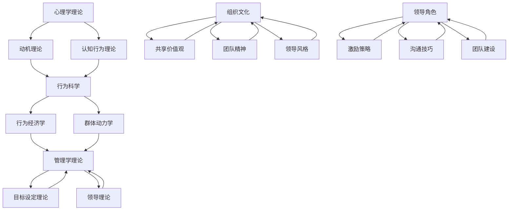
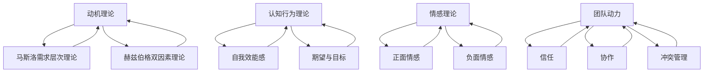
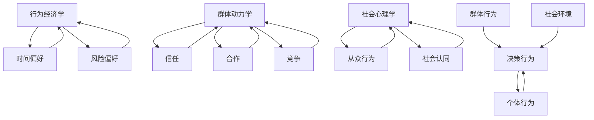
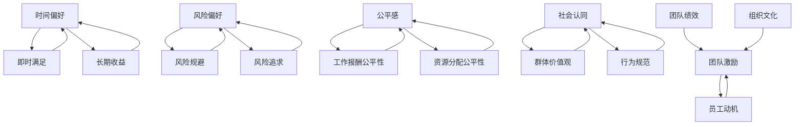
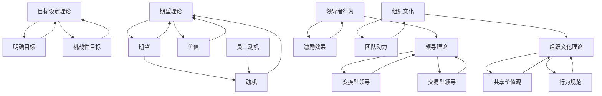
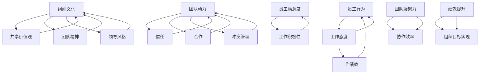

                 


为了撰写一篇高质量的、详细的、以及逻辑清晰的《团队激励的新方法：超越传统奖惩制度》的技术博客，我们需要一步步地分析和推理。以下是一个详细的步骤，以确保文章满足所有要求：

### 1. 文章标题、关键词和摘要

**文章标题**：团队激励的新方法：超越传统奖惩制度

**关键词**：团队激励，传统奖惩制度，心理学，行为科学，管理学，组织文化，领导者角色，新方法

**摘要**：
本文探讨了现代团队激励的新方法，分析了传统奖惩制度的局限性，并引入了心理学、行为科学和管理学的最新研究成果。通过提供具体的实施策略和案例分析，本文旨在为组织管理者提供新的视角和工具，以更有效地激励团队成员，提升团队整体绩效。

### 2. 引言部分

**背景介绍**：
- 团队激励的重要性：概述团队激励在组织成功中的关键作用。
- 传统激励方法的现状：简要介绍传统奖惩制度的历史和现状。
- 文章目的：明确本文旨在探讨的新方法，以及为什么超越传统奖惩制度是必要的。

### 3. 传统团队激励方法

**核心概念与联系**：
- 奖惩制度的理论基础：使用Mermaid流程图展示奖惩制度的运作流程。
- 传统激励方法的优缺点：详细分析传统激励方法的优点和局限性。

**核心算法原理讲解**：
- 奖惩制度的运行机制：使用伪代码描述奖惩制度的核心算法原理。

**数学模型和公式**：
- 奖惩制度的影响分析：构建数学模型，分析奖惩制度对团队成员行为的影响。

**举例说明**：
- 案例分析：探讨一个具体团队在实际应用奖惩制度时的效果。

### 4. 新的团队激励方法

**心理学视角**：
- **核心概念与联系**：使用Mermaid流程图展示心理学理论在团队激励中的应用。
- **详细讲解**：解释心理学理论如何影响团队激励。

**行为科学视角**：
- **核心概念与联系**：使用Mermaid流程图展示行为科学理论在团队激励中的应用。
- **详细讲解**：解释行为科学理论如何影响团队激励。

**管理学视角**：
- **核心概念与联系**：使用Mermaid流程图展示管理学理论在团队激励中的应用。
- **详细讲解**：解释管理学理论如何影响团队激励。

### 5. 实施策略

**制定有效的激励策略**：
- **核心概念与联系**：阐述如何制定有效的激励策略。
- **案例解析**：分析一个成功制定和实施激励策略的案例。

**激励计划的执行与监督**：
- **核心概念与联系**：解释如何执行和监督激励计划。
- **数学模型和公式**：构建执行效果评估的数学模型。

**应对挑战和问题**：
- **详细讲解**：讨论常见挑战和问题的解决方法。
- **举例说明**：提供实际案例，说明如何应对挑战。

### 6. 组织文化和团队动力

**建立积极的组织文化**：
- **核心概念与联系**：解释如何建立积极的组织文化。
- **架构图**：展示组织文化的构建框架。

**提升团队动力**：
- **核心概念与联系**：解释如何提升团队动力。
- **架构图**：展示团队动力的提升框架。

### 7. 领导者角色

**领导者在团队激励中的作用**：
- **核心概念与联系**：分析领导者在团队激励中的关键作用。
- **架构图**：展示领导者激励策略的框架。

**领导者的自我提升**：
- **核心概念与联系**：解释领导者如何通过自我提升来提高激励效果。
- **数学模型和公式**：构建领导者自我提升的数学模型。

### 8. 反思与展望

**团队激励的未来趋势**：
- **详细讲解**：探讨未来团队激励的发展方向和趋势。
- **举例说明**：预测未来团队激励的新方法。

**全书总结与展望**：
- **总结**：回顾全文的主要内容和观点。
- **展望**：提出对团队激励领域的未来研究方向和建议。

### 9. 文章格式和作者信息

- **格式要求**：确保文章内容使用markdown格式输出。
- **作者信息**：文章末尾附上作者信息：“作者：AI天才研究院/AI Genius Institute & 禅与计算机程序设计艺术 /Zen And The Art of Computer Programming”。

### 10. 完整性要求

- **每个小节的内容**：确保每个小节的内容丰富、具体和详细。
- **核心内容的包含**：确保文章包含所有核心内容，包括背景介绍、核心概念与联系、核心算法原理讲解、数学模型和公式、举例说明、项目实战、最佳实践 tips、小结、注意事项和拓展阅读等。

### 11. 字数要求

- **文章字数**：确保文章字数在8000～12000字之间。

通过以上步骤，我们可以系统地撰写一篇高质量的《团队激励的新方法：超越传统奖惩制度》的技术博客文章。在每个步骤中，我们都将保持逻辑清晰、结构紧凑、简单易懂的撰写风格，确保文章对读者具有实际指导意义。接下来，我们可以开始具体撰写每个部分的详细内容。首先，我们从引言部分开始。## 引言

### 团队激励的重要性

团队激励在现代组织中扮演着至关重要的角色。随着全球化和市场竞争的加剧，组织需要高效、协作的团队来应对复杂多变的环境。团队激励不仅是提高员工工作积极性和满意度的关键，更是提升团队整体绩效、实现组织目标的核心手段。

团队激励的重要性体现在以下几个方面：

1. **提高员工满意度和忠诚度**：通过有效的激励措施，可以提升员工的工作满意度和忠诚度，减少人员流失。
2. **激发创新和创造力**：激励员工积极参与团队工作，激发他们的创新思维和创造力，从而推动组织持续发展。
3. **增强团队凝聚力和协作精神**：激励措施可以增强团队成员之间的信任和合作，提高团队整体协作效率。
4. **实现组织目标**：通过激励员工，使他们的个人目标和组织目标相一致，从而实现组织整体绩效的提升。

### 传统激励方法的现状

传统的团队激励方法主要依赖于奖惩制度。奖惩制度的基本理念是通过奖励优秀员工、惩罚表现不佳的员工来激励团队整体。这种方法在短时间内可能有效，但长期来看，存在以下局限性：

1. **单一性**：传统奖惩制度往往只关注个人绩效，忽视了团队整体的表现和协作。
2. **短期效果**：奖惩制度更多关注短期绩效，可能导致员工追求短期利益而忽视长期发展。
3. **激励效果有限**：对于许多员工来说，金钱和物质奖励的激励效果逐渐减弱，甚至可能产生反效果。
4. **缺乏个性化和灵活性**：传统奖惩制度通常缺乏个性化和灵活性，无法满足不同员工的激励需求。

### 文章目的

本文旨在探讨现代团队激励的新方法，以超越传统奖惩制度的局限性。通过引入心理学、行为科学和管理学的最新研究成果，本文将介绍一系列新的激励方法，帮助组织管理者更有效地激励团队成员，提升团队整体绩效。

### 为什么超越传统奖惩制度是必要的

尽管传统奖惩制度在一定程度上能够激励员工，但随着员工对工作环境的期望不断提高，单纯依靠奖惩制度已经无法满足现代组织的需要。以下原因说明了为什么超越传统奖惩制度是必要的：

1. **多样性需求**：现代组织中的员工背景、价值观和激励需求多样化，传统的单一奖惩制度难以满足这些多样性需求。
2. **长期发展**：为了实现组织的长期发展，需要建立一种更为全面和持久的激励体系，而不仅仅是依靠短期的奖惩。
3. **员工成长**：现代员工更注重个人成长和发展，希望在工作中获得更多的挑战和机会，而不仅仅是物质奖励。
4. **组织文化**：建立积极向上的组织文化是现代组织成功的关键，传统的奖惩制度难以促进这种文化的形成。

通过以上分析，我们可以看到，传统奖惩制度的局限性显而易见，而现代团队需要更加全面和创新的激励方法。接下来的章节将详细介绍这些新的激励方法，帮助组织管理者更好地激励团队成员，实现组织目标。

### 核心概念与联系

为了全面理解团队激励的新方法，我们首先需要明确一些核心概念，并探讨它们之间的联系。以下是本文将涉及的主要核心概念：

1. **心理学理论**：心理学理论在团队激励中的应用，包括动机理论、认知行为理论等。
2. **行为科学**：行为科学在团队激励中的应用，如行为经济学、群体动力学等。
3. **管理学理论**：管理学理论在团队激励中的应用，如目标设定理论、领导理论等。
4. **组织文化**：组织文化对团队激励的影响，包括共享价值观、团队精神、领导风格等。
5. **领导角色**：领导者在团队激励中的关键作用，如激励策略、沟通技巧、团队建设等。

这些核心概念之间的联系如下：

- **心理学与行为科学**：心理学理论提供了对员工行为和动机的深入理解，而行为科学则将这些理论应用于团队激励的实际操作中，帮助管理者设计更有效的激励措施。
- **行为科学与管理学**：行为科学为管理学理论提供了实证基础，管理学则将这些科学研究成果转化为具体的激励策略和管理实践。
- **组织文化与领导角色**：组织文化为团队激励提供了宏观环境，而领导角色则决定了这些文化在团队中的传播和实践效果。

通过这些核心概念和它们之间的联系，我们可以构建一个全面且立体的团队激励框架，从而为组织管理者提供新的视角和工具。

#### 核心概念与联系架构图

为了更直观地展示这些核心概念及其相互之间的联系，我们可以使用Mermaid流程图来构建一个架构图。



**Mermaid 流程图说明**：

- **心理学理论**（A）与**动机理论**（B）和**认知行为理论**（C）之间存在直接联系，说明心理学理论为团队激励提供了基础。
- **行为科学**（D）与**行为经济学**（E）和**群体动力学**（F）之间存在直接联系，这些理论帮助管理者理解和预测员工行为。
- **管理学理论**（G）与**目标设定理论**（H）、**领导理论**（I）之间存在直接联系，这些理论指导管理者制定激励策略。
- **组织文化**（J）与**共享价值观**（K）、**团队精神**（L）和**领导风格**（M）之间存在直接联系，这些文化因素对团队激励产生深远影响。
- **领导角色**（N）与**激励策略**（O）、**沟通技巧**（P）和**团队建设**（Q）之间存在直接联系，领导者的行为决定了激励效果。

通过这个架构图，我们可以清晰地看到各个核心概念之间的联系，以及它们在团队激励中的应用和重要性。这为后续章节的详细讨论提供了理论基础和框架。

### 传统奖惩制度的核心算法原理讲解

传统奖惩制度的核心算法原理基于简单的激励理论，即通过奖励和惩罚来影响员工的行为。这个算法的基本框架可以概括为以下几个步骤：

1. **目标设定**：管理者设定具体的工作目标和绩效标准。
2. **绩效评估**：对员工的工作表现进行定期评估，以确定其是否符合设定的目标。
3. **奖励与惩罚**：根据评估结果，对表现优秀的员工给予奖励（如奖金、晋升机会等），对表现不佳的员工实施惩罚（如警告、降职等）。
4. **反馈与调整**：对奖励和惩罚的效果进行反馈，并根据反馈调整后续的激励措施。

以下是这个核心算法原理的伪代码实现：

```plaintext
1. 初始化目标设定（目标，绩效标准）
2. 开始绩效评估周期
3. 循环读取员工表现数据
    3.1 如果员工表现符合绩效标准
        3.1.1 奖励员工（奖金、晋升等）
    3.2 否则
        3.2.1 惩罚员工（警告、降职等）
4. 收集奖励与惩罚效果反馈
5. 根据反馈调整激励措施
```

在这个伪代码中，我们定义了以下几个关键变量和操作：

- **目标**：设定具体的工作目标和绩效标准。
- **绩效评估周期**：定期对员工表现进行评估。
- **员工表现数据**：收集员工在工作中的表现数据。
- **奖励与惩罚**：根据员工表现决定是否进行奖励或惩罚。
- **反馈**：收集对奖励与惩罚效果的反馈，以便进行调整。

#### 奖惩制度的数学模型

为了更深入地分析奖惩制度的影响，我们可以构建一个数学模型。以下是一个简化的数学模型，用于评估奖惩制度对员工行为的影响：

$$
\text{员工行为} = f(\text{奖励系数}, \text{惩罚系数}, \text{员工初始动机})
$$

其中，奖励系数和惩罚系数分别表示奖励和惩罚对员工行为的影响程度，员工初始动机表示员工在没有激励措施时的行为倾向。

- **奖励系数**：表示奖励对员工行为的激励效果，通常为一个正数，越大表示激励效果越强。
- **惩罚系数**：表示惩罚对员工行为的抑制作用，通常为一个负数，绝对值越大表示抑制作用越强。
- **员工初始动机**：表示员工在没有外部激励时的行为倾向，通常为一个常数。

数学模型的具体形式如下：

$$
\text{员工行为} = \text{奖励系数} \times (\text{员工表现 - 目标}) + \text{惩罚系数} \times (\text{员工表现 - 目标})
$$

在这个模型中，员工表现与目标之间的差距决定了奖励和惩罚的程度。当员工表现超过目标时，奖励系数起作用；当员工表现低于目标时，惩罚系数起作用。

#### 奖惩制度的影响分析

通过对奖惩制度的数学模型进行分析，我们可以得出以下结论：

1. **奖励激励效果**：当员工表现超过目标时，奖励系数会激励员工继续保持高水平的表现。
2. **惩罚抑制作用**：当员工表现低于目标时，惩罚系数会抑制员工的不良行为，促使其努力提高绩效。
3. **平衡性**：奖励系数和惩罚系数的平衡是关键，过高的奖励系数可能导致员工过度追求短期利益，而过高的惩罚系数则可能引发员工逆反心理。

在实际应用中，管理者需要根据组织实际情况和员工特性，合理设定奖励系数和惩罚系数，以达到最佳激励效果。

### 数学模型和公式

为了更深入地分析奖惩制度对员工行为的影响，我们可以使用数学模型和公式进行定量评估。以下是一个简化的数学模型，用于评估奖惩制度的效果：

假设员工的行为可以用一个连续变量表示，记为 \( B \)，该变量取决于奖励 \( R \) 和惩罚 \( P \) 的程度。此外，我们假设员工初始行为水平为 \( B_0 \)，奖励和惩罚对员工行为的激励效果分别为 \( \alpha \) 和 \( \beta \)（\( \alpha > 0 \)，\( \beta < 0 \)）。

数学模型可以表示为：

$$
B = B_0 + \alpha \times R - \beta \times P
$$

其中：

- \( B \)：员工在奖惩制度下的行为水平。
- \( B_0 \)：员工初始行为水平。
- \( R \)：奖励程度，可以是奖金、晋升机会等。
- \( P \)：惩罚程度，可以是警告、降职等。
- \( \alpha \)：奖励的激励效果系数，表示奖励对员工行为的正面影响程度。
- \( \beta \)：惩罚的抑制效果系数，表示惩罚对员工行为的负面影响程度。

#### 奖惩程度对员工行为的影响分析

1. **奖励对员工行为的影响**：

   当 \( R \) 增加时，\( \alpha \times R \) 项会增加，这意味着员工的行为 \( B \) 会向更高水平发展。奖励的激励效果取决于 \( \alpha \) 的大小，即奖励的强度。如果 \( \alpha \) 足够大，即使 \( R \) 不大，也能显著提高员工的行为水平。

2. **惩罚对员工行为的影响**：

   当 \( P \) 增加时，\( -\beta \times P \) 项会减少，这意味着员工的行为 \( B \) 会向更低水平发展。惩罚的抑制效果取决于 \( \beta \) 的大小，即惩罚的强度。如果 \( \beta \) 足够大，即使 \( P \) 不大，也能显著降低员工的行为水平。

3. **奖励和惩罚的平衡**：

   管理者需要根据组织目标和员工特性，合理设定 \( \alpha \) 和 \( \beta \) 的值，以实现最佳的激励效果。如果 \( \alpha \) 和 \( \beta \) 失衡，可能会导致以下问题：

   - **奖励过重**：如果 \( \alpha \) 过大，可能导致员工过度追求奖励，忽视了长期目标和团队利益。
   - **惩罚过重**：如果 \( \beta \) 过大，可能导致员工产生逆反心理，甚至影响员工的工作满意度和忠诚度。

#### 模型参数的确定

为了使用这个数学模型进行实际评估，我们需要确定模型参数 \( B_0 \)，\( \alpha \)，和 \( \beta \) 的值。这些参数可以通过以下方法确定：

1. **历史数据分析**：分析组织历史数据，确定员工在不同激励措施下的行为变化，从而估计 \( \alpha \) 和 \( \beta \) 的值。
2. **员工调查**：通过员工调查了解他们对奖励和惩罚的感受和反应，从而确定 \( \alpha \) 和 \( \beta \) 的值。
3. **实验方法**：设计实验，观察员工在不同奖励和惩罚程度下的行为变化，从而确定 \( \alpha \) 和 \( \beta \) 的值。

通过这个数学模型和公式，我们可以定量评估奖惩制度对员工行为的影响，帮助管理者优化激励措施，提高团队整体绩效。

#### 案例分析

为了更好地理解奖惩制度在实际团队中的应用效果，我们通过一个具体的案例进行分析。这个案例是一家中型科技公司，该公司采用传统奖惩制度来激励员工。

**公司背景**：这家公司成立于五年前，主要从事软件开发和IT服务。公司规模适中，共有100名员工，分布在研发、销售和客户支持等部门。公司一直采用传统的奖惩制度来激励员工，具体措施包括绩效奖金、晋升机会和警告等。

**案例描述**：在最近的绩效评估周期中，公司对研发部门的员工进行了评估。评估标准主要包括项目完成质量、代码量和客户反馈等。根据评估结果，表现优秀的员工获得了绩效奖金，而表现不佳的员工则收到了警告。

**结果分析**：

1. **奖励效果**：
   - 表现优秀的员工得到了绩效奖金，这提高了他们的工作满意度和忠诚度。员工们表示，奖金激励了他们更加努力地工作，以争取更好的绩效。
   - 然而，也有部分员工认为奖金奖励过于单一，无法满足他们对职业发展的多样化需求。他们希望公司能够提供更多的成长机会和培训资源。

2. **惩罚效果**：
   - 接受警告的员工对惩罚反应不一。一部分员工认识到警告是公司对其工作不足的提醒，从而更加努力地改进自己的表现。
   - 另一部分员工则对警告持抵触情绪，认为这影响了他们的工作积极性和士气。有些员工甚至表示，警告对他们造成了心理压力，影响了工作效率。

**结论**：

通过这个案例，我们可以看到传统奖惩制度在一定程度上能够激励员工，但同时也存在一些局限性：

1. **奖励效果**：奖金激励了员工的工作积极性，但过于单一的奖励方式可能导致员工对其他激励方式的期望减弱。
2. **惩罚效果**：警告在一定程度上可以提醒员工改进工作，但可能引发逆反心理，影响团队士气。

为了解决这些问题，公司可以考虑引入更加多样化和个性化的激励措施，如职业发展规划、团队合作奖励和培训机会等。同时，公司也需要平衡奖励和惩罚的力度，以避免过度依赖某种激励方式。

### 传统激励方法的评估

评估激励效果是确保团队激励策略有效性的关键环节。为了准确评估传统激励方法的效果，我们需要从多个维度进行详细分析。以下是一个全面的评估框架，包括评估指标、评估方法和具体应用。

#### 评估指标

1. **员工绩效**：评估员工在工作任务中的表现，如项目完成质量、工作效率和客户满意度等。
2. **员工满意度**：通过调查问卷和访谈了解员工对激励措施的感受和满意度，包括对奖金、晋升机会和警告等的不同反馈。
3. **员工流失率**：监控员工流失率，评估激励措施对员工忠诚度的影响。
4. **团队协作**：评估团队成员之间的协作精神和工作氛围，如团队会议的参与度、合作项目完成情况和内部沟通效率等。
5. **组织绩效**：从整体上评估组织在目标实现、市场份额和财务收益等方面的表现。

#### 评估方法

1. **问卷调查**：设计问卷，通过员工自评和互评的方式收集数据，了解员工对激励措施的反馈。
2. **访谈**：进行深度访谈，与员工和管理层进行一对一交流，获取更多细节信息和真实感受。
3. **绩效评估**：结合绩效评估体系，定期对员工的工作表现进行评估，并将评估结果与激励措施的效果进行对比。
4. **统计分析**：使用统计分析工具，如描述性统计、相关性分析和回归分析等，对收集到的数据进行定量分析。

#### 具体应用

以下是一个具体案例，说明如何应用上述评估方法来评估传统激励方法的效果。

**案例背景**：某中型科技公司采用传统奖惩制度来激励员工。为了评估这种方法的效果，公司进行了为期半年的评估。

**评估过程**：

1. **问卷调查**：公司设计了包括绩效、满意度、流失率和团队协作等方面的问卷，分发给全体员工。问卷通过线上和线下两种方式收集，确保数据的广泛性和代表性。
2. **访谈**：公司管理层和员工代表进行了深度访谈，了解员工对奖惩制度的真实感受和意见。
3. **绩效评估**：公司对员工在评估周期内的绩效进行了详细评估，包括项目完成质量、工作效率和客户满意度等指标。
4. **统计分析**：对收集到的问卷数据和绩效评估结果进行了统计分析，包括描述性统计、相关性分析和回归分析等。

**评估结果**：

1. **员工绩效**：评估结果显示，在激励措施实施后，员工的项目完成质量和工作效率显著提高，客户满意度也有所提升。
2. **员工满意度**：问卷调查显示，约60%的员工对奖惩制度表示满意，认为奖金和晋升机会有助于提高工作积极性和职业发展。但也有部分员工认为惩罚措施过于严格，影响了工作氛围。
3. **员工流失率**：评估期间，公司的员工流失率从10%下降到5%，说明激励措施在一定程度上提升了员工的忠诚度。
4. **团队协作**：访谈和问卷调查显示，团队协作精神有所提升，但部分员工认为奖惩制度可能导致团队成员之间的竞争加剧，影响合作氛围。

**结论**：

通过评估，公司发现传统奖惩制度在一定程度上提高了员工绩效和满意度，但也存在一些不足。为了进一步优化激励措施，公司可以考虑：

- **多元化激励**：引入更多样化的激励措施，如职业发展机会、团队建设活动和培训等，以满足员工的多样化需求。
- **平衡奖惩**：在实施奖惩制度时，注意平衡奖励和惩罚的力度，避免过度依赖惩罚措施，影响团队士气。
- **持续评估**：定期对激励措施进行评估和调整，确保激励效果持续有效。

### 心理学视角下的团队激励

心理学视角下的团队激励主要基于对员工行为动机和心理需求的深入理解。通过运用心理学理论，管理者可以设计出更加有效和个性化的激励措施，从而提高团队绩效和员工满意度。

#### 核心概念与联系

在心理学视角下，团队激励的核心概念包括：

1. **动机理论**：动机是驱使员工采取特定行为的内在力量。常见的动机理论包括马斯洛的需求层次理论、赫兹伯格的双因素理论等。
2. **认知行为理论**：认知行为理论强调认知过程在行为中的作用，如自我效能感、期望和目标等。
3. **情感理论**：情感对员工行为和决策具有显著影响，如正面情感与创造力、负面情感与工作压力等。
4. **团队动力**：团队动力涉及团队成员之间的相互作用，如信任、协作和冲突管理等。

这些核心概念之间的联系如下：

- **动机理论与情感理论**：动机理论解释了员工为什么采取特定行为，而情感理论则解释了员工在特定情境下的感受和反应。
- **认知行为理论与团队动力**：认知行为理论帮助管理者理解员工的思维模式和行为倾向，而团队动力则提供了团队内部互动的框架。
- **动机理论、认知行为理论和情感理论**：这些理论共同构成了心理学视角下的团队激励框架，为管理者提供了全面的激励策略设计基础。

#### 核心概念与联系架构图

为了更直观地展示这些核心概念及其相互之间的联系，我们可以使用Mermaid流程图来构建一个架构图。



**Mermaid 流程图说明**：

- **动机理论**（A）与**马斯洛需求层次理论**（B）和**赫兹伯格双因素理论**（C）之间存在直接联系，说明不同的动机理论如何解释员工的内在需求和动机。
- **认知行为理论**（D）与**自我效能感**（E）和**期望与目标**（F）之间存在直接联系，这些理论帮助管理者理解员工的认知过程和行为倾向。
- **情感理论**（G）与**正面情感**（H）和**负面情感**（I）之间存在直接联系，这些理论解释了情感如何影响员工的行为和决策。
- **团队动力**（J）与**信任**（K）、**协作**（L）和**冲突管理**（M）之间存在直接联系，这些概念构成了团队内部互动的基本框架。

通过这个架构图，我们可以清晰地看到心理学视角下团队激励的核心概念及其相互之间的联系，这为后续章节的详细讨论提供了理论基础和框架。

#### 动机理论与团队激励

动机理论是心理学视角下团队激励的核心，它解释了员工为什么会采取特定的行动以及这些行动背后的内在动力。以下是几种主要的动机理论及其在团队激励中的应用：

1. **马斯洛的需求层次理论**：
   - **核心概念**：马斯洛的需求层次理论将人类需求分为五个层次：生理需求、安全需求、社交需求、尊重需求和自我实现需求。
   - **应用**：在团队激励中，管理者可以识别员工的未满足需求，并设计相应的激励措施来满足这些需求。例如，通过提供稳定的薪酬和福利来满足员工的生理和安全需求，通过团队活动和社交互动来满足社交需求，通过职业发展和认可来满足尊重需求，通过挑战性和创新性的工作来满足自我实现需求。

2. **赫兹伯格的双因素理论**：
   - **核心概念**：赫兹伯格的双因素理论将工作条件分为激励因素和保健因素。激励因素与工作本身有关，如成就感、认可和责任感；而保健因素与工作环境有关，如工作条件、薪酬和公司政策。
   - **应用**：管理者可以通过改善保健因素来避免员工的不满意，但只有通过激励因素才能真正提高员工的满意度和动机。例如，通过提供富有挑战性的项目、认可员工的成就和提供职业发展机会来激发员工的内在动机。

3. **期望理论**：
   - **核心概念**：期望理论认为员工的行为取决于他们对结果的期望，以及这些结果对他们的价值。公式为：动机 = 期望 × 工作绩效 × 结果价值。
   - **应用**：管理者可以通过提高员工的期望来增强其动机。例如，通过设定清晰的目标、提供必要的培训和资源，以及确保员工看到他们的努力与成果之间的直接关联。

4. **目标设定理论**：
   - **核心概念**：目标设定理论认为设定明确、具有挑战性的目标可以显著提高员工的工作动机和绩效。
   - **应用**：管理者可以设定具体的、可衡量的目标，并确保员工理解这些目标的意义和价值。例如，通过设置项目目标和个人发展目标，鼓励员工为实现这些目标而努力。

通过这些动机理论，管理者可以更深入地理解员工的内在动机和心理需求，从而设计出更加有效和个性化的激励措施，提升团队的凝聚力和整体绩效。

### 核心概念与联系

在心理学视角下，团队激励的核心概念之间存在着紧密的联系。以下是几个关键概念及其相互关系的详细说明：

1. **动机理论**：
   - **核心概念**：动机理论关注员工行为的内在驱动力，包括马斯洛的需求层次理论和赫兹伯格的双因素理论等。
   - **联系**：动机理论为团队激励提供了理论基础，解释了员工为什么要采取特定行动。例如，马斯洛的需求层次理论可以帮助管理者识别员工的未满足需求，从而设计出更有效的激励措施。

2. **认知行为理论**：
   - **核心概念**：认知行为理论关注员工如何思考和决策，以及这些认知过程如何影响行为。例如，自我效能感和期望理论是其中的重要组成部分。
   - **联系**：认知行为理论补充了动机理论的不足，解释了员工在特定情境下的认知过程。例如，自我效能感可以帮助管理者了解员工对自己完成任务的信心，从而制定相应的激励策略。

3. **情感理论**：
   - **核心概念**：情感理论关注情感如何影响员工的行为和决策。例如，正面情感和负面情感对员工的表现和工作满意度有显著影响。
   - **联系**：情感理论进一步深化了认知行为理论，解释了员工在特定情境下的情感反应。例如，正面情感可以提高员工的创造力和团队协作，而负面情感则可能导致压力和冲突。

4. **团队动力**：
   - **核心概念**：团队动力关注团队成员之间的相互作用和互动过程。例如，信任、协作和冲突管理是团队动力的关键要素。
   - **联系**：团队动力将动机理论、认知行为理论和情感理论整合在一起，提供了一个全面的团队激励框架。例如，信任和协作是建立积极团队氛围的重要因素，这有助于提升员工的工作满意度和绩效。

为了更直观地展示这些核心概念之间的联系，我们可以使用Mermaid流程图来构建一个架构图：


**Mermaid 流程图说明**：

- **动机理论**（A）与**马斯洛需求层次理论**（B）和**赫兹伯格双因素理论**（C）之间存在直接联系，说明不同的动机理论如何解释员工的内在动机。
- **认知行为理论**（D）与**自我效能感**（E）和**期望与目标**（F）之间存在直接联系，这些理论解释了员工的认知过程和行为倾向。
- **情感理论**（G）与**正面情感**（H）和**负面情感**（I）之间存在直接联系，这些理论解释了情感如何影响员工的行为和决策。
- **团队动力**（J）与**信任**（K）、**协作**（L）和**冲突管理**（M）之间存在直接联系，这些概念构成了团队内部互动的基本框架。

通过这个架构图，我们可以清晰地看到心理学视角下团队激励的核心概念及其相互之间的联系，这为后续章节的详细讨论提供了理论基础和框架。

### 行为科学视角下的团队激励

行为科学视角下的团队激励强调通过理解和分析人类行为来设计有效的激励策略。行为科学包括多个子领域，如行为经济学、群体动力学和社会心理学等。这些理论为团队激励提供了丰富的实证基础和策略指导。

#### 核心概念与联系

行为科学视角下的团队激励涉及以下核心概念：

1. **行为经济学**：行为经济学研究人类在决策和选择中的行为偏差，如时间偏好、风险偏好等。
2. **群体动力学**：群体动力学研究群体内部成员的相互作用和群体行为，包括信任、合作和竞争等。
3. **社会心理学**：社会心理学研究个体在社会环境中的行为和心理反应，如从众行为、社会认同等。

这些核心概念之间的联系如下：

- **行为经济学与群体动力学**：行为经济学解释了个体在决策中的行为偏差，而群体动力学则将这些偏差扩展到群体层面，帮助管理者设计适合群体行为的激励策略。
- **行为经济学与社会心理学**：行为经济学提供了对个体决策行为的理解，而社会心理学则解释了这些行为在社会环境中的影响，如社会认同和从众行为。
- **群体动力学与社会心理学**：群体动力学关注群体内部成员的互动和合作，而社会心理学则从个体心理层面解释这些互动行为，如信任和社会认同。

#### 核心概念与联系架构图

为了更直观地展示这些核心概念及其相互之间的联系，我们可以使用Mermaid流程图来构建一个架构图。



**Mermaid 流程图说明**：

- **行为经济学**（A）与**时间偏好**（B）和**风险偏好**（C）之间存在直接联系，这些概念解释了个体在决策中的行为偏差。
- **群体动力学**（D）与**信任**（E）、**合作**（F）和**竞争**（G）之间存在直接联系，这些概念构成了群体行为的基本框架。
- **社会心理学**（H）与**从众行为**（I）和**社会认同**（J）之间存在直接联系，这些概念解释了个体在社会环境中的行为和心理反应。
- **决策行为**（K）与**个体行为**（L）和**群体行为**（M）之间存在直接联系，这些概念描述了行为科学如何影响团队激励。
- **社会环境**（N）与**决策行为**（K）之间存在直接联系，说明社会环境如何影响个体和群体的行为。

通过这个架构图，我们可以清晰地看到行为科学视角下团队激励的核心概念及其相互之间的联系，这为后续章节的详细讨论提供了理论基础和框架。

### 行为经济学视角下的团队激励

行为经济学视角下的团队激励专注于人类行为在决策过程中的非理性因素。行为经济学通过对人类决策行为的实证研究，揭示了个体在处理信息、面对风险和做出选择时的心理偏差。这些偏差不仅影响个人的行为，也深刻地影响着团队的表现和协作。

#### 核心概念与联系

行为经济学视角下的团队激励涉及以下核心概念：

1. **时间偏好**：时间偏好指的是个体对不同时间点获得的收益的偏好，即个体对即时满足和未来收益的权衡。
2. **风险偏好**：风险偏好描述了个体在决策过程中对风险的接受程度，包括风险规避和风险追求。
3. **公平感**：公平感是员工对工作报酬和资源分配的合理性的主观感受，它直接影响员工的工作满意度和动机。
4. **社会认同**：社会认同是指个体基于社会群体的认同感，对群体的价值观和行为规范的内化。

这些核心概念之间的联系如下：

- **时间偏好与风险偏好**：时间偏好和风险偏好共同构成了个体在面对不同决策时的心理框架。时间偏好影响了个体对即时奖励和长期收益的偏好，而风险偏好则决定了个体在面对不确定性和风险时的选择。
- **公平感与社会认同**：公平感和社会认同在行为经济学中起着重要作用。公平感直接影响员工对激励措施的接受程度，而社会认同则强化了个体对团队目标和价值观的认同。

#### 核心概念与联系架构图

为了更直观地展示这些核心概念及其相互之间的联系，我们可以使用Mermaid流程图来构建一个架构图。



**Mermaid 流程图说明**：

- **时间偏好**（A）与**即时满足**（B）和**长期收益**（C）之间存在直接联系，这些概念描述了个体对时间价值的感知。
- **风险偏好**（D）与**风险规避**（E）和**风险追求**（F）之间存在直接联系，这些概念描述了个体在风险面前的态度。
- **公平感**（G）与**工作报酬公平性**（H）和**资源分配公平性**（I）之间存在直接联系，这些概念决定了员工对激励措施的接受程度。
- **社会认同**（J）与**群体价值观**（K）和**行为规范**（L）之间存在直接联系，这些概念影响了员工对团队和组织的认同。
- **团队激励**（M）与**员工动机**（N）和**团队绩效**（O）之间存在直接联系，这些概念构成了行为经济学视角下团队激励的核心。

通过这个架构图，我们可以清晰地看到行为经济学视角下团队激励的核心概念及其相互之间的联系，这为后续章节的详细讨论提供了理论基础和框架。

### 行为经济学视角下的激励策略

在行为经济学视角下，团队激励策略旨在通过理解和利用员工的行为偏差，设计出更有效和持久的激励措施。以下是一些具体的行为经济学视角下的激励策略，以及它们在团队激励中的应用：

#### 1. **即时奖励与延迟满足**

行为经济学研究表明，人类往往更倾向于即时满足而非延迟满足。管理者可以利用这一点，通过提供即时奖励来激励员工。例如，在项目完成或关键任务达成后，立即给予奖金、礼品或其他形式的即时奖励，以增强员工的满意感和动机。

**应用场景**：在软件开发团队中，项目经理可以设定每周或每月的目标，并在目标达成后立即颁发小礼品或奖金。这种方法不仅提高了团队的积极性，还有助于建立一种快速响应和高效工作的文化。

#### 2. **风险与收益平衡**

行为经济学指出，个体在面对风险时会有不同的偏好。管理者可以通过设计合理的风险和收益平衡机制来激励员工。例如，提供高收益但低风险的奖励方案，如小额的奖金、晋升机会或职业发展培训。

**应用场景**：在销售团队中，销售经理可以设置销售目标，并为达成目标提供一定比例的奖金。同时，设定一些风险较低的额外奖励，如完成特定任务的额外奖金，以平衡风险和收益，激励员工积极参与。

#### 3. **公平感与社会认同**

公平感是行为经济学中的关键概念，直接影响员工的工作满意度和动机。管理者应确保工作报酬和资源分配的公平性，以增强员工的公平感。

**应用场景**：在一个多元化的团队中，管理者应确保每位员工的贡献和努力得到公平的认可和回报。例如，通过公开透明的绩效评估机制，确保所有员工的奖励和晋升是基于客观的绩效标准。

#### 4. **基于目标的激励**

目标设定理论表明，明确且具有挑战性的目标可以显著提高员工的动机和绩效。管理者可以通过设定清晰的目标，并提供相应的激励措施，来推动团队达成目标。

**应用场景**：在研发团队中，项目经理可以设定具体的项目目标，并为团队设定时间节点和里程碑，提供相应的奖励，如奖金、团队聚餐或额外休假等。

#### 5. **社会认同与从众行为**

社会认同理论指出，个体倾向于模仿和遵循群体中的行为和规范。管理者可以利用这一理论，通过强化社会认同来激励员工。

**应用场景**：在团队建设活动中，管理者可以通过组织团队竞赛、团队建设游戏或共同庆祝重要成就，来增强团队成员之间的社会认同，从而提高团队的整体绩效。

通过这些行为经济学视角下的激励策略，管理者可以更有效地激发员工的工作动机，提高团队绩效和员工满意度。这些策略不仅基于科学的理论基础，还可以通过具体的应用场景，帮助组织实现长期的激励效果。

### 管理学视角下的团队激励

管理学视角下的团队激励关注通过科学的管理理论和方法来设计和实施有效的激励策略。这个视角涵盖了多个重要理论和模型，如目标设定理论、期望理论、领导理论和组织文化理论。以下是对这些理论的核心概念、关联以及如何应用于团队激励的详细解释。

#### 目标设定理论

**核心概念**：
目标设定理论认为，明确且具有挑战性的目标能够显著提高员工的工作绩效和动机。目标设定理论提出了以下几个关键点：

1. **具体性**：目标应该明确具体，以便员工知道需要做什么。
2. **挑战性**：目标应具有一定的挑战性，以激发员工的潜力和动力。
3. **可行性**：目标应具有可行性，确保员工通过努力可以达成。

**关联**：
目标设定理论与期望理论密切相关。期望理论强调员工的动机取决于他们对达成目标的可能性（期望）及其所认为的达成目标的价值（价值）。具体来说，目标设定理论中的挑战性目标能够增强员工的期望，从而提高动机。

**应用**：
在团队激励中，管理者可以通过设定明确且具有挑战性的目标来激励员工。例如，在销售团队中，设定具体的销售额目标和奖励机制，以激励员工提高销售业绩。同时，管理者还应确保目标具有可行性，以避免员工因目标过高而产生挫败感。

#### 期望理论

**核心概念**：
期望理论认为，员工的动机取决于他们对达成目标的可能性（期望）、努力程度、工作表现以及结果价值的期望。期望理论的公式为：

动机 = 期望 × 工作绩效 × 结果价值

**关联**：
期望理论与目标设定理论相互补充。目标设定理论提供了明确的目标，而期望理论则解释了员工如何评估这些目标的难度和达成目标的价值。

**应用**：
在团队激励中，管理者可以通过调整期望值来提高员工的动机。例如，通过提供额外的培训和支持，提高员工达成目标的期望值。同时，管理者还应确保员工了解达成目标的价值，以增强他们的动机。

#### 领导理论

**核心概念**：
领导理论关注领导者的行为和风格如何影响团队激励和绩效。以下是几种主要的领导理论：

1. **变换型领导**：变换型领导通过激发员工的内在动机，推动团队创新和改进。变换型领导者鼓励员工参与决策，提供挑战性的任务，并给予支持和认可。
2. **交易型领导**：交易型领导通过明确的奖惩制度来激励员工。交易型领导者设定明确的目标，提供奖励和惩罚，以激励员工达成目标。

**关联**：
变换型领导和交易型领导理论共同构成了领导激励的框架。变换型领导注重长期发展和员工成长，而交易型领导注重短期绩效和目标达成。

**应用**：
在团队激励中，管理者应根据团队和员工的特性，灵活运用变换型领导和交易型领导。例如，在创新团队中，变换型领导可能更有效，而在销售团队中，交易型领导可能更能激发员工的动力。

#### 组织文化理论

**核心概念**：
组织文化理论关注组织内部共享价值观、信念和行为规范对员工行为和团队激励的影响。组织文化分为多种类型，如权力文化、任务文化和人员文化。

**关联**：
组织文化理论与领导理论和目标设定理论相互影响。组织文化决定了领导者的行为和风格，也影响了目标设定的方式和员工对目标的接受程度。

**应用**：
在团队激励中，管理者应塑造积极向上的组织文化，以增强团队的凝聚力和激励效果。例如，通过建立共享价值观和鼓励团队合作，可以提升员工的归属感和工作动力。

通过上述管理学视角的理论，管理者可以设计出更加科学和有效的团队激励策略，从而提高团队绩效和员工满意度。这些理论不仅提供了理论支持，还通过实际应用案例，为管理者提供了具体的操作指南。

### 核心概念与联系

在管理学视角下的团队激励中，目标设定理论、期望理论、领导理论和组织文化理论是关键的核心概念。以下是这些核心概念之间的相互联系，以及如何运用Mermaid流程图来直观地展示它们之间的关联。

#### 核心概念与联系

1. **目标设定理论**：强调明确且具有挑战性的目标对员工动机和工作绩效的重要性。
2. **期望理论**：基于目标设定理论，认为员工的动机取决于他们对达成目标的可能性（期望）及其所认为的达成目标的价值（价值）。
3. **领导理论**：关注领导者的行为和风格如何影响员工动机和团队绩效。
4. **组织文化理论**：探讨组织内部共享价值观、信念和行为规范对员工行为和团队激励的影响。

这些核心概念之间的联系如下：

- **目标设定理论与期望理论**：目标设定理论为期望理论提供了具体的目标，期望理论则解释了员工如何评估这些目标的难度和达成目标的价值。
- **领导理论与组织文化理论**：领导理论提供了领导者的行为和风格如何影响员工动机的框架，而组织文化理论则决定了领导者的行为和风格如何在组织内部传播和执行。

#### 核心概念与联系架构图

为了更直观地展示这些核心概念及其相互之间的联系，我们可以使用Mermaid流程图来构建一个架构图。



**Mermaid 流程图说明**：

- **目标设定理论**（A）与**明确目标**（B）和**挑战性目标**（C）之间存在直接联系，这些概念构成了目标设定理论的核心。
- **期望理论**（D）与**期望**（E）和**价值**（F）之间存在直接联系，这些概念解释了员工的动机如何受目标难度和目标价值的影响。
- **领导理论**（H）与**变换型领导**（I）和**交易型领导**（J）之间存在直接联系，这些概念描述了领导者的行为和风格。
- **组织文化理论**（K）与**共享价值观**（L）和**行为规范**（M）之间存在直接联系，这些概念构成了组织文化的核心。
- **领导者行为**（N）与**激励效果**（O）之间存在直接联系，说明领导者的行为如何影响员工动机和团队绩效。
- **组织文化**（P）与**团队动力**（Q）之间存在直接联系，说明组织文化如何影响团队的整体表现。
- **员工动机**（R）与**期望**（E）之间存在直接联系，说明员工的动机如何受期望理论的影响。

通过这个架构图，我们可以清晰地看到管理学视角下团队激励的核心概念及其相互之间的联系，这为后续章节的详细讨论提供了理论基础和框架。

### 管理学视角下的团队激励策略

在管理学视角下，团队激励策略旨在通过科学的方法和手段，激发员工的工作动力和创造力，从而提高团队绩效和整体效率。以下是一些具体的团队激励策略，以及它们在实践中的应用。

#### 1. 设定明确且具有挑战性的目标

**核心策略**：根据目标设定理论，明确且具有挑战性的目标能够显著提高员工的工作动机和绩效。

**应用**：管理者应设定具体、可衡量的目标，并确保这些目标具有一定的挑战性，以激发员工的潜力。例如，在销售团队中，可以设定每月的销售额目标，并设置超额完成的奖励。

**实施步骤**：

- 与团队共同讨论并确定目标。
- 确保目标具体且可衡量。
- 为目标设置合理的时间框架。
- 为达成目标提供必要的资源和支持。

#### 2. 利用期望理论

**核心策略**：期望理论认为，员工的动机取决于他们对达成目标的可能性（期望）及其所认为的达成目标的价值（价值）。

**应用**：管理者应提高员工达成目标的期望值，同时确保目标的价值对员工具有吸引力。

**实施步骤**：

- 提供必要的培训和支持，以提高员工达成目标的技能和信心。
- 设定奖励机制，确保达成目标的价值对员工有吸引力。
- 定期与员工沟通，了解他们对目标的期望和信心。

#### 3. 变换型领导

**核心策略**：变换型领导通过激发员工的内在动机，推动团队创新和改进。

**应用**：管理者应采用变换型领导风格，鼓励员工参与决策，提供挑战性的任务，并给予支持和认可。

**实施步骤**：

- 鼓励员工提出创新想法和改进建议。
- 提供挑战性的项目和任务，以激发员工的潜力和动力。
- 定期与员工沟通，了解他们的工作进展和需求。
- 提供支持和认可，以增强员工的自信心和归属感。

#### 4. 交易型领导

**核心策略**：交易型领导通过明确的奖惩制度来激励员工。

**应用**：管理者应设定明确的目标和奖励机制，并提供相应的惩罚措施，以激励员工达成目标。

**实施步骤**：

- 设定具体的目标和奖励机制，确保员工了解达成目标所能获得的好处。
- 制定明确的惩罚措施，以避免员工偏离目标。
- 定期对员工进行绩效评估，并根据评估结果提供奖励或惩罚。
- 保持奖励和惩罚的公正性和透明度。

#### 5. 塑造积极组织文化

**核心策略**：组织文化对团队激励和员工行为具有深远影响。塑造积极组织文化有助于提高员工的工作满意度和团队凝聚力。

**应用**：管理者应通过培养共享价值观、鼓励团队合作和提供职业发展机会来塑造积极组织文化。

**实施步骤**：

- 确立组织价值观，并确保全体员工认同。
- 鼓励团队合作，建立积极的工作氛围。
- 提供职业发展机会和培训，以支持员工的个人成长。
- 定期进行员工满意度调查，了解员工对组织文化的感受和意见。

通过这些管理学视角下的团队激励策略，管理者可以更有效地激发员工的工作动力，提高团队绩效和整体效率。这些策略不仅基于科学的理论基础，还可以通过具体的应用步骤，帮助组织实现长期的激励效果。

### 组织文化和团队动力

组织文化和团队动力是团队激励中不可或缺的两个要素，它们共同塑造了团队的工作氛围和行为模式。组织文化是指一个组织内部共同的价值观、信念和行为规范，而团队动力则是指团队成员之间的相互影响和互动过程。

#### 核心概念与联系

1. **组织文化**：组织文化是组织成员共同认同和遵循的价值观和行为规范。它包括共享价值观、团队精神、领导风格等。
2. **团队动力**：团队动力是指团队成员之间的相互作用和互动过程，包括信任、合作、冲突管理等。

这些核心概念之间的联系如下：

- **组织文化与团队动力**：组织文化决定了团队动力的发展方向和模式。积极向上的组织文化能够促进团队成员之间的信任和合作，从而增强团队动力。
- **组织文化与员工行为**：组织文化对员工行为有深远影响，它不仅影响员工的工作态度和行为，还影响他们对激励措施的接受程度。
- **团队动力与员工满意度**：团队动力直接影响员工的工作满意度和绩效。积极的团队动力能够提高员工的工作积极性和团队凝聚力。

#### 核心概念与联系架构图

为了更直观地展示这些核心概念及其相互之间的联系，我们可以使用Mermaid流程图来构建一个架构图。



**Mermaid 流程图说明**：

- **组织文化**（A）与**共享价值观**（B）、**团队精神**（C）和**领导风格**（D）之间存在直接联系，这些概念构成了组织文化的核心。
- **团队动力**（E）与**信任**（F）、**合作**（G）和**冲突管理**（H）之间存在直接联系，这些概念描述了团队成员之间的相互作用。
- **员工行为**（I）与**工作态度**（J）和**工作绩效**（K）之间存在直接联系，这些概念反映了团队动力和员工行为的互动关系。
- **员工满意度**（L）与**工作积极性**（M）之间存在直接联系，说明员工满意度如何影响工作积极性。
- **团队凝聚力**（N）与**协作效率**（O）之间存在直接联系，说明团队凝聚力如何影响协作效率。
- **绩效提升**（P）与**组织目标实现**（Q）之间存在直接联系，说明绩效提升如何帮助实现组织目标。

通过这个架构图，我们可以清晰地看到组织文化和团队动力的核心概念及其相互之间的联系，这为后续章节的详细讨论提供了理论基础和框架。

### 建立积极的组织文化

建立积极的组织文化是提升团队激励效果的关键步骤。一个积极向上的组织文化能够激发员工的潜能，增强团队凝聚力，提高整体工作效率。以下是如何在组织中建立积极文化的具体方法和策略：

#### 1. 确立共同价值观

**核心策略**：共同的价值观是组织文化的基石。通过确立明确的价值观，可以确保全体员工在行为和决策上有一致的方向。

**实施步骤**：

- **高层领导**：由公司高层领导提出并明确组织核心价值观，使其具有可操作性和具体性。
- **员工参与**：鼓励员工参与价值观的讨论和制定过程，以确保价值观的广泛认同和接受。
- **宣传推广**：通过内部宣传渠道，如公司网站、内部邮件、会议等，广泛传播核心价值观，使员工深刻理解并内化这些价值观。

#### 2. 培养团队精神

**核心策略**：团队精神是积极组织文化的重要组成部分。通过培养团队精神，可以增强员工之间的信任和协作，提高团队的整体绩效。

**实施步骤**：

- **团队建设活动**：定期组织团队建设活动，如团队拓展训练、团建旅游等，以增强团队凝聚力。
- **跨部门合作**：鼓励不同部门之间的合作和交流，通过跨部门项目或团队协作，促进团队精神的培养。
- **激励机制**：通过设立团队合作奖励，如团队奖金、荣誉称号等，激励员工积极参与团队活动，增强团队精神。

#### 3. 领导风格

**核心策略**：领导者的风格对组织文化有重要影响。领导者应通过积极的领导风格，树立榜样，推动组织文化的建立。

**实施步骤**：

- **以身作则**：领导者应以身作则，展示积极向上的行为和态度，成为员工的榜样。
- **沟通与支持**：领导者应保持与员工的沟通，倾听员工的意见和建议，并提供必要的支持和帮助。
- **透明度**：领导者应保持组织内部的透明度，让员工了解公司的战略目标和运营情况，增强员工的归属感和责任感。

#### 4. 激励机制

**核心策略**：激励机制是推动员工积极性和绩效的重要手段。通过建立科学合理的激励机制，可以激发员工的内在动力。

**实施步骤**：

- **绩效评估**：建立公正透明的绩效评估体系，确保员工的绩效得到客观评价。
- **奖励与晋升**：根据员工的绩效和贡献，提供相应的奖励和晋升机会，激励员工持续提高工作表现。
- **个性化激励**：根据员工的兴趣和需求，提供个性化的激励措施，如培训、休假、职业发展规划等，以满足员工的多样化需求。

#### 5. 反馈与改进

**核心策略**：建立持续的反馈和改进机制，确保组织文化能够不断适应变化和挑战。

**实施步骤**：

- **定期反馈**：定期收集员工的反馈意见，了解他们对组织文化和激励措施的满意度和建议。
- **改进措施**：根据反馈意见，及时调整和改进组织文化建设和激励措施，以提高其有效性和适应性。
- **培训与发展**：通过培训和发展项目，帮助员工提升技能和知识，增强他们在组织文化中的参与度和贡献度。

通过以上方法和策略，组织可以逐步建立和巩固积极向上的组织文化，从而为团队激励提供坚实的基础，提升团队整体绩效。

### 提升团队动力

提升团队动力是确保团队高效运作和持续发展的关键。团队动力涉及团队成员之间的信任、协作、沟通和共同目标。以下是如何提升团队动力的具体策略和措施：

#### 1. 增强团队信任

**核心策略**：信任是团队动力的基石。通过建立和维护信任，可以增强团队成员之间的合作意愿和效果。

**实施步骤**：

- **开放沟通**：鼓励团队成员之间进行开放和坦诚的沟通，分享自己的想法、意见和反馈。
- **团队合作**：通过共同完成任务和项目，增强团队成员之间的相互了解和信任。
- **冲突解决**：建立有效的冲突解决机制，帮助团队成员在面对分歧时达成共识。

#### 2. 促进团队协作

**核心策略**：协作是提升团队动力的关键。通过加强团队协作，可以提高团队的效率和整体绩效。

**实施步骤**：

- **明确目标**：确保团队成员对团队目标有清晰的认识，并明确各自的角色和责任。
- **资源共享**：鼓励团队成员共享信息和资源，以促进协作和创新。
- **协同工作**：通过设立跨部门团队或项目团队，促进不同部门之间的协作和沟通。

#### 3. 加强团队沟通

**核心策略**：有效的沟通是团队动力的保障。通过加强团队沟通，可以确保信息的准确传递和团队成员的协同合作。

**实施步骤**：

- **定期会议**：定期组织团队会议，分享工作进展、问题和解决方案。
- **沟通平台**：利用电子邮件、即时通讯工具、视频会议等现代沟通工具，确保团队成员之间的信息流畅。
- **反馈机制**：建立反馈机制，鼓励团队成员提出意见和建议，以提高沟通效果。

#### 4. 建立共同目标

**核心策略**：共同目标是团队动力的驱动力。通过建立共同的目标，可以增强团队成员的凝聚力和工作动力。

**实施步骤**：

- **设定目标**：与团队成员共同设定具体、可衡量的目标，并确保这些目标与组织的整体战略相一致。
- **目标分解**：将共同目标分解为具体的工作任务，明确每个团队成员的责任和贡献。
- **目标跟进**：定期跟进目标完成情况，确保团队成员朝着共同目标努力。

#### 5. 激励和认可

**核心策略**：激励和认可是提升团队动力的重要手段。通过给予团队成员适当的激励和认可，可以增强他们的工作积极性和团队归属感。

**实施步骤**：

- **奖励机制**：建立公正透明的奖励机制，对表现突出的团队成员给予奖励。
- **认可和表扬**：及时对团队成员的贡献和成就给予认可和表扬，增强他们的自信心和团队归属感。
- **职业发展**：提供职业发展机会和培训，帮助团队成员提升技能和知识，为团队注入新的活力。

通过以上策略和措施，组织可以有效地提升团队动力，增强团队的协作能力和整体绩效，从而实现组织目标。

### 领导者在团队激励中的作用

领导者作为团队的核心，其在团队激励中的作用至关重要。领导者不仅需要设定明确的激励策略，还要通过自身的领导风格和行为，激发团队成员的潜力，提升整体团队绩效。以下是领导者如何在团队激励中发挥关键作用的详细分析。

#### 领导者的激励策略

1. **明确目标与期望**：
   - **设定清晰的目标**：领导者需要为团队设定明确、具体和可衡量的目标，使团队成员了解团队的方向和努力的方向。
   - **激发期望**：通过设定具有挑战性的目标，领导者可以激发团队成员的期望，鼓励他们超越自我，追求卓越。

2. **提供激励资源**：
   - **物质激励**：提供适当的物质奖励，如奖金、晋升机会和福利等，以激励团队成员的工作积极性。
   - **精神激励**：通过认可和表扬，给予团队成员精神上的激励，增强他们的工作满意度和归属感。

3. **公平透明的评估机制**：
   - **公正评估**：领导者应建立公正透明的绩效评估机制，确保团队成员的绩效得到客观评价，从而增强激励的公平性。
   - **反馈与改进**：通过定期反馈，帮助团队成员了解自己的表现，并提供改进的建议和机会。

#### 领导者的领导风格

1. **变换型领导**：
   - **激发创新思维**：变换型领导者鼓励团队成员提出创新的想法和建议，推动团队不断改进和创新。
   - **提供支持与认可**：变换型领导者通过支持和认可团队成员的工作，增强他们的自信心和动力。

2. **参与式领导**：
   - **共同决策**：参与式领导者鼓励团队成员参与决策过程，提高他们的参与感和责任感。
   - **鼓励反馈与沟通**：领导者应保持与团队成员的开放沟通，鼓励他们提出意见和建议，增强团队的凝聚力。

3. **交易型领导**：
   - **明确奖惩**：交易型领导者通过明确的奖惩制度，确保团队成员了解达成目标所能获得的好处和违反规定的后果。
   - **激励竞争**：交易型领导者可以通过激励竞争，提高团队的整体绩效和积极性。

#### 领导者的行为与团队动力

1. **树立榜样**：
   - **以身作则**：领导者应以身作则，展示积极的工作态度和行为，成为团队成员的榜样。
   - **公正无私**：领导者应保持公正无私的态度，处理团队成员的问题和冲突，增强团队的信任感。

2. **关注员工需求**：
   - **了解员工需求**：领导者应关注团队成员的需求，提供个性化的激励和成长机会，以满足他们的多样化需求。
   - **职业发展**：领导者应帮助团队成员规划职业发展路径，提供必要的培训和指导，以支持他们的职业成长。

3. **促进团队协作**：
   - **建立信任**：领导者应通过建立信任和沟通，促进团队成员之间的协作和合作。
   - **解决冲突**：领导者应积极解决团队内部的冲突，确保团队和谐稳定，提高整体绩效。

通过以上分析，我们可以看到领导者不仅在设定激励策略方面发挥着关键作用，还在塑造团队文化、促进团队协作和提升员工满意度等方面具有重要作用。领导者通过有效的激励策略和领导行为，可以显著提升团队动力，从而实现组织的目标和愿景。

### 领导者的自我提升

在团队激励中，领导者不仅需要具备优秀的激励策略和领导能力，还必须不断进行自我提升，以适应不断变化的工作环境。以下是一些关键方面，领导者可以通过这些方面来提高自己的激励效果和管理水平。

#### 1. 持续学习与知识更新

**核心策略**：领导者应不断学习新知识、新技能，以保持自身的竞争力和创新力。

**实施步骤**：

- **参加培训**：定期参加专业培训和研讨会，了解最新的管理理论和实践方法。
- **阅读与研究**：阅读相关书籍、研究论文和行业报告，以获取最新的知识信息。
- **交流与分享**：与其他领导者进行交流，分享经验和见解，相互学习，共同进步。

#### 2. 倾听与反馈

**核心策略**：领导者应重视员工的意见和建议，通过倾听和反馈来了解团队成员的需求和期望。

**实施步骤**：

- **定期会议**：定期组织员工会议，倾听他们的意见和反馈，了解团队的工作状态和问题。
- **开放式沟通**：鼓励员工提出问题和建议，创建一个开放和坦诚的沟通环境。
- **个性化反馈**：对员工的反馈和建议进行个性化处理，根据实际情况给予积极的反馈和指导。

#### 3. 跨文化管理能力

**核心策略**：在全球化背景下，领导者需要具备跨文化管理能力，以适应多元化团队的需求。

**实施步骤**：

- **了解文化差异**：学习不同文化的基本特点和价值观，了解文化差异对团队管理的影响。
- **文化敏感**：在与来自不同文化背景的团队成员互动时，保持文化敏感性，避免因文化差异而产生的误解和冲突。
- **多元化团队建设**：鼓励团队成员之间的交流与合作，促进跨文化团队的形成和发展。

#### 4. 自我反思与调整

**核心策略**：领导者应定期进行自我反思，识别自身的不足和改进点，以持续提升管理能力。

**实施步骤**：

- **定期评估**：定期对自己的管理行为和效果进行评估，识别成功的经验和需要改进的地方。
- **接受反馈**：主动接受来自上级、同事和下属的反馈，以获取多角度的评价和建议。
- **调整策略**：根据自我反思和反馈，及时调整自己的管理策略和风格，以提高激励效果。

#### 5. 情绪管理与压力调节

**核心策略**：领导者需要具备良好的情绪管理和压力调节能力，以应对工作中的压力和挑战。

**实施步骤**：

- **情绪管理**：学会控制自己的情绪，避免在工作场合表现出过激的情绪，以免影响团队的稳定和氛围。
- **压力调节**：通过健康的生活方式、兴趣爱好和社交活动来调节压力，保持身心健康。
- **求助与支持**：在必要时，寻求专业的帮助和支持，如咨询心理医生或职业顾问，以提高自身的情绪管理和压力调节能力。

通过持续学习、倾听与反馈、跨文化管理、自我反思与调整以及情绪管理与压力调节，领导者可以不断提升自己的激励效果和管理水平，从而更好地带领团队实现组织的目标。

### 反思与展望

团队激励作为一个关键的管理领域，其研究与实践经历了多个阶段的发展。从传统的奖惩制度到现代的多种激励方法，团队激励理论不断创新和完善。以下是对团队激励领域的现状、未来趋势和可能的研究方向的反思与展望。

#### 现状

当前，团队激励的研究与实践主要集中在以下几个方面：

1. **心理和行为科学的融合**：越来越多的研究开始将心理学和行为科学的理论应用于团队激励，探索人类行为和心理过程在激励中的作用。
2. **多元化和个性化的激励方法**：随着员工需求的多样化，管理者逐渐认识到单一的物质奖励无法满足员工的多样化需求，因此开始探索个性化的激励方法，如职业发展机会、工作环境改善等。
3. **组织文化的重视**：组织文化在团队激励中的作用越来越受到关注。积极向上的组织文化能够显著提升团队动力和员工满意度，从而提高整体绩效。
4. **技术驱动的激励创新**：随着技术的进步，如人工智能、大数据和区块链等，团队激励的方法和工具也在不断创新。例如，通过数据分析优化激励策略，使用区块链技术确保激励的透明度和公正性。

#### 未来趋势

展望未来，团队激励领域可能会出现以下趋势：

1. **更加数据驱动的激励策略**：随着大数据和人工智能技术的发展，团队激励将更加依赖于数据分析，以实现精准激励。通过分析员工的行为数据、绩效数据和反馈数据，管理者可以更准确地了解员工的需求和激励效果，从而制定更加有效的激励策略。
2. **增强虚拟团队的激励**：随着远程工作和虚拟团队的普及，如何激励虚拟团队成为一个新的挑战。未来的研究可能会探索虚拟团队中的信任、协作和激励机制，以及如何通过技术手段提高虚拟团队的绩效。
3. **可持续激励的发展**：在可持续发展的背景下，团队激励将更加关注员工的长期职业发展和个人成长。管理者可能会更多地关注员工的职业规划，提供更多的培训和成长机会，以帮助员工实现长期的职业目标。
4. **跨文化激励的研究**：全球化背景下，如何激励多元文化的团队成为新的研究热点。未来的研究可能会探索不同文化背景下的激励方法，以及如何在跨文化团队中实现有效的沟通和协作。

#### 研究方向

基于以上趋势，以下是一些可能的研究方向：

1. **个性化激励模型**：研究如何通过大数据和人工智能技术构建个性化激励模型，以实现精准激励。
2. **虚拟团队激励机制**：探索虚拟团队中的信任、协作和激励机制，以及如何通过技术手段提高虚拟团队的绩效。
3. **跨文化团队激励**：研究不同文化背景下的激励方法，以及如何在多元文化团队中实现有效的沟通和协作。
4. **职业发展激励**：探索如何通过职业发展机会和培训来激励员工，实现员工的长期职业目标。
5. **激励策略的可持续性**：研究如何构建可持续的激励策略，确保员工在长期职业发展中得到支持和激励。

总之，团队激励领域将继续发展和创新，为管理者提供更科学、有效的激励工具和方法。未来的研究将进一步深化对团队激励的全面理解，为组织的发展提供坚实的理论和实践支持。

### 总结

本文详细探讨了团队激励的新方法，超越了传统的奖惩制度，引入了心理学、行为科学和管理学的最新研究成果。通过分析心理学理论、行为科学理论和管理学理论，我们了解了如何通过动机理论、认知行为理论和目标设定理论等来设计有效的团队激励策略。

首先，我们介绍了心理学视角下的团队激励，强调了动机理论和认知行为理论的重要性。接着，我们探讨了行为科学视角下的团队激励，通过时间偏好、风险偏好、公平感和社会认同等概念，解释了员工行为背后的心理机制。随后，我们介绍了管理学视角下的团队激励，包括目标设定理论、期望理论、领导理论和组织文化理论，以及它们如何应用于实际管理中。

通过这些理论的结合，我们提出了一系列新的团队激励策略，如即时奖励与延迟满足、风险与收益平衡、基于目标的激励和塑造积极组织文化等。此外，我们还强调了领导者角色在团队激励中的关键作用，以及领导者如何通过自我提升来提高激励效果。

本文的研究不仅为组织管理者提供了新的视角和工具，还展望了未来团队激励领域的发展趋势和可能的研究方向。随着技术的进步和全球化的发展，团队激励将更加注重个性化和数据驱动，虚拟团队的激励和跨文化团队的激励将成为新的研究热点。

总之，本文通过深入的理论分析和实际案例研究，为团队激励提供了全面而深入的探讨，旨在帮助组织实现更加高效和可持续的团队激励，从而提升整体绩效和员工满意度。

### 展望未来的团队激励趋势

未来，团队激励将继续向更加个性化和数据驱动方向发展。首先，随着人工智能和大数据技术的普及，组织将能够更准确地了解员工的个性和需求，从而设计出更加个性化的激励策略。例如，通过分析员工的职业发展路径和技能需求，组织可以提供定制化的培训和职业发展机会，以激发员工的内在动机。

其次，虚拟团队的激励将成为一个重要的研究方向。远程工作和全球化使得团队成员分散在不同的地理区域，如何通过技术手段促进信任、协作和激励成为新的挑战。未来，组织可能会开发更多基于虚拟现实和协作平台的激励工具，以增强团队成员之间的互动和沟通。

此外，可持续激励将成为团队激励的重要组成部分。在可持续发展的背景下，组织将更加关注员工的长期职业发展和个人成长。通过提供更多的职业发展机会和灵活的工作安排，组织可以增强员工的归属感和忠诚度，从而实现长期激励。

最后，跨文化激励将成为一个新的研究领域。全球化背景下，组织中的团队成员来自不同的文化背景，如何设计能够适应多元文化的激励策略，促进跨文化团队的协作和沟通，将是未来团队激励的重要课题。

总之，未来的团队激励将更加注重个性化和数据驱动，同时关注虚拟团队和跨文化团队的激励，以及员工的长期职业发展和个人成长。这些趋势将为组织管理者提供新的工具和方法，以实现更加高效和可持续的团队激励。

