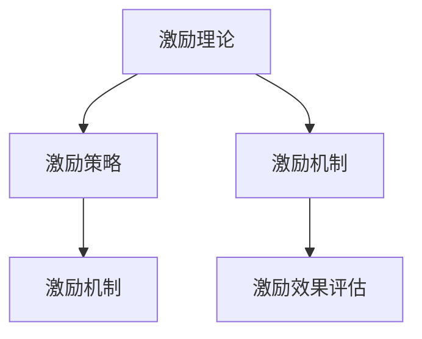
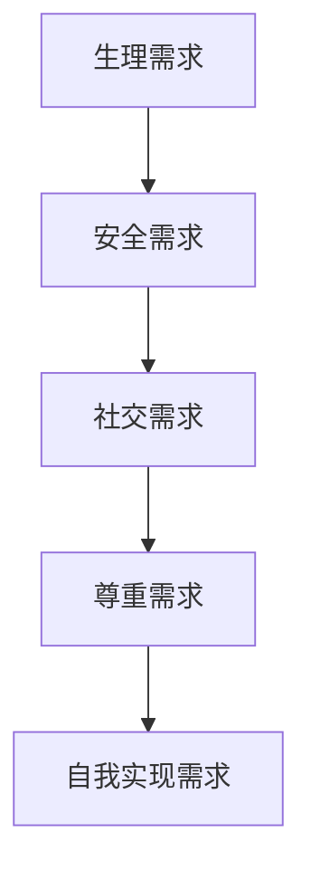
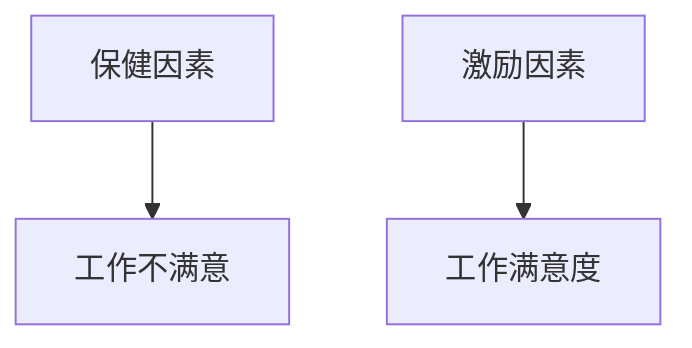
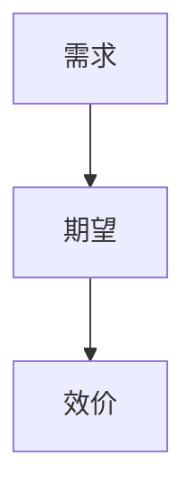

                 

## 《团队激励的艺术：激发员工积极性的方法》

> 关键词：团队激励、员工积极性、激励理论、激励策略、激励机制、效果评估、案例分析

> 摘要：本文详细探讨了团队激励的概念、重要性及其在提高员工积极性方面的作用。通过介绍团队激励的核心理论、设计激励策略的步骤、激励机制的实施过程以及激励效果的评估方法，本文旨在为企业管理者提供一套科学的团队激励体系。同时，通过实际案例的分析，本文展示了团队激励在实践中的应用，并提出了一些挑战和未来的发展方向。

### 引言

在现代企业管理中，团队激励成为提升组织绩效和员工满意度的关键因素。团队激励不仅涉及对员工的物质奖励，还包括对其心理需求的满足，从而激发员工的工作热情和创造力。本文将围绕团队激励这一主题，深入探讨其理论背景、核心概念、策略设计、实施与评估等方面。

### 核心概念与联系

团队激励的核心概念包括激励理论、激励策略和激励机制。以下是这些概念之间的联系及其关系架构的Mermaid流程图：

- **激励理论**：包括马斯洛需求层次理论、双因素理论和动机理论等，为激励策略和激励机制的设计提供了理论基础。
- **激励策略**：结合激励理论，针对员工的内在动机和外在动机，设计出能够有效激发员工积极性的具体策略。
- **激励机制**：将激励策略转化为实际的操作流程和制度，通过薪酬、晋升、培训等手段，直接影响员工的工作行为和绩效。
- **激励效果评估**：对激励机制的实施效果进行监测和评估，通过反馈和改进，不断提升激励体系的科学性和有效性。

### 团队激励理论

#### 马斯洛需求层次理论

马斯洛需求层次理论将人类需求分为五个层次：生理需求、安全需求、社交需求、尊重需求和自我实现需求。根据这一理论，团队激励需要从满足员工的基本需求开始，逐步提升到更高层次的需求。

#### 双因素理论

赫茨伯格的双因素理论认为，工作满意度和工作不满意是由两种不同的因素引起的：保健因素和激励因素。保健因素包括工作环境、薪酬等，激励因素包括成就、认可等。团队激励需要关注激励因素，以提升员工的工作满意度。

#### 动机理论

弗鲁姆的动机理论认为，动机是由需求、期望和效价共同决定的。团队激励需要分析员工的需求，设置合理的目标，并提供足够的期望和效价，以激发员工的动机。

### 激励策略设计

设计激励策略需要遵循以下步骤：

1. **确定激励目标**：明确激励的最终目标，例如提高员工的工作满意度、提升团队绩效等。
2. **分析员工需求**：了解员工的内在动机和外在动机，为设计个性化的激励策略提供依据。
3. **选择激励工具**：根据员工需求选择合适的激励工具，如薪酬激励、晋升激励、培训激励等。
4. **制定激励计划**：制定详细的激励计划，包括激励措施的执行时间、方式、频率等。

### 激励机制的实施

激励机制的实施包括以下几个方面：

1. **激励沟通与培训**：确保员工了解激励政策，并通过培训提高员工的工作能力和自信心。
2. **激励措施的实施技巧**：灵活运用激励工具，确保激励措施的有效性和公平性。
3. **处理激励中的冲突**：及时解决激励过程中出现的矛盾和冲突，维护团队和谐。

### 激励效果的评估

激励效果的评估需要从以下几个方面进行：

1. **激励效果评估的指标**：确定评估的指标，如员工满意度、工作绩效、离职率等。
2. **激励效果评估的方法**：采用定量和定性相结合的方法，如问卷调查、访谈、绩效分析等。
3. **激励效果的反馈与改进**：根据评估结果，及时调整激励政策，优化激励机制。

### 案例分析

通过以下实际案例，我们可以看到团队激励在不同组织中的应用效果：

#### 案例一：初创公司的团队激励

某初创公司为了吸引和留住人才，实施了一系列的激励措施，包括：

- 提供具有竞争力的薪酬和股权激励。
- 为员工提供培训和发展机会，提升个人能力。
- 定期举行团队建设活动，增强团队凝聚力。

这些措施有效提升了员工的工作满意度和忠诚度，促进了公司的发展。

#### 案例二：跨国公司的团队激励实践

某跨国公司通过以下方式激励团队成员：

- 设置明确的目标和奖励机制，激励员工追求卓越。
- 提供多样化的培训计划，支持员工职业发展。
- 定期进行员工满意度调查，及时调整激励政策。

这些措施使得公司的团队效率大幅提升，业务取得了显著增长。

### 挑战与展望

团队激励在实施过程中面临以下挑战：

- **个体差异**：员工的内在动机和需求存在差异，如何设计个性化的激励措施是一个难题。
- **文化差异**：不同文化背景下的员工对激励的接受程度和偏好可能不同，需要充分考虑文化差异。
- **激励机制的成本**：过高的激励机制成本可能会影响公司的利润。

未来团队激励的发展方向包括：

- **个性化激励**：通过数据分析，实现个性化的激励策略。
- **文化适应性**：结合企业文化，设计符合员工需求的激励措施。
- **可持续发展**：在激励员工的同时，关注企业的长期发展。

### 结论

团队激励是提升员工积极性和组织绩效的关键。通过理解激励理论、设计有效的激励策略、实施激励机制和评估激励效果，企业管理者可以构建一套科学的团队激励体系。实际案例的分析展示了团队激励在不同组织中的应用效果，也为未来团队激励的发展提供了启示。

### 作者信息

作者：AI天才研究院/AI Genius Institute & 禅与计算机程序设计艺术 /Zen And The Art of Computer Programming

