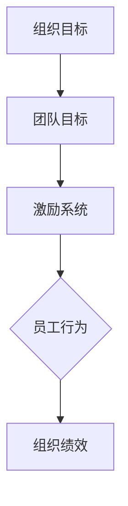
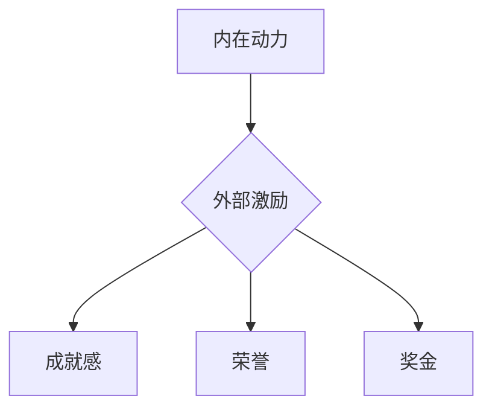
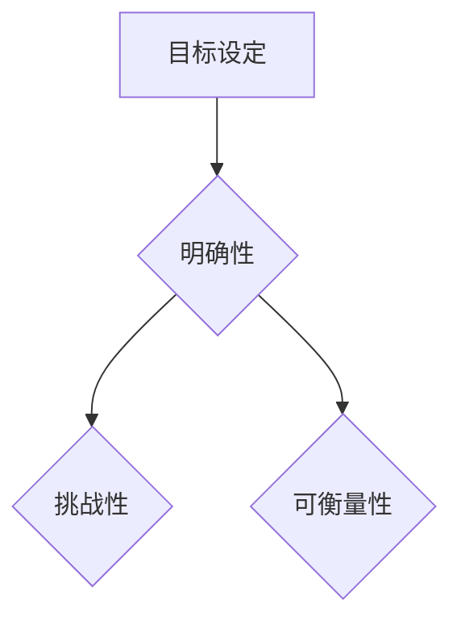
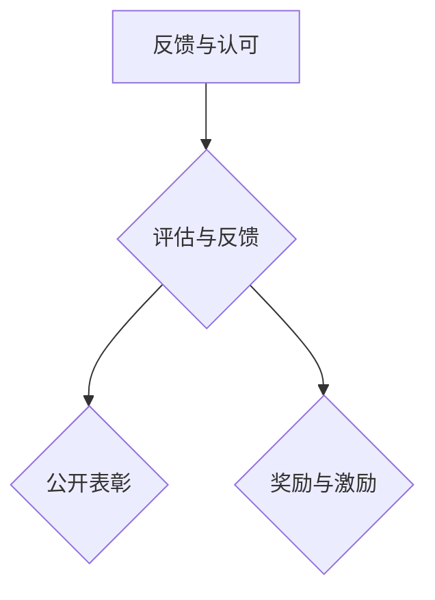

                 

## 文章标题：团队激励系统设计：结合内在动力与外部激励

关键词：团队激励系统、内在动力、外部激励、动机理论、模型设计、案例分析、实施策略

摘要：本文深入探讨了团队激励系统设计的关键要素，包括内在动力和外部激励的结合。通过理论基础、实际案例和分析，揭示了如何有效地激发团队潜能，提高团队绩效。

作者：AI天才研究院/AI Genius Institute & 禅与计算机程序设计艺术 /Zen And The Art of Computer Programming

---

## 引言

在现代组织中，团队激励系统已成为提高员工绩效、促进团队协作的关键手段。然而，如何平衡内在动力与外部激励，设计出既能激发员工自主性又能实现组织目标的激励系统，仍然是一个复杂且富有挑战性的问题。本文旨在探讨团队激励系统的设计原则和方法，结合内在动力和外部激励，为组织管理者提供有价值的参考。

### 背景介绍

团队激励系统设计的核心在于理解员工的动机和行为。随着知识经济的发展，员工的价值越来越依赖于其创造力、协作能力和解决问题的能力。因此，激励系统不仅要关注员工的物质回报，还需关注其内在动机，如成就感、自我实现和归属感。这一转变要求管理者在设计中考虑更多的心理和社会因素。

### 核心概念与联系

为了更好地理解团队激励系统的设计，我们需要了解两个核心概念：内在动力和外部激励。内在动力指的是个体内在的动机，如兴趣、热爱和自我驱动；而外部激励则包括物质奖励、荣誉和社会地位等外在因素。

在图1中，我们可以看到内在动力和外部激励之间的关系。两者并非完全独立，而是相互影响、共同作用。一个有效的团队激励系统需要在两者之间找到平衡点，以实现最佳效果。

### 文章大纲结构

本文将分为以下几个部分：

1. **理论基础的探索**：介绍与团队激励系统相关的动机理论，包括马斯洛的需求层次理论、自我决定理论等。
2. **框架与模型的设计**：阐述整合内在动力和外部激励的框架和模型，如目标设定理论、自我效能感理论等。
3. **案例分析与应用**：通过实际案例，展示如何在不同组织环境中设计有效的团队激励系统。
4. **实施策略的探讨**：提出策略，以帮助管理者在实际操作中实施和调整团队激励系统。
5. **实施考虑**：讨论在实施过程中可能遇到的问题，如沟通、技术支持和评估等。

## 理论基础的探索

在探讨团队激励系统的设计之前，了解相关的动机理论至关重要。这些理论为我们提供了理解和分析员工行为的框架，帮助我们设计出更有效的激励系统。

### 马斯洛的需求层次理论

马斯洛的需求层次理论是动机理论中的经典之一。该理论认为，人的需求可以分为五个层次：生理需求、安全需求、社交需求、尊重需求和自我实现需求。每个需求层次都满足后，人才会追求更高层次的需求。

在团队激励系统中，管理者可以利用马斯洛的需求层次理论来理解员工的动机。例如，通过提供良好的工作环境和安全保障，满足员工的生理和安全需求；通过团队建设和社交活动，满足员工的社交需求；通过认可和奖励，满足员工的尊重需求；最后，通过提供挑战性工作和职业发展机会，满足员工的自我实现需求。

### 自我决定理论

自我决定理论（Self-Determination Theory，简称SDT）是由美国心理学家德西和瑞恩提出的。该理论认为，人的行为受到三个基本心理需求的驱动：自主性、能力和归属感。这些需求满足后，个体会体验到内在的动机，从而更愿意投入工作。

在团队激励系统中，自我决定理论强调给予员工自主权，让他们参与决策过程，以满足其自主性的需求。同时，通过提供培训和发展机会，帮助员工提升能力，以满足其能力需求。此外，通过团队文化和社交活动，增强员工之间的归属感。

### 目标设定理论

目标设定理论（Goal-Setting Theory）由洛克和勒文森提出。该理论认为，明确且具有挑战性的目标能够显著提高员工的工作绩效。目标设定不仅需要明确目标，还需要设定具体的行动计划和反馈机制。

在团队激励系统中，管理者可以通过设定明确且具有挑战性的目标来激发员工的内在动力。例如，设定短期和长期目标，并定期对员工的工作进行评估和反馈，帮助员工了解自己的进度，同时提供改进的方向。

### 自我效能感理论

自我效能感理论（Self-Efficacy Theory）由班杜拉提出。该理论认为，个体对自身能力的信念会影响其行为选择和努力程度。高自我效能感的员工更倾向于接受挑战，努力克服困难。

在团队激励系统中，管理者可以通过认可和奖励来增强员工的自我效能感。例如，对员工的成就进行公开表彰，提供成功的案例分析，以及提供培训和指导，帮助员工提升自信心。

通过上述理论的分析，我们可以看到，不同的动机理论为我们提供了不同的视角来理解员工的行为和动机。在团队激励系统的设计中，管理者需要综合考虑这些理论，结合组织的实际情况，设计出既能激发员工内在动力又能实现组织目标的激励系统。

### 框架与模型的设计

在了解了相关的动机理论后，接下来我们需要探讨如何将内在动力和外部激励结合起来，设计出有效的团队激励系统。在这一部分，我们将介绍几个关键的框架和模型，包括目标设定理论、自我效能感理论和整合模型。

#### 目标设定理论

目标设定理论（Goal-Setting Theory）是团队激励系统设计中的重要理论之一。该理论认为，明确的、具有挑战性的目标能够显著提高员工的工作绩效。根据目标设定理论，目标应具备以下几个特点：

1. **明确性**：目标应该具体、明确，避免模糊不清。例如，“提高销售额”不如“在接下来的三个月内，将销售额提高20%”具体。
2. **挑战性**：目标应具有一定的挑战性，以激发员工的内在动力。但挑战性不应过高，以免员工感到无法实现。
3. **可测量性**：目标应具备可测量性，以便对员工的绩效进行评估。

#### 自我效能感理论

自我效能感理论（Self-Efficacy Theory）关注个体对自身能力的信念。根据该理论，高自我效能感的员工更倾向于接受挑战，并付出更多的努力。为了提高员工的自我效能感，管理者可以采取以下策略：

1. **提供成功案例**：通过展示成功的案例，帮助员工了解他们可以实现目标。
2. **提供培训和指导**：通过培训和指导，提升员工的工作技能和自信心。
3. **认可和奖励**：对员工的成就进行公开表彰，增强其自我效能感。

#### 整合模型

为了更有效地激发团队的内在动力和外部激励，可以采用整合模型。该模型结合了目标设定理论和自我效能感理论，同时考虑了内在动力和外部激励的平衡。

在整合模型中，管理者需要：

1. **设定明确且具有挑战性的目标**：如前所述，明确的目标和具有挑战性的目标能够激发员工的内在动力。
2. **提供支持和指导**：通过提供培训和指导，帮助员工提升自我效能感。
3. **结合内在动力和外部激励**：通过认可和奖励来提供外部激励，同时鼓励员工追求内在成就感和自我实现。

### 模型的应用

为了更好地理解这些框架和模型的应用，我们可以通过一个示例来说明。

假设一个初创公司想要提高团队的开发效率，他们可以采用以下步骤：

1. **设定明确且具有挑战性的目标**：公司可以设定一个短期目标，如在接下来的三个月内，将产品的开发周期缩短10%。
2. **提供支持和指导**：公司可以为团队成员提供培训，提高他们的技能和知识水平。
3. **结合内在动力和外部激励**：公司可以通过认可和奖励来激励员工。例如，为成功完成任务的团队成员颁发奖金，并在公司内部公告栏上展示他们的成就。

通过这种方式，公司不仅可以提高团队的开发效率，还可以激发员工的内在动力，促进团队合作。

### 总结

通过目标设定理论、自我效能感理论和整合模型，我们可以设计出有效的团队激励系统。这些框架和模型为我们提供了理论依据和实际操作指南，帮助管理者在平衡内在动力和外部激励之间找到最佳平衡点，从而实现团队的高效运作和组织目标的达成。

## 案例分析与应用

为了更好地理解团队激励系统的设计原则和方法，我们可以通过实际案例来探讨如何在不同组织环境中实施这些原则和方法。以下我们将分析两个不同类型的组织案例：一个高科技公司和一家制造企业。

### 案例一：高科技公司

#### 公司背景

该高科技公司专注于软件开发和产品创新，团队成员以年轻的专业人才为主，他们追求创新和自我实现。公司文化注重员工自主性和团队协作。

#### 激励系统设计

1. **内在动力激发**：公司通过以下措施激发员工的内在动力：
   - **项目自主权**：给予员工项目选择权，鼓励他们根据自己的兴趣和特长参与项目。
   - **培训和发展**：定期提供专业培训，帮助员工提升技能，增强自我效能感。
   - **团队建设**：组织团队建设活动，增强员工之间的归属感和合作意识。

2. **外部激励**：公司通过以下措施提供外部激励：
   - **绩效奖金**：根据员工的工作表现和项目成果，提供绩效奖金。
   - **股权激励**：为关键员工提供股权激励，让员工分享公司的成长和成功。
   - **荣誉和认可**：对有突出贡献的员工进行公开表彰，增强其成就感。

#### 结果和分析

通过实施这些措施，公司的团队协作和创新能力得到了显著提升。员工在工作中表现出更高的自主性和积极性，项目完成质量也得到了提高。绩效奖金和股权激励激励了员工追求卓越，同时增强了他们的归属感和忠诚度。

### 案例二：制造企业

#### 公司背景

该制造企业专注于生产制造，员工以操作工和技术人员为主，他们追求稳定的工作环境和公平的待遇。公司文化注重效率和团队合作。

#### 激励系统设计

1. **内在动力激发**：公司通过以下措施激发员工的内在动力：
   - **工作认可**：对员工的优秀表现进行公开认可和表彰。
   - **职业发展**：提供职业晋升通道和技能培训，帮助员工实现职业成长。
   - **团队建设**：定期组织团队活动，增强员工之间的合作意识。

2. **外部激励**：公司通过以下措施提供外部激励：
   - **绩效奖金**：根据生产效率和产品质量，提供绩效奖金。
   - **福利待遇**：提供良好的福利待遇，包括健康保险、住房补贴等。
   - **员工参与**：鼓励员工参与生产流程优化和设备改进，提供创新奖励。

#### 结果和分析

通过实施这些措施，公司的生产效率和产品质量得到了显著提升。员工在工作中的积极性和主动性得到了提高，团队协作和创新能力也得到了增强。绩效奖金和员工参与机制激发了员工的内在动力，福利待遇和员工参与机制提供了稳定的外部激励。

### 总结

通过上述案例分析，我们可以看到，不同的组织可以根据自身的特点和需求，设计出适合的团队激励系统。无论是高科技公司还是制造企业，通过激发员工的内在动力和提供外部激励，都可以显著提升团队绩效和组织效率。这些案例为我们提供了宝贵的实践经验，有助于我们在实际操作中更好地设计团队激励系统。

## 实施策略

在设计团队激励系统时，除了考虑理论框架和模型，实际操作中的策略同样至关重要。以下我们将讨论几项关键策略，帮助管理者在实施过程中取得成功。

### 对齐组织目标

首先，团队激励系统应与组织目标保持一致。这意味着，管理者需要确保激励措施能够促进团队实现组织战略目标。例如，如果组织的目标是提高产品质量，那么激励系统可以设置与产品质量相关的绩效指标，如质量检查合格率、客户投诉率等。通过对组织目标的明确和对齐，可以确保激励系统不仅能够激发员工动力，还能够推动组织整体发展。

### 平衡内在动力与外部激励

在实施激励系统时，平衡内在动力和外部激励至关重要。内在动力能够持久地激发员工的热情和创造力，而外部激励则可以在短期内迅速提升员工的工作效率和绩效。管理者应设计一个多元化的激励系统，结合内在动力和外部激励，以满足员工的多样化需求。

### 设定明确的目标

目标设定是激励系统设计中的关键一步。明确且具有挑战性的目标能够激发员工的内在动力。管理者应确保目标具体、可衡量，并与员工的工作职责紧密相关。同时，目标的设定应经过员工的参与和讨论，以提高他们的认同感和责任感。

### 提供反馈和认可

反馈和认可是激励系统的重要组成部分。管理者应定期对员工的工作进行评估和反馈，帮助他们了解自己的表现和改进方向。同时，对于优秀的员工和团队，应给予公开的认可和奖励，以增强他们的成就感和自我效能感。

### 考虑文化差异

不同组织有不同的文化背景，管理者在实施激励系统时需要考虑这些差异。例如，在一些注重集体主义文化的组织中，团队奖励可能更受欢迎；而在个人主义文化中，个人奖励可能更有效。因此，激励系统的设计应灵活调整，以适应不同组织的文化特点。

### 持续优化与调整

团队激励系统不是一成不变的，管理者需要根据实际情况和员工反馈进行持续优化和调整。例如，如果发现某个激励措施的效果不佳，应立即进行评估和改进。通过持续优化，可以确保激励系统始终与组织目标和员工需求保持一致。

通过上述策略的实施，管理者可以设计出更加有效和灵活的团队激励系统，从而激发员工的内在动力，提升团队绩效，实现组织目标。

### 实施考虑

在实际操作中，实施团队激励系统会遇到一系列挑战，需要管理者采取有效措施应对。以下是几个关键方面：

#### 沟通

有效的沟通是确保激励系统顺利实施的基石。在系统设计和实施过程中，管理者需要与员工进行充分沟通，确保他们对激励系统的目标和预期有清晰的了解。可以通过以下方式加强沟通：

- **召开会议**：定期召开会议，向员工解释激励系统的设计理念和实施步骤。
- **透明度**：保持系统的透明度，让员工了解激励标准的制定过程和评估结果。
- **开放反馈**：鼓励员工提出问题和建议，及时回应他们的反馈。

#### 技术支持

现代团队激励系统往往依赖于各种技术工具，如绩效管理系统、员工反馈平台等。管理者需要确保技术支持到位，以支持系统的顺利运行。

- **选择合适的技术**：根据组织的实际需求选择合适的绩效管理软件和员工反馈工具。
- **培训员工**：为员工提供技术培训，确保他们能够熟练使用相关工具。
- **技术支持**：设立技术支持团队，及时解决员工在使用过程中遇到的问题。

#### 评估和调整

激励系统不是一成不变的，管理者需要定期评估其效果，并根据评估结果进行必要的调整。以下是一些评估和调整的策略：

- **定期的绩效评估**：定期对员工的绩效进行评估，了解激励系统的实际效果。
- **员工反馈**：收集员工的反馈，了解他们对激励系统的看法和建议。
- **数据驱动**：使用数据分析工具，量化激励系统对员工行为和绩效的影响。

#### 遵循道德和法律规范

在实施激励系统时，管理者需要确保遵循相关道德和法律规范。这包括：

- **公平性**：确保激励系统的公平性，避免歧视和偏见。
- **隐私保护**：确保员工的个人信息得到妥善保护。
- **合法性**：确保激励系统的设计符合当地的法律法规。

#### 文化适应性

不同组织有不同的文化背景，管理者在实施激励系统时需要考虑这些差异。以下是一些策略：

- **文化调研**：在系统设计前，对组织的文化进行调研，了解员工的需求和期望。
- **文化融合**：在激励系统的设计过程中，考虑如何将组织的核心文化价值观融入其中。
- **灵活调整**：根据组织的文化特点，灵活调整激励系统的内容和实施方式。

通过以上措施，管理者可以更有效地应对实施团队激励系统过程中遇到的各种挑战，确保系统能够顺利运行，并为组织带来预期的效果。

### 总结

通过本篇文章的探讨，我们深入了解了团队激励系统设计的关键要素。从理论基础的探讨，到框架与模型的设计，再到实际案例的分析，我们看到了如何将内在动力和外部激励有机结合，设计出有效的团队激励系统。在实施过程中，管理者需要关注对齐组织目标、平衡内在动力与外部激励、设定明确的目标、提供反馈和认可、考虑文化差异以及持续优化与调整。同时，我们也要注意沟通、技术支持、评估和调整、遵循道德和法律规范以及文化适应性等方面的实施考虑。

总之，团队激励系统设计是一个复杂而富有挑战性的过程，但通过科学的理论指导、实际案例的参考和有效的实施策略，我们可以设计出既激发员工内在动力又实现组织目标的团队激励系统。这不仅有助于提升团队绩效，还能促进组织的长期发展。

### 拓展阅读

为了进一步深化对团队激励系统的理解，以下是一些建议的拓展阅读资源：

1. **《动机与人格》** - 作者：亚伯拉罕·马斯洛（Abraham Maslow）
   - 本书详细阐述了马斯洛的需求层次理论，为我们提供了理解员工动机的深刻洞见。

2. **《自我决定论》** - 作者：理查德·德西（Richard Ryan）和爱德华·莱恩（Edwin Latham）
   - 这本书介绍了自我决定理论，探讨了如何通过激发员工的自主性、能力和归属感来提高工作绩效。

3. **《目标管理》** - 作者：爱德华·洛克（Edwin Locke）和吉姆·勒文森（Gary Latham）
   - 本书深入探讨了目标设定理论，提供了关于如何设定明确且具有挑战性的目标以提升员工绩效的实用指导。

4. **《激发潜能：动机与领导力》** - 作者：丹尼尔·戈尔曼（Daniel Goleman）
   - 本书从心理学和领导力的角度，探讨了如何激发员工的内在动机，以及领导者如何通过激励来提升团队表现。

5. **《团队激励系统设计实战》** - 作者：约翰·哈蒙德（John Hammond）
   - 这本书通过具体的案例和实践，详细介绍了如何设计和实施有效的团队激励系统。

通过阅读这些书籍和资源，您可以更深入地了解团队激励系统的理论背景和实践应用，从而在实际工作中更好地设计和管理团队激励系统。希望这些建议对您的学习和工作有所帮助。再次感谢您的阅读，祝您在团队激励系统设计方面取得优异成绩！

