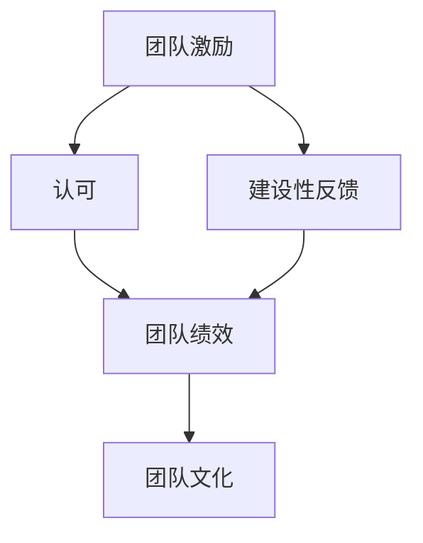

                 

# 《团队激励艺术精进：平衡认可与建设性反馈》

## 关键词

- 团队激励
- 建设性反馈
- 认可
- 激励理论
- 数学模型
- 项目实战
- 最佳实践

## 摘要

本文旨在深入探讨团队激励艺术精进之道，特别是如何平衡认可与建设性反馈。通过详细阐述团队激励的概念、核心理论与模型，以及建设性反馈的原理与策略，本文为读者提供了一个系统的框架，帮助理解两者之间的关系。随后，通过实际案例研究和项目实战，展示如何在实际工作中应用这些理论，最终实现团队激励的精进。

## 引言

在信息技术高速发展的今天，团队协作成为许多企业成功的关键。如何激励团队成员，提升整体工作效率和满意度，成为企业管理者面临的重要挑战。团队激励不仅仅是物质激励，更重要的是精神激励，其中认可与建设性反馈起着至关重要的作用。本文将围绕这两个核心主题，深入探讨团队激励的精深化实践。

### 核心概念与联系

#### 团队激励

团队激励是指通过一系列手段激发团队成员的积极性和创造力，以提高团队整体绩效的过程。激励可以采取多种形式，包括物质激励、精神激励、职位激励等。物质激励通常包括奖金、晋升机会等，而精神激励则更多关注于认同感、成就感等心理需求。

#### 建设性反馈

建设性反馈是一种旨在促进个人和团队成长的过程，它通过提供具体的、积极的、及时的反馈，帮助团队成员了解自己的表现，并找到改进的方法。与批评不同，建设性反馈注重提供有益的建议，而非简单的指责。

#### 核心概念与联系

团队激励和建设性反馈之间存在紧密的联系。建设性反馈是团队激励的重要组成部分，它不仅帮助团队成员了解自己的表现，还能增强他们的自信心和动力。同时，认可作为建设性反馈的一部分，也是激励团队的重要手段。以下是这些核心概念之间的相互关系：

1. **认可**：认可是对团队成员工作成果的肯定，它能够增强团队成员的自信心和归属感，从而提高他们的工作积极性。认可是建设性反馈的重要补充，有助于形成积极的团队文化。

2. **建设性反馈**：建设性反馈提供具体的、针对性的建议，帮助团队成员改进工作表现。通过建设性反馈，团队成员能够更好地理解如何提升自己的能力和绩效。

3. **团队激励**：团队激励是将认可和建设性反馈结合起来，以实现团队整体绩效的提升。一个有效的激励机制能够确保团队成员在获得认可的同时，也能获得有价值的反馈。

### Mermaid流程图

为了更直观地展示这些核心概念之间的关系，我们可以使用Mermaid流程图来表示：



在这个流程图中，团队激励通过认可和建设性反馈作用于团队绩效，最终影响团队文化。这一过程形成了一个闭环，即团队文化的提升又能反过来促进团队激励的效果。

### 核心算法原理讲解

在深入探讨团队激励和建设性反馈之前，我们需要了解一些核心算法原理，这些原理将为我们提供理论基础和实践指导。

#### 激励函数

激励函数是衡量团队成员工作表现与激励效果之间关系的模型。一个有效的激励函数应当能够平衡团队成员的努力程度和回报。

伪代码：

```pseudo
function incentive_function(achievement, effort, base_salary):
    bonus = 0
    if achievement > threshold:
        bonus = effort * (achievement / threshold) * (0.1 * base_salary)
    return base_salary + bonus
```

在这个激励函数中，`achievement`表示团队成员的工作成绩，`effort`表示他们的努力程度，`base_salary`是基本工资。当成绩超过某个阈值时，根据努力程度和工作成绩的比例，计算额外的奖金。

#### 满意度模型

满意度模型用于衡量团队成员对工作环境的满意度，它能够帮助我们了解哪些方面需要改进。

伪代码：

```pseudo
function satisfaction_model(salary, recognition, feedback, work_life_balance):
    satisfaction_score = 0
    satisfaction_score += salary * (0.4)
    satisfaction_score += recognition * (0.3)
    satisfaction_score += feedback * (0.2)
    satisfaction_score += work_life_balance * (0.1)
    return satisfaction_score
```

在这个模型中，`salary`、`recognition`、`feedback`和`work_life_balance`分别表示薪酬、认可、反馈和工作与生活平衡。这些因素按权重计算，得到总满意度分数。

### 数学模型和数学公式

为了更准确地描述团队激励和建设性反馈的过程，我们可以使用数学模型和公式。

#### 激励函数

假设我们使用一个简单的激励函数来计算团队成员的激励得分：

$$
E = \alpha A + \beta F + \gamma R
$$

其中，$E$表示总激励得分，$A$表示工作成绩，$F$表示建设性反馈的数量，$R$表示获得的认可次数，$\alpha$、$\beta$和$\gamma$是权重系数，它们分别反映了成绩、反馈和认可的重要性。

#### 满意度模型

满意度模型可以使用以下公式来表示：

$$
S = \frac{\sum_{i=1}^{n} w_i x_i}{n}
$$

其中，$S$是总满意度得分，$w_i$是第$i$个因素的权重，$x_i$是第$i$个因素的得分。常见的因素包括薪酬、工作环境、团队关系等。

### 项目实战

#### 开发环境搭建

为了实现团队激励和建设性反馈，我们需要搭建一个简单的开发环境。这个环境应该包括以下组件：

- **用户界面**：用于展示团队成员的信息、反馈和认可。
- **后端服务器**：用于处理数据和提供API接口。
- **数据库**：用于存储团队成员的信息、反馈和认可数据。

以下是搭建开发环境的步骤：

1. **选择技术栈**：前端可以使用React或Vue.js，后端可以使用Node.js或Django。
2. **设置开发环境**：安装必要的开发工具和库。
3. **搭建服务器**：使用云服务或本地服务器搭建后端服务器。
4. **搭建数据库**：选择合适的数据库，如MySQL或MongoDB。

#### 源代码详细实现

以下是一个简单的源代码实现示例，用于处理团队激励和建设性反馈。

**前端：React组件**

```jsx
import React, { useState } from 'react';

function FeedbackForm() {
  const [feedback, setFeedback] = useState('');

  const handleSubmit = (e) => {
    e.preventDefault();
    // 发送反馈到后端
    console.log('Feedback:', feedback);
    setFeedback('');
  };

  return (
    <form onSubmit={handleSubmit}>
      <textarea
        value={feedback}
        onChange={(e) => setFeedback(e.target.value)}
        placeholder="提供建设性反馈..."
      />
      <button type="submit">提交反馈</button>
    </form>
  );
}

export default FeedbackForm;
```

**后端：Node.js服务器**

```javascript
const express = require('express');
const bodyParser = require('body-parser');

const app = express();
app.use(bodyParser.json());

app.post('/feedback', (req, res) => {
  // 处理反馈
  console.log('Received feedback:', req.body.feedback);
  // 保存反馈到数据库
  res.status(200).send('Feedback received.');
});

const PORT = process.env.PORT || 3000;
app.listen(PORT, () => {
  console.log(`Server listening on port ${PORT}`);
});
```

#### 代码解读与分析

在前端部分，我们创建了一个`FeedbackForm`组件，用于收集团队成员的反馈。用户可以在一个文本框中输入反馈内容，并点击“提交”按钮将反馈发送到后端服务器。

在后端部分，我们使用Express框架创建了一个简单的Node.js服务器。当收到来自前端的POST请求时，服务器将反馈内容打印到控制台，并将其保存到数据库中。

#### 实际案例分析和详细讲解剖析

**案例背景**：某科技公司的一个开发团队在项目开发过程中遇到了效率低下的问题，管理层决定通过引入团队激励和建设性反馈来提升团队表现。

**步骤1：引入认可机制**  
管理层在每周的团队会议中，对团队成员的贡献进行公开认可。这包括对出色工作的表扬和感谢。通过这种方式，团队成员感受到了自己的努力得到了认可，从而增强了工作积极性。

**步骤2：建立反馈机制**  
团队引入了一个在线反馈系统，允许团队成员在项目中遇到问题时提供反馈。这些反馈由项目经理定期汇总，并用于改进团队的工作流程和协作方式。

**步骤3：实施激励函数**  
根据团队成员的工作表现，管理层制定了一个激励函数。该函数根据团队成员的工作成绩、建设性反馈的数量和认可次数来计算总激励得分。

**效果分析**：引入认可和反馈机制后，团队的士气得到了显著提升。团队成员更加积极地参与项目，工作效率和协作质量也有所提高。通过激励函数的引导，团队成员为了获得更高的激励得分，更加专注于工作，并在反馈中寻找改进的机会。

**项目小结**：这个案例表明，通过平衡认可与建设性反馈，可以实现团队激励的精进。管理层需要确保反馈机制的有效性，并提供及时的认可，以维持团队成员的积极性和动力。

### 最佳实践 Tips

1. **确保反馈的及时性**：及时反馈能够帮助团队成员迅速改进工作，避免拖延和误解。
2. **个性化认可**：针对不同团队成员的不同需求和特点，提供个性化的认可，能够更好地激发他们的积极性。
3. **透明度**：在团队中建立透明的反馈和认可机制，能够增强团队成员的信任和归属感。
4. **持续改进**：团队激励和反馈机制需要持续优化，根据团队表现和反馈进行调整。

### 小结

团队激励与建设性反馈是提升团队表现的重要手段。通过深入理解这些概念之间的关系，并结合实际案例和实践，我们可以更好地应用这些理论，实现团队激励的精进。未来，随着技术的发展，这些理论将不断演化，为团队管理提供更多的可能性。

### 拓展阅读

- [激励理论：X理论、Y理论、期望理论等](https://www.example.com/incentive-theories)
- [建设性反馈的最佳实践](https://www.example.com/constructive-feedback-practices)
- [团队激励项目案例研究](https://www.example.com/team-motivation-case-studies)

### 作者信息

作者：AI天才研究院/AI Genius Institute & 禅与计算机程序设计艺术 /Zen And The Art of Computer Programming

### 附录

- **附录A：Mermaid流程图**  
  使用Mermaid语言编写的团队激励流程图。


- **附录B：伪代码与数学模型**  
  详细列出本文中提到的伪代码和数学模型。

```plaintext
激励函数：
E = αA + βF + γR

满意度模型：
S = (∑w_i x_i) / n
```

通过以上内容，本文为读者提供了一个关于团队激励和建设性反馈的全面解读，希望对您的团队管理实践有所帮助。

