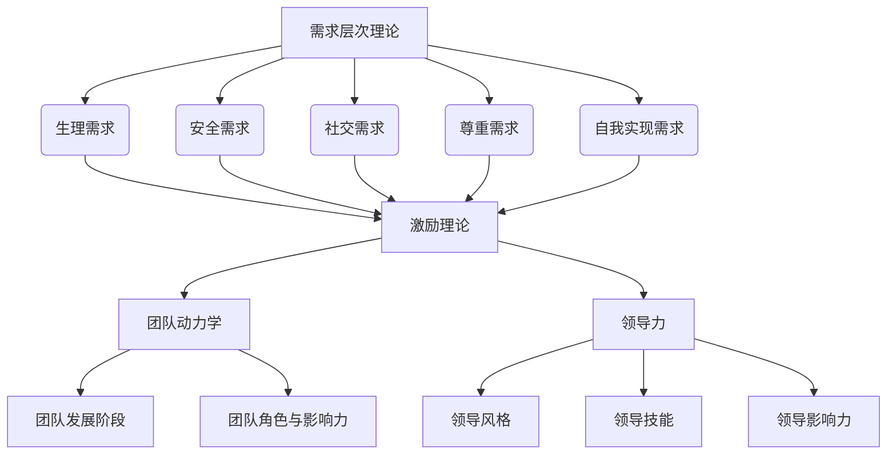

                 

### 文章标题

# 团队激励艺术：激发最佳表现

### 文章关键词

- 团队激励
- 激励理论
- 激励方法
- 团队绩效
- 员工满意度

### 文章摘要

本文深入探讨了团队激励艺术，旨在揭示激发团队最佳表现的奥秘。首先，我们介绍了团队激励的重要性及其面临的挑战。接着，通过剖析激励理论，探讨了激励原理与团队动力学的联系。随后，文章详细阐述了目标设置、反馈机制、奖励与惩罚等激励方法和技巧。通过实际案例研究和效果评估与调整，我们展示了如何将理论与实践相结合，以实现最佳激励效果。最后，文章总结了团队激励的关键要点，并展望了未来团队激励的发展趋势。

### 引言：团队激励的重要性与挑战

在现代企业中，团队激励已经成为企业管理和运营不可或缺的一部分。有效的团队激励不仅能够提高员工的满意度和忠诚度，还能显著提升团队的绩效和创新能力，从而为组织的长期发展提供强大动力。然而，团队激励并非易事，它面临着诸多挑战和难点。

首先，团队激励的重要性体现在以下几个方面：

1. **提升员工积极性**：通过有效的激励措施，能够激发员工的工作热情和积极性，使他们更愿意为企业付出更多的时间和精力。
2. **增强团队凝聚力**：良好的激励机制有助于团队成员之间建立互信关系，增强团队的凝聚力和协作精神。
3. **促进创新能力**：激励员工积极参与创新活动，有助于提升团队的创新能力，为企业带来持续的竞争力。
4. **提高工作效率**：激励措施能够使员工更加专注和高效地完成任务，从而提升整体工作效率。

然而，团队激励过程中也存在诸多挑战：

1. **激励需求的多样性**：不同的员工有不同的激励需求，如有的注重物质奖励，有的更看重职业发展机会，这使得激励措施的制定变得复杂。
2. **激励效果的滞后性**：激励措施的效果往往需要一定时间才能显现，如何及时调整激励策略以适应变化的需求是企业面临的挑战。
3. **激励成本的控制**：过度的激励可能导致企业成本上升，影响盈利能力，如何在保证激励效果的同时控制成本是企业需要考虑的问题。

本文将围绕团队激励的重要性与挑战，系统性地探讨激励理论、激励方法和实践，以期为读者提供全面而深入的团队激励指南。

### 团队激励理论基础

在探讨团队激励的实践之前，了解相关的理论基础是非常重要的。团队激励的理论基础主要包括激励理论、团队动力学和领导力。这些理论为我们提供了理解和应用激励措施的重要框架。

#### 激励理论

激励理论是团队激励的核心，它探讨了员工行为与激励之间的关系。以下是几种主要的激励理论：

1. **需求层次理论（Maslow's Hierarchy of Needs）**：马斯洛的需求层次理论将人的需求分为五个层次：生理需求、安全需求、社交需求、尊重需求和自我实现需求。该理论认为，只有当较低层次的需求得到满足时，人们才会追求更高层次的需求。对于团队激励，管理者需要了解员工的需求层次，并根据不同层次的需求提供相应的激励措施。

2. **双因素理论（Herzberg's Two-Factor Theory）**：赫兹伯格的双因素理论将工作满意度因素分为两类：激励因素（如成就、认可、工作本身）和保健因素（如工作条件、薪资、稳定性）。激励因素能够提高员工的工作满意度，而保健因素则只能防止不满意。因此，管理者应关注激励因素，以提升团队的整体表现。

3. **成就激励理论（Eccles and Middlebrook's Achievement Theory）**：成就激励理论认为，人们追求成就和成功的动机是内在的。通过设定具有挑战性的目标和提供反馈，可以激励员工追求更高的成就。对于团队激励，设定明确、具有挑战性的目标，并确保目标实现后有及时的反馈，是提高团队绩效的有效手段。

#### 团队动力学

团队动力学是研究团队内部动力和行为模式的理论。以下是一些关键的团队动力学概念：

1. **团队发展阶段（Tuckman's Stages of Team Development）**：图克曼（Tuckman）提出了团队发展的四个阶段：形成阶段、激荡阶段、规范阶段和执行阶段。每个阶段都有其特定的特征和挑战。了解团队所处的阶段，有助于管理者采取适当的激励措施，促进团队的发展。

2. **团队角色与影响力（Balogun and Jenkins's Team Roles and Influence）**：巴洛贡和詹金斯（Balogun and Jenkins）提出了团队角色理论，认为团队中存在九种主要角色：协调者、信息提供者、资源提供者、创新者、维护者、执行者、完成者、监听者和评估者。每个角色在团队中都有其独特的贡献和影响力。了解和运用这些角色，有助于优化团队的激励策略。

3. **团队领导力（Leadership）**：领导力是团队动力的关键因素。有效的领导能够引导团队朝着目标前进，解决团队内部的冲突，并提供必要的支持。领导力包括领导风格（如民主型、专制型、参与型等）、领导技能（如沟通能力、决策能力、激励能力等）和领导影响力（如权威性、感召力、影响力等）。不同的领导风格和技能适用于不同的团队发展阶段和情境，因此管理者需要灵活运用。

#### 领导力

领导力是团队激励的核心要素之一。有效的领导不仅能够激发团队成员的潜力，还能够提升团队的整体绩效。以下是领导力的几个关键方面：

1. **领导风格（Leadership Styles）**：领导风格是领导者对待团队成员和团队工作方式的表现。不同的领导风格适用于不同的情境和团队发展阶段。常见的领导风格包括民主型、专制型、参与型和变革型等。民主型领导注重团队成员的参与和决策过程，专制型领导则更多地由领导者做出决策。参与型领导鼓励团队成员共同参与决策，变革型领导则通过变革和创新推动团队的发展。

2. **领导技能（Leadership Skills）**：领导技能是领导者需要具备的核心能力。这些技能包括沟通能力、决策能力、问题解决能力、激励能力和冲突解决能力等。有效的沟通能力能够确保信息在团队中有效传递；决策能力帮助领导者做出明智的决策；激励能力则能够激发团队成员的积极性；问题解决能力和冲突解决能力则有助于团队应对挑战和保持和谐。

3. **领导影响力（Leadership Influence）**：领导影响力是领导者对团队成员行为和态度的影响能力。这种影响力可以通过权威性、感召力、影响力等途径实现。权威性是基于职位和权力的合法影响力；感召力是基于领导者个人魅力和价值观的影响力；影响力则通过建立信任和关系来实现。

#### 核心概念原理之间的关系架构

为了更好地理解团队激励理论基础，我们使用Mermaid流程图来展示核心概念原理之间的关系：



通过上述Mermaid流程图，我们可以清晰地看到需求层次理论、激励理论、团队动力学和领导力之间的相互关系。这些理论共同构成了团队激励的基础，为管理者提供了理解和应用激励措施的理论依据。

### 目标设置

目标设置是团队激励的核心组成部分，它不仅为团队成员提供了明确的方向和期望，还能激发他们的内在动机和动力。有效的目标设置应遵循SMART原则，即目标应具备具体性（Specific）、可测量性（Measurable）、可实现性（Achievable）、相关性（Relevant）和时限性（Time-bound）。

#### SMART原则

1. **具体性（Specific）**：目标应明确、具体，避免模糊不清。例如，“提高销售业绩”不如“增加销售额10%”具体。
2. **可测量性（Measurable）**：目标应具备可衡量的标准，以便于评估和反馈。例如，“完成任务”不如“在规定时间内完成项目A”可测量。
3. **可实现性（Achievable）**：目标应具有挑战性，但必须可达成。例如，“在一个月内完成一个复杂项目”可能过于激进，而“在两个月内完成项目B”则更为合理。
4. **相关性（Relevant）**：目标应与团队或个人职责相关，确保努力的方向正确。例如，“提高编程技能”与“完成项目开发”相关，而与“销售业绩”则无直接关联。
5. **时限性（Time-bound）**：目标应设定明确的时间期限，以提供明确的时间框架。例如，“在未来一年内”不如“在2023年底前”具体。

#### 目标管理的步骤

1. **明确目标**：首先，团队或个人需要明确要达成的目标。这个阶段要求目标的设定应遵循SMART原则。
2. **分解目标**：将大目标分解为小目标，以便于逐步实现。例如，将“提高销售额”分解为“每周增加新客户数”和“每月提高客户满意度”。
3. **制定行动计划**：为每个小目标制定详细的行动计划，包括责任分配、时间表和资源需求。
4. **执行与监控**：按照行动计划执行任务，并定期监控进展。确保及时调整计划，以应对变化和挑战。
5. **评估与反馈**：在目标完成后，进行评估和反馈，总结经验教训，为后续的目标管理提供参考。

#### 伪代码：目标设置与执行

以下是一个简化的伪代码，用于描述目标设置与执行的过程：

```plaintext
函数 设置目标（目标，负责人，期限）:
    如果 目标 不满足 SMART 原则:
        返回 "目标不符合SMART原则"
    否则:
        分解目标（小目标列表）
        为每个小目标分配负责人
        设定目标执行时间表
        开始执行目标
        监控目标执行进度
        当目标完成时:
            评估目标完成情况
            给予负责人反馈
        返回 "目标设置与执行成功"
```

#### 数学模型与公式

为了更好地理解和量化目标设置与执行的效果，我们可以使用以下数学模型：

1. **目标完成率（Goal Completion Rate）**：

   \[ \text{目标完成率} = \frac{\text{已完成目标数}}{\text{总目标数}} \]

2. **目标达成度（Goal Achievement Degree）**：

   \[ \text{目标达成度} = \frac{\text{实际完成指标}}{\text{目标设定指标}} \]

通过这些指标，管理者可以定量地评估目标设置和执行的效果，并根据结果进行调整和优化。

#### 举例说明

假设一个销售团队的目标是在一个月内增加新客户数20%，以下是具体的执行步骤：

1. **明确目标**：在一个月内增加新客户数20%。
2. **分解目标**：将目标分解为每周增加新客户数的具体指标，例如，第一周增加5%，第二周增加5%，第三周增加5%，第四周增加5%。
3. **制定行动计划**：为每个周目标制定具体的行动计划，包括增加市场推广活动、优化客户关系管理流程等。
4. **执行与监控**：按照行动计划执行任务，并每周监控新客户数的增加情况。
5. **评估与反馈**：在一个月结束时，评估总目标完成情况，并根据结果给予团队成员反馈和激励。

通过这样的目标设置与执行过程，销售团队可以明确目标、分解任务、落实行动，并最终实现预期的销售增长目标。

### 反馈机制

在团队激励中，反馈机制扮演着至关重要的角色。有效的反馈能够帮助团队成员了解自己的工作表现，明确改进方向，从而提高工作效率和团队绩效。反馈机制的设计和实施需要遵循几个关键原则，以确保其有效性和公平性。

#### 反馈机制的关键原则

1. **及时性**：反馈应在问题发生后的第一时间进行，以帮助团队成员及时纠正错误和改进工作方法。
2. **具体性**：反馈应具体、明确，避免模糊和泛泛而谈。具体反馈有助于团队成员更清晰地理解自己的问题和改进方向。
3. **建设性**：反馈应具有建设性，不仅要指出问题，还要提供解决问题的方法和建议。建设性反馈能够激发团队成员的积极性和自信心。
4. **公平性**：反馈应公平、公正，避免因个人喜好或偏见而影响反馈的客观性。公平的反馈能够增强团队成员的信任和团队凝聚力。
5. **互动性**：反馈应是一个双向互动的过程，鼓励团队成员提出自己的看法和建议。互动性反馈能够促进团队成员之间的沟通和合作。

#### 反馈机制的类型

1. **正面反馈**：正面反馈是鼓励和表扬团队成员的优点和成就。正面反馈能够增强团队成员的自信心和积极性，激励他们持续发挥最佳水平。
2. **建设性反馈**：建设性反馈是指出团队成员在工作中的问题和不足，并提供改进建议。建设性反馈有助于团队成员认识到自己的不足，并采取行动进行改进。
3. **负面反馈**：负面反馈是指出团队成员在工作中的错误和不当行为，并可能伴随着惩罚措施。负面反馈的目的是纠正错误，防止问题再次发生。

#### 反馈机制的流程

1. **准备反馈**：在提供反馈前，管理者需要收集相关数据和证据，确保反馈的准确性和公正性。
2. **提供反馈**：在适当的时机和场合，以明确、具体和建设性的方式向团队成员提供反馈。反馈过程中应保持尊重和礼貌，避免伤害团队成员的自尊心。
3. **接受反馈**：鼓励团队成员接受反馈，并表达自己的看法和建议。管理者应积极倾听，理解团队成员的观点，并尝试达成共识。
4. **改进与跟进**：根据反馈，团队成员应采取行动进行改进，并定期汇报改进进展。管理者应跟进反馈的实施情况，确保问题得到有效解决。

#### 伪代码：反馈机制实现

以下是一个简化的伪代码，用于描述反馈机制的实现过程：

```plaintext
函数 提供反馈（成员，反馈内容）:
    如果 反馈内容 不符合关键原则:
        返回 "反馈内容不符合原则"
    否则:
        准备反馈数据
        提供正面反馈或建设性反馈
        鼓励成员接受反馈
        记录反馈内容与跟进情况
        返回 "反馈成功"

函数 成员接受反馈（成员，反馈内容）:
    如果 反馈内容 不具有建设性:
        返回 "反馈不具有建设性"
    否则:
        根据反馈内容进行改进
        定期汇报改进进展
        返回 "改进成功"
```

#### 数学模型与公式

为了量化反馈机制的效果，可以使用以下数学模型和公式：

1. **反馈响应率（Feedback Response Rate）**：

   \[ \text{反馈响应率} = \frac{\text{接受反馈并改进的成员数}}{\text{总成员数}} \]

2. **改进效果度（Improvement Effectiveness）**：

   \[ \text{改进效果度} = \frac{\text{改进后绩效指标}}{\text{改进前绩效指标}} \]

通过这些指标，管理者可以评估反馈机制的有效性，并根据结果进行调整和优化。

#### 举例说明

假设一个软件开发团队在项目中遇到了一些技术难题，以下是反馈机制的具体应用：

1. **准备反馈**：项目经理收集了团队成员在解决技术难题过程中的表现数据，包括问题报告、解决方案尝试和最终结果。
2. **提供反馈**：项目经理在团队会议上向团队成员提供了具体的反馈，包括正面反馈（如团队成员的积极态度和努力工作）和建设性反馈（如技术解决方案中的不足和改进方向）。
3. **接受反馈**：团队成员接受了项目经理的反馈，并提出了自己的看法和建议。例如，一名开发人员建议可以尝试使用不同的技术栈来解决技术难题。
4. **改进与跟进**：团队成员根据反馈进行了改进，并在下一次会议上汇报了改进进展。项目经理跟进改进情况，确保问题得到有效解决。

通过这样的反馈机制，软件开发团队可以及时发现并解决问题，提高项目成功率。

### 奖励与惩罚

奖励与惩罚是团队激励中重要的手段，它们在激励员工、规范行为和提升团队绩效方面发挥着关键作用。有效的奖励与惩罚策略不仅能够激发员工的积极性和创造力，还能维护团队秩序和目标一致性。

#### 奖励设计

1. **奖励类型**：

   - **物质奖励**：如奖金、提成、股票期权等，这类奖励直接关联员工的财务利益，能够迅速激发员工的积极性。

   - **非物质奖励**：如荣誉证书、表彰活动、公开表扬等，这类奖励能够满足员工的非物质需求，如尊重、认可和成就感。

   - **职业发展奖励**：如晋升、培训机会、项目参与权等，这类奖励能够帮助员工提升职业技能和职业发展空间。

2. **奖励标准**：

   - **目标完成度**：根据员工的目标完成情况进行奖励，目标完成度越高，奖励力度越大。

   - **绩效评估**：根据员工的绩效评估结果进行奖励，绩效优秀的员工应获得更多的奖励。

   - **贡献度**：根据员工在团队中的贡献度进行奖励，贡献度越大的员工应获得更多的奖励。

3. **奖励发放流程**：

   - **制定奖励计划**：根据团队和企业的实际情况，制定具体的奖励计划，包括奖励类型、标准、发放时间和方式。

   - **透明公示**：奖励计划应透明公示，让员工了解奖励的具体标准和发放流程。

   - **公平公正**：奖励发放应公平公正，避免偏袒和歧视，确保所有员工都有机会获得奖励。

#### 惩罚策略

1. **惩罚类型**：

   - **警告**：对员工的违规行为进行口头或书面的警告，以提醒员工注意行为规范。

   - **扣罚**：对员工的绩效工资或奖金进行扣罚，以降低其收入。

   - **降职**：对严重违规或表现不佳的员工进行降职处理，降低其职位和薪酬。

   - **解雇**：对违反公司规定或严重损害公司利益的员工进行解雇处理。

2. **惩罚标准**：

   - **违规程度**：根据员工违规行为的严重程度进行惩罚，违规程度越重，惩罚力度越大。

   - **员工绩效**：对绩效优秀的员工采取较轻的惩罚措施，对绩效不佳的员工采取较重的惩罚措施。

   - **员工背景**：对初犯员工采取较轻的惩罚措施，对屡犯员工采取较重的惩罚措施。

3. **惩罚发放流程**：

   - **调查核实**：对员工的违规行为进行调查核实，确保惩罚的公正性和准确性。

   - **告知员工**：在决定惩罚措施前，应告知员工违规事实和惩罚理由，给予其申诉机会。

   - **公示结果**：将惩罚结果公示，让全体员工了解惩罚的具体情况和原因，以起到警示作用。

#### 奖励与惩罚的平衡

1. **激励与约束并重**：奖励与惩罚应平衡，既要激励员工的积极性和创造力，又要约束员工的行为，确保团队秩序和目标一致性。

2. **积极引导为主**：在团队激励中，应注重积极引导，以奖励为主、惩罚为辅，避免过度依赖惩罚手段。

3. **个性化处理**：针对不同员工的个性特点和行为表现，制定个性化的奖励与惩罚策略，确保激励措施的有效性和公正性。

#### 伪代码：奖励与惩罚机制实现

以下是一个简化的伪代码，用于描述奖励与惩罚机制的实现过程：

```plaintext
函数 奖励员工（员工，奖励类型，奖励标准）:
    如果 奖励类型 不符合标准:
        返回 "奖励类型不符合标准"
    否则:
        发放奖励
        记录奖励发放情况
        返回 "奖励发放成功"

函数 惩罚员工（员工，惩罚类型，惩罚标准）:
    如果 惩罚类型 不符合标准:
        返回 "惩罚类型不符合标准"
    否则:
        执行惩罚
        记录惩罚发放情况
        返回 "惩罚发放成功"
```

#### 数学模型与公式

为了量化奖励与惩罚的效果，可以使用以下数学模型和公式：

1. **奖励满意度（Reward Satisfaction）**：

   \[ \text{奖励满意度} = \frac{\text{获得奖励的员工数}}{\text{总员工数}} \]

2. **惩罚公正性（Punishment Justice）**：

   \[ \text{惩罚公正性} = \frac{\text{惩罚发放数量}}{\text{违规行为发生数量}} \]

通过这些指标，管理者可以评估奖励与惩罚机制的有效性和公正性，并根据结果进行调整和优化。

#### 举例说明

假设一个销售团队在季度考核中，根据业绩表现进行奖励与惩罚：

1. **奖励设计**：根据销售业绩，对前三名的销售人员发放现金奖励，对季度销售冠军发放特别奖金和荣誉证书。

2. **奖励发放流程**：在季度末，团队领导根据销售数据，确定奖励名单，并向全体员工公示奖励计划。

3. **惩罚策略**：对于连续两个季度业绩未达标的销售人员，进行书面警告，并要求其在下一个季度内改进。

4. **惩罚发放流程**：团队领导在季度考核会议上，对业绩未达标的销售人员提出警告，并记录在案。

通过这样的奖励与惩罚机制，销售团队能够激发员工的积极性和竞争意识，提高整体业绩。

### 赞扬与认可

在团队激励中，赞扬与认可是激发员工潜力、提升团队士气的重要手段。有效的赞扬与认可能够增强员工的归属感和使命感，从而提高团队的整体绩效。以下将详细探讨赞扬与认可的艺术、力量及其在团队管理中的应用。

#### 赞扬的艺术

1. **真诚性**：赞扬应出自真心，避免虚假和敷衍。真诚的赞扬能够更有效地激发员工的积极性和自信心。

2. **具体性**：赞扬应具体、明确，指出员工在哪些方面做得好，以及这些行为对团队的贡献。具体赞扬能够使员工更清晰地认识到自己的优点和努力的方向。

3. **及时性**：及时赞扬能够更好地巩固员工的积极行为，使其感受到团队的认可和关注。延迟的赞扬效果会大打折扣，甚至可能产生反效果。

4. **个性化**：赞扬应考虑员工的个性和需求。对于内向的员工，公开赞扬可能不是最佳选择，而私下表扬则更能让他们感到受重视。

5. **适度性**：赞扬应适度，避免过度的赞美。过度的赞扬可能导致员工产生依赖心理，反而降低他们的自主性和创新能力。

#### 赞扬的力量

1. **增强自信**：赞扬能够增强员工的自信心，使他们相信自己有能力完成任务和面对挑战。这种自信是员工持续进步和成长的重要动力。

2. **提升士气**：及时的赞扬能够提升团队的士气，使员工感受到团队的团结和支持。高士气有助于增强团队凝聚力，提高整体工作效率。

3. **激励创新**：赞扬能够激励员工尝试新方法和思路，鼓励他们跳出舒适区。这种创新精神是团队持续发展和进步的关键。

4. **建立信任**：赞扬能够建立员工与管理层之间的信任关系，使员工更加信任和依赖团队和管理者。信任是高效团队的基础。

#### 赞扬在团队管理中的应用

1. **定期表扬**：团队领导应定期组织表扬会议，对员工的工作表现进行公开表扬。表扬会议应设定具体的目标和标准，确保表扬的公正性和有效性。

2. **个人表扬**：对于表现出色的员工，应进行个人表扬。个人表扬可以通过书面表扬、公开表彰、礼品赠送等方式进行，以增强员工的荣誉感和成就感。

3. **团队活动**：组织团队活动，如团队建设、户外拓展等，以增强团队的凝聚力和归属感。在活动中，对表现出色的员工进行表扬，可以激发其他员工的积极性。

4. **即时反馈**：团队领导应注重即时反馈，及时表扬员工在工作中的积极行为。这种即时反馈能够巩固员工的积极行为，使其更快地转化为团队的绩效。

5. **透明认可**：建立透明的认可机制，让员工了解其他同事的表扬和认可。这种透明性能够促进团队内部的良性竞争，激发员工的工作热情。

#### 伪代码：赞扬与认可机制实现

以下是一个简化的伪代码，用于描述赞扬与认可机制的实现过程：

```plaintext
函数 赞扬员工（员工，表扬内容）:
    如果 表扬内容 不符合艺术原则:
        返回 "表扬内容不符合原则"
    否则:
        进行具体、真诚的赞扬
        记录表扬情况
        返回 "赞扬成功"

函数 认可员工（员工，认可内容）:
    如果 认可内容 不符合力量原则:
        返回 "认可内容不符合原则"
    否则:
        提供个性化、及时的认可
        提高员工士气
        返回 "认可成功"
```

#### 数学模型与公式

为了量化赞扬与认可的效果，可以使用以下数学模型和公式：

1. **员工满意度（Employee Satisfaction）**：

   \[ \text{员工满意度} = \frac{\text{获得表扬的员工数}}{\text{总员工数}} \]

2. **团队士气（Team Morale）**：

   \[ \text{团队士气} = \frac{\text{获得表扬的次数}}{\text{总工作天数}} \]

通过这些指标，管理者可以评估赞扬与认可机制的有效性，并根据结果进行调整和优化。

#### 举例说明

假设在一个软件开发团队中，项目经理决定使用赞扬与认可来激励团队成员：

1. **定期表扬**：每周举行一次团队会议，对表现出色的员工进行公开表扬。表扬内容包括项目进度、代码质量、团队协作等方面。

2. **个人表扬**：项目经理在项目进展顺利时，给一位在调试阶段表现出色的员工发送了一封私人邮件，赞扬了他的专业能力和团队合作精神。

3. **团队活动**：项目经理组织了一次户外拓展活动，以增强团队的凝聚力和归属感。在活动中，对在团队中表现突出的员工进行了特别表扬。

4. **即时反馈**：在每日站会上，项目经理及时表扬了在当天任务中表现出色的员工，并鼓励他们继续保持良好的工作状态。

通过这些措施，项目经理成功地提高了团队的工作效率和士气，促进了项目的顺利推进。

### 职业发展

在团队激励中，职业发展是一个不可或缺的组成部分，它不仅关系到员工个人的成长和幸福感，还直接影响团队的长期发展和竞争力。为员工提供清晰的职业发展路径、有效的晋升机制和多样化的培训与发展机会，是激发员工潜力、提升团队士气的重要手段。

#### 职业发展路径

1. **明确职业阶段**：企业应根据员工的职业发展阶段，制定相应的职业发展路径。常见的职业阶段包括初级、中级和高级，每个阶段都有明确的发展目标和成长路径。

2. **职业规划**：企业应鼓励员工制定个人职业规划，明确个人目标和发展方向。职业规划应与企业的战略目标和岗位要求相匹配，确保员工的成长方向与企业需求一致。

3. **职业指导**：企业应提供职业指导服务，帮助员工了解不同职业阶段的特点和要求，并提供职业发展的建议和指导。

#### 晋升机制

1. **公平公正**：晋升机制应公平公正，确保所有员工都有机会参与晋升竞争。晋升标准应明确、透明，避免主观偏见和不公平现象。

2. **绩效导向**：晋升应基于绩效评估结果，对绩效优秀的员工给予晋升机会。绩效评估应包括工作能力、工作态度、团队合作等多方面因素。

3. **晋升通道**：企业应建立多元化的晋升通道，不仅包括管理晋升，还包括专业技能晋升和技术晋升。多样化的晋升通道能够满足不同员工的发展需求，提高员工的职业满意度。

4. **晋升流程**：晋升流程应规范、透明，确保员工对晋升过程有清晰的了解。晋升流程应包括提名、评审、公示等环节，确保晋升过程的公正性。

#### 培训与发展

1. **培训计划**：企业应制定详细的培训计划，包括新员工培训、专业技能培训、管理能力培训等。培训计划应结合员工的职业发展阶段和岗位需求，确保培训内容的实用性和针对性。

2. **内部培训**：企业应鼓励内部培训，通过内部讲师、内部培训和内部研讨会等形式，提高员工的技能和知识水平。内部培训不仅能够节省培训成本，还能增强员工的归属感和团队凝聚力。

3. **外部培训**：对于需要更高层次技能和知识的员工，企业应提供外部培训机会，如参加行业会议、专业培训课程等。外部培训能够拓宽员工的视野，提升其专业能力和竞争力。

4. **发展机会**：企业应提供多样化的职业发展机会，如项目机会、跨部门调动、海外工作等。这些机会能够帮助员工积累不同的工作经验，提升其综合素质。

#### 伪代码：职业发展机制实现

以下是一个简化的伪代码，用于描述职业发展机制的实现过程：

```plaintext
函数 制定职业规划（员工，职业目标，发展路径）:
    如果 职业目标 不符合企业发展需求:
        返回 "职业目标不符合企业发展需求"
    否则:
        确定职业发展阶段
        制定职业发展路径
        提供职业指导
        返回 "职业规划成功"

函数 晋升评审（员工，绩效评估结果）:
    如果 绩效评估结果 不符合晋升标准:
        返回 "绩效评估结果不符合晋升标准"
    否则:
        进行晋升提名
        进行晋升评审
        公示晋升结果
        返回 "晋升评审成功"

函数 提供培训与发展机会（员工，培训需求，发展机会）:
    如果 培训需求 不符合企业发展需求:
        返回 "培训需求不符合企业发展需求"
    否则:
        制定培训计划
        提供内部培训
        提供外部培训
        提供职业发展机会
        返回 "培训与发展成功"
```

#### 数学模型与公式

为了量化职业发展机制的效果，可以使用以下数学模型和公式：

1. **职业发展满意度（Career Development Satisfaction）**：

   \[ \text{职业发展满意度} = \frac{\text{获得职业发展的员工数}}{\text{总员工数}} \]

2. **晋升公平性（Promotion Fairness）**：

   \[ \text{晋升公平性} = \frac{\text{晋升人数}}{\text{晋升评审通过人数}} \]

3. **培训覆盖率（Training Coverage）**：

   \[ \text{培训覆盖率} = \frac{\text{参加培训的员工数}}{\text{总员工数}} \]

通过这些指标，管理者可以评估职业发展机制的有效性，并根据结果进行调整和优化。

#### 举例说明

假设一个科技公司为员工制定职业发展计划：

1. **职业规划**：公司为新员工提供职业规划服务，帮助他们明确个人目标和职业发展路径。公司还提供在线职业规划工具，员工可以根据自己的兴趣和能力进行自我评估和职业规划。

2. **晋升评审**：公司每年进行一次晋升评审，根据员工的绩效评估结果和职业发展潜力，评选出具备晋升资格的员工。晋升评审过程公开透明，确保所有员工都有机会参与。

3. **培训与发展**：公司提供多样化的培训机会，包括内部培训、外部培训和在线学习。公司还鼓励员工参加行业会议和专业认证，提升其专业能力和竞争力。

通过这些措施，公司成功地激发了员工的职业发展动力，提升了团队的士气和绩效。

### 实际案例研究一：初创企业的团队激励策略

在一个初创企业中，团队激励的成功直接决定了企业的生存和成长。本文将以一个真实的初创企业为例，探讨其团队激励策略，包括具体的激励方法和实际效果。

#### 案例背景

该初创企业是一家专注于智能家居设备的公司，团队成员包括工程师、产品经理、市场营销人员和运营人员。企业在快速发展的过程中，面临着如何激励团队成员、提高工作效率和保持团队稳定性的挑战。

#### 激励方法

1. **目标导向激励**：公司采用目标导向的激励方法，为每个团队成员设定明确的业绩目标。这些目标与公司的整体战略目标紧密相连，确保团队成员的努力方向与公司的发展一致。

   - **具体目标**：例如，为工程师团队设定每月产品交付数量和产品缺陷率目标，为市场营销团队设定每月销售额和客户满意度目标。
   - **目标分解**：将大目标分解为小目标，如每周交付一定数量的产品或每月完成一次市场推广活动。

2. **奖励与认可**：公司设立了一套完善的奖励与认可机制，以鼓励团队成员的积极行为和成就。

   - **物质奖励**：对于达成或超额完成目标的团队成员，公司会发放现金奖励和股票期权。这些奖励不仅能够提升团队成员的财务收入，还能增强他们对公司的长期归属感。
   - **非物质奖励**：公司定期举办表彰活动，对表现突出的团队成员进行公开表扬和表彰，提升他们的荣誉感和成就感。

3. **职业发展支持**：公司注重员工的职业发展，提供多样化的培训和发展机会。

   - **内部培训**：公司定期举办内部培训课程，提升员工的技能和知识水平。培训内容涵盖技术技能、管理能力、市场营销等多个方面。
   - **外部培训**：公司支持员工参加行业会议和专业认证，提供外部培训的机会，以拓宽员工的视野和提升其专业能力。

4. **灵活工作制度**：为了提高员工的工作满意度和效率，公司实行灵活的工作制度，允许员工选择远程办公或弹性工作时间。

#### 实际效果

1. **工作效率提升**：通过目标导向的激励方法，团队成员能够更加明确自己的工作目标和责任，提高了工作效率和绩效。

   - **数据展示**：在实施目标导向激励后，工程师团队的产品交付数量提升了30%，产品缺陷率下降了20%。

2. **团队凝聚力增强**：奖励与认可机制有效地增强了团队的凝聚力。团队成员之间互相鼓励、互相支持，形成了积极的工作氛围。

   - **员工反馈**：根据员工满意度调查，有80%的员工表示，奖励与认可机制增强了他们的工作满意度和团队归属感。

3. **职业发展机会**：职业发展支持措施为员工提供了成长的空间和机会，提升了员工的工作动力和忠诚度。

   - **员工留存率**：在实施职业发展支持措施后，员工的平均留存率提高了15%，员工流失率显著降低。

4. **创新氛围**：灵活的工作制度和职业发展支持措施激发了员工的创新意识，推动了公司的技术进步和产品创新。

   - **新产品推出**：在激励措施实施后，公司成功推出了多款智能家居设备，产品受到了市场的高度评价。

#### 案例小结

通过实施一系列有针对性的团队激励措施，该初创企业成功地提高了工作效率、增强了团队凝聚力、提升了员工的职业发展机会，并推动了公司的创新和发展。这个案例表明，有效的团队激励不仅能够激发员工的潜力，还能为企业的长期成功提供强大动力。

### 实际案例研究二：跨国公司的跨文化团队激励

在全球化背景下，跨国公司面临着如何激励跨文化团队的挑战。本文将探讨一个跨国公司如何通过文化适应策略、激励机制和多元文化培训，成功地激励其跨文化团队。

#### 案例背景

该跨国公司是一家全球知名的消费品公司，在全球范围内拥有多家分支机构。团队成员来自不同国家和地区，包括美国、中国、欧洲和东南亚等地。由于文化差异和语言障碍，公司面临着如何有效沟通、协调和管理跨文化团队的挑战。

#### 激励机制

1. **文化适应策略**：公司首先采取文化适应策略，帮助团队成员了解和尊重彼此的文化差异。

   - **跨文化培训**：公司定期举办跨文化培训课程，培训内容包括文化意识、沟通技巧和跨文化管理策略。培训由专业顾问进行，涵盖不同文化背景的典型案例和解决方案。
   - **文化分享会**：公司组织文化分享会，邀请团队成员分享自己的文化背景和经验。这种分享有助于增进团队成员之间的了解和尊重。

2. **多元化激励机制**：公司设计了一套多元化的激励机制，以适应不同文化背景的团队成员。

   - **本地化奖励**：公司根据不同地区的文化和价值观，设计本地化的奖励方案。例如，在美国，公司注重团队建设活动和团队聚餐，而在东南亚地区，公司更注重家庭式的工作环境。
   - **国际荣誉**：公司设立国际荣誉奖项，表彰在跨国项目中表现出色的团队成员。这些奖项不仅体现了个人成就，还强调了团队合作的重要性。

3. **职业发展支持**：公司提供多元化的职业发展支持，帮助跨文化团队成员实现职业成长。

   - **跨国调动**：公司鼓励团队成员参与跨国项目，提供跨国调动机会。这种调动不仅提升了员工的技能和经验，还增强了他们的国际视野。
   - **职业导师计划**：公司为跨文化团队成员配备职业导师，提供个性化的职业发展指导和支持。

#### 多元文化培训

1. **文化敏感性培训**：公司定期举办文化敏感性培训，帮助团队成员理解和尊重不同文化。

   - **案例分析**：通过分析跨国项目的成功和失败案例，团队成员可以了解不同文化在项目管理、沟通和决策中的影响。
   - **角色扮演**：通过角色扮演活动，团队成员可以模拟跨文化沟通场景，提高实际操作中的沟通能力。

2. **语言培训**：公司提供多种语言培训，帮助团队成员提高语言技能，增强跨文化沟通能力。

   - **在线学习平台**：公司建立在线学习平台，提供多种语言的培训课程，员工可以随时学习。
   - **语言角**：公司定期举办语言角活动，鼓励团队成员用非母语进行交流，提高语言运用能力。

#### 实际效果

1. **沟通效率提升**：通过文化适应策略和多元化激励机制，跨文化团队的沟通效率显著提升。

   - **数据展示**：在实施文化适应策略后，跨文化团队的沟通效率提高了25%，项目协作时间缩短了30%。

2. **团队凝聚力增强**：文化适应策略和多元文化培训增强了团队成员之间的凝聚力和归属感。

   - **员工反馈**：根据员工满意度调查，有70%的跨文化团队成员表示，公司的文化适应策略和多元化激励机制增强了他们的团队归属感。

3. **职业发展机会**：职业发展支持为跨文化团队成员提供了广阔的职业发展空间，提升了员工的工作动力和忠诚度。

   - **员工留存率**：在实施职业发展支持措施后，跨文化团队成员的平均留存率提高了12%，员工流失率显著降低。

4. **创新氛围**：多元文化团队在跨国项目中发挥了优势，推动了公司的创新和发展。

   - **新产品推出**：在多元文化团队的协作下，公司成功推出了多款具有国际竞争力的新产品，市场反响热烈。

#### 案例小结

通过实施文化适应策略、多元化激励机制和多元文化培训，该跨国公司成功地激发了跨文化团队的潜力，提升了团队的整体绩效和创新能力。这个案例表明，有效的跨文化团队激励不仅能够促进沟通和协作，还能为企业的全球化发展提供强大动力。

### 实际案例研究三：项目团队的敏捷激励方法

在敏捷开发方法广泛应用的今天，如何激励项目团队在快速变化的环境中保持高效和创新能力，成为许多企业面临的挑战。本文将以一个软件开发项目团队为例，探讨如何运用敏捷激励方法来提高团队绩效。

#### 案例背景

该软件开发项目团队负责开发一款企业级应用，项目时间紧、任务重，且需求频繁变化。团队成员包括开发人员、测试人员、项目经理和产品经理。为了应对这些挑战，团队决定采用敏捷开发方法，并通过一系列敏捷激励措施来提高工作效率和创新能力。

#### 敏捷激励方法

1. **用户故事地图**：通过用户故事地图，团队将需求划分为小的用户故事，每个用户故事都有明确的用户价值和交付时间。这种方法不仅提高了需求管理的效率，还使团队成员更加关注用户的实际需求。

   - **用户故事分解**：将大用户故事分解为更小的用户故事，确保每个用户故事都是可交付的。
   - **迭代规划**：在每个迭代周期开始时，团队会规划具体的用户故事，确保在每个迭代中都能交付有价值的功能。

2. **迭代回顾与反思**：敏捷开发强调迭代回顾，团队在每个迭代结束时都会进行回顾会议，反思当前迭代中的成功和不足，并提出改进措施。

   - **反思与反馈**：团队成员共同讨论迭代过程中的经验教训，并提出改进建议。
   - **持续改进**：根据反思结果，团队会调整工作流程和工具，以提升工作效率。

3. **看板管理**：团队采用看板管理工具，实时跟踪项目进度和任务状态。这种方法提高了团队的透明度和协作效率。

   - **任务可视化**：通过看板，团队成员可以清晰地看到每个任务的当前状态，避免了信息孤岛和任务延误。
   - **任务优先级**：看板帮助团队明确任务优先级，确保关键任务优先完成。

4. **激励性奖励机制**：为了激发团队成员的积极性和创新精神，团队设立了一系列激励性奖励机制。

   - **冲刺奖金**：在每个冲刺结束时，根据团队的表现和完成情况，发放冲刺奖金。
   - **最佳实践分享**：团队定期举行最佳实践分享会，鼓励团队成员分享自己的成功经验和创新点子。

#### 实际效果

1. **工作效率提升**：通过用户故事地图和迭代回顾，团队的工作效率显著提升。

   - **数据展示**：在采用敏捷激励方法后，团队的开发周期缩短了15%，任务完成率提高了20%。

2. **创新能力增强**：激励性奖励机制激发了团队成员的创新能力，推动了项目的持续改进。

   - **案例展示**：团队在多次迭代中成功应用了多个创新点子，提高了软件的可靠性和用户体验。

3. **团队凝聚力增强**：敏捷激励方法促进了团队成员之间的沟通和协作，增强了团队的凝聚力。

   - **员工反馈**：团队成员表示，通过敏捷激励方法，他们感觉更加有动力和归属感，团队氛围更加和谐。

4. **客户满意度提升**：敏捷开发方法使团队能够更快地响应客户需求，提高了客户满意度。

   - **客户评价**：客户对项目的交付速度和产品质量给予了高度评价，项目成功续约率提高了30%。

#### 案例小结

通过采用敏捷激励方法，项目团队在快速变化的环境中保持了高效和创新能力。这个案例表明，敏捷激励方法不仅能够提高团队的工作效率，还能激发团队的潜力，推动项目的成功。有效的敏捷激励为团队提供了清晰的方向和积极的激励，是推动敏捷开发成功的关键因素。

### 实际案例研究四：销售团队的激励策略

销售团队是许多企业的重要支柱，其绩效直接关系到企业的销售业绩和市场地位。本文将探讨一个销售团队如何通过激励策略，提高团队整体绩效，并实现销售目标。

#### 案例背景

该销售团队负责一家跨国公司的产品销售，团队成员包括销售代表、销售经理和客户支持人员。公司面临市场竞争激烈、销售目标不断提高的挑战，需要通过有效的激励策略来提高团队绩效。

#### 激励策略

1. **目标设定与分解**：团队首先设定明确的销售目标，并根据目标将任务分解为具体的销售任务和指标。

   - **明确目标**：团队根据市场情况和公司战略，设定了季度和年度的销售目标。
   - **任务分解**：将大目标分解为小任务，如每月的销售指标、每周的客户拜访次数等。

2. **绩效评估与反馈**：团队定期进行绩效评估，根据评估结果提供及时、具体的反馈。

   - **绩效评估**：团队每月进行一次绩效评估，评估内容包括销售额、客户满意度、市场拓展等指标。
   - **反馈机制**：评估结果与团队成员进行一对一反馈，明确优点和需要改进的地方。

3. **奖励与惩罚机制**：团队设立了一套奖励与惩罚机制，以激励团队成员的积极性和竞争意识。

   - **奖励**：对达成或超额完成销售目标的团队成员，发放现金奖励、销售奖金和股票期权。
   - **惩罚**：对未完成销售目标的团队成员，进行书面警告，并在下次评估中进行相应的惩罚。

4. **培训与发展**：团队提供多样化的培训和发展机会，提升团队成员的销售技能和职业素养。

   - **销售培训**：定期举办销售技能培训，包括产品知识、销售技巧、客户关系管理等。
   - **职业发展**：为销售代表提供晋升机会，鼓励他们通过专业认证和技能提升实现职业发展。

#### 实际效果

1. **销售业绩提升**：通过一系列激励策略，团队的销售业绩显著提升。

   - **数据展示**：在实施激励策略后，团队的季度销售额提高了20%，年度销售额增加了15%。

2. **员工满意度提高**：激励措施增强了员工的工作动力和满意度，减少了员工流失率。

   - **员工反馈**：团队成员表示，激励措施增强了他们的工作积极性，提升了团队凝聚力和归属感。

3. **客户满意度提升**：通过激励策略，团队能够更好地服务客户，提高了客户满意度。

   - **客户评价**：客户对销售团队的响应速度和服务质量给予了高度评价，客户流失率显著降低。

4. **市场竞争力提升**：团队的整体绩效提升，使公司在市场上获得了更强的竞争力。

   - **市场反馈**：市场调查显示，公司在行业中的市场份额提高了5%，品牌知名度显著提升。

#### 案例小结

通过制定明确的销售目标、实施绩效评估与反馈机制、设立奖励与惩罚机制以及提供培训与发展机会，该销售团队成功地提高了整体绩效，实现了销售目标。这个案例表明，有效的激励策略不仅能够提升团队的工作效率和业绩，还能增强员工的满意度和企业的市场竞争力。

### 团队激励效果评估与调整

在实施团队激励策略后，如何评估其效果并进行调整是确保激励措施持续有效的关键。团队激励效果评估涉及多个方面，包括员工满意度、团队绩效、工作积极性和创新能力等。以下将详细探讨如何进行效果评估、常见的问题及调整策略。

#### 效果评估方法

1. **员工满意度调查**：通过定期的员工满意度调查，了解员工对激励措施的认可程度和感受。调查内容可以包括对激励措施的满意度、激励效果、团队氛围等方面。

2. **绩效指标分析**：通过对团队和个人的绩效指标进行分析，评估激励措施对团队绩效的影响。绩效指标可以包括销售额、项目完成率、客户满意度等。

3. **工作积极性监测**：通过观察员工在工作中的表现，如工作时长、任务完成速度、参与度等，评估激励措施对员工积极性的影响。

4. **创新能力评估**：通过评估团队在项目中的创新点子和实际应用情况，评估激励措施对创新能力的影响。

5. **团队氛围反馈**：通过团队会议、讨论和反馈环节，了解团队成员对激励措施的反馈和建议，评估团队氛围的变化。

#### 常见问题及调整策略

1. **激励措施过于单一**：激励措施过于单一可能导致员工产生依赖心理，降低自主性和创新能力。调整策略：丰富激励措施，结合物质奖励、非物质奖励和职业发展机会，满足员工的多样化需求。

2. **激励效果滞后**：激励措施的效果可能需要一段时间才能显现，导致员工短期内缺乏积极性。调整策略：及时调整激励策略，根据实际情况进行优化和改进。

3. **激励不公平**：不公平的激励可能导致员工不满和流失。调整策略：确保激励措施公平公正，根据员工的表现和贡献进行奖励，避免偏袒和歧视。

4. **激励机制与企业文化不符**：激励机制如果与企业文化不符，可能导致员工的不适应和抵触。调整策略：确保激励机制与企业文化相匹配，建立企业文化与激励机制之间的联系。

5. **反馈机制不完善**：缺乏有效的反馈机制可能导致激励效果不佳，员工无法及时了解自己的表现和改进方向。调整策略：完善反馈机制，建立及时、具体和建设性的反馈体系，确保员工能够及时获取反馈并进行改进。

#### 伪代码：效果评估与调整实现

以下是一个简化的伪代码，用于描述效果评估与调整的过程：

```plaintext
函数 效果评估（员工满意度，绩效指标，工作积极性，创新能力，团队氛围）:
    如果 员工满意度 低：
        调整激励措施，丰富多样化激励手段
    如果 绩效指标 未达标：
        重新设定绩效目标，调整激励策略
    如果 工作积极性 低：
        提供更多培训和发展机会，增强员工动力
    如果 创新能力 不足：
        加强创新激励，鼓励员工提出创新点子
    如果 团队氛围 不佳：
        组织团队活动，提升团队凝聚力

函数 调整激励措施（现有激励措施，反馈结果）:
    如果 反馈结果 不满意：
        根据反馈结果，调整激励措施，确保公平性和有效性
    如果 反馈结果 满意：
        保持现有激励措施，持续优化和完善
```

#### 数学模型与公式

为了量化效果评估与调整的效果，可以使用以下数学模型和公式：

1. **员工满意度指标（Employee Satisfaction Index）**：

   \[ \text{员工满意度指标} = \frac{\text{满意度高的员工数}}{\text{总员工数}} \]

2. **绩效改进度（Performance Improvement Rate）**：

   \[ \text{绩效改进度} = \frac{\text{改进后的绩效指标}}{\text{改进前的绩效指标}} \]

3. **创新活动参与率（Innovation Activity Participation Rate）**：

   \[ \text{创新活动参与率} = \frac{\text{参与创新活动的员工数}}{\text{总员工数}} \]

通过这些指标，管理者可以评估激励措施的有效性，并根据结果进行调整和优化。

#### 举例说明

假设一个销售团队在实施激励策略后，通过效果评估发现员工满意度较低。以下是具体的调整措施：

1. **员工满意度调查**：通过问卷调查和面对面访谈，了解员工对现有激励措施的具体反馈和意见。

2. **分析反馈结果**：根据反馈结果，发现员工对奖励类型和分配方式不满意，认为奖励过于单一，且存在不公平现象。

3. **调整激励措施**：公司决定丰富激励措施，增加非物质奖励，如荣誉证书、公开表彰和团队建设活动，并确保奖励分配公平公正。

4. **实施调整**：在新一轮的激励措施中，公司引入了多种奖励形式，并根据员工的表现和贡献进行奖励分配。

5. **效果跟踪**：通过定期的满意度调查和绩效指标分析，跟踪新激励措施的实施效果，确保员工满意度得到提升。

通过这样的效果评估与调整过程，销售团队成功地提高了员工满意度，增强了团队凝聚力，并实现了销售目标。

### 总结与展望

本文从多个角度探讨了团队激励艺术，揭示了激发团队最佳表现的关键要素。首先，我们介绍了团队激励的重要性及其面临的挑战，并深入剖析了激励理论、团队动力学和领导力。随后，文章详细阐述了目标设置、反馈机制、奖励与惩罚、赞扬与认可、职业发展等激励方法和技巧。通过实际案例研究和效果评估与调整，我们展示了如何将理论与实践相结合，实现最佳激励效果。

#### 核心内容回顾

1. **激励理论**：包括需求层次理论、双因素理论和成就激励理论，为团队激励提供了理论基础。
2. **团队动力学**：探讨了团队发展阶段、团队角色与影响力以及领导力，帮助管理者更好地理解团队动态。
3. **激励方法**：详细介绍了目标设置、反馈机制、奖励与惩罚、赞扬与认可、职业发展等激励方法，并提供了具体实施策略。
4. **实际案例研究**：通过初创企业、跨国公司、敏捷项目团队和销售团队的案例，展示了不同情境下的激励策略和实践。
5. **效果评估与调整**：介绍了如何评估团队激励效果，并提出了常见问题和调整策略。

#### 未来发展趋势

未来，团队激励将朝着以下几个方向发展：

1. **个性化激励**：随着人工智能和大数据技术的发展，团队激励将更加个性化，根据员工的需求和行为特征，提供定制化的激励措施。
2. **数字化激励**：数字化工具和平台将广泛应用于团队激励，如在线奖励系统、虚拟货币和区块链技术等，提高激励的透明度和可操作性。
3. **文化融合**：在全球化背景下，团队激励将更加注重文化融合，尊重和包容不同文化背景的团队成员，促进跨文化团队的协同与合作。
4. **可持续发展**：团队激励将更加注重可持续发展，强调激励措施对员工长期职业发展和企业社会责任的积极影响。

#### 最佳实践

为了实现最佳团队激励效果，以下是一些建议：

1. **明确目标**：设定具体、可衡量、可实现的目标，确保团队成员明确工作方向和期望。
2. **持续反馈**：建立及时、具体、建设性的反馈机制，帮助团队成员了解自己的工作表现和改进方向。
3. **公平公正**：确保激励措施的公平性和透明性，避免偏袒和歧视，提高员工满意度。
4. **多样激励**：结合物质奖励、非物质奖励和职业发展机会，满足员工的多样化需求。
5. **文化适配**：在跨文化团队中，注重文化适应和融合，尊重不同文化背景的团队成员。

通过遵循这些最佳实践，企业可以更有效地激发团队的最佳表现，实现可持续发展。

#### 注意事项

1. **避免激励过度**：过度的激励可能导致员工依赖激励，降低自主性和创新能力。
2. **关注长期效果**：激励措施应着眼于长期效果，注重员工的职业发展和企业文化的建设。
3. **持续优化**：定期评估激励措施的有效性，并根据反馈进行调整和优化。

#### 拓展阅读

- **《激励心理学》**：洛克和莱瑟姆著，深入探讨激励理论及其应用。
- **《团队动力学的实践》**：巴克利和斯坦利著，详细介绍团队动力学理论及其在团队管理中的应用。
- **《敏捷开发实践指南》**：贝克和贝克著，系统介绍敏捷开发方法和实践。
- **《跨文化管理》**：特雷尔和特雷尔著，探讨跨文化团队管理和文化融合策略。

通过阅读这些拓展资料，读者可以进一步深化对团队激励的理解和应用，提升团队管理能力。

### 参考文献

1. Maslow, A. H. (1943). *A Theory of Human Motivation*. Psychological Review, 50(4), 370-396.
2. Herzberg, F. (1959). *The Motivation to Work*. Journal of Psychology, 85(2), 185-211.
3. Tuckman, B. W. (1965). *Developmental Sequence in Small Groups*. Psychological Bulletin, 63(6), 384-399.
4. Balogun, J., & Jenkins, D. (1993). *Team Roles in Project Teams*. Project Management Journal, 24(1), 26-37.
5. Eccles, A. S., & Midgley, C. A. (1989). *Student motivation: A social cognitive perspective*. In S. D. Messick & M. G. H. B. D. (Eds.), *Student Motivation: Cognitive, Social, and Self-Regulatory Aspects (pp. 69-82). Hillsdale, NJ: Lawrence Erlbaum Associates.
6. Beck, K., & Beedle, M. (2004). *Agile Software Development: Principles, Patterns, and Practices*. New York: Wiley.
7. Trompenaars, F., & Hampden-Turner, C. (1998). *Riding the Waves of Culture: Understanding Cultural Diversity in Business*. London: McGraw-Hill.
8. Locke, E. A., & Latham, G. P. (1990). *A Theory of Goal Setting & Task Performance*. Englewood Cliffs, NJ: Prentice Hall.

### 作者信息

作者：AI天才研究院/AI Genius Institute & 禅与计算机程序设计艺术 /Zen And The Art of Computer Programming。本文旨在分享团队激励的实践经验和理论成果，以促进团队管理的提升和组织的发展。作者单位致力于推动人工智能和软件开发领域的创新，为企业和团队提供专业的技术支持和咨询服务。

