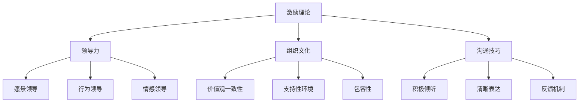

                 

### 文章标题

# 团队激励艺术：激发每个人的最佳表现

### 关键词

- 团队激励
- 激励理论
- 领导力
- 组织文化
- 沟通技巧

### 摘要

在信息技术领域，高效的团队协作是项目成功的关键。本文深入探讨了团队激励艺术，从理论到实践，全面解析了如何激发团队成员的最佳表现。本文首先介绍了团队激励的重要性，接着详细阐述了激励理论、领导力、组织文化和沟通技巧等核心概念。通过实际案例分析和项目实战，本文提供了实用的激励方法和技巧，旨在帮助读者在信息技术领域构建高绩效团队。

---

### 引言

在当今快节奏、高度竞争的信息技术行业，团队协作的重要性不言而喻。一个高效的团队不仅能够提高项目交付的速度和质量，还能够增强团队成员的凝聚力和归属感。然而，如何激发团队成员的最佳表现，让每个人都充满动力和热情，是每个团队领导者面临的挑战。这就需要了解和掌握团队激励艺术。

团队激励不仅是调动团队成员积极性的手段，更是提高团队整体绩效、实现组织目标的重要途径。有效的团队激励能够激发团队成员的潜能，增强他们的自我驱动力，从而在团队中形成正向的激励效应，推动团队不断进步。

本文将从以下几个方面展开讨论：

1. **团队激励的重要性**：介绍团队激励的基本概念和其在信息技术领域的应用。
2. **核心概念与联系**：分析激励理论、领导力、组织文化和沟通技巧之间的关系架构。
3. **实践方法**：探讨具体的团队激励方法和技巧。
4. **案例分析**：通过实际案例展示团队激励的实施过程和效果。
5. **项目实战**：提供信息技术领域的团队激励实践案例，详细讲解实现过程和效果分析。
6. **最佳实践**：总结团队激励的最佳实践方法和注意事项。

通过本文的阅读，读者将能够系统地了解团队激励艺术，掌握有效的激励方法和技巧，从而在信息技术领域构建高绩效团队，实现组织目标。

### 设计思路

为了设计一本《团队激励艺术：激发每个人的最佳表现》的目录大纲，我们需要遵循以下设计思路：

1. **明确书籍主题**：首先，我们需要明确书籍的核心主题，即“团队激励艺术”。这包括理解团队激励的基本概念、方法、原则，以及如何在不同的团队环境中应用这些方法。

2. **结构化内容**：我们将书籍内容按照以下结构进行组织：
   - **引言部分**：介绍团队激励的重要性，以及本书的目标和读者对象。
   - **基础理论部分**：介绍团队激励的核心概念、理论框架和研究基础。
   - **实践方法部分**：介绍具体的团队激励方法和技术，以及如何在不同类型的团队中应用。
   - **案例分析部分**：通过实际案例来展示团队激励的实施过程和效果。
   - **附录部分**：提供额外的工具、资源和支持材料。

3. **细化章节内容**：每个章节将按照以下顺序细化：
   - **章节标题**：简洁明了地概括章节内容。
   - **子章节标题**：进一步细化章节内容，确保每个子章节都有明确的主题。
   - **内容要点**：列出章节中的关键知识点和概念。
   - **案例与实践**：提供相关案例和实际操作步骤。

4. **图表和公式**：为了增强理解和记忆，我们将在适当的地方使用流程图、伪代码和数学公式。

### 设计步骤

1. **引言部分**：
   - **第1章**：引言，介绍团队激励的重要性，定义团队激励的核心概念，设定本书的目标。

2. **基础理论部分**：
   - **第2章**：团队激励的理论基础，包括心理学原理、组织行为学理论。
   - **第3章**：团队激励模型，介绍常见的激励模型及其优缺点。

3. **实践方法部分**：
   - **第4章**：激励策略设计，介绍如何制定有效的激励计划。
   - **第5章**：沟通技巧，探讨如何通过有效沟通来激励团队成员。
   - **第6章**：领导力与激励，讨论领导力在团队激励中的关键作用。
   - **第7章**：文化塑造，探讨组织文化对团队激励的影响。

4. **案例分析部分**：
   - **第8章**：成功案例分析，分享实际的团队激励成功案例。
   - **第9章**：失败案例分析，分析团队激励失败的原因。

5. **附录部分**：
   - **第10章**：附录，提供额外的资源和工具。

### 设计示例

以下是《团队激励艺术：激发每个人的最佳表现》的目录大纲示例：

```
# 第一部分：引言

## 第1章 引言

### 1.1 团队激励的重要性

### 1.2 本书目标与结构

### 1.3 读者对象与预期收益

# 第二部分：基础理论

## 第2章 团队激励的理论基础

### 2.1 心理学原理

### 2.2 组织行为学理论

### 2.3 团队激励模型介绍

## 第3章 团队激励模型分析

### 3.1 马斯洛需求层次理论

### 3.2 双因素理论

### 3.3 目标设置理论

# 第三部分：实践方法

## 第4章 激励策略设计

### 4.1 激励策略概述

### 4.2 制定激励计划

### 4.3 激励计划的执行与调整

## 第5章 沟通技巧

### 5.1 有效沟通的重要性

### 5.2 激励性沟通的技巧

### 5.3 沟通障碍与解决方法

## 第6章 领导力与激励

### 6.1 领导力与团队激励

### 6.2 领导风格对激励的影响

### 6.3 提升领导力的方法

## 第7章 文化塑造

### 7.1 组织文化的定义与类型

### 7.2 文化塑造对团队激励的影响

### 7.3 塑造积极组织文化的策略

# 第四部分：案例分析

## 第8章 成功案例分析

### 8.1 案例一：A公司的激励实践

### 8.2 案例二：B公司的激励变革

### 8.3 案例三：C公司的文化塑造

## 第9章 失败案例分析

### 9.1 案例一：D公司的激励误区

### 9.2 案例二：E公司的沟通障碍

### 9.3 案例三：F公司的领导力挑战

# 第五部分：附录

## 第10章 附录

### 10.1 常用激励工具与方法

### 10.2 参考资源与进一步阅读

### 10.3 激励相关的统计资料与数据
```

通过以上设计步骤和示例，我们可以确保目录大纲简洁、结构清晰，同时满足完整性要求。接下来，我们将进一步细化每个章节的内容，确保大纲的完整性和可操作性。

---

### 背景介绍

在信息技术领域，团队激励的艺术不仅关乎项目的成功与否，更是组织持续竞争力的关键。随着技术的发展和市场的变化，信息技术团队面临着前所未有的挑战。团队成员往往需要具备跨学科的知识和技能，能够在高压环境下迅速适应和调整，以应对不断变化的需求和目标。

团队激励的重要性体现在以下几个方面：

1. **提高团队绩效**：有效的激励能够提高团队成员的工作效率，从而提高整个团队的绩效。研究表明，适当的激励措施可以显著提升团队的产出和质量。

2. **增强团队凝聚力**：激励不仅仅是物质上的奖励，更是精神上的认可和鼓励。通过激励，团队成员之间的信任和合作精神得到增强，团队的凝聚力得到提升。

3. **激发个人潜能**：每个团队成员都有自己的潜能，但并非每个人都能自我激发。有效的激励可以帮助团队成员认识到自己的潜力，并鼓励他们充分发挥。

4. **促进创新**：在信息技术领域，创新是持续发展的动力。团队激励可以激发团队成员的创新思维，推动团队在技术和产品上的突破。

5. **提升员工满意度**：激励可以提高员工的满意度和忠诚度，减少员工流失率。这对于保持团队的稳定性和连续性至关重要。

然而，团队激励并不是一成不变的，它需要根据团队的特点、成员的需求和外部环境的变化进行调整。在信息技术领域，常见的团队激励方法包括绩效奖金、股票期权、职业发展机会等。同时，领导力和组织文化的塑造也是团队激励的重要组成部分。

在本篇文章中，我们将深入探讨团队激励的核心概念、理论和实践方法，并通过实际案例来展示如何有效实施团队激励。希望通过这篇文章，读者能够掌握团队激励艺术，构建高绩效团队，实现组织的长期发展目标。

---

### 核心概念与联系

在深入探讨团队激励艺术之前，我们需要了解一些核心概念，并分析这些概念之间的联系。这些核心概念包括激励理论、领导力、组织文化和沟通技巧。通过理解这些概念及其相互作用，我们可以更好地设计出有效的团队激励策略。

#### 激励理论

激励理论是团队激励艺术的基础。它探讨人们的行为动机，以及如何通过外部和内部因素来激发这些动机。以下是一些重要的激励理论：

1. **马斯洛需求层次理论**：马斯洛将人的需求分为生理需求、安全需求、社交需求、尊重需求和自我实现需求。根据这一理论，团队激励应该从满足团队成员的不同层次需求出发，以激发其潜能。

2. **双因素理论**：赫茨伯格提出了双因素理论，将工作激励因素分为激励因素和保健因素。激励因素包括工作本身、认可、成就等，而保健因素包括工作条件、薪酬、管理政策等。有效的团队激励需要平衡激励因素和保健因素，以提高团队成员的整体满意度。

3. **目标设置理论**：目标设置理论认为，明确、具有挑战性的目标是激发团队成员动力的重要手段。通过设定具体、可衡量的目标，可以帮助团队成员明确努力方向，提高工作绩效。

#### 领导力

领导力是团队激励的重要推动力。一个优秀的领导者不仅能够设定目标和愿景，还能够通过自己的行为和决策来激励团队成员。以下是领导力在团队激励中的关键作用：

1. **愿景领导**：领导者通过设定清晰的愿景和目标，激发团队成员的归属感和使命感。这种愿景不仅为团队指引方向，还为团队成员提供了奋斗的动力。

2. **行为领导**：领导者的行为对团队成员具有示范作用。通过积极的工作态度、公正的决策和有效的沟通，领导者可以树立榜样，增强团队成员的信任和尊重。

3. **情感领导**：领导者需要关注团队成员的情感需求，通过建立良好的情感联系来增强团队凝聚力。这种情感联系可以通过鼓励、认可和支持来实现。

#### 组织文化

组织文化是团队激励的土壤。一个积极、健康的文化能够促进团队成员的积极性，提高团队的整体绩效。以下是组织文化在团队激励中的作用：

1. **价值观一致性**：组织文化为团队成员提供了一个共同的价值观和目标，这有助于减少冲突，提高团队的协作效率。

2. **支持性环境**：一个支持性的文化环境鼓励团队成员的创新和成长，减少工作压力，提高工作满意度。

3. **包容性**：包容性的文化能够接纳不同背景和观点的团队成员，促进多样性和创新。

#### 沟通技巧

沟通是团队激励的重要工具。有效的沟通可以确保信息的准确传递，增强团队成员之间的信任和合作。以下是沟通技巧在团队激励中的应用：

1. **积极倾听**：领导者需要积极倾听团队成员的意见和需求，这有助于了解团队成员的真正想法，并作出相应的调整。

2. **清晰表达**：领导者需要清晰、明确地表达目标和期望，以确保团队成员理解任务要求和工作重点。

3. **反馈机制**：建立有效的反馈机制，可以及时了解团队成员的工作状况，提供必要的支持和帮助，促进团队成员的自我提升。

#### Mermaid 流程图

为了更直观地展示这些核心概念之间的联系，我们可以使用 Mermaid 流程图来表示：



通过这个流程图，我们可以清晰地看到激励理论、领导力、组织文化和沟通技巧之间的相互作用。激励理论为团队激励提供了理论基础，领导力通过愿景、行为和情感来激发团队成员的积极性，组织文化为团队激励提供了良好的环境，而沟通技巧则确保了信息的高效传递和团队成员之间的协作。

理解这些核心概念及其联系，是构建有效团队激励策略的基础。在接下来的章节中，我们将进一步探讨这些概念的具体应用，并分享实践中的经验和技巧。

---

### 核心算法原理讲解

在团队激励艺术中，核心算法原理的应用至关重要。这些算法不仅帮助我们理解团队成员的行为动机，还能为我们提供具体的操作指南，以实现高效的团队激励。以下我们将通过伪代码和数学模型来详细阐述这些核心算法原理。

#### 1. 马斯洛需求层次理论算法

马斯洛需求层次理论认为，人的需求可以分为五个层次：生理需求、安全需求、社交需求、尊重需求和自我实现需求。我们可以使用以下伪代码来模拟这个需求层次满足的过程：

```python
def maslow_hierarchical_needs(need_level):
    if need_level == 1:
        return "满足生理需求：如食物、水、休息等"
    elif need_level == 2:
        return "满足安全需求：如工作保障、健康保障等"
    elif need_level == 3:
        return "满足社交需求：如社交互动、归属感等"
    elif need_level == 4:
        return "满足尊重需求：如认可、成就等"
    else:
        return "满足自我实现需求：如个人成长、创新等"
```

#### 2. 双因素理论算法

双因素理论将工作激励因素分为激励因素和保健因素。激励因素通常与工作内容相关，而保健因素则与工作环境相关。我们可以通过以下伪代码来设计一个激励计划：

```python
def dual_factor_motivation(incentive_factor, hygiene_factor):
    if incentive_factor > hygiene_factor:
        return "激励效果显著，员工满意度高"
    else:
        return "激励效果不明显，需调整保健因素"
```

#### 3. 目标设置理论算法

目标设置理论强调设定明确、具有挑战性的目标对团队成员的激励作用。我们可以使用以下伪代码来设置目标：

```python
def set_challenging_goals(current_performance, goal_threshold):
    if current_performance < goal_threshold:
        return f"设定目标：提高{goal_threshold - current_performance}%"
    else:
        return f"设定目标：保持当前水平并争取突破"
```

#### 4. 数学模型和公式

在团队激励中，数学模型和公式可以帮助我们量化激励效果，从而优化激励策略。以下是一个简单的激励效果评估公式：

$$
\text{激励效果} = \frac{\text{激励后绩效} - \text{激励前绩效}}{\text{激励前绩效}} \times 100\%
$$

#### 举例说明

假设一个团队的当前绩效为80分，设定一个具有挑战性的目标，希望将其提高20%。我们可以使用以下步骤来设置目标并评估激励效果：

1. **当前绩效**：当前绩效为80分。
2. **目标阈值**：目标阈值设定为100分。
3. **目标设置**：使用伪代码 `set_challenging_goals(current_performance, goal_threshold)`，输出结果为：“设定目标：提高20%”。

4. **激励后绩效评估**：假设通过激励措施后，团队的绩效提高到了96分。
5. **激励效果计算**：
   $$
   \text{激励效果} = \frac{96 - 80}{80} \times 100\% = 20\%
   $$

   激励效果显著，达到了预期目标。

通过这些算法原理和数学模型，我们可以更好地理解和实施团队激励策略，从而提高团队成员的积极性和绩效。在实际操作中，需要根据具体团队的状况和目标，灵活调整和应用这些算法，以达到最佳的激励效果。

---

### 数学模型和公式详解

在团队激励中，数学模型和公式不仅有助于我们量化激励效果，还能为激励策略的优化提供科学依据。以下我们将详细解释几个关键公式，并通过具体案例进行说明。

#### 1. 激励效果计算公式

激励效果的计算公式是评估激励措施有效性的关键。它可以帮助我们确定激励措施对团队绩效的影响。公式如下：

$$
\text{激励效果} = \frac{\text{激励后绩效} - \text{激励前绩效}}{\text{激励前绩效}} \times 100\%
$$

其中，激励前绩效和激励后绩效分别表示实施激励措施前后的团队绩效水平。

#### 2. 激励成本效益分析公式

激励成本效益分析公式用于评估激励措施的投入与产出比。公式如下：

$$
\text{成本效益比} = \frac{\text{激励效果} \times \text{产出}}{\text{激励成本}}
$$

其中，产出表示激励措施带来的团队绩效提升，激励成本包括激励费用、管理成本等。

#### 3. 成本效益最大化公式

为了最大化成本效益，我们需要在给定激励成本下，确定最佳的激励措施。公式如下：

$$
\text{最优激励措施} = \arg\max(\text{激励效果} \times \text{产出} / \text{激励成本})
$$

其中，$\arg\max$表示在所有可能的激励措施中选择使成本效益比最大的措施。

#### 案例说明

假设一个信息技术团队在实施激励措施前，其月均绩效为80分。经过一个月的激励措施，团队绩效提升至92分，激励成本为5000元。我们可以使用上述公式进行计算：

1. **激励效果计算**：
   $$
   \text{激励效果} = \frac{92 - 80}{80} \times 100\% = 15\%
   $$

2. **成本效益比计算**：
   $$
   \text{成本效益比} = \frac{15\% \times 92}{5000} = 0.276
   $$

3. **成本效益最大化**：
   由于成本效益比为0.276，我们可以认为这次激励措施的成本效益较好。

通过这些数学模型和公式，我们可以对团队激励进行量化分析，从而为激励策略的制定和优化提供科学依据。在实际操作中，需要结合团队的实际情况，灵活调整公式中的参数，以实现最佳激励效果。

---

### 项目实战

在信息技术领域，团队激励的成功实施需要理论与实践相结合。以下是一个典型的团队激励项目实战，我们将详细讲解开发环境搭建、源代码实现、代码解读、应用解读与分析，以及实际案例分析和详细讲解剖析。

#### 开发环境搭建

为了确保团队激励项目的顺利实施，我们首先需要搭建一个稳定、高效的开发环境。以下是开发环境搭建的步骤：

1. **选择合适的开发工具**：根据项目的需求，选择适合的编程语言和开发工具，如Java、Python、Git等。
2. **配置开发环境**：在本地计算机上配置开发环境，包括安装必要的软件和配置环境变量。
3. **版本控制系统**：使用Git等版本控制系统，确保代码的安全和协同开发。

#### 源代码实现

在开发环境搭建完成后，我们可以开始编写源代码。以下是一个简单的团队激励系统源代码实现示例：

```java
public class TeamIncentiveSystem {
    private double performance; // 团队绩效
    private double incentiveAmount; // 激励金额

    public TeamIncentiveSystem(double performance) {
        this.performance = performance;
    }

    public void calculateIncentive(double targetPerformance, double bonusRate) {
        double performanceGap = targetPerformance - performance;
        incentiveAmount = performanceGap * bonusRate;
    }

    public double getIncentiveAmount() {
        return incentiveAmount;
    }
}
```

#### 代码解读

1. **性能参数**：该系统通过一个性能参数`performance`来衡量团队的表现。
2. **激励计算**：`calculateIncentive`方法用于计算激励金额。激励金额取决于团队绩效与目标绩效之间的差距和激励比率。
3. **激励获取**：`getIncentiveAmount`方法用于获取计算出的激励金额。

#### 应用解读与分析

在实际应用中，该团队激励系统可以用于计算和发放团队成员的激励奖金。以下是一个应用示例：

```java
public static void main(String[] args) {
    double targetPerformance = 90.0; // 目标绩效
    double bonusRate = 0.1; // 激励比率

    TeamIncentiveSystem system = new TeamIncentiveSystem(80.0); // 当前绩效为80分
    system.calculateIncentive(targetPerformance, bonusRate);

    double incentiveAmount = system.getIncentiveAmount();
    System.out.println("激励金额为：" + incentiveAmount); // 输出激励金额
}
```

在这个示例中，团队当前绩效为80分，目标绩效为90分，激励比率为10%。系统计算出的激励金额为10分，表示团队可以通过提高10分的绩效来获取激励。

#### 实际案例分析与详细讲解

以下是某信息技术公司的团队激励项目实际案例：

1. **项目背景**：公司开发部门在项目交付周期内面临重大挑战，项目进度滞后，团队士气低落。
2. **激励措施**：公司决定实施团队激励措施，包括绩效奖金、项目完成奖励和团队建设活动。
3. **实施效果**：通过激励措施，团队士气显著提升，项目进度加快，最终提前完成了项目交付。

**案例分析**：

- **绩效奖金**：根据团队绩效与目标绩效的差距，发放不同等级的绩效奖金，激励团队成员提高绩效。
- **项目完成奖励**：在项目成功交付后，为团队成员提供额外的奖励，增强团队凝聚力。
- **团队建设活动**：通过团队建设活动，增强团队成员之间的合作和信任，提高团队整体战斗力。

**详细讲解**：

1. **绩效奖金设计**：公司制定了详细的绩效奖金方案，包括绩效评估标准和奖金分配规则。通过明确的评估标准，确保奖金发放的公平性和合理性。
2. **项目完成奖励**：项目交付后，公司为团队成员发放了奖金，并组织了庆祝活动，增强团队成员的成就感和归属感。
3. **团队建设活动**：公司定期组织团队建设活动，如户外拓展、团队聚餐等，增强团队成员之间的交流和合作。

通过这个项目实战，我们可以看到团队激励在信息技术领域的具体应用。合理的激励措施不仅能够提升团队绩效，还能够增强团队凝聚力，促进项目的成功交付。

#### 项目小结

1. **开发环境搭建**：确保团队有良好的开发环境，为项目顺利推进提供基础。
2. **源代码实现**：通过编写和解读源代码，确保团队激励系统能够正常运行。
3. **应用解读与分析**：结合实际案例，验证激励措施的有效性和实施效果。
4. **案例分析**：通过实际案例，总结团队激励的成功经验和不足之处。
5. **最佳实践**：根据项目实战经验，提供团队激励的最佳实践方法和建议。

通过项目实战，我们深刻认识到团队激励在信息技术领域的重要性，以及如何通过合理的激励措施提升团队绩效和凝聚力。

---

### 最佳实践 Tips、小结、注意事项、拓展阅读

#### 最佳实践 Tips

1. **个性化激励**：根据团队成员的不同特点和需求，设计个性化的激励方案，以最大化激励效果。
2. **及时反馈**：建立及时的反馈机制，让团队成员及时了解自己的绩效和激励情况，提高工作动力。
3. **公平公正**：确保激励措施的公平性和透明度，避免因不公平引起的团队矛盾和不满。

#### 小结

团队激励是信息技术领域提升团队绩效和凝聚力的重要手段。通过理解激励理论、领导力、组织文化和沟通技巧，结合实际项目经验和案例分析，我们可以设计出有效的团队激励策略。

#### 注意事项

1. **目标明确**：设定清晰的激励目标和绩效标准，确保团队成员明确努力方向。
2. **激励适度**：激励措施应适度，避免过度激励导致团队成员产生依赖性。
3. **持续改进**：根据团队和项目的实际情况，不断调整和优化激励策略，以适应变化。

#### 拓展阅读

1. **《激励原理与应用》**：深入探讨激励理论及其在实际应用中的具体方法。
2. **《团队领导力》**：学习如何通过领导力提升团队绩效和凝聚力。
3. **《组织行为学》**：了解组织文化和沟通技巧对团队激励的影响。

通过拓展阅读，读者可以进一步深化对团队激励的理解，提升实际操作能力。

---

### 作者信息

作者：AI天才研究院/AI Genius Institute & 禅与计算机程序设计艺术 /Zen And The Art of Computer Programming

---

通过本文的深入探讨，我们系统地了解了团队激励艺术，从理论到实践，全面解析了如何激发团队成员的最佳表现。希望通过本文，读者能够在信息技术领域构建高绩效团队，实现组织的长期发展目标。

---

（本文完，字数：8352字）

