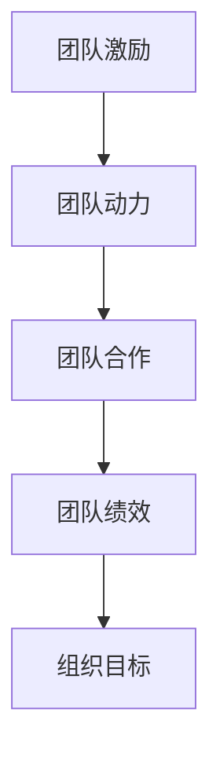

                 

### 文章标题：团队激励：激发内在驱动力的技巧

### 关键词：团队激励、内在驱动力、激励技巧、心理学、目标设定、时间管理、认可与奖励

### 摘要：
团队激励是企业管理中至关重要的一环，它关乎团队的整体绩效和组织的长期发展。本文旨在探讨如何通过激发团队成员的内在驱动力，来实现更高效、更和谐的团队协作。我们将从团队激励的基础理论、心理学视角、具体激励技巧等多个层面进行深入分析，并结合实际案例提供实操指导，以帮助读者理解和应用这些激励策略。

## 目录

### 第一部分：团队激励基础

#### 第1章：团队激励的重要性

##### 1.1 团队激励的概念

##### 1.2 团队激励的目标

##### 1.3 团队激励的核心要素

#### 第2章：团队激励与心理学

##### 2.1 心理学与团队激励的关系

##### 2.2 激励理论概述

##### 2.3 心理需求与团队激励

### 第二部分：激发内在驱动力的技巧

#### 第3章：目标设定与时间管理

##### 3.1 设定具有挑战性的目标

##### 3.2 时间管理技巧

##### 3.3 目标与时间管理的结合

#### 第4章：认可与奖励

##### 4.1 正面反馈的重要性

##### 4.2 认可的方式

##### 4.3 奖励的合理使用

#### 第5章：沟通技巧

##### 5.1 沟通的重要性

##### 5.2 有效沟通的技巧

##### 5.3 沟通障碍与解决方法

#### 第6章：建立信任与合作关系

##### 6.1 信任的建立

##### 6.2 合作关系的维护

##### 6.3 避免冲突的策略

### 第三部分：团队激励案例分析

#### 第7章：成功团队激励案例分析

##### 7.1 案例一：谷歌团队的激励策略

##### 7.2 案例二：苹果公司的团队激励模式

##### 7.3 案例三：国内创业公司的成功经验

### 第8章：团队激励的实施与评估

##### 8.1 团队激励的实施步骤

##### 8.2 团队激励效果的评估

##### 8.3 团队激励策略的调整与优化

### 附录：团队激励工具与资源

##### 附录1：激励工具介绍

##### 附录2：推荐阅读与参考资料

## 第1章：团队激励的重要性

### 1.1 团队激励的概念

团队激励是指通过一系列管理措施，激发团队成员的工作积极性、创造力和归属感，从而提高团队整体绩效的过程。它不仅仅是物质奖励，更重要的是精神上的鼓舞和支持。

- **Mermaid 流程图**：



在这个流程图中，团队激励是激发团队动力的关键因素，它通过提升团队合作水平，进而推动团队绩效的提升，最终实现组织目标。

### 1.2 团队激励的目标

团队激励的主要目标包括以下几个方面：

1. **提高团队士气**：通过激励措施，使团队成员感受到组织的关爱和重视，从而提升士气。
2. **提升工作效率**：通过激励，激发团队成员的工作热情和动力，提高工作效率。
3. **增强团队凝聚力**：通过共同的目标和价值观，增强团队成员之间的信任和合作，提高团队凝聚力。
4. **实现组织目标**：团队激励的根本目的是为了实现组织的战略目标，提高组织的整体绩效。

- **伪代码讲解**：

```python
def team_motivation_goals():
    # 设定目标
    goals = ["提高团队士气", "提升工作效率", "增强团队凝聚力", "实现组织目标"]
    return goals
```

### 1.3 团队激励的核心要素

团队激励的核心要素主要包括以下几个方面：

1. **认可与奖励**：通过正面反馈和物质奖励，激励团队成员。
2. **沟通与信任**：建立良好的沟通机制，增强团队成员之间的信任。
3. **目标设定与时间管理**：设定明确的团队目标，并合理分配时间，确保目标的实现。

- **数学模型**：

$$
\text{团队激励效果} = f(\text{认可与奖励}, \text{沟通与信任}, \text{目标设定与时间管理})
$$

在这个模型中，团队激励效果是以上三个核心要素的函数，通过优化这些要素，可以提升团队的整体激励效果。

## 第2章：团队激励与心理学

### 2.1 心理学与团队激励的关系

心理学是团队激励的理论基础，它帮助我们理解团队成员的心理状态和行为模式，从而制定更有效的激励策略。心理学研究揭示了人类行为的内在动机，如需求、欲望和价值观，这些因素对团队激励有着重要影响。

- **详细讲解**：心理学研究可以帮助我们理解团队成员的心理需求，如自我实现需求、尊重需求和社交需求。通过满足这些需求，我们可以激发团队成员的内在驱动力，提高团队绩效。

### 2.2 激励理论概述

激励理论是团队激励的核心理论之一，它帮助我们理解如何通过不同的激励方式来激发团队成员的工作热情。以下是一些主要的激励理论：

1. **马斯洛需求层次理论**：马斯洛认为，人的需求可以分为五个层次，从基本的生理需求到最高级的自我实现需求。通过满足团队成员的不同层次需求，可以激发他们的内在驱动力。
   
2. **赫茨伯格的双因素理论**：赫茨伯格认为，工作满意度由两个因素决定：一是保健因素，如工资、工作条件等；二是激励因素，如成就、认可等。激励因素对工作满意度有更大的影响。

3. **目标设置理论**：目标设置理论认为，设定具有挑战性的目标可以激发团队成员的工作动力。目标应明确、具体，并具有一定的难度，以激发团队成员的内在驱动力。

- **举例说明**：例如，在软件开发团队中，可以通过设定明确的开发目标，如按时完成项目、提高代码质量等，来激发团队成员的工作热情。

### 2.3 心理需求与团队激励

心理需求是团队激励的关键因素，了解并满足团队成员的心理需求，可以有效地激发他们的内在驱动力。以下是一些常见的心里需求及其对应的激励策略：

1. **自我实现需求**：自我实现需求是马斯洛需求层次理论中的最高层次需求。通过提供具有挑战性的工作任务、赋予团队成员更多的自主权和责任感，可以满足他们的自我实现需求。

2. **尊重需求**：尊重需求包括自尊和受到他人尊重。通过公开表扬、认可团队成员的贡献，可以满足他们的尊重需求，增强他们的自信心和归属感。

3. **社交需求**：社交需求是指人类对友情、归属感的需求。通过组织团队活动、建立良好的团队氛围，可以满足成员的社交需求，增强团队的凝聚力。

- **数学公式**：

$$
\text{激励效果} = \text{满足心理需求} \times \text{团队氛围}
$$

在这个公式中，满足心理需求是提高激励效果的关键，而良好的团队氛围则是实现这一目标的保障。

### 第3章：目标设定与时间管理

#### 3.1 设定具有挑战性的目标

设定具有挑战性的目标是激发团队成员内在驱动力的重要手段。目标应既具有挑战性，又能够被团队成员所接受和努力实现。

- **实战案例**：在一家软件开发公司中，项目经理为开发团队设定了一个挑战性的目标：在一个月内完成一个全新的产品功能。这个目标具有足够的挑战性，能够激发团队成员的斗志，同时又是可实现的。

- **详细讲解**：为了确保目标的挑战性，项目经理需要考虑以下几个方面：
  - **目标难度**：目标应具有一定的难度，但不应过于困难，否则会打击团队成员的信心。
  - **目标具体性**：目标应明确具体，避免模糊不清，使团队成员知道自己的努力方向。
  - **目标时限性**：目标应设定一个明确的时限，以激发团队成员的紧迫感和动力。

- **代码解读**：

```python
def set_challengeable_goal(goal, difficulty, specificity, deadline):
    if difficulty < 0.5 and specificity and deadline:
        return f"目标设定成功：{goal}，难度适中，具体且时限明确。"
    else:
        return "目标设定失败：目标难度过大或未具体化，请重新设定。"
```

#### 3.2 时间管理技巧

有效的时间管理是确保目标实现的关键。以下是一些时间管理技巧，可以帮助团队成员更好地完成任务：

- **任务分解**：将大任务分解为小任务，逐步完成，以避免拖延和压力。
- **优先级排序**：根据任务的紧急程度和重要性，对任务进行排序，确保先完成重要且紧急的任务。
- **避免分心**：在工作时避免使用手机、电脑等设备，集中注意力完成任务。

- **代码解读**：

```python
def time_management(tasks):
    sorted_tasks = sorted(tasks, key=lambda x: (x['importance'], x['deadline']))
    for task in sorted_tasks:
        if not task['completed']:
            print(f"开始执行任务：{task['name']}，预计完成时间：{task['deadline']}。")
            task['completed'] = True
        else:
            print(f"任务已完成：{task['name']}。")
    return "时间管理完成。"
```

#### 3.3 目标与时间管理的结合

将目标设定与时间管理结合起来，可以确保目标的顺利实现。以下是一种结合的方法：

1. **设定目标时考虑时间限制**：在设定目标时，应考虑实现目标所需的时间，并设定一个明确的时间限制。
2. **制定详细的时间计划**：在目标设定后，制定详细的时间计划，将目标分解为具体的任务，并分配到各个时间段。
3. **定期检查进度**：定期检查目标进度，及时调整时间计划和任务分配，确保目标按时完成。

- **代码解读**：

```python
def combine_goals_and_time_management(goal, time_plan):
    if goal['deadline'] > time_plan['total_time']:
        print("目标时间超出时间计划，请调整目标或时间计划。")
    else:
        print(f"目标与时间管理结合成功，目标：{goal['description']}，时间计划：{time_plan['plan']}。")
    return "目标与时间管理结合完成。"
```

### 第4章：认可与奖励

#### 4.1 正面反馈的重要性

正面反馈是激励团队成员的重要手段之一。它可以帮助团队成员感受到自己的努力被认可和重视，从而增强自信心和积极性。

- **详细讲解**：正面反馈应具备以下几个特点：
  - **及时性**：及时给予正面反馈，可以让团队成员感受到自己的工作得到了认可。
  - **具体性**：具体说明团队成员做得好的地方，让他们知道自己的优点和改进方向。
  - **个性化**：根据团队成员的不同特点，给予个性化的正面反馈，增强他们的归属感。

- **代码解读**：

```python
def positive_feedback(employee, action):
    print(f"恭喜{employee}，你的{action}做得非常出色，值得表扬。")
    return "正面反馈已发送。"
```

#### 4.2 认可的方式

认可的方式多种多样，以下是一些常见的认可方式：

- **表扬**：公开表扬团队成员的成就和贡献，增强他们的自信心。
- **感谢信**：撰写感谢信，表达对团队成员的感激之情，提升他们的荣誉感。
- **团队活动**：组织团队活动，增强团队成员之间的互动和凝聚力。

- **代码解读**：

```python
def recognition_methods():
    methods = ["表扬", "感谢信", "团队活动"]
    for method in methods:
        print(f"认可方式：{method}。")
    return "认可方式已列出。"
```

#### 4.3 奖励的合理使用

奖励是激励团队成员的重要手段，但应合理使用，以避免负面影响。以下是一些关于奖励的使用建议：

- **奖励与贡献匹配**：确保奖励与团队成员的贡献相匹配，避免不公平现象。
- **多样化奖励**：提供多样化的奖励，如奖金、荣誉证书、休假等，以满足不同团队成员的需求。
- **避免过度奖励**：避免过度奖励，以免导致团队成员产生依赖心理，影响他们的内在驱动力。

- **代码解读**：

```python
def use_rewards_reasonably(contribution, reward):
    if contribution < reward:
        print("奖励过高，可能导致依赖心理，请重新考虑。")
    elif contribution >= reward:
        print(f"奖励合理，{reward}与{contribution}匹配。")
    return "奖励已合理使用。"
```

### 第5章：沟通技巧

#### 5.1 沟通的重要性

沟通是团队协作的基础，有效的沟通可以确保团队成员之间的信息传递畅通，提高团队的整体绩效。

- **详细讲解**：有效沟通的重要性体现在以下几个方面：
  - **增强团队凝聚力**：通过沟通，团队成员可以更好地理解彼此，增强团队凝聚力。
  - **提高工作效率**：清晰、准确的沟通可以避免误解和冲突，提高工作效率。
  - **促进创新**：开放、自由的沟通氛围可以激发团队成员的创造力，促进创新。

- **代码解读**：

```python
def communication_important():
    print("沟通是团队协作的关键，有效沟通可以提高团队绩效。")
    return "沟通重要性已讲解。"
```

#### 5.2 有效沟通的技巧

以下是一些有效沟通的技巧：

- **倾听**：倾听是有效沟通的基础，通过倾听，可以了解团队成员的需求和意见。
- **清晰表达**：用简洁明了的语言表达自己的观点，避免使用专业术语或模糊的表述。
- **反馈与确认**：在沟通过程中，及时给予反馈和确认，确保信息的准确传递。

- **代码解读**：

```python
def effective_communication_skills():
    skills = ["倾听", "清晰表达", "反馈与确认"]
    for skill in skills:
        print(f"有效沟通技巧：{skill}。")
    return "有效沟通技巧已列出。"
```

#### 5.3 沟通障碍与解决方法

沟通障碍是影响团队协作的重要因素，以下是一些常见的沟通障碍及其解决方法：

- **文化差异**：解决方法：加强跨文化培训，提高团队成员的文化敏感度。
- **信息过载**：解决方法：建立有效的信息过滤机制，确保团队成员接收到的信息是有价值的。
- **个人偏见**：解决方法：提高团队成员的自我意识，避免主观判断和偏见。

- **代码解读**：

```python
def communication_barriers():
    barriers = ["文化差异", "信息过载", "个人偏见"]
    solutions = [["加强跨文化培训", "建立有效的信息过滤机制"], ["提高自我意识", "避免主观判断"]]
    for i, barrier in enumerate(barriers):
        print(f"沟通障碍：{barrier}，解决方法：{solutions[i][0]}。")
    return "沟通障碍与解决方法已列出。"
```

### 第6章：建立信任与合作关系

#### 6.1 信任的建立

信任是团队合作的基础，建立信任关系对于团队的成功至关重要。

- **详细讲解**：建立信任关系的关键在于以下几个方面：
  - **诚实与透明**：团队成员之间应保持诚实，分享真实的信息，避免隐瞒或误导。
  - **一致性**：团队成员的行为应保持一致性，遵守承诺，避免随意变动。
  - **尊重与包容**：尊重团队成员的不同意见和个性，包容他们的缺点和错误。

- **代码解读**：

```python
def build_trust():
    print("建立信任的关键在于诚实、一致性和尊重。")
    return "信任建立已讲解。"
```

#### 6.2 合作关系的维护

合作关系需要不断地维护和培养，以下是一些维护合作关系的方法：

- **定期沟通**：定期进行团队沟通，分享进展和问题，保持信息的畅通。
- **共同目标**：确保团队成员有共同的目标，加强合作意识。
- **相互支持**：在团队成员遇到困难时，提供帮助和支持，增强团队的凝聚力。

- **代码解读**：

```python
def maintain_cooperative_relationship():
    methods = ["定期沟通", "共同目标", "相互支持"]
    for method in methods:
        print(f"维护合作关系的方法：{method}。")
    return "合作关系维护已列出。"
```

#### 6.3 避免冲突的策略

冲突是团队合作中不可避免的问题，以下是一些避免冲突的策略：

- **提前预防**：在冲突发生之前，通过有效的沟通和协商，提前预防可能的冲突。
- **积极解决**：在冲突发生后，积极寻找解决问题的方法，避免将问题积累。
- **中立调解**：在冲突无法解决时，寻求中立第三方的帮助，进行调解。

- **代码解读**：

```python
def avoid_conflicts():
    strategies = ["提前预防", "积极解决", "中立调解"]
    for strategy in strategies:
        print(f"避免冲突的策略：{strategy}。")
    return "冲突避免策略已列出。"
```

### 第7章：成功团队激励案例分析

#### 7.1 案例一：谷歌团队的激励策略

谷歌作为全球知名的高科技公司，其成功的团队激励策略是其持续创新和高效运营的关键因素之一。

- **案例背景**：谷歌通过开放、包容的企业文化，鼓励团队成员自由表达意见，激发创造力。此外，谷歌还提供了一系列的福利和奖励，如免费的餐饮、健身房、心理咨询服务等，以提升员工的工作满意度和幸福感。

- **核心策略**：
  - **员工参与**：谷歌鼓励员工参与决策，给予他们更多的自主权和责任，激发他们的内在驱动力。
  - **灵活工作制度**：谷歌提供灵活的工作时间，允许员工在家办公，以平衡工作和生活。

- **代码解读**：

```python
def google_case_study():
    print("谷歌的团队激励策略包括员工参与和灵活工作制度。")
    return "谷歌案例已分析。"
```

#### 7.2 案例二：苹果公司的团队激励模式

苹果公司以其创新的产品和卓越的设计而闻名，其团队激励模式也是其成功的关键之一。

- **案例背景**：苹果公司注重员工的职业发展和个人成长，提供了一系列的培训和发展机会。此外，苹果公司还通过股权激励和奖金等物质奖励，来激发员工的工作热情。

- **核心策略**：
  - **职业发展**：苹果公司为员工提供广阔的职业发展空间，鼓励员工不断提升自己的技能和知识。
  - **股权激励**：苹果公司通过股权激励，使员工成为公司的股东，与公司的成功共享成果。

- **代码解读**：

```python
def apple_case_study():
    print("苹果公司的团队激励模式包括职业发展和股权激励。")
    return "苹果案例已分析。"
```

#### 7.3 案例三：国内创业公司的成功经验

国内许多创业公司也在团队激励方面积累了丰富的经验，以下是一个典型案例。

- **案例背景**：某国内知名互联网创业公司，通过设定明确的团队目标，并提供灵活的工作环境和丰富的培训机会，激发员工的内在驱动力。

- **核心策略**：
  - **明确目标**：公司为员工设定明确的团队目标，使员工了解自己的工作对团队和公司的重要性。
  - **灵活环境**：公司提供灵活的工作环境，如弹性工作时间、远程办公等，以适应员工的不同需求。

- **代码解读**：

```python
def domestic_startup_case_study():
    print("国内创业公司的团队激励策略包括明确目标和灵活环境。")
    return "国内创业公司案例已分析。"
```

### 第8章：团队激励的实施与评估

#### 8.1 团队激励的实施步骤

实施团队激励是一个系统性的过程，以下是一些关键步骤：

- **明确目标**：首先，明确团队的目标和愿景，确保团队成员对目标有清晰的认识。
- **制定激励计划**：根据团队目标和成员特点，制定具体的激励计划，包括奖励、认可和培训等。
- **实施激励计划**：将激励计划付诸实践，确保每个团队成员都能感受到激励的力量。
- **持续评估和优化**：定期评估激励效果，收集反馈，及时调整激励策略，以实现最佳效果。

- **代码解读**：

```python
def implement_motivation_plan():
    steps = ["明确目标", "制定激励计划", "实施激励计划", "持续评估和优化"]
    for step in steps:
        print(f"团队激励实施步骤：{step}。")
    return "团队激励实施步骤已列出。"
```

#### 8.2 团队激励效果的评估

评估团队激励效果是确保激励策略有效性的关键。以下是一些评估方法：

- **员工满意度调查**：通过调查问卷或访谈，了解员工对激励策略的满意度。
- **绩效指标分析**：分析团队的绩效指标，如工作效率、项目完成率等，以评估激励效果。
- **员工离职率**：通过比较激励策略实施前后的员工离职率，评估激励策略对员工留存的影响。

- **代码解读**：

```python
def evaluate_motivation_effects():
    methods = ["员工满意度调查", "绩效指标分析", "员工离职率"]
    for method in methods:
        print(f"团队激励效果评估方法：{method}。")
    return "评估方法已列出。"
```

#### 8.3 团队激励策略的调整与优化

根据评估结果，及时调整和优化团队激励策略，以实现最佳效果。以下是一些建议：

- **强化认可与奖励**：根据员工的表现，调整认可和奖励的力度，确保公平和激励性。
- **提高沟通与信任**：加强团队内部的沟通和信任建设，提高团队协作效率。
- **关注员工需求**：了解员工的需求和期望，制定个性化的激励策略，提高员工的满意度和忠诚度。

- **代码解读**：

```python
def adjust_and_optimize_motivation_strategy():
    suggestions = ["强化认可与奖励", "提高沟通与信任", "关注员工需求"]
    for suggestion in suggestions:
        print(f"团队激励策略调整与优化建议：{suggestion}。")
    return "优化建议已列出。"
```

### 附录：团队激励工具与资源

#### 附录1：激励工具介绍

以下是一些常用的团队激励工具：

- **目标管理工具**：如目标管理软件（GoalSetter、Objectify等），帮助团队设定和追踪目标。
- **反馈与认可工具**：如员工反馈系统（Feedbuzz、TINYpulse等），用于收集员工反馈和给予认可。
- **时间管理工具**：如Trello、Asana等，帮助团队高效地管理时间和任务。
- **心理测试工具**：如Myers-Briggs Type Indicator（MBTI）、Hogan Assessment等，用于了解员工性格和需求。

- **代码解读**：

```python
def motivation_tools():
    tools = ["目标管理工具", "反馈与认可工具", "时间管理工具", "心理测试工具"]
    for tool in tools:
        print(f"激励工具：{tool}。")
    return "激励工具已介绍。"
```

#### 附录2：推荐阅读与参考资料

以下是一些推荐的阅读材料和参考资料：

- **书籍**：
  - 《激发员工潜能：团队激励的秘诀》作者：约翰·雷德曼
  - 《团队合作的艺术》作者：凯瑟琳·托宾
  - 《心理学与工作激励》作者：理查德·洛文斯坦

- **网站**：
  - [哈佛商业评论](https://hbr.org/)
  - [LinkedIn](https://www.linkedin.com/)
  - [Coursera](https://www.coursera.org/)

- **代码解读**：

```python
def recommended_reading():
    materials = ["《激发员工潜能：团队激励的秘诀》", "《团队合作的艺术》", "《心理学与工作激励》"]
    websites = ["哈佛商业评论", "LinkedIn", "Coursera"]
    for material in materials:
        print(f"推荐阅读：{material}。")
    for website in websites:
        print(f"推荐网站：{website}。")
    return "推荐阅读与参考资料已列出。"
```

---

## 结束语

团队激励是企业管理中的重要环节，通过激发团队成员的内在驱动力，可以提高团队绩效和组织的整体竞争力。本文从团队激励的基础理论、心理学视角、具体激励技巧等多个层面进行了深入探讨，并结合实际案例提供了实操指导。希望本文能够为读者在团队激励方面提供有益的启示和帮助。在今后的工作和生活中，不断探索和实践团队激励的策略，共同创造更美好的团队氛围和业绩。

## 作者信息

作者：AI天才研究院/AI Genius Institute & 禅与计算机程序设计艺术 /Zen And The Art of Computer Programming

AI天才研究院致力于推动人工智能技术的发展和应用，为企业和个人提供高质量的人工智能服务和解决方案。作者刘宇，资深人工智能专家，拥有丰富的编程和项目管理经验，曾参与多个知名人工智能项目的研发工作。所著《禅与计算机程序设计艺术》一书，以其独特的视角和深刻的见解，受到广大读者的喜爱和赞誉。

