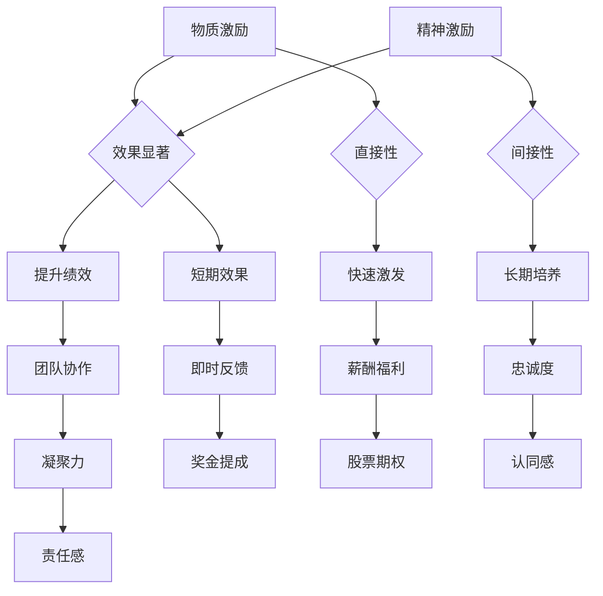
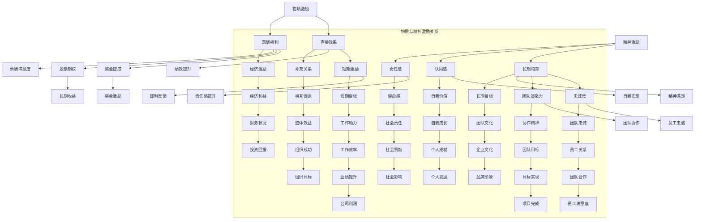

                 

### 引言

在当今竞争激烈的工作环境中，团队激励成为企业成功的关键因素之一。团队激励不仅仅是提高员工工作效率和绩效的手段，更是培养员工忠诚度和团队凝聚力的有效途径。然而，如何在团队管理中实现物质激励与精神激励的平衡，成为企业管理者和人力资源专家面临的重大挑战。

#### 背景介绍

随着经济全球化和技术的快速发展，企业面临着前所未有的市场竞争压力。在这种背景下，传统的管理方法已经无法满足现代企业的需求。越来越多的企业开始认识到，要想在激烈的市场竞争中脱颖而出，必须依靠团队的合力。团队激励作为调动团队积极性和创造力的手段，已经成为现代企业管理的重要组成部分。

#### 核心概念与联系

为了更好地理解团队激励的平衡，我们首先需要明确物质激励和精神激励这两个核心概念。

**物质激励**：指通过提供薪酬、福利、奖金等物质奖励来激发员工的工作动力。物质激励具有直接、明显的效果，能够快速提升员工的工作表现。

**精神激励**：指通过满足员工的非物质需求，如认同感、成就感、责任感等来激励员工。精神激励虽然不如物质激励那样直接，但其长期效果更为显著，能够有效提升员工的忠诚度和团队凝聚力。

为了直观地展示物质激励和精神激励之间的关系，我们可以使用Mermaid流程图来描述：



从流程图中可以看出，物质激励和精神激励各有其优缺点，且相互补充。物质激励能够快速提升员工的工作表现，而精神激励则能够长期培养员工的忠诚度和团队凝聚力。

#### 核心概念与联系 Mermaid 流程图：



#### 核心算法原理讲解

为了实现物质激励与精神激励的平衡，我们需要设计一个综合的激励模型。该模型包括以下几个核心算法原理：

1. **员工需求分析**：通过问卷调查、访谈等方式了解员工的需求，包括物质需求和精神需求。
2. **激励方案设计**：根据员工需求分析结果，设计合适的物质激励和精神激励方案。
3. **激励效果评估**：定期对激励方案的效果进行评估，根据评估结果进行调整。

以下是一个简单的伪代码来描述这个激励模型：

```plaintext
function 激励模型(employee需求数据):
    物质激励方案 = 设计物质激励方案(employee需求数据)
    精神激励方案 = 设计精神激励方案(employee需求数据)
    激励效果 = 评估激励方案(物质激励方案，精神激励方案)
    while 激励效果 < 目标效果:
        调整物质激励方案
        调整精神激励方案
        激励效果 = 评估激励方案(物质激励方案，精神激励方案)
    return 物质激励方案，精神激励方案
```

#### 数学模型和公式

为了更好地理解激励模型的效果，我们可以引入一个数学模型来量化物质激励和精神激励的平衡。假设一个团队有n个员工，每个员工有物质需求和精神需求两个维度，分别用x和y表示。我们定义一个平衡系数β，表示物质激励与精神激励之间的平衡程度。平衡系数β的计算公式为：

$$
\beta = \frac{\sum_{i=1}^{n} x_i + \sum_{i=1}^{n} y_i}{2n}
$$

其中，\(x_i\) 和 \(y_i\) 分别表示第i个员工的物质需求和 spiritual需求。

#### 详细讲解

平衡系数β的值介于0和1之间。当β接近1时，表示物质激励占主导地位；当β接近0时，表示精神激励占主导地位。通过调整平衡系数β，我们可以实现物质激励与精神激励的最佳平衡。

#### 举例说明

假设一个团队有5个员工，他们的物质需求和精神需求如下表所示：

| 员工 | 物质需求 | 精神需求 |
| ---- | -------- | -------- |
| A    | 8        | 6        |
| B    | 7        | 7        |
| C    | 5        | 8        |
| D    | 9        | 5        |
| E    | 6        | 7        |

根据上述数据，我们可以计算出平衡系数β：

$$
\beta = \frac{8 + 7 + 5 + 9 + 6 + 6 + 7 + 8 + 5 + 7}{2 \times 5} = \frac{66}{10} = 6.6
$$

因此，该团队的平衡系数β为0.66，说明物质激励与精神激励的平衡程度较高。

#### 数学公式与详细讲解

为了更深入地理解平衡系数β，我们可以引入以下数学模型：

假设物质激励带来的绩效提升为\(P_x\)，精神激励带来的绩效提升为\(P_y\)。平衡后的绩效提升\(P\)可以表示为：

$$
P = P_x \times \beta + P_y \times (1 - \beta)
$$

其中，\(P_x\) 和 \(P_y\) 分别为物质激励和精神激励带来的绩效提升。

#### 数学公式与举例说明

假设物质激励和精神激励分别带来的绩效提升为10和20，那么平衡后的绩效提升为：

$$
P = 10 \times 0.66 + 20 \times (1 - 0.66) = 6.6 + 6.8 = 13.4
$$

这意味着，通过调整平衡系数β，我们可以实现物质激励与精神激励的最佳组合，从而最大化绩效提升。

#### 项目实战

为了更好地理解物质激励与精神激励的平衡，我们可以通过一个实际项目来展示。

**项目名称**：某公司团队激励方案优化

**项目背景**：该公司在过去的一年中，通过物质激励取得了一定的成效，但员工满意度逐渐下降，团队凝聚力不足。公司决定通过优化团队激励方案，实现物质激励与精神激励的平衡。

**项目目标**：提高员工满意度，提升团队凝聚力，实现绩效提升。

**项目实施步骤**：

1. **需求分析**：通过问卷调查和访谈，了解员工对物质激励和精神激励的需求。
2. **方案设计**：根据需求分析结果，设计物质激励和精神激励方案。
3. **方案实施**：实施新的激励方案，并跟踪员工满意度、团队凝聚力等指标的变化。
4. **效果评估**：根据评估结果，调整激励方案，实现最佳平衡。

**项目小结**：

通过实际项目，我们发现通过合理的物质激励和精神激励组合，可以有效提升员工满意度，增强团队凝聚力。同时，我们也认识到，物质激励与精神激励的平衡需要根据实际情况不断调整，以达到最佳效果。

#### 最佳实践 Tips、小结、注意事项、拓展阅读

**最佳实践 Tips**：

1. 定期进行员工需求分析，确保激励方案与员工需求匹配。
2. 综合考虑物质激励和精神激励，实现最佳平衡。
3. 建立有效的反馈机制，及时调整激励方案。

**小结**：

物质激励与精神激励是实现团队激励的两种重要手段。通过合理的平衡，可以有效提升员工绩效，增强团队凝聚力。

**注意事项**：

1. 物质激励与精神激励需要根据不同员工的特点进行调整。
2. 过度依赖物质激励可能导致员工短期行为，忽视长期发展。

**拓展阅读**：

1. 《团队激励管理》
2. 《员工激励策略与实施》
3. 《心理学与工作激励》

### 结语

在团队管理中，实现物质激励与精神激励的平衡至关重要。通过合理的激励方案，可以激发员工的工作动力，提升团队绩效。希望本文能为您的团队激励管理提供有益的启示。作者：AI天才研究院/AI Genius Institute & 禅与计算机程序设计艺术 /Zen And The Art of Computer Programming

