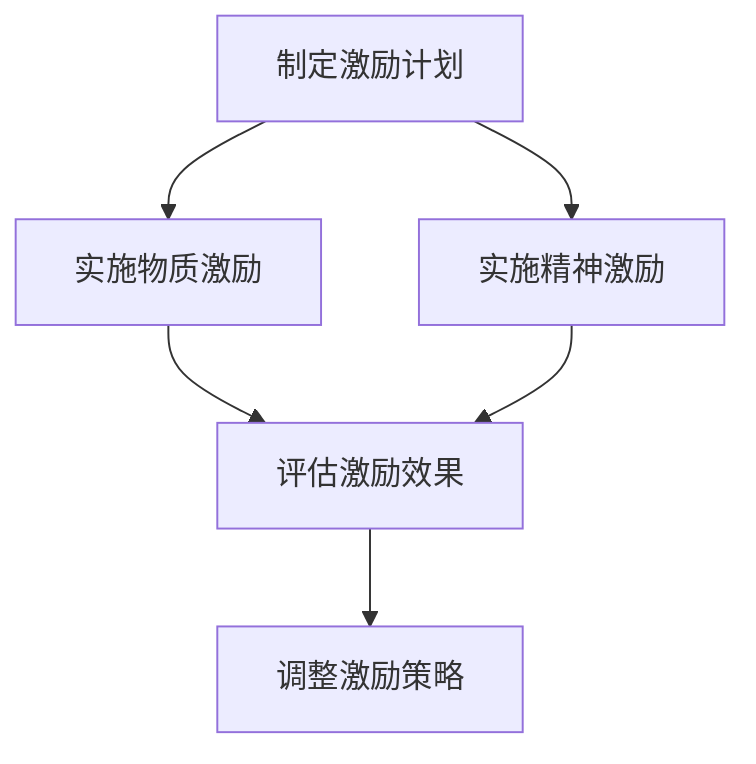
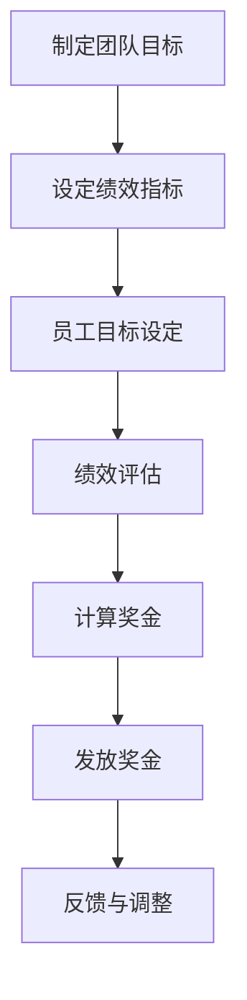

                 

### 《团队激励：物质与精神的双重激励》

在当今高速发展的信息技术时代，团队成员的激励成为企业成功的关键因素之一。有效的团队激励不仅可以提升员工的工作热情和创造力，还能增强团队的凝聚力和执行力。本文将围绕《团队激励：物质与精神的双重激励》这一主题，深入探讨团队激励的定义、物质激励与精神激励的关系、理论基础、策略实施以及案例分析等内容。通过这篇文章，我们希望能够为企业在团队激励方面提供有价值的参考和指导。

#### 关键词

- 团队激励
- 物质激励
- 精神激励
- 动机理论
- 期望理论
- 公平理论
- 案例分析

#### 摘要

本文旨在探讨团队激励中物质激励与精神激励的双重作用及其有机结合。首先，我们将介绍团队激励的定义及其重要性，然后分别阐述物质激励与精神激励的概念、优缺点以及相互关系。接着，我们将从理论基础出发，分析动机理论、期望理论和公平理论在团队激励中的应用。随后，文章将详细探讨物质激励策略，包括薪酬激励、奖金激励和福利激励的设计原则与实施技巧。接下来，我们将介绍精神激励策略，包括荣誉激励、职业发展激励和工作环境激励的实施方法。在双重激励的综合运用部分，我们将探讨如何有效地结合物质激励与精神激励，并对团队激励的评估与反馈机制进行探讨。最后，通过国内外团队激励成功和失败的案例分析，总结出最佳实践和注意事项。

### 第一部分：团队激励概述

#### 1.1 团队激励的定义与重要性

团队激励是指通过一系列措施和手段，激发团队成员的工作积极性、创造力和归属感，以提高团队的整体绩效和企业的竞争力。团队激励不仅关注个体的成长和发展，更注重团队整体目标的实现。其重要性体现在以下几个方面：

1. **提升工作效率**：有效的团队激励能够激发员工的工作热情，提高工作效率和产出。
2. **增强团队凝聚力**：团队激励有助于增强团队成员之间的信任和合作，提高团队凝聚力。
3. **促进创新与学习**：团队激励能够鼓励员工不断创新和学习，提升团队的整体竞争力。
4. **优化人才管理**：团队激励有助于吸引和留住优秀人才，优化企业的人才结构。

#### 1.2 物质激励与精神激励的关系

物质激励与精神激励是团队激励中的两个重要组成部分。物质激励主要指通过薪酬、奖金、福利等有形奖励来激励员工，而精神激励则侧重于通过荣誉、认可、职业发展等无形奖励来提升员工的满意度。两者之间的关系如下：

1. **相辅相成**：物质激励与精神激励在团队激励中相辅相成，共同发挥作用。物质激励可以满足员工的基本需求，而精神激励则能满足员工更高层次的需求，如尊重、自我实现等。
2. **有机结合**：在实际应用中，物质激励与精神激励需要有机结合，以达到最佳激励效果。例如，在实施薪酬激励的同时，可以设立表彰大会，对优秀员工进行公开表扬，从而实现双重激励。
3. **动态调整**：团队激励需要根据实际情况动态调整物质激励与精神激励的比例，以适应员工的不同需求。

#### 1.3 团队激励的理论基础

团队激励的理论基础主要包括动机理论、期望理论和公平理论等。

1. **动机理论**：动机理论认为，个体的行为是由内在动机和外部动机共同驱动的。内在动机是指个体对工作本身的兴趣和热情，而外部动机则是指由外部奖励和惩罚引起的动机。团队激励的目标是激发员工的内在动机，使其在追求个人成就感的同时，为团队的目标贡献自己的力量。
2. **期望理论**：期望理论认为，个体的行为决策是基于对期望收益和期望成本的评估。团队激励需要通过设定明确的绩效目标和奖励机制，使员工在实现个人目标的同时，也能为团队的目标作出贡献。
3. **公平理论**：公平理论认为，个体在比较自己与他人的收益和付出时，会形成公平感。团队激励需要确保激励措施的公平性，以避免员工产生不公平感，影响团队氛围。

### 第二部分：物质激励策略

#### 2.1 物质激励的种类

物质激励是团队激励中的重要组成部分，主要包括薪酬激励、奖金激励和福利激励等。

1. **薪酬激励**：薪酬激励是指通过设定具有竞争力的薪酬水平，激发员工的工作积极性。薪酬激励的设计原则包括：
   - **竞争力**：薪酬水平应高于同行业同岗位的平均水平，以吸引和留住优秀人才。
   - **公平性**：薪酬分配应公平合理，避免产生内部矛盾。
   - **可成长性**：薪酬水平应随着员工的工作年限和绩效表现逐步提升，以激励员工持续努力。
2. **奖金激励**：奖金激励是指通过设定各种奖金项目，对员工的优秀表现进行奖励。奖金激励的实施技巧包括：
   - **项目奖金**：根据项目的完成情况和质量进行奖励，以激励员工在项目中的积极表现。
   - **绩效奖金**：根据员工的绩效评估结果进行奖励，以激励员工在工作中追求卓越。
   - **创新奖金**：对员工的创新成果进行奖励，以鼓励员工积极创新。
3. **福利激励**：福利激励是指通过提供各种福利措施，提高员工的生活质量和工作满意度。福利激励的多样化包括：
   - **健康保障**：提供医疗保险、健康体检等福利，关心员工的身体健康。
   - **带薪休假**：提供带薪年假、病假等福利，关心员工的休息与康复。
   - **员工活动**：组织各种员工活动，如团队建设活动、节日庆祝活动等，增强员工的归属感。

#### 2.2 薪酬激励的设计原则

薪酬激励的设计原则主要包括以下几个方面：

1. **竞争力**：薪酬水平应具备竞争力，以吸引和留住优秀人才。具体措施包括：
   - **市场调查**：通过市场调研了解同行业同岗位的平均薪酬水平，确保薪酬具有竞争力。
   - **岗位评估**：对岗位进行评估，确定各岗位的价值和贡献，合理设定薪酬水平。
   - **薪酬结构**：合理设定薪酬结构，包括基本工资、绩效工资、奖金等，以满足员工的不同需求。
2. **公平性**：薪酬分配应公平合理，避免产生内部矛盾。具体措施包括：
   - **透明度**：薪酬制度应公开透明，使员工了解薪酬的分配原则和依据。
   - **内部公平**：对不同岗位和员工的薪酬进行合理对比，确保薪酬分配的公平性。
   - **外部公平**：与同行业同岗位的平均薪酬水平进行对比，确保薪酬的竞争力。
3. **可成长性**：薪酬水平应随着员工的工作年限和绩效表现逐步提升，以激励员工持续努力。具体措施包括：
   - **绩效晋升**：根据员工的绩效表现，定期调整薪酬水平。
   - **技能提升**：为员工提供培训和晋升机会，使其在技能提升后获得更高的薪酬。
   - **长期激励**：通过股权激励、年金计划等长期激励措施，留住核心人才。

#### 2.3 奖金激励的实施技巧

奖金激励是团队激励中的重要组成部分，其实施技巧如下：

1. **项目奖金**：项目奖金是根据项目的完成情况和质量进行奖励。其实施技巧包括：
   - **明确目标**：在项目启动前，明确项目的目标和预期成果，为奖金的发放提供依据。
   - **绩效评估**：在项目完成后，对项目的完成情况进行评估，根据评估结果发放奖金。
   - **激励范围**：奖金的发放范围应涵盖项目的主要成员，以激励团队的协作和努力。
2. **绩效奖金**：绩效奖金是根据员工的绩效评估结果进行奖励。其实施技巧包括：
   - **绩效评估体系**：建立科学的绩效评估体系，明确绩效指标和评估标准。
   - **定期评估**：定期对员工的绩效进行评估，确保奖金的发放与员工的实际表现相匹配。
   - **奖金发放**：奖金的发放应透明、公平，使员工了解奖金的发放依据和标准。
3. **创新奖金**：创新奖金是对员工的创新成果进行奖励。其实施技巧包括：
   - **创新激励**：鼓励员工提出创新性建议和解决方案，为创新成果提供奖励。
   - **评审机制**：建立创新评审机制，对创新成果进行评估，确保奖励的公平性和有效性。
   - **持续激励**：对持续创新的员工进行持续奖励，激励员工持续创新。

#### 2.4 福利激励的多样化

福利激励是团队激励中的重要手段，其实施的多样化包括以下几个方面：

1. **健康保障**：健康保障包括医疗保险、健康体检等福利，其实施要点包括：
   - **全面覆盖**：确保所有员工都能享受到健康保障福利。
   - **优质服务**：选择优质的医疗保险提供商和体检机构，确保员工的健康需求得到满足。
   - **持续更新**：根据员工的健康需求和公司的实际情况，不断更新和完善健康保障福利。
2. **带薪休假**：带薪休假包括年假、病假等福利，其实施要点包括：
   - **合理安排**：根据员工的工作情况和公司业务需求，合理安排员工的带薪休假时间。
   - **充分保障**：确保员工在休假期间能够得到充分的休息和恢复，提高工作效率。
   - **透明公开**：带薪休假政策应透明公开，使员工了解休假政策和流程。
3. **员工活动**：员工活动包括团队建设活动、节日庆祝活动等，其实施要点包括：
   - **丰富多样**：组织丰富多样的员工活动，满足不同员工的需求。
   - **积极参与**：鼓励员工积极参与公司组织的活动，增强团队凝聚力和归属感。
   - **持续举办**：定期举办员工活动，形成良好的企业文化氛围。

### 第三部分：精神激励策略

#### 3.1 精神激励的种类

精神激励是团队激励中的重要组成部分，主要包括荣誉激励、职业发展激励和工作环境激励等。

1. **荣誉激励**：荣誉激励是通过表彰和奖励优秀员工，提高员工的工作积极性和荣誉感。其实施方法包括：
   - **表彰大会**：定期举办表彰大会，对优秀员工进行公开表彰和奖励。
   - **奖状与奖项**：为优秀员工颁发奖状和奖项，增强其荣誉感。
   - **公开表扬**：在公司的内部通讯、公告栏等渠道公开表扬优秀员工，提高其知名度。
2. **职业发展激励**：职业发展激励是通过提供培训和晋升机会，激发员工的职业发展动力。其实施方法包括：
   - **培训与进修**：为员工提供各种培训课程和进修机会，帮助其提升专业技能和知识水平。
   - **职业规划**：为员工制定职业发展规划，明确其职业目标和路径。
   - **职位晋升**：根据员工的绩效表现和职业发展需求，为其提供职位晋升机会。
3. **工作环境激励**：工作环境激励是通过营造良好的工作氛围和环境，提高员工的工作满意度和归属感。其实施方法包括：
   - **舒适的办公环境**：提供舒适的办公环境和设施，使员工能够在一个良好的环境中工作。
   - **丰富的企业文化**：营造积极向上的企业文化，举办各种文化活动，增强员工对公司的认同感和归属感。
   - **团队合作氛围**：鼓励团队合作，建立良好的沟通和协作机制，使员工感受到团队的力量和温暖。

#### 3.2 荣誉激励的实施方法

荣誉激励是提升员工士气和工作积极性的有效手段。其实施方法包括：

1. **表彰大会**：举办定期的表彰大会，对在工作中表现突出的员工进行表彰。这种活动不仅可以提高获奖者的荣誉感，还可以激励其他员工努力工作。实施要点包括：
   - **公开透明**：确保评选过程公开透明，让员工了解评选标准和过程。
   - **多样奖项**：设置不同类别的奖项，如“最佳员工”、“最佳创新奖”等，以表彰不同方面的优秀表现。
   - **重视参与**：鼓励员工积极参与，提高活动的影响力和参与度。

2. **奖状与奖项**：为获奖员工颁发奖状和奖项，这是荣誉激励的一种直观体现。实施要点包括：
   - **个性化设计**：奖状和奖项应具有个性化设计，体现公司的特色和对员工的认可。
   - **高质量制作**：确保奖状和奖项的制作质量，使其成为员工值得珍藏的纪念品。
   - **适当场合**：在重要场合，如员工大会、庆典等，颁发奖状和奖项，增加仪式感。

3. **公开表扬**：在公司的内部通讯、公告栏等渠道公开表扬优秀员工，使他们的成绩得到更多人的认可。实施要点包括：
   - **真实准确**：表扬应基于员工的真实业绩，确保信息的准确性。
   - **激励氛围**：通过表扬优秀员工，营造积极向上的工作氛围，激励其他员工。
   - **持续关注**：定期进行公开表扬，使员工感受到公司的关注和支持。

#### 3.3 职业发展激励的实践

职业发展激励是激励员工长期留在公司并不断提升自己的重要手段。其实践方法包括：

1. **培训与进修**：为员工提供各类培训课程和进修机会，帮助他们提升专业技能和知识水平。实施要点包括：
   - **针对性**：根据员工的岗位需求和职业发展目标，提供有针对性的培训内容。
   - **持续性**：培训应持续进行，帮助员工不断更新知识和技能。
   - **反馈机制**：培训结束后，收集员工的反馈，不断优化培训内容和方式。

2. **职业规划**：为员工制定个性化的职业发展规划，明确他们的职业目标和成长路径。实施要点包括：
   - **个人化**：根据员工的兴趣、能力和职业目标，制定个性化的职业规划。
   - **沟通与支持**：与员工保持定期沟通，了解他们的职业发展需求和困难，提供必要的支持和帮助。
   - **动态调整**：根据员工的职业发展情况和市场变化，动态调整职业规划。

3. **职位晋升**：为表现优异的员工提供职位晋升机会，激励他们不断提升自己。实施要点包括：
   - **公平竞争**：晋升过程应公开、透明，确保公平竞争。
   - **能力优先**：晋升应以员工的能力和业绩为依据，而不是仅考虑资历和关系。
   - **系统化**：建立系统化的晋升机制，明确晋升标准和流程。

#### 3.4 工作环境激励的营造

良好的工作环境是员工发挥潜能、保持工作热情的重要条件。营造工作环境激励的方法包括：

1. **舒适的办公环境**：提供舒适的办公环境，包括舒适的座椅、良好的照明和通风等。实施要点包括：
   - **员工参与**：在办公环境设计时，让员工参与其中，提高他们的满意度和参与感。
   - **健康因素**：考虑员工的健康需求，如提供健身房、健康小屋等设施。
   - **个性化空间**：为员工提供个性化工作空间，使其能够更好地集中精力工作。

2. **丰富的企业文化**：通过丰富的企业文化活动，增强员工的归属感和认同感。实施要点包括：
   - **团队建设活动**：组织团队建设活动，如拓展训练、户外团建等，增强团队凝聚力。
   - **文化活动**：举办读书会、艺术展览等活动，丰富员工的文化生活。
   - **企业价值观**：明确并传播企业的核心价值观，让员工深刻理解并认同。

3. **团队合作氛围**：营造积极、合作的团队氛围，使员工在和谐的环境中工作。实施要点包括：
   - **沟通与协作**：建立良好的沟通和协作机制，鼓励员工分享想法和经验。
   - **尊重与支持**：尊重员工，给予他们必要的支持和帮助，使他们感到被重视。
   - **团队合作精神**：鼓励员工互相帮助、共同进步，形成团队合作的精神。

### 第四部分：双重激励的综合运用

#### 4.1 双重激励的结合策略

在团队激励中，物质激励与精神激励的结合策略是至关重要的。以下是一些实施建议：

1. **同时实施**：在实施团队激励时，同时考虑物质激励与精神激励，使其相互补充，共同发挥作用。
2. **适时调整**：根据团队和员工的具体情况，适时调整物质激励与精神激励的比例和内容，以满足员工的不同需求。
3. **阶段变化**：在不同的阶段，根据团队目标和员工状态，灵活调整激励策略。例如，在项目启动阶段，可以侧重于物质激励，以激发员工的积极性；在项目完成阶段，可以侧重于精神激励，以表彰员工的贡献。

#### 4.2 团队激励的评估与反馈

团队激励的有效性需要通过评估与反馈来确认。以下是一些评估与反馈的建议：

1. **激励效果的评估**：定期对团队激励的效果进行评估，包括物质激励与精神激励的成效。评估指标可以包括员工满意度、工作绩效、团队凝聚力等。
2. **激励措施的反馈**：鼓励员工对激励措施提出反馈意见，了解他们的需求和期望。通过反馈，可以及时调整和优化激励策略。
3. **激励机制的优化**：根据评估结果和反馈意见，对激励机制进行持续优化，确保其能够满足员工的需求，提高激励效果。

#### 4.3 处理团队激励中的问题

在团队激励的实施过程中，可能会遇到一些问题，如激励不公平、激励腐败等。以下是一些处理建议：

1. **处理不公平现象**：确保激励措施的公平性，避免因个人偏好或偏见导致的不公平现象。可以通过建立透明的激励标准和公正的评估机制来解决这个问题。
2. **管理激励腐败**：加强对激励措施的监管，防止激励腐败现象的发生。可以通过定期审计、内部举报渠道等方式来监督激励过程。
3. **保持激励的创新性**：激励措施需要不断创新，以适应员工的需求和公司的发展。可以通过引入新的激励方式、定期更新激励内容等方式来保持激励的创新性。

### 第五部分：案例分析

#### 5.1 国内外团队激励案例介绍

为了更好地理解团队激励的实施效果，我们来看一些国内外知名企业的团队激励案例。

1. **国内知名企业团队激励案例分析**：
   - **阿里巴巴**：阿里巴巴通过设立“阿里英雄”奖，对在工作中表现突出的员工进行表彰和奖励。这种荣誉激励不仅提升了员工的工作积极性，还增强了团队的凝聚力。
   - **腾讯**：腾讯通过设立“腾讯优秀员工奖”，对在绩效评估中排名靠前的员工进行奖励。这种物质激励措施有效地激发了员工的工作热情和创造力。

2. **国际企业团队激励案例分析**：
   - **谷歌**：谷歌通过提供丰厚的薪酬和奖金激励、免费的餐饮和健身房、团队旅行等活动，吸引了大量优秀人才。这些物质和精神激励措施不仅提升了员工的工作满意度，还增强了公司的竞争力。
   - **微软**：微软通过设立“微软杰出贡献奖”，对在工作中取得显著成绩的员工进行奖励。这种荣誉激励措施不仅提升了员工的工作积极性，还促进了团队合作。

#### 5.2 团队激励成功案例解析

以下是一些团队激励成功的案例，分析其成功的原因和经验。

1. **案例背景**：
   - **公司A**：一家互联网公司，在激烈的市场竞争中，为了提升团队绩效和员工满意度，决定实施一系列团队激励措施。

2. **激励策略**：
   - **物质激励**：公司A通过提供具有竞争力的薪酬和奖金，确保员工的薪酬水平在行业中具备竞争力。此外，公司还设立了创新奖金，对在工作中取得创新成果的员工进行奖励。
   - **精神激励**：公司A定期举办表彰大会，对在工作中表现突出的员工进行公开表彰。同时，公司鼓励员工积极参与各种文化活动，如团队建设活动、运动会等，以增强员工的归属感和团队凝聚力。

3. **成效分析**：
   - **物质激励效果**：通过具有竞争力的薪酬和奖金，公司A成功吸引了大量优秀人才，并提升了员工的工作积极性。
   - **精神激励效果**：通过表彰大会和文化活动，公司A增强了员工的归属感和团队凝聚力，员工之间的合作更加紧密，团队绩效显著提升。

#### 5.3 团队激励失败案例分析

以下是一些团队激励失败的案例，分析其失败的原因和教训。

1. **案例背景**：
   - **公司B**：一家传统制造企业，为了提升员工的工作积极性，决定实施一系列团队激励措施。

2. **激励策略**：
   - **物质激励**：公司B通过提高员工的薪酬水平，希望激发员工的工作热情。然而，在提高薪酬的过程中，没有考虑到员工的绩效表现和公司的财务状况，导致薪酬成本过高。
   - **精神激励**：公司B没有针对员工的具体需求，实施有效的精神激励措施，导致员工的工作积极性不高。

3. **失败原因**：
   - **物质激励不公**：在提高薪酬的过程中，没有建立公平的绩效评估体系，导致员工认为薪酬分配不公，引发员工不满。
   - **精神激励缺失**：没有针对员工的具体需求，实施有效的精神激励措施，导致员工缺乏工作动力和归属感。

4. **教训**：
   - **公平性**：在实施团队激励时，必须确保激励措施的公平性，避免引发员工不满和矛盾。
   - **个性化**：团队激励应根据员工的具体需求，实施个性化的激励措施，提高员工的满意度和工作积极性。

### 附录

#### 4.1 团队激励相关资源推荐

为了帮助读者进一步了解团队激励的相关知识，我们推荐以下资源：

1. **团队激励书籍推荐**：
   - 《团队激励：激发团队潜力的艺术》
   - 《激励人心：打造高绩效团队》

2. **团队激励研究论文推荐**：
   - 《团队激励策略与效果研究》
   - 《精神激励在团队管理中的应用》

3. **团队激励相关网站与社交媒体**：
   - 团队激励论坛
   - 团队激励微信公众号

#### 4.2 团队激励工具与技巧

为了更好地实施团队激励，以下是一些团队激励工具和技巧的推荐：

1. **团队激励工具介绍**：
   - **绩效考核工具**：如KPI考核、360度评估等。
   - **培训与开发工具**：如在线培训平台、技能提升工具等。

2. **团队激励技巧分享**：
   - **个性化激励**：根据员工的不同需求，实施个性化的激励措施。
   - **持续反馈**：定期与员工进行沟通，了解他们的需求和意见，及时调整激励策略。

3. **团队激励常用方法**：
   - **奖励与表彰**：设立各种奖励和表彰项目，对优秀员工进行奖励。
   - **职业发展支持**：为员工提供职业发展机会和资源，激励他们不断提升自己。

### 团队激励流程图

以下是一个简单的团队激励流程图，展示了团队激励的实施步骤：



### 团队激励算法原理

在团队激励中，奖金激励是一种常见的物质激励手段。下面我们通过一个奖金激励算法的例子，详细说明其原理和计算方法。

#### 奖金激励算法原理

奖金激励算法基于期望理论，主要计算员工的期望奖金。其基本原理如下：

1. **期望收益**：根据员工的工作表现，计算其期望收益。
2. **期望成本**：根据员工的投入和工作时间，计算其期望成本。
3. **奖金计算**：通过期望收益与期望成本的比较，计算员工的期望奖金。

#### 期望理论奖金计算

期望奖金计算公式为：

$$
\text{期望奖金} = (\text{目标完成度} \times \text{基础奖金}) + (\text{创新贡献度} \times \text{创新奖金})
$$

其中，目标完成度和创新贡献度是影响期望奖金的两个关键因素。

#### 绩效奖金计算

绩效奖金是根据员工的绩效表现计算的。其计算公式为：

$$
\text{绩效奖金} = \text{基础奖金} \times \text{绩效系数}
$$

其中，绩效系数是根据员工绩效评估结果确定的。

#### 案例说明

假设某员工的目标完成度为90%，基础奖金为10000元，创新贡献度为20%，创新奖金为5000元，绩效系数为1.2。

1. **期望奖金计算**：

$$
\text{期望奖金} = (90\% \times 10000) + (20\% \times 5000) = 9000 + 1000 = 10000元
$$

2. **绩效奖金计算**：

$$
\text{绩效奖金} = 10000 \times 1.2 = 12000元
$$

通过这个案例，我们可以看到，员工在完成目标和创新贡献度方面都有显著表现，因此获得了较高的期望奖金和绩效奖金。

### 团队激励流程图



### 团队激励的重要性

团队激励在提升团队绩效和员工满意度方面起着至关重要的作用。通过有效的团队激励，企业可以实现以下几个目标：

1. **提升团队绩效**：团队激励能够激发员工的工作热情和创造力，提高团队的整体绩效。
2. **增强员工满意度**：物质激励和精神激励的结合，能够满足员工的不同需求，提升员工的工作满意度和归属感。
3. **吸引和留住人才**：具有竞争力的薪酬和奖金激励，能够吸引和留住优秀人才，优化企业的人才结构。
4. **促进团队合作**：团队激励能够增强团队成员之间的信任和合作，提高团队的整体凝聚力。

总之，团队激励是企业成功的关键因素之一，通过科学的激励措施，企业可以不断提升团队绩效，实现可持续发展。

### 总结

通过本文的讨论，我们深入了解了团队激励的定义、物质激励与精神激励的关系、理论基础、策略实施以及案例分析等内容。团队激励不仅是提升团队绩效和员工满意度的有效手段，更是企业核心竞争力的重要组成部分。在未来的工作中，企业应结合实际情况，科学制定团队激励策略，充分发挥物质激励与精神激励的双重作用，激发员工的潜能，推动企业持续发展。

### 作者信息

作者：AI天才研究院/AI Genius Institute & 禅与计算机程序设计艺术 /Zen And The Art of Computer Programming

本文由AI天才研究院与禅与计算机程序设计艺术联合撰写，旨在为企业在团队激励方面提供有价值的参考和指导。作者在计算机编程和人工智能领域拥有深厚的研究背景和实践经验，撰写过多篇专业技术博客，深受读者喜爱。

### 项目实战：团队激励系统的开发与实施

#### 一、项目背景

随着企业规模的扩大和市场环境的变化，如何有效地激励团队成员成为企业面临的重大挑战。为了提高员工的工作积极性和团队凝聚力，公司决定开发一套团队激励系统，通过系统的实施，实现物质激励与精神激励的有机结合。

#### 二、项目目标

1. **建立科学的绩效评估体系**：通过系统，对公司员工的绩效进行客观、公正的评估。
2. **实现物质激励与精神激励的有机结合**：系统应能够灵活设置和调整激励措施，确保物质激励与精神激励的有效结合。
3. **提高员工满意度**：通过系统的实施，提升员工的工作满意度和归属感。
4. **提升团队绩效**：通过激励措施，提高团队的整体绩效和执行力。

#### 三、开发环境搭建

为了开发团队激励系统，我们选择了以下技术栈：

1. **前端框架**：Vue.js
2. **后端框架**：Spring Boot
3. **数据库**：MySQL
4. **开发工具**：IntelliJ IDEA
5. **版本控制**：Git

#### 四、源代码详细实现

团队激励系统主要包含以下模块：

1. **用户管理模块**：负责用户注册、登录、权限管理等。
2. **绩效评估模块**：负责绩效指标的定义、员工绩效评估等。
3. **激励管理模块**：负责激励措施的设置、执行和调整等。
4. **数据统计与分析模块**：负责对激励效果进行统计和分析，为管理层提供决策依据。

以下是绩效评估模块的核心代码实现：

```java
public class PerformanceEvaluationService {
    
    // 绩效评估方法
    public Map<String, Double> evaluatePerformance(Employee employee) {
        Map<String, Double> performanceMetrics = new HashMap<>();
        
        // 获取员工绩效指标
        List<PerformanceMetric> metrics = performanceMetricRepository.findAll();
        
        for (PerformanceMetric metric : metrics) {
            double score = calculateScore(employee, metric);
            performanceMetrics.put(metric.getName(), score);
        }
        
        return performanceMetrics;
    }
    
    // 计算绩效得分
    private double calculateScore(Employee employee, PerformanceMetric metric) {
        // 根据绩效指标类型和员工表现计算得分
        // 伪代码示例
        double baseScore = metric.getBaseScore();
        double bonus = 0.0;
        
        if (metric.getType() == PerformanceMetricType.QUALITY) {
            bonus = (employee.getProjectQualityRating() / metric.getMaxRating()) * metric.getBonus();
        } else if (metric.getType() == PerformanceMetricType.CUSTOMER_SATISFACTION) {
            bonus = (employee.getCustomerSatisfactionRating() / metric.getMaxRating()) * metric.getBonus();
        }
        
        return baseScore + bonus;
    }
}
```

#### 五、代码解读与分析

上述代码是绩效评估服务类的一个实现，主要负责计算员工的绩效得分。具体解读如下：

1. **绩效评估方法**：`evaluatePerformance` 方法用于评估员工的绩效，返回一个包含各个绩效指标的得分映射。
2. **计算绩效得分**：`calculateScore` 方法根据绩效指标的类型和员工的实际表现，计算绩效得分。伪代码示例中，根据绩效指标的类型（如质量、客户满意度）计算得分。
3. **绩效得分计算公式**：绩效得分 = 基础得分 + 奖金。基础得分是根据绩效指标设定的，奖金是根据员工的具体表现和绩效指标的最大评分比例计算。

#### 六、实际案例分析和详细讲解剖析

以下是一个实际案例，说明如何使用团队激励系统对员工进行绩效评估和激励。

1. **案例背景**：
   - 公司某部门员工小李，负责一个重要项目的实施。
   - 项目完成情况良好，客户满意度高。
   - 小李在工作中表现出色，多次提出创新性建议，提升了项目的质量。

2. **绩效评估**：
   - 根据团队激励系统，对小李的绩效进行评估。
   - 绩效评估结果：质量指标得分90%，客户满意度指标得分95%。

3. **激励措施**：
   - 根据评估结果，公司决定对小李实施以下激励措施：
     - 提高薪酬10%。
     - 颁发优秀员工奖状。
     - 提供一次免费海外旅游。

4. **效果分析**：
   - 小李对激励措施感到满意，工作积极性进一步提高。
   - 项目组的整体绩效得到提升，项目质量得到巩固。
   - 部门内部形成积极向上的氛围，其他员工也受到激励，工作表现有所改善。

#### 七、项目小结

通过团队激励系统的开发与实施，公司实现了以下成果：

1. **科学的绩效评估**：通过系统，实现了对员工绩效的客观、公正评估。
2. **有效的激励机制**：物质激励与精神激励的有效结合，提高了员工的工作满意度和归属感。
3. **提升团队绩效**：通过激励措施，团队的整体绩效得到显著提升。
4. **持续改进**：通过系统的实施，公司能够不断优化激励策略，适应市场变化和员工需求。

### 最佳实践 tips

1. **明确激励目标**：在实施团队激励前，明确激励的目标和预期效果，确保激励措施与团队目标一致。
2. **公平公正**：确保激励措施的公平性和公正性，避免产生内部矛盾。
3. **个性化激励**：根据员工的不同需求，实施个性化的激励措施，提高激励效果。
4. **持续反馈**：定期与员工沟通，了解激励效果和员工需求，及时调整激励策略。

### 注意事项

1. **避免过度激励**：避免过度依赖物质激励，导致员工产生依赖性，忽视精神激励。
2. **关注激励创新**：定期更新激励措施，保持激励的创新性，以适应市场变化和员工需求。
3. **避免激励腐败**：加强对激励措施的监管，防止激励腐败现象的发生。

### 拓展阅读

1. **《团队激励：激发团队潜力的艺术》**：详细介绍了团队激励的理论和实践方法。
2. **《激励人心：打造高绩效团队》**：通过案例分析，探讨了如何实施有效的团队激励。

通过本文的详细解读和案例分析，我们希望为企业提供有价值的团队激励策略和实践指导，助力企业实现可持续发展。

