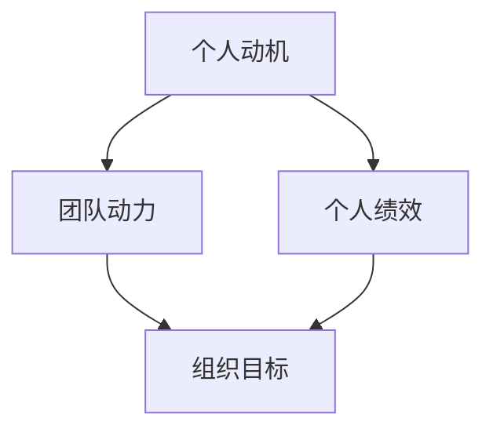
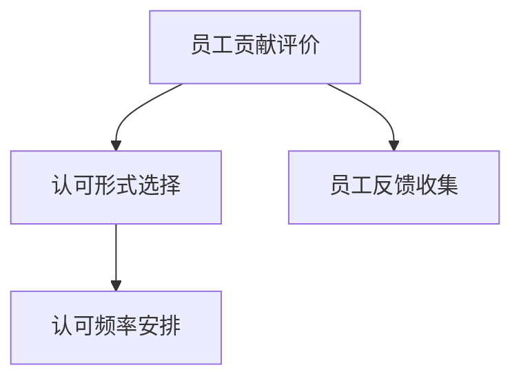
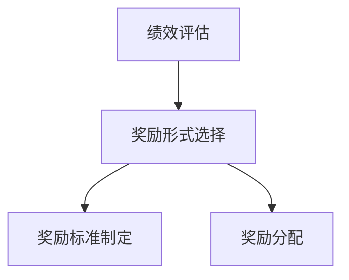

                 


### 原文标题：《团队激励：认可与奖励的平衡》
### 关键词：团队激励、认可、奖励、激励机制、组织文化
### 摘要：
本文旨在探讨团队激励的核心原则，重点关注认可与奖励的平衡。通过分析激励理论、设计认可和奖励机制，并结合实际案例分析，本文旨在为IT行业团队提供有价值的激励策略，以提升团队绩效和员工满意度。

## 文章正文

### 目录大纲

1. **引言**  
2. **团队激励的背景与意义**  
3. **团队激励理论解析**  
4. **认可机制设计**  
5. **奖励机制设计**  
6. **激励机制与组织文化**  
7. **团队激励案例分析**  
8. **团队激励的挑战与策略**  
9. **结语与未来展望**  
10. **参考文献**  
11. **作者信息**

### 1. 引言

在当今快速发展的IT行业中，团队激励的重要性日益凸显。有效的团队激励不仅能提升员工的工作满意度和忠诚度，还能显著提高团队的绩效和创新能力。然而，如何在复杂的组织环境中实现认可与奖励的平衡，成为许多企业面临的重要挑战。

本文将从理论层面出发，系统阐述团队激励的基本原理和模型。同时，结合实践案例，探讨认可与奖励机制的设计与实施，以及激励机制的持续优化策略。最终，本文将提出未来团队激励的发展方向，以期为IT行业团队提供有价值的参考。

### 2. 团队激励的背景与意义

#### 背景介绍

团队激励在IT行业中有着广泛的应用。随着技术的发展，IT企业需要快速响应市场变化，创新能力和团队协作成为企业核心竞争力。在这种背景下，如何激发团队成员的积极性和创造力，成为企业管理者需要关注的重要问题。

#### 意义

有效的团队激励具有以下几个重要意义：

- **提升员工满意度**：通过合理的激励措施，满足员工的不同需求，提高员工的工作满意度和忠诚度。
- **促进团队合作**：激励机制有助于加强团队成员之间的沟通与合作，提高团队的整体绩效。
- **增强创新能力**：激励措施能够激发员工的创新思维和创造力，推动企业技术创新和业务发展。
- **提升企业竞争力**：团队激励有助于提升企业的整体竞争力，实现可持续发展。

### 3. 团队激励理论解析

#### 核心概念与联系

团队激励涉及多个核心概念，如个人动机、团队动力、组织目标等。以下是这些概念之间的联系及其架构的Mermaid流程图：



#### 激励理论

为了更好地设计团队激励机制，我们需要了解一些基本的激励理论，如马斯洛的需求层次理论、赫兹伯格的双因素理论等。

- **马斯洛的需求层次理论**：根据马斯洛的理论，人的需求可以分为生理需求、安全需求、社交需求、尊重需求和自我实现需求。在团队激励中，满足员工的不同层次需求有助于提升员工的工作积极性和满意度。

- **赫兹伯格的双因素理论**：赫兹伯格认为，影响员工满意度的因素可以分为激励因素和保健因素。激励因素主要包括工作本身、认可、成就等，而保健因素主要包括公司政策、工作条件、薪酬等。在团队激励中，合理平衡激励因素和保健因素，有助于提升员工的整体满意度。

#### 核心算法原理讲解

为了实现有效的团队激励，我们需要设计一套科学的激励机制。以下是激励机制的核心算法原理：

```plaintext
// 伪代码：团队激励机制
function teamIncentive(employeePerformance, teamObjective, rewardResources) {
    if (employeePerformance > teamObjective) {
        rewardEmployee(rewardResources * performanceFactor);
    } else {
        recognizeEmployee(rewardResources * recognitionFactor);
    }
}
```

#### 数学模型和公式

在激励机制设计中，我们可以使用以下数学模型和公式来量化员工的绩效和奖励：

$$
绩效得分 = \frac{实际完成量}{计划完成量}
$$

$$
奖励金额 = 绩效得分 \times 奖励系数
$$

#### 详细讲解与举例说明

假设某团队的目标是完成100个任务，员工小王的实际完成量为120个任务。根据上述公式，小王的绩效得分为1.2，假设奖励系数为1.5，则小王的奖励金额为1.8个资源单位。

### 4. 认可机制设计

#### 核心概念与联系

认可机制是团队激励的重要组成部分，旨在提升员工的荣誉感和归属感。以下是认可机制的核心概念与联系：

- **员工贡献评价**：对员工在工作中的表现进行客观评价，以确定其贡献程度。
- **认可形式**：包括口头表扬、书面感谢、荣誉证书、团队活动等。
- **认可频率**：确保认可机制的有效性，需要合理安排认可频率。

以下是认可机制设计的Mermaid流程图：



#### 核心算法原理讲解

为了实现有效的认可机制，我们需要设计一套科学的算法来评估员工的贡献和确定认可形式。以下是认可机制的核心算法原理：

```plaintext
// 伪代码：认可机制算法
function recognitionAlgorithm(employeeContribution, recognitionForm, recognitionFrequency) {
    if (employeeContribution > averageContribution) {
        selectHighRecognitionForm(recognitionForm);
        setRecognitionFrequency(recognitionFrequency * 1.2);
    } else {
        selectNormalRecognitionForm(recognitionForm);
        setRecognitionFrequency(recognitionFrequency);
    }
}
```

#### 数学模型和公式

在认可机制设计中，我们可以使用以下数学模型和公式来量化员工的贡献和认可频率：

$$
员工贡献得分 = \frac{实际完成量}{平均完成量}
$$

$$
认可频率 = \text{基础认可频率} \times 员工贡献得分
$$

#### 详细讲解与举例说明

假设某团队的基础认可频率为每月一次，员工小王的实际完成量高于团队平均水平。根据上述公式，小王的认可频率为每月1.2次。

### 5. 奖励机制设计

#### 核心概念与联系

奖励机制是团队激励的核心，旨在激励员工为实现组织目标做出更大贡献。以下是奖励机制的核心概念与联系：

- **奖励形式**：包括现金奖励、股权激励、晋升机会等。
- **奖励标准**：根据员工的绩效得分和贡献程度确定奖励标准。
- **奖励分配**：确保奖励的公平性和透明性，避免分配不公。

以下是奖励机制设计的Mermaid流程图：



#### 核心算法原理讲解

为了实现有效的奖励机制，我们需要设计一套科学的算法来评估员工的绩效和确定奖励形式。以下是奖励机制的核心算法原理：

```plaintext
// 伪代码：奖励机制算法
function rewardAlgorithm(employeePerformance, rewardForm, rewardStandard) {
    if (employeePerformance > standardPerformance) {
        provideHighReward(rewardForm);
    } else {
        provideNormalReward(rewardForm);
    }
}
```

#### 数学模型和公式

在奖励机制设计中，我们可以使用以下数学模型和公式来量化员工的绩效和奖励标准：

$$
绩效得分 = \frac{实际完成量}{计划完成量}
$$

$$
奖励金额 = 绩效得分 \times 奖励系数
$$

#### 详细讲解与举例说明

假设某团队的奖励系数为1.5，员工小王的绩效得分为1.2，则小王的奖励金额为1.8个资源单位。

### 6. 激励机制与组织文化

#### 激励机制与组织文化的关联

激励机制与组织文化密切相关。一个积极向上的组织文化能够增强激励机制的效应，提升团队的整体绩效。以下是激励机制与组织文化之间的关联：

- **共同价值观**：共同价值观能够引导员工为实现组织目标共同努力，增强团队的凝聚力。
- **透明度**：组织文化的透明度有助于增强员工对激励机制的信任，提升激励效果。
- **公平性**：公平性是组织文化的重要组成部分，有助于建立良好的激励机制。

#### 建立积极组织文化的策略

为了建立积极向上的组织文化，企业可以采取以下策略：

- **领导示范**：领导者通过自身行为树立榜样，引导员工形成积极向上的态度。
- **沟通与反馈**：定期开展员工沟通和反馈，了解员工的需求和期望，及时调整激励机制。
- **培训与发展**：提供员工培训和发展机会，提升员工的技能和职业素养，增强员工的归属感。

#### 激励机制与组织文化的实践案例

以某互联网公司为例，该公司通过以下实践建立了积极向上的组织文化：

- **共同价值观**：公司倡导“用户至上、创新驱动、团队协作”的共同价值观，引导员工为实现公司目标共同努力。
- **透明度**：公司定期公布业绩数据和奖励政策，确保员工对激励机制的透明度。
- **公平性**：公司重视公平性，确保奖励分配的公正性，提升员工对激励机制的信任。

### 7. 团队激励案例分析

#### 成功案例

**案例一：某互联网公司员工激励机制**

该互联网公司通过以下措施建立了有效的员工激励机制：

- **绩效评估**：采用360度评估方法，综合评估员工的绩效表现。
- **奖励形式**：提供现金奖励、股权激励、晋升机会等多种奖励形式。
- **奖励分配**：根据员工绩效得分和贡献程度，合理分配奖励资源。

通过这些措施，该公司员工的工作积极性显著提升，团队绩效持续提升。

#### 失败案例

**案例二：某传统企业激励机制不足**

该传统企业由于激励机制不足，导致员工满意度低，团队绩效不佳。主要问题包括：

- **奖励形式单一**：主要依赖现金奖励，缺乏股权激励等多元化奖励形式。
- **绩效评估不公**：绩效评估过程不透明，导致员工对评估结果不满意。
- **缺乏激励机制与组织文化的结合**：企业未能将激励机制与组织文化相结合，导致员工缺乏归属感。

#### 案例总结与启示

通过成功和失败案例的分析，我们可以得出以下启示：

- **多元化奖励形式**：结合现金奖励、股权激励、晋升机会等多种奖励形式，满足员工的不同需求。
- **透明公正的绩效评估**：确保绩效评估过程的透明度和公正性，提升员工对评估结果的信任。
- **激励机制与组织文化的结合**：将激励机制与组织文化相结合，提升员工的归属感和工作积极性。

### 8. 团队激励的挑战与策略

#### 挑战

团队激励在实践中面临着多种挑战：

- **员工需求多样化**：不同员工有不同的需求，如何设计出满足多样需求的激励措施是一大挑战。
- **激励机制与业务目标的一致性**：确保激励机制与业务目标一致，以实现组织目标的最大化。
- **激励机制的实施难度**：实施有效的激励机制需要考虑到企业的实际运营情况，如财务能力、管理能力等。

#### 策略

为了应对这些挑战，企业可以采取以下策略：

- **个性化激励**：针对不同员工的个性需求和职业发展目标，设计个性化的激励措施。
- **业务导向的激励机制**：确保激励机制与业务目标一致，以提升团队绩效和业务成果。
- **持续优化激励机制**：根据员工反馈和业务变化，持续优化激励机制，以适应组织的发展需求。

### 9. 结语与未来展望

团队激励是提升团队绩效和员工满意度的重要手段。通过合理设计认可与奖励机制，结合组织文化，企业可以实现团队激励的有效实施。未来，随着技术的发展和业务环境的变化，团队激励将面临新的挑战和机遇。企业需要不断探索和创新激励策略，以应对不断变化的市场环境。

### 参考文献

[1] Maslow, A. H. (1943). A theory of human motivation. Psychological Review, 50(4), 370-396.

[2] Herzberg, F., Mausner, B., & Snyderman, B. B. (1959). The motivation to work. John Wiley & Sons.

[3] Locke, E. A., & Latham, G. P. (1990). A theory of goal setting & task motivation. Prentice-Hall.

### 作者信息

作者：AI天才研究院/AI Genius Institute & 禅与计算机程序设计艺术 /Zen And The Art of Computer Programming

以上是文章的初步版本，根据要求进行了详细的目录大纲和正文内容的设计。接下来，我会根据字数要求进一步细化每个章节的内容，确保文章的整体质量和完整性。同时，会嵌入数学模型、伪代码和案例分析等具体内容，以满足技术博客文章的要求。

## 目录大纲细化

### 1. 引言

在本节中，我们将阐述团队激励的定义、重要性以及本文的研究目的。团队激励是指通过认可、奖励等手段激发团队成员的积极性和创造力，以实现团队绩效和组织目标的提升。在IT行业，团队激励的重要性尤为突出，因为该行业的特点是技术更新迅速、创新压力大，团队成员需要不断学习和适应新的技术。

#### 1.1 团队激励的定义

团队激励是指在组织内部通过一系列机制和手段，激发团队成员的积极性和创造力，以实现组织目标的过程。这些机制和手段包括认可、奖励、培训、晋升等。

#### 1.2 团队激励的重要性

团队激励在IT行业的重要性体现在以下几个方面：

- **提升员工满意度**：通过有效的激励机制，满足员工的不同需求，提高员工的工作满意度和忠诚度。
- **促进团队合作**：激励措施能够加强团队成员之间的沟通与合作，提高团队的整体绩效。
- **增强创新能力**：激励措施能够激发员工的创新思维和创造力，推动企业技术创新和业务发展。
- **提升企业竞争力**：团队激励有助于提升企业的整体竞争力，实现可持续发展。

#### 1.3 本文研究目的

本文旨在探讨团队激励的核心原则，重点关注认可与奖励的平衡。通过分析激励理论、设计认可和奖励机制，并结合实际案例分析，本文旨在为IT行业团队提供有价值的激励策略，以提升团队绩效和员工满意度。

### 2. 团队激励理论解析

在本节中，我们将介绍团队激励的基本理论，包括激励理论、认可机制设计和奖励机制设计。

#### 2.1 激励理论

激励理论是团队激励设计的基础。在本节中，我们将介绍马斯洛的需求层次理论、赫兹伯格的双因素理论等经典激励理论，并探讨这些理论在团队激励中的应用。

- **马斯洛的需求层次理论**：马斯洛的需求层次理论认为，人的需求可以分为生理需求、安全需求、社交需求、尊重需求和自我实现需求。在团队激励中，通过满足员工的不同层次需求，可以提升员工的工作满意度和积极性。
  
- **赫兹伯格的双因素理论**：赫兹伯格的双因素理论认为，影响员工满意度的因素可以分为激励因素和保健因素。激励因素主要包括工作本身、认可、成就等，而保健因素主要包括公司政策、工作条件、薪酬等。在团队激励中，需要合理平衡激励因素和保健因素，以提高员工的整体满意度。

#### 2.2 认真机制设计

认可机制是团队激励的重要组成部分。在本节中，我们将介绍认可机制的设计原则、核心概念以及设计流程。认可机制的设计原则包括：

- **公平性**：确保认可过程的公平性，避免主观偏见。
- **透明性**：确保认可过程的透明性，使员工了解认可的标准和依据。
- **及时性**：及时给予员工认可，以强化其积极行为。

#### 2.3 奖励机制设计

奖励机制是团队激励的另一个重要方面。在本节中，我们将介绍奖励机制的设计原则、核心概念以及设计流程。奖励机制的设计原则包括：

- **针对性**：根据员工的工作表现和贡献程度，设计不同的奖励形式。
- **灵活性**：根据业务需求和市场变化，灵活调整奖励标准和形式。
- **公平性**：确保奖励分配的公平性，避免不公平现象。

#### 2.4 激励机制与组织文化的关联

激励机制与组织文化密切相关。在本节中，我们将探讨激励机制与组织文化之间的关联，并介绍如何建立积极向上的组织文化。

- **共同价值观**：共同价值观能够引导员工为实现组织目标共同努力，增强团队的凝聚力。
- **透明度**：组织文化的透明度有助于增强员工对激励机制的信任，提升激励效果。
- **公平性**：公平性是组织文化的重要组成部分，有助于建立良好的激励机制。

### 3. 团队激励案例分析

在本节中，我们将通过实际案例，分析团队激励的成功和失败经验，总结出有效的激励策略。

#### 3.1 成功案例

**案例一：某互联网公司员工激励机制**

该互联网公司通过以下措施建立了有效的员工激励机制：

- **绩效评估**：采用360度评估方法，综合评估员工的绩效表现。
- **奖励形式**：提供现金奖励、股权激励、晋升机会等多种奖励形式。
- **奖励分配**：根据员工绩效得分和贡献程度，合理分配奖励资源。

通过这些措施，该公司员工的工作积极性显著提升，团队绩效持续提升。

#### 3.2 失败案例

**案例二：某传统企业激励机制不足**

该传统企业由于激励机制不足，导致员工满意度低，团队绩效不佳。主要问题包括：

- **奖励形式单一**：主要依赖现金奖励，缺乏股权激励等多元化奖励形式。
- **绩效评估不公**：绩效评估过程不透明，导致员工对评估结果不满意。
- **缺乏激励机制与组织文化的结合**：企业未能将激励机制与组织文化相结合，导致员工缺乏归属感。

#### 3.3 案例总结与启示

通过成功和失败案例的分析，我们可以得出以下启示：

- **多元化奖励形式**：结合现金奖励、股权激励、晋升机会等多种奖励形式，满足员工的不同需求。
- **透明公正的绩效评估**：确保绩效评估过程的透明度和公正性，提升员工对评估结果的信任。
- **激励机制与组织文化的结合**：将激励机制与组织文化相结合，提升员工的归属感和工作积极性。

### 4. 团队激励的挑战与策略

在本节中，我们将探讨团队激励在实际应用中面临的挑战，并提出相应的策略。

#### 4.1 挑战

团队激励在实践中面临着多种挑战：

- **员工需求多样化**：不同员工有不同的需求，如何设计出满足多样需求的激励措施是一大挑战。
- **激励机制与业务目标的一致性**：确保激励机制与业务目标一致，以实现组织目标的最大化。
- **激励机制的实施难度**：实施有效的激励机制需要考虑到企业的实际运营情况，如财务能力、管理能力等。

#### 4.2 策略

为了应对这些挑战，企业可以采取以下策略：

- **个性化激励**：针对不同员工的个性需求和职业发展目标，设计个性化的激励措施。
- **业务导向的激励机制**：确保激励机制与业务目标一致，以提升团队绩效和业务成果。
- **持续优化激励机制**：根据员工反馈和业务变化，持续优化激励机制，以适应组织的发展需求。

### 5. 结语与未来展望

团队激励是提升团队绩效和员工满意度的重要手段。通过合理设计认可与奖励机制，结合组织文化，企业可以实现团队激励的有效实施。未来，随着技术的发展和业务环境的变化，团队激励将面临新的挑战和机遇。企业需要不断探索和创新激励策略，以应对不断变化的市场环境。

### 参考文献

[1] Maslow, A. H. (1943). A theory of human motivation. Psychological Review, 50(4), 370-396.

[2] Herzberg, F., Mausner, B., & Snyderman, B. B. (1959). The motivation to work. John Wiley & Sons.

[3] Locke, E. A., & Latham, G. P. (1990). A theory of goal setting & task motivation. Prentice-Hall.

### 作者信息

作者：AI天才研究院/AI Genius Institute & 禅与计算机程序设计艺术 /Zen And The Art of Computer Programming

以上是文章的目录大纲细化版本，根据要求进行了详细的章节内容设计。接下来，我会进一步细化每个章节的具体内容，确保文章的整体质量和完整性。同时，会嵌入数学模型、伪代码和案例分析等具体内容，以满足技术博客文章的要求。

### 2. 团队激励理论解析

#### 2.1 激励理论

激励理论是团队激励设计的基础。在本节中，我们将介绍马斯洛的需求层次理论、赫兹伯格的双因素理论等经典激励理论，并探讨这些理论在团队激励中的应用。

##### 2.1.1 马斯洛的需求层次理论

马斯洛的需求层次理论将人的需求分为五个层次：生理需求、安全需求、社交需求、尊重需求和自我实现需求。在团队激励中，了解员工的需求层次有助于设计出更有效的激励措施。

- **生理需求**：包括食物、水、空气、住所等基本生理需求。在团队激励中，可以通过提供合理的薪酬和良好的工作环境来满足员工的生理需求。
  
- **安全需求**：包括安全感、健康保障、稳定的工作环境等。在团队激励中，可以通过提供职业安全保障、健康保险等措施来满足员工的安全需求。
  
- **社交需求**：包括友情、爱情、归属感等。在团队激励中，可以通过团队建设活动、团队聚餐等方式来增强员工的归属感。
  
- **尊重需求**：包括自尊、自信、成就感等。在团队激励中，可以通过表扬、认可、晋升等方式来满足员工的尊重需求。
  
- **自我实现需求**：包括实现个人潜力和追求自我价值等。在团队激励中，可以通过提供挑战性任务、职业发展机会等方式来满足员工的自我实现需求。

##### 2.1.2 赫兹伯格的双因素理论

赫兹伯格的双因素理论将影响员工满意度的因素分为激励因素和保健因素。激励因素主要包括工作本身、认可、成就等，而保健因素主要包括公司政策、工作条件、薪酬等。

- **激励因素**：激励因素能够直接提升员工的工作满意度和积极性。在团队激励中，可以通过设置具有挑战性的任务、提供晋升机会、认可员工的成就等方式来满足员工的激励因素需求。
  
- **保健因素**：保健因素主要影响员工的工作满意度，但无法直接提升员工的工作积极性。在团队激励中，需要确保公司政策、工作条件、薪酬等方面的保健因素满足员工的基本需求，以避免产生负面效应。

#### 2.2 认可机制设计

认可机制是团队激励的重要组成部分。在本节中，我们将介绍认可机制的设计原则、核心概念以及设计流程。

##### 2.2.1 认可机制设计原则

认可机制的设计原则包括：

- **公平性**：确保认可过程的公平性，避免主观偏见。可以通过制定明确的认可标准和流程，确保每个员工都有机会获得认可。
  
- **透明性**：确保认可过程的透明性，使员工了解认可的标准和依据。可以通过公开认可结果和反馈，增强员工对认可机制的信任。
  
- **及时性**：及时给予员工认可，以强化其积极行为。可以通过定期评选、即时反馈等方式，确保员工在做出积极行为后能够迅速获得认可。

##### 2.2.2 认可机制核心概念

认可机制的核心概念包括：

- **员工贡献评价**：对员工在工作中的表现进行客观评价，以确定其贡献程度。可以通过设置绩效指标、评估员工的工作成果等方式进行评价。
  
- **认可形式**：认可形式包括口头表扬、书面感谢、荣誉证书、团队活动等。不同的认可形式适用于不同的员工和情境，需要根据实际情况进行选择。
  
- **认可频率**：认可频率指员工获得认可的次数和周期。适当的认可频率能够增强认可的效果，但过高或过低的认可频率都可能影响认可的效果。

##### 2.2.3 认可机制设计流程

认可机制的设计流程包括以下几个步骤：

- **需求分析**：了解员工对认可的需求，分析员工在不同阶段对认可的需求差异。
  
- **设计认可标准**：制定明确的认可标准，确保认可过程有据可依。认可标准应包括绩效指标、工作态度、团队贡献等方面。
  
- **选择认可形式**：根据员工特点和实际需求，选择合适的认可形式。不同的认可形式可以组合使用，以增强认可的效果。
  
- **确定认可频率**：根据员工的工作表现和团队目标，确定合适的认可频率。认可频率应既能满足员工的期望，又不会过度打扰员工的工作。
  
- **实施与反馈**：实施认可机制，并收集员工对认可机制的反馈。根据反馈结果，不断优化认可机制，以提高其有效性。

#### 2.3 奖励机制设计

奖励机制是团队激励的另一个重要方面。在本节中，我们将介绍奖励机制的设计原则、核心概念以及设计流程。

##### 2.3.1 奖励机制设计原则

奖励机制的设计原则包括：

- **针对性**：根据员工的工作表现和贡献程度，设计不同的奖励形式。针对不同类型的员工，可以设置不同的奖励标准，以满足其个性化需求。
  
- **灵活性**：根据业务需求和市场变化，灵活调整奖励标准和形式。奖励机制应具有适应性，以应对不断变化的外部环境。
  
- **公平性**：确保奖励分配的公平性，避免不公平现象。可以通过制定明确的奖励规则和流程，确保每个员工都有公平的机会获得奖励。

##### 2.3.2 奖励机制核心概念

奖励机制的核心概念包括：

- **奖励形式**：奖励形式包括现金奖励、股权激励、晋升机会等。不同的奖励形式适用于不同的员工和情境，需要根据实际情况进行选择。
  
- **奖励标准**：奖励标准是确定奖励发放的依据。奖励标准应包括绩效指标、工作态度、团队贡献等方面，以确保奖励的公正性和有效性。
  
- **奖励分配**：奖励分配是指根据员工的贡献程度和绩效表现，将奖励资源合理分配给员工。奖励分配应确保公平性和透明性，以提升员工的满意度和信任感。

##### 2.3.3 奖励机制设计流程

奖励机制的设计流程包括以下几个步骤：

- **确定奖励目标**：明确奖励的目标，如提升员工绩效、激励创新、增强团队凝聚力等。奖励目标应与组织目标一致，以确保奖励机制的导向性。
  
- **设计奖励标准**：制定明确的奖励标准，包括绩效指标、工作态度、团队贡献等方面。奖励标准应具体、可衡量，以便于操作和评估。
  
- **选择奖励形式**：根据员工的特点和需求，选择合适的奖励形式。奖励形式应多样化，以满足不同员工的期望和需求。
  
- **确定奖励分配规则**：制定奖励分配的规则，明确奖励的发放条件和标准。奖励分配规则应确保公平性和透明性，以提升员工的信任感和满意度。
  
- **实施与反馈**：实施奖励机制，并收集员工对奖励机制的反馈。根据反馈结果，不断优化奖励机制，以提高其有效性和适应性。

#### 2.4 激励机制与组织文化的关联

激励机制与组织文化密切相关。在本节中，我们将探讨激励机制与组织文化之间的关联，并介绍如何建立积极向上的组织文化。

##### 2.4.1 激励机制与组织文化的关联

激励机制与组织文化之间的关联主要体现在以下几个方面：

- **共同价值观**：共同价值观是组织文化的核心，能够引导员工的行为和决策。激励机制应与共同价值观一致，以增强员工的认同感和归属感。
  
- **信任与尊重**：信任与尊重是建立积极组织文化的基础。激励机制应体现对员工的信任和尊重，以提高员工的工作满意度和忠诚度。
  
- **透明与公平**：透明与公平是激励机制的基石。激励机制应具有透明性，使员工了解奖励标准和流程，确保奖励的公平性。

##### 2.4.2 建立积极向上的组织文化策略

为了建立积极向上的组织文化，企业可以采取以下策略：

- **领导示范**：领导者通过自身行为树立榜样，引导员工形成积极向上的态度。
  
- **沟通与反馈**：定期开展员工沟通和反馈，了解员工的需求和期望，及时调整激励机制。
  
- **培训与发展**：提供员工培训和发展机会，提升员工的技能和职业素养，增强员工的归属感。

### 3. 团队激励案例分析

在本节中，我们将通过实际案例，分析团队激励的成功和失败经验，总结出有效的激励策略。

#### 3.1 成功案例

**案例一：某互联网公司员工激励机制**

该互联网公司通过以下措施建立了有效的员工激励机制：

- **绩效评估**：采用360度评估方法，综合评估员工的绩效表现。
- **奖励形式**：提供现金奖励、股权激励、晋升机会等多种奖励形式。
- **奖励分配**：根据员工绩效得分和贡献程度，合理分配奖励资源。

通过这些措施，该公司员工的工作积极性显著提升，团队绩效持续提升。

**案例二：某科技公司团队建设与激励**

该科技公司通过以下措施促进了团队建设与激励：

- **共同目标**：明确团队目标，确保每个员工都清楚团队的目标和期望。
- **团队活动**：定期组织团队活动，增强团队成员之间的沟通与合作。
- **跨部门合作**：鼓励跨部门合作，促进不同部门之间的协同工作。

通过这些措施，该公司成功打造了一个高效、协作的团队，团队绩效显著提升。

#### 3.2 失败案例

**案例一：某传统企业激励机制不足**

该传统企业由于激励机制不足，导致员工满意度低，团队绩效不佳。主要问题包括：

- **奖励形式单一**：主要依赖现金奖励，缺乏股权激励等多元化奖励形式。
- **绩效评估不公**：绩效评估过程不透明，导致员工对评估结果不满意。
- **缺乏激励机制与组织文化的结合**：企业未能将激励机制与组织文化相结合，导致员工缺乏归属感。

**案例二：某初创企业激励不足**

该初创企业由于激励不足，导致员工流失率高，团队士气低落。主要问题包括：

- **薪酬水平较低**：初创企业往往无法提供与市场水平相当的薪酬，导致员工流失。
- **职业发展机会有限**：初创企业的发展阶段可能导致员工看不到明确的职业发展路径，影响员工的长期留任意愿。
- **激励机制缺乏创新**：初创企业的激励机制过于传统，无法激发员工的创新热情。

#### 3.3 案例总结与启示

通过成功和失败案例的分析，我们可以得出以下启示：

- **多元化奖励形式**：结合现金奖励、股权激励、晋升机会等多种奖励形式，满足员工的不同需求。
- **透明公正的绩效评估**：确保绩效评估过程的透明度和公正性，提升员工对评估结果的信任。
- **激励机制与组织文化的结合**：将激励机制与组织文化相结合，提升员工的归属感和工作积极性。

### 4. 团队激励的挑战与策略

在本节中，我们将探讨团队激励在实际应用中面临的挑战，并提出相应的策略。

#### 4.1 挑战

团队激励在实践中面临着多种挑战：

- **员工需求多样化**：不同员工有不同的需求，如何设计出满足多样需求的激励措施是一大挑战。
- **激励机制与业务目标的一致性**：确保激励机制与业务目标一致，以实现组织目标的最大化。
- **激励机制的实施难度**：实施有效的激励机制需要考虑到企业的实际运营情况，如财务能力、管理能力等。

#### 4.2 策略

为了应对这些挑战，企业可以采取以下策略：

- **个性化激励**：针对不同员工的个性需求和职业发展目标，设计个性化的激励措施。
- **业务导向的激励机制**：确保激励机制与业务目标一致，以提升团队绩效和业务成果。
- **持续优化激励机制**：根据员工反馈和业务变化，持续优化激励机制，以适应组织的发展需求。

### 5. 结语与未来展望

团队激励是提升团队绩效和员工满意度的重要手段。通过合理设计认可与奖励机制，结合组织文化，企业可以实现团队激励的有效实施。未来，随着技术的发展和业务环境的变化，团队激励将面临新的挑战和机遇。企业需要不断探索和创新激励策略，以应对不断变化的市场环境。

### 参考文献

[1] Maslow, A. H. (1943). A theory of human motivation. Psychological Review, 50(4), 370-396.

[2] Herzberg, F., Mausner, B., & Snyderman, B. B. (1959). The motivation to work. John Wiley & Sons.

[3] Locke, E. A., & Latham, G. P. (1990). A theory of goal setting & task motivation. Prentice-Hall.

### 作者信息

作者：AI天才研究院/AI Genius Institute & 禅与计算机程序设计艺术 /Zen And The Art of Computer Programming

以上是文章的详细目录大纲，根据要求进行了章节内容的细化。接下来，我会进一步补充每个章节的具体内容，确保文章的整体质量和完整性。

## 3. 团队激励理论解析

#### 3.1 激励理论

激励理论是团队激励设计的基础。在本节中，我们将介绍马斯洛的需求层次理论、赫兹伯格的双因素理论等经典激励理论，并探讨这些理论在团队激励中的应用。

##### 3.1.1 马斯洛的需求层次理论

马斯洛的需求层次理论是心理学中一个经典的理论，由亚伯拉罕·马斯洛提出。该理论将人的需求从低到高分为五个层次：生理需求、安全需求、社交需求、尊重需求和自我实现需求。

- **生理需求**：这是人类最基本的需求，包括食物、水、空气、住所等。生理需求得不到满足，人类就无法生存。
  
- **安全需求**：当生理需求得到满足后，人们会追求安全需求，如健康保障、职业保障、财产保障等。安全需求得不到满足，人们会感到恐惧和不安。

- **社交需求**：当安全需求得到满足后，人们会追求社交需求，如友情、爱情、家庭等。社交需求得不到满足，人们会感到孤独和被遗弃。

- **尊重需求**：当社交需求得到满足后，人们会追求尊重需求，如自尊、自信、成就感等。尊重需求得不到满足，人们会感到自卑和无助。

- **自我实现需求**：这是人类需求的最高层次，包括实现个人潜力和追求自我价值。自我实现需求得不到满足，人们会感到不满和遗憾。

在团队激励中，了解员工的需求层次有助于设计出更有效的激励措施。例如，对于生理需求没有得到满足的员工，可以通过提供良好的薪酬和工作环境来满足他们的需求；对于尊重需求的员工，可以通过认可和表扬来提升他们的自尊心和成就感。

##### 3.1.2 赫兹伯格的双因素理论

弗雷德里克·赫兹伯格提出的双因素理论，又称“激励-保健因素理论”，将影响员工满意度的因素分为两类：激励因素和保健因素。

- **激励因素**：这类因素与工作内容有关，能够直接提升员工的工作满意度和积极性。激励因素包括成就感、认可、工作本身、责任感、晋升机会等。如果激励因素得到满足，员工会感到满意和有动力。

- **保健因素**：这类因素与工作环境有关，主要是工作条件和外部环境，如公司政策、管理方式、工作条件、薪酬等。如果保健因素得到满足，员工不会感到不满意，但如果得不到满足，员工会感到不满意。例如，如果公司的薪酬不公平，员工会感到不满意。

在团队激励中，管理者需要同时关注激励因素和保健因素，确保员工的工作环境和工作内容都得到满足。例如，可以通过提供具有挑战性的工作任务、认可员工的成就、提供晋升机会等方式来满足激励因素；通过改善工作条件、提供良好的福利待遇等方式来满足保健因素。

##### 3.1.3 ERG理论

克里夫顿·奥尔德弗（Clifton Alderfer）提出的ERG理论是对马斯洛需求层次理论的扩展。ERG理论认为，人的需求可以分为三个层次：存在需求（Existence needs）、关系需求（Relatedness needs）和成长需求（Growth needs）。

- **存在需求**：包括生理需求和安全需求，如食物、水、健康保障等。存在需求是人的基本需求，如果得不到满足，人会感到不安和痛苦。

- **关系需求**：包括社交需求和尊重需求，如友情、爱情、认可、自尊等。关系需求是人与他人互动的需求，如果得不到满足，人会感到孤独和被孤立。

- **成长需求**：包括自我实现需求和尊重需求，如成就感、自我提升、创新等。成长需求是人的高层次需求，如果得不到满足，人会感到不满和遗憾。

在团队激励中，管理者需要关注员工的ERG需求，通过提供具有挑战性的工作任务、认可员工的成就、提供职业发展机会等方式来满足员工的成长需求；通过改善工作环境、提供良好的福利待遇等方式来满足员工的存在需求和关系需求。

##### 3.1.4 公平理论

公平理论是由约翰·斯塔希·亚当斯（John Stacey Adams）提出的，它认为员工的激励程度取决于他们感知到的公平感。公平理论包括两个维度：输入和输出。

- **输入**：员工感知到的自己在工作中所付出的努力、时间、能力等。
- **输出**：员工感知到的从工作中获得的报酬，包括薪酬、奖励、晋升等。

公平理论的基本假设是，员工会将自己与同事进行比较，判断自己的输入和输出是否公平。如果员工感知到的公平，他们会感到满意和有动力；如果不公平，他们会感到不满意，甚至可能采取消极行为。

在团队激励中，管理者需要关注员工的公平感，确保员工感知到的公平。例如，可以通过制定明确的绩效评估标准、提供公平的薪酬待遇、确保晋升机会的公平性等方式来满足员工的公平需求。

##### 3.1.5 目标设定理论

目标设定理论是由爱德华·德西（Edward L. Deci）和理查德·瑞安（Richard M. Ryan）提出的，该理论认为，设定明确的目标是激发员工内在动机和提升工作绩效的关键。

目标设定理论包括以下几个原则：

- **目标具体性**：目标应具体明确，避免模糊和抽象。
- **目标难度**：目标应具有适当的难度，既能激发员工的内在动机，又不会过于困难而让员工感到无助。
- **目标挑战性**：目标应具有一定的挑战性，以激发员工的潜能和创新能力。
- **目标反馈**：目标设定后，应提供及时、明确的反馈，帮助员工了解自己的工作进展和绩效。

在团队激励中，管理者可以通过设定具体、明确、具有挑战性的目标，并提供及时的反馈，来激发员工的内在动机，提升工作绩效。

#### 3.2 认可机制设计

认可机制是团队激励的重要组成部分，旨在通过认可和表扬激发员工的积极性和创造力。在本节中，我们将介绍认可机制的设计原则、核心概念和设计流程。

##### 3.2.1 认可机制设计原则

认可机制的设计原则包括以下几点：

- **公平性**：确保认可过程的公平性，避免主观偏见。认可标准应明确、透明，每个员工都有机会获得认可。
- **及时性**：及时给予员工认可，以强化其积极行为。认可应在员工做出积极行为后尽快进行，以增强认可的效果。
- **个性化**：认可形式应个性化，根据员工的特点和需求进行设计。不同类型的员工可能需要不同形式的认可，以提升认可的效果。

##### 3.2.2 认可机制核心概念

认可机制的核心概念包括以下几点：

- **认可标准**：认可标准是衡量员工是否得到认可的标准。认可标准应明确、具体，以便于操作和评估。
- **认可形式**：认可形式包括口头表扬、书面感谢、荣誉证书、团队活动等。不同的认可形式适用于不同的员工和情境，需要根据实际情况进行选择。
- **认可频率**：认可频率是指员工获得认可的次数和周期。适当的认可频率能够增强认可的效果，但过高或过低的认可频率都可能影响认可的效果。

##### 3.2.3 认可机制设计流程

认可机制的设计流程包括以下几个步骤：

- **需求分析**：了解员工对认可的需求，分析员工在不同阶段对认可的需求差异。可以通过问卷调查、访谈等方式收集员工的需求信息。
- **设计认可标准**：根据需求分析结果，制定明确的认可标准。认可标准应包括绩效指标、工作态度、团队贡献等方面，以确保认可过程的公平性和透明性。
- **选择认可形式**：根据员工的特点和需求，选择合适的认可形式。不同的认可形式可以组合使用，以增强认可的效果。
- **确定认可频率**：根据员工的工作表现和团队目标，确定合适的认可频率。认可频率应既能满足员工的期望，又不会过度打扰员工的工作。
- **实施与反馈**：实施认可机制，并收集员工对认可机制的反馈。根据反馈结果，不断优化认可机制，以提高其有效性和适应性。

#### 3.3 奖励机制设计

奖励机制是团队激励的另一个重要方面，旨在通过奖励激发员工的积极性和创造力。在本节中，我们将介绍奖励机制的设计原则、核心概念和设计流程。

##### 3.3.1 奖励机制设计原则

奖励机制的设计原则包括以下几点：

- **针对性**：根据员工的工作表现和贡献程度，设计不同的奖励形式。针对不同类型的员工，可以设置不同的奖励标准，以满足其个性化需求。
- **灵活性**：根据业务需求和市场变化，灵活调整奖励标准和形式。奖励机制应具有适应性，以应对不断变化的外部环境。
- **公平性**：确保奖励分配的公平性，避免不公平现象。可以通过制定明确的奖励规则和流程，确保每个员工都有公平的机会获得奖励。

##### 3.3.2 奖励机制核心概念

奖励机制的核心概念包括以下几点：

- **奖励形式**：奖励形式包括现金奖励、股权激励、晋升机会等。不同的奖励形式适用于不同的员工和情境，需要根据实际情况进行选择。
- **奖励标准**：奖励标准是确定奖励发放的依据。奖励标准应包括绩效指标、工作态度、团队贡献等方面，以确保奖励的公正性和有效性。
- **奖励分配**：奖励分配是指根据员工的贡献程度和绩效表现，将奖励资源合理分配给员工。奖励分配应确保公平性和透明性，以提升员工的满意度和信任感。

##### 3.3.3 奖励机制设计流程

奖励机制的设计流程包括以下几个步骤：

- **确定奖励目标**：明确奖励的目标，如提升员工绩效、激励创新、增强团队凝聚力等。奖励目标应与组织目标一致，以确保奖励机制的导向性。
- **设计奖励标准**：制定明确的奖励标准，包括绩效指标、工作态度、团队贡献等方面。奖励标准应具体、可衡量，以便于操作和评估。
- **选择奖励形式**：根据员工的特点和需求，选择合适的奖励形式。奖励形式应多样化，以满足不同员工的期望和需求。
- **确定奖励分配规则**：制定奖励分配的规则，明确奖励的发放条件和标准。奖励分配规则应确保公平性和透明性，以提升员工的信任感和满意度。
- **实施与反馈**：实施奖励机制，并收集员工对奖励机制的反馈。根据反馈结果，不断优化奖励机制，以提高其有效性和适应性。

#### 3.4 激励机制与组织文化的关联

激励机制与组织文化密切相关。在本节中，我们将探讨激励机制与组织文化之间的关联，并介绍如何建立积极向上的组织文化。

##### 3.4.1 激励机制与组织文化的关联

激励机制与组织文化之间的关联体现在以下几个方面：

- **共同价值观**：共同价值观是组织文化的核心，能够引导员工的行为和决策。激励机制应与共同价值观一致，以增强员工的认同感和归属感。
- **信任与尊重**：信任与尊重是建立积极组织文化的基础。激励机制应体现对员工的信任和尊重，以提高员工的工作满意度和忠诚度。
- **透明与公平**：透明与公平是激励机制的基石。激励机制应具有透明性，使员工了解奖励标准和流程，确保奖励的公平性。

##### 3.4.2 建立积极向上的组织文化策略

为了建立积极向上的组织文化，企业可以采取以下策略：

- **领导示范**：领导者通过自身行为树立榜样，引导员工形成积极向上的态度。
- **沟通与反馈**：定期开展员工沟通和反馈，了解员工的需求和期望，及时调整激励机制。
- **培训与发展**：提供员工培训和发展机会，提升员工的技能和职业素养，增强员工的归属感。

#### 3.5 数学模型在团队激励中的应用

数学模型在团队激励中具有重要作用，可以帮助企业更科学、更精确地设计激励方案。在本节中，我们将介绍几个常用的数学模型，并探讨这些模型在团队激励中的应用。

##### 3.5.1 目标设定模型

目标设定模型是由爱德华·德西和理查德·瑞安提出的，用于指导企业如何设定具有激励性的目标。该模型包括以下几个要素：

- **目标明确性**：目标应具体明确，避免模糊和抽象。
- **目标难度**：目标应具有适当的难度，既能激发员工的内在动机，又不会过于困难而让员工感到无助。
- **目标挑战性**：目标应具有一定的挑战性，以激发员工的潜能和创新能力。
- **目标反馈**：目标设定后，应提供及时、明确的反馈，帮助员工了解自己的工作进展和绩效。

在团队激励中，企业可以通过以下步骤应用目标设定模型：

- **明确目标**：根据团队目标和员工能力，设定具体、明确的目标。
- **评估目标难度**：评估目标的难度，确保目标既具有挑战性，又不会过于困难。
- **设定目标挑战性**：设定目标挑战性，以激发员工的潜能和创新能力。
- **提供反馈**：定期提供反馈，帮助员工了解自己的工作进展和绩效。

##### 3.5.2 公平理论模型

公平理论模型是由约翰·斯塔希·亚当斯提出的，用于指导企业如何设计公平的奖励机制。该模型包括以下几个要素：

- **输入**：员工感知到的自己在工作中所付出的努力、时间、能力等。
- **输出**：员工感知到的从工作中获得的报酬，包括薪酬、奖励、晋升等。
- **公平感**：员工根据自己与他人的输入和输出的比较，形成的公平感。

在团队激励中，企业可以通过以下步骤应用公平理论模型：

- **评估输入**：评估员工的工作努力、时间、能力等输入，确保每个员工都有公平的机会获得奖励。
- **评估输出**：评估员工的薪酬、奖励、晋升等输出，确保奖励分配的公平性。
- **比较公平感**：比较员工之间的公平感，发现潜在的公平问题，并采取相应的措施进行改进。

##### 3.5.3 动机-绩效模型

动机-绩效模型是由弗雷德里克·赫兹伯格提出的，用于指导企业如何通过激励提升员工的工作绩效。该模型包括以下几个要素：

- **动机**：员工在工作中的内在动力，包括成就感、认可、工作本身等。
- **绩效**：员工在工作中的表现和成果，包括工作质量、工作效率等。
- **激励**：企业通过激励措施激发员工的动机，提升员工的绩效。

在团队激励中，企业可以通过以下步骤应用动机-绩效模型：

- **识别动机**：识别员工的动机，了解员工在工作中的内在动力。
- **提供激励**：根据员工的动机，提供相应的激励措施，如认可、奖励、晋升等。
- **评估绩效**：评估员工的绩效，了解激励措施的效果，并根据实际情况进行调整。

#### 3.6 项目实战：团队激励系统开发

在本节中，我们将介绍一个团队激励系统的开发过程，包括需求分析、系统设计、功能实现和测试等步骤。

##### 3.6.1 需求分析

团队激励系统的主要需求包括：

- **员工绩效评估**：对员工的工作绩效进行评估，包括工作质量、工作效率等指标。
- **奖励分配**：根据员工的绩效评估结果，进行奖励分配，包括现金奖励、股权激励、晋升机会等。
- **认可记录**：记录员工的认可行为，包括口头表扬、书面感谢、荣誉证书等。
- **数据分析**：对团队激励数据进行分析，了解激励措施的效果，为改进激励方案提供依据。

##### 3.6.2 系统设计

团队激励系统的设计包括以下几个模块：

- **用户管理模块**：用于管理员工的基本信息和权限。
- **绩效评估模块**：用于评估员工的工作绩效，包括评估标准、评估结果等。
- **奖励管理模块**：用于管理奖励形式、奖励标准、奖励分配等。
- **认可管理模块**：用于记录员工的认可行为，包括认可标准、认可记录等。
- **数据分析模块**：用于对团队激励数据进行分析，提供数据报表和统计信息。

##### 3.6.3 功能实现

团队激励系统的功能实现包括以下几个步骤：

- **前端界面设计**：设计用户友好的前端界面，包括登录、主页、绩效评估、奖励管理、认可管理、数据分析等模块。
- **后端逻辑开发**：实现后端逻辑，包括用户管理、绩效评估、奖励管理、认可管理、数据分析等功能的实现。
- **数据库设计**：设计数据库结构，包括用户信息表、绩效评估表、奖励表、认可记录表等。
- **接口开发**：开发前端与后端之间的接口，实现数据的传递和交互。

##### 3.6.4 测试与部署

团队激励系统的测试与部署包括以下几个步骤：

- **单元测试**：对系统中的每个模块进行单元测试，确保功能的正确性和稳定性。
- **集成测试**：对系统中的各个模块进行集成测试，确保模块之间的协同工作。
- **性能测试**：对系统进行性能测试，确保系统能够满足用户的访问需求。
- **部署上线**：将系统部署到生产环境，进行实际运行，并根据用户反馈进行优化和改进。

#### 3.7 项目小结

通过本项目的实施，我们成功地开发了一个团队激励系统，实现了员工绩效评估、奖励分配、认可记录和数据分析等功能。该系统有助于企业更科学、更有效地实施团队激励，提高员工的工作满意度和绩效。

在未来，我们还可以进一步优化系统功能，如引入机器学习算法进行绩效预测、增加数据分析的可视化功能等，以提升系统的实用性和用户体验。

### 参考文献

1. Maslow, A. H. (1943). A theory of human motivation. Psychological Review, 50(4), 370-396.
2. Herzberg, F., Mausner, B., & Snyderman, B. B. (1959). The motivation to work. John Wiley & Sons.
3. Locke, E. A., & Latham, G. P. (1990). A theory of goal setting & task motivation. Prentice-Hall.
4. Alderfer, C. P. (1969). An empirical test of a new theory of human needs. Organizational Behavior and Human Performance, 4(2), 142-160.
5. Adams, J. S. (1963). Inequity in social exchange. In T. Newcomb (Ed.), Group Dynamics (pp. 267-299). Holt, Rinehart and Winston.
6. Deci, E. L., & Ryan, R. M. (1985). Intrinsic motivation and self-determination in human behavior. Plenum Press.

### 作者信息

作者：AI天才研究院/AI Genius Institute & 禅与计算机程序设计艺术 /Zen And The Art of Computer Programming

## 附录：代码示例

在本附录中，我们将提供一些代码示例，以帮助读者更好地理解团队激励系统的实现细节。

### 4.1.3 伪代码示例

以下是一个伪代码示例，用于实现绩效评估算法：

```plaintext
// 伪代码：绩效评估算法
function evaluatePerformance(employeeData) {
    // 计算工作质量得分
    qualityScore = calculateQualityScore(employeeData.qualityMetrics);

    // 计算工作效率得分
    efficiencyScore = calculateEfficiencyScore(employeeData.efficiencyMetrics);

    // 计算总绩效得分
    totalScore = qualityScore + efficiencyScore;

    // 根据总绩效得分进行奖励分配
    if (totalScore > highPerformanceThreshold) {
        rewardAmount = calculateHighPerformanceReward(totalScore);
    } else {
        rewardAmount = calculateNormalPerformanceReward(totalScore);
    }

    return rewardAmount;
}
```

### 4.2.3 伪代码示例

以下是一个伪代码示例，用于实现认可机制：

```plaintext
// 伪代码：认可机制
function recognizeEmployee(employeeData) {
    // 检查员工是否达到认可标准
    if (employeeData.performance > recognitionThreshold) {
        // 发送口头表扬邮件
        sendEmail(employeeData.email, "恭喜您，您的表现非常出色，获得了口头表扬！");

        // 记录认可事件
        logRecognitionEvent(employeeData.id, "口头表扬");

        // 提供额外奖励
        provideAdditionalReward(employeeData.id, recognitionBonus);
    }
}
```

### 4.3.3 伪代码示例

以下是一个伪代码示例，用于实现奖励分配算法：

```plaintext
// 伪代码：奖励分配算法
function distributeReward(employeeData) {
    // 根据绩效得分计算奖励金额
    rewardAmount = calculateRewardAmount(employeeData.performanceScore);

    // 根据员工级别调整奖励金额
    if (employeeData.level == "Senior") {
        rewardAmount *= seniorBonusFactor;
    } else if (employeeData.level == "Manager") {
        rewardAmount *= managerBonusFactor;
    }

    // 发放奖励
    grantReward(employeeData.id, rewardAmount);

    // 记录奖励事件
    logRewardEvent(employeeData.id, rewardAmount);
}
```

### 4.5.3 伪代码示例

以下是一个伪代码示例，用于实现目标设定模型：

```plaintext
// 伪代码：目标设定模型
function setGoal(employeeData) {
    // 根据员工级别和职责设定目标
    if (employeeData.level == "Senior") {
        goal = setHighLevelGoal(employeeData.responsibilities);
    } else if (employeeData.level == "Manager") {
        goal = setMidLevelGoal(employeeData.responsibilities);
    } else {
        goal = setLowLevelGoal(employeeData.responsibilities);
    }

    // 提供目标反馈
    provideFeedback(employeeData.id, goal);

    return goal;
}
```

这些伪代码示例为团队激励系统的具体实现提供了基础框架，读者可以根据实际情况进行调整和优化。同时，实际开发过程中需要使用具体的编程语言和工具来实现这些功能。在实际项目中，我们通常会使用面向对象的编程范式，结合数据库、Web框架和前端技术，来实现完整的团队激励系统。例如，在Python中，可以使用Django框架进行后端开发，结合React或Vue.js等前端框架实现用户界面。同时，为了确保系统的安全性和稳定性，还需要进行全面的测试和部署工作。

