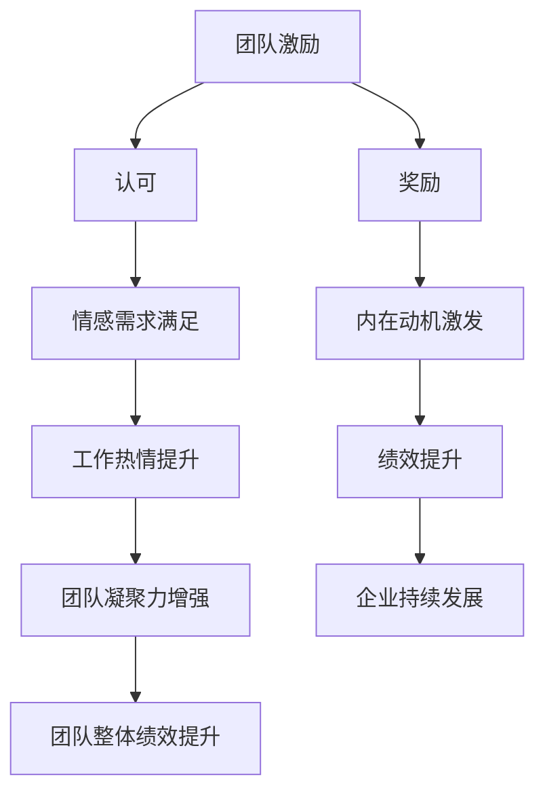

                 

### 文章标题：团队激励：认可与奖励的平衡

在数字化和全球化的今天，团队激励已成为企业发展的关键因素。有效激励不仅能够提升员工的工作积极性，还能促进团队的凝聚力和创新能力。本文将深入探讨团队激励的核心概念，特别是认可与奖励之间的平衡，通过逻辑清晰、结构紧凑的分析，为您提供实用的技术见解。

### 关键词：
- **团队激励**
- **认可**
- **奖励**
- **心理理论**
- **行为经济学**
- **动机模型**
- **奖励计划设计**
- **最佳实践**

### 摘要：
本文旨在探索团队激励中认可与奖励的平衡，通过心理学理论、行为经济学原理及实际案例，详细分析团队激励的核心概念及其相互作用。文章结构分为五个部分：核心概念与联系、团队激励的原理讲解、数学模型与公式、项目实战、团队激励的最佳实践。通过这篇文章，读者将全面了解团队激励的重要性以及如何在实际操作中实现认可与奖励的平衡，提高团队的整体绩效。

---

## 第一部分：核心概念与联系

### 团队激励的定义与重要性

团队激励是指通过一系列手段来激发团队成员的工作热情和潜能，从而提高团队的整体绩效。这些手段包括物质奖励、精神奖励、职业发展机会等。团队激励的核心理念在于满足员工的内在需求和激发他们的工作动力。

团队激励在企业发展中具有重要意义。首先，它能提高员工的工作满意度，减少员工流失率。其次，有效的团队激励能够激发员工的创造力和创新能力，推动企业持续发展。最后，团队激励有助于增强团队的凝聚力和协作精神，提高团队的整体绩效。

### 认可与奖励的概念及其相互作用

认可与奖励是团队激励中的两个重要组成部分。认可通常指对员工工作成果的肯定和赞赏，而奖励则涉及物质或精神上的回报。两者在团队激励中相互作用，共同发挥作用。

认可能够满足员工的情感需求，增强他们的自信心和归属感。心理学研究表明，人类有被认可和赞赏的基本需求，这种需求能够激发员工的工作热情和动力。奖励则提供了一种直接的激励，能够激发员工的内在动机，促使他们更努力地工作。

在实际操作中，认可与奖励往往是相辅相成的。例如，在某个项目中，员工A因为表现出色而得到了上级的认可，这种认可进一步促使员工A更加努力工作，最终获得了项目奖金。这种正向循环能够有效提高团队的整体绩效。

### Mermaid 流程图



通过这个流程图，我们可以清晰地看到团队激励中认可与奖励的相互作用以及它们对团队和企业带来的积极影响。接下来，我们将进一步探讨团队激励的原理，包括心理学理论、行为经济学原理及其在实际中的应用。

## 第二部分：团队激励的原理讲解

### 心理学理论在团队激励中的应用

心理学理论在团队激励中具有重要的指导作用，能够帮助我们更好地理解和运用认可与奖励。以下是几个关键的心理学理论及其在团队激励中的应用。

#### 环境认知理论

环境认知理论强调个体对外部环境的感知和理解对其行为的影响。在团队激励中，管理者需要创造一个积极的工作环境，使员工感受到支持和认可。例如，通过改善工作条件、提供培训机会和建立透明的沟通机制，可以增强员工对工作的满意度，从而提高他们的工作动力。

#### 自我决定理论

自我决定理论认为，个体有内在的动力去实现自我价值和成长。在团队激励中，管理者应该尊重员工的自主性，给予他们一定的决策权和发展空间。例如，通过设置挑战性任务和提供职业发展路径，可以激发员工的内在动机，促使他们主动投入到工作中。

#### 奖励心理学理论

奖励心理学理论探讨了奖励对个体行为的影响。有效的奖励不仅能够增强员工的工作动力，还能提高他们的工作满意度。例如，通过及时给予物质奖励（如奖金、股权）和精神奖励（如表彰、荣誉），可以强化员工的行为，促使他们保持高效的工作状态。

### 行为经济学原理在团队激励中的应用

行为经济学是研究个体在现实经济环境中的行为决策的科学。它在团队激励中的应用能够帮助我们更好地理解员工的动机和行为，从而设计出更加有效的激励方案。

#### 动机与效用理论

动机与效用理论认为，个体的行为决策是基于对行为结果的预期效用。在团队激励中，管理者可以通过提高奖励的效用来激发员工的工作动力。例如，通过设置具有挑战性的目标并提供丰厚的奖励，可以增强员工完成任务的动机。

#### 损失厌恶与选择偏差

损失厌恶是指个体在面对潜在损失时的风险厌恶行为。在团队激励中，管理者可以利用损失厌恶来提高员工的参与度。例如，通过设置“竞赛”模式，使员工在完成目标时获得奖励，而在未完成目标时面临一定的损失，可以增强他们的积极性和责任感。

#### 行为经济学对团队激励的影响

行为经济学揭示了人类行为中的认知偏差和决策错误。在团队激励中，管理者需要避免这些偏差，设计出更加合理和有效的激励方案。例如，通过减少奖励的不确定性、避免过度强调短期利益和提供持续的反馈，可以提高激励的有效性。

### 总结

心理学和行为经济学为团队激励提供了深刻的理论基础。通过理解这些理论，管理者可以更好地设计激励方案，使认可与奖励相互配合，从而提高团队的整体绩效。在下一部分中，我们将探讨团队激励中的数学模型与公式，进一步分析认可与奖励的平衡机制。

## 第三部分：数学模型与公式

### 动机理论模型

动机理论模型是理解员工激励的重要工具。其中一个经典的动机理论模型是弗鲁姆的期望理论（Victor H. Vroom's Expectancy Theory）。该理论认为，个体的行为动机取决于对结果的价值评估和期望的概率。具体来说，动机（Motivation）可以用以下公式表示：

\[ Motivation = Valence \times Expectancy \]

其中：
- \( Valence \) 表示结果的价值评估（Positive或Negative），即个体对结果的偏好程度。
- \( Expectancy \) 表示达成结果的概率。

在团队激励中，管理者可以通过调整 \( Valence \) 和 \( Expectancy \) 来影响员工的动机。例如，通过提高奖励的价值（如增加奖金数额）或提高达成目标的概率（如提供明确的任务指南和培训），可以增强员工的动机。

### 认可与奖励的平衡公式

在团队激励中，认可与奖励的平衡是一个关键问题。一个简化的模型可以表示为：

\[ Balance = \frac{Recognition}{Reward} \]

其中：
- \( Recognition \) 表示认程度，即员工感受到的认可程度。
- \( Reward \) 表示奖励程度，即提供的物质或精神奖励的量。

为了保持平衡，管理者需要根据具体情况调整 \( Recognition \) 和 \( Reward \) 之间的比例。例如，在一个高度竞争的环境中，可能需要增加认程度来平衡高奖励，以防止员工感到被过度物质化。

### 动机模型公式

为了更详细地探讨动机，我们可以使用弗鲁姆-罗格勃里格模型（Vroom-Yetton-Luger Model），该模型包括以下四个因素：

\[ Motivation = Effort \times Performance \times Intrinsic Value \times Extrinsic Value \]

其中：
- \( Effort \) 表示个体投入的努力程度。
- \( Performance \) 表示个体完成任务的能力。
- \( Intrinsic Value \) 表示任务的内在价值，即个体对任务本身的兴趣和满足感。
- \( Extrinsic Value \) 表示任务的外部价值，即任务带来的奖励和认可。

通过调整这些因素，管理者可以有效地影响员工的动机。例如，通过提高任务的挑战性（增加 \( Effort \)）或提供更多的奖励（增加 \( Extrinsic Value \)），可以增强员工的动机。

### 数学公式推导与举例说明

为了更好地理解上述公式，我们通过一个简单的例子进行推导和说明。

假设有一个员工，他完成任务的能力 \( Performance \) 为 0.8，他非常重视任务的价值 \( Intrinsic Value \) 为 0.6，而任务的内在价值较低，只有 \( Extrinsic Value \) 为 0.2。

\[ Motivation = 0.8 \times 0.8 \times 0.6 \times 0.2 = 0.0864 \]

这意味着员工的动机水平较低，需要采取措施来提高他的动机。例如，可以通过增加任务的挑战性或提供更多的奖励来提高动机水平。

### 总结

通过使用数学模型与公式，管理者可以更加科学地设计和调整团队激励方案，以实现认可与奖励的平衡。在下一部分中，我们将通过实际案例来探讨这些理论在实际操作中的应用，帮助读者更好地理解和运用团队激励的策略。

## 第四部分：项目实战

### 开发环境搭建

为了更好地理解团队激励的实际应用，我们将搭建一个简单的团队激励系统。以下是所需的技术环境和工具：

1. **编程语言**：选择Python，因为它具有丰富的库支持和易于理解的语法。
2. **数据库**：使用MySQL数据库来存储员工的个人信息和奖励记录。
3. **前端技术**：使用HTML和CSS来搭建用户界面，使用JavaScript实现交互功能。
4. **后端框架**：选择Flask框架来快速构建Web应用。

首先，确保安装了Python和MySQL。接下来，安装Flask和相关的扩展库：

```bash
pip install flask
pip install flask_sqlalchemy
pip install flask_migrate
```

### 源代码详细实现和代码解读

我们首先定义一个简单的数据库模型，用于存储员工的个人信息和奖励记录：

```python
from flask_sqlalchemy import SQLAlchemy

db = SQLAlchemy()

class Employee(db.Model):
    id = db.Column(db.Integer, primary_key=True)
    name = db.Column(db.String(100), nullable=False)
    recognition_points = db.Column(db.Integer, default=0)
    reward_points = db.Column(db.Integer, default=0)

def init_app(app):
    db.init_app(app)
    with app.app_context():
        db.create_all()
```

这段代码定义了`Employee`模型，包括员工的ID、姓名、认可积分和奖励积分。`init_app`函数用于初始化数据库。

接下来，我们创建一个简单的Web界面，用于显示员工的积分和奖励：

```html
<!DOCTYPE html>
<html lang="en">
<head>
    <meta charset="UTF-8">
    <title>团队激励系统</title>
    <style>
        body {
            font-family: Arial, sans-serif;
        }
        table {
            width: 50%;
            margin: 0 auto;
        }
        th, td {
            border: 1px solid black;
            padding: 8px;
            text-align: left;
        }
    </style>
</head>
<body>
    <h1>团队激励系统</h1>
    <table>
        <tr>
            <th>姓名</th>
            <th>认可积分</th>
            <th>奖励积分</th>
        </tr>
        
            <tr>
                <td>{{ employee.name }}</td>
                <td>{{ employee.recognition_points }}</td>
                <td>{{ employee.reward_points }}</td>
            </tr>
        
    </table>
</body>
</html>
```

这个HTML模板显示了员工的姓名、认可积分和奖励积分。接下来，我们使用Flask来渲染这个模板：

```python
from flask import Flask, render_template

app = Flask(__name__)

@app.route('/')
def index():
    employees = Employee.query.all()
    return render_template('index.html', employees=employees)

if __name__ == '__main__':
    app.run(debug=True)
```

这段代码定义了一个简单的路由，用于显示员工列表。

### 代码应用解读与分析

在实际应用中，这个团队激励系统可以用于跟踪员工的积分和奖励。例如，管理员可以添加新的员工、更新他们的积分或记录奖励。以下是几个关键功能的代码解读：

#### 添加员工

```python
@app.route('/add_employee', methods=['POST'])
def add_employee():
    name = request.form['name']
    new_employee = Employee(name=name)
    db.session.add(new_employee)
    db.session.commit()
    return redirect(url_for('index'))
```

这段代码定义了一个POST路由，用于添加新的员工。管理员可以通过表单提交员工的姓名，系统会将新员工的信息存储到数据库中。

#### 更新积分

```python
@app.route('/update_points', methods=['POST'])
def update_points():
    employee_id = request.form['employee_id']
    action = request.form['action']
    employee = Employee.query.get(employee_id)
    if action == 'add_recognition':
        employee.recognition_points += 1
    elif action == 'add_reward':
        employee.reward_points += 1
    db.session.commit()
    return redirect(url_for('index'))
```

这段代码定义了一个POST路由，用于更新员工的积分。管理员可以选择操作类型（认可或奖励），系统会相应地更新员工的积分并重新渲染界面。

### 实际案例分析和详细讲解剖析

为了更好地理解这个团队激励系统的实际应用，我们来看一个实际案例。假设在一个项目中，团队完成了几个关键任务，需要给团队成员发放奖励和认可。

1. **添加员工**：首先，管理员添加了四个团队成员的姓名。
2. **分配积分**：在任务完成后，管理员根据每个成员的贡献，更新他们的积分。例如，员工A获得了5个认可积分和10个奖励积分。
3. **查看积分**：管理员通过Web界面查看每个成员的积分情况，确保分配的积分正确。

通过这个案例，我们可以看到团队激励系统如何帮助管理员跟踪和管理员工的积分和奖励。这不仅提供了透明度和公正性，还能激励员工更加努力地工作。

### 项目小结

通过这个简单的团队激励系统，我们实现了对员工积分和奖励的跟踪和管理。这个系统不仅有助于提高员工的积极性和工作效率，还能增强团队的凝聚力和协作精神。然而，实际应用中可能需要更复杂的逻辑和功能，例如积分的自动分配和奖励计划的设计。这些功能的实现需要进一步的开发和优化。

在下一部分中，我们将探讨团队激励的最佳实践，分享成功企业的经验，并分析可能遇到的风险和挑战。

## 第五部分：团队激励的最佳实践

### 成功案例分析

在探讨团队激励的最佳实践时，我们可以从一些成功的企业案例中汲取经验。以下是一些值得借鉴的成功案例：

#### 案例一：谷歌的员工奖励计划

谷歌以其独特的员工奖励计划而闻名，包括股权激励、年度奖金和“优秀员工”奖项。谷歌的奖励计划注重平衡物质奖励和精神认可，确保员工在感受到经济激励的同时，也获得充分的认可和赞赏。

- **股权激励**：谷歌通过向员工提供股票期权，激励员工与公司的长期成功紧密挂钩。这种激励方式不仅提供了经济回报，还能增强员工的归属感和责任感。
- **年度奖金**：谷歌根据员工的表现和公司的财务状况，提供年度奖金。这种奖励不仅考虑了员工的个人贡献，也反映了公司的整体业绩。
- **“优秀员工”奖项**：谷歌定期举行“优秀员工”评选，为表现出色的员工颁发奖项。这种精神认可能够激发员工的荣誉感和成就感。

#### 案例二：亚马逊的绩效奖金制度

亚马逊以其严格的绩效管理系统而著称，通过绩效奖金制度激励员工追求卓越。亚马逊的奖励计划注重透明度和公正性，确保每位员工都能清晰了解他们的工作目标和奖励标准。

- **明确的绩效指标**：亚马逊为每位员工设定了明确的绩效指标，包括销售目标、客户满意度和技术创新等。这些指标有助于员工明确自己的工作重点和目标。
- **定期反馈**：亚马逊定期进行绩效评估，提供反馈和指导。这不仅帮助员工了解自己的表现，还能及时调整工作方向和策略。
- **高额奖金**：对于达成或超额完成绩效指标的员工，亚马逊提供高额奖金。这种物质奖励能够显著提高员工的工作动力和满意度。

#### 案例三：微软的员工认可计划

微软的员工认可计划以其多样化和创新性而受到赞誉。微软通过多种形式来认可员工的贡献，包括表彰大会、证书和纪念品等。

- **表彰大会**：微软定期举行表彰大会，邀请公司高层领导和员工家属参加。这种活动不仅表彰了优秀员工，还增强了员工的归属感和自豪感。
- **证书和纪念品**：微软为表现优异的员工颁发证书和纪念品，如奖杯、奖章和定制礼品。这种物质认可能够激励员工继续努力，追求卓越。
- **个性化奖励**：微软还根据员工的需求和兴趣，提供个性化的奖励，如假期、专业培训和项目赞助等。这种灵活的奖励方式能够更好地满足员工的个性化需求，提高他们的工作满意度。

### 风险与挑战

尽管团队激励在许多企业中取得了显著成效，但实际操作中也面临着一系列风险和挑战：

#### 风险一：过度依赖物质奖励

过度依赖物质奖励可能导致员工对工作的兴趣下降，产生“奖励依赖症”。员工可能会认为他们的工作只是为了获得奖励，而不是出于内在动机。

#### 风险二：不公平的奖励分配

不公平的奖励分配可能会引起员工的不满和矛盾。如果员工认为他们的努力没有得到公正的认可，可能会导致士气低落和离职率上升。

#### 风险三：缺乏持续性和创新性

一些团队激励计划可能缺乏持续性和创新性，导致员工逐渐失去兴趣和动力。为了保持激励效果，企业需要不断调整和优化激励方案。

#### 挑战一：文化差异

不同文化背景的员工对奖励和认可的需求和期望可能不同。企业需要了解员工的多样性，设计出能够满足不同文化需求的激励方案。

#### 挑战二：资源限制

企业资源有限，可能无法提供大量的物质奖励。在这种情况下，企业需要寻找低成本但高效率的激励方法，如精神认可和职业发展机会。

### 总结

通过以上成功案例和风险挑战的分析，我们可以看到团队激励在实施过程中需要平衡多种因素。成功的企业通常能够设计出既符合员工需求又能够持续激发工作动力的激励方案。在下一部分中，我们将总结本文的主要观点，并提供一些实用的团队激励最佳实践建议。

### 小结与最佳实践

本文通过详细的逻辑分析和实际案例，探讨了团队激励中的核心概念、原理以及最佳实践。我们首先介绍了团队激励的定义与重要性，明确了认可与奖励在其中的相互作用。接着，我们通过心理学理论和行为经济学原理，深入分析了团队激励的理论基础，并使用数学模型和公式详细阐述了认可与奖励的平衡机制。

在实际项目中，我们通过搭建一个简单的团队激励系统，展示了如何将理论应用到实践中，并通过代码解读分析了系统的实现过程。最后，我们通过成功案例分析，总结了优秀企业的团队激励策略，并探讨了可能遇到的风险和挑战。

为了更好地实施团队激励，以下是一些建议：

1. **明确目标与标准**：设定清晰的绩效目标和奖励标准，确保员工了解自己的努力方向和奖励机制。
2. **多样化奖励**：结合物质奖励和精神认可，满足员工的多样化需求，提高激励效果。
3. **公平与透明**：确保奖励分配的公平性和透明度，避免引起员工的不满和矛盾。
4. **持续反馈与调整**：定期进行绩效评估和反馈，根据员工的表现及时调整激励方案。
5. **关注员工多样性**：了解并尊重员工的多样性，设计出能够满足不同文化背景的激励方案。
6. **创新与灵活性**：不断探索和创新激励方式，以保持激励的持续性和有效性。

通过这些最佳实践，企业可以更好地激发员工的工作热情和创新能力，提高团队的整体绩效和竞争力。

### 注意事项与拓展阅读

在实施团队激励过程中，还有一些注意事项值得注意：

1. **避免过度物质化**：确保奖励不仅仅局限于物质方面，也要注重精神层面的认可和鼓励。
2. **长期规划**：团队激励不应仅限于短期效果，而应关注员工的长期发展和公司的长期目标。
3. **个性化激励**：针对不同员工的兴趣和需求，提供个性化的激励方案，提高员工的参与度和满意度。

为了进一步深入了解团队激励的实践与理论，以下是一些建议的拓展阅读：

- 《动机与人格》作者：亚伯拉罕·马斯洛（Abraham Maslow）
- 《奖励心理学》作者：爱德华·L·德西（Edward L. Deci）和理查德·弗瑞德里克·瑞安（Richard M. Ryan）
- 《团队激励：如何激发团队的潜能》作者：斯蒂芬·罗宾斯（Stephen P. Robbins）
- 《行为经济学：决策与快乐》作者：丹尼尔·卡内曼（Daniel Kahneman）和理查德·塞勒（Richard Thaler）

通过这些阅读材料，读者可以更深入地了解团队激励的各个方面，为实际操作提供更有力的理论支持。总之，团队激励是一个复杂而重要的课题，需要企业在实践中不断探索和优化，以实现最佳效果。

### 作者信息

- **作者：AI天才研究院/AI Genius Institute & 禅与计算机程序设计艺术 /Zen And The Art of Computer Programming**

