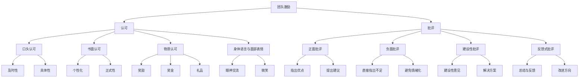

                 

### 引言

在信息化飞速发展的今天，团队已成为企业核心竞争力的重要组成部分。而如何激发团队的潜力，提高团队的整体绩效，成为每一位领导者都需要深思熟虑的问题。本文以《团队激励：认可与批评的平衡艺术》为题，旨在探讨如何通过认可与批评的平衡艺术来提升团队士气、激发团队成员的积极性，从而实现团队的持续进步。

团队激励不仅仅是奖励优秀员工那么简单，它涉及到认可与批评的各个方面。正确的认可可以增强团队成员的自信心和归属感，而恰当的批评则能帮助他们认识到自己的不足，不断改进。然而，如何在这两者之间找到平衡点，是每一个领导者都必须面对的挑战。

本文将分为七个主要部分，首先介绍团队激励的重要性及其理论基础。接下来，我们将详细探讨认可的艺术，包括认可的概念、类型、技巧以及实践案例。随后，我们将深入分析批评的艺术，从定义、类型、技巧到实践案例进行全面剖析。在第四部分，我们将探讨如何实现认可与批评的平衡，并介绍相关策略与实践案例。第五部分将聚焦于领导者的角色，讨论领导者如何发挥激励作用。第六部分将探讨团队激励的持续改进与反馈机制的建设。最后，我们将总结全文，展望未来，并对团队成员提出期望。

通过这篇文章，我们希望帮助读者理解团队激励的深层逻辑，掌握认可与批评的平衡艺术，从而在团队管理中游刃有余，实现团队的共同成长。### 第一部分：引言

#### 1.1 团队激励的重要性

在当今竞争激烈的市场环境中，企业的发展离不开团队的力量。而如何激发团队的潜能，提升团队的整体绩效，成为每一位领导者需要深入思考的问题。团队激励作为一种有效的管理手段，不仅可以提高员工的工作积极性，还能促进团队的协作与凝聚力。团队激励的重要性主要体现在以下几个方面：

1. **提高员工积极性**：通过认可与奖励，激发员工的内在动力，使他们在工作中更加投入和努力。
2. **增强团队凝聚力**：团队激励能够增强团队成员之间的联系，提升团队的协作能力和整体战斗力。
3. **促进个人成长**：合理的激励机制可以帮助员工认识到自己的价值，鼓励他们不断学习和提升自身能力。
4. **实现企业目标**：通过激发团队潜力，提高团队绩效，有助于企业实现战略目标，增强市场竞争力。

#### 1.2 本书的目的与结构

本书旨在探讨团队激励的核心理论和方法，特别是认可与批评的平衡艺术。通过深入分析认可与批评的概念、类型、技巧和实践案例，帮助读者理解如何在团队管理中实现有效激励，提升团队绩效。本书的结构如下：

1. **第一部分：引言**：介绍团队激励的重要性以及本书的目的与结构。
2. **第二部分：认可的艺术**：详细探讨认可的概念、类型、技巧以及实践案例。
3. **第三部分：批评的艺术**：深入分析批评的概念、类型、技巧以及实践案例。
4. **第四部分：认可与批评的平衡**：探讨如何实现认可与批评的平衡，并介绍相关策略与实践案例。
5. **第五部分：领导者的角色**：讨论领导者在团队激励中的作用以及如何发挥激励作用。
6. **第六部分：持续改进与反馈**：探讨团队激励的持续改进与反馈机制的建设。
7. **第七部分：结论**：总结全文，展望未来，并对团队成员提出期望。

通过以上结构，本书旨在为读者提供一套系统的团队激励理论和方法，帮助他们在实际工作中更好地运用认可与批评的平衡艺术，提升团队绩效，实现共同成长。

#### 1.3 团队激励的理论基础

团队激励的理论基础主要源于激励理论和行为科学，其中关键理论包括马斯洛的需求层次理论、赫茨伯格的双因素理论以及目标设定理论。

**马斯洛的需求层次理论**：马斯洛认为人类需求可以分为五个层次：生理需求、安全需求、社交需求、尊重需求和自我实现需求。团队激励需要从满足不同层次的需求出发，以激发员工的内在动力。例如，通过提供合理的薪酬和福利，可以满足员工的生理需求和安全需求；通过团队活动和社交机会，可以满足员工的社交需求；通过认可和奖励，可以满足员工的尊重需求；通过提供职业发展机会，可以满足员工的自我实现需求。

**赫茨伯格的双因素理论**：赫茨伯格认为工作满意度由两个因素决定：内在激励因素（如成就、认可、工作本身等）和外在激励因素（如薪酬、工作环境等）。团队激励的关键在于平衡这两个因素，通过内在激励提升员工的满意度和绩效。例如，通过设置有挑战性的任务和提供及时的认可，可以增强员工的内在激励；通过提供有竞争力的薪酬和良好的工作环境，可以吸引和留住优秀人才。

**目标设定理论**：目标设定理论认为，明确的、具有挑战性的目标能够激励员工努力工作，提高绩效。团队激励需要与目标设定相结合，确保员工明确自己的工作目标，并为之努力。例如，通过设定短期和长期目标，可以激励员工在短期内取得成就，同时在长期内实现职业发展。此外，目标设定需要与员工的个人兴趣和职业规划相结合，以确保目标的可行性和员工的主观能动性。

综上所述，团队激励的理论基础是多样化的，涵盖了人类需求、工作满意度和目标设定等多个方面。这些理论为团队激励提供了指导原则，帮助领导者更好地理解和运用认可与批评的平衡艺术，从而提升团队绩效和员工满意度。

### 第二部分：认可的艺术

#### 2.1 认可的概念与类型

认可，作为一种管理手段，是团队激励的重要组成部分。它不仅仅是对员工工作成果的肯定，更是对员工努力和付出的认可。认可可以分为以下几种类型：

1. **口头认可**：这种认可形式最为直接，通常包括表扬、鼓励和感谢。例如，领导在团队会议中表扬某位员工的出色表现，或者在日常工作中对员工的努力表示认可。
   
2. **书面认可**：书面认可包括奖状、感谢信、荣誉证书等，它们通常具有形式化的特点，能够长期保存，并在需要时展示给员工。

3. **物质认可**：物质认可通过提供奖励、奖金、礼品等方式来表达对员工的认可。这种认可形式往往更具吸引力，能够直接提高员工的满意度。

4. **身体语言与面部表情**：身体语言和面部表情也是认可的重要形式。例如，领导对员工的点头、微笑、握手等，都可以传达出对员工的认可和鼓励。

#### 2.2 提高认可技巧

为了提高认可技巧，领导者需要掌握以下几个方面：

1. **有效的口头认可**：
   - **及时性**：及时表达认可可以增强其效果。例如，在员工完成一项重要任务后，立即给予表扬和感谢。
   - **具体性**：认可应当具体明确，指出员工具体做对了什么，从而让他们明白自己的价值。

2. **书面认可的技巧**：
   - **个性化**：书面认可应当根据员工的特点进行个性化定制，使之感到被重视。
   - **正式性**：虽然书面认可需要正式，但也可以适当加入一些温馨的话语，使之更加亲切。

3. **身体语言与面部表情**：
   - **眼神交流**：与员工进行眼神交流，可以传达出真诚的认可和关注。
   - **微笑**：微笑是一种非常有效的认可方式，它能够传递出积极的情绪，增强团队的凝聚力。

#### 2.3 认可策略的应用

1. **针对不同团队成员的认可策略**：
   - **高需求者**：这类员工往往更注重成就感和认可，领导者可以设置有挑战性的任务，并在他们完成任务后进行认可。
   - **低需求者**：这类员工可能更注重稳定和安全感，领导者可以通过提供稳定的任务和明确的目标来进行认可。

2. **认可与反馈的关系**：
   - **正向反馈**：认可与反馈是相互关联的，认可可以看作是正向反馈的一种形式。通过持续的正向反馈，可以增强员工的积极性和自信心。
   - **持续认可**：持续认可比一次性认可更能激发员工的长期动力，领导者应当在日常工作中不断给予认可。

#### 2.4 认可的实践案例

1. **企业A的成功案例**：
   - 企业A通过设立“月度明星员工”奖项，对表现优异的员工进行公开表扬和物质奖励。这一措施显著提升了员工的积极性和团队凝聚力。

2. **团队B的认可实践**：
   - 团队B采用每日站会的形式，每位成员在站会上分享自己的工作进展和遇到的问题。团队成员之间互相认可，促进了信息共享和协作。

通过以上内容，我们了解了认可的概念、类型以及提高认可技巧的方法。在接下来的部分，我们将继续探讨认可策略的应用和实践案例，帮助读者更深入地理解认可的艺术。

#### 2.4 认可的实践案例

认可作为一种强大的激励工具，其实际应用在各个企业和团队中取得了显著的效果。以下将介绍两个具体的实践案例，详细分析这些案例中的认可策略及其成效。

**企业A的成功案例**

企业A是一家高科技公司，其管理层深刻认识到认可的重要性，并设计了一套完善的认可体系。该体系包括以下几个关键点：

- **定期评选**：企业A每月会评选出“月度明星员工”，对他们在过去一个月中的突出表现进行公开表彰。评选标准包括工作成果、团队贡献、创新能力等多个维度。
- **物质奖励**：月度明星员工不仅会得到企业颁发的荣誉证书，还能获得一笔可观的奖金和公司股票。这种物质奖励不仅提高了员工的满意度，还增强了他们对公司的归属感。
- **公开表扬**：月度明星员工的事迹会在公司内部网站上公布，并邀请他们的家人和朋友参加颁奖典礼。这种公开表扬不仅提升了获奖员工的自信心，还激励了其他员工积极向上。

**效果分析**：
- **员工满意度提高**：物质奖励和公开表扬使得员工感受到了企业的认可和尊重，从而提升了他们的工作满意度和忠诚度。
- **团队凝聚力增强**：月度评选活动促进了团队成员之间的相互认可和尊重，增强了团队凝聚力。
- **绩效提升**：认可体系激励了员工的工作积极性，使得整个团队的工作效率和质量显著提升。

**团队B的认可实践**

团队B是一个敏捷开发的软件团队，他们通过一些日常的认可策略来激发团队成员的积极性。以下是他们的具体做法：

- **每日站会**：团队B每天早晨会举行短暂的站会，每位成员分享自己昨天的工作进展和今天的计划。在站会中，团队成员会互相认可彼此的成就，例如“昨天小张解决了那个棘手的问题，非常棒！”这种认可通过公开的方式传达给所有人，增强了成员之间的互信和协作。
- **即时反馈**：团队B鼓励成员在日常工作中给予即时反馈，无论是正面还是负面的。正面反馈可以帮助成员认识到自己的优点和努力的价值，而负面反馈则提供了改进的机会。
- **小团体认可**：团队B还设立了“小团队之星”奖项，每个小组每个月会评选出一位表现最出色的成员。这种小团体认可使得成员感受到来自团队内部的重视和尊重。

**效果分析**：
- **信息共享和协作**：每日站会和即时反馈促进了团队成员之间的信息共享和协作，提高了团队的整体效率。
- **员工自信心增强**：通过小团体认可和即时反馈，团队成员的自信心得到了显著提升，他们更加积极地参与团队活动和项目。
- **创新氛围**：团队B的认可实践营造了一个积极向上的创新氛围，成员们愿意分享自己的想法和建议，推动了团队的创新和发展。

通过以上两个案例，我们可以看到，认可不仅能够提高员工的满意度和团队凝聚力，还能够显著提升团队的整体绩效。在接下来的部分，我们将继续探讨如何在实际工作中有效应用认可策略，帮助读者进一步提升团队激励的效果。

### 第三部分：批评的艺术

#### 3.1 批评的概念与类型

批评是一种反馈机制，旨在帮助团队成员认识到自身的不足，并通过改进来提高绩效。批评可以分为以下几种类型：

1. **正面批评**：正面批评旨在指出员工做得好的一面，同时提出改进的建议。这种批评方式能够激励员工保持优点，并朝着更好的方向发展。

2. **负面批评**：负面批评直接指出员工的错误和不足，目的是促使他们改正问题。然而，如果使用不当，负面批评可能会导致员工产生抵触情绪，影响团队合作。

3. **建设性批评**：建设性批评是一种旨在提供建设性意见和帮助的批评方式。它不仅指出问题，还提出具体的解决方案，帮助员工改进。

4. **反馈式批评**：反馈式批评是一种通过反馈机制进行批评的方式，通常包括对员工过去工作的总结和未来改进的方向。

#### 3.2 有效批评的技巧

为了确保批评的效果，领导者需要掌握以下技巧：

1. **选择合适的时机**：批评应当在适当的时机进行，避免在情绪激动或公众场合下进行，以免造成不必要的尴尬和冲突。

2. **保持冷静**：在批评过程中，领导者应保持冷静和客观，避免情绪化的表达，以免造成员工的抵触。

3. **具体明确**：批评应当具体明确，指出问题的具体表现，避免含糊其辞，让员工难以理解。

4. **关注改进**：批评不应仅仅停留在指出问题，而应关注如何改进，提供具体的解决方案和帮助。

5. **积极倾听**：在批评过程中，领导者应积极倾听员工的意见和反馈，尊重他们的感受，从而建立良好的沟通和信任关系。

#### 3.3 批评策略的应用

1. **针对不同团队成员的批评策略**：
   - **高需求者**：这类员工通常能够接受较为直接和具体的批评，领导者可以提供明确的改进建议，鼓励他们自我提升。
   - **低需求者**：这类员工可能对批评较为敏感，领导者应采用更加温和和鼓励性的批评方式，帮助他们逐步改进。

2. **批评与激励的关系**：
   - **正向激励**：通过适当的激励措施，如认可和奖励，可以增强员工对批评的接受程度，提高改进的动力。
   - **负向激励**：负向激励（如惩罚）应谨慎使用，避免造成员工的抵触和消极情绪。

#### 3.4 批评的实践案例

1. **企业C的批评实践**

企业C是一家大型制造公司，他们采用了一种系统化的批评机制，旨在通过建设性批评来提升员工绩效。以下是他们的具体做法：

- **定期绩效反馈**：企业C每季度会对员工进行一次绩效评估，通过一对一的反馈会议，领导层会详细指出员工在工作中的优点和不足，并提供改进建议。
- **建设性对话**：在批评过程中，领导层会与员工进行深入的对话，了解他们的想法和感受，共同探讨改进措施。
- **持续跟进**：绩效反馈会议后，领导层会持续关注员工的改进情况，并在后续的反馈中给予积极的反馈和支持。

**效果分析**：
- **员工成长**：通过建设性批评和持续跟进，员工能够更好地认识到自己的不足，并积极改进，促进了个人成长。
- **团队协作**：建设性批评有助于增强团队成员之间的信任和协作，提高了整体团队绩效。

2. **团队D的批评策略**

团队D是一个创业团队，他们采用了更加灵活和互动的批评策略。以下是他们的做法：

- **开放反馈**：团队D鼓励成员在每周的团队会议中分享彼此的反馈和建议，无论是正面还是负面。这种方式促进了团队成员之间的开放沟通和相互理解。
- **即时反馈**：团队成员在日常工作中发现问题时，会即时进行反馈，并通过讨论找到解决方案。这种即时反馈有助于快速解决问题，避免问题积累。

**效果分析**：
- **问题解决**：通过开放反馈和即时反馈，团队D能够迅速识别并解决问题，提高了团队的整体效率和稳定性。
- **团队凝聚力**：开放和互动的批评方式增强了团队成员之间的信任和凝聚力，使得团队更加团结和协作。

通过以上实践案例，我们可以看到，有效的批评不仅能够帮助员工认识到自身的不足，还能促进团队的整体发展和协作。在接下来的部分，我们将继续探讨如何在实际工作中运用批评策略，实现团队激励的平衡。

### 第四部分：认可与批评的平衡

#### 4.1 平衡认可与批评的重要性

在团队管理中，认可与批评的平衡至关重要。过于注重认可而忽视批评，可能导致团队成员过于安逸，缺乏改进的动力；而过于强调批评而忽视认可，则可能引发团队成员的挫败感和抵触情绪。因此，如何在两者之间找到平衡点，是提升团队绩效和凝聚力的关键。

平衡认可与批评的重要性体现在以下几个方面：

1. **提升员工满意度**：适当的认可可以增强员工的积极性和满意度，而合理的批评则有助于员工认识到自身的不足，提高工作质量。
2. **促进个人成长**：认可和批评相互补充，可以帮助员工在认可中找到自信，在批评中找到方向，实现个人成长。
3. **增强团队凝聚力**：平衡的认可与批评有助于建立积极的工作氛围，增强团队成员之间的信任和协作。
4. **实现企业目标**：通过合理的认可与批评，企业能够激发员工的潜力，提高整体绩效，从而实现战略目标。

#### 4.2 实现认可与批评的平衡策略

1. **建立积极的工作氛围**：

   - **鼓励开放沟通**：营造一个开放和包容的沟通氛围，鼓励团队成员分享想法和反馈，减少批评的负面效应。
   - **强化认可文化**：在企业内部建立认可文化，通过各种形式的认可活动，如表彰大会、团队建设活动等，提升员工的认可感和归属感。

2. **定期进行团队反馈**：

   - **绩效评估**：通过定期的绩效评估，对团队成员的表现进行客观评估，并给予适当的认可和批评。
   - **反馈会议**：定期举行反馈会议，团队成员可以分享工作进展、遇到的困难和改进措施，领导层则在会议中进行及时的认可与批评。

3. **认可与批评的节奏控制**：

   - **合理分配**：在团队管理中，应合理分配认可与批评的比例，避免过度倾斜。例如，在完成重要任务或项目后，可以适当增加认可的比例，而在日常工作中，批评应更加注重建设性。
   - **适时调整**：根据团队的不同发展阶段和工作环境，适时调整认可与批评的比例，确保两者的平衡。

#### 4.3 平衡的实践案例

1. **企业E的平衡实践**

企业E是一家拥有多年管理经验的高科技企业，他们通过一系列措施实现了认可与批评的平衡。以下是他们的具体做法：

- **定期表彰**：企业E每月举行一次表彰大会，对在过去一个月中表现优异的员工进行表彰和奖励，增强员工的认可感。
- **即时反馈**：在日常工作中，领导层会通过即时反馈机制，对员工的表现进行及时的认可和批评，确保问题得到及时解决。
- **绩效评估**：每季度，企业E会进行一次全面的绩效评估，结合认可与批评，为员工的职业发展提供指导。

**效果分析**：
- **员工积极性提升**：通过定期的表彰和即时反馈，员工的积极性得到了显著提升，工作氛围更加积极向上。
- **团队凝聚力增强**：平衡的认可与批评促进了团队成员之间的相互理解和支持，增强了团队的凝聚力。

2. **团队F的平衡策略**

团队F是一个敏捷开发的软件团队，他们采用了灵活的平衡策略，以实现高效的团队管理。以下是他们的做法：

- **每日站会**：团队F每日举行短暂的站会，成员们会分享工作进展和遇到的问题，领导层则通过站会进行及时的认可与批评。
- **开放式反馈**：团队F鼓励成员在每周的团队会议中分享彼此的反馈和建议，无论是正面还是负面，通过开放沟通实现平衡。
- **持续跟进**：领导层会持续关注团队成员的改进情况，并在后续的工作中进行及时的认可与批评。

**效果分析**：
- **问题解决效率提高**：通过每日站会和开放式反馈，团队F能够迅速识别并解决问题，提高了团队的运作效率。
- **团队凝聚力增强**：通过持续跟进和开放沟通，团队成员之间的信任和协作得到了增强，团队凝聚力显著提升。

通过以上实践案例，我们可以看到，实现认可与批评的平衡不仅能够提升员工满意度和团队绩效，还能增强团队的凝聚力和稳定性。在接下来的部分，我们将继续探讨领导者在团队激励中的角色，以及如何通过有效的激励策略提升团队整体效能。

### 第五部分：领导者的角色

#### 5.1 领导者的激励作用

在团队激励中，领导者的角色至关重要。领导者不仅是团队的核心人物，更是激励团队成员的重要推动力。以下从几个方面探讨领导者在团队激励中的作用：

1. **设定愿景和目标**：领导者需要明确团队的愿景和目标，将其传达给团队成员，并激发他们的热情和动力。通过设定明确、具有挑战性的目标，领导者能够引导团队成员朝着共同的方向努力。

2. **塑造积极的工作氛围**：领导者需要营造一个积极、开放和包容的工作环境，鼓励团队成员之间的沟通和协作。这种氛围能够增强员工的归属感和团队凝聚力，从而提高工作积极性。

3. **提供认可与反馈**：领导者应当关注团队成员的表现，并通过认可和反馈来激励他们。认可可以增强员工的自信心和积极性，而及时的反馈则能够帮助他们认识到自己的不足，促进改进。

4. **培养员工能力**：领导者需要关注团队成员的个人发展，提供培训和学习机会，帮助他们提升技能和知识。通过培养员工的能力，领导者能够增强他们的职业竞争力，提高整体团队的绩效。

5. **解决冲突和问题**：领导者需要及时发现和处理团队中的冲突和问题，确保团队运作的顺畅。通过有效的沟通和调解，领导者能够帮助团队成员克服困难，保持团队的稳定和协作。

#### 5.2 领导者的认可与批评责任

领导者在团队激励中的认可与批评责任至关重要。以下从几个方面探讨领导者的认可与批评责任：

1. **公正无私**：领导者在进行认可与批评时，应保持公正无私，避免偏袒或偏见。只有公正的认可与批评，才能赢得团队成员的信任和支持。

2. **具体明确**：领导者在认可与批评时，应具体明确，避免含糊其辞。明确的认可能够增强员工的自豪感和动力，而具体的批评则能够帮助员工明确改进的方向。

3. **适时适度**：领导者需要根据团队的实际情况和员工的个人表现，适时适度地进行认可与批评。过度的认可可能导致员工产生依赖心理，而过度的批评则可能打击员工的积极性。

4. **积极引导**：领导者应通过积极的引导，帮助员工认识到自己的价值和改进的方向。在批评过程中，领导者应注重建设性，提出具体的改进建议，以促进员工的成长。

5. **以身作则**：领导者应以身作则，通过自己的行为树立榜样。领导者自身的认可与批评方式，会直接影响到团队成员的行为和态度。因此，领导者需要通过自身的实践，为团队成员树立正确的认可与批评榜样。

#### 5.3 领导者的激励技巧

为了有效发挥领导者的激励作用，领导者需要掌握以下激励技巧：

1. **倾听与沟通**：领导者需要倾听团队成员的意见和需求，并通过有效的沟通建立信任关系。通过倾听和沟通，领导者能够更好地了解团队成员的心理和需求，从而提供更有针对性的激励。

2. **个性化激励**：领导者应根据团队成员的不同特点和需求，制定个性化的激励策略。例如，对于追求成就感的员工，可以设置具有挑战性的任务；对于重视稳定感的员工，可以提供明确的职业发展路径。

3. **反馈与认可**：领导者应及时给予团队成员反馈和认可，以增强他们的自信心和动力。反馈应当具体明确，认可应当及时且具有针对性。

4. **培训与发展**：领导者应关注团队成员的能力提升，提供培训和学习机会，帮助他们不断成长。通过培训与发展，领导者能够增强团队成员的专业能力和职业素养。

5. **鼓励创新与尝试**：领导者应鼓励团队成员勇于创新和尝试，创造一个宽松、包容的工作环境。通过鼓励创新，领导者能够激发团队成员的创造力和主动性，推动团队的发展。

通过以上激励技巧，领导者能够更好地发挥激励作用，提升团队绩效和凝聚力，实现团队的共同成长。

#### 5.4 领导者的激励实践

为了更好地理解领导者在团队激励中的实践，以下将介绍两个领导者的具体案例。

**领导者A的激励实践**

领导者A是一家中型科技公司的项目经理，他在团队激励方面有着丰富的经验。以下是他的具体做法：

1. **设定明确目标**：在项目启动时，领导者A会与团队一起设定明确的目标和里程碑，确保每个团队成员都清楚项目的方向和预期成果。

2. **个性化激励**：领导者A了解团队成员的不同需求和特点，他根据每位员工的兴趣和能力，为他们量身定制任务和挑战。例如，对于喜欢解决复杂问题的员工，他安排了更具挑战性的任务。

3. **及时反馈与认可**：领导者A注重与团队成员的沟通，他会在每次会议和项目进展中，给予及时的反馈和认可。对于表现突出的员工，他会公开表扬，并给予一定的奖励，如额外的休息时间或奖金。

4. **培养能力**：领导者A鼓励团队成员参加培训和学习，他自己也会参与其中，以身作则。他相信，通过不断学习和提升能力，团队能够更好地应对挑战。

5. **鼓励创新**：领导者A鼓励团队成员大胆尝试新的想法和方法，他相信创新是团队进步的重要动力。在他的带领下，团队在多个项目中取得了显著的创新成果。

**效果分析**：
- **团队凝聚力增强**：通过明确目标和个性化激励，团队成员之间的沟通和协作更加顺畅，团队的凝聚力显著增强。
- **绩效提升**：及时的反馈和认可激励了团队成员的积极性，项目进度和质量得到了显著提升。

**领导者B的激励策略**

领导者B是一家大型零售企业的店长，他通过一系列策略来激励团队成员。

1. **建立团队合作氛围**：领导者B非常注重团队合作，他定期组织团队建设活动，增强团队成员之间的信任和协作。

2. **绩效评估与奖励**：领导者B每季度对团队成员进行绩效评估，根据评估结果给予奖励和晋升机会。这种透明和公正的评估体系增强了员工的公平感。

3. **提供培训机会**：领导者B积极为团队成员提供各种培训和学习机会，帮助他们提升专业技能和知识。他认为，员工的成长是企业发展的重要保障。

4. **鼓励员工参与决策**：领导者B鼓励员工参与决策过程，让他们感受到自己的价值和重要性。这种方式不仅提高了员工的积极性，还增强了他们的主人翁意识。

5. **关注员工心理健康**：领导者B关注员工的心理健康，他定期与员工进行一对一的沟通，了解他们的工作和生活状况，提供必要的支持和帮助。

**效果分析**：
- **员工满意度提高**：通过绩效评估、培训和决策参与，员工感受到了企业的关注和认可，员工满意度显著提高。
- **团队绩效提升**：团队成员在领导者的激励下，工作积极性和创造力得到了显著提升，团队的整体绩效也得到了显著提升。

通过以上两个领导者的实践案例，我们可以看到，有效的团队激励不仅需要明确的策略和措施，还需要领导者的正确引导和持续关注。在接下来的部分，我们将探讨团队激励的持续改进与反馈机制的建设。

### 第六部分：持续改进与反馈

#### 6.1 团队激励的持续改进

团队激励是一个动态的过程，需要不断地进行改进和优化。以下是一些关键的策略和步骤：

1. **定期评估与反思**：领导者应定期对团队激励措施进行评估和反思，了解其效果和不足。通过问卷调查、访谈等方式，收集团队成员的反馈，分析激励措施的实际效果。

2. **调整激励机制**：根据评估结果，领导者需要及时调整激励机制，确保其能够更好地满足团队成员的需求。例如，如果发现某些激励措施效果不佳，可以尝试引入新的奖励方式或调整奖励标准。

3. **持续培训与发展**：领导者应关注团队成员的能力提升，提供持续培训和发展机会。通过不断的学习和提升，团队成员能够更好地适应工作需求，提高绩效。

4. **建立反馈机制**：建立有效的反馈机制，确保团队成员能够及时、准确地反馈问题和建议。领导者应鼓励团队成员积极参与反馈，并将其作为改进激励措施的重要依据。

5. **数据驱动决策**：利用数据来驱动决策，通过分析团队成员的工作数据和绩效数据，识别出激励措施的优缺点，为持续改进提供依据。

#### 6.2 反馈机制的建设

一个有效的反馈机制是团队激励持续改进的关键。以下是一些关键的建设步骤：

1. **明确反馈目的**：确保团队成员理解反馈的目的和重要性，使其能够积极参与并给予真实、有价值的反馈。

2. **多渠道收集反馈**：通过多种渠道收集反馈，如定期调查、一对一访谈、团队会议等。确保反馈来源的多样性和全面性。

3. **建立反馈流程**：明确反馈的流程和规则，确保反馈能够得到及时处理和反馈。例如，可以设定反馈提交的截止日期，并安排专人负责反馈的整理和分析。

4. **保护反馈者**：确保反馈者的隐私和安全，避免反馈过程中出现报复行为。建立保护机制，鼓励团队成员敢于提出真实反馈。

5. **定期总结与汇报**：对收集到的反馈进行定期总结和分析，形成反馈报告，并向团队成员汇报改进措施和进展。这有助于提高反馈的透明度和信任度。

6. **持续优化反馈机制**：根据反馈机制的实施效果，不断优化和完善，确保其能够更好地满足团队激励的需求。

#### 6.3 反馈实践的案例

**企业G的反馈实践**

企业G是一家国际知名的咨询公司，他们通过一系列完善的反馈机制，实现了团队激励的持续改进。以下是他们的具体做法：

1. **季度绩效反馈**：企业G每季度都会进行一次全面的绩效反馈，领导层会与每位员工进行一对一的绩效反馈会议，详细讨论工作表现和改进方向。

2. **360度评估**：企业G采用了360度评估方法，不仅由上级对员工进行评估，还包括同事、下属和客户的评价。这种多角度的评估有助于全面了解员工的表现。

3. **即时反馈**：企业G鼓励团队成员在日常工作中进行即时反馈，通过电子邮件、在线工具等方式，及时沟通问题和建议。这种即时反馈机制有助于快速解决问题，提高团队运作效率。

4. **员工调查**：企业G定期进行员工满意度调查，了解员工的反馈和建议。通过分析调查结果，公司能够及时调整激励措施，满足员工的需求。

**效果分析**：
- **员工满意度提高**：通过全面的反馈机制，员工感受到了公司的关注和尊重，员工满意度显著提高。
- **绩效提升**：及时和全面的反馈机制帮助员工认识到自己的不足，并积极改进，整体绩效得到提升。

**团队H的反馈策略**

团队H是一家初创科技公司，他们采用了灵活的反馈策略，以适应快速变化的工作环境。以下是他们的具体做法：

1. **每日站会**：团队H每天举行短暂的站会，团队成员会分享工作进展和遇到的问题，并进行即时反馈和讨论。

2. **开放式反馈**：团队H鼓励团队成员在每周的团队会议上分享反馈和建议，无论是正面还是负面。通过开放沟通，团队成员能够更好地理解彼此的需求和期望。

3. **定期反馈会议**：团队H每季度会举行一次反馈会议，领导层会与团队成员进行深入的反馈和讨论，制定改进计划和目标。

4. **匿名反馈**：团队H提供匿名反馈渠道，确保团队成员能够自由地表达真实的意见和建议，而不必担心报复。

**效果分析**：
- **团队凝聚力增强**：通过每日站会和开放式反馈，团队成员之间的沟通和协作更加顺畅，团队凝聚力显著提升。
- **创新氛围**：开放和灵活的反馈机制促进了团队成员的创新思维，推动了团队的创新和发展。

通过以上实践案例，我们可以看到，有效的反馈机制和持续改进策略对于团队激励的重要性。在接下来的部分，我们将总结全文，展望未来，并对团队成员提出期望。

### 第七部分：结论

在本文中，我们系统地探讨了团队激励中的核心概念和方法，特别是认可与批评的平衡艺术。通过深入分析认可与批评的概念、类型、技巧以及实践案例，我们了解到如何通过合理的认可与批评来激发团队成员的积极性、提升团队整体绩效和凝聚力。以下是本文的主要结论：

1. **认可与批评的重要性**：认可与批评是团队激励不可或缺的组成部分，它们相互补充，共同促进团队成员的个人成长和团队发展。
2. **认可的艺术**：通过有效的口头、书面、物质认可和身体语言与面部表情，领导者能够增强员工的自信和归属感，提高团队士气。
3. **批评的艺术**：领导者需要掌握有效的批评技巧，包括选择合适时机、保持冷静、具体明确、关注改进和积极倾听，以确保批评的建设性和有效性。
4. **认可与批评的平衡**：领导者需在认可与批评之间找到平衡点，建立积极的工作氛围，定期进行团队反馈，并适时调整认可与批评的比例。
5. **领导者的角色**：领导者不仅是团队的核心人物，更是激励团队成员的重要推动力。他们通过设定愿景、塑造积极氛围、提供认可与反馈、培养员工能力和解决冲突等手段，发挥激励作用。
6. **持续改进与反馈**：团队激励需要持续改进，领导者应通过定期评估与反思、调整激励机制、持续培训与发展、建立反馈机制和利用数据驱动决策来实现持续改进。

#### 未来展望

随着信息技术的不断发展，团队激励的方法和工具也在不断更新。未来，我们有望看到更多基于人工智能和数据驱动的激励工具，能够更精准地满足团队成员的需求，提升团队绩效。同时，领导者的角色也将更加注重培养员工的自主性和创新能力，推动团队的持续进步。

#### 对团队成员的期望

最后，我们对团队成员提出以下期望：

1. **积极学习**：持续学习新的知识和技能，提升自己的专业能力，以适应快速变化的工作环境。
2. **主动沟通**：积极参与团队沟通，分享自己的想法和建议，增强团队协作和凝聚力。
3. **自我激励**：保持积极的心态，自我激励，不断提升个人绩效，为团队的发展贡献力量。
4. **反馈与改进**：勇于提出反馈和建议，积极参与反馈机制，推动团队的持续改进。

通过共同努力，我们相信团队能够实现持续进步，创造更大的价值。感谢您的阅读，期待在未来的工作中，与您共同成长。作者：AI天才研究院/AI Genius Institute & 禅与计算机程序设计艺术 /Zen And The Art of Computer Programming

### 附录

以下是一些相关的Mermaid流程图和伪代码，用于辅助理解本文的核心概念和算法原理。

#### Mermaid流程图



#### 核心算法原理讲解的伪代码

```plaintext
// 认可的伪代码
function acknowledge(employee, achievement) {
    if (achievement > threshold) {
        sendMail(employee, "恭喜你，你的成就值得认可！");
        sendSMS(employee, "感谢你的辛勤付出，团队因你而更强大！");
    }
}

// 批评的伪代码
function criticize(employee, issue) {
    if (isConstructive) {
        provideConstructiveFeedback(employee, issue);
    } else {
        handleNegativeFeedback(employee, issue);
    }
}

// 反馈机制的伪代码
function feedbackMechanism(employee, feedback) {
    if (isPositiveFeedback) {
        acknowledgeEmployee(feedback);
    } else {
        addressIssue(feedback);
    }
    recordFeedback(feedback);
    analyzeFeedback();
}
```

通过上述流程图和伪代码，我们能够更直观地理解本文的核心概念和算法原理，从而更好地应用于实际工作中。

### 拓展阅读

对于希望进一步深入了解团队激励的读者，以下是一些推荐阅读资料：

1. **《激励心理学》**：作者理查德·L·哈克曼（Richard L. Hackman），详细阐述了团队激励的心理机制和实践方法。
2. **《团队的智慧》**：作者阿兰·林肯（Alan L. Lincoln），探讨了团队协作和激励的深层逻辑，提供了实用的团队管理策略。
3. **《领导者的资质》**：作者约翰·麦克斯韦尔（John C. Maxwell），从领导者的角度出发，讨论了如何通过认可与批评来激励团队成员。

这些书籍将为您提供更全面的理论和实践指导，帮助您在团队激励方面取得更好的成效。

