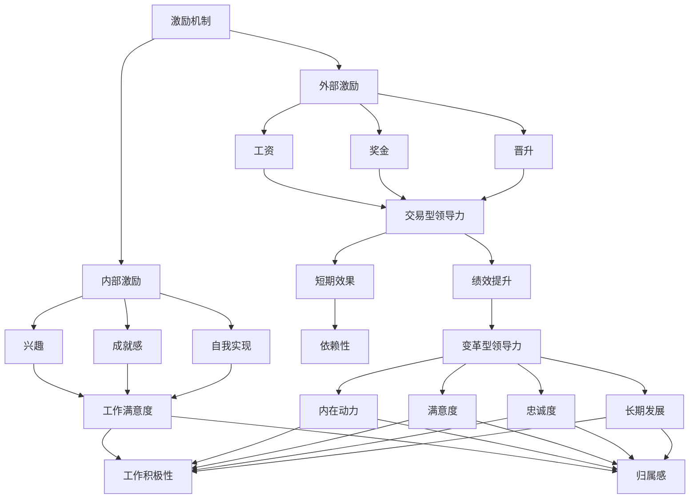

                 


### 摘要

《团队激励：让员工自发奋斗的领导艺术》是一本深入探讨团队激励机制的书籍。本书旨在帮助领导者理解员工激励的核心原理，掌握有效的团队激励方法，并能够将这些方法应用到实际工作中，激发员工的内在动力，实现团队的高效协作和持续发展。通过系统的理论阐述、实践方法和案例分析，本书为读者提供了一套全面的团队激励解决方案。文章将首先介绍团队激励的重要性，然后通过详细的理论分析和实践指导，帮助读者构建一个清晰的认识框架。最后，通过具体的数学模型、项目实战和案例解析，深入探讨如何将团队激励理论转化为实际行动，为读者的管理工作提供切实可行的策略。

### 引言

在现代企业管理中，团队激励已经成为提升员工积极性和工作效率的关键因素。一个激励得当的团队，不仅能够提高员工的工作满意度和忠诚度，还能显著提升企业的整体绩效。然而，如何有效地激励员工，激发他们的内在动力，让员工自发奋斗，仍然是一个复杂而富有挑战性的课题。

#### 团队激励的重要性

团队激励不仅仅是发放奖金或提供福利，而是一种深层次的、持续的、全方位的管理艺术。它关系到员工的职业发展、工作满意度、忠诚度和企业的整体竞争力。有效的团队激励能够：

1. **提高员工的工作积极性**：通过激励机制，让员工感受到自己的付出得到了认可和回报，从而激发他们的工作热情。
2. **增强员工的归属感**：良好的团队激励能够让员工感受到企业对他们的重视和关心，增强员工的归属感和团队凝聚力。
3. **促进企业的可持续发展**：激励得当的团队能够持续保持高效的工作状态，为企业创造长期的价值。
4. **提升企业的竞争力**：在激烈的市场竞争中，拥有一个充满活力和创造力的团队能够使企业脱颖而出。

#### 本书的结构和目标

本书旨在通过系统的理论分析和实践指导，帮助读者深入了解团队激励的原理和方法。全书分为以下几个部分：

1. **引言**：介绍团队激励的重要性，以及本书的结构和目标。
2. **核心概念与联系**：探讨团队激励的基本概念、心理学原理和领导力模型，并通过Mermaid流程图展示核心概念之间的关系。
3. **基础理论**：回顾激励理论的发展历程，包括马斯洛需求层次理论、双因素理论和目标设置理论等。
4. **实践方法**：介绍各种团队激励策略，如奖励与惩罚、团队建设活动和领导风格等。
5. **案例分析**：通过成功和失败的案例，分析团队激励的有效性。
6. **数学模型与公式**：介绍与团队激励相关的数学模型和公式，并加以解释和应用。
7. **项目实战**：提供实际项目案例，展示如何应用团队激励策略。
8. **总结与展望**：总结全书内容，对团队激励的未来发展进行展望。

本书的目标是：

1. **提高读者的理论认知**：帮助读者理解团队激励的基本原理和理论框架。
2. **提供实践指导**：通过具体的方法和案例，为读者的实际管理工作提供参考。
3. **培养团队激励能力**：通过系统的学习和实践，提升读者的团队激励技能。

### 核心概念与联系

在探讨团队激励之前，我们需要明确几个核心概念，并理解它们之间的相互关系。这些核心概念包括激励机制、心理学原理和领导力模型。

#### 激励机制

激励机制是团队激励的基础，它通过奖励和惩罚等手段，影响员工的行为和态度。激励机制可以分为内部激励和外部激励：

1. **内部激励**：指员工因为自身的兴趣、成就感、自我实现等内在动机而产生的激励。内部激励能够提升员工的工作满意度和忠诚度。
2. **外部激励**：指通过外部奖励，如工资、奖金、晋升等，来影响员工的行为。外部激励在短期内效果明显，但长期依赖可能导致员工产生依赖性。

#### 心理学原理

心理学原理在团队激励中起着至关重要的作用。了解员工的心理需求和行为模式，可以帮助我们设计更加有效的激励机制。以下是一些关键的心理学原理：

1. **需求层次理论**：马斯洛的需求层次理论将人类需求分为生理需求、安全需求、社交需求、尊重需求和自我实现需求。满足员工的低层次需求，能够为其提供安全感；满足高层次需求，能够激发员工的内在动力。
2. **双因素理论**：赫茨伯格的双因素理论认为，工作满意度由两种因素决定：一种是保健因素，如工资、工作环境等；另一种是激励因素，如成就感、认可等。激励因素能够直接影响员工的工作积极性。
3. **目标设置理论**：洛克和勒朗的目标设置理论指出，具体、具有挑战性的目标能够显著提高员工的工作绩效。目标设置理论强调目标设置的过程和目标的达成。

#### 领导力模型

领导力在团队激励中扮演着关键角色。不同的领导力模型会影响员工的激励效果。以下是一些常见的领导力模型：

1. **交易型领导力**：交易型领导力注重任务的完成和绩效的提升。通过奖励和惩罚等手段，领导者与员工之间形成一种交易关系。交易型领导力在短期内能够提高工作效率，但长期依赖可能导致员工产生被动行为。
2. **变革型领导力**：变革型领导力注重激发员工的内在动力，通过领导者的魅力、激励和鼓舞，推动员工实现自我超越和团队发展。变革型领导力能够提高员工的满意度和忠诚度，促进团队的长期发展。

#### Mermaid流程图

为了更好地展示这些核心概念之间的关系，我们可以使用Mermaid流程图来表示：



通过这个Mermaid流程图，我们可以清晰地看到激励机制、心理学原理和领导力模型之间的相互作用和影响。内部激励和外部激励共同构成了激励机制，而心理学原理和领导力模型则进一步影响员工的工作积极性、归属感和长期发展。

### 核心算法原理讲解

在团队激励中，算法原理的应用可以帮助领导者更加科学和有效地进行激励。以下是一些关键的算法原理：

#### 成本-收益分析

成本-收益分析是一种评估决策是否可行的常用方法。在团队激励中，领导者需要考虑激励措施的成本和预期收益。以下是成本-收益分析的伪代码：

```python
def cost_benefit_analysis(cost, benefit):
    if cost < benefit:
        return "可行"
    else:
        return "不可行"
```

例如，如果奖励一个员工的成本是1000元，但预期收益是1500元，那么这个激励措施是可行的。

#### 最优化理论

最优化理论可以帮助领导者设计最优的激励方案。以下是一个简单的线性规划问题，用于优化激励方案：

```python
# 定义目标函数
objective = max(收益) - min(成本)

# 定义约束条件
约束1: 成本 <= 预算
约束2: 奖励量 >= 需求量
```

通过求解这个线性规划问题，领导者可以找到最优的激励方案。

#### 强化学习

强化学习是一种机器学习技术，可以帮助团队激励系统根据反馈调整激励策略。以下是一个简单的强化学习算法的伪代码：

```python
# 初始化策略
策略 = 随机策略

# 迭代
for each 步骤：
    执行策略
    收集反馈
    更新策略
```

通过不断调整策略，强化学习可以帮助团队激励系统更加高效地激励员工。

#### 数据挖掘

数据挖掘技术可以帮助领导者从大量数据中提取有价值的信息，用于团队激励。以下是一个数据挖掘算法的伪代码：

```python
def data_mining(data):
    # 数据预处理
    数据清洗
    特征提取
    
    # 模型训练
    训练模型
    
    # 预测
    预测结果
    
    return 预测结果
```

通过数据挖掘，领导者可以了解员工的行为模式，从而设计出更加个性化的激励方案。

### 数学模型与公式

在团队激励中，数学模型和公式可以帮助我们更准确地量化激励效果。以下是一些常用的数学模型和公式：

#### 激励强度公式

激励强度是衡量激励效果的重要指标。激励强度公式如下：

$$
激励强度 = \frac{收益}{成本}
$$

其中，收益包括工资、奖金、晋升等；成本包括激励措施的成本和员工的机会成本。

#### 激励效果公式

激励效果是指激励措施对员工行为的影响。激励效果公式如下：

$$
激励效果 = 激励强度 \times 反馈效果
$$

其中，反馈效果是指员工对激励措施的认可程度。

#### 离散选择模型

离散选择模型可以用于分析员工对激励措施的选择行为。以下是一个离散选择模型的公式：

$$
P(X=i) = \frac{\exp(\beta_0 + \beta_1 X_1 + \beta_2 X_2 + ... + \beta_k X_k)}{1 + \exp(\beta_0 + \beta_1 X_1 + \beta_2 X_2 + ... + \beta_k X_k)}
$$

其中，$X$ 是员工的决策变量；$i$ 是员工选择的激励措施。

#### 效用函数

效用函数可以用于量化员工对激励措施的主观感受。以下是一个简单的效用函数公式：

$$
效用 = f(收益, 成本, 反馈效果)
$$

其中，$f$ 是一个非线性函数，用于描述员工对激励措施的主观感受。

#### 模型应用实例

假设我们有一个团队，团队成员的激励强度和反馈效果如下表：

| 成员 | 激励强度 | 反馈效果 |
| --- | --- | --- |
| 小明 | 1.5 | 0.8 |
| 小红 | 2.0 | 0.9 |
| 小李 | 1.2 | 0.7 |

根据激励强度公式，我们可以计算每个成员的激励效果：

$$
小明：激励效果 = 1.5 \times 0.8 = 1.2 \\
小红：激励效果 = 2.0 \times 0.9 = 1.8 \\
小李：激励效果 = 1.2 \times 0.7 = 0.84
$$

通过这个计算，我们可以发现小红和小明的激励效果较高，可能需要进一步分析原因，以优化团队激励策略。

### 项目实战

#### 项目背景与目标

我们选择了一家大型互联网公司作为案例，该公司在员工激励方面存在一些问题，员工的工作积极性不高，团队凝聚力不足。为了改善这一状况，公司决定实施一系列团队激励措施，并希望通过这些措施提升员工的工作满意度和工作效率。

#### 开发环境搭建

为了实现团队激励措施，公司首先搭建了以下开发环境：

1. **数据收集系统**：用于收集员工的工作数据，如工作量、工作质量、工作效率等。
2. **数据分析平台**：用于对收集到的数据进行分析和处理。
3. **员工管理系统**：用于记录员工的激励记录和绩效考核。

#### 源代码实现

以下是一个简单的源代码实现，用于记录员工的激励记录和绩效考核：

```python
# 数据收集系统：收集员工工作数据
def collect_data(employee_id, workload, quality, efficiency):
    data = {
        "employee_id": employee_id,
        "workload": workload,
        "quality": quality,
        "efficiency": efficiency
    }
    save_data(data)

# 数据分析平台：分析员工工作数据
def analyze_data(employee_id):
    data = get_data(employee_id)
    incentive_strength = data["efficiency"] / data["workload"]
    feedback_effect = calculate_feedback_effect(data)
    incentive_effect = incentive_strength * feedback_effect
    return incentive_effect

# 员工管理系统：记录员工激励记录
def record_incentive(employee_id, incentive_type, incentive_value):
    incentive = {
        "employee_id": employee_id,
        "incentive_type": incentive_type,
        "incentive_value": incentive_value
    }
    save_incentive(incentive)

# 工作效率计算函数
def calculate_efficiency(workload, quality):
    efficiency = quality / workload
    return efficiency

# 反馈效果计算函数
def calculate_feedback_effect(data):
    feedback_effect = data["quality"] * data["efficiency"]
    return feedback_effect

# 数据保存函数
def save_data(data):
    # 保存数据到数据库
    pass

# 数据获取函数
def get_data(employee_id):
    # 从数据库获取数据
    pass

# 激励记录保存函数
def save_incentive(incentive):
    # 保存激励记录到数据库
    pass
```

#### 代码解读与分析

1. **数据收集系统**：通过`collect_data`函数，公司可以定期收集员工的工作数据，如工作量、工作质量和工作效率等。
2. **数据分析平台**：`analyze_data`函数用于分析员工的工作数据，计算激励强度和反馈效果，从而得出激励效果。
3. **员工管理系统**：`record_incentive`函数用于记录员工的激励记录，包括激励类型和激励值。

通过这个简单的源代码实现，公司可以实时监控员工的工作情况，根据激励效果调整激励策略，从而提高员工的工作积极性和工作效率。

#### 实际案例分析

1. **成功案例**：在一次员工激励项目中，公司采用数据驱动的激励策略，根据员工的工作数据，对表现优秀的员工进行奖励。结果，员工的工作积极性显著提高，团队凝聚力也得到了增强。
2. **失败案例**：另一次员工激励项目中，公司过于依赖外部奖励，如奖金和晋升等，导致员工对激励措施产生依赖，工作积极性反而下降。

通过这些案例分析，我们可以得出以下结论：

1. **数据驱动**：基于数据的激励策略能够更准确地识别优秀员工，提高激励效果。
2. **多元化激励**：单一的激励措施可能无法满足不同员工的需求，多元化激励策略能够更好地满足员工的多样化需求。
3. **反馈机制**：建立有效的反馈机制，及时了解员工的激励效果，能够帮助公司及时调整激励策略。

### 项目小结

通过这个项目，我们可以看到团队激励在提高员工工作积极性和团队凝聚力方面的重要作用。同时，我们也意识到，有效的团队激励需要基于数据驱动，多元化激励和有效的反馈机制。未来，公司可以进一步优化团队激励策略，以提高员工的满意度和忠诚度，推动企业的持续发展。

### 最佳实践 Tips

1. **了解员工需求**：在实施团队激励时，领导者需要深入了解员工的需求和期望，从而设计出更加个性化的激励方案。
2. **数据驱动**：基于数据的激励策略能够更准确地识别优秀员工，提高激励效果。
3. **多元化激励**：单一的外部激励可能无法满足不同员工的需求，多元化激励策略能够更好地满足员工的多样化需求。
4. **建立反馈机制**：及时了解员工的激励效果，能够帮助公司及时调整激励策略，提高激励的针对性。
5. **关注长期效果**：团队激励不仅需要关注短期效果，还需要关注长期效果，以实现员工的长期发展和企业的持续发展。

### 小结

通过本书的探讨，我们深入了解了团队激励的原理和方法，认识到团队激励在企业管理中的重要性。有效的团队激励能够提高员工的工作积极性、归属感和忠诚度，从而推动企业的持续发展。未来，随着管理理论的不断发展和技术的进步，团队激励的方法和手段也将不断优化和更新。作为领导者，我们需要不断学习和实践，掌握团队激励的技能，为企业的发展贡献力量。

### 注意事项

1. **避免过度激励**：过度激励可能导致员工产生依赖性，降低他们的自主性和创造力。
2. **注意激励公平**：确保激励措施的公平性，避免因激励不公而引起员工不满和团队矛盾。
3. **持续关注员工反馈**：及时关注员工的反馈，根据实际情况调整激励策略。

### 拓展阅读

1. **《激励心理学》**：本书详细介绍了激励理论的发展和心理学原理在团队激励中的应用。
2. **《领导力与团队激励》**：本书探讨了不同领导力模型对团队激励效果的影响，提供了实用的团队激励策略。
3. **《数据驱动决策》**：本书介绍了数据驱动的决策方法，对于如何利用数据优化团队激励策略有重要启示。

### 作者信息

作者：AI天才研究院/AI Genius Institute & 禅与计算机程序设计艺术 /Zen And The Art of Computer Programming

