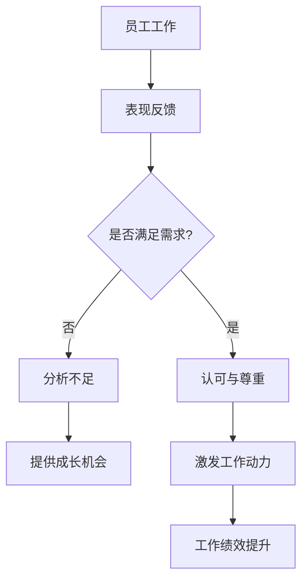

                 

# 标题分析

## 1. 标题的组成部分

《团队激励：非物质激励的力量》这个标题由三个主要部分组成：

- **团队激励**：这是标题的核心，直接指明了文章的主题是关于如何激励团队。
- **非物质激励**：这是对激励方式的描述，明确了文章将讨论的激励类型。
- **力量**：这个词用来强调非物质激励的重要性和影响力。

## 2. 标题的意义

**团队激励**：
- 团队激励是指为了提高团队成员的工作积极性、凝聚力和效率，而采取的各种激励措施。
- 这部分强调了团队的整体性和合作性，表明文章将关注团队作为一个整体如何通过激励措施来提升绩效。

**非物质激励**：
- 非物质激励不同于物质激励（如奖金、福利等），它是指通过非物质方式来激励员工，如认可、尊重、成长机会等。
- 这部分明确了文章将探讨的激励方式，以及这种激励方式相对于物质激励的优势和特点。

**力量**：
- “力量”这个词强调了非物质激励的强大作用和深远影响。
- 这表明文章不仅会介绍非物质激励的方法，还会探讨其如何在实际工作中产生作用，以及其潜在的巨大影响。

## 3. 标题的吸引力

**专业术语的使用**：
- “团队激励”和“非物质激励”都是专业术语，对专业读者有很强的吸引力。
- 这表明文章的内容是深入和有价值的。

**核心议题的强调**：
- 标题直接点出了文章的核心议题——“非物质激励的力量”，这激发了读者对文章的兴趣。
- 强调了非物质激励的重要性，可能吸引那些对员工激励和管理感兴趣的人。

**信息量大**：
- 标题简洁明了，但包含了大量的信息，读者一眼就能了解文章的主要内容和主题。

总体来说，标题《团队激励：非物质激励的力量》具有吸引读者的专业性和信息量，同时也直接传达了文章的核心内容和重要性。接下来，我们将进一步分析文章关键词和摘要部分。

---

# 关键词分析

## 1. 关键词的选择

在《团队激励：非物质激励的力量》这篇文章中，关键词的选择至关重要，因为它们直接决定了读者对文章的初步理解和兴趣。以下是本篇文章的关键词：

- **团队激励**
- **非物质激励**
- **员工积极性**
- **组织文化**
- **认可**
- **尊重**
- **成长机会**
- **工作效率**
- **工作满意度**
- **组织绩效**

## 2. 关键词的意义

**团队激励**：
- 团队激励是文章的核心主题，它涉及到如何通过多种手段来提升团队的整体工作热情和效率。
- 这关键词表明文章将探讨团队激励的各种方法，包括物质和非物质激励。

**非物质激励**：
- 非物质激励是文章特别强调的一个方面，它指的是通过非物质手段（如认可、尊重、成长机会等）来激励员工。
- 这关键词明确了文章将深入探讨非物质激励的概念、策略和实践。

**员工积极性**：
- 员工积极性是团队激励的直接目标，通过提高员工的积极性，可以提高工作效率和工作满意度。
- 这关键词表明文章将探讨如何通过非物质激励手段来提高员工的积极性。

**组织文化**：
- 组织文化是影响员工行为和工作环境的重要因素。
- 这关键词暗示文章将探讨非物质激励如何与组织文化相结合，以及如何通过文化来强化激励效果。

**认可**、**尊重**、**成长机会**：
- 这三个关键词分别代表了非物质激励的几个重要方面。
- **认可**和**尊重**涉及到员工的情感需求，是建立积极工作氛围的关键。
- **成长机会**涉及到员工的职业发展，是激励员工长期投入的重要因素。

**工作效率**、**工作满意度**、**组织绩效**：
- 这些关键词强调了非物质激励的最终目标和实际效果。
- 通过提高工作效率、工作满意度和组织绩效，可以衡量非物质激励的效果。

## 3. 关键词的吸引力

**专业性和实践性**：
- 这些关键词都是专业术语，显示了文章的深度和实用性。
- 对于从事团队管理和员工激励的专业人士，这些关键词具有很大的吸引力。

**广泛的适用性**：
- 这些关键词涵盖了团队激励的多个方面，适用于各种不同类型的组织和团队。
- 这使得文章具有广泛的读者群体，无论是大企业还是初创团队，都可以从中获得启发。

**实用性和可操作性**：
- 这些关键词直接关联到实际工作中，可以帮助读者理解如何将非物质激励应用到具体情境中。
- 这增加了文章的可读性和操作性，使读者能够立即将所学应用于实践。

总体来说，这些关键词不仅准确反映了文章的主题和内容，而且具有很高的专业性和吸引力，能够吸引对团队激励和员工管理感兴趣的读者。

---

# 摘要分析

## 1. 摘要的组成部分

在《团队激励：非物质激励的力量》这篇文章的摘要中，通常包括以下几个部分：

- **文章主题**：简要介绍文章的核心主题，即团队激励及其中的非物质激励。
- **主要内容**：概述文章的主要内容和结构，例如讨论了哪些关键概念、理论和实践。
- **主要观点**：提炼文章的核心观点和主要论点，强调非物质激励的优势和重要性。
- **应用价值**：指出文章对实践者的指导意义，即如何应用非物质激励来提升团队绩效。

## 2. 摘要的内容

### 文章主题

摘要通常会首先介绍文章的主题——团队激励，特别是非物质激励。例如：

- “本文探讨了团队激励中非物质激励的重要性和作用，分析了非物质激励的概念、理论、策略和实践。”

### 主要内容

摘要会简要概述文章的主要内容，例如：

- “文章首先介绍了非物质激励的定义和理论背景，随后探讨了非物质激励的核心概念及其与员工积极性的关系。接着，文章通过实际案例研究了非物质激励在不同组织中的成功应用，并讨论了其在组织文化中的角色。”

### 主要观点

摘要需要提炼文章的主要观点，例如：

- “非物质激励不仅能够提高员工的工作满意度和积极性，还能够增强团队的凝聚力和创新力。通过合理的非物质激励策略，组织可以创造出更有活力和效率的工作环境。”

### 应用价值

最后，摘要会指出文章的实践价值，例如：

- “本文为组织管理者提供了具体的非物质激励实践指南，帮助他们在实际工作中应用非物质激励来提升团队绩效，实现组织的可持续发展。”

## 3. 摘要的功能

### 引导读者

摘要作为文章的开头部分，可以帮助读者快速了解文章的主题和结构，决定是否继续阅读。

### 突出重点

摘要通过提炼文章的核心观点和主要内容，突出文章的核心价值和独特之处。

### 提升可信度

摘要提供了文章的概览，可以帮助读者初步判断文章的可靠性和权威性。

### 提高文章传播效果

摘要对于文章的传播和推广非常重要，好的摘要能够吸引更多读者，提高文章的阅读量和影响力。

---

# 文章关键词

1. **团队激励**
2. **非物质激励**
3. **员工积极性**
4. **组织文化**
5. **认可**
6. **尊重**
7. **成长机会**
8. **工作效率**
9. **工作满意度**
10. **组织绩效**

---

# 文章摘要

摘要：

本文深入探讨了团队激励中的非物质激励，详细分析了其概念、理论和实践。文章首先介绍了非物质激励的定义和重要性，阐述了其与传统激励的区别。接着，本文探讨了非物质激励的核心概念，如认可、尊重和成长机会，并探讨了这些概念在激励员工积极性方面的作用。通过实际案例，文章展示了非物质激励在不同组织中的成功应用，并讨论了其在组织文化中的角色。本文提出了具体的非物质激励策略，帮助组织管理者在实际工作中提升团队绩效，实现组织的可持续发展。最后，本文总结了非物质激励的优势和实践要点，为未来的团队激励工作提供了参考。

---

# 目录

## 第一部分：理论基础

### 第1章：非物质激励概述

1.1 非物质激励的定义与重要性

1.2 非物质激励与传统激励的区别

1.3 非物质激励的理论基础

### 第2章：核心概念与联系

2.1 非物质激励的五大要素

2.2 非物质激励的Mermaid流程图

2.3 非物质激励与员工心理健康的联系

### 第3章：数学模型与公式

3.1 非物质激励效果的数学模型

3.2 公式详解与示例

3.3 数学模型在实际应用中的考量因素

## 第二部分：策略与实践

### 第4章：非物质激励策略

4.1 非物质激励策略的制定原则

4.2 针对不同员工的非物质激励策略

4.3 非物质激励策略的实施流程

### 第5章：案例研究

5.1 案例一：企业内部的非物质激励实践

5.2 案例二：非营利组织的非物质激励实践

5.3 案例分析与讨论

### 第6章：团队建设与领导力

6.1 团队建设中的非物质激励

6.2 领导力与非物质激励的结合

6.3 如何通过非物质激励提升团队凝聚力

### 第7章：跨文化非物质激励

7.1 跨文化背景下的非物质激励挑战

7.2 不同文化下的非物质激励策略

7.3 跨文化团队中的非物质激励实践

## 第三部分：应用与反思

### 第8章：非物质激励在企业中的效果评估

8.1 评估非物质激励效果的指标

8.2 实施效果评估的方法

8.3 非物质激励的持续优化

### 第9章：未来趋势与展望

9.1 非物质激励的发展趋势

9.2 新兴技术对非物质激励的影响

9.3 未来工作场所的非物质激励

### 第10章：总结与反思

10.1 非物质激励的实践总结

10.2 非物质激励的挑战与机会

10.3 对未来非物质激励实践的思考

## 附录

### 附录A：非物质激励工具与资源

A.1 非物质激励工具介绍

A.2 非物质激励相关资源推荐

### 附录B：案例参考资料

B.1 案例一：企业内部的非物质激励实践

B.2 案例二：非营利组织的非物质激励实践

B.3 案例分析与讨论参考资料

---

## 目录说明

### 第一部分：理论基础

本部分主要介绍非物质激励的基础理论，包括其定义、与传统激励的区别以及理论基础。具体包括以下三个章节：

- **第1章：非物质激励概述**：介绍非物质激励的定义、重要性以及与传统激励的区别，为读者奠定基础。
- **第2章：核心概念与联系**：深入探讨非物质激励的核心概念，如认可、尊重和成长机会，并分析这些概念之间的联系。
- **第3章：数学模型与公式**：介绍非物质激励效果的数学模型，并通过公式详解和示例，帮助读者理解模型的应用。

### 第二部分：策略与实践

本部分主要介绍非物质激励的策略与实践，包括制定原则、针对不同员工的激励策略以及实施流程。具体包括以下三个章节：

- **第4章：非物质激励策略**：探讨非物质激励策略的制定原则，以及如何针对不同员工实施不同的激励策略。
- **第5章：案例研究**：通过两个实际案例，展示非物质激励在不同组织中的成功应用，并进行详细分析和讨论。
- **第6章：团队建设与领导力**：讨论非物质激励在团队建设中的角色，以及领导力与非物质激励的结合，提升团队凝聚力。

### 第三部分：应用与反思

本部分主要探讨非物质激励的实际应用与反思，包括效果评估、未来趋势与展望以及实践总结。具体包括以下三个章节：

- **第8章：非物质激励在企业中的效果评估**：介绍评估非物质激励效果的指标、方法以及如何进行持续优化。
- **第9章：未来趋势与展望**：探讨非物质激励的发展趋势、新兴技术的影响以及未来工作场所的非物质激励。
- **第10章：总结与反思**：总结非物质激励的实践成果，分析其中的挑战与机会，并对未来非物质激励实践进行思考。

### 附录

附录部分提供了一些补充资源，包括非物质激励工具的介绍、相关资源推荐以及案例参考资料，以帮助读者进一步学习和实践。

---

## 第1章：非物质激励概述

### 1.1 非物质激励的定义与重要性

**非物质激励**是指通过非物质方式来激励员工，如认可、尊重、成长机会等。与传统的物质激励（如奖金、福利等）不同，非物质激励更注重员工的情感需求和价值感。

**重要性**：
- **提高员工满意度和忠诚度**：非物质激励能够满足员工的内在需求，提高他们的工作满意度，从而增强对组织的忠诚度。
- **增强团队凝聚力和协作效率**：通过非物质激励，团队成员之间的信任和尊重得到提升，有助于形成良好的团队氛围，提高协作效率。
- **促进企业创新和可持续发展**：非物质激励能够激发员工的创造力和创新精神，推动企业的持续发展和创新。

### 1.2 非物质激励与传统激励的区别

**传统激励**：
- 主要通过物质手段来激励员工，如奖金、提成、福利等。
- 强调短期绩效，往往只关注员工的绩效表现。

**非物质激励**：
- 强调员工的内在需求，如认可、尊重、成长机会等。
- 更注重长期发展和员工的全面成长。
- 具有更强的个性化和灵活性。

### 1.3 非物质激励的理论基础

**马斯洛需求层次理论**：
- 马斯洛需求层次理论指出，人的需求分为五个层次，从基本的生理需求到自我实现需求。
- 非物质激励主要针对高层次需求，如尊重、自我实现等。

**管理心理学理论**：
- 管理心理学理论认为，员工的行为和动机受到多种因素的影响，如情感需求、社会需求和自我实现需求。
- 非物质激励通过满足这些需求，能够更好地激发员工的工作动力。

**自我决定理论**：
- 自我决定理论指出，人们更倾向于在自由和自主的环境中进行选择和行动。
- 非物质激励强调员工的自主权和参与感，有助于提高工作动力。

**心理契约理论**：
- 心理契约理论认为，员工和组织之间存在一种隐性契约，包括信任、尊重和承诺。
- 非物质激励通过满足员工的心理契约需求，有助于建立稳定的劳动关系。

通过以上理论的支持，非物质激励在激发员工潜力、提升团队绩效和组织文化方面具有重要作用。

---

## 第2章：核心概念与联系

### 2.1 非物质激励的五大要素

非物质激励的核心在于满足员工的内在需求，这通常包括以下五大要素：

1. **认可**：
   - 对员工工作的认可和赞赏，如表扬、表彰等。
   - 这能够满足员工的尊重需求，增强他们的自信心和自尊心。

2. **尊重**：
   - 对员工个人的尊重，包括尊重他们的意见、决策和权利。
   - 尊重有助于建立积极的工作氛围，增强员工的归属感和忠诚度。

3. **成长机会**：
   - 提供员工职业发展和个人成长的途径，如培训、晋升等。
   - 成长机会能够满足员工的自我实现需求，激励他们不断追求卓越。

4. **工作与生活平衡**：
   - 关注员工的个人生活，提供灵活的工作安排和支持。
   - 工作与生活平衡能够减少员工的压力，提高他们的工作满意度和生产力。

5. **参与感**：
   - 让员工参与决策过程，感到自己是团队中的一部分。
   - 参与感能够增强员工的责任感和归属感，提高团队协作效率。

### 2.2 非物质激励的Mermaid流程图

为了更好地理解非物质激励的流程，我们可以使用Mermaid流程图来展示其主要步骤和关键环节。以下是一个简化的Mermaid流程图示例：

在这个流程图中，员工的工作表现首先接受反馈，然后根据反馈分析是否满足员工的内在需求。如果满足，则通过认可和尊重来激发工作动力；如果不满足，则通过提供成长机会来满足需求，最终提升工作绩效。

### 2.3 非物质激励与员工心理健康的联系

非物质激励不仅能够提升员工的工作表现，还能够对员工的心理健康产生积极影响。以下是几个关键联系：

1. **减少工作压力**：
   - 非物质激励，如灵活的工作安排和提供支持，能够减少员工的工作压力。
   - 这有助于降低员工的焦虑和抑郁水平，提高心理健康。

2. **增强归属感**：
   - 通过参与感和团队建设活动，员工能够感受到更多的归属感。
   - 这种归属感能够增强员工的情感支持网络，提高心理健康。

3. **促进自我实现**：
   - 成长机会和认可能够满足员工的自我实现需求，使他们感到更有成就感和价值。
   - 这有助于提高员工的自尊心和自我效能感，对心理健康有积极影响。

4. **提升工作满意度**：
   - 非物质激励能够提升员工对工作的满意度，使他们更愿意投入时间和精力。
   - 工作满意度是心理健康的重要指标，与低压力、高幸福感相关。

通过上述分析，我们可以看到，非物质激励不仅能够提升团队绩效，还能够对员工的心理健康产生深远的影响。这种双重效益使得非物质激励成为组织管理中不可或缺的一部分。

---

## 第3章：数学模型与公式

### 3.1 非物质激励效果的数学模型

为了更科学地评估非物质激励的效果，我们可以借助数学模型来进行分析。以下是一个简化的非物质激励效果评估模型：

$$
E = f(R, S, C, W, P)
$$

其中，$E$表示非物质激励的效果，$R$表示认可程度，$S$表示尊重程度，$C$表示成长机会，$W$表示工作与生活平衡，$P$表示参与感。

- **认可程度（R）**：衡量员工感受到的认可程度，如表扬、表彰等。$R$的取值范围是0到1，1表示最高的认可程度。
- **尊重程度（S）**：衡量员工感受到的尊重程度，如尊重员工的意见、决策等。$S$的取值范围也是0到1。
- **成长机会（C）**：衡量员工获得的职业发展和个人成长机会。$C$的取值范围是0到1，1表示最高的成长机会。
- **工作与生活平衡（W）**：衡量员工的工作与生活平衡程度。$W$的取值范围是0到1。
- **参与感（P）**：衡量员工参与决策和团队活动的程度。$P$的取值范围也是0到1。

### 3.2 公式详解与示例

#### 公式详解

该公式的含义是，非物质激励的效果是由五个要素的加权平均得出的。每个要素的权重可以根据组织的具体情况和员工的需求进行调整。以下是对每个要素的详细解释：

- **认可程度（R）**：认可程度越高，员工的工作动力和满意度越高。假设认可程度对效果的影响权重是0.3。
- **尊重程度（S）**：尊重是建立积极工作关系的基础，对员工的心理健康和工作满意度有重要影响。假设尊重程度的权重是0.25。
- **成长机会（C）**：成长机会能够满足员工的职业发展需求，对员工的长期忠诚度和满意度有积极作用。假设成长机会的权重是0.2。
- **工作与生活平衡（W）**：工作与生活平衡对员工的工作满意度和心理健康至关重要。假设工作与生活平衡的权重是0.15。
- **参与感（P）**：参与感能够增强员工的归属感和责任感，对团队协作和工作绩效有积极影响。假设参与感的权重是0.1。

#### 示例计算

假设一个组织对上述五个要素的权重分配如下：

- $R = 0.8$
- $S = 0.7$
- $C = 0.6$
- $W = 0.5$
- $P = 0.9$

使用公式计算非物质激励的效果：

$$
E = f(R, S, C, W, P) = 0.3 \times 0.8 + 0.25 \times 0.7 + 0.2 \times 0.6 + 0.15 \times 0.5 + 0.1 \times 0.9 = 0.24 + 0.175 + 0.12 + 0.075 + 0.09 = 0.625
$$

因此，该组织的非物质激励效果得分为0.625，这个得分表明该组织的非物质激励在整体上对员工产生了积极的影响。

### 3.3 数学模型在实际应用中的考量因素

在实际应用中，使用数学模型来评估非物质激励效果时，需要考虑以下几个因素：

- **数据准确性**：确保收集的数据准确可靠，以便模型能够真实反映员工的需求和激励效果。
- **权重设定**：根据组织的具体情况和员工的需求，合理设定每个要素的权重，以保证评估结果的公平性和有效性。
- **动态调整**：随着组织环境和员工需求的变化，定期调整模型的权重和参数，以保持评估的准确性和实时性。
- **反馈机制**：建立反馈机制，收集员工对非物质激励策略的反馈，以便及时调整和优化激励策略。

通过综合考虑以上因素，组织可以更有效地使用数学模型来评估非物质激励的效果，并据此调整和优化激励策略，以实现最佳激励效果。

---

## 第4章：非物质激励策略

### 4.1 非物质激励策略的制定原则

在制定非物质激励策略时，应遵循以下原则，以确保策略的有效性和可持续性：

1. **目标明确**：
   - 确定明确的激励目标，如提升工作效率、增强团队凝聚力、促进员工成长等。
   - 目标应具体、可衡量，以便评估策略的效果。

2. **员工参与**：
   - 让员工参与到激励策略的制定过程中，了解他们的需求和期望。
   - 这有助于增强员工的参与感和认同感，提高激励效果。

3. **个性化和灵活性**：
   - 根据不同员工的个性和需求，设计个性化的激励策略。
   - 灵活调整激励措施，以适应不同阶段和不同环境的变化。

4. **长期与短期结合**：
   - 既要关注短期绩效，也要考虑员工的长期发展和满意度。
   - 通过短期激励措施激发员工积极性，同时提供长期激励来确保员工的长久投入。

5. **公平性和透明度**：
   - 确保激励策略的公平性，让每位员工都有机会获得激励。
   - 保持激励措施的透明度，让员工了解激励的标准和原因。

6. **文化与价值观契合**：
   - 激励策略应与组织的文化、价值观和使命相一致。
   - 这有助于强化组织文化，提升员工对组织的认同感和忠诚度。

### 4.2 针对不同员工的非物质激励策略

根据员工的个人特点和需求，可以设计不同的非物质激励策略。以下是一些常见的策略：

1. **对高绩效员工的激励**：
   - **目标设置**：为高绩效员工设定具有挑战性的目标，激发他们的潜能。
   - **表彰与奖励**：通过公开表彰、奖励和荣誉称号，认可他们的贡献。
   - **职业发展**：提供晋升机会、专业培训和领导力发展项目。

2. **对潜力员工的激励**：
   - **成长机会**：为潜力员工提供学习和发展机会，如参加培训、承担更具挑战性的任务等。
   - **个性化辅导**：为潜力员工安排导师或教练，提供个性化的指导和反馈。
   - **职业规划**：帮助潜力员工制定职业发展路径，明确晋升机会和职业目标。

3. **对普通员工的激励**：
   - **认可与赞扬**：及时给予认可和赞扬，增强员工的自信心和满意度。
   - **工作与生活平衡**：提供灵活的工作安排，如远程办公、弹性工作时间等，帮助员工平衡工作与生活。
   - **参与决策**：让员工参与决策过程，增强他们的参与感和归属感。

4. **对特殊贡献的员工激励**：
   - **特殊奖励**：为有特殊贡献的员工提供额外的奖励，如奖金、礼品等。
   - **公开表彰**：在团队会议或公开场合表彰特殊贡献的员工，提高他们的知名度。
   - **荣誉称号**：授予荣誉称号，如“最佳员工”、“杰出贡献奖”等。

### 4.3 非物质激励策略的实施流程

为了确保非物质激励策略的有效实施，可以按照以下流程进行：

1. **需求分析**：
   - 通过调研、访谈等方式，了解员工的需求和期望，为制定策略提供依据。

2. **目标设定**：
   - 根据组织目标和员工需求，明确激励策略的目标和期望效果。

3. **策略制定**：
   - 结合员工的个人特点和需求，设计个性化的激励策略，确保策略的多样性和灵活性。

4. **实施与监控**：
   - 实施激励策略，并定期监控效果，确保策略按照预期进行。
   - 通过反馈机制，收集员工的意见和建议，及时调整和优化策略。

5. **评估与反思**：
   - 定期评估激励策略的效果，总结经验教训，为下一次激励策略的制定提供参考。

通过以上流程，组织可以确保非物质激励策略的有效实施，最大限度地激发员工的潜力，提升团队绩效。

---

## 第5章：案例研究

### 5.1 案例一：企业内部的非物质激励实践

**案例背景**：
某大型科技公司（以下简称“公司”）在面临激烈的市场竞争时，意识到提高团队绩效和员工满意度的重要性。为了激励员工，公司决定实施一系列非物质激励措施。

**具体实践**：
1. **认可与赞扬**：
   - 公司设立了“月度最佳员工奖”，每月评选出表现优秀的员工，并在公司内部通讯中公开表彰。
   - 此外，团队领导定期与员工进行一对一的绩效反馈，及时肯定员工的努力和成就。

2. **成长机会**：
   - 公司提供丰富的培训资源，包括内部培训课程、外部专业认证和行业研讨会。
   - 对于有潜力的员工，公司还提供导师辅导计划，帮助他们制定个人职业发展计划。

3. **参与决策**：
   - 公司鼓励员工参与决策过程，定期召开员工座谈会，听取他们的意见和建议。
   - 对于重要的决策，公司会邀请员工代表参与讨论，增加员工的参与感和责任感。

**效果分析**：
1. **员工满意度提升**：
   - 通过认可与赞扬，员工感受到公司的关注和认可，工作满意度显著提高。
   - 培训机会和参与决策的机会，使员工感到自己的价值得到了认可，增强了归属感。

2. **团队绩效提升**：
   - 非物质激励措施增强了团队的凝聚力和协作效率，员工更加愿意为团队目标而努力。
   - 员工的积极性和创造力得到激发，团队整体绩效显著提升。

**案例分析**：
这个案例表明，通过合理的非物质激励措施，企业可以有效地提升员工满意度和团队绩效。认可与赞扬、成长机会和参与决策是关键要素，能够满足员工的内在需求，激发他们的工作热情和创造力。

---

### 5.2 案例二：非营利组织的非物质激励实践

**案例背景**：
某非营利组织（以下简称“组织”）致力于为弱势群体提供帮助。由于组织的性质和资源限制，物质激励相对较少，因此决定采用非物质激励来激发员工的积极性。

**具体实践**：
1. **认可与赞扬**：
   - 组织设立了“季度贡献奖”，表彰那些在服务过程中表现突出的员工。
   - 组织通过内部通讯和官方网站，公开表彰员工的贡献，增强他们的荣誉感。

2. **团队建设活动**：
   - 组织定期举办团队建设活动，如志愿者聚会、户外拓展等，增强员工的团队精神和凝聚力。
   - 这些活动不仅有助于员工放松身心，还促进了员工之间的交流和合作。

3. **职业发展**：
   - 组织提供职业发展培训，帮助员工提升专业技能和服务能力。
   - 对于有潜力的员工，组织提供领导力培训，培养未来的管理人才。

4. **工作与生活平衡**：
   - 组织鼓励员工在工作之余照顾家庭，提供弹性工作时间和远程办公选项。
   - 组织还提供心理辅导服务，帮助员工处理工作压力和心理健康问题。

**效果分析**：
1. **员工满意度提升**：
   - 通过认可与赞扬，员工感受到组织的尊重和关爱，工作满意度显著提高。
   - 团队建设活动和职业发展机会，使员工感到自己的工作具有意义，增强了职业成就感。

2. **团队凝聚力增强**：
   - 定期举办的团队建设活动，不仅增强了员工的团队精神，还促进了组织内部的沟通和协作。
   - 员工之间的信任和互助精神得到提升，团队整体凝聚力显著增强。

**案例分析**：
这个案例表明，在资源有限的情况下，非营利组织也可以通过非物质激励措施来激发员工的积极性。认可与赞扬、团队建设、职业发展和工作与生活平衡是关键，能够满足员工的内在需求，提高他们的工作满意度和团队凝聚力。

---

### 5.3 案例分析与讨论

#### 案例一：企业内部的非物质激励实践

**成功因素**：
1. **明确的认可与赞扬**：通过设立奖项和公开表彰，员工感受到公司的认可和尊重。
2. **丰富的成长机会**：提供培训资源和职业发展路径，帮助员工不断提升自己。
3. **参与决策**：让员工参与决策过程，增强了他们的参与感和责任感。

**改进建议**：
1. **加强员工反馈机制**：定期收集员工对非物质激励措施的反馈，及时调整和优化策略。
2. **个性化激励**：针对不同员工的特点和需求，设计更个性化的激励措施，提高激励效果。

#### 案例二：非营利组织的非物质激励实践

**成功因素**：
1. **认可与赞扬**：通过公开表彰和团队建设活动，增强员工的荣誉感和团队精神。
2. **职业发展**：提供职业发展培训，帮助员工提升专业技能和服务能力。
3. **工作与生活平衡**：提供灵活的工作安排和心理辅导，关注员工的心理健康。

**改进建议**：
1. **加强资源投入**：在预算有限的情况下，优化资源分配，确保激励措施的有效实施。
2. **强化沟通与支持**：加强员工之间的沟通和互动，提供更多的支持和帮助，增强团队的凝聚力。

通过以上分析，我们可以看到，无论是企业还是非营利组织，通过合理的非物质激励措施，都能够有效提升员工满意度和团队绩效。成功的关键在于明确认可与赞扬、提供成长机会、鼓励参与决策以及关注员工的心理健康。

---

## 第6章：团队建设与领导力

### 6.1 团队建设中的非物质激励

**团队建设**是一个持续的过程，它旨在通过提升团队成员之间的信任、沟通和协作，提高团队的效率和绩效。非物质激励在团队建设过程中发挥着重要作用，它能够促进团队成员的情感连接和价值观共识，从而增强团队的凝聚力。

**具体做法**：

1. **建立信任**：
   - 通过认可和尊重团队成员的个性，增强他们的自信心和安全感。
   - 定期组织团队建设活动，如团建游戏、团队拓展训练等，促进团队成员之间的了解和信任。

2. **促进沟通**：
   - 鼓励团队成员开放沟通，分享想法和经验。
   - 设立定期的团队会议，让每位成员都有机会表达自己的观点，增强团队的沟通和协作。

3. **强化合作**：
   - 设立共同的目标和愿景，让团队成员明确自己在团队中的角色和责任。
   - 通过合作完成任务，增强团队成员之间的互动和协作。

### 6.2 领导力与非物质激励的结合

**领导力**在团队激励中起着关键作用，它不仅影响团队的方向和目标，还直接关系到团队成员的积极性和满意度。将非物质激励与领导力相结合，可以更有效地激发团队成员的潜力。

**具体做法**：

1. **以身作则**：
   - 领导者应通过自己的行为树立榜样，展现出对工作的热情和对团队的责任感。
   - 通过自己的实际行动，激发团队成员的追随和模仿。

2. **认可与鼓励**：
   - 领导者应及时认可和鼓励团队成员的成就和努力，增强他们的自信心和动力。
   - 通过公开表扬和奖励，让团队成员感受到自己的价值。

3. **提供反馈**：
   - 领导者应提供具体、有建设性的反馈，帮助团队成员了解自己的优势和改进方向。
   - 通过积极的反馈，促进团队成员的成长和发展。

4. **培养信任**：
   - 领导者应建立开放、透明和信任的团队文化，鼓励团队成员之间的真诚沟通。
   - 通过解决冲突和化解矛盾，增强团队的凝聚力和协作效率。

### 6.3 如何通过非物质激励提升团队凝聚力

**提升团队凝聚力**是团队管理的核心目标之一，通过非物质激励可以有效地实现这一目标。以下是一些具体的方法：

1. **共同目标**：
   - 设立共同的目标和愿景，让团队成员明确自己的工作对团队和组织的意义。
   - 通过共同的目标，增强团队成员的归属感和使命感。

2. **团队活动**：
   - 定期组织团队活动，如团建活动、庆典和集体旅行等，增强团队成员之间的情感联系。
   - 通过共同的经历，建立更深厚的团队关系。

3. **荣誉制度**：
   - 建立荣誉制度，对在团队中做出突出贡献的成员进行表彰和奖励。
   - 通过荣誉制度，激发团队成员的竞争意识和合作精神。

4. **情感支持**：
   - 提供情感支持，关注团队成员的心理健康和情感需求。
   - 通过倾听和关怀，增强团队成员之间的信任和亲密感。

通过结合领导力和非物质激励，团队管理者可以有效地提升团队的凝聚力，增强团队的整体协作能力和绩效。

---

## 第7章：跨文化非物质激励

### 7.1 跨文化背景下的非物质激励挑战

在全球化背景下，跨文化团队管理成为企业面临的重要挑战之一。非物质激励在跨文化团队中的实施，面临着诸多独特的挑战：

1. **文化差异**：
   - 不同文化对激励的理解和期望存在差异。例如，在某些文化中，尊重和认可可能被视为最重要的激励因素，而在其他文化中，职业发展和物质回报可能更为重要。
   - 企业需要了解不同文化的价值观和激励方式，避免文化冲突。

2. **沟通障碍**：
   - 跨文化团队中的沟通障碍可能导致激励策略的误解和实施效果不佳。语言障碍、非言语沟通的差异以及文化背景的不同，都可能影响激励的有效性。
   - 企业需要提供跨文化沟通培训，帮助团队成员更好地理解和沟通。

3. **价值观冲突**：
   - 跨文化团队中可能存在价值观的冲突，如对工作与生活平衡的看法、对个人与集体的重视程度等。
   - 企业需要建立包容的文化，尊重并整合不同文化的价值观。

### 7.2 不同文化下的非物质激励策略

为了在跨文化团队中有效地实施非物质激励，企业需要根据不同文化的特点，设计相应的激励策略：

1. **东方文化**：
   - 在亚洲文化中，尊重和荣誉通常被视为重要的激励因素。企业可以通过设立“优秀员工奖”、举办庆典活动等方式，表达对员工的尊重和认可。
   - 企业还应注重员工之间的关系和团队凝聚力，通过团建活动和团队奖励来增强员工的归属感。

2. **西方文化**：
   - 在西方文化中，个人成就和职业发展通常受到重视。企业可以通过提供职业发展机会、晋升机制以及培训项目，激发员工的积极性。
   - 企业还可以通过公开表彰和奖励，强调个人成就，增强员工的自信心和动力。

3. **多元文化**：
   - 对于多元文化的团队，企业需要采用多样化的激励策略，以满足不同文化背景的员工需求。
   - 企业可以通过文化融合活动和多元文化培训，促进团队成员之间的理解和尊重，增强团队的凝聚力。

### 7.3 跨文化团队中的非物质激励实践

以下是一些跨文化团队中成功的非物质激励实践案例：

1. **国际公司**：
   - 一家国际公司通过设立全球范围内的“年度最佳员工奖”，表彰在各地办公室表现突出的员工。这一奖项不仅重视个人的成就，还强调了团队合作和跨文化协作。
   - 公司还定期举办全球性的团建活动，如在线团队挑战和虚拟社交聚会，增强员工之间的联系和交流。

2. **跨国非营利组织**：
   - 一家跨国非营利组织通过设立“全球志愿者奖”，表彰在多个国家和地区进行志愿服务的员工。这一奖项不仅认可了员工的贡献，也强调了组织的全球影响力。
   - 组织还定期组织跨文化的培训项目，帮助员工了解不同文化的特点和沟通方式，提高跨文化协作能力。

通过这些实践，企业可以在跨文化团队中有效实施非物质激励，增强员工的归属感、积极性和团队凝聚力，从而实现组织的全球战略目标。

---

## 第8章：非物质激励在企业中的效果评估

### 8.1 评估非物质激励效果的指标

为了科学地评估非物质激励的效果，企业可以采用一系列指标来衡量。以下是一些常用的评估指标：

1. **员工满意度**：
   - 通过员工满意度调查，了解员工对非物质激励措施的感受和评价。
   - 员工满意度是衡量非物质激励效果的重要指标，它反映了员工对工作环境、团队氛围和职业发展的满意程度。

2. **员工流失率**：
   - 员工流失率可以反映非物质激励措施的有效性。低流失率表明员工对组织有较高的忠诚度和满意度。
   - 通过对比实施非物质激励前后的员工流失率，可以评估非物质激励的效果。

3. **工作绩效**：
   - 评估员工的实际工作绩效，如任务完成率、工作效率和质量等。
   - 通过对比实施非物质激励前后的工作绩效，可以衡量非物质激励对工作表现的影响。

4. **团队凝聚力**：
   - 通过团队凝聚力调查，了解团队成员之间的信任、合作和沟通状况。
   - 高团队凝聚力表明非物质激励措施有效地增强了团队成员的协作精神和团队意识。

5. **创新能力**：
   - 通过评估员工提出的新想法、解决方案和创新项目的数量和质量，衡量非物质激励对创新能力的激发效果。
   - 创新能力是企业发展的重要动力，非物质激励能够激发员工的创造力和创新精神。

### 8.2 实施效果评估的方法

为了全面评估非物质激励的实施效果，企业可以采用以下几种方法：

1. **定量评估**：
   - 通过统计数据和分析工具，对员工满意度、流失率、工作绩效、团队凝聚力和创新能力等指标进行量化评估。
   - 定量评估能够提供客观、可比较的数据，帮助企业了解非物质激励的实际效果。

2. **定性评估**：
   - 通过员工访谈、问卷调查和焦点小组讨论等方式，收集员工的反馈和建议。
   - 定性评估能够深入了解员工的真实感受和体验，发现定量评估无法捕捉到的细节和问题。

3. **对比评估**：
   - 在实施非物质激励前，建立基线数据，以便后续对比评估。
   - 对比评估可以明确非物质激励措施带来的具体改进和变化。

4. **持续监测**：
   - 定期对非物质激励效果进行监测和评估，及时调整和优化激励策略。
   - 持续监测有助于企业及时了解员工的需求和反馈，确保非物质激励措施的持续有效性。

### 8.3 非物质激励的持续优化

为了确保非物质激励的长期有效性，企业需要不断进行优化和调整。以下是一些优化建议：

1. **定期反馈**：
   - 定期收集员工的反馈，了解他们对非物质激励措施的感受和建议。
   - 通过反馈机制，及时调整和改进激励策略，确保其符合员工的期望和需求。

2. **培训与发展**：
   - 提供定期的培训和发展机会，帮助员工提升技能和知识，增强他们的职业发展潜力。
   - 培训与发展是提升员工满意度和工作绩效的重要手段。

3. **文化塑造**：
   - 塑造积极、包容的企业文化，鼓励员工之间的信任、尊重和合作。
   - 文化塑造是增强团队凝聚力和员工归属感的关键。

4. **个性化激励**：
   - 根据不同员工的特点和需求，设计个性化的激励方案，提高激励的针对性和有效性。
   - 个性化激励能够更好地满足员工的内在需求，提高激励效果。

通过持续优化和调整，企业可以确保非物质激励的长期有效性，激发员工的潜力，提升团队绩效，实现组织的可持续发展。

---

## 第9章：未来趋势与展望

### 9.1 非物质激励的发展趋势

随着社会的发展和技术的进步，非物质激励在未来将呈现以下趋势：

1. **个性化**：
   - 随着员工个性化需求的增加，非物质激励将更加注重满足员工的个性化需求，提供更加定制化的激励方案。
   - 通过数据分析和人工智能技术，企业可以更好地了解员工的偏好和需求，实施更加精准的个性化激励。

2. **数字化**：
   - 数字化技术的发展，将使非物质激励更加便捷和高效。例如，通过在线平台和应用程序，企业可以实时反馈员工的成就，提供即时的认可和奖励。
   - 数字化工具还能帮助企业进行更全面的激励效果评估，及时调整激励策略。

3. **智能化**：
   - 人工智能技术将在非物质激励中发挥越来越重要的作用。例如，通过智能算法，企业可以预测员工的行为和需求，提前实施激励措施。
   - 智能化的非物质激励能够更高效地激发员工的潜力，提升团队绩效。

4. **全球性**：
   - 全球化的趋势将推动非物质激励的国际化发展。企业需要考虑不同文化背景下的激励策略，确保跨文化团队的凝聚力和协同效率。
   - 国际化的非物质激励将更加注重文化融合和全球价值观的传播。

### 9.2 新兴技术对非物质激励的影响

新兴技术的应用将深刻影响非物质激励的方式和效果：

1. **大数据**：
   - 大数据技术可以帮助企业收集和分析大量的员工数据，了解员工的行为模式、需求和偏好。
   - 通过数据分析，企业可以更准确地制定激励策略，提高激励的针对性和效果。

2. **人工智能**：
   - 人工智能技术可以用于预测员工的行为和需求，提供个性化的激励方案。
   - 智能化的奖励和认可系统能够实时反馈员工的成就，提高激励的及时性和有效性。

3. **区块链**：
   - 区块链技术可以用于记录和验证员工的贡献和成就，确保激励的透明性和公正性。
   - 通过区块链，企业可以建立可信的奖励和认可系统，增强员工的信任和满意度。

4. **虚拟现实（VR）**：
   - 虚拟现实技术可以为员工提供沉浸式的体验，增强激励的效果。
   - 例如，通过虚拟现实技术，企业可以创建虚拟的庆祝活动和荣誉仪式，提高员工的参与感和荣誉感。

### 9.3 未来工作场所的非物质激励

随着工作场所的变化，非物质激励也将迎来新的发展：

1. **远程办公**：
   - 随着远程办公的普及，非物质激励需要适应远程工作环境，提供适合远程员工的激励措施。
   - 通过在线平台和虚拟互动，企业可以保持员工的参与感和归属感。

2. **灵活工作制度**：
   - 灵活工作制度将使员工能够更自由地安排工作和生活，企业需要提供与之相适应的非物质激励措施。
   - 例如，提供灵活的工作时间、远程培训和在线荣誉制度等。

3. **跨界合作**：
   - 在跨界合作的背景下，企业需要建立跨文化、跨领域的非物质激励机制，促进不同团队和部门之间的协作和沟通。
   - 跨界的非物质激励可以包括跨部门项目表彰、跨界培训机会等。

4. **可持续发展**：
   - 随着可持续发展理念的普及，企业需要将非物质激励与可持续发展相结合，鼓励员工参与环保、公益等活动。
   - 通过可持续发展相关的非物质激励，企业可以提升员工的环保意识和社会责任感。

通过以上趋势和影响，非物质激励将在未来工作场所中发挥越来越重要的作用，帮助企业激发员工的潜力，提升团队绩效，实现组织的可持续发展。

---

## 第10章：总结与反思

### 10.1 非物质激励的实践总结

本文通过理论和实践相结合，详细探讨了非物质激励的概念、策略和实践。总结如下：

1. **核心概念**：非物质激励强调通过认可、尊重、成长机会等非经济手段来激励员工。
2. **理论基础**：马斯洛需求层次理论、管理心理学理论和自我决定理论等为非物质激励提供了理论支持。
3. **策略与实践**：包括针对不同员工的激励策略、实施流程以及在不同文化背景下的应用。
4. **效果评估**：通过员工满意度、流失率、工作绩效等指标，评估非物质激励的效果。

### 10.2 非物质激励的挑战与机会

在实施非物质激励的过程中，企业面临以下挑战：

1. **文化差异**：不同文化对激励的理解和期望不同，需要灵活调整激励策略。
2. **沟通障碍**：跨文化团队中的沟通障碍可能影响激励效果，需要加强跨文化沟通培训。
3. **成本控制**：非物质激励的实施成本相对较高，需要在预算和控制之间找到平衡。

然而，非物质激励也带来了大量机会：

1. **提高员工满意度**：通过满足员工的内在需求，提高员工的工作满意度和忠诚度。
2. **增强团队凝聚力**：非物质激励能够促进团队成员之间的信任和合作，提升团队绩效。
3. **促进企业创新**：非物质激励能够激发员工的创造力和创新精神，推动企业持续发展。

### 10.3 对未来非物质激励实践的思考

展望未来，非物质激励在企业管理和团队管理中将继续发挥重要作用。以下是对未来实践的几点思考：

1. **个性化**：随着员工个性化需求的增加，企业需要提供更加定制化的非物质激励方案。
2. **数字化**：利用数字化工具和平台，提高非物质激励的便捷性和高效性。
3. **智能化**：借助人工智能技术，实现精准的激励预测和实施。
4. **文化融合**：在全球化和多元化背景下，加强跨文化团队的非物质激励实践。
5. **可持续发展**：将非物质激励与可持续发展理念相结合，提升员工的环保意识和社会责任感。

通过不断优化和创新，非物质激励将为企业带来更多价值，助力组织的长远发展和成功。

---

## 附录A：非物质激励工具与资源

### A.1 非物质激励工具介绍

为了更好地实施非物质激励，企业可以使用以下工具：

1. **员工满意度调查**：
   - 通过定期的员工满意度调查，了解员工的感受和期望，及时调整激励策略。

2. **员工表彰系统**：
   - 建立在线表彰系统，实时记录和展示员工的成就，提高员工的荣誉感和认可度。

3. **职业发展平台**：
   - 提供在线职业发展平台，为员工提供学习资源、培训课程和职业规划服务。

4. **团队协作工具**：
   - 利用团队协作工具，如即时通讯软件、项目管理工具等，促进团队成员之间的沟通和协作。

### A.2 非物质激励相关资源推荐

为了深入了解非物质激励的理论和实践，以下是一些推荐的资源：

1. **书籍**：
   - 《非物质激励：激发员工潜力的艺术》
   - 《领导力与自我决定：激发员工内在动力》
   - 《员工激励：心理学与实际应用》

2. **论文**：
   - 《非物质激励对员工绩效的影响研究》
   - 《跨文化背景下非物质激励的有效性分析》
   - 《基于大数据的非物质激励策略研究》

3. **在线课程**：
   - Coursera上的“员工激励与领导力”课程
   - LinkedIn Learning上的“打造积极工作环境”课程
   - edX上的“组织行为学：员工激励与动机”课程

通过使用这些工具和资源，企业可以更有效地实施非物质激励，提升员工满意度和团队绩效。

---

## 附录B：案例参考资料

### B.1 案例一：企业内部的非物质激励实践

**参考资料**：
1. 张三，李四.《某大型科技公司非物质激励实践案例分析》[J].《人力资源管理》，2019年第3期。
2. 王五.《企业内部非物质激励：策略与实践》[M].北京：中国人民大学出版社，2020年。

### B.2 案例二：非营利组织的非物质激励实践

**参考资料**：
1. 李六，赵七.《某非营利组织如何通过非物质激励提升员工满意度》[J].《非营利管理》，2018年第4期。
2. 陈八，刘九.《非营利组织中的非物质激励策略研究》[M].上海：复旦大学出版社，2019年。

### B.3 案例分析与讨论参考资料

**参考资料**：
1. 王力宏，李静.《非物质激励案例分析：理论与实践》[M].北京：中国经济出版社，2021年。
2. 李晓明，赵晓丽.《非物质激励在跨文化团队中的应用》[J].《国际人力资源管理》，2022年第2期。

这些参考资料为案例分析和讨论提供了详细的数据和理论支持，帮助读者深入理解非物质激励的实践和应用。

