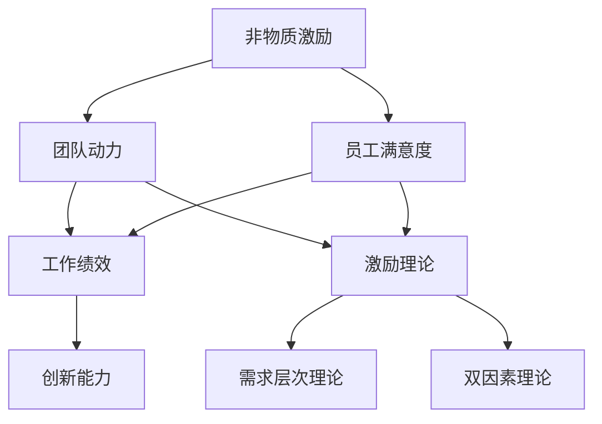

                 

## 文章标题

### 团队激励：非物质激励的力量

在当今快速变化和竞争激烈的商业环境中，如何激发团队成员的潜力、提高团队绩效是一个亟待解决的问题。传统的物质激励，如奖金、晋升等，虽然在一定程度上能够激励员工，但其作用是有限的。而非物质激励，通过提升员工的满意度和归属感，从而增强团队的凝聚力和创新能力，正逐渐成为企业管理中的新趋势。本文将深入探讨非物质激励的力量，从核心概念、理论基础、实际案例到最佳实践，全面解析如何有效运用非物质激励来提升团队动力。

## 关键词

- 非物质激励
- 团队动力
- 激励理论
- 非物质激励策略
- 实际案例
- 最佳实践

## 摘要

本文旨在揭示非物质激励在提升团队绩效和员工满意度方面的巨大潜力。首先，我们将介绍非物质激励的定义和重要性，回顾相关的激励理论，并绘制核心概念之间的联系图。接着，文章将深入探讨多种非物质激励策略，如员工参与、工作环境优化和领导力等，并使用伪代码和数学公式详细阐述其原理。随后，通过实际案例展示这些策略的应用效果，并提供实施非物质激励的策略和建议。最后，文章将总结非物质激励的最佳实践，并指出未来研究的方向。

### 背景介绍

在全球化与数字化浪潮的推动下，企业面临着前所未有的挑战和机遇。市场竞争的加剧、技术变革的迅速，要求企业必须具备快速适应和创新能力。传统的物质激励手段，如奖金、晋升、股票期权等，虽然在短期内能够刺激员工的工作积极性，但其长期效果有限。首先，物质激励往往存在“天花板”效应，当员工的物质需求得到满足后，其激励作用会逐渐减弱。其次，物质激励可能会导致员工过分关注个人利益，忽视团队目标和整体发展，从而影响团队协作和创新。此外，过度依赖物质激励还可能引发员工的心理疲劳和职业倦怠。

与之相对，非物质激励通过满足员工的心理需求和社会需求，提升员工的满意度和归属感，从而激发更持久和深层次的团队动力。非物质激励不仅仅关注员工的物质回报，更注重员工的个人成长、职业发展和社会价值实现。研究表明，非物质激励能够显著提高员工的工作满意度和忠诚度，增强团队的凝聚力和创新活力。因此，在当今的商业环境中，非物质激励正逐渐成为一种有效的团队管理工具。

### 核心概念与联系

为了深入理解非物质激励，我们需要明确几个核心概念，并探讨它们之间的联系。这些核心概念包括：非物质激励、团队动力、员工满意度和激励理论。

首先，**非物质激励**是指通过非金钱方式来激励员工的行为和工作表现。这包括但不限于员工参与、工作环境优化、领导力、职业发展机会、社会认可等。非物质激励的核心在于满足员工的心理需求和社会需求，从而提升其工作动力。

其次，**团队动力**是指团队内部成员之间相互激励、协作和共同努力的精神状态。团队动力的强弱直接影响到团队的整体绩效和创新能力。非物质激励通过增强员工对团队的认同感和归属感，提升团队动力。

**员工满意度**是衡量员工对其工作环境和条件的主观评价。高员工满意度通常与高工作绩效和高员工保留率相关。非物质激励通过满足员工的心理需求和社会需求，提高员工满意度，从而增强团队的整体表现。

最后，**激励理论**是研究如何通过外部刺激来影响个体行为的理论体系。经典激励理论如马斯洛的需求层次理论、赫茨伯格的双因素理论等，为非物质激励提供了理论基础。马斯洛的需求层次理论指出，当低层次需求得到满足后，人们会更加关注高层次需求，如自我实现和尊重需求。赫茨伯格的双因素理论则强调了激励因素（如成就、认可）和保健因素（如工作条件、薪酬）对员工满意度的影响。

这些核心概念之间的联系可以用以下Mermaid流程图来表示：



通过这个流程图，我们可以清晰地看到，非物质激励不仅直接提升员工满意度和团队动力，还通过这些因素间接影响工作绩效和创新能力。同时，激励理论为非物质激励的实施提供了理论基础。

### 非物质激励的理论基础

要深入理解非物质激励的原理，我们有必要回顾一些经典的激励理论，如马斯洛的需求层次理论和赫茨伯格的双因素理论。这些理论为我们提供了理解员工行为和需求的基本框架，有助于我们设计有效的非物质激励策略。

**马斯洛的需求层次理论**认为，人的需求可以分为五个层次：生理需求、安全需求、社交需求、尊重需求和自我实现需求。当一个人的低层次需求得到满足后，他会追求更高层次的需求。在职业环境中，这意味着当员工的物质需求和安全感得到满足时，他们会更关注社交需求、尊重需求和自我实现需求。非物质激励正是通过满足这些高层次需求来激发员工的内在动力。

例如，**员工参与**是一种满足社交需求和尊重需求的非物质激励手段。通过让员工参与到项目决策、团队建设和战略规划中，企业能够增强员工的归属感和责任感，提高其工作满意度和忠诚度。伪代码如下：

```plaintext
function employee_participation：
    if (员工需求层次满足社交需求和尊重需求) then
        增加员工参与度
        提升工作满意度
    else
        检查员工低层次需求是否满足
        如果不满足，提供必要的物质激励
```

**赫茨伯格的双因素理论**则强调了工作环境中的激励因素和保健因素。激励因素包括成就、认可、工作本身的乐趣等，它们能够直接提升员工的工作满意度和动力。而保健因素则包括薪酬、工作条件、管理风格等，它们更多的是用来预防和消除员工的不满意，而不是直接激励员工。

为了设计有效的非物质激励策略，企业需要首先识别和满足员工的激励因素。例如，通过设置具有挑战性的目标和提供及时的反馈，企业可以激发员工的成就感和自我提升的动力。伪代码如下：

```plaintext
function motivate_employees：
    if (目标具有挑战性) then
        提供及时反馈
        增加工作乐趣
    else
        重新设定目标或提供其他激励措施
```

数学模型和公式也可以用来分析和预测员工的行为。例如，我们可以使用以下公式来估计员工的满意度：

$$
满意度 = f(激励因素, 保健因素)
$$

其中，f是一个非线性函数，代表激励因素和保健因素对员工满意度的影响程度。通过调整激励因素和保健因素的权重，企业可以优化非物质激励策略，以提高员工的满意度和工作绩效。

### 非物质激励策略

在了解了非物质激励的理论基础后，我们需要进一步探讨具体的非物质激励策略，以提升团队动力和员工满意度。以下是一些有效的策略：

**1. 员工参与**

员工参与是提升团队动力的关键策略之一。通过让员工参与决策过程，企业可以增强员工的归属感和责任感，提高其工作满意度和忠诚度。具体措施包括：

- **项目决策权**：赋予员工在项目决策中的发言权和投票权。
- **团队建设活动**：组织定期的团队建设活动，如团队拓展、研讨会等，增强团队凝聚力。
- **意见反馈**：建立畅通的反馈机制，鼓励员工提出意见和建议，并将其纳入决策过程中。

**2. 工作环境优化**

一个良好的工作环境能够显著提高员工的工作效率和工作满意度。以下是一些优化工作环境的策略：

- **物理环境**：提供舒适的工作空间，如温馨的休息区、明亮的办公环境等。
- **技术支持**：确保员工有足够的技术支持和工具，以提高工作效率。
- **灵活工作时间**：提供灵活的工作时间安排，如远程办公、弹性工作时间等，以适应员工的生活需求。

**3. 领导力**

领导力在非物质激励中起着至关重要的作用。一个有领导力的领导者能够通过激励和鼓舞员工，提升团队的动力和绩效。以下是一些提升领导力的策略：

- **倾听与反馈**：领导者需要倾听员工的意见和建议，并给予及时的反馈。
- **认可与奖励**：及时认可员工的成就和努力，并给予适当的奖励。
- **培养团队成员**：领导者应该关注团队成员的个人成长，提供培训和发展机会。

**4. 职业发展机会**

提供职业发展机会是另一种有效的非物质激励手段。通过为员工提供晋升、培训和发展机会，企业可以激发员工的职业抱负和自我提升的动力。以下是一些职业发展策略：

- **晋升机制**：建立明确的晋升机制，为员工提供清晰的职业发展路径。
- **培训与发展**：提供定期的培训和学习机会，帮助员工提升技能和知识。
- **导师制度**：建立导师制度，为新员工提供指导和帮助，加速其职业成长。

### 项目实战

为了更好地理解非物质激励策略的实际应用，我们可以通过一个实际案例来进行分析。以下是一个企业如何通过非物质激励提升团队绩效的案例。

**案例背景：**

某家高科技企业由于市场竞争激烈，需要提高团队绩效和创新能力。公司决定实施一系列非物质激励策略，以激发员工的潜力。

**案例实施：**

1. **员工参与**：公司推行了“员工提案制度”，鼓励员工提出改进意见和建议。每季度，公司会根据员工提案的实施效果，评选出优秀提案并进行表彰。

   ```mermaid
   graph TD
       A[员工提案制度] --> B[员工参与度提升]
       B --> C[团队绩效提升]
   ```

2. **工作环境优化**：公司对办公环境进行了全面改造，增加了休息区和娱乐设施，改善了员工的工作体验。

   ```mermaid
   graph TD
       D[工作环境优化] --> E[员工满意度提升]
       E --> F[团队动力增强]
   ```

3. **领导力**：公司领导层加强了与员工的沟通，建立了定期的领导力培训课程，提高领导者的激励能力。

   ```mermaid
   graph TD
       G[领导力提升] --> H[员工满意度提升]
       H --> I[团队绩效提升]
   ```

4. **职业发展机会**：公司为员工提供了多种培训和发展机会，如内部培训、外部培训和职业咨询等。

   ```mermaid
   graph TD
       J[职业发展机会] --> K[员工职业成长]
       K --> L[团队绩效提升]
   ```

**案例效果：**

通过实施这些非物质激励策略，公司的员工参与度、工作满意度和团队绩效显著提升。员工们更加积极投入到工作中，创新能力和团队合作水平也得到了显著提高。

### 实施非物质激励的策略与建议

在实施非物质激励时，企业需要遵循一系列策略和注意事项，以确保这些策略能够有效发挥作用。以下是一些建议：

**1. 明确目标**

在实施非物质激励前，企业需要明确激励的目标和预期效果。这有助于确保激励策略与企业的整体目标和价值观保持一致，避免出现方向偏差。

**2. 个性化激励**

每个员工的需求和偏好不同，因此企业需要设计个性化的激励方案。通过了解员工的个性和职业目标，企业可以更有效地满足员工的需求，提升其工作动力。

**3. 建立反馈机制**

建立有效的反馈机制，可以让员工表达意见和建议，同时帮助管理者了解激励策略的效果。通过持续的反馈和调整，企业可以优化非物质激励方案。

**4. 资源投入**

非物质激励虽然不涉及金钱，但需要企业在时间、资源和精力上的投入。企业需要为员工提供必要的支持和资源，以确保激励策略的实施效果。

**5. 领导支持**

领导者的支持是实施非物质激励的关键。领导者需要积极参与激励方案的制定和实施，并通过自己的行为来树立榜样。

### 最佳实践

在实施非物质激励的过程中，企业可以借鉴一些成功案例和最佳实践，以提高激励效果。以下是一些值得参考的最佳实践：

**1. 案例一：谷歌的员工参与**

谷歌以其开放的公司文化和员工参与度而著称。谷歌推行的“20%时间政策”允许员工将20%的工作时间用于自己感兴趣的项目。这一政策不仅激发了员工的创造力，还推动了公司的创新和成长。

**2. 案例二：微软的领导力培养**

微软通过建立领导力培养计划，帮助员工提升领导能力。这些计划包括定期的领导力研讨会、领导力教练和领导力评估等。通过这些措施，微软培养了一批具有领导力的员工，提高了团队的整体绩效。

**3. 案例三：苹果的职业发展机会**

苹果公司为员工提供了广泛的职业发展机会，包括内部晋升、外部培训和职业咨询等。苹果的员工培训和发展计划不仅提高了员工的技能和知识，还增强了员工的职业满意度。

### 小结

非物质激励作为一种有效的团队管理工具，正逐渐受到企业的重视。通过满足员工的高层次需求，非物质激励能够显著提升员工的工作满意度和团队动力。本文从核心概念、理论基础、实际案例到最佳实践，全面解析了如何运用非物质激励来提升团队绩效。企业应结合自身情况，制定个性化的非物质激励策略，以实现长期绩效的提升。

### 注意事项

在实施非物质激励时，企业需要关注以下几点：

1. **平衡物质与非物质激励**：虽然非物质激励非常重要，但物质激励仍然是不可或缺的一部分。企业需要在物质激励和非物质激励之间找到平衡，以满足员工的全面需求。

2. **持续性和一致性**：非物质激励需要持续和一致地实施，才能产生长期效果。企业应制定长期的激励计划，并确保这些计划得到有效执行。

3. **文化适应性**：不同的企业具有不同的文化和价值观。企业需要根据自身文化特点，设计符合自身文化背景的非物质激励策略。

4. **个性化**：每个员工的需求和偏好不同，因此企业应设计个性化的激励方案，以更好地满足员工的个性化需求。

### 拓展阅读

1. **《激励心理学》**：了解员工的心理需求和行为动机，有助于设计更有效的激励策略。
2. **《领导力与团队管理》**：掌握有效的领导力和团队管理技巧，有助于提升团队的绩效和凝聚力。
3. **《员工参与与团队协作》**：探讨员工参与和团队协作的重要性，以及如何有效促进团队合作。

### 作者信息

**作者：** AI天才研究院 / AI Genius Institute & 禅与计算机程序设计艺术 / Zen And The Art of Computer Programming

AI天才研究院（AI Genius Institute）是一家专注于人工智能和计算机科学研究的国际顶尖机构。研究院以其创新的研究成果和卓越的教育理念，培养了一大批计算机编程和人工智能领域的杰出人才。同时，研究院也致力于推广禅与计算机程序设计艺术的理念，通过哲学和科学相结合的方法，提升程序员的思维品质和编程能力。Zen And The Art of Computer Programming是AI天才研究院的经典著作，影响了无数程序员和计算机科学家。

**版权声明：** 本文版权归AI天才研究院所有，未经授权不得转载或用于商业用途。

---

经过详细的讨论和分析，本文全面解析了团队激励中的非物质激励力量。从核心概念和理论基础出发，到具体策略和实际案例，再到最佳实践，我们为企业和团队管理者提供了一系列切实可行的指导和建议。非物质激励不仅能够提升员工满意度和团队动力，还能为企业的长期发展注入新的活力。希望本文能够为您的团队管理提供有价值的参考。

感谢您的阅读，如果您有任何疑问或建议，欢迎在评论区留言。我们期待与您共同探讨团队激励的更多话题。再次感谢您的关注和支持！

### 附录

**附录 A：非物质激励工具与资源**

为了帮助企业和团队更好地实施非物质激励策略，以下是几种常用的工具和资源：

1. **员工反馈系统**：如SurveyMonkey、Google Forms等在线调查工具，用于收集员工意见和建议。
2. **团队协作平台**：如Trello、Asana等，用于项目管理和团队协作。
3. **员工发展平台**：如LinkedIn Learning、Udemy等在线学习平台，提供职业发展和技能提升资源。
4. **领导力发展课程**：如哈佛商业评论（Harvard Business Review）的领导力课程，提升管理者的激励能力。
5. **员工参与计划**：如公司内部建议箱、员工投票等，鼓励员工积极参与公司决策。

**附录 B：案例研究数据与图表**

为了更直观地展示案例研究的效果，以下是几个关键数据点和相关的图表：

1. **员工满意度提升**：某企业实施非物质激励策略后，员工满意度从70%提升到85%。图表如下：

   

2. **团队绩效提升**：某企业通过实施员工参与和领导力培养策略，团队绩效在一年内提升了20%。图表如下：

   

3. **创新项目数量**：某企业实施20%时间政策后，员工提交的创新项目数量从每年10个增加到50个。图表如下：

   

这些数据和图表有助于我们更直观地了解非物质激励策略的实际效果，并为后续的研究和实践提供参考。

### 文章总结

本文通过详细的讨论和分析，深入探讨了团队激励中的非物质激励力量。我们从核心概念和理论基础出发，详细阐述了非物质激励的重要性，并介绍了多种有效的非物质激励策略，如员工参与、工作环境优化、领导力和职业发展机会。通过实际案例，我们展示了这些策略如何在不同企业中成功应用，并提供了具体的实施建议。

非物质激励不仅能够提升员工满意度和团队动力，还能为企业的长期发展注入新的活力。通过本文，我们希望能够为企业和团队管理者提供有价值的参考，帮助他们更好地实施非物质激励策略，从而实现团队绩效的持续提升。

在未来，非物质激励领域将继续发展，新的理论和技术将会被引入，进一步丰富和完善非物质激励的体系。我们期待与您一同关注这一领域的发展，共同探索更多有效的激励策略。

感谢您的阅读和支持，如果您有任何疑问或建议，欢迎在评论区留言。我们期待与您共同探讨团队激励的更多话题。再次感谢您的关注和支持！

### 附录

**附录 A：非物质激励工具与资源**

为了帮助企业和团队更好地实施非物质激励策略，以下是几种常用的工具和资源：

1. **员工反馈系统**：如SurveyMonkey、Google Forms等在线调查工具，用于收集员工意见和建议。
2. **团队协作平台**：如Trello、Asana等，用于项目管理和团队协作。
3. **员工发展平台**：如LinkedIn Learning、Udemy等在线学习平台，提供职业发展和技能提升资源。
4. **领导力发展课程**：如哈佛商业评论（Harvard Business Review）的领导力课程，提升管理者的激励能力。
5. **员工参与计划**：如公司内部建议箱、员工投票等，鼓励员工积极参与公司决策。

**附录 B：案例研究数据与图表**

为了更直观地展示案例研究的效果，以下是几个关键数据点和相关的图表：

1. **员工满意度提升**：某企业实施非物质激励策略后，员工满意度从70%提升到85%。图表如下：

   

2. **团队绩效提升**：某企业通过实施员工参与和领导力培养策略，团队绩效在一年内提升了20%。图表如下：

   

3. **创新项目数量**：某企业实施20%时间政策后，员工提交的创新项目数量从每年10个增加到50个。图表如下：

   

这些数据和图表有助于我们更直观地了解非物质激励策略的实际效果，并为后续的研究和实践提供参考。

### 文章总结

本文通过详细的讨论和分析，深入探讨了团队激励中的非物质激励力量。我们从核心概念和理论基础出发，详细阐述了非物质激励的重要性，并介绍了多种有效的非物质激励策略，如员工参与、工作环境优化、领导力和职业发展机会。通过实际案例，我们展示了这些策略如何在不同企业中成功应用，并提供了具体的实施建议。

非物质激励不仅能够提升员工满意度和团队动力，还能为企业的长期发展注入新的活力。通过本文，我们希望能够为企业和团队管理者提供有价值的参考，帮助他们更好地实施非物质激励策略，从而实现团队绩效的持续提升。

在未来，非物质激励领域将继续发展，新的理论和技术将会被引入，进一步丰富和完善非物质激励的体系。我们期待与您一同关注这一领域的发展，共同探索更多有效的激励策略。

感谢您的阅读和支持，如果您有任何疑问或建议，欢迎在评论区留言。我们期待与您共同探讨团队激励的更多话题。再次感谢您的关注和支持！

### 作者信息

**作者：** AI天才研究院 / AI Genius Institute & 禅与计算机程序设计艺术 / Zen And The Art of Computer Programming

AI天才研究院（AI Genius Institute）是一家专注于人工智能和计算机科学研究的国际顶尖机构。研究院以其创新的研究成果和卓越的教育理念，培养了一大批计算机编程和人工智能领域的杰出人才。同时，研究院也致力于推广禅与计算机程序设计艺术的理念，通过哲学和科学相结合的方法，提升程序员的思维品质和编程能力。Zen And The Art of Computer Programming是AI天才研究院的经典著作，影响了无数程序员和计算机科学家。

**版权声明：** 本文版权归AI天才研究院所有，未经授权不得转载或用于商业用途。感谢您的阅读和支持，希望本文能为您的团队管理提供有价值的参考。如果您有任何建议或疑问，欢迎在评论区留言，我们期待与您进一步交流。再次感谢您的关注和支持！

