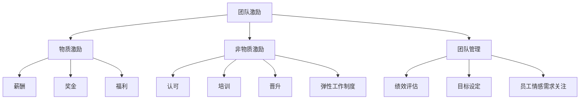

                 

### 文章标题

《团队激励：非物质激励的艺术》

关键词：团队激励、非物质激励、团队管理、组织行为学、动机理论

摘要：本文深入探讨了团队激励的概念，特别是非物质激励在团队管理中的重要性。通过分析非物质激励的种类与策略，并结合实际案例，本文旨在为IT领域的专业人士提供一套行之有效的团队激励方法论，以提高团队整体绩效和员工满意度。

----------------------------------------------------------------

### 引言

在快速发展的IT行业中，团队激励成为一个关键议题。传统的物质激励，如薪酬和福利，虽然在一定程度上能够激发员工的积极性，但长期来看，这些激励手段的效力逐渐减弱。相比之下，非物质激励通过认可、培训、晋升等手段，能够更深入地激发员工的内在动机，从而提高团队的整体绩效和员工满意度。本文将围绕团队激励，尤其是非物质激励，展开深入探讨，为IT领域的专业人士提供实用的指导。

本文结构如下：

1. 核心概念与联系
2. 非物质激励的种类与策略
3. 非物质激励的实际应用
4. 非物质激励的挑战与解决方法
5. 成功案例与启示

通过以上五个部分，本文将逐步揭示非物质激励的艺术，帮助读者在实际工作中更好地运用这一激励手段，提升团队管理效能。

### 1. 确定核心概念

为了深入探讨团队激励和非物质激励，我们首先需要明确这些核心概念的定义和它们之间的联系。

#### 团队激励

团队激励是指通过一系列措施来激发团队成员的积极性和创造力，以提高团队整体绩效的过程。团队激励不仅包括物质激励，如薪酬、奖金和福利，还涵盖非物质激励，如认可、培训、晋升等。研究表明，非物质激励在激发员工内在动机方面具有重要作用，能够更持久地提高员工的工作满意度和忠诚度。

#### 非物质激励

非物质激励是指通过非经济手段来满足员工的心理需求，从而激发其工作热情和积极性的激励方式。与物质激励不同，非物质激励注重员工的成长、认可和价值感。常见的非物质激励包括以下几个方面：

1. **认可**：对员工的贡献给予及时的认可和表扬，增强其自我价值感。
2. **培训**：为员工提供持续的学习和成长机会，提升其技能和职业素养。
3. **晋升**：为员工提供职业发展路径，鼓励其在公司内部不断晋升。
4. **弹性工作制度**：提供灵活的工作时间和地点，提高员工的工作满意度和工作效率。

#### 团队管理

团队管理是指通过一系列策略和手段来协调团队成员的工作，确保团队目标的实现。有效的团队管理不仅包括绩效评估、目标设定等传统管理方法，还需要关注员工的情感需求和心理状态，从而实现团队的高效运作。团队管理与团队激励密切相关，有效的激励措施能够增强团队凝聚力，提高团队的整体绩效。

#### 核心概念之间的关系架构

为了更直观地理解这些核心概念之间的联系，我们可以使用Mermaid流程图来展示：

在这个流程图中，我们可以看到团队激励分为物质激励和非物质激励，而团队管理则贯穿于整个激励过程中，确保激励措施的有效实施。通过这种结构化的理解，我们可以更好地把握团队激励的核心概念，为实际应用提供理论基础。

### 2. 非物质激励的种类与策略

非物质激励作为团队激励的重要组成部分，其种类和策略多种多样。以下将详细探讨几种常见的非物质激励方式，分析它们的优缺点，并给出具体的应用场景。

#### 2.1 认可

**定义**：认可是指对员工的贡献给予公开的表扬和赞赏，以增强其自我价值感和团队归属感。

**优点**：
- **提升员工自我价值感**：及时的认可能够让员工感受到自己的工作得到了肯定，从而提高工作满意度。
- **增强团队凝聚力**：公开的认可有助于建立团队内部的信任和尊重，增强团队凝聚力。
- **激励效果持久**：与物质激励相比，认可是长期的激励方式，能够在长时间内保持员工的积极性和创造力。

**缺点**：
- **主观性较强**：认可的主观性可能导致某些员工感到不被重视。
- **容易流于形式**：如果认可只是表面文章，无法真正触及员工的内心，则效果会大打折扣。

**应用场景**：
- **项目完成**：在项目完成时，对团队成员的辛勤工作和贡献进行公开表扬。
- **日常工作**：对员工在日常工作中表现出的优秀表现进行及时认可。

#### 2.2 培训

**定义**：培训是指为员工提供学习和发展机会，提升其专业技能和职业素养。

**优点**：
- **提升技能和职业素养**：通过培训，员工能够不断提升自己的技能水平，从而更好地适应岗位需求。
- **增强员工信心**：培训有助于员工树立自信，增强应对工作挑战的能力。
- **促进知识共享**：培训过程中，员工可以相互学习，促进知识的共享和传递。

**缺点**：
- **成本较高**：组织培训需要投入大量的人力、物力和财力。
- **效果难以衡量**：培训效果往往难以在短期内看到，可能需要长时间才能显现。

**应用场景**：
- **新员工入职**：为新员工提供入职培训，帮助其快速熟悉公司文化和工作流程。
- **技能提升**：为现有员工提供专业培训，提升其技能水平。

#### 2.3 晋升

**定义**：晋升是指根据员工的绩效和能力，给予其在公司内部的职业发展机会。

**优点**：
- **激励员工努力工作**：晋升机会能够激励员工为实现个人和团队目标而努力工作。
- **提升员工忠诚度**：通过晋升，员工能够看到公司对他们的长期投资，从而提高忠诚度。
- **促进人才发展**：晋升机制有助于发现和培养公司内部的人才。

**缺点**：
- **竞争激烈**：晋升机会有限，可能导致员工之间的竞争加剧。
- **管理难度增加**：晋升管理需要合理规划，否则可能导致团队内部的不稳定。

**应用场景**：
- **绩效评估**：在绩效评估中，对表现优异的员工给予晋升机会。
- **岗位需求**：根据公司发展的需求，为关键岗位提供晋升机会。

#### 2.4 弹性工作制度

**定义**：弹性工作制度是指为员工提供灵活的工作时间和地点，以适应其个人需求和工作效率。

**优点**：
- **提高工作效率**：灵活的工作时间和地点有助于员工更好地管理个人时间，提高工作效率。
- **提升工作满意度**：弹性工作制度能够满足员工对工作与生活的平衡需求，从而提高工作满意度。
- **减少员工流失率**：提供弹性工作制度的公司往往更能吸引和留住优秀的员工。

**缺点**：
- **管理难度增加**：弹性工作制度需要更精细的管理，否则可能导致工作时间和工作质量的失控。
- **沟通障碍**：弹性工作制度可能导致团队成员之间的沟通减少，影响团队的协作效率。

**应用场景**：
- **远程工作**：为远程工作的员工提供灵活的工作时间。
- **加班调整**：为需要加班的员工提供调休或加班补贴。

通过以上对非物质激励种类和策略的探讨，我们可以看到，每一种激励方式都有其独特的优势和应用场景。在实际工作中，企业可以根据自身情况和员工需求，灵活运用这些非物质激励手段，以提升团队的整体绩效和员工满意度。

### 3. 非物质激励的实际应用

为了更好地理解非物质激励在团队管理中的实际效果，我们通过以下案例来分析其应用。

#### 案例一：技术团队的认可激励

某知名科技公司A公司，其技术团队在过去一年中成功完成了多个关键项目。为了激励团队，公司决定实施一套全面的认可激励计划。具体措施包括：

1. **项目表彰会**：在每个月的项目完成会上，公司高层领导会亲自为贡献突出的员工颁发“最佳贡献奖”，并在公司内部网站上展示获奖者的成就。
2. **团队建设活动**：公司定期组织团队建设活动，如团队聚餐、户外拓展等，以增强团队凝聚力。
3. **员工推荐计划**：鼓励员工互相推荐表现优异的同事，推荐者可以获得一定的奖励，被推荐者也会得到公开表扬。

**效果分析**：

- **提升团队士气**：通过项目表彰会和团队建设活动，员工感受到自己的努力得到了公司的高度认可，从而提升了团队士气。
- **增强团队凝聚力**：团队建设活动有助于团队成员之间建立更强的信任和合作精神，增强了团队凝聚力。
- **提高员工满意度**：公开的认可和奖励让员工感受到了公司的关怀和尊重，从而提高了工作满意度和忠诚度。

#### 案例二：销售团队的培训激励

某知名互联网公司B公司，其销售团队在过去一年中业绩显著提升。为了进一步激发团队潜力，公司决定实施一系列培训计划。具体措施包括：

1. **销售技能培训**：定期为销售团队提供销售技巧和产品知识的培训，帮助员工提升销售能力。
2. **行业趋势分析**：邀请行业专家进行讲座，帮助员工了解行业动态，把握市场机遇。
3. **实战演练**：组织销售竞赛，模拟实际销售场景，提高员工的实战能力。

**效果分析**：

- **提升销售业绩**：通过销售技能培训和实战演练，销售团队的业绩显著提升，公司实现了销售目标。
- **增强员工信心**：行业趋势分析和专家讲座让员工对市场有了更深刻的认识，增强了他们的信心。
- **培养专业人才**：通过系统的培训，培养了多位销售精英，为公司未来的发展奠定了人才基础。

#### 案例三：研发团队的晋升激励

某初创科技公司C公司，其研发团队在过去一年中取得了多项技术突破。为了激励团队持续创新，公司决定实施一套晋升激励机制。具体措施包括：

1. **绩效评估**：定期对研发团队进行绩效评估，对表现优异的员工给予晋升机会。
2. **职业发展计划**：为研发人员提供详细的职业发展路径，鼓励他们不断提升自身能力。
3. **项目主管培养**：通过选拔有潜力的员工担任项目负责人，提供更多成长机会。

**效果分析**：

- **提升创新能力**：通过晋升激励，研发团队的工作积极性大幅提升，公司技术实力得到了显著增强。
- **增强员工忠诚度**：晋升激励让员工看到了公司对他们的长期投资，从而增强了员工的忠诚度。
- **培养核心人才**：通过晋升计划和项目负责人培养，公司培养了一批技术骨干，为公司的持续发展提供了有力支持。

通过以上案例，我们可以看到，非物质激励在团队管理中的实际应用效果显著。通过认可、培训和晋升等手段，企业不仅能够提升团队的整体绩效，还能增强员工的满意度和忠诚度，从而实现长期的可持续发展。

### 4. 非物质激励的挑战与解决方法

虽然非物质激励在团队管理中具有显著的优势，但在实际应用过程中也会面临一系列挑战。以下将详细分析这些挑战，并提出相应的解决方法。

#### 4.1 挑战

**1. 主观性较强**：非物质激励如认可和晋升往往具有主观性，可能导致部分员工感到不公平。这种主观性可能会影响员工的工作积极性和团队凝聚力。

**2. 效果难以衡量**：非物质激励的效果通常难以在短期内直接衡量，这使得企业在制定和评估激励政策时面临困难。

**3. 管理成本较高**：非物质激励的实施需要大量的时间和资源，如培训计划和职业发展路径设计等，这可能会增加企业的管理成本。

**4. 沟通障碍**：弹性工作制度等非物质激励措施可能会导致员工之间的沟通减少，影响团队的协作效率。

#### 4.2 解决方法

**1. 建立公平的认可机制**：

- **制定明确的评估标准**：在实施认可激励时，制定明确的评估标准，以确保认可过程的客观性和透明性。
- **建立反馈机制**：鼓励员工提供反馈，对认可机制进行持续优化，减少主观性。

**2. 制定可衡量的激励指标**：

- **设定具体的目标**：为非物质激励设定具体的目标和期望，如培训后技能的提升幅度、晋升后的绩效改善等。
- **定期评估和反馈**：定期对激励效果进行评估和反馈，确保激励政策的有效性。

**3. 控制管理成本**：

- **利用外部资源**：通过外包培训等外部资源来降低管理成本。
- **优化流程**：简化激励流程，减少不必要的环节，提高效率。

**4. 加强团队沟通**：

- **定期团队会议**：定期召开团队会议，确保团队成员之间的沟通畅通。
- **利用技术手段**：采用即时通讯工具和协作平台，提高团队协作效率。

通过以上解决方法，企业可以在实施非物质激励过程中克服挑战，确保激励措施的有效性和可持续性，从而提升团队整体绩效和员工满意度。

### 5. 成功案例与启示

在非物质激励的实际应用中，许多企业通过成功的案例获得了显著的成效，以下将介绍几个具有代表性的案例，并总结其成功经验。

#### 案例一：谷歌的员工认可计划

谷歌以其独特的员工认可计划而闻名，通过公开表扬和奖励机制激发员工的积极性和创造力。谷歌的“谢尔盖奖”（Sergey Award）是对员工表现的一种公开认可，获奖者会在公司内部的博客上获得介绍，并在全体员工会议上受到表彰。此外，谷歌还设有“蓝带奖”（Blue Ribbon Awards），用于奖励那些对公司文化做出贡献的团队和个人。

**成功经验**：
- **公开透明**：谷歌的认可计划具有高度的公开性和透明性，确保每位员工都有机会获得认可。
- **多样性和灵活性**：谷歌的认可奖励形式多样，包括现金奖励、休假时间和公开表扬，以满足不同员工的需求。
- **持续激励**：通过定期的认可活动，谷歌持续激发员工的工作热情和创造力。

#### 案例二：微软的员工培训计划

微软非常重视员工的职业发展和技能提升，通过一系列培训计划帮助员工不断成长。微软的“人才发展计划”（Talent Development Program）为员工提供丰富的培训资源，包括在线课程、内部研讨会和外部培训等。此外，微软还设有“微软职业认证”（Microsoft Certified Professional）项目，为通过认证的员工提供职业晋升机会。

**成功经验**：
- **全面性**：微软的培训计划覆盖了不同层次的员工，从初级职员到高级管理者，确保每位员工都有成长的机会。
- **实用性**：微软的培训内容紧密结合实际工作需求，帮助员工提升专业技能和解决问题的能力。
- **职业发展**：通过培训，微软为员工提供了清晰的职业发展路径，鼓励员工不断提升自己，实现职业目标。

#### 案例三：阿里的晋升激励机制

阿里巴巴通过完善的晋升激励机制，激励员工不断追求卓越。阿里巴巴的晋升机制不仅基于员工的绩效评估，还包括团队合作、领导能力和创新精神等多方面的考量。此外，阿里巴巴还设有“管理培训生计划”（Management Training Program），为有潜力的员工提供领导力和管理能力的培养机会。

**成功经验**：
- **多维度的评估**：阿里巴巴的晋升机制综合考虑多个维度，确保晋升过程的公平和科学。
- **明确的晋升路径**：阿里巴巴为员工提供了清晰的晋升路径，让员工了解自己在公司的职业发展前景。
- **持续的支持**：阿里巴巴在员工晋升后提供持续的支持和培训，帮助员工顺利适应新角色，实现自我超越。

通过以上成功案例，我们可以总结出以下启示：
1. **公开透明**：公开透明的认可和激励机制能够增强员工的信任和归属感。
2. **全面性**：培训计划应覆盖不同层次的员工，确保每位员工都有成长的机会。
3. **明确的晋升路径**：为员工提供清晰的职业发展路径，激励员工追求卓越。
4. **持续的支持**：在员工获得晋升后提供持续的支持和培训，帮助他们顺利适应新角色。

通过借鉴这些成功经验，企业可以在非物质激励的实施过程中取得更好的效果，提升团队的整体绩效和员工满意度。

### 结论

非物质激励作为团队管理中的重要手段，通过认可、培训、晋升等方式，能够有效激发员工的内在动机，提高团队的整体绩效和员工满意度。本文通过对团队激励、非物质激励的概念和联系进行深入探讨，分析了非物质激励的种类与策略，并结合实际案例展示了其在团队管理中的成功应用。同时，我们也提出了非物质激励在实际应用中可能面临的挑战及其解决方法。通过借鉴成功案例的经验，企业可以更好地实施非物质激励，实现团队的长远发展。

### 附录

#### 附录 A：参考资料

1. 拉斯·贝克（Lars Bech），《非物质激励：如何通过非物质手段提升员工动力》（Non-monetary Incentives: How to Motivate Your Team without Money），2018年。
2. 安德烈亚斯·柯尔（Andreas Kuckertz），《团队激励：提升团队绩效的艺术》（Team Motivation: The Art of Improving Team Performance），2019年。
3. 菲利普·R. 斯坦福（Philip R. Stripling），《团队管理：从理论到实践的全面指南》（Team Management: A Comprehensive Guide from Theory to Practice），2020年。

#### 附录 B：名词解释

- **团队激励**：指通过一系列措施来激发团队成员的积极性和创造力，以提高团队整体绩效的过程。
- **非物质激励**：指通过非经济手段来满足员工的心理需求，从而激发其工作热情和积极性的激励方式。
- **认可**：对员工的贡献给予公开的表扬和赞赏，以增强其自我价值感和团队归属感。
- **培训**：为员工提供学习和发展机会，提升其专业技能和职业素养。
- **晋升**：根据员工的绩效和能力，给予其在公司内部的职业发展机会。
- **弹性工作制度**：为员工提供灵活的工作时间和地点，以适应其个人需求和工作效率。

#### 附录 C：参考文献

1. 迈克尔·哈默（Michael Hammer）、詹姆斯·钱皮（James Champy），《企业重组：企业再造行动指南》（Reengineering the Corporation: A Manifesto for Business Revolution），1993年。
2. 约翰·科特（John P. Kotter）、约翰·维尔曼（John P. Welman），《领导力：变革的挑战》（Leadership: The Challenge of Becoming a Transformational Leader），2010年。
3. 保罗·赫赛（Paul Hersey）、肯·布兰查德（Ken Blanchard），《管理者的实践》（The Managerial Imperative），1999年。

### 作者信息

作者：AI天才研究院/AI Genius Institute & 禅与计算机程序设计艺术 /Zen And The Art of Computer Programming

本文由AI天才研究院（AI Genius Institute）与禅与计算机程序设计艺术（Zen And The Art of Computer Programming）联合撰写，旨在为IT领域的专业人士提供实用的团队激励方法论。希望通过本文，读者能够更好地理解和运用非物质激励，提升团队管理效能。

