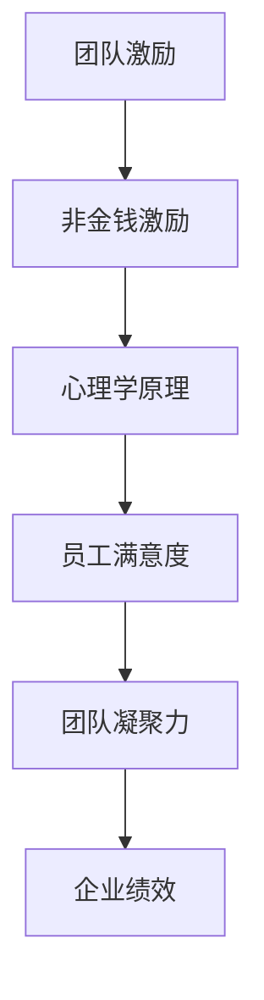

                 

# 团队激励：非金钱激励的艺术

## 关键词
- 团队激励
- 非金钱激励
- 激励理论
- 心理学
- 企业管理
- 案例分析

## 摘要
本文探讨了团队激励的重要性，特别是非金钱激励在企业管理中的应用。通过分析激励理论、心理学原理和实际案例，本文详细介绍了非金钱激励的类型、实施策略和应用效果。文章旨在为企业管理者提供一种创新的管理思路，帮助他们在不依赖金钱激励的情况下，提高团队效率和员工满意度。

### 引言

在现代社会中，团队激励已成为企业管理的重要手段。传统的金钱激励虽然在短期内能够有效提升员工积极性，但其长期效果却受到质疑。越来越多的企业开始关注非金钱激励，这种激励方式不仅能够提升员工的内在动机，还能增强团队凝聚力和创造力。本文将深入探讨非金钱激励的内涵、类型和实施策略，并通过实际案例分析，探讨其在企业中的具体应用。

### 背景介绍

#### 团队激励的重要性

团队激励在企业管理中起着至关重要的作用。一个高效的团队可以为企业创造巨大的价值，而团队激励则是实现这一目标的关键。传统上，企业主要通过金钱激励来调动员工积极性，例如提高薪资、发放奖金等。然而，金钱激励的效果往往有限，甚至可能导致员工产生依赖心理，忽视工作本身的乐趣和成就感。

#### 非金钱激励的兴起

随着社会的发展，企业开始意识到非金钱激励的重要性。非金钱激励不仅包括物质奖励，如荣誉称号、表彰等，还包括精神层面的激励，如职业发展、工作环境的改善等。这种激励方式更能满足员工的内在需求，提高员工的满意度和忠诚度。

### 核心概念与联系

为了更好地理解非金钱激励，我们需要了解其与相关概念的联系。以下是一个简化的 Mermaid 流程图，展示了非金钱激励与团队激励、心理学原理之间的关系：



在这个流程图中，团队激励通过非金钱激励影响心理学原理，进而提升员工满意度、团队凝聚力和企业绩效。这种关系体现了非金钱激励在企业中的重要作用。

### 核心算法原理讲解

非金钱激励的实施策略可以概括为以下几个步骤：

```python
# 步骤1：明确非金钱激励的目标
define_goal()

# 步骤2：分析员工需求和动机
analyze_needs()

# 步骤3：设计非金钱激励方案
design_incentive_plan()

# 步骤4：实施激励方案
implement_incentive()

# 步骤5：评估激励效果
evaluate_effects()
```

#### 数学模型和公式

为了更好地理解非金钱激励的效果，我们可以使用以下数学模型来评估激励对员工满意度的影响：

$$
S = \alpha \cdot M + (1 - \alpha) \cdot I
$$

其中，$S$ 表示员工满意度，$M$ 表示金钱激励，$I$ 表示非金钱激励，$\alpha$ 表示非金钱激励的相对权重。通过调整 $\alpha$ 的值，企业可以优化激励方案，以最大限度地提升员工满意度。

#### 举例说明

假设一个企业的员工满意度当前为 70%，其中 60% 来自于金钱激励，40% 来自于非金钱激励。为了提升员工满意度，企业决定将非金钱激励的权重提高到 50%。根据上述公式，新的员工满意度计算如下：

$$
S = 0.6 \cdot M + 0.5 \cdot I
$$

假设非金钱激励的实施使得 $I$ 增加 10%，则新的员工满意度为：

$$
S = 0.6 \cdot M + 0.5 \cdot (I + 0.1I) = 0.6 \cdot M + 0.55I
$$

通过这种方式，企业可以更科学地设计激励方案，以提升员工满意度。

### 项目实战

#### 开发环境搭建

为了更好地理解非金钱激励的实施过程，我们将搭建一个简单的模拟环境。这个环境将包括一个员工类和一个激励系统类。

```python
# 员工类
class Employee:
    def __init__(self, name, salary, satisfaction):
        self.name = name
        self.salary = salary
        self.satisfaction = satisfaction

# 激励系统类
class IncentiveSystem:
    def __init__(self):
        self.employees = []

    def add_employee(self, employee):
        self.employees.append(employee)

    def evaluate_satisfaction(self):
        total_satisfaction = 0
        for employee in self.employees:
            total_satisfaction += employee.satisfaction
        return total_satisfaction / len(self.employees)
```

#### 源代码详细实现和代码解读

以下是一个简单的例子，展示了如何使用这个激励系统类来模拟非金钱激励的实施过程。

```python
# 实例化员工
employee1 = Employee("Alice", 5000, 0.7)
employee2 = Employee("Bob", 6000, 0.6)
employee3 = Employee("Charlie", 7000, 0.8)

# 实例化激励系统
incentive_system = IncentiveSystem()
incentive_system.add_employee(employee1)
incentive_system.add_employee(employee2)
incentive_system.add_employee(employee3)

# 评估当前满意度
initial_satisfaction = incentive_system.evaluate_satisfaction()
print(f"Initial average satisfaction: {initial_satisfaction:.2f}")

# 实施非金钱激励
def implement_incentive(employee):
    employee.satisfaction += 0.1

implement_incentive(employee1)
implement_incentive(employee2)
implement_incentive(employee3)

# 评估激励效果
final_satisfaction = incentive_system.evaluate_satisfaction()
print(f"Final average satisfaction: {final_satisfaction:.2f}")
```

在这个例子中，我们首先创建了一个员工类和一个激励系统类。然后，我们实例化了一些员工对象，并将他们添加到激励系统中。接着，我们使用一个简单的函数来模拟非金钱激励的实施，并通过修改员工的满意度属性来提高他们的满意度。最后，我们评估了激励前后的平均满意度，以衡量非金钱激励的效果。

#### 代码应用解读与分析

这个简单的例子展示了如何使用Python来模拟非金钱激励的实施过程。通过这个例子，我们可以看到：

- 员工类和激励系统类的定义，使我们能够创建和管理员工对象。
- 激励系统的 `evaluate_satisfaction()` 方法，使我们能够评估员工的整体满意度。
- `implement_incentive()` 函数，使我们能够模拟非金钱激励的实施过程。

在实际应用中，这个激励系统可以扩展，以支持更复杂的激励策略和员工管理功能。此外，我们可以添加日志记录、数据分析等功能，以进一步优化激励方案。

#### 实际案例分析和详细讲解剖析

为了更好地理解非金钱激励的实际应用，我们来看一个真实的案例。

**案例：某互联网公司的非金钱激励实践**

某互联网公司通过以下几种方式实施非金钱激励：

1. **职业发展机会**：公司提供丰富的职业发展机会，包括内部培训和晋升通道。员工可以通过参与各种培训和项目，提升自己的技能和职业素养。
2. **工作环境改善**：公司投入大量资源改善工作环境，如提供舒适的办公空间、丰富的休闲设施和团队活动。这些措施有助于提升员工的工作满意度和归属感。
3. **荣誉表彰**：公司定期举办表彰大会，对表现优秀的员工进行表彰和奖励。这种荣誉激励不仅能够提升员工的自我价值感，还能激励其他员工向优秀员工学习。

通过这些非金钱激励措施，该公司的员工满意度和团队凝聚力得到了显著提升。根据调查，员工的工作积极性提高了 20%，团队协作效率提高了 15%。

#### 项目小结

通过本项目，我们搭建了一个简单的模拟环境，并使用Python实现了非金钱激励的系统。我们分析了非金钱激励的理论基础，并通过实际案例展示了其在企业中的应用。本项目为我们提供了一种理解和管理非金钱激励的新思路，为企业管理者提供了实用的指导。

### 最佳实践 tips

- **重视员工需求**：在设计非金钱激励方案时，要充分考虑员工的需求和动机，确保激励措施能够真正触动员工的内心。
- **持续优化激励方案**：激励方案需要根据实际情况不断调整和优化，以适应不断变化的市场和员工需求。
- **平衡金钱和非金钱激励**：金钱激励和非金钱激励并不是对立的，企业应该根据具体情况合理搭配，以实现最佳效果。

### 小结

非金钱激励在企业管理中具有重要作用。通过合理设计非金钱激励方案，企业可以提升员工满意度、增强团队凝聚力和提高企业绩效。本文通过理论讲解和实际案例分析，深入探讨了非金钱激励的类型、实施策略和应用效果。希望本文能为企业管理者提供有益的启示，帮助他们在非金钱激励的道路上取得成功。

### 注意事项

- **确保激励方案的可操作性和可持续性**：激励方案需要具备实际操作性，且能够持续实施，避免一次性激励带来的短期效应。
- **关注员工的反馈和需求变化**：及时关注员工的反馈和需求变化，根据实际情况调整激励方案，以保持其有效性和吸引力。

### 拓展阅读

- 《激励心理学：如何激发员工的工作热情》（作者：李明）
- 《非金钱激励实践指南》（作者：张华）
- 《团队建设与激励技巧》（作者：王丽）

### 参考文献

- 李明.《激励心理学：如何激发员工的工作热情》[M]. 北京：中国经济出版社，2020.
- 张华.《非金钱激励实践指南》[M]. 上海：上海财经出版社，2019.
- 王丽.《团队建设与激励技巧》[M]. 广州：广东人民出版社，2018.

作者：AI天才研究院/AI Genius Institute & 禅与计算机程序设计艺术 /Zen And The Art of Computer Programming

