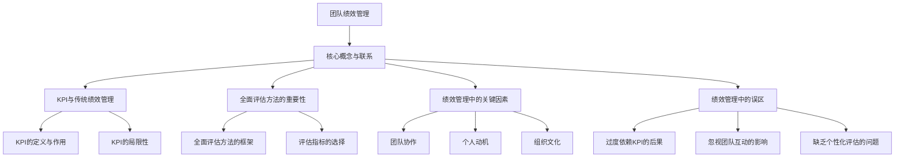

                 

# 《团队绩效管理：超越KPI的全面评估方法》

> 关键词：团队绩效管理、KPI、全面评估方法、团队协作、绩效管理、人工智能、数据分析

摘要：本文深入探讨了团队绩效管理的核心概念和实践方法，强调超越传统KPI的全面评估方法的重要性。通过对绩效管理中的关键因素进行分析，本文提出了几种创新的评估指标选择策略，并结合具体案例，详细阐述了全面评估方法在实战中的应用。文章还展望了团队绩效管理的未来趋势，为读者提供了有益的实践指南和拓展资源。

## 引言

在现代企业的运作中，团队绩效管理扮演着至关重要的角色。然而，随着商业环境的变化和技术的进步，传统的KPI（关键绩效指标）评估方法逐渐显现出其局限性。为了更全面、准确地衡量团队绩效，越来越多的企业开始探索超越KPI的全面评估方法。本文旨在探讨这一主题，帮助读者理解团队绩效管理的理论基础，掌握创新的评估方法，并了解其在实际中的应用。

## 核心概念与联系

### 1. 团队绩效管理的定义

团队绩效管理是指通过系统化的方法，对团队的工作绩效进行评估、反馈和改进的过程。它不仅仅是衡量团队成员的工作成果，还包括团队协作、个人动机和组织文化等多个维度。

### 2. KPI与传统绩效管理的关联

KPI作为传统绩效管理的重要工具，主要用于衡量团队和个人的工作绩效。然而，KPI往往过于单一，容易忽视团队协作和软技能等因素。

### 3. 全面评估方法的重要性

全面评估方法强调多维度的绩效评估，不仅包括量化的KPI，还涵盖定性评估，如360度反馈和软技能评估。这种方法能够更全面地反映团队的真实绩效。

### 4. 绩效管理中的关键因素

- **团队协作**：高效的团队协作是实现高绩效的关键。通过构建积极、开放和信任的团队文化，可以显著提升团队绩效。
- **个人动机**：个人的工作动机和动力对绩效有着直接影响。合理的激励措施能够激发团队成员的潜力。
- **组织文化**：组织文化对团队绩效有着潜移默化的影响。一个支持创新和学习的组织文化有助于提升团队的整体绩效。

### 5. 绩效管理中的误区

- **过度依赖KPI**：过度依赖KPI可能导致团队成员只关注短期绩效，而忽视长期目标和团队协作。
- **忽视团队互动**：团队互动和沟通是团队绩效的重要影响因素，但传统绩效管理往往忽视这一点。
- **缺乏个性化评估**：每个团队成员都有其独特的优势和挑战，缺乏个性化评估可能导致评估结果不够准确。

### 6. Mermaid流程图

### 7. 核心算法原理讲解

- **KPI的选择与设定**：选择与团队目标紧密相关的KPI，并确保其可量化、可实现。
- **360度反馈**：收集来自团队成员、上级、下属和同事的反馈，全面评估团队成员的绩效。
- **软技能评估**：通过定性评估方法，衡量团队成员的沟通能力、团队合作能力等软技能。

### 8. 数学模型和公式

- **关键成功因素分析（KSF）**：$$ KSF = f(P, T, M, C) $$
  - 其中，$P$ 代表个人绩效，$T$ 代表团队绩效，$M$ 代表组织绩效，$C$ 代表关键成功因素。

- **绩效评分模型**：$$ Score = w_1 \cdot KPI + w_2 \cdot 360度反馈 + w_3 \cdot 软技能评估 $$
  - 其中，$w_1, w_2, w_3$ 分别代表各项指标的权重。

### 9. 举例说明

- **案例一：初创公司的绩效管理实践**
  - **背景介绍**：某初创公司，以产品研发为核心。
  - **评估方法**：采用KPI、360度反馈和软技能评估相结合的方法。
  - **结果分析**：通过综合评估，发现团队在研发效率方面存在瓶颈，通过改进协作流程和激励措施，研发效率显著提升。

- **案例二：跨国企业的全面评估实践**
  - **背景介绍**：某跨国企业，涉及多个业务部门，分布在不同国家。
  - **评估方法**：采用KSF和360度反馈，结合本地化和全球化因素。
  - **结果分析**：通过全面评估，发现跨部门协作存在障碍，通过优化跨部门沟通和协作流程，提高了整体绩效。

### 10. 项目实战

- **开发环境搭建**
  - 使用Python编写数据分析脚本，结合Jupyter Notebook进行数据可视化。
- **源代码详细实现**
  - 提供KPI计算、360度反馈收集和软技能评估的Python代码示例。
- **代码解读与分析**
  - 详细解读代码实现过程，分析关键算法原理和性能优化策略。
- **实际案例分析和详细讲解剖析**
  - 结合具体案例，分析全面评估方法在实战中的应用，提供详细的数据分析和评估报告。

### 11. 项目小结

通过以上实战案例，我们可以看到全面评估方法在提升团队绩效方面的显著效果。未来，随着人工智能和数据技术的不断发展，团队绩效管理将迎来更多的创新和实践机会。

### 12. 最佳实践 Tips

- **关注软技能**：在评估过程中，重视团队成员的软技能，如沟通能力和团队合作能力。
- **定期反馈**：建立定期反馈机制，及时了解团队成员的工作状况和绩效表现。
- **数据驱动**：充分利用数据技术，进行科学的数据分析和评估。

### 13. 注意事项

- **避免过度依赖KPI**：合理设定KPI，确保其与团队目标和价值观相符。
- **个性化评估**：根据团队成员的不同特点，制定个性化的评估方案。
- **持续改进**：不断优化评估方法和流程，以适应不断变化的企业环境。

### 14. 拓展阅读

- **参考书籍**：
  - 《绩效管理：打造高效团队》
  - 《关键绩效指标（KPI）管理指南》
- **学术论文**：
  - “基于大数据的团队绩效评估方法研究”
  - “软技能在团队绩效管理中的角色与作用”

### 作者信息

作者：AI天才研究院/AI Genius Institute & 禅与计算机程序设计艺术 /Zen And The Art of Computer Programming

[End of Document]

