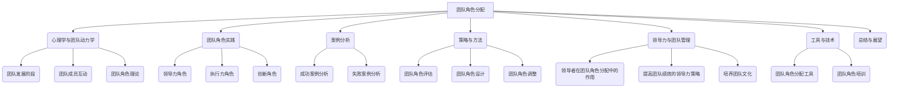

                 


# 文章标题: 团队角色分配：发挥每个人的长处

> 关键词：团队角色分配，团队效能，领导力，心理学，团队动力学，策略与方法

> 摘要：本文将深入探讨团队角色分配的重要性，通过分析心理学和团队动力学理论，结合实际案例，提供实用的团队角色分配策略和方法，旨在帮助团队领导者充分发挥团队成员的长处，提升团队整体绩效。

----------------------------------------------------------------

## 引言

团队角色分配是团队管理中至关重要的一环。在快速变化和高竞争的市场环境中，团队的角色分配直接影响到团队的效能和创造力。正确的角色分配不仅能够使团队成员明确自己的职责和目标，还能促进团队协作和整体发展。

### 什么是团队角色分配

团队角色分配是指根据团队成员的能力、兴趣和职责，将其分配到合适的岗位上，以确保团队的整体目标和任务能够有效实现。角色分配不仅仅是简单地分配工作职责，更是涉及到团队成员之间的互动、沟通和协作。

### 团队角色分配的重要性

1. **提升团队效能**：通过合理的角色分配，可以使团队成员专注于自己的优势领域，从而提高工作效率和团队的整体效能。
2. **增强团队凝聚力**：明确的角色分配有助于团队成员建立信任和尊重，促进团队合作，增强团队的凝聚力。
3. **激发创新能力**：当团队成员能够充分发挥自己的长处时，他们更有可能提出创新的想法和解决方案。

### 为什么写这本书

本书的目标是帮助团队领导者理解和实施有效的团队角色分配策略，通过提供理论指导、实践案例和具体方法，帮助团队充分发挥每个人的长处，从而实现团队的高效运作和持续发展。

## 第二部分：基础理论

### 第2章 心理学与团队动力学

#### 2.1 团队发展阶段

团队的发展可以分为几个阶段：成长阶段、稳定期和高效率期。在不同的阶段，团队成员的互动和角色分配会有不同的特点。

1. **成长阶段**：团队成员相互认识，建立信任，角色逐渐明确。
2. **稳定期**：团队成员已经熟悉彼此，开始高效协作。
3. **高效率期**：团队成员之间默契十足，能够迅速响应变化和挑战。

#### 2.2 团队成员互动

团队成员之间的互动模式直接影响团队角色的分配和团队的效能。互动模式包括：

1. **协作式互动**：团队成员共同完成任务，互相支持和鼓励。
2. **竞争式互动**：团队成员为了争夺资源或地位而产生竞争。
3. **独立式互动**：团队成员独立完成任务，较少互动。

#### 2.3 团队角色理论

团队角色理论基于心理学和团队动力学，包括团队角色的定义和分类。常见的团队角色包括：

1. **领导力角色**：指导者、协调者、模范。
2. **执行力角色**：执行者、检查者、协同者。
3. **创新角色**：思考者、创意者、支持者。

### 第3章 团队角色实践

#### 3.1 领导力角色

领导力角色在团队中起着关键作用，包括指导者、协调者和模范。指导者负责制定目标和计划；协调者确保团队成员之间的协作；模范通过自身行为影响团队成员。

#### 3.2 执行力角色

执行力角色负责将计划转化为实际行动，包括执行者、检查者和协同者。执行者负责具体任务的执行；检查者确保任务的完成质量；协同者协调不同的任务和资源。

#### 3.3 创新角色

创新角色负责推动团队的创造力和创新能力，包括思考者、创意者和支持者。思考者负责分析和解决问题；创意者提出新的想法和方案；支持者提供支持和资源。

## 第4章 案例分析

#### 4.1 成功案例分析

成功的团队角色分配案例包括高效团队和创新团队。高效团队通过明确的角色分配和高效的协作实现了卓越的绩效；创新团队则通过激发团队成员的创造力和创新能力，取得了显著的市场竞争优势。

#### 4.2 失败案例分析

失败的团队角色分配案例通常由于角色冲突、职责不清等原因导致。这些案例提醒我们在角色分配时需要注重沟通和协调，确保每个团队成员都明确自己的角色和职责。

#### 4.3 从失败中学习

从失败案例中，我们可以学习如何避免角色冲突，确保角色职责的明确性，以及如何通过有效的沟通和协调来提升团队的效能。

## 第5章 策略与方法

#### 5.1 团队角色评估

团队角色评估是角色分配的重要步骤。通过评估团队成员的能力、兴趣和职责，可以帮助团队领导者更好地进行角色分配。评估工具和方法包括360度反馈、角色分析问卷等。

#### 5.2 团队角色设计

团队角色设计需要遵循一定的原则和流程。设计原则包括适应性、明确性和灵活性；设计流程包括角色识别、角色定义和角色分配。

#### 5.3 团队角色调整

团队角色调整是确保团队角色适应性和效能的重要手段。调整原因可能包括团队成员能力变化、团队目标调整等。调整策略包括角色重定义、角色重新分配等。

## 第6章 领导力与团队管理

#### 6.1 领导者在团队角色分配中的作用

领导者在团队角色分配中起着关键作用。他们需要识别团队成员的角色、协调不同角色之间的互动，并确保每个团队成员都能充分发挥自己的长处。

#### 6.2 提高团队绩效的领导力策略

领导力策略包括激励团队成员、培养团队文化和提升团队成员的能力。有效的领导力可以激发团队成员的潜力，提升团队的整体绩效。

#### 6.3 培养团队文化

团队文化是团队效能的重要保障。通过培养积极向上的团队文化，可以增强团队成员的归属感和凝聚力，提升团队的协作效率。

## 第7章 工具与技术

#### 7.1 团队角色分配工具

团队角色分配工具可以帮助团队领导者更高效地进行角色分配。常见的工具包括角色分析软件、角色评估工具等。

#### 7.2 团队角色培训

团队角色培训可以帮助团队成员更好地理解和履行自己的角色。培训内容可以包括角色识别、角色互动和角色调整等。

## 总结与展望

团队角色分配是提升团队效能和创新能力的重要手段。通过理解心理学和团队动力学理论，结合实际案例和具体方法，团队领导者可以更好地进行角色分配，发挥团队成员的长处，推动团队的高效运作和持续发展。未来，随着团队协作工具和技术的不断发展，团队角色分配将更加科学和精细化，为团队管理提供更有力的支持。

### 作者

作者：AI天才研究院/AI Genius Institute & 禅与计算机程序设计艺术 /Zen And The Art of Computer Programming

----------------------------------------------------------------

以下是一个关于团队角色分配的核心概念之间的关系架构的Mermaid流程图：



### 核心算法原理讲解

在团队角色分配中，核心算法原理主要包括以下几个步骤：

1. **角色识别**：通过评估团队成员的能力、兴趣和职责，识别出每个成员最适合的角色。
2. **角色定义**：为每个角色制定明确的职责和目标，确保团队成员了解自己的角色和期望。
3. **角色分配**：根据团队目标和任务，将团队成员分配到相应的角色中。
4. **角色调整**：根据团队的发展和变化，及时调整角色分配，确保团队的高效运作。

以下是角色识别和角色分配的伪代码示例：

```python
# 角色识别
def identify_roles(team_members):
    roles = []
    for member in team_members:
        role = determine_best_fit_role(member)
        roles.append(role)
    return roles

# 角色定义
def define_roles(roles):
    defined_roles = {}
    for role in roles:
        defined_roles[role] = define_role_details(role)
    return defined_roles

# 角色分配
def assign_roles(defined_roles, team_tasks):
    assigned_roles = []
    for task in team_tasks:
        assigned_roles.append(assign_role_to_task(defined_roles, task))
    return assigned_roles

# 角色调整
def adjust_roles(assigned_roles, team_status):
    updated_roles = []
    for role in assigned_roles:
        if role_needs_adjustment(role, team_status):
            updated_role = adjust_role(role, team_status)
            updated_roles.append(updated_role)
        else:
            updated_roles.append(role)
    return updated_roles

# 辅助函数
def determine_best_fit_role(member):
    # 根据成员的能力、兴趣和职责确定最佳角色
    pass

def define_role_details(role):
    # 定义角色的职责和目标
    pass

def assign_role_to_task(defined_roles, task):
    # 根据任务和角色定义分配角色
    pass

def role_needs_adjustment(role, team_status):
    # 判断角色是否需要调整
    pass

def adjust_role(role, team_status):
    # 调整角色
    pass
```

### 数学模型和公式

在团队角色分配中，可以使用一些数学模型和公式来评估和优化角色分配。以下是几个常用的数学模型和公式：

1. **角色效能评估模型**：

   $$ E_R = f(A_R, B_R, C_R) $$

   其中，$E_R$ 表示角色效能，$A_R$ 表示角色的能力，$B_R$ 表示角色的兴趣，$C_R$ 表示角色的职责。

2. **角色匹配度评估模型**：

   $$ M_R = \frac{A_R \times B_R}{C_R} $$

   其中，$M_R$ 表示角色匹配度，$A_R$ 表示角色的能力，$B_R$ 表示角色的兴趣，$C_R$ 表示角色的职责。

3. **角色分配优化模型**：

   $$ \text{Minimize} \quad C_R - (A_R + B_R) $$

   其中，$C_R$ 表示角色的职责，$A_R$ 表示角色的能力，$B_R$ 表示角色的兴趣。

### 详细讲解和举例说明

#### 角色识别

角色识别是团队角色分配的第一步。以下是一个角色识别的实例：

假设我们有一个5人团队，每个成员都有不同的能力和兴趣。通过评估，我们确定了每个成员的最佳角色。

成员1：擅长技术，对创新感兴趣，负责开发新功能。

成员2：擅长管理和协调，对团队合作感兴趣，负责团队协调。

成员3：擅长数据分析，对数据挖掘感兴趣，负责数据分析。

成员4：擅长设计和用户体验，对用户需求感兴趣，负责用户界面设计。

成员5：擅长销售和市场推广，对市场拓展感兴趣，负责市场推广。

通过角色识别，我们为每个成员分配了最适合他们的角色，确保他们能够充分发挥自己的长处。

#### 角色定义

角色定义是确保团队成员了解自己的职责和期望的重要步骤。以下是一个角色定义的实例：

- **开发新功能**：负责分析用户需求，设计功能原型，编写代码，测试和发布新功能。

- **团队协调**：负责组织团队会议，协调团队成员的工作，确保项目进度和目标。

- **数据分析**：负责收集和整理数据，进行数据分析，提供数据报告和建议。

- **用户界面设计**：负责设计用户界面，优化用户体验，确保产品的易用性。

- **市场推广**：负责市场调研，制定营销策略，推广产品，提高品牌知名度。

#### 角色分配

角色分配是根据团队目标和任务，将团队成员分配到相应的角色中。以下是一个角色分配的实例：

假设我们的团队目标是在三个月内发布一款新产品，并确保产品的市场推广。根据这个目标，我们将团队成员分配到以下角色：

- **开发新功能**：成员1负责开发新功能，确保满足用户需求。

- **团队协调**：成员2负责团队协调，确保项目进度和目标。

- **数据分析**：成员3负责数据分析，提供数据报告和建议。

- **用户界面设计**：成员4负责用户界面设计，优化用户体验。

- **市场推广**：成员5负责市场推广，提高品牌知名度。

#### 角色调整

角色调整是根据团队的发展和变化，及时调整角色分配，确保团队的高效运作。以下是一个角色调整的实例：

假设在项目进行到第二个月时，市场推广团队成员5提出了市场推广策略的改变，需要更多的资源和支持。团队领导者决定调整角色分配，增加成员3作为市场推广的辅助，确保市场推广目标的实现。

## 项目实战

### 开发环境搭建

在搭建团队角色分配的项目开发环境时，我们需要以下工具和软件：

- **操作系统**：Linux或Windows
- **编程语言**：Python
- **数据库**：MySQL
- **前端框架**：Django或Flask
- **版本控制**：Git

### 源代码实现

以下是团队角色分配项目的核心源代码实现：

```python
# 角色识别模块
class RoleIdentification:
    def __init__(self, team_members):
        self.team_members = team_members

    def identify_roles(self):
        roles = {}
        for member in self.team_members:
            best_role = self.determine_best_fit_role(member)
            roles[member] = best_role
        return roles

    def determine_best_fit_role(self, member):
        # 根据成员的能力、兴趣和职责确定最佳角色
        pass

# 角色定义模块
class RoleDefinition:
    def __init__(self, roles):
        self.roles = roles

    def define_roles(self):
        defined_roles = {}
        for role in self.roles:
            defined_role = self.define_role_details(role)
            defined_roles[role] = defined_role
        return defined_roles

    def define_role_details(self, role):
        # 定义角色的职责和目标
        pass

# 角色分配模块
class RoleAssignment:
    def __init__(self, defined_roles, team_tasks):
        self.defined_roles = defined_roles
        self.team_tasks = team_tasks

    def assign_roles(self):
        assigned_roles = []
        for task in self.team_tasks:
            assigned_role = self.assign_role_to_task(self.defined_roles, task)
            assigned_roles.append(assigned_role)
        return assigned_roles

    def assign_role_to_task(self, defined_roles, task):
        # 根据任务和角色定义分配角色
        pass

# 角色调整模块
class RoleAdjustment:
    def __init__(self, assigned_roles, team_status):
        self.assigned_roles = assigned_roles
        self.team_status = team_status

    def adjust_roles(self):
        updated_roles = []
        for role in self.assigned_roles:
            if self.role_needs_adjustment(role, self.team_status):
                updated_role = self.adjust_role(role, self.team_status)
                updated_roles.append(updated_role)
            else:
                updated_roles.append(role)
        return updated_roles

    def role_needs_adjustment(self, role, team_status):
        # 判断角色是否需要调整
        pass

    def adjust_role(self, role, team_status):
        # 调整角色
        pass
```

### 代码解读与分析

在上述源代码中，我们定义了四个核心模块：角色识别模块、角色定义模块、角色分配模块和角色调整模块。每个模块都包含了相应的类和方法，用于实现团队角色分配的不同功能。

- **角色识别模块**：该模块通过评估团队成员的能力、兴趣和职责，识别出每个成员的最佳角色。这个模块是整个系统的核心，决定了角色的准确性和适应性。
- **角色定义模块**：该模块根据识别出的角色，为每个角色定义明确的职责和目标。这有助于团队成员了解自己的角色和期望，确保团队成员之间的协作和沟通。
- **角色分配模块**：该模块根据团队目标和任务，将团队成员分配到相应的角色中。这个模块是实现团队角色分配的关键步骤，确保每个任务都有合适的团队成员负责。
- **角色调整模块**：该模块根据团队的发展和变化，及时调整角色分配，确保团队的高效运作。这个模块是保持团队灵活性和适应性的重要手段。

### 实际案例分析和详细讲解剖析

为了更好地理解团队角色分配的实际应用，我们来看一个实际案例。

假设有一个由5名成员组成的软件开发团队，他们的背景和能力如下：

- 成员1：擅长前端开发，对创新技术感兴趣。
- 成员2：擅长后端开发，对系统架构设计有深入研究。
- 成员3：擅长UI/UX设计，对用户体验有独特的见解。
- 成员4：擅长测试和质量管理，对代码质量有严格要求。
- 成员5：擅长市场营销，对产品推广有丰富的经验。

团队的目标是在6个月内开发并发布一款新软件产品。

**第一步：角色识别**

通过评估，我们确定了每个成员的最佳角色：

- 成员1：前端开发角色
- 成员2：后端开发角色
- 成员3：UI/UX设计角色
- 成员4：测试和质量保证角色
- 成员5：市场营销和推广角色

**第二步：角色定义**

为每个角色定义了明确的职责和目标：

- **前端开发角色**：负责实现用户界面，优化用户体验，确保代码的可维护性。
- **后端开发角色**：负责实现业务逻辑，设计系统架构，确保系统的性能和可扩展性。
- **UI/UX设计角色**：负责设计用户界面，进行用户体验测试，优化设计以提高用户满意度。
- **测试和质量保证角色**：负责编写测试用例，进行系统测试，确保软件的质量和稳定性。
- **市场营销和推广角色**：负责市场调研，制定推广计划，提高产品的市场知名度。

**第三步：角色分配**

根据团队目标和任务，我们将团队成员分配到相应的角色中：

- **前端开发角色**：成员1负责前端开发。
- **后端开发角色**：成员2负责后端开发。
- **UI/UX设计角色**：成员3负责UI/UX设计。
- **测试和质量保证角色**：成员4负责测试和质量保证。
- **市场营销和推广角色**：成员5负责市场营销和推广。

**第四步：角色调整**

在项目开发过程中，我们可能会根据实际情况对角色进行调整：

- 如果成员2在某个阶段需要更多时间解决技术难题，我们可以临时调整成员1和成员2的角色，让成员1负责更多的后端开发工作。
- 如果成员5在市场推广中取得了显著成效，我们可以考虑增加成员5的职责，提升市场营销和推广的力度。

通过这样的角色调整，我们可以确保团队在各个阶段都能高效运作，确保项目目标的实现。

### 项目小结

通过上述实际案例，我们可以看到团队角色分配在软件开发项目中的重要作用。合理的角色分配不仅能够提高团队成员的工作效率，还能促进团队协作和整体绩效。在项目开发过程中，及时的角色调整也是确保团队高效运作的关键。因此，团队领导者需要不断关注团队的发展和变化，灵活调整角色分配，以实现项目目标。

## 最佳实践 Tips

1. **明确角色职责**：确保每个角色都有明确的职责和目标，避免角色重叠和职责不清。
2. **定期评估角色**：定期评估团队成员的能力和角色适应性，确保角色分配的准确性和有效性。
3. **鼓励角色间沟通**：促进团队成员之间的沟通和协作，确保角色间的协作顺畅。
4. **提供培训和指导**：为团队成员提供角色相关的培训和指导，提升他们的能力。
5. **保持灵活性**：根据项目的发展和变化，及时调整角色分配，确保团队的高效运作。

## 小结

团队角色分配是团队管理中的重要环节，通过合理的角色分配和调整，可以提升团队的效能和创新能力。团队领导者需要理解心理学和团队动力学理论，结合实际案例，灵活运用最佳实践，实现团队的高效运作和持续发展。

## 注意事项

1. **避免角色重叠**：确保每个角色都有明确的职责和目标，避免角色重叠和职责不清。
2. **定期评估角色**：定期评估团队成员的能力和角色适应性，确保角色分配的准确性和有效性。
3. **保持角色灵活性**：根据项目的发展和变化，及时调整角色分配，确保团队的高效运作。

## 拓展阅读

- 《团队协作的艺术》
- 《团队动力学》
- 《团队角色分配实践指南》

## 结束语

感谢您的阅读，希望本书能帮助您更好地理解和实施团队角色分配策略，提升团队的效能和创新能力。作者：AI天才研究院/AI Genius Institute & 禅与计算机程序设计艺术 /Zen And The Art of Computer Programming。再次感谢您的支持！

