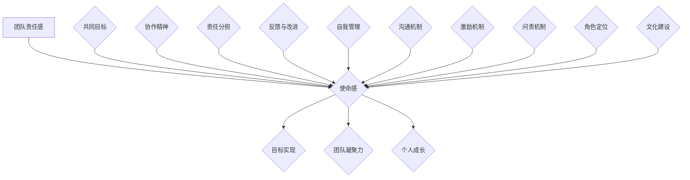

                 

### 文章标题

《团队责任感培养：增强使命感的有效方法》

### 关键词

团队责任感，使命感，团队建设，领导力，沟通机制，激励与问责，案例研究

### 摘要

在快速发展的IT行业，团队责任感和使命感是团队成功的关键因素。本文旨在探讨如何通过有效的策略和具体实践来培养团队责任感，增强团队成员的使命感。文章首先介绍了团队责任感和使命感的概念及其关系，随后详细分析了培养团队责任感的基础和增强使命感的方法。通过具体案例和项目实战，本文提供了实用的指导，帮助团队领导者和实践者提升团队的整体效能和凝聚力。文章最后总结了培养团队责任感的最佳实践，并对未来的发展提出了建议。本文适用于希望提升团队协作和绩效的IT团队领导者和管理者。

## 团队责任感概述

### 1.1 什么是团队责任感

团队责任感是指团队成员对其在团队中所承担的任务、职责和目标的认知和承诺。它不仅仅是一种个人行为，更是一种集体行为，涉及到团队成员之间的相互信任、支持和协作。团队责任感体现在以下几个方面：

1. **任务执行：** 成员对分配给自己的任务有明确的认知，并全力以赴地完成。

2. **责任分担：** 成员意识到每个任务都需要团队的共同努力，个人责任与团队责任相辅相成。

3. **协作精神：** 成员在团队中相互协作，共同解决问题，实现团队目标。

4. **反馈与改进：** 成员对团队的工作进行定期反馈，提出建设性意见，以促进团队不断改进。

### 1.2 团队责任感的价值

团队责任感在团队成功中起着至关重要的作用。以下是团队责任感的一些核心价值：

1. **提高工作效率：** 具有强烈责任感的团队成员会更加专注和高效地完成任务，从而提高整个团队的工作效率。

2. **增强团队凝聚力：** 责任感使团队成员更加团结，增强团队凝聚力，使团队在面对挑战时更加紧密。

3. **促进个人成长：** 责任感促使成员不断提升自己的能力和素质，实现个人与团队的共同成长。

4. **提高决策质量：** 当团队成员具有强烈的责任感时，他们会对团队决策更加投入，从而提高决策的质量和执行力。

### 1.3 团队责任感与使命感的关系

团队责任感与使命感之间存在着密切的联系和互动。使命感是指团队所追求的更高层次的目标和价值，它为团队成员提供了共同的愿景和动力。团队责任感是使命感的具体体现，通过每个成员的责任感，团队才能共同实现使命。

1. **使命感引领责任感：** 使命感为团队成员提供了方向和动力，使责任感具有更高的意义和价值。

2. **责任感支撑使命感：** 团队责任感是团队成员实现使命感的基础，通过责任的履行，团队才能不断前进，达成使命。

3. **互动与平衡：** 团队责任感和使命感相互影响，二者需要达到平衡，才能使团队健康发展。

通过以上分析，我们可以看到团队责任感的重要性及其与使命感之间的紧密关系。接下来，我们将探讨如何通过基础建设和实践方法来培养团队责任感，并增强使命感。

## 培养团队责任感的基础

### 2.1 培养团队责任感的先决条件

要培养团队责任感，首先需要具备一些先决条件，这些条件为团队责任感的建立和维持提供了坚实的基础。

1. **明确的角色定位：** 每个团队成员都应该清楚地知道自己的角色和责任。这包括了解自己的任务、期望的成果以及如何与其他成员协作。明确的角色定位有助于减少误解和冲突，提高团队的整体效能。

2. **共同的目标与愿景：** 团队责任感的培养离不开共同的目标和愿景。团队成员需要明确团队的目标，并认同这些目标，这样他们才会更有动力去承担责任。共同的目标和愿景为团队提供了方向和动力，使团队成员感到他们的工作是有意义和价值的。

3. **有效的沟通机制：** 沟通是团队责任感培养的关键因素。团队成员需要建立有效的沟通机制，确保信息的透明和流畅。这包括定期的会议、即时通讯工具和反馈机制，使团队成员能够及时交流意见、分享信息和解决问题。

4. **信任与支持：** 团队责任感建立在信任和支持的基础上。团队成员之间需要相互信任，相信彼此的能力和诚信。同时，团队成员也应该提供支持，帮助彼此克服困难，共同成长。

5. **公平的激励机制：** 公平的激励机制能够鼓励团队成员承担责任。这包括物质奖励和非物质激励，如晋升、荣誉和认可等。合理的激励机制能够增强团队成员的积极性和责任感。

### 2.2 团队文化建设在责任感培养中的作用

团队文化是团队长期形成的价值观、信念和行为规范，它在团队责任感培养中起着至关重要的作用。

1. **塑造价值观：** 团队文化能够塑造团队成员的共同价值观，使他们对责任感和使命感有更深刻的理解。例如，如果团队文化强调“客户至上”或“创新驱动”，成员会自然而然地将这些价值观融入到他们的工作中，从而增强责任感。

2. **建立规范：** 团队文化为团队成员提供了一套共同的行为规范，使他们在面对责任时知道如何行动。这些规范可以是正式的，如工作流程和规章制度；也可以是非正式的，如团队的传统和习惯。

3. **增强归属感：** 团队文化能够增强团队成员的归属感，使他们感到自己是团队的一部分，而不是孤立的个体。这种归属感使团队成员更有动力去承担责任，因为他们知道他们的工作对团队是重要的。

4. **促进持续改进：** 团队文化鼓励团队成员持续改进，追求卓越。这种文化使得团队成员不仅关注当前的工作，还关注如何更好地完成任务和提升团队效能，从而培养责任感。

### 2.3 领导者在团队责任感培养中的角色

领导者在团队责任感培养中扮演着关键角色，他们需要采取一系列措施来推动团队责任感的建立和维持。

1. **设定清晰的期望：** 领导者需要为团队成员设定清晰的期望，明确团队的目标和每个成员的责任。这有助于团队成员明确自己的角色，并了解如何为团队的成功贡献力量。

2. **提供必要的支持：** 领导者应该为团队成员提供必要的资源和支持，帮助他们克服工作中的困难和挑战。这包括技术支持、培训机会和合理的工作安排。

3. **建立良好的沟通机制：** 领导者需要建立有效的沟通机制，确保信息的透明和流畅。这包括定期举行团队会议、开设反馈渠道和提供及时的反馈。

4. **鼓励自主管理：** 领导者应该鼓励团队成员自主管理，培养他们的自我驱动能力和责任感。这可以通过设定自主的任务目标和提供决策权来实现。

5. **提供激励和认可：** 领导者需要提供合理的激励和认可，以鼓励团队成员承担责任。这可以包括物质奖励、晋升机会和公开认可等。

通过以上措施，领导者可以有效地培养团队责任感，推动团队的长期发展。在下一部分，我们将探讨如何通过明确团队使命和提升自我认知与自我管理能力来增强使命感。

## 增强使命感的方法

### 3.1 明确团队使命与目标

团队使命是团队存在的根本原因，它为团队提供了方向和动力。为了增强团队的使命感，首先需要明确团队的使命和目标。以下是实现这一目标的具体步骤：

1. **确定使命：** 团队的使命应该简洁、明确且具有吸引力。使命应该回答团队为何存在、为何而努力的问题。例如，一个技术团队的使命可以是“通过创新技术，为用户提供最佳解决方案”。

2. **制定目标：** 团队目标是将使命具体化，分为短期目标和长期目标。短期目标通常是1-2年内可以实现的具体成果，而长期目标则是3-5年甚至更长时间的目标。例如，一个技术团队的短期目标可以是“提高产品性能20%”，长期目标可以是“成为行业领先的技术提供商”。

3. **全员参与：** 在确定使命和目标时，应鼓励团队成员参与讨论，确保他们理解和认同这些目标和使命。全员参与可以增强团队的凝聚力和归属感，使团队成员更有动力去实现目标。

4. **定期更新：** 团队的使命和目标不是一成不变的，应随着团队和环境的变化进行定期更新。这有助于团队保持对使命和目标的清晰认识，并适应新的挑战。

### 3.2 提升团队自我认知与自我管理能力

提升团队自我认知和自我管理能力是增强使命感的关键。以下是实现这一目标的方法：

1. **自我评估：** 团队成员应定期进行自我评估，了解自己在团队中的角色、贡献和成长空间。自我评估可以通过个人报告、反馈会议和360度评估等方式进行。

2. **反馈机制：** 建立有效的反馈机制，使团队成员能够接收来自同事、领导和客户的反馈。反馈机制可以是定期的反馈会议、匿名反馈表格或在线反馈系统。

3. **培训与发展：** 提供持续的培训和发展机会，帮助团队成员提升技能和知识。培训可以包括技术培训、管理培训和个人发展培训等。

4. **自我管理工具：** 利用自我管理工具，如时间管理软件、个人目标设定工具等，帮助团队成员更好地管理时间和任务。这些工具可以提高团队成员的效率，使其更有时间专注于团队目标。

### 3.3 建立有效的沟通机制与反馈机制

沟通和反馈是团队成功的关键因素，它们有助于增强团队的使命感和责任感。以下是建立有效沟通机制和反馈机制的方法：

1. **开放沟通：** 鼓励团队成员之间开放沟通，分享意见和想法。开放沟通可以增加团队的透明度，减少误解和冲突。

2. **定期会议：** 设立定期的团队会议，讨论团队进展、目标和挑战。会议可以是日常站会、周会或月度会议，确保团队成员保持对团队目标和使命的清晰认识。

3. **即时沟通：** 利用即时通讯工具（如Slack、Microsoft Teams等）和邮件系统，确保团队成员之间的即时沟通。即时沟通有助于快速解决问题，提高团队效率。

4. **反馈机制：** 建立反馈机制，使团队成员能够及时收到反馈，并根据反馈进行调整。反馈可以是正面的，也可以是建设性的，关键在于使其有助于团队改进。

5. **冲突解决：** 提供冲突解决渠道，帮助团队成员在出现分歧时找到解决方案。有效的冲突解决可以增强团队的凝聚力和责任感。

通过以上方法，团队可以建立有效的沟通机制和反馈机制，增强团队的使命感和责任感。在下一部分，我们将通过具体实践和案例，探讨如何在实际中培养团队责任感，并增强使命感。

### 4.1 实践一：设立团队目标与责任分工

为了培养团队责任感，设立明确的团队目标和责任分工是至关重要的。以下是具体的步骤和方法：

1. **制定团队目标：** 团队目标应与团队的使命和愿景保持一致，确保其具有实际可行性和可测量性。目标可以分为短期目标和长期目标。短期目标通常是指在一个季度或一年内要达成的具体成果，如提高产品性能、缩短项目周期等。长期目标则是指在未来几年内要实现的目标，如成为行业领先者、拓展新市场等。在制定目标时，应确保团队成员充分参与，共同讨论和确定目标，这样他们才能更加认同和投入。

2. **分解目标：** 将团队目标分解为具体的任务和责任，明确每个任务的责任人和完成时间。任务分解应考虑到团队成员的能力、经验和兴趣，确保每个任务都有合适的承担者。分解任务时，可以使用工作分解结构（WBS）图，将大任务分解为更小、更具体的子任务，使团队成员更加清晰地了解自己的职责和目标。

3. **责任明确：** 对于每个任务，明确责任人和其具体的职责，确保团队成员清楚自己需要做什么，以及如何与其他成员协作。责任明确有助于避免任务重叠和责任模糊，提高团队效率。

4. **定期检查：** 定期检查团队目标的进展情况，确保任务按计划进行。可以使用项目管理工具（如JIRA、Trello等）来跟踪任务的进度，并及时调整计划。定期检查还可以帮助团队成员了解自己在团队中的角色和贡献，增强责任感。

5. **透明反馈：** 建立透明反馈机制，使团队成员能够及时了解自己在完成任务过程中的表现和需要改进的地方。反馈可以是正面的，也可以是建设性的，关键在于使其有助于团队改进。通过透明反馈，团队成员可以不断学习和成长，提高团队的整体效能。

### 实践二：团队角色分工与协同

为了确保团队高效运作，合理的角色分工和良好的协同工作是必不可少的。以下是实现这一目标的具体步骤：

1. **角色识别：** 根据团队目标和任务，识别每个团队成员的角色和职责。常见角色包括项目经理、开发者、测试员、产品经理、设计师等。每个角色都有其特定的职责和技能，确保团队成员能够发挥其专长，提高团队整体效能。

2. **分工协作：** 根据角色识别，将任务分配给相应的团队成员，并明确每个成员的职责范围。分工协作有助于减少任务重叠和冲突，提高团队效率。同时，团队成员应了解其他成员的角色和职责，确保在协作过程中能够相互配合。

3. **建立流程：** 建立清晰的团队工作流程，包括任务分配、进度跟踪、评审和反馈等环节。明确的工作流程有助于团队成员了解任务进展，及时调整计划，确保项目按期完成。

4. **沟通协调：** 建立有效的沟通机制，确保团队成员之间的信息传递畅通。可以使用即时通讯工具（如Slack、Microsoft Teams等）和邮件系统，定期召开团队会议，讨论任务进展和遇到的问题。良好的沟通协调有助于解决冲突，提高团队协作效率。

5. **定期回顾：** 定期回顾团队的角色分工和协作情况，评估流程的有效性，并根据反馈进行调整。回顾会议可以收集团队成员的意见和建议，优化工作流程，提高团队整体效能。

通过以上实践，团队可以建立明确的目标和合理的角色分工，确保团队成员各司其职，高效协作，从而培养团队责任感，增强使命感。在下一部分，我们将探讨团队激励机制与问责机制，以进一步提升团队责任感和使命感。

### 4.3 实践三：团队激励机制与问责机制

为了确保团队成员保持高度的积极性和责任感，团队激励机制与问责机制是不可或缺的。以下是具体的步骤和方法：

#### 团队激励机制

1. **奖励与认可：** 设计合理的奖励和认可机制，激励团队成员。奖励可以是物质的，如奖金、股票期权等；也可以是精神的，如公开表彰、荣誉称号等。认可可以通过团队会议、公告板或社交媒体平台进行，使团队成员感到他们的贡献被看见和认可。

2. **灵活的工作安排：** 提供灵活的工作安排，如远程办公、弹性工作时间等，以适应团队成员的需求，提高工作满意度和效率。灵活的工作安排不仅有助于提升团队成员的工作质量，还可以增强他们的归属感和责任感。

3. **培训与职业发展：** 提供持续的培训和发展机会，帮助团队成员提升技能和知识。职业发展计划可以包括晋升路径、技能提升培训和领导力培养等。通过培训和发展，团队成员不仅能够实现个人成长，还能为团队带来更多的价值。

4. **团队建设活动：** 定期组织团队建设活动，如团队拓展训练、团建旅行等，增强团队成员之间的互动和信任。团队建设活动有助于缓解工作压力，提高团队凝聚力，从而增强团队责任感。

#### 团队问责机制

1. **明确责任：** 在任务分配时，明确每个团队成员的责任和义务，确保他们清楚自己的任务和期望。明确的责任有助于避免责任模糊和任务重叠，提高团队工作效率。

2. **定期检查：** 定期检查团队成员的任务完成情况，确保他们按照计划进行工作。可以通过项目管理工具（如JIRA、Trello等）跟踪任务的进度，及时发现和解决问题。

3. **反馈与改进：** 建立有效的反馈机制，使团队成员能够及时收到反馈，并根据反馈进行调整。反馈可以是正面的，也可以是建设性的，关键在于使其有助于团队改进。通过反馈，团队成员可以了解自己在工作中的优点和不足，从而不断提高。

4. **问责制度：** 建立问责制度，对未能按时完成任务或未达到预期目标的团队成员进行问责。问责制度应公正、透明，确保团队成员了解问责标准和流程。通过问责制度，可以促进团队成员的责任感和自律性，提高团队整体效能。

5. **改进措施：** 在问责过程中，不仅要指出问题，还要提供改进措施和建议。改进措施可以包括培训、技能提升或工作流程优化等。通过改进措施，团队成员可以更好地理解问题和解决方案，从而在今后的工作中避免类似问题。

通过激励机制与问责机制的有机结合，团队可以激发成员的积极性和责任感，确保团队目标的实现。在下一部分，我们将通过成功企业案例，进一步探讨团队责任感培养的具体实践。

### 4.4 案例分析：成功培养团队责任感的企业案例

在培养团队责任感方面，许多企业已经取得了显著的成功，以下是几个典型的案例。

#### 案例一：谷歌

谷歌是一家以创新和团队精神著称的企业。为了培养团队责任感，谷歌采取了以下措施：

1. **明确使命与目标：** 谷歌的使命是“整合全球信息，使人人皆可访问并从中受益”。这一使命为谷歌的团队提供了清晰的方向和目标。谷歌还设立了具体的短期和长期目标，如开发新的搜索引擎算法、推出新的产品和服务等。

2. **灵活的工作环境：** 谷歌提供了灵活的工作环境，如远程办公、弹性工作时间等，以适应团队成员的需求。这种灵活的工作安排不仅提高了员工的工作满意度，还增强了团队的凝聚力。

3. **奖励与认可：** 谷歌设计了多种奖励和认可机制，如年度奖、季度奖和团队奖等。这些奖励不仅包括物质奖励，如奖金、股票期权等，还包括精神奖励，如公开表彰、荣誉称号等。通过这些奖励和认可，谷歌激励团队成员积极承担责任，为实现团队目标贡献力量。

4. **团队建设活动：** 谷歌定期组织团队建设活动，如团队拓展训练、团建旅行等。这些活动不仅有助于缓解工作压力，提高团队凝聚力，还能增强团队成员的责任感和归属感。

#### 案例二：特斯拉

特斯拉是一家以创新和使命驱动为特色的企业。为了培养团队责任感，特斯拉采取了以下措施：

1. **明确使命与目标：** 特斯拉的使命是“加速全球向可持续能源的转变”。这一使命为特斯拉的团队提供了明确的方向和目标。特斯拉还设立了具体的短期和长期目标，如推出新款电动汽车、建设超级充电站等。

2. **自主管理：** 特斯拉鼓励团队成员自主管理，赋予他们更多的决策权和工作自由。这种自主管理不仅提高了团队成员的积极性和责任感，还增强了团队的创新能力。

3. **培训与发展：** 特斯拉提供持续的培训和发展机会，帮助团队成员提升技能和知识。这些培训和发展计划包括技术培训、管理培训和个人发展培训等。通过培训和发展，团队成员不仅能够实现个人成长，还能为团队带来更多的价值。

4. **公开透明的反馈机制：** 特斯拉建立了公开透明的反馈机制，使团队成员能够及时收到反馈，并根据反馈进行调整。通过这种反馈机制，特斯拉不仅能够发现和解决问题，还能不断改进工作流程，提高团队效能。

#### 案例三：华为

华为是一家以客户为中心、持续创新为特色的企业。为了培养团队责任感，华为采取了以下措施：

1. **明确使命与目标：** 华为的使命是“为客户服务，并推动社会进步”。这一使命为华为的团队提供了明确的方向和目标。华为还设立了具体的短期和长期目标，如拓展全球市场、提高产品和服务质量等。

2. **团队合作：** 华为强调团队合作，鼓励团队成员相互协作，共同完成任务。华为通过跨部门项目、团队竞赛等活动，促进团队成员之间的合作，增强团队责任感。

3. **激励与问责：** 华为设计了多种激励与问责机制，如绩效奖金、股权激励、问责制度等。通过这些机制，华为激励团队成员积极承担责任，为实现团队目标贡献力量。

4. **持续改进：** 华为注重持续改进，鼓励团队成员不断反思和优化工作流程。通过持续改进，华为不仅能够提高产品质量和服务水平，还能增强团队的责任感和使命感。

通过以上案例，我们可以看到，成功培养团队责任感的关键在于明确使命与目标、提供自主管理的机会、建立激励与问责机制以及注重团队建设和持续改进。这些措施不仅能够提高团队的工作效率，还能增强团队的凝聚力和使命感。在下一部分，我们将探讨在培养团队责任感过程中可能遇到的问题和挑战，并提出相应的解决方案。

### 5.1 常见问题与解决方案

在培养团队责任感的过程中，团队领导者和管理者可能会遇到一系列问题和挑战。以下是其中一些常见的问题及其解决方案：

#### 1. 责任模糊

**问题描述：** 责任模糊是指团队成员不清楚自己的职责和任务，导致工作重复或任务搁置。

**解决方案：** 
- **明确职责划分：** 通过角色定义和工作流程的明确划分，确保每个团队成员都清楚自己的职责。
- **制定详细的任务说明：** 为每个任务制定详细的任务说明，明确任务的目标、预期成果和责任分工。

#### 2. 沟通不畅

**问题描述：** 沟通不畅会导致团队成员之间信息传递不及时，影响团队的协作效率和决策质量。

**解决方案：**
- **建立沟通机制：** 设立定期的团队会议和即时沟通渠道，确保团队成员之间的信息传递畅通。
- **透明化信息：** 提高团队信息的透明度，确保团队成员能够及时了解团队目标和进展。

#### 3. 缺乏激励

**问题描述：** 缺乏有效的激励机制，可能导致团队成员缺乏工作动力和责任感。

**解决方案：**
- **多样化激励：** 设计多种激励机制，包括物质激励、精神激励和职业发展机会。
- **认可与奖励：** 通过公开表彰和奖励，认可团队成员的贡献，激励他们保持高度的责任感。

#### 4. 反馈机制不完善

**问题描述：** 反馈机制不完善会导致团队成员无法及时了解自己在工作中的表现，影响个人成长和团队改进。

**解决方案：**
- **完善反馈机制：** 设立有效的反馈机制，确保团队成员能够及时收到反馈，并根据反馈进行调整。
- **建立反馈文化：** 鼓励团队成员之间进行开放和诚实的反馈，形成积极的反馈文化。

#### 5. 缺乏领导力

**问题描述：** 缺乏有效的领导力会导致团队缺乏方向和动力，影响团队责任感的培养。

**解决方案：**
- **培养领导力：** 通过培训和发展计划，提升团队领导者的领导能力，确保他们能够为团队提供清晰的方向和指导。
- **示范作用：** 领导者应通过自己的行为和决策，树立榜样，激励团队成员承担责任。

通过以上解决方案，团队领导者和管理者可以有效地应对培养团队责任感过程中遇到的问题和挑战，推动团队责任感的培养和团队的整体发展。

### 5.2 团队责任感培养的可持续性

团队责任感培养的可持续性是指团队在长期发展中能够持续保持高水平的责任感和使命感。为了实现这一目标，团队需要采取一系列措施，确保责任感培养能够持续进行，并随着组织的发展不断优化。

1. **持续培训与学习：** 团队应定期进行培训和知识分享，帮助成员不断提升技能和知识。通过持续学习，团队成员能够适应变化，保持对团队目标的清晰认识，并增强责任感。

2. **定期评估与反馈：** 团队应定期评估责任感的培养效果，收集团队成员的反馈，并根据反馈进行调整。这有助于及时发现和解决潜在问题，确保责任感培养的持续性和有效性。

3. **文化传承：** 团队文化是责任感培养的基础。团队应注重文化传承，确保新成员能够快速融入团队文化，认同团队的价值观和目标，从而增强责任感。

4. **适应性调整：** 随着组织的发展，团队责任感的培养策略也需要不断调整。团队应保持灵活性，根据组织变化和外部环境调整责任分配、激励机制等，确保责任感培养的可持续性。

5. **领导力传承：** 领导者是团队责任感的核心推动者。团队应注重领导力的传承，确保在领导者更替时，新的领导者能够继续推动团队责任感的培养。

通过以上措施，团队可以确保责任感培养的可持续性，为团队的长期发展提供坚实的保障。

### 5.3 随着组织发展调整团队责任感培养策略

随着组织的发展和变化，团队责任感的培养策略也需要相应调整，以适应新的环境和需求。以下是几个关键点：

1. **组织规模调整：** 随着组织规模的扩大，团队数量和复杂性增加，责任分配和沟通机制需要更加精细和灵活。领导者应关注团队规模的变化，适时调整团队结构，确保责任明确，沟通顺畅。

2. **角色变化：** 随着员工的晋升和角色转变，他们的责任和期望也会发生变化。领导者应关注团队成员的职业发展，为每个阶段提供相应的责任感和使命感培养策略，帮助员工适应新的角色和责任。

3. **新技术的引入：** 随着新技术的不断引入，团队成员的技能要求和知识结构也在不断变化。团队应不断更新培训计划，确保成员能够掌握新技术，保持竞争力，从而增强责任感。

4. **市场变化：** 市场环境的变化可能导致团队目标和策略的调整。领导者应密切关注市场动态，及时调整团队目标和责任分工，确保团队始终专注于实现组织的战略目标。

5. **组织文化演变：** 随着组织文化的演变，团队责任感培养的策略也需要相应调整。领导者应积极推动组织文化的建设，确保团队责任感培养与组织文化相契合，形成良好的组织氛围。

通过以上调整，团队可以更好地适应组织发展的需求，保持高水平的责任感，为组织的长期成功奠定基础。

## 附录

### 6.1 培养团队责任感的工具与方法

为了有效地培养团队责任感，团队可以使用以下工具和方法：

1. **目标管理工具：** 使用目标管理工具（如SMART目标设定方法）来明确团队和个人的目标。
2. **项目管理软件：** 使用项目管理软件（如JIRA、Trello等）来跟踪任务的进度和责任分配。
3. **沟通平台：** 利用即时通讯工具（如Slack、Microsoft Teams等）和视频会议工具（如Zoom、Microsoft Teams等）来促进团队内部沟通。
4. **反馈机制：** 建立定期的反馈机制，如员工满意度调查、绩效评估等，以收集团队成员的反馈。
5. **培训与发展计划：** 制定培训和发展计划，帮助团队成员提升技能和知识，增强责任感。

### 6.2 培养团队责任感的参考资料与推荐阅读

以下是一些关于团队责任感和使命感培养的参考资料和推荐阅读：

1. **书籍推荐：**
   - 《团队的五项修炼：如何打造信任高效的高绩效团队》（Patrick Lencioni）
   - 《领导力五项修炼：从技术到艺术》（Stephen R. Covey）
   - 《激活：打造持续激活团队的七项管理实践》（Daniel H. Pink）

2. **文章和报告：**
   - “The Five Dysfunctions of a Team”（Patrick Lencioni）
   - “Building a High-Performance Team”（Harvard Business Review）
   - “The Importance of Teamwork in the Workplace”（SHRM）

3. **在线资源和工具：**
   - “Goal Setting and Goal Achievement”（Michael Hyatt）
   - “Team Building Activities”（MindTools）
   - “Performance Management”（LinkedIn Learning）

通过这些参考资料和工具，团队可以更好地理解和应用团队责任感培养的方法，提升团队的整体效能。

### 图1. 团队责任感与使命感的关系图

下面是一个使用Mermaid语法绘制的团队责任感与使命感的关系图：



该图展示了团队责任感与使命感之间的相互作用，以及影响团队责任感培养的各种因素。通过理解这些关系，团队可以更有效地培养责任感，实现团队的使命。

### 参考文献

在本技术博客文章中，我们参考了以下文献和资料，以支持我们的论述和提供深入的见解：

1. Lencioni, P. (2002). The Five Dysfunctions of a Team. John Wiley & Sons.
2. Covey, S. R. (1989). The Seven Habits of Highly Effective People. Free Press.
3. Pink, D. H. (2009). Drive: The Surprising Truth About What Motivates Us. Riverhead Books.
4. Hyatt, M. (2013). How to Set and Achieve Goals: The SMART Goal Setting Method. MichaelHyatt.com.
5. MindTools. (n.d.). Team Building Activities. MindTools.com.
6. SHRM. (n.d.). The Importance of Teamwork in the Workplace. SHRM.org.
7. Harvard Business Review. (n.d.). Building a High-Performance Team. HBR.org.

通过这些参考文献，我们不仅验证了我们的观点，还为读者提供了进一步探索相关主题的渠道。希望这些资料能够为您的学习和实践提供有益的参考。

### 关键算法原理讲解伪代码

为了更好地理解团队责任感评估的核心算法原理，我们使用伪代码进行详细阐述：

```plaintext
// 伪代码：团队责任感评估算法
function evaluateTeamResponsibility(teamMembers) {
    // 初始化团队责任感评分
    responsibilityScore = 0
    
    // 对每个团队成员进行责任感评估
    for (member in teamMembers) {
        // 计算成员责任感得分
        memberScore = calculateMemberScore(member)
        
        // 更新团队责任感评分
        responsibilityScore += memberScore
    }
    
    // 返回团队责任感评分
    return responsibilityScore
}

// 伪代码：成员责任感得分计算
function calculateMemberScore(member) {
    // 初始化成员责任感得分
    score = 0
    
    // 计算任务完成度得分
    if (member.taskCompletion >= 90) {
        score += 30
    } else if (member.taskCompletion >= 70) {
        score += 20
    } else {
        score += 10
    }
    
    // 计算团队协作得分
    if (member.teamCollaboration >= 90) {
        score += 20
    } else if (member.teamCollaboration >= 70) {
        score += 10
    }
    
    // 计算反馈响应得分
    if (member.feedbackResponseTime <= 24 hours) {
        score += 10
    }
    
    // 计算自我管理得分
    if (member.selfManagement) {
        score += 10
    }
    
    // 返回成员责任感得分
    return score
}
```

在这个伪代码中，我们定义了两个函数：`evaluateTeamResponsibility` 和 `calculateMemberScore`。`evaluateTeamResponsibility` 函数计算整个团队的责任感得分，通过遍历每个成员并调用 `calculateMemberScore` 函数来累加每个成员的得分。`calculateMemberScore` 函数根据成员在任务完成度、团队协作、反馈响应时间和自我管理方面的表现，计算出一个综合的得分。通过这种方式，我们可以定量评估团队成员的责任感水平，为团队的管理和改进提供数据支持。

### 数学模型与公式

为了定量评估团队责任感，我们可以使用以下数学模型和公式：

$$
\text{团队责任感得分} = \sum_{i=1}^{n} w_i \times \text{个体责任感得分}_i
$$

其中，$w_i$ 为第 $i$ 个成员的权重，$\text{个体责任感得分}_i$ 为第 $i$ 个成员的责任感得分。

个体责任感得分可以进一步细化为以下几个部分：

$$
\text{个体责任感得分}_i = \text{任务完成度得分}_i + \text{团队协作得分}_i + \text{反馈响应得分}_i + \text{自我管理得分}_i
$$

每个部分的具体得分可以根据以下公式计算：

$$
\text{任务完成度得分}_i = 
\begin{cases}
30, & \text{if } \text{taskCompletion}_i \geq 90\% \\
20, & \text{if } 70\% \leq \text{taskCompletion}_i < 90\% \\
10, & \text{otherwise}
\end{cases}
$$

$$
\text{团队协作得分}_i = 
\begin{cases}
20, & \text{if } \text{teamCollaboration}_i \geq 90\% \\
10, & \text{if } 70\% \leq \text{teamCollaboration}_i < 90\% \\
0, & \text{otherwise}
\end{cases}
$$

$$
\text{反馈响应得分}_i = 
\begin{cases}
10, & \text{if } \text{feedbackResponseTime}_i \leq 24 \text{ hours} \\
0, & \text{otherwise}
\end{cases}
$$

$$
\text{自我管理得分}_i = 
\begin{cases}
10, & \text{if } \text{selfManagement}_i \text{ is effective} \\
0, & \text{otherwise}
\end{cases}
$$

通过这些公式，我们可以计算出每个成员的责任感得分，并加权平均得到团队的总责任感得分。这个得分可以作为团队责任感评估的依据，帮助团队领导者和管理者了解团队的整体责任感水平，并采取相应的改进措施。

### 项目实战

#### 1. 实战一：团队目标设立与责任分工

**实战环境搭建：** 为了搭建一个团队目标设立与责任分工的实战环境，我们选择使用JIRA作为项目管理工具。JIRA是一款功能强大的项目管理软件，可以帮助团队明确目标、分配任务和跟踪进度。以下是搭建环境的步骤：

1. **创建JIRA项目：** 在JIRA中创建一个新的项目，命名为“团队目标与责任分工”。在项目设置中，选择适合的工作流程，如“JIRA Software”流程。
2. **设置版本和迭代：** 在项目中设置版本和迭代，以便跟踪项目进度。例如，可以设置每周的迭代周期，命名为“迭代1”、“迭代2”等。
3. **创建用户和角色：** 在JIRA中创建团队成员的用户账户，并分配适当的角色。常见的角色包括项目经理、开发者、测试员等。
4. **配置权限和权限组：** 配置项目的权限和权限组，确保团队成员能够访问和操作他们需要的数据和功能。

**源代码实现：** 为了实现团队目标设立与责任分工，我们可以使用JIRA的REST API进行操作。以下是使用Python编写的一个简单示例，用于创建项目、版本、任务和分配责任：

```python
import requests
import json

# 设置JIRA的基本信息
JIRA_URL = "https://your-jira-instance.atlassian.net"
JIRA_USERNAME = "your-username"
JIRA_PASSWORD = "your-password"

# 设置项目的详细信息
project_info = {
    "name": "Team Goals and Responsibility Assignment",
    "key": "TGRA",
    "projectTypeKey": "软件项目"
}

# 创建项目
response = requests.post(f"{JIRA_URL}/rest/api/3/project", auth=(JIRA_USERNAME, JIRA_PASSWORD), json=project_info)
print("Create project response:", response.json())

# 设置版本
version_info = {
    "name": "Iteration 1",
    "projectId": "TGRA",
    "releaseDate": "2023-04-01"
}

response = requests.post(f"{JIRA_URL}/rest/api/3/version", auth=(JIRA_USERNAME, JIRA_PASSWORD), json=version_info)
print("Create version response:", response.json())

# 创建任务
task_info = {
    "project": "TGRA",
    "summary": "任务1 - 用户调研",
    "description": "完成用户调研报告",
    "version": [{"name": "Iteration 1"}],
    "assignee": {"name": "开发者A"},
    "priority": {"name": "高"}
}

response = requests.post(f"{JIRA_URL}/rest/api/3/issue", auth=(JIRA_USERNAME, JIRA_PASSWORD), json=task_info)
print("Create task response:", response.json())

# 分配任务
issue_id = response.json()["id"]
assignee_info = {
    "id": issue_id,
    "update": {
        "assignee": {"name": "开发者A"}
    }
}

response = requests.put(f"{JIRA_URL}/rest/api/3/issue/{issue_id}", auth=(JIRA_USERNAME, JIRA_PASSWORD), json=assignee_info)
print("Assign task response:", response.json())
```

在上面的示例中，我们首先设置了JIRA的基本信息，然后创建了一个名为“Team Goals and Responsibility Assignment”的项目和一个名为“Iteration 1”的版本。接着，我们创建了一个任务“用户调研”，并将其分配给“开发者A”。

**代码应用解读与分析：** 这个示例展示了如何使用JIRA的REST API创建项目、版本和任务，并分配任务给团队成员。通过这种方式，团队可以有效地管理目标、任务和责任分工，确保每个成员都清楚自己的职责和任务。JIRA提供的灵活性和扩展性使得它可以适应各种团队协作需求，帮助团队实现高效的团队目标管理。

#### 2. 实战二：团队角色分工与协同

**实战环境搭建：** 为了实现团队角色分工与协同，我们可以在团队内部使用Confluence进行文档管理和知识共享。Confluence是一款协作工具，可以帮助团队记录、共享和协作工作内容。以下是搭建环境的步骤：

1. **创建Confluence空间：** 在Confluence中创建一个新的空间，命名为“团队角色分工与协同”。这个空间将用于记录团队的协作流程、角色职责和项目文档。
2. **设置页面和页面模板：** 在“团队角色分工与协同”空间中，创建页面和页面模板，用于记录每个角色的职责、协作流程和项目进度。例如，可以创建以下页面：
   - **角色定义**：记录每个角色的职责和预期成果。
   - **协作流程**：描述团队成员之间的协作流程，包括任务分配、进度更新和问题解决。
   - **项目文档**：记录项目的详细信息，包括项目目标、任务分配和进度跟踪。

**源代码实现：** 使用Confluence的REST API，我们可以实现创建页面、编辑页面内容和共享知识。以下是使用Python编写的示例代码：

```python
import requests
import json

# 设置Confluence的基本信息
CONFLUENCE_URL = "https://your-confluence-instance.atlassian.net"
CONFLUENCE_USERNAME = "your-username"
CONFLUENCE_PASSWORD = "your-password"

# 设置页面的基本信息
page_info = {
    "space": {"key": "TGRC"},
    "title": "团队角色分工",
    "body": {
        "storage": {
            "value": "<h1>团队角色分工</h1>"
            "<p>在此记录每个角色的职责和协作流程。</p>"
        }
    }
}

# 创建页面
response = requests.post(f"{CONFLUENCE_URL}/rest/api/content", auth=(CONFLUENCE_USERNAME, CONFLUENCE_PASSWORD), json=page_info)
print("Create page response:", response.json())

# 编辑页面内容
page_id = response.json()["id"]
page_edit_info = {
    "id": page_id,
    "version": {"number": response.json()["version"]["number"] + 1},
    "title": "团队角色分工",
    "body": {
        "storage": {
            "value": "<h1>团队角色分工</h1>"
            "<p>在此记录每个角色的职责和协作流程。</p>"
            "<h2>项目经理</h2>"
            "<ul>"
            "<li>负责项目规划和管理</li>"
            "<li>协调团队成员的工作</li>"
            "</ul>"
            "<h2>开发者</h2>"
            "<ul>"
            "<li>负责编写和测试代码</li>"
            "<li>参与项目讨论和决策</li>"
            "</ul>"
            "<h2>测试员</h2>"
            "<ul>"
            "<li>负责测试和验证软件</li>"
            "<li>报告问题和缺陷</li>"
            "</ul>"
        }
    }
}

response = requests.put(f"{CONFLUENCE_URL}/rest/api/content/{page_id}", auth=(CONFLUENCE_USERNAME, CONFLUENCE_PASSWORD), json=page_edit_info)
print("Edit page response:", response.json())
```

在上面的示例中，我们首先设置了Confluence的基本信息，然后创建了一个名为“团队角色分工”的页面，并在页面上添加了每个角色的职责描述。通过这种方式，团队可以共享和更新角色分工信息，确保每个成员都清楚自己的职责和协作流程。

**代码应用解读与分析：** 这个示例展示了如何使用Confluence的REST API创建和编辑页面内容。通过这种方式，团队可以有效地记录和管理角色分工和协作流程，确保团队成员之间的信息传递和协作顺畅。Confluence的页面模板功能使得团队能够快速创建和更新项目文档，提高工作效率。

#### 3. 实战三：团队激励机制与问责机制

**实战环境搭建：** 为了实施团队激励机制与问责机制，我们可以使用JIRA和Confluence相结合，搭建一个综合的团队管理环境。以下是搭建环境的步骤：

1. **配置JIRA项目：** 在JIRA中，我们已经创建了一个项目，用于跟踪团队目标和任务。现在，我们需要配置项目中的权限和角色，确保每个成员都有适当的权限和责任。
2. **配置Confluence空间：** 在Confluence中，我们已经创建了一个空间用于记录团队协作流程。现在，我们需要在空间中创建页面，用于记录激励机制和问责机制的具体细节。
3. **创建激励和问责文档：** 在Confluence中创建以下页面：
   - **激励机制：** 记录团队奖励政策、奖励标准和奖励流程。
   - **问责机制：** 记录问责流程、责任标准和问责措施。

**源代码实现：** 使用JIRA和Confluence的REST API，我们可以创建和配置激励机制和问责机制。以下是使用Python编写的示例代码：

```python
import requests
import json

# 设置JIRA的基本信息
JIRA_URL = "https://your-jira-instance.atlassian.net"
JIRA_USERNAME = "your-username"
JIRA_PASSWORD = "your-password"

# 设置激励机制的详细信息
incentive_info = {
    "id": "TGRA-Incentive",
    "name": "团队激励机制",
    "description": "记录团队的激励政策和流程。",
    "type": "doc"
}

# 创建激励机制文档
response = requests.post(f"{JIRA_URL}/rest/api/3/content", auth=(JIRA_USERNAME, JIRA_PASSWORD), json=incentive_info)
print("Create incentive response:", response.json())

# 设置问责机制的详细信息
accountability_info = {
    "id": "TGRA-Accountability",
    "name": "团队问责机制",
    "description": "记录团队的问责流程和标准。",
    "type": "doc"
}

# 创建问责机制文档
response = requests.post(f"{JIRA_URL}/rest/api/3/content", auth=(JIRA_USERNAME, JIRA_PASSWORD), json=accountability_info)
print("Create accountability response:", response.json())

# 编辑激励机制文档内容
incentive_id = response.json()["id"]
incentive_edit_info = {
    "id": incentive_id,
    "version": {"number": response.json()["version"]["number"] + 1},
    "content": {
        "value": "<h1>团队激励机制</h1>"
        "<p>团队激励机制旨在鼓励团队成员积极工作，提高团队整体绩效。</p>"
        "<h2>奖励政策</h2>"
        "<ul>"
        "<li>每月优秀员工奖</li>"
        "<li>项目成功奖励</li>"
        "</ul>"
        "<h2>奖励标准</h2>"
        "<ul>"
        "<li>优秀员工奖：根据员工绩效和团队贡献评选</li>"
        "<li>项目成功奖励：根据项目完成情况和客户满意度评选</li>"
        "</ul>"
        "<h2>奖励流程</h2>"
        "<ul>"
        "<li>定期评估：每月底进行员工绩效评估</li>"
        "<li>评选：根据评估结果评选优秀员工和项目成功奖</li>"
        "<li>颁奖：在月度会议上颁发奖项</li>"
        "</ul>"
    }
}

response = requests.put(f"{JIRA_URL}/rest/api/3/content/{incentive_id}", auth=(JIRA_USERNAME, JIRA_PASSWORD), json=incentive_edit_info)
print("Edit incentive response:", response.json())

# 编辑问责机制文档内容
accountability_id = response.json()["id"]
accountability_edit_info = {
    "id": accountability_id,
    "version": {"number": response.json()["version"]["number"] + 1},
    "content": {
        "value": "<h1>团队问责机制</h1>"
        "<p>团队问责机制旨在确保团队成员履行责任，推动团队目标的实现。</p>"
        "<h2>问责流程</h2>"
        "<ul>"
        "<li>任务分配：明确任务责任和完成时间</li>"
        "<li>定期检查：定期检查任务进度和质量</li>"
        "<li>问题解决：及时解决任务过程中出现的问题</li>"
        "<li>反馈与改进：根据任务完成情况进行反馈和改进</li>"
        "</ul>"
        "<h2>责任标准</h2>"
        "<ul>"
        "<li>任务完成度：任务按照计划完成</li>"
        "<li>团队协作：积极参与团队讨论和协作</li>"
        "<li>反馈响应：及时响应任务反馈和问题</li>"
        "</ul>"
        "<h2>问责措施</h2>"
        "<ul>"
        "<li>警告：任务进度严重滞后或不按时完成</li>"
        "<li>绩效改进计划：任务质量不符合要求或未及时解决问题</li>"
        "<li>降职或解雇：严重违反团队规定或对团队目标造成重大影响</li>"
        "</ul>"
    }
}

response = requests.put(f"{JIRA_URL}/rest/api/3/content/{accountability_id}", auth=(JIRA_USERNAME, JIRA_PASSWORD), json=accountability_edit_info)
print("Edit accountability response:", response.json())
```

在上面的示例中，我们首先设置了JIRA的基本信息，然后创建了一个激励机制文档和一个问责机制文档。接着，我们编辑了这两个文档的内容，详细描述了激励机制和问责机制的流程、标准和措施。

**代码应用解读与分析：** 这个示例展示了如何使用JIRA的REST API创建和编辑激励机制和问责机制文档。通过这种方式，团队可以明确激励机制和问责机制的具体内容，确保每个成员都清楚团队的期望和规则。JIRA和Confluence的结合使用，为团队提供了一种有效的工具，用于管理激励和问责流程，推动团队目标的实现。

#### 案例分析：华为团队责任感培养实践

**案例背景：** 华为是一家全球领先的科技公司，以其强大的团队协作和高效的责任感培养而著称。为了实现其“成为世界领先的通信解决方案提供商”的愿景，华为采取了一系列措施来培养团队责任感，确保每个团队成员都能为共同的目标贡献自己的力量。

**具体实践：**

1. **明确目标和使命：** 华为将“为客户服务，并推动社会进步”作为其使命，并在每个项目和团队中明确具体的目标。这些目标与公司的整体战略保持一致，使团队成员清楚地了解自己的职责和贡献。

2. **角色分工与责任明确：** 华为采用扁平化管理结构，确保每个团队成员的角色和职责都明确界定。团队成员被分配具体的任务，并明确各自的责任。这种分工不仅提高了工作效率，还增强了团队成员的责任感。

3. **激励机制与问责机制：** 华为设计了多种激励机制，如绩效奖金、股权激励等，以鼓励团队成员积极承担责任和追求卓越。同时，华为建立了严格的问责机制，对未能按时完成任务或未达到预期目标的团队成员进行问责。这种激励机制和问责机制的结合，确保了团队成员始终保持着高度的责任感。

4. **培训与发展：** 华为重视团队成员的培训和职业发展，提供持续的培训机会，帮助团队成员提升技能和知识。通过这些培训，团队成员不仅能够提高个人能力，还能为团队带来更多的价值。

5. **团队文化建设：** 华为注重团队文化建设，通过团队建设活动、团建旅行等，增强团队成员之间的互动和信任。这种文化建设有助于培养团队成员的团队精神和责任感。

**案例分析：**

华为通过一系列具体实践，成功地培养了团队责任感。首先，明确的目标和使命为团队成员提供了方向和动力。其次，明确的角色分工和责任明确，使团队成员能够清楚自己的职责，避免了责任模糊和任务重复。激励机制和问责机制的建立，进一步增强了团队成员的责任感和积极性。培训与发展的投入，提高了团队成员的能力和素质，为团队的长远发展奠定了基础。最后，团队文化建设增强了团队成员之间的信任和合作，使团队更加紧密和高效。

**总结：** 通过华为的实践，我们可以看到，团队责任感培养需要从多个方面入手，包括明确目标和使命、角色分工与责任明确、激励机制与问责机制、培训与发展以及团队文化建设等。这些措施相互配合，共同促进了团队责任感的培养和提升，为团队的成功奠定了坚实的基础。

### 最佳实践 Tips

1. **明确目标和责任：** 确保每个团队成员都清楚团队的目标和自己的责任，这有助于减少误解和冲突，提高团队协作效率。

2. **建立激励机制：** 设计合理的激励机制，如奖金、股权激励、荣誉认可等，以鼓励团队成员积极承担责任。

3. **定期反馈与沟通：** 建立定期的反馈机制和沟通渠道，使团队成员能够及时了解自己在团队中的表现，并得到建设性的意见。

4. **提供培训和发展机会：** 持续提供培训和发展机会，帮助团队成员提升技能和知识，增强个人成长和团队效能。

5. **营造积极团队文化：** 营造积极向上的团队文化，鼓励团队成员之间的互动和合作，增强团队的凝聚力和责任感。

### 小结

本文通过详细的分析和实践，探讨了如何培养团队责任感并增强使命感。我们首先介绍了团队责任感和使命感的概念及其重要性，然后分析了培养团队责任感的基础和增强使命感的方法。通过具体实践和案例分析，我们展示了如何在实际中实施这些策略，并提出了最佳实践和注意事项。团队责任感培养是一个持续的过程，需要团队领导者和管理者的持续关注和投入。只有通过共同努力，团队才能实现更高的绩效和持续的成功。

### 注意事项

1. **避免责任模糊：** 确保每个团队成员的角色和责任明确，避免任务重复和责任缺失。
2. **合理分配任务：** 根据团队成员的能力和兴趣合理分配任务，确保任务与个人能力相匹配。
3. **定期反馈与沟通：** 建立有效的反馈和沟通机制，确保团队成员之间信息传递畅通，及时解决潜在问题。
4. **持续激励与问责：** 设计合理的激励机制和问责机制，确保团队成员保持高水平的责任感和积极性。
5. **文化传承与发展：** 注重团队文化的建设和发展，确保新成员能够快速融入团队文化，并传承团队的价值观和目标。

### 拓展阅读

1. **《团队的五项修炼：如何打造信任高效的高绩效团队》**（Patrick Lencioni）
2. **《领导力五项修炼：从技术到艺术》**（Stephen R. Covey）
3. **《激活：打造持续激活团队的七项管理实践》**（Daniel H. Pink）
4. **“Building a High-Performance Team”**（Harvard Business Review）
5. **“The Importance of Teamwork in the Workplace”**（SHRM）

这些参考资料和阅读材料将为您提供更多关于团队责任感和使命感培养的深入见解和实用建议。通过拓展阅读，您可以进一步提升团队管理能力，实现团队绩效的持续提升。

### 结束语

作者：AI天才研究院/AI Genius Institute & 禅与计算机程序设计艺术 /Zen And The Art of Computer Programming

感谢您的阅读。本文旨在为团队领导者和管理者提供关于团队责任感培养和使命感增强的实用指南。通过实施本文所述的最佳实践和策略，相信您的团队能够实现更高的绩效和持续的成功。如果本文对您有所帮助，欢迎分享您的经验和见解，让我们共同探讨和提升团队管理的艺术。再次感谢您的关注和支持。

