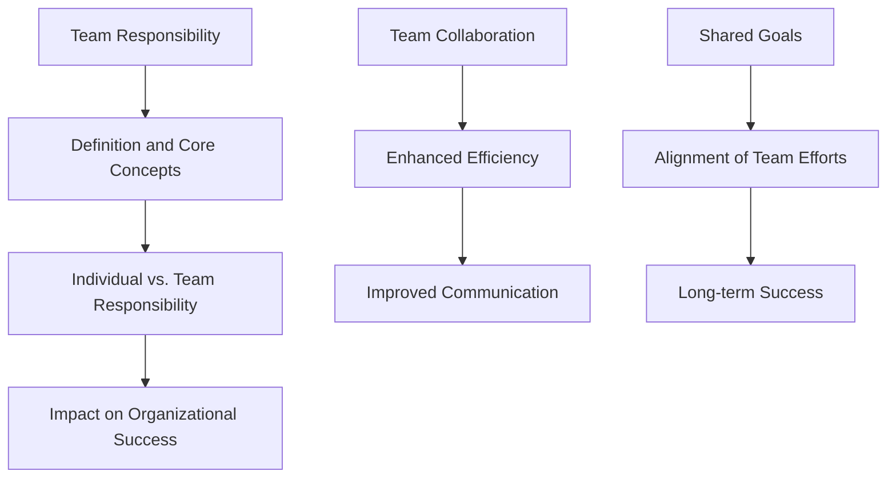
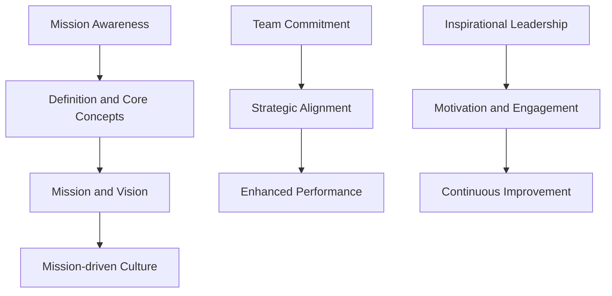

                 

### Step 1: Introduction to the Book

#### Chapter 1: Introduction to Team Responsibility and Mission Awareness

**1.1. The Importance of Team Responsibility**

**Core Concepts and Relationships Mermaid Diagram:**

**1.1.1. Definition and Core Concepts of Team Responsibility**

Team responsibility refers to the shared obligations and commitments that team members have towards each other, the team's objectives, and the organization. It is based on the principles of trust, accountability, and mutual respect. Team responsibility encompasses several core concepts, including:

- **Shared Goals:** Teams with a clear sense of responsibility work towards common objectives, aligning their efforts to achieve collective success.
- **Accountability:** Each team member is held accountable for their actions and the outcomes of their work, fostering a culture of personal and collective responsibility.
- **Communication:** Effective communication is essential for team responsibility. It ensures that all members are aware of their roles, expectations, and the overall goals of the team.
- **Collaboration:** Team responsibility encourages collaboration, where members support and assist each other in achieving their individual and collective objectives.

**1.1.2. The Role of Team Responsibility in Organizational Success**

Team responsibility plays a crucial role in the success of an organization. It contributes to several key aspects:

- **Enhanced Efficiency:** When team members take responsibility for their tasks and collaborate effectively, the overall efficiency of the team and organization improves. This leads to faster execution of projects and reduced delays.
- **Improved Communication:** Team responsibility fosters open and transparent communication among team members, minimizing misunderstandings and conflicts. This helps in building a cohesive team that works towards common goals.
- **Shared Goals:** A sense of responsibility encourages team members to align their efforts with the organization's goals, ensuring that everyone is working towards the same objectives.
- **Long-term Success:** Organizations that prioritize team responsibility are more likely to achieve long-term success. A responsible team is more adaptable to change, resilient to challenges, and capable of sustaining performance over time.

**1.1.3. Differences Between Individual and Team Responsibility**

While individual responsibility focuses on personal accountability and performance, team responsibility emphasizes collective efforts and mutual support. Here are some key differences:

- **Scope:** Individual responsibility is limited to the actions and outcomes of a single person, whereas team responsibility involves the collective actions and outcomes of the entire team.
- **Accountability:** In individual responsibility, accountability is primarily focused on the individual, whereas in team responsibility, accountability is shared among all team members.
- **Influence:** Individual responsibility influences the performance of a single person, while team responsibility influences the overall performance of the team and the organization.
- **Collaboration:** Team responsibility promotes collaboration and cooperation among team members, whereas individual responsibility may lead to a competitive environment.

**1.2. Understanding Team Mission Awareness**

**Core Concepts and Relationships Mermaid Diagram:**

**1.2.1. Definition and Core Concepts of Team Mission Awareness**

Team mission awareness refers to the understanding and recognition of the team's mission, vision, and strategic objectives. It involves the shared knowledge and commitment of team members towards the team's purpose and goals. Key concepts include:

- **Mission and Vision:** The mission defines the team's core purpose and reason for existence, while the vision outlines the desired future state and long-term goals.
- **Mission-driven Culture:** A mission-driven culture is one where team members are aligned with the team's mission and work towards achieving it. This culture fosters a sense of purpose and shared identity.
- **Team Commitment:** Team commitment refers to the dedication and loyalty of team members towards the team's mission and objectives. It is driven by a sense of ownership and accountability.
- **Strategic Alignment:** Strategic alignment ensures that the team's objectives and actions are in line with the organization's overall strategy. This alignment helps in optimizing resources and maximizing impact.

**1.2.2. The Relationship Between Mission Awareness and Team Responsibility**

Mission awareness and team responsibility are closely interconnected. A strong sense of mission awareness enhances team responsibility in several ways:

- **Shared Purpose:** A clear understanding of the team's mission creates a shared purpose, aligning individual responsibilities with the overall objectives of the team and organization.
- **Motivation and Engagement:** When team members are aware of the team's mission and its significance, they are more motivated and engaged in their work. This leads to increased commitment and a willingness to take responsibility for their tasks.
- **Accountability:** Mission awareness fosters a sense of accountability, as team members understand the impact of their actions on the team's success. This accountability encourages individuals to take ownership of their responsibilities and support their teammates.
- **Collaboration:** A shared mission promotes collaboration and cooperation among team members, as everyone understands the collective goals and works towards achieving them.

**1.2.3. Practical Significance of Team Mission Awareness**

Team mission awareness has practical significance in several areas:

- **Improved Decision-making:** When team members are aware of the team's mission, they can make decisions that align with the overall objectives, leading to more effective and efficient outcomes.
- **Enhanced Team Performance:** A sense of mission awareness enhances team performance by fostering a culture of collaboration, motivation, and accountability.
- **Increased Employee Engagement:** When employees are aware of the team's mission and its impact, they are more likely to feel engaged and motivated, leading to higher levels of productivity and job satisfaction.
- **Organizational Success:** Teams with a strong sense of mission awareness are more likely to achieve organizational success by aligning their efforts with the organization's strategic goals.

**1.3. Overview of the Book**

**1.3.1. Organizational Structure of the Book**

This book is organized into three main parts:

1. **Introduction to Team Responsibility and Mission Awareness:** This section provides an overview of team responsibility and mission awareness, their importance, and the differences between individual and team responsibility.
2. **Theoretical Foundations:** This section explores the theoretical frameworks and models that underpin team responsibility and mission awareness, including sociological, psychological, and organizational perspectives.
3. **Practical Strategies:** This section presents practical strategies for cultivating team responsibility and enhancing team mission awareness, including communication, leadership, and organizational culture.

**1.3.2. Target Readers and Benefits**

The target readers of this book are managers, team leaders, and anyone involved in managing teams. The book provides valuable insights and practical guidance for enhancing team responsibility and mission awareness, leading to improved team performance and organizational success.

- **Improved Team Performance:** Readers will learn strategies for enhancing team responsibility and mission awareness, leading to improved team performance and productivity.
- **Effective Leadership:** The book offers insights into effective leadership practices that foster team responsibility and mission awareness.
- **Organizational Success:** Readers will gain a deeper understanding of how team responsibility and mission awareness contribute to organizational success and how to cultivate these qualities within their teams.

**1.3.3. Structure and Key Ideas of Each Chapter**

- **Chapter 1:** Introduction to Team Responsibility and Mission Awareness
  - **Key Ideas:** Importance of team responsibility, differences between individual and team responsibility, understanding team mission awareness, practical significance of team mission awareness.
- **Chapter 2:** Theoretical Foundations of Team Responsibility Cultivation
  - **Key Ideas:** Theoretical frameworks for team responsibility, mission awareness, key theoretical models, and their implications.
- **Chapter 3:** Strategies for Enhancing Team Responsibility
  - **Key Ideas:** Communication strategies, leadership strategies, and organizational culture strategies for cultivating team responsibility.
- **Chapter 4:** Enhancing Team Mission Awareness
  - **Key Ideas:** Strategies for enhancing team mission awareness, the role of leadership in fostering mission awareness, and the impact of mission awareness on team performance.
- **Chapter 5:** Case Studies and Practical Applications
  - **Key Ideas:** Real-world case studies of organizations that have successfully cultivated team responsibility and mission awareness, practical applications of the strategies discussed in previous chapters.
- **Chapter 6:** Challenges and Solutions
  - **Key Ideas:** Common challenges faced in cultivating team responsibility and mission awareness, solutions and best practices for overcoming these challenges.
- **Chapter 7:** Future Directions and Conclusion
  - **Key Ideas:** Future research directions in team responsibility and mission awareness, summary of key findings, and implications for practice.

By following the structure and key ideas of each chapter, readers will gain a comprehensive understanding of team responsibility and mission awareness, enabling them to effectively cultivate these qualities within their teams and organizations.

