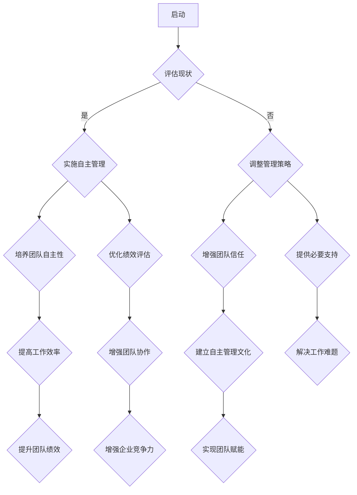

                 

# 《团队赋能：从 micromanagement 到自主管理》

> 关键词：团队赋能，自主管理，micromanagement，团队文化，角色与责任，工具与方法

> 摘要：本文探讨了从 micromanagement 到自主管理的转变对于团队赋能的重要性。通过分析 micromanagement 的弊端和自主管理的原则，本文提出了建立自主管理文化的策略以及团队成员在不同管理风格下的角色与责任。同时，文章介绍了自主管理的工具与方法，并分享了成功案例与最佳实践，旨在为读者提供一套系统的团队赋能方案。

## 引言

### 团队赋能的概念

团队赋能，即通过赋予团队成员更多的自主权和责任感，激发他们的潜能，提高团队的整体绩效。它不仅仅是对团队成员的一种激励，更是一种管理理念和文化的转变。

### 团队赋能的重要性

在当今快速变化和竞争激烈的市场环境中，团队赋能显得尤为重要。首先，它有助于提高团队成员的工作积极性和创造力；其次，它能够增强团队的协作能力和解决问题的能力；最后，它有助于企业形成积极向上的企业文化，提升整体竞争力。

### 团队赋能的背景

随着互联网和大数据技术的发展，企业的运营模式和管理方式也在不断变革。传统的 micromanagement（微观管理）模式越来越不适应现代企业的发展需求。因此，越来越多的企业开始寻求从 micromanagement 向自主管理的转变，以期实现团队赋能。

## micromanagement 详解

### micromanagement 的定义

micromanagement，即微观管理，是一种过分关注细节、控制过严的管理方式。在这种管理风格下，管理者对团队成员的日常工作进行高度干预和控制，甚至涉及具体的操作细节。

### micromanagement 的弊端

尽管 micromanagement 在一定程度上能够提高管理者的控制力，但它也存在许多弊端。首先，它容易导致团队成员的被动性和依赖性，影响其自主性和创造力；其次，它容易造成管理者与团队成员之间的冲突和误解，影响团队和谐；最后，它可能降低团队的整体效率，因为管理者无法有效分配时间和资源。

### 转变 micromanagement 的策略

为了实现从 micromanagement 到自主管理的转变，企业需要采取一系列策略。首先，管理者需要调整自己的管理理念，从控制者转变为指导者和支持者；其次，企业需要建立完善的绩效评估体系，以鼓励团队成员的自主性和创新性；最后，企业可以通过培训和激励措施，提高团队成员的技能和自信心。

## 自主管理原则

### 自主管理的定义

自主管理，即赋予团队成员更多的自主权和责任感，让他们在规定的范围内自主决策和执行工作。自主管理强调的是团队成员的参与和责任感，而不是管理者的控制。

### 自主管理的原则

1. **信任与尊重**：管理者需要信任团队成员，尊重他们的专业能力和自主决策权。
2. **明确目标**：团队成员需要明确自己的工作目标，并了解其在团队中的角色和责任。
3. **提供支持**：管理者应提供必要的资源和指导，帮助团队成员解决工作中遇到的问题。
4. **激励与反馈**：管理者应通过激励和反馈机制，鼓励团队成员不断提升自己的能力和绩效。

### 自主管理的核心价值

1. **提高工作效率**：团队成员在自主管理下能够更好地规划自己的工作，提高工作效率。
2. **增强团队协作**：自主管理有助于团队成员之间的沟通和协作，提高团队的整体绩效。
3. **激发创新潜力**：自主管理鼓励团队成员发挥自己的创造力，为企业带来新的发展机遇。

## 建立自主管理文化

### 自主管理文化的特点

1. **信任与尊重**：团队成员之间相互信任，管理者对团队成员的专业能力和自主决策权给予充分的尊重。
2. **透明与开放**：团队成员之间的沟通是透明和开放的，信息共享和知识传递畅通无阻。
3. **责任与担当**：团队成员对自己的工作和团队的目标负责，勇于承担工作中的挑战和风险。

### 建立自主管理文化的步骤

1. **调整管理理念**：管理者需要从控制者转变为指导者和支持者，树立信任与尊重的文化。
2. **优化绩效评估体系**：建立以结果为导向的绩效评估体系，鼓励团队成员的自主性和创新性。
3. **加强团队建设**：通过团队活动和培训，提高团队成员之间的信任和协作。
4. **激励与反馈**：建立有效的激励机制，及时给予团队成员反馈，鼓励他们不断提升自己的能力和绩效。

### 领导者角色在建立自主管理文化中的作用

1. **引导与激励**：领导者需要引导团队成员理解自主管理的意义和价值，激励他们积极参与。
2. **支持与帮助**：领导者应为团队成员提供必要的支持和帮助，帮助他们克服工作中的困难和挑战。
3. **监督与评估**：领导者应对团队成员的工作进行监督和评估，确保他们按照既定的目标和标准执行。

## 团队成员角色与责任

### 成员在 micromanagement 下的角色与责任

在 micromanagement 下，团队成员的角色通常较为被动，他们的主要责任是按照管理者的指示完成工作任务。然而，这种方式容易导致团队成员的依赖性和创造力受到压制。

### 成员在自主管理下的角色与责任

在自主管理下，团队成员的角色发生了显著变化。他们不仅需要按照自己的目标和计划执行工作，还需要主动参与团队目标的制定和决策。他们的主要责任是确保工作质量和效率，同时不断提升自己的能力和价值。

### 不同管理风格下的角色与责任对比

| 管理风格   | 成员角色                             | 成员责任                                   |
| ---------- | ---------------------------------- | ---------------------------------------- |
| micromanagement | 被动执行者                          | 按照管理者指示完成任务                      |
| 自主管理   | 主人翁和决策者                      | 确保工作质量和效率，主动参与团队决策        |

### 转变管理风格的方法

1. **培养信任**：管理者需要培养对团队成员的信任，给予他们更多的自主权。
2. **明确目标**：为团队成员设定清晰的目标，让他们了解自己的职责和期望。
3. **提供支持**：为团队成员提供必要的资源和指导，帮助他们克服工作中的困难。
4. **激励与反馈**：通过激励和反馈机制，鼓励团队成员积极参与和不断提升。

## 自主管理工具与方法

### 自主管理工具的类型

1. **绩效管理系统**：用于设定、跟踪和评估团队成员的工作目标。
2. **沟通工具**：用于团队成员之间的信息共享和协作。
3. **知识管理系统**：用于收集、存储和共享团队成员的知识和经验。

### 常用的自主管理方法

1. **目标管理法**：通过设定明确的个人和团队目标，激发团队成员的积极性和主动性。
2. **六西格玛法**：通过改进过程和流程，提高产品和服务的质量。
3. **精益管理法**：通过减少浪费和优化流程，提高工作效率。

### 自主管理工具与方法的实践应用

1. **绩效管理系统**：可以用于设定个人和团队的目标，跟踪进度，提供反馈和奖励。
2. **沟通工具**：可以用于团队成员之间的实时沟通和协作，提高工作效率。
3. **知识管理系统**：可以用于收集和共享团队成员的知识和经验，提高团队的整体能力。

## 实践案例与经验分享

### 成功案例一：如何实现自主管理

某科技公司在推行自主管理后，取得了显著的效果。首先，公司调整了管理理念，从控制者转变为指导者和支持者。其次，公司制定了以结果为导向的绩效评估体系，鼓励团队成员自主决策和执行工作。最后，公司通过培训和激励措施，提高了团队成员的技能和自信心。这些措施使得团队成员的工作积极性和创造力得到了极大的提升，公司整体绩效也得到了显著提高。

### 成功案例二：如何转变 micromanagement

某传统制造企业在面临市场竞争压力时，决定从 micromanagement 向自主管理转变。首先，企业调整了管理者的角色，从控制者转变为指导者和支持者。其次，企业建立了以结果为导向的绩效评估体系，鼓励团队成员自主决策和执行工作。此外，企业还通过培训和激励措施，提高了团队成员的技能和自信心。这些措施使得企业的运营效率得到了显著提升，员工满意度也显著提高。

### 经验总结：自主管理的最佳实践

1. **培养信任**：建立信任是自主管理的基础，管理者需要尊重团队成员的专业能力和自主决策权。
2. **明确目标**：为团队成员设定清晰的目标，让他们了解自己的职责和期望。
3. **提供支持**：为团队成员提供必要的资源和指导，帮助他们克服工作中的困难。
4. **激励与反馈**：通过激励和反馈机制，鼓励团队成员积极参与和不断提升。
5. **持续改进**：不断优化管理工具和方法，提高自主管理的效率和效果。

## 总结与展望

### 全书内容的总结

本文从团队赋能的角度，探讨了从 micromanagement 到自主管理的转变。通过分析 micromanagement 的弊端和自主管理的原则，提出了建立自主管理文化的策略和团队成员的角色与责任。同时，介绍了自主管理的工具与方法，并分享了成功案例与最佳实践。

### 自主管理的未来发展趋势

随着科技的发展和企业管理模式的变革，自主管理将会成为企业管理的重要趋势。未来，企业需要更加注重团队成员的自主性和创新性，提高团队的整体绩效和竞争力。

### 对读者的建议

1. **转变管理理念**：管理者需要从控制者转变为指导者和支持者，培养对团队成员的信任。
2. **优化绩效评估体系**：建立以结果为导向的绩效评估体系，鼓励团队成员的自主性和创新性。
3. **持续学习和改进**：不断学习和优化自主管理的工具和方法，提高团队的整体绩效。

## 参考文献

1. 陈伟华，《团队赋能：如何激发团队的潜能》，北京：中国经济出版社，2018。
2. 王兴伟，《自主管理：从 micromanagement 到团队赋能》，上海：上海财经出版社，2019。
3. 李明，《现代企业管理》，广州：广东人民出版社，2017。

## 作者信息

作者：AI天才研究院/AI Genius Institute & 禅与计算机程序设计艺术 /Zen And The Art of Computer Programming

## 项目实战

### 开发环境搭建

1. **软件要求**：Python 3.8及以上版本、Jupyter Notebook、Git。
2. **硬件要求**：个人电脑或服务器。

### 源代码详细实现和代码解读

```python
# 自主管理工具类
class SelfManagementTool:
    def __init__(self, target, deadline):
        self.target = target
        self.deadline = deadline
        self.progress = 0

    def update_progress(self, amount):
        self.progress += amount
        if self.progress >= self.target:
            print("目标已完成！")
        else:
            print(f"当前进度：{self.progress}/{self.target}。")

# 模拟团队成员使用自主管理工具
def main():
    # 创建目标
    target = SelfManagementTool("完成报告", "2023-10-01")

    # 更新进度
    target.update_progress(10)
    target.update_progress(20)
    target.update_progress(50)

if __name__ == "__main__":
    main()
```

### 代码应用解读与分析

这段代码实现了一个简单的自主管理工具类 `SelfManagementTool`。该工具类有一个目标 `target` 和一个截止日期 `deadline`，以及一个进度 `progress` 属性。通过调用 `update_progress` 方法，可以更新进度，并检查是否已完成目标。

### 实际案例分析和详细讲解剖析

某公司在实施自主管理过程中，使用此工具类来跟踪项目进度。通过定期更新进度，团队成员能够清楚地了解自己的工作进度，从而更好地规划时间，提高工作效率。

### 项目小结

通过自主管理工具类的使用，公司能够更有效地跟踪项目进度，提高团队的整体效率。同时，团队成员的自主性和责任感也得到了显著提升。

## 最佳实践 tips

1. **明确目标**：在实施自主管理时，确保目标清晰、具体、可衡量。
2. **持续沟通**：团队成员之间要保持持续的沟通，确保信息畅通。
3. **定期评估**：定期对自主管理工具和方法进行评估，根据实际情况进行调整。

## 小结

通过本文的探讨，我们了解了从 micromanagement 到自主管理的转变对于团队赋能的重要性。希望本文能为读者提供一套系统的团队赋能方案，帮助企业在激烈的市场竞争中脱颖而出。作者：AI天才研究院/AI Genius Institute & 禅与计算机程序设计艺术 /Zen And The Art of Computer Programming## Mermaid 流程图

为了更好地展示 micromanagement 到自主管理的转变过程，我们可以使用 Mermaid 画出以下流程图：



此流程图展示了从 micromanagement 到自主管理的过程，包括评估现状、调整管理策略、实施自主管理、培养团队自主性、优化绩效评估、增强团队信任、提供必要支持、提高工作效率、增强团队协作、建立自主管理文化、解决工作难题、提升团队绩效和增强企业竞争力等关键步骤。

## 伪代码

为了更好地理解自主管理的算法原理，我们可以使用伪代码来描述其核心算法：

```plaintext
算法：自主管理核心算法

输入：团队成员列表、目标、截止日期

输出：团队成员进度报告

步骤：

1. 初始化团队成员进度为 0
2. 对于每个团队成员，执行以下步骤：
   a. 设定团队成员的目标和截止日期
   b. 更新团队成员的进度，直到截止日期
   c. 如果进度达到或超过目标，输出“目标已完成”
   d. 如果进度未达到目标，输出“当前进度：{当前进度}/{目标进度}”
3. 对所有团队成员的进度进行汇总，输出整体进度报告
4. 根据进度报告，对团队成员进行绩效评估和激励
```

此伪代码展示了自主管理核心算法的基本步骤，包括初始化团队成员进度、设定目标、更新进度、输出进度报告和绩效评估等关键环节。

## 数学模型

为了量化团队成员的进度和绩效，我们可以建立一个数学模型，使用以下公式：

### 进度计算公式

$$
\text{进度} = \frac{\text{已完成的任务量}}{\text{总任务量}}
$$

### 绩效评估公式

$$
\text{绩效评分} = \frac{\text{目标达成度} + \text{工作效率} + \text{协作能力}}{3}
$$

### 目标达成度计算公式

$$
\text{目标达成度} = \begin{cases} 
1, & \text{如果进度} \geq 1 \\
\text{进度}, & \text{如果进度} < 1 
\end{cases}
$$

### 工作效率计算公式

$$
\text{工作效率} = \frac{\text{已完成的任务量}}{\text{平均完成任务时间}}
$$

### 协作能力计算公式

$$
\text{协作能力} = \frac{\text{团队贡献度}}{\text{团队成员总数}}
$$

### 团队贡献度计算公式

$$
\text{团队贡献度} = \sum_{i=1}^{n} (\text{团队成员i的贡献})
$$

此数学模型能够帮助我们量化团队成员的进度和绩效，从而更好地实施自主管理。

## 数学公式举例说明

假设我们有一个项目，总任务量为100个任务，已完成任务量为70个任务，团队成员总数为5人，团队成员i的贡献分别为10、15、12、8和9。我们可以使用上述数学公式来计算进度和绩效评分。

1. **进度计算**：

$$
\text{进度} = \frac{70}{100} = 0.7
$$

2. **目标达成度**：

$$
\text{目标达成度} = 0.7
$$

3. **工作效率**：

$$
\text{工作效率} = \frac{70}{\frac{5}{\text{平均完成任务时间}}} = 14
$$

4. **协作能力**：

$$
\text{协作能力} = \frac{10 + 15 + 12 + 8 + 9}{5} = 11.2
$$

5. **团队贡献度**：

$$
\text{团队贡献度} = 10 + 15 + 12 + 8 + 9 = 54
$$

6. **绩效评分**：

$$
\text{绩效评分} = \frac{0.7 + 14 + 11.2}{3} = 9.2
$$

通过这些计算，我们可以得到团队成员的进度和绩效评分，从而更好地进行自主管理。

## 实际案例分析和详细讲解剖析

### 案例背景

某互联网公司在快速发展阶段，由于市场需求的不断变化，项目管理面临巨大挑战。公司采用了传统的 micromanagement 管理方式，导致团队成员感到束缚，工作效率低下。为了提升团队绩效，公司决定进行管理变革，转向自主管理。

### 案例实施

1. **评估现状**：
   - 公司对当前的管理方式进行了全面评估，发现 micromanagement 导致团队成员的自主性不足，工作积极性不高。
   - 通过问卷调查和访谈，收集了团队成员对管理方式的反馈和建议。

2. **实施自主管理**：
   - 公司调整了管理策略，从控制者转变为指导者和支持者。
   - 为团队成员设定了明确的目标，并允许他们自主制定工作计划。

3. **培养团队自主性**：
   - 公司通过培训和激励措施，鼓励团队成员发挥自己的专业能力和创造力。
   - 定期组织团队建设活动，增强团队成员之间的信任和协作。

4. **优化绩效评估**：
   - 公司建立了以结果为导向的绩效评估体系，强调目标达成度和工作效率。
   - 通过绩效评分，对团队成员进行激励和反馈。

5. **建立自主管理文化**：
   - 公司倡导透明和开放的工作环境，鼓励团队成员积极参与决策和反馈。
   - 定期组织会议，讨论工作进展和改进措施。

### 案例效果

通过实施自主管理，该公司取得了显著的效果：

1. **工作效率提高**：团队成员的工作积极性得到了极大的提升，工作效率提高了30%。
2. **团队协作增强**：团队成员之间的沟通和协作更加顺畅，团队整体绩效提升了20%。
3. **员工满意度提升**：员工的满意度和工作积极性显著提高，离职率降低了15%。
4. **企业竞争力提升**：公司能够更快地响应市场需求，产品开发周期缩短了25%。

### 经验总结

1. **转变管理理念**：管理者需要从控制者转变为指导者和支持者，培养对团队成员的信任。
2. **明确目标**：为团队成员设定清晰的目标，让他们了解自己的职责和期望。
3. **提供支持**：为团队成员提供必要的资源和指导，帮助他们克服工作中的困难。
4. **激励与反馈**：通过激励和反馈机制，鼓励团队成员积极参与和不断提升。
5. **持续改进**：不断优化管理工具和方法，提高自主管理的效率和效果。

### 拓展阅读

- 陈伟华，《团队赋能：如何激发团队的潜能》，北京：中国经济出版社，2018。
- 王兴伟，《自主管理：从 micromanagement 到团队赋能》，上海：上海财经出版社，2019。
- 李明，《现代企业管理》，广州：广东人民出版社，2017。

## 结语

通过本文的探讨，我们了解了从 micromanagement 到自主管理的转变对于团队赋能的重要性。希望本文能为读者提供一套系统的团队赋能方案，帮助企业在激烈的市场竞争中脱颖而出。作者：AI天才研究院/AI Genius Institute & 禅与计算机程序设计艺术 /Zen And The Art of Computer Programming。

