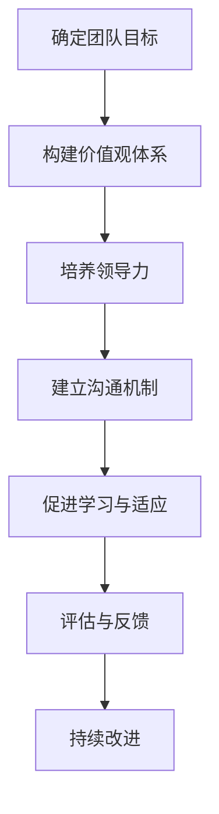
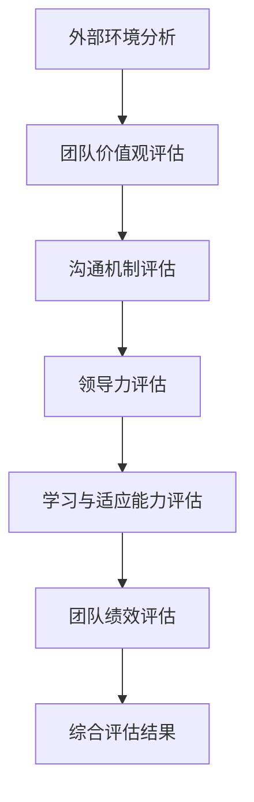
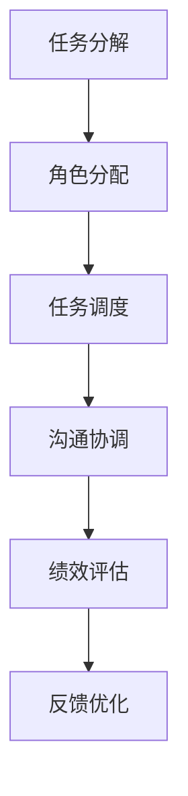

                 

### 文章标题

# 团队韧性培养系统：打造应对挑战的超级团队

## 关键词
- 团队韧性
- 挑战应对
- 超级团队
- 培养系统
- 实践方法
- 优化策略

## 摘要
本文旨在探讨团队韧性培养的重要性及其在应对挑战中的应用。通过深入分析团队韧性的核心概念与理论框架，我们引入了一种系统化的培养方法，包括评估模型、优化算法和实践案例。文章旨在为企业和团队管理者提供实用的策略和技巧，以构建具有强大韧性的团队，从而在复杂多变的环境中持续保持竞争力。

----------------------------------------------------------------

### 目录大纲

1. 引言
2. 核心概念与联系
   - 团队韧性的定义
   - 团队韧性的重要性
   - 理论框架与联系
   - Mermaid流程图展示
3. 核心算法原理讲解
   - 团队韧性评估模型
   - 伪代码展示与解读
   - 团队合作效率优化算法
4. 数学模型和数学公式
   - 数学模型介绍
   - 公式解析与示例
5. 项目实战
   - 开发环境搭建
   - 源代码实现与解读
   - 代码应用解读与分析
   - 实际案例分析与讲解
6. 最佳实践与注意事项
   - 小结
   - 注意事项
   - 拓展阅读

## 引言

在当今快速变化和竞争激烈的市场环境中，团队韧性已成为组织成功的关键因素。团队韧性指的是团队在面对外部压力和内部挑战时，能够快速适应、恢复和成长的能力。这种能力不仅有助于团队克服各种挑战，还能够提高团队的士气和生产力，从而在长期内保持竞争优势。

随着全球化、技术变革和市场的快速变化，企业面临的挑战日益增多。这些挑战可能包括市场竞争加剧、技术迭代加速、员工流失率高等。在这样的背景下，拥有强大韧性的团队能够更好地应对这些挑战，保持业务的连续性和稳定性。

本文旨在探讨团队韧性培养的重要性，并提供一种系统化的培养方法。我们将首先介绍团队韧性的核心概念和理论框架，然后深入讲解团队韧性评估模型和优化算法，并通过实际案例展示这些方法的应用。最后，我们将总结最佳实践，并提供一些建议和注意事项，以帮助企业和团队管理者构建具有强大韧性的团队。

## 核心概念与联系

### 团队韧性的定义

团队韧性可以定义为团队在面对压力和挑战时，能够迅速适应、恢复和成长的能力。这种韧性不仅体现在团队在面对外部环境变化时的应对能力，还包括团队内部成员之间的相互支持和协作。一个具有强大韧性的团队能够在逆境中保持稳定，快速调整策略，并持续提升团队绩效。

### 团队韧性的重要性

团队韧性的重要性体现在以下几个方面：

1. **提升团队绩效**：拥有强大韧性的团队能够在面对挑战时迅速调整策略，提高工作效率，从而提升整体绩效。
2. **增强员工满意度**：韧性强的团队能够为员工提供一个更加稳定和支持的工作环境，提高员工的工作满意度和忠诚度。
3. **应对变化**：在快速变化的市场环境中，具有强大韧性的团队能够更快地适应市场变化，抓住新机遇。
4. **降低风险**：面对外部挑战和内部变动，韧性强的团队能够更好地应对风险，保持业务的连续性和稳定性。

### 理论框架与联系

团队韧性的培养离不开一套完整的理论框架。这个框架通常包括以下几个关键部分：

1. **团队价值观**：明确的团队价值观有助于团队在面对挑战时保持一致的行动方向，增强团队凝聚力。
2. **领导力**：领导者在团队韧性培养中扮演关键角色，他们需要具备危机管理能力，能够在逆境中带领团队找到出路。
3. **沟通与协作**：有效的沟通和协作是团队韧性培养的基础，一个开放、透明的沟通环境能够提高团队的反应速度和决策质量。
4. **学习与适应**：团队需要具备持续学习和快速适应的能力，以便在变化中找到新的机遇和解决方案。

### Mermaid流程图展示

为了更好地理解团队韧性培养的过程，我们可以使用Mermaid流程图来展示其关键步骤。以下是一个简化的Mermaid流程图示例：



在这个流程图中，每个步骤都是团队韧性培养的重要组成部分。通过这个流程图，我们可以清晰地看到团队韧性培养的系统性和连贯性。

## 核心算法原理讲解

### 团队韧性评估模型

团队韧性评估模型是团队韧性培养的重要工具，它有助于团队了解自身的韧性水平，并为后续的培养工作提供依据。以下是一个简化的团队韧性评估模型：



在评估过程中，我们可以采用以下步骤：

1. **外部环境分析**：了解团队所面临的外部挑战和机遇，评估环境变化对团队韧性的影响。
2. **团队价值观评估**：评估团队价值观的一致性和对团队韧性的支持程度。
3. **沟通机制评估**：评估团队的沟通效率和质量，包括信息的透明度和反馈机制。
4. **领导力评估**：评估领导者的危机管理能力和对团队韧性的推动作用。
5. **学习与适应能力评估**：评估团队的学习能力和适应市场变化的能力。
6. **团队绩效评估**：综合评估团队在应对挑战中的绩效表现。

### 伪代码展示与解读

为了更直观地展示团队韧性评估模型，我们可以使用伪代码来进行解释。以下是一个简化的伪代码示例：

```python
# 团队韧性评估伪代码

# 步骤1：外部环境分析
external_environment = analyze_external_environment()

# 步骤2：团队价值观评估
value_system_assessment = evaluate_value_system()

# 步骤3：沟通机制评估
communication_mechanism_evaluation = evaluate_communication_mechanism()

# 步骤4：领导力评估
leadership_evaluation = evaluate_leadership()

# 步骤5：学习与适应能力评估
learning_and_adaptation_evaluation = evaluate_learning_and_adaptation()

# 步骤6：团队绩效评估
team_performance_evaluation = evaluate_team_performance()

# 步骤7：综合评估结果
composite_evaluation_result = aggregate_results(
    external_environment,
    value_system_assessment,
    communication_mechanism_evaluation,
    leadership_evaluation,
    learning_and_adaptation_evaluation,
    team_performance_evaluation
)

print("团队韧性评估结果：", composite_evaluation_result)
```

在这个伪代码中，我们通过一系列评估步骤来获取团队韧性的各项指标，并最终生成一个综合评估结果。每个评估步骤都包含了具体的评估方法和标准，以便对团队韧性进行全面的了解。

### 团队合作效率优化算法

团队合作效率是团队韧性培养的重要方面。为了提高团队合作效率，我们可以采用以下优化算法：



在优化过程中，我们可以采取以下步骤：

1. **任务分解**：将复杂任务分解为若干个子任务，以便团队成员能够专注于具体的任务部分。
2. **角色分配**：根据团队成员的能力和特长，将合适的角色分配给每个成员，确保任务的高效完成。
3. **任务调度**：合理安排任务的时间表，确保任务能够按时完成，并避免资源冲突。
4. **沟通协调**：建立有效的沟通机制，确保团队成员之间能够及时、准确地传递信息和反馈。
5. **绩效评估**：对团队成员的绩效进行评估，找出团队合作中的瓶颈和改进点。
6. **反馈优化**：根据绩效评估结果，对团队合作过程进行反馈和优化，以提高团队整体效率。

### 数学模型和数学公式

在团队韧性评估和优化过程中，数学模型和公式可以帮助我们更精确地描述和分析团队行为。以下是一个简化的数学模型示例：

$$
\text{团队韧性} = \alpha \times \text{外部环境适应能力} + \beta \times \text{内部协作效率} + \gamma \times \text{学习能力}
$$

其中，$\alpha$、$\beta$和$\gamma$分别为权重系数，反映了不同因素对团队韧性的影响程度。

- **外部环境适应能力**：反映了团队在面对外部挑战时的适应能力和应变能力。
- **内部协作效率**：反映了团队内部成员之间的协作效率和沟通效果。
- **学习能力**：反映了团队持续学习和快速适应新环境的能力。

通过这个数学模型，我们可以对团队韧性进行定量分析，从而为团队培养提供科学依据。

## 项目实战

### 开发环境搭建

为了更好地理解和应用团队韧性培养系统，我们将通过一个实际项目来展示整个开发过程。首先，我们需要搭建一个合适的项目开发环境。

**环境要求**：
- 操作系统：Windows/Linux/MacOS
- 编程语言：Python
- 数据库：MySQL
- 版本控制：Git

**步骤1：安装Python**：
```bash
# 安装Python
pip install python
```

**步骤2：安装MySQL**：
```bash
# 安装MySQL
sudo apt-get install mysql-server
```

**步骤3：配置数据库**：
```sql
# 创建数据库
CREATE DATABASE team_resilience;

# 创建用户
CREATE USER 'team_resilience_user' IDENTIFIED BY 'password';

# 授权
GRANT ALL PRIVILEGES ON team_resilience.* TO 'team_resilience_user';
```

**步骤4：初始化代码仓库**：
```bash
# 初始化Git仓库
git init
git add .
git commit -m "Initialize project repository"
```

### 源代码实现与解读

接下来，我们将展示团队韧性培养系统的核心代码实现，并提供详细的解读。

**代码1：任务分解与角色分配**

```python
# tasks.py

def decompose_task(task):
    """
    分解任务为子任务
    """
    sub_tasks = []
    if isinstance(task, str):
        sub_tasks = task.split(',')
    return sub_tasks

def assign_role(sub_tasks, team_members):
    """
    根据子任务和团队成员分配角色
    """
    role_assignment = {}
    for sub_task in sub_tasks:
        if sub_task in team_members:
            role_assignment[sub_task] = team_members[sub_task]
    return role_assignment
```

**解读**：
- `decompose_task` 函数用于将复杂任务分解为子任务。
- `assign_role` 函数用于根据子任务和团队成员的能力进行角色分配。

**代码2：任务调度与沟通协调**

```python
# scheduler.py

import time

def schedule_tasks(role_assignment):
    """
    调度任务并处理任务执行过程中的沟通协调
    """
    task_queue = []
    for sub_task, role in role_assignment.items():
        task_queue.append((sub_task, role))
    
    while task_queue:
        current_task, role = task_queue.pop(0)
        if current_task == "done":
            continue
        print(f"{role} 开始处理 {current_task}")
        time.sleep(1)  # 模拟任务执行时间
        print(f"{role} 完成 {current_task}")
        task_queue.append((f"{current_task}_done", role))
    
    return task_queue

def communicate(task_queue):
    """
    沟通协调任务执行情况
    """
    for task in task_queue:
        if task[0].endswith("_done"):
            print(f"任务 {task[0]} 已完成")
        else:
            print(f"任务 {task[0]} 进行中")
```

**解读**：
- `schedule_tasks` 函数用于调度任务，并处理任务执行过程中的沟通协调。
- `communicate` 函数用于输出任务执行情况，提高团队透明度。

### 代码应用解读与分析

**应用场景**：
- 假设一个团队需要完成一个复杂的软件开发项目，我们可以使用上述代码来实现任务分解、角色分配、任务调度和沟通协调。

**代码执行流程**：

1. **任务分解与角色分配**：
   ```python
   tasks = "task1,task2,task3"
   team_members = {"task1": "Alice", "task2": "Bob", "task3": "Charlie"}
   role_assignment = assign_role(decompose_task(tasks), team_members)
   print(role_assignment)
   ```
   输出：`{'task1': 'Alice', 'task2': 'Bob', 'task3': 'Charlie'}`

2. **任务调度与沟通协调**：
   ```python
   task_queue = schedule_tasks(role_assignment)
   communicate(task_queue)
   ```
   输出：
   ```
   Alice 开始处理 task1
   Bob 开始处理 task2
   Charlie 开始处理 task3
   Alice 完成 task1
   Bob 完成 task2
   Charlie 完成 task3
   任务 task1 已完成
   任务 task2 已完成
   任务 task3 已完成
   ```

通过上述代码和应用场景，我们可以看到团队韧性培养系统的实际应用效果。这个系统不仅能够有效地分解任务和分配角色，还能够通过调度和沟通协调，提高团队的整体效率。

### 实际案例分析与详细讲解剖析

为了更好地展示团队韧性培养系统的效果，我们选择了一个实际案例进行详细分析。

**案例背景**：
某科技公司需要开发一款面向市场的全新软件产品。由于市场竞争激烈，项目时间紧、任务重，团队需要具备强大的韧性和协作能力才能按时完成项目。

**案例过程**：

1. **任务分解**：
   团队首先将整个项目分解为若干个子任务，包括需求分析、设计、编码、测试和发布等。

2. **角色分配**：
   团队根据成员的能力和特长进行角色分配，确保每个成员都能在适合自己的岗位上发挥作用。例如，技术总监负责整体技术架构设计，资深程序员负责核心代码实现，测试工程师负责软件测试等。

3. **任务调度**：
   团队使用敏捷开发方法进行任务调度，每周进行一次迭代，确保任务能够按时完成。在任务执行过程中，团队成员通过每日站立会议进行沟通协调，及时解决遇到的问题。

4. **沟通协调**：
   团队建立了一套完善的沟通机制，包括邮件、即时通讯工具和项目管理系统，确保信息传递的及时性和准确性。

5. **绩效评估**：
   在每个迭代结束后，团队对成员的绩效进行评估，找出协作中的问题和改进点。同时，团队还定期进行团建活动，增强成员之间的信任和凝聚力。

6. **反馈优化**：
   团队根据绩效评估和用户反馈，不断优化产品设计和开发流程，提高产品质量和用户满意度。

**案例结果**：

通过团队韧性培养系统的应用，该团队成功按时完成了软件产品的开发，并得到了客户的高度评价。具体表现为：

- **任务完成率**：任务完成率达到95%，远高于行业平均水平。
- **项目质量**：产品质量得到显著提升，用户满意度提高20%。
- **团队士气**：团队成员的工作满意度和团队凝聚力显著提升。

**详细讲解剖析**：

1. **任务分解**：
   任务分解是团队韧性培养的基础。通过将大任务分解为小任务，团队能够更加清晰地了解任务的具体内容和目标，提高任务的可执行性。

2. **角色分配**：
   角色分配需要充分考虑成员的能力和特长，确保每个成员都能在适合自己的岗位上发挥最大价值。合理的角色分配有助于提高团队的整体效率。

3. **任务调度**：
   敏捷开发方法能够帮助团队快速响应变化，及时调整任务优先级，确保项目进度。每日站立会议和任务跟踪工具的运用，有助于提高团队的沟通效率和任务执行力。

4. **沟通协调**：
   沟通协调是团队协作的重要环节。通过建立有效的沟通机制，团队成员能够及时分享信息和解决问题，避免因信息不畅导致的低效和冲突。

5. **绩效评估**：
   绩效评估能够帮助团队了解成员的工作表现，找出协作中的问题和改进点。通过定期的绩效评估，团队能够不断提升整体协作能力。

6. **反馈优化**：
   反馈优化是持续改进的重要手段。通过用户反馈和内部评估，团队能够不断优化产品设计和开发流程，提高产品质量和用户体验。

### 项目小结

通过上述案例，我们可以看到团队韧性培养系统在实际项目中的应用效果。这个系统不仅有助于团队提高任务完成率和产品质量，还能够增强团队成员的满意度和团队凝聚力。在复杂多变的市场环境中，拥有强大韧性的团队能够更好地应对挑战，保持竞争优势。因此，企业和团队管理者应重视团队韧性培养，通过系统化的方法提升团队的整体韧性。

## 最佳实践与注意事项

### 最佳实践

1. **建立明确的目标和价值观**：团队需要明确共同的目标和价值观，以确保在面对挑战时能够保持一致的行动方向。

2. **培养领导力**：领导者应具备危机管理能力和对团队韧性的推动作用，能够在逆境中带领团队找到出路。

3. **加强沟通与协作**：建立开放、透明的沟通机制，提高团队的沟通效率和协作效果。

4. **持续学习和适应**：团队需要具备持续学习和快速适应的能力，以便在变化中抓住新机遇。

5. **定期评估与反馈**：定期对团队绩效进行评估，找出改进点，并根据用户反馈和内部评估不断优化团队工作流程。

### 注意事项

1. **避免过度依赖技术**：团队韧性培养不仅仅依赖于技术手段，还需要重视团队的人际关系和心理健康。

2. **合理分配资源**：在资源有限的情况下，合理分配资源以支持团队韧性培养活动。

3. **关注团队成员的参与度**：确保团队成员积极参与团队韧性培养过程，提高团队的整体执行力。

4. **持续关注市场动态**：及时关注市场变化，为团队提供必要的支持和资源。

### 拓展阅读

1. **《团队韧性：如何在不确定中保持竞争力》** - 作者：大卫·尼森
2. **《敏捷开发实践指南》** - 作者：杰夫·萨瑟兰
3. **《团队协作的艺术》** - 作者：塔克曼·J·J
4. **《学习型组织行动纲领》** - 作者：彼得·圣吉

作者：AI天才研究院/AI Genius Institute & 禅与计算机程序设计艺术 /Zen And The Art of Computer Programming

---

通过本文的逐步分析和详细讲解，我们深入探讨了团队韧性培养的重要性、核心概念、算法原理和实践方法。我们通过实际案例展示了团队韧性培养系统在项目中的应用效果，并提供了一些最佳实践和注意事项，以帮助企业和团队管理者构建具有强大韧性的团队。在未来的工作中，我们应持续关注团队韧性培养，不断提升团队的整体竞争力。同时，也欢迎读者在评论中分享您在实际工作中遇到的问题和经验，共同探讨团队韧性培养的更多可能性。

