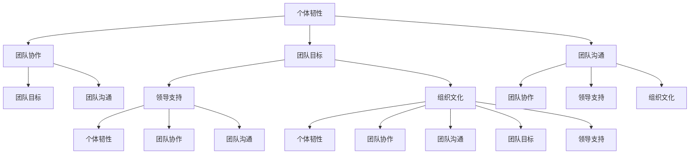

                 

### 文章标题

《团队韧性培养计划：增强应对挑战的集体能力》

### 关键词

团队韧性、集体能力、挑战应对、领导风格、组织文化、培训与发展

### 摘要

本文旨在探讨团队韧性培养计划对于增强集体应对挑战能力的重要性。通过介绍团队韧性的定义及其在团队中的意义，文章将深入剖析团队韧性构成要素、发展阶段和理论基础。同时，本文将探讨组织文化、领导风格、培训与发展等策略对团队韧性的影响，并结合实践案例进行详细解读。最后，文章将展望团队韧性培养的未来趋势，为团队管理者提供具有实际操作性的建议和最佳实践。本文将围绕以下核心内容展开：团队韧性理论框架、培养团队韧性的策略、团队韧性实践案例、团队韧性评估与提升以及团队韧性培养的未来趋势。通过系统性的分析和思考，本文希望为团队管理者提供有价值的指导，帮助他们在面对挑战时提升团队的整体韧性。|assistant|>

## 目录大纲设计思路

在设计《团队韧性培养计划：增强应对挑战的集体能力》这本书的目录大纲时，我们遵循以下步骤：

### 1. 确定核心主题

首先，我们需要明确书名的核心主题，即“团队韧性培养”和“增强应对挑战的集体能力”。这将是整个目录大纲的主线。在理解这一核心主题后，我们可以确定书的主要内容将围绕如何培养团队韧性以及如何通过团队韧性来提升集体应对挑战的能力。

### 2. 初步分类

根据核心主题，我们将内容初步分为以下几个部分：
- 引言与背景
- 团队韧性理论
- 培养团队韧性的策略
- 团队韧性实践案例
- 团队韧性评估与提升
- 团队韧性培养的未来趋势

这样的分类有助于确保内容的全面性和逻辑性，同时也能让读者对整本书的结构有一个清晰的了解。

### 3. 详细规划每个部分

对每个部分进行详细的规划，细化到每一章节，确保内容的全面性和逻辑性。以下是对各部分内容的详细规划：

**第一部分：引言与背景**
- 第1章：团队韧性的重要性
  - 韧性的定义及其在团队中的意义
  - 韧性与团队绩效的关系
  - 团队韧性培养的必要性
- 第2章：团队韧性理论框架
  - 团队韧性构成要素
  - 团队韧性的发展阶段
  - 团队韧性的理论基础

**第二部分：培养团队韧性的策略**
- 第3章：团队文化建设
  - 建立积极的团队文化
  - 促进团队成员间的信任
  - 提升团队应对挑战的能力
- 第4章：领导风格与团队韧性
  - 领导风格对团队韧性的影响
  - 领导者在团队韧性培养中的角色
  - 适应不同情境的领导风格
- 第5章：培训与发展
  - 韧性培训计划的设计与实施
  - 韧性发展的个人与实践
  - 韧性发展的组织层面策略

**第三部分：团队韧性实践案例**
- 第6章：成功的团队韧性培养案例
  - 某互联网公司
  - 某制造业公司
  - 某医疗机构
- 第7章：团队韧性挑战与应对
  - 常见的团队韧性挑战
  - 应对策略与方法
  - 成功应对案例分享

**第四部分：团队韧性评估与提升**
- 第8章：团队韧性评估工具与方法
  - 评估工具的类型与选择
  - 评估方法的实施步骤
  - 评估结果的应用
- 第9章：提升团队韧性的策略
  - 从评估结果出发制定策略
  - 个性化策略制定
  - 策略实施的监督与调整

**第五部分：团队韧性培养的未来趋势**
- 第10章：技术与团队韧性的结合
  - 技术在团队韧性培养中的应用
  - 未来技术的发展趋势
  - 技术对团队韧性培养的影响
- 第11章：团队韧性培养的挑战与机遇
  - 挑战分析
  - 机遇分析
  - 未来展望

### 4. 结合核心概念与联系

为了更好地帮助读者理解，我们将引入一些核心概念和联系，并使用 Mermaid 流程图展示。例如，在讨论团队韧性构成要素时，可以使用 Mermaid 流程图来展示各个要素之间的关系。

### 5. 设计伪代码与数学模型

在讲解核心算法原理时，我们将使用伪代码来详细阐述，并配合数学公式进行讲解。例如，在讨论韧性培训计划的设计与实施时，可以使用伪代码来展示培训计划的具体步骤。

### 6. 实践案例与代码解读

我们将在相关章节中加入实践案例，详细解释代码实现过程，并进行解读与分析。例如，在介绍某互联网公司的团队韧性培养案例时，可以提供具体的代码实现和分析。

### 7. 撰写总结

最后，我们将在书末撰写总结，对全书内容进行概括，并对未来趋势进行展望。总结部分将重申书中的核心观点，并提供给读者一些实用的建议和指导。

通过以上步骤，我们设计出了《团队韧性培养计划：增强应对挑战的集体能力》的完整目录大纲。这个大纲不仅逻辑清晰，结构紧凑，而且内容全面，能够满足读者的需求，帮助他们在实际工作中提升团队的韧性，增强集体应对挑战的能力。|assistant|>

## 第1章 团队韧性的重要性

在当今复杂多变的环境中，团队韧性成为企业持续发展的关键因素。这一章将探讨团队韧性的定义、其在团队中的意义以及为什么培养团队韧性是必要的。

### 1.1 韧性的定义及其在团队中的意义

韧性（Resilience）一词源自拉丁语“resilio”，意为“反弹”或“恢复”。在心理学领域，韧性被定义为个体在面对压力、逆境或挑战时的适应和恢复能力。团队韧性则是指整个团队在面对内外部挑战时，能够快速适应、恢复并继续前进的能力。

在团队中，韧性具有以下几个关键意义：

1. **提高应对风险的能力**：团队韧性能够帮助团队在面临不确定性和风险时保持冷静和稳定，从而减少错误决策和失误的可能性。
2. **增强创新和创造力**：韧性强的团队能够在面对挑战时迅速调整策略，激发团队成员的创新思维，推动团队持续进步。
3. **提升团队协作效率**：团队韧性有助于团队成员在面对困境时相互支持，共同应对挑战，提高协作效率。
4. **增强企业竞争力**：在竞争激烈的市场环境中，拥有韧性强的团队能够帮助企业迅速适应市场变化，抓住机遇，保持竞争优势。

### 1.2 韧性与团队绩效的关系

团队韧性直接影响团队绩效。根据多项研究，团队韧性强的团队往往在以下几个方面表现出更高的绩效：

1. **问题解决能力**：韧性强的团队能够更快速、更有效地解决团队内部和外部的各种问题，从而提高团队的整体绩效。
2. **决策质量**：在面对复杂决策时，韧性强的团队能够更理性地分析问题，制定出更优的解决方案。
3. **创新能力**：韧性强的团队能够在逆境中寻找新的机会，推动团队不断创新，提升竞争力。
4. **员工满意度**：韧性强的团队能够提供更稳定的支持，增强员工的满意度和归属感，从而提高团队的凝聚力。

### 1.3 团队韧性培养的必要性

在当今快速变化的市场环境中，团队韧性培养变得尤为必要。以下是培养团队韧性的几个关键原因：

1. **应对不确定性**：市场环境的不确定性日益增加，团队韧性能够帮助团队更好地应对这些变化，保持稳定的发展。
2. **促进创新**：在挑战和压力下，韧性强的团队能够激发更多的创新思维，推动团队不断进步。
3. **提升团队凝聚力**：通过韧性培养，团队成员能够更好地相互支持和协作，提高团队的凝聚力。
4. **增强企业竞争力**：拥有韧性强的团队是企业保持竞争优势的重要保障。

为了培养团队韧性，组织需要从多个方面入手，包括建立积极的团队文化、提升领导者的领导风格、提供持续的培训和职业发展机会等。通过这些策略，组织可以逐步提升团队的韧性，增强集体应对挑战的能力。

总之，团队韧性是团队在面对挑战时保持稳定和持续发展的关键因素。在第一章中，我们探讨了韧性的定义、其在团队中的意义以及团队韧性对团队绩效的影响，为后续章节的深入探讨奠定了基础。接下来，我们将进一步探讨团队韧性的理论框架，帮助读者更好地理解团队韧性是如何形成的以及如何对其进行培养。|assistant|>

### 1.4 团队韧性构成要素

团队韧性是一个复杂的概念，它不仅仅依赖于单个成员的韧性，还需要整个团队在结构、文化和行为上的协调一致。以下是团队韧性的主要构成要素：

1. **个体韧性**：这是团队韧性的基础，指的是单个团队成员在面对压力和挑战时的适应能力。个体韧性包括自我效能感、情绪调节能力、抗压能力和学习能力。一个韧性强的个体能够在逆境中保持冷静，快速适应变化，并从中学习和成长。

2. **团队协作**：团队协作是团队韧性的关键因素之一。一个高协作的团队能够有效地分担工作压力，增强团队内部的信息共享和资源整合。良好的团队协作能够促进团队成员之间的信任和理解，从而在面对挑战时形成合力。

3. **团队目标**：明确的团队目标是团队韧性的重要保障。一个具有共同目标的团队能够在面对挑战时保持一致的方向，共同努力实现目标。团队目标能够提供动力和指导，帮助团队在面对困难时保持积极和坚持。

4. **团队沟通**：有效的沟通是团队韧性的重要组成部分。团队内部的高效沟通能够确保信息的及时传递，减少误解和冲突。良好的沟通能够帮助团队迅速识别问题，制定有效的解决方案，并协调团队成员的行动。

5. **领导支持**：领导者的支持对于团队韧性至关重要。领导者不仅需要为团队提供明确的方向和目标，还需要在团队面临挑战时给予支持和鼓励。领导者的支持能够增强团队成员的信心和动力，帮助他们更好地应对压力和困难。

6. **组织文化**：团队韧性还需要一个支持韧性的组织文化。一个具有正向文化的组织能够鼓励团队成员面对挑战，提供必要的资源和指导，并奖励那些在逆境中表现优秀的成员。组织文化对团队韧性具有深远的影响，能够塑造团队的整体心态和行为。

### 1.5 团队韧性发展阶段

团队韧性是一个动态的过程，它经历了不同的阶段。以下是团队韧性发展的四个主要阶段：

1. **初始阶段**：在这个阶段，团队成员对团队韧性的重要性尚未充分认识，团队整体韧性水平较低。此时，团队需要通过教育和培训来提高对韧性的理解，并开始建立初步的韧性策略。

2. **形成阶段**：随着对韧性的认识加深，团队成员开始逐渐意识到韧性对团队绩效的重要性。团队开始制定韧性策略，并进行实践。在这个阶段，团队韧性逐渐形成，但仍需不断优化和完善。

3. **发展阶段**：团队韧性在发展阶段得到巩固和加强。团队成员之间的协作和沟通更加顺畅，团队目标更加明确，领导者的支持也更加有力。团队在面对挑战时能够更加高效地应对，并逐渐形成了一套成熟的韧性管理机制。

4. **成熟阶段**：在成熟阶段，团队韧性已经成为团队文化的一部分。团队成员在日常生活中自然地展现出韧性特质，团队在面对挑战时能够迅速适应并恢复。团队韧性管理机制完善，能够持续优化和提升团队的整体韧性。

### 1.6 团队韧性的理论基础

团队韧性的理论基础涵盖了多个学科领域，包括心理学、管理学、社会学等。以下是几个重要的理论框架：

1. **心理韧性理论**：心理韧性理论认为，韧性是个体在逆境中适应和恢复的能力，它包括心理弹性、自我效能感、积极情绪和应对策略等多个方面。这个理论强调，通过培养个体的韧性特质，可以增强整个团队的韧性。

2. **系统韧性理论**：系统韧性理论将团队视为一个复杂的系统，认为团队韧性是系统内部各个部分相互协调、适应和恢复的能力。这个理论强调，团队韧性的提升需要从系统层面进行管理和优化。

3. **社会支持理论**：社会支持理论认为，社会支持是影响个体韧性的重要因素。团队韧性强的团队通常拥有良好的社会支持网络，包括组织支持、领导支持、同事支持等。这些支持能够帮助团队成员在面对挑战时获得心理和资源的帮助。

4. **学习组织理论**：学习组织理论强调，团队韧性是通过不断学习和适应而发展的。团队需要建立持续学习机制，鼓励成员不断反思和实践，以提升整体的韧性水平。

通过理解和应用这些理论基础，团队可以更加系统地培养和提升韧性，从而在面对挑战时保持稳定和持续发展。在下一章中，我们将进一步探讨如何通过具体的策略来培养团队韧性，帮助团队提升应对挑战的集体能力。|assistant|>

### 1.7 团队韧性的重要性总结

团队韧性是现代组织在面对复杂多变的外部环境时保持竞争力和持续发展的关键因素。以下是团队韧性的几个重要总结：

1. **提高应对风险的能力**：团队韧性使团队能够在不确定性面前保持冷静和稳定，减少错误决策和失误，从而更好地应对风险。

2. **增强创新和创造力**：韧性强的团队能够在逆境中寻找新的机会，激发团队成员的创新思维，推动团队不断进步。

3. **提升团队协作效率**：团队韧性有助于团队成员在面对困境时相互支持，提高协作效率，共同应对挑战。

4. **增强企业竞争力**：在竞争激烈的市场环境中，拥有韧性强的团队能够帮助企业迅速适应市场变化，抓住机遇，保持竞争优势。

5. **促进团队凝聚力**：韧性培养能够增强团队成员之间的信任和理解，提高团队的凝聚力，使团队在面对挑战时能够更加紧密地协作。

6. **提升员工满意度**：团队韧性强的组织能够提供更稳定的支持，增强员工的满意度和归属感，从而提高团队的凝聚力。

为了培养团队韧性，组织需要从多个方面入手，包括建立积极的团队文化、提升领导者的领导风格、提供持续的培训和职业发展机会等。通过这些策略，组织可以逐步提升团队的韧性，增强集体应对挑战的能力。

总之，团队韧性不仅是团队在逆境中生存和发展的保障，也是企业持续创新的动力源泉。在接下来的章节中，我们将进一步探讨如何通过具体的策略和实践，提升团队的韧性，为组织的长远发展奠定坚实的基础。|assistant|>

## 第2章 团队韧性理论框架

团队韧性是一个多维度的概念，涉及多个构成要素和理论框架。在这一章中，我们将详细探讨团队韧性的构成要素及其相互关系，帮助读者建立全面的理论框架。

### 2.1 团队韧性的构成要素

团队韧性由多个要素构成，这些要素相互作用，共同决定团队的韧性水平。以下是团队韧性构成的主要要素：

1. **个体韧性**：个体韧性是团队韧性的基础，包括自我效能感、情绪调节能力、抗压能力和学习能力。个体韧性强的成员能够在面对压力和挑战时保持冷静，快速适应变化，并从中学习和成长。

2. **团队协作**：团队协作是指团队成员在共同目标下有效协作，共同完成任务的过程。团队协作能力强的团队能够更好地分担工作压力，提高信息共享和资源整合效率。

3. **团队目标**：明确的团队目标能够为团队成员提供方向和动力，确保团队在面对挑战时保持一致。团队目标有助于提高团队的凝聚力，增强团队的执行力。

4. **团队沟通**：有效的沟通是团队韧性的重要组成部分。团队沟通能力强意味着团队成员能够及时、准确地传递信息，减少误解和冲突，从而提高团队的整体运作效率。

5. **领导支持**：领导者的支持对于团队韧性至关重要。领导者的角色不仅仅是提供明确的方向和目标，还包括在团队面临挑战时给予支持和鼓励，增强团队成员的信心和动力。

6. **组织文化**：支持韧性的组织文化能够鼓励团队成员面对挑战，提供必要的资源和指导，并奖励那些在逆境中表现优秀的成员。组织文化对团队韧性具有深远的影响。

### 2.2 团队韧性要素的相互关系

团队韧性的构成要素之间相互联系，共同作用，形成一个复杂的系统。以下是这些要素之间的相互关系：

1. **个体韧性影响团队协作**：个体韧性强的成员更能够适应团队变化，积极贡献自己的想法和技能，从而提高团队协作效率。

2. **团队协作促进团队目标实现**：有效的团队协作有助于团队更快地实现共同目标，提高团队的整体绩效。

3. **团队沟通提升团队协作和目标实现**：良好的沟通能够确保团队成员之间的信息传递准确无误，减少误解和冲突，从而提高团队协作效率和目标实现率。

4. **领导支持增强个体和团队韧性**：领导者的支持能够为团队成员提供心理和资源的保障，增强他们的信心和动力，提高个体和团队的韧性水平。

5. **组织文化塑造团队和个体韧性**：支持韧性的组织文化能够鼓励团队成员面对挑战，提供必要的资源和指导，并奖励那些在逆境中表现优秀的成员，从而提升团队和个体的韧性。

### 2.3 团队韧性理论框架

为了更好地理解团队韧性的构成及其相互关系，我们可以使用 Mermaid 流程图来展示这些要素及其相互关系。以下是团队韧性理论框架的 Mermaid 流程图：

这个流程图展示了团队韧性各个要素之间的相互关系，以及它们如何共同作用，形成一个完整的团队韧性系统。

### 2.4 核心概念的连接与联系

在团队韧性理论框架中，核心概念之间的连接和联系至关重要。以下是几个关键概念的连接与联系：

1. **个体韧性 → 团队协作**：个体韧性强的成员能够在团队协作中发挥积极作用，推动团队整体协作能力的提升。

2. **团队协作 → 团队目标实现**：高效的团队协作有助于团队更快地实现共同目标，提高团队的整体绩效。

3. **团队沟通 → 团队协作和目标实现**：良好的沟通能够确保团队成员之间的信息传递准确无误，减少误解和冲突，从而提高团队协作效率和目标实现率。

4. **领导支持 → 个体和团队韧性**：领导者的支持能够为团队成员提供心理和资源的保障，增强他们的信心和动力，提高个体和团队的韧性水平。

5. **组织文化 → 团队和个体韧性**：支持韧性的组织文化能够鼓励团队成员面对挑战，提供必要的资源和指导，并奖励那些在逆境中表现优秀的成员，从而提升团队和个体的韧性。

通过理解这些核心概念的连接与联系，团队管理者可以更全面地把握团队韧性，并采取有针对性的策略来提升团队的韧性水平。

### 2.5 团队韧性理论的应用

团队韧性理论不仅提供了理解团队韧性的框架，还可以应用于实际管理中。以下是团队韧性理论在实际管理中的应用：

1. **个体韧性培养**：通过培训和心理辅导，提高团队成员的自我效能感、情绪调节能力和抗压能力，从而增强个体韧性。

2. **团队协作优化**：通过团队建设活动和协作工具，提高团队成员之间的沟通和协作效率，增强团队协作能力。

3. **团队目标设定**：明确和具体的团队目标有助于提高团队凝聚力，确保团队成员在共同目标下协作，实现团队目标。

4. **领导支持强化**：领导者需要通过提供资源、指导和支持，增强团队成员的信心和动力，提高团队的整体韧性。

5. **组织文化塑造**：通过建立支持韧性的组织文化，鼓励团队成员面对挑战，提供必要的资源和指导，从而提升团队和个体的韧性。

通过应用团队韧性理论，团队管理者可以更有效地提升团队的韧性水平，增强团队应对挑战的能力，从而实现组织的长期发展。

在下一章中，我们将探讨如何通过具体的策略和实践，培养团队韧性，提升团队应对挑战的集体能力。|assistant|>

## 第3章 韧性与组织文化

组织文化是团队韧性的重要组成部分，它不仅影响个体的行为和态度，还塑造整个团队的氛围和价值观。一个支持韧性的组织文化能够鼓励团队成员面对挑战，提供必要的资源和指导，并奖励那些在逆境中表现优秀的成员。在这一章中，我们将探讨如何建立积极的团队文化、促进团队成员间的信任以及提升团队应对挑战的能力。

### 3.1 建立积极的团队文化

积极的团队文化是团队韧性培养的基础。以下是一些策略，可以帮助组织建立和维持积极的团队文化：

1. **明确价值观**：组织需要明确和传达其核心价值观，这些价值观应该与韧性培养相关，如透明度、诚信、团队合作和创新。通过明确的价值观，团队成员能够更好地理解组织的期望，并在行动中体现这些价值观。

2. **鼓励开放沟通**：开放沟通是积极团队文化的重要组成部分。组织应该鼓励团队成员在遇到问题时积极沟通，分享观点和意见。通过建立开放的沟通渠道，团队成员可以更好地理解彼此的需求和期望，从而增强协作和信任。

3. **认可和奖励**：组织应该认可和奖励那些在韧性培养方面表现出色的团队成员。这可以包括对创新思维的奖励、对团队协作的认可以及对成功应对挑战的表彰。通过认可和奖励，组织可以激励团队成员继续在韧性培养方面努力。

4. **提供发展机会**：组织应该为团队成员提供持续的学习和发展机会。这包括培训课程、工作坊和职业发展规划。通过提供这些机会，组织可以帮助团队成员提升技能，增强应对挑战的能力。

5. **创造良好的工作环境**：组织需要创造一个有利于韧性培养的工作环境。这包括提供安全、健康和舒适的工作条件，以及确保工作与生活的平衡。一个良好的工作环境能够减少员工的压力，增强他们的工作满意度和忠诚度。

### 3.2 促进团队成员间的信任

信任是团队韧性的关键要素之一。团队成员之间的信任能够增强团队的凝聚力，提高协作效率，并帮助团队更好地应对挑战。以下是一些策略，可以促进团队成员间的信任：

1. **建立透明度**：组织应该建立透明度，确保团队成员能够了解组织的目标、决策过程和资源分配。通过透明度，团队成员可以更好地理解彼此的角色和责任，减少误解和冲突。

2. **建立共同目标**：共同目标能够帮助团队成员团结一致，共同面对挑战。组织应该确保团队成员都明确共同目标，并理解自己在实现目标过程中的作用。

3. **鼓励开放反馈**：开放反馈是建立信任的重要途径。组织应该鼓励团队成员在遇到问题时进行开放反馈，包括对自身和团队成员的反馈。通过开放反馈，团队成员可以更好地理解彼此的需求和期望，从而增强信任。

4. **共享成功和失败**：成功和失败的共享能够增强团队成员之间的信任。组织应该鼓励团队成员分享成功的经验，同时也接受失败的教训。通过共享成功和失败，团队成员可以更好地理解彼此的努力和付出，从而增强信任。

5. **提供培训和支持**：组织应该提供培训和支持，帮助团队成员建立信任。这可以包括沟通技巧培训、团队建设活动和信任游戏。通过这些活动，团队成员可以更好地理解如何建立和维护信任。

### 3.3 提升团队应对挑战的能力

提升团队应对挑战的能力是团队韧性培养的核心目标之一。以下是一些策略，可以帮助团队提升应对挑战的能力：

1. **增强问题解决能力**：组织应该通过培训和工作坊，提升团队成员的问题解决能力。这包括逻辑思维、决策制定和创造性思考等技能。通过提升问题解决能力，团队成员能够更有效地应对各种挑战。

2. **提供多样化的经验和技能**：组织应该鼓励团队成员参与多样化的项目和活动，从而获得丰富的经验和技能。多样化的经验和技能能够帮助团队成员在面对不同挑战时更加灵活和有创造力。

3. **建立应急响应机制**：组织应该建立应急响应机制，确保在紧急情况下能够迅速采取行动。这包括制定应急预案、建立应急通信渠道和确保关键资源的可用性。通过建立应急响应机制，组织能够更快地应对挑战，减少损失。

4. **鼓励创新思维**：组织应该鼓励团队成员在遇到挑战时进行创新思考。这可以包括头脑风暴会议、创新竞赛和鼓励尝试新方法。通过鼓励创新思维，组织能够激发团队成员的创造力，找到更有效的解决方案。

5. **提供持续的支持和反馈**：组织应该为团队成员提供持续的支持和反馈，帮助他们不断提升应对挑战的能力。这可以包括定期评估、反馈会议和职业发展规划。通过持续的支持和反馈，组织能够帮助团队成员在应对挑战时保持动力和信心。

### 3.4 实践案例

为了更好地理解如何建立支持韧性的组织文化和促进团队成员间的信任，我们可以参考以下实践案例：

**案例1：谷歌的“20%时间”政策**

谷歌的“20%时间”政策是一个著名的创新实践。这个政策允许员工将20%的工作时间用于自己感兴趣的项目。这一政策不仅激发了员工的创新思维，还增强了团队的信任和协作。通过这种自由的工作安排，谷歌推出了一系列创新产品，如AdSense和Gmail。

**案例2：诺基亚的“失败文化”**

诺基亚在20世纪90年代曾实施一种“失败文化”，鼓励员工在项目中尝试新方法，即使失败也能得到组织的认可和支持。这种文化帮助诺基亚在技术快速发展的市场中保持了竞争力。尽管诺基亚最终未能适应市场变化，但其“失败文化”对于培养团队韧性和创新精神起到了积极作用。

**案例3：美国海军陆战队的“信任训练”**

美国海军陆战队通过严格的训练和团队合作活动，建立了高度信任的团队文化。这些训练包括野外生存、长途行军和模拟战斗等。通过这些活动，团队成员之间的信任和协作能力得到了极大的提升，使他们在面对极端挑战时能够保持稳定和高效。

通过这些实践案例，我们可以看到，建立支持韧性的组织文化和促进团队成员间的信任需要一系列的策略和实践。组织需要明确价值观、鼓励开放沟通、提供发展机会，并在实践中不断调整和完善。通过这些努力，组织可以培养出更加韧性强的团队，提升集体应对挑战的能力。

在下一章中，我们将进一步探讨领导风格与团队韧性的关系，帮助团队管理者了解如何通过领导风格提升团队韧性。|assistant|>

## 第4章 领导风格与团队韧性

领导风格在团队韧性培养中起着至关重要的作用。不同的领导风格会对团队的文化、行为和绩效产生不同的影响。在这一章中，我们将探讨领导风格对团队韧性的影响，领导者在团队韧性培养中的角色，以及在不同情境下如何适应不同的领导风格。

### 4.1 领导风格对团队韧性的影响

领导风格对团队韧性具有显著的影响。领导者的行为和态度不仅影响团队的整体表现，还会塑造团队的文化和价值观。以下是几种常见的领导风格及其对团队韧性的影响：

1. **权威型领导风格**：
   - 特点：领导者制定明确的决策和目标，强调权威和控制。
   - 影响：权威型领导风格可以在短期内提高团队的效率和绩效，但长期来看，可能会导致团队成员缺乏自主性和创造力，降低团队的韧性。

2. **民主型领导风格**：
   - 特点：领导者鼓励团队成员参与决策过程，重视团队意见和反馈。
   - 影响：民主型领导风格有助于增强团队成员的参与感和责任感，提高团队的凝聚力和创新能力，从而增强团队的韧性。

3. **参与型领导风格**：
   - 特点：领导者与团队成员建立紧密的合作关系，共同解决问题和制定目标。
   - 影响：参与型领导风格能够激发团队成员的积极性和创造力，提高团队适应性和韧性。

4. **变革型领导风格**：
   - 特点：领导者通过激励和启发团队成员，推动团队进行变革和创新。
   - 影响：变革型领导风格能够激发团队的内在动力，促进团队在面对挑战时保持积极和适应。

5. **支持型领导风格**：
   - 特点：领导者关心团队成员的成长和发展，提供必要的支持和资源。
   - 影响：支持型领导风格能够增强团队成员的自信心和归属感，提高团队韧性。

### 4.2 领导者在团队韧性培养中的角色

领导者在团队韧性培养中扮演着关键角色。以下是领导者应承担的几个重要角色：

1. **引导者**：领导者需要为团队设定明确的目标和方向，提供必要的指导和资源，确保团队成员在正确的轨道上前进。

2. **激励者**：领导者需要激发团队成员的内在动力，鼓励他们在面对挑战时保持积极和坚韧。

3. **支持者**：领导者需要关心团队成员的成长和发展，提供必要的支持和鼓励，帮助他们克服困难。

4. **协调者**：领导者需要协调团队内部和外部的资源和关系，确保团队在面对挑战时能够获得必要的支持和资源。

5. **反思者**：领导者需要定期与团队成员进行反思和总结，识别团队的优点和不足，并制定改进计划。

### 4.3 适应不同情境的领导风格

不同的情境要求领导者采用不同的领导风格。以下是一些常见的情境及其相应的领导风格：

1. **稳定环境**：
   - 领导风格：民主型或参与型。
   - 原因：在稳定环境中，团队成员通常对工作流程和目标有清晰的了解，领导者可以通过鼓励参与和合作来提高团队的韧性和创新能力。

2. **变化环境**：
   - 领导风格：变革型或支持型。
   - 原因：在变化环境中，团队需要快速适应和调整，领导者需要通过激励和启发团队成员，推动团队进行变革和创新。

3. **危机环境**：
   - 领导风格：权威型或支持型。
   - 原因：在危机环境中，团队成员可能会感到压力和焦虑，领导者需要通过权威决策和支持来稳定团队情绪，提高团队的应对能力。

4. **冲突环境**：
   - 领导风格：民主型或协调者。
   - 原因：在冲突环境中，团队成员之间的意见可能存在分歧，领导者需要通过民主讨论和协调来解决问题，减少冲突。

### 4.4 领导风格调整的最佳实践

为了在多种情境下有效培养团队韧性，领导者需要灵活调整领导风格。以下是几个最佳实践：

1. **定期评估和反馈**：领导者应定期评估团队的表现和成员的需求，根据评估结果调整领导风格。

2. **培养多面性领导能力**：领导者应努力培养多面性领导能力，能够根据不同的情境和团队需求采用不同的领导风格。

3. **建立信任和合作关系**：领导者应建立信任和合作关系，与团队成员保持良好的沟通，确保在需要时能够得到他们的支持和反馈。

4. **提供持续的支持和发展机会**：领导者应提供持续的支持和发展机会，帮助团队成员提升技能和适应能力。

5. **鼓励开放和透明的沟通**：领导者应鼓励团队成员进行开放和透明的沟通，确保信息能够顺畅传递，减少误解和冲突。

通过适应不同情境的领导风格，领导者可以更有效地培养团队韧性，帮助团队在面对挑战时保持稳定和高效。在下一章中，我们将探讨如何通过培训与发展来提升团队韧性。|assistant|>

## 第5章 培训与发展

培训与发展是提升团队韧性的关键策略之一。通过系统性的培训和发展，团队可以增强成员的技能、知识和管理能力，从而提高整个团队的韧性。在这一章中，我们将讨论如何设计韧性培训计划、如何通过个人与实践提升韧性，以及组织层面的策略。

### 5.1 韧性培训计划的设计与实施

设计一个有效的韧性培训计划需要考虑多个因素，包括培训目标、内容、方法和评估。以下是设计韧性培训计划的几个关键步骤：

1. **确定培训目标**：首先，组织需要明确培训的目标。这些目标应与团队韧性的关键要素相关，如问题解决能力、情绪管理、适应能力和团队合作。例如，培训目标可以是提高团队成员的情绪调节能力，使他们能够在压力下保持冷静和专注。

2. **制定培训内容**：根据培训目标，制定具体的内容。内容应涵盖韧性的核心概念、实践技巧和案例分析。例如，可以包括情绪管理的理论、应对压力的策略、团队合作的最佳实践以及如何在变化环境中保持灵活性。

3. **选择培训方法**：选择适合培训内容的培训方法。常见的方法包括讲座、工作坊、角色扮演、案例分析和团队讨论等。每种方法都有其优势和局限性，组织应根据实际情况选择合适的方法。例如，角色扮演可以帮助团队成员在模拟环境中实践情绪管理和团队合作技巧。

4. **实施培训计划**：在实施培训计划时，确保培训内容的连贯性和系统性。培训应该分为不同的模块，每个模块都有明确的主题和目标。此外，培训过程中应鼓励学员参与和互动，以确保他们能够积极参与并吸收所学内容。

5. **评估培训效果**：在培训结束后，对培训效果进行评估。评估方法可以包括问卷调查、面试、观察和绩效评估等。通过评估，组织可以了解培训目标是否实现，学员是否掌握了所需技能，以及培训过程中是否存在改进的空间。

### 5.2 韧性发展的个人与实践

除了正式的培训计划，个人与实践也是提升韧性的重要途径。以下是一些个人和实践方法，可以帮助团队成员在日常生活中培养韧性：

1. **建立自我反思习惯**：自我反思是提升韧性的关键。团队成员可以通过定期反思自己的行为和反应，识别不足之处，并制定改进计划。例如，每天花几分钟时间思考当天的工作表现，记录成功和失败的经历，并从中学习。

2. **培养情绪管理能力**：情绪管理是韧性的重要组成部分。团队成员可以通过学习情绪管理的技巧，如深呼吸、正念冥想和情绪表达，来提高情绪调节能力。例如，当感到压力或焦虑时，可以通过深呼吸来放松身心，或者通过写日记来表达情绪。

3. **寻求支持与帮助**：团队成员在遇到挑战时，可以寻求同事、领导或专业人士的支持与帮助。这可以包括分享问题、寻求建议或寻求心理辅导。例如，在面临项目截止日期的压力时，可以与团队成员一起讨论解决方案，或者寻求上级的指导。

4. **建立健康的生活方式**：健康的生活方式对韧性有重要影响。团队成员可以通过保持良好的饮食习惯、充足的睡眠和适量的运动来提高身体健康，从而增强韧性。例如，每天保持八小时的睡眠，每周进行三次以上的运动。

5. **设定挑战性目标**：设定挑战性目标可以帮助团队成员在安全的环境中学习和成长。例如，可以设定一个具有挑战性的工作目标，或者在业余时间学习一项新的技能。通过设定目标，团队成员可以在实践中提高解决问题的能力，增强韧性。

### 5.3 韧性发展的组织层面策略

在组织层面，可以通过一系列策略来提升团队的韧性：

1. **建立支持性的文化**：组织应建立支持性的文化，鼓励团队成员面对挑战时寻求帮助和支持。例如，可以设立员工支持小组或心理咨询服务，为团队成员提供情感上的支持。

2. **提供持续的培训和发展机会**：组织应提供持续的培训和发展机会，帮助团队成员不断提升技能和知识。例如，可以定期组织内部培训、外部研讨会和专业认证。

3. **鼓励团队合作与知识共享**：组织应鼓励团队合作和知识共享，提高团队成员的协作能力和信息共享意识。例如，可以设立团队项目或知识库，促进团队成员之间的合作和知识交流。

4. **提供灵活的工作安排**：组织应提供灵活的工作安排，帮助团队成员更好地平衡工作和生活。例如，可以实行弹性工作时间或远程工作政策，减轻工作压力。

5. **建立绩效评估体系**：组织应建立科学的绩效评估体系，将韧性作为评估指标之一。例如，可以设立韧性发展目标，并根据目标的实现情况对团队成员进行评估。

通过个人与实践以及组织层面的策略，团队可以逐步提升韧性，增强集体应对挑战的能力。在下一章中，我们将探讨团队韧性实践案例，通过具体案例深入分析如何培养和提升团队韧性。|assistant|>

## 第6章 团队韧性实践案例

为了更好地理解团队韧性培养的具体实施方法，以下将介绍几个成功的团队韧性实践案例。这些案例涵盖了不同行业和背景下的团队，通过详细分析和解读，我们将探讨如何在实际工作中培养和提升团队韧性。

### 6.1 案例一：某互联网公司

某互联网公司是一家快速发展的科技企业，面临着技术更新快、市场竞争激烈等挑战。为了提升团队韧性，公司采取了以下措施：

1. **建立支持性文化**：公司注重培养员工之间的信任和相互支持，鼓励团队成员在面对困难时共同寻找解决方案。公司内部设有员工互助小组，定期举办心理健康讲座和工作坊，帮助员工提升情绪管理和应对压力的能力。

2. **灵活的工作安排**：公司推行远程工作和弹性工作时间，允许员工根据个人需求调整工作时间和地点。这种安排不仅提高了员工的工作满意度，还增强了团队在面临突发情况时的适应能力。

3. **持续的培训与发展**：公司定期组织内部培训和外部研讨会，帮助员工不断提升技能和知识。同时，公司还鼓励员工参加专业认证和进修课程，以提升职业素养。

4. **鼓励创新和尝试**：公司设立创新基金，鼓励员工提出新的创意和解决方案。即使在项目失败时，公司也会给予一定的宽容，鼓励员工从失败中学习，不断创新。

**案例分析**：通过建立支持性文化、提供灵活的工作安排和持续的培训与发展，该公司成功地培养了一支韧性强的团队。在面对市场变化和技术更新时，团队能够迅速适应并保持高效运作。

### 6.2 案例二：某制造业公司

某制造业公司由于市场环境变化和竞争加剧，面临生产效率低下、成本增加等问题。为了提升团队韧性，公司采取了以下措施：

1. **优化流程和管理**：公司对生产流程和管理体系进行优化，引入精益生产方法，提高生产效率和质量。同时，公司加强对管理层的培训，提升他们的决策能力和管理效率。

2. **建立问题解决机制**：公司设立问题解决小组，鼓励员工积极参与问题发现和解决。问题解决小组通过定期会议和跨部门合作，确保问题能够快速得到解决。

3. **强化团队合作**：公司鼓励不同部门之间的合作，通过团队建设活动和跨部门项目，增强团队成员之间的信任和协作能力。

4. **提供职业发展机会**：公司为员工提供多种职业发展路径和培训机会，鼓励员工不断提升技能和知识。通过职业发展规划，公司提高了员工的归属感和忠诚度。

**案例分析**：通过优化流程和管理、建立问题解决机制、强化团队合作以及提供职业发展机会，该公司成功提升了团队的韧性。在面对市场变化和竞争压力时，团队能够更加高效地应对各种挑战，保持了稳定的运营。

### 6.3 案例三：某医疗机构

某医疗机构在面临新冠疫情的挑战时，需要快速应对大量患者和医护人员的需求。为了提升团队韧性，医院采取了以下措施：

1. **紧急响应机制**：医院建立了紧急响应机制，确保在突发情况下能够迅速采取行动。医院设立了应急指挥部，由管理层和医护人员组成，负责协调和指挥应急工作。

2. **培训与演练**：医院定期组织医护人员进行应急培训和实践演练，提高他们的应急处理能力和心理韧性。通过模拟疫情场景，医护人员能够在实际工作中更加自信和从容。

3. **加强沟通与协作**：医院通过多种沟通渠道，确保医护人员之间信息的及时传递和沟通。医院还建立了跨部门的协作机制，确保各部门能够高效协同，共同应对疫情。

4. **关注员工心理健康**：医院为医护人员提供心理健康支持和咨询服务，帮助他们应对工作压力和情绪波动。医院还组织了心理健康讲座和工作坊，提高员工的心理韧性。

**案例分析**：通过建立紧急响应机制、培训与演练、加强沟通与协作以及关注员工心理健康，该医疗机构成功提升了团队的韧性。在面对新冠疫情等突发情况时，团队能够快速适应，有效应对各种挑战。

通过以上三个实践案例，我们可以看到，培养团队韧性需要从多个方面入手，包括建立支持性文化、提供灵活的工作安排、持续的培训与发展、优化流程和管理、建立问题解决机制、强化团队合作、提供职业发展机会以及关注员工心理健康等。通过这些措施，团队可以逐步提升韧性，增强集体应对挑战的能力。

在下一章中，我们将探讨团队韧性评估与提升的方法，帮助团队管理者系统地评估和提升团队韧性。|assistant|>

## 第7章 团队韧性挑战与应对

在提升团队韧性过程中，团队可能会面临多种挑战。这些挑战可能源自内部，也可能来自于外部环境的变化。为了有效应对这些挑战，团队需要采取一系列策略和方法。以下是一些常见的团队韧性挑战以及相应的应对策略。

### 7.1 常见的团队韧性挑战

1. **资源限制**：资源限制是团队在提升韧性时经常遇到的问题。资源可能包括人力资源、财务资源、技术资源等。资源限制可能导致团队无法及时应对挑战，影响团队的整体表现。

   **应对策略**：
   - **优先级管理**：明确团队目标和优先级，确保关键资源能够优先分配到最重要的事项上。
   - **资源优化**：通过提高资源利用效率，优化现有资源的分配和使用，以最大化资源效益。

2. **沟通障碍**：团队内部或跨部门之间的沟通不畅可能导致误解和冲突，影响团队的协作和决策。

   **应对策略**：
   - **建立沟通机制**：建立有效的沟通渠道和机制，确保信息的及时传递和共享。
   - **定期反馈会议**：定期组织反馈会议，鼓励团队成员分享观点和意见，及时发现和解决问题。

3. **冲突管理**：团队内部的冲突如果不及时解决，可能会削弱团队的凝聚力和效率。

   **应对策略**：
   - **冲突调解**：设立冲突调解机制，帮助团队成员通过对话和协商解决冲突。
   - **团队建设活动**：通过团队建设活动，增强团队成员之间的信任和理解，减少冲突。

4. **技术变革**：在技术快速发展的环境中，团队需要不断学习和适应新技术，以保持竞争力。

   **应对策略**：
   - **持续培训**：为团队成员提供持续的培训和学习机会，帮助他们掌握新技能和知识。
   - **灵活调整**：鼓励团队在技术变革时保持灵活和开放的态度，积极适应变化。

5. **组织变革**：组织结构的变化可能对团队造成冲击，影响团队的工作流程和协作方式。

   **应对策略**：
   - **明确目标**：确保团队成员在组织变革中明确新的目标和方向，提高适应能力。
   - **领导支持**：领导者需要提供支持和鼓励，帮助团队成员适应新的组织结构。

### 7.2 应对策略与方法

1. **问题导向**：在面对挑战时，团队应采取问题导向的方法，分析问题的根源，并制定针对性的解决方案。

   **方法**：
   - **问题诊断**：通过访谈、调查问卷和数据分析，识别团队面临的问题和挑战。
   - **解决方案制定**：根据问题诊断的结果，制定具体的解决方案和行动计划。

2. **团队合作**：团队韧性培养需要全体成员的共同努力，通过团队合作来应对挑战。

   **方法**：
   - **跨部门协作**：建立跨部门协作机制，确保不同部门之间能够高效沟通和协作。
   - **团队建设**：通过团队建设活动，增强团队成员之间的信任和合作精神。

3. **学习与创新**：持续的学习和创新是提升团队韧性的关键。

   **方法**：
   - **学习平台**：建立内部学习平台，提供丰富的学习资源和培训机会。
   - **创新机制**：鼓励团队成员提出创新想法，建立创新评审和激励机制。

4. **灵活应变**：在面对不确定性和变化时，团队需要具备灵活应变的能力。

   **方法**：
   - **敏捷管理**：采用敏捷管理方法，快速响应变化，持续迭代改进。
   - **适应性计划**：制定适应性计划，确保团队能够在变化中保持稳定和高效。

### 7.3 成功应对案例分享

为了更好地理解如何成功应对团队韧性挑战，以下分享几个成功案例：

**案例一：某科技公司的敏捷转型**

某科技公司面临市场竞争加剧和客户需求变化，决定进行敏捷转型。公司采取了以下措施：

1. **敏捷培训**：为全体员工提供敏捷管理的培训，帮助他们理解和掌握敏捷方法。
2. **团队重构**：重新构建团队结构，将跨部门人员整合到一起，提高协作效率。
3. **持续迭代**：采用敏捷开发方法，持续迭代产品，快速响应市场变化。

**案例分析**：通过敏捷培训、团队重构和持续迭代，该公司成功应对了市场竞争和客户需求变化的挑战，提升了团队韧性。

**案例二：某医疗机构的疫情应对**

某医疗机构在新冠疫情中面临大量患者和医护人员的需求。为应对这一挑战，医院采取了以下措施：

1. **紧急响应机制**：建立紧急响应机制，确保在突发情况下能够迅速采取行动。
2. **培训演练**：定期组织医护人员进行应急培训和演练，提高他们的应急处理能力。
3. **跨部门协作**：通过跨部门协作，确保医疗资源的高效配置和使用。

**案例分析**：通过建立紧急响应机制、培训演练和跨部门协作，该医疗机构成功应对了新冠疫情的挑战，提升了团队的韧性。

通过以上案例，我们可以看到，面对团队韧性挑战，团队需要采取问题导向的方法，通过团队合作、学习与创新和灵活应变等策略来应对。成功应对韧性挑战不仅能够提升团队的整体表现，还能为组织的发展奠定坚实的基础。

在下一章中，我们将探讨团队韧性评估与提升的方法，帮助团队管理者系统地评估和提升团队韧性。|assistant|>

## 第8章 团队韧性评估工具与方法

为了有效地培养和提升团队韧性，团队需要对其进行系统的评估。评估不仅可以揭示团队当前韧性的水平，还可以帮助团队识别薄弱环节，制定相应的改进措施。在这一章中，我们将介绍几种常用的团队韧性评估工具和方法，以及如何实施这些评估。

### 8.1 常见的团队韧性评估工具

1. **韧性问卷**：韧性问卷是一种常用的评估工具，通过一系列问题来评估团队成员的韧性水平。问卷通常包含多个维度，如情绪调节能力、抗压能力、适应能力和问题解决能力等。常见的韧性问卷有康奈尔韧性量表（Cornell Scale of Personal Resilience）和韧性指数问卷（Resilience Scale）。

2. **行为观察法**：行为观察法是指通过观察团队成员在工作中的行为来评估其韧性水平。观察法可以提供直观的数据，帮助团队识别哪些成员在韧性方面表现突出，哪些成员需要进一步培养。

3. **团队绩效评估**：团队绩效评估通过衡量团队在特定项目或任务中的表现来评估团队韧性。绩效评估指标可以包括任务完成率、团队协作效果、问题解决效率和客户满意度等。

4. **360度反馈**：360度反馈是一种全面的评估方法，通过收集团队成员、上级、同事和下属的反馈来评估团队成员的韧性和工作表现。这种方法能够提供多角度的反馈，帮助团队全面了解自身的情况。

### 8.2 团队韧性评估的实施步骤

1. **确定评估目标**：首先，团队需要明确评估的目标，即希望通过评估了解哪些方面的韧性水平。例如，团队可能希望了解成员的情绪调节能力、抗压能力和问题解决能力等。

2. **选择评估工具**：根据评估目标，选择合适的评估工具。可以选择单一的评估工具，也可以结合多种工具进行综合评估，以获得更全面的数据。

3. **制定评估计划**：制定详细的评估计划，包括评估的时间、地点、参与人员、评估方法和评估流程等。确保评估过程有条不紊地进行。

4. **实施评估**：根据评估计划，实施评估。可以采用问卷、访谈、观察或360度反馈等方法，收集团队成员的数据。

5. **数据分析**：对收集到的数据进行整理和分析，识别团队在韧性方面的优势和不足。可以使用统计分析软件，如SPSS或R，进行数据分析。

6. **反馈与讨论**：将评估结果反馈给团队成员，并组织讨论会议，共同分析评估结果，讨论改进措施。

### 8.3 评估结果的应用

1. **制定改进计划**：根据评估结果，制定具体的改进计划，包括培训计划、团队建设活动和领导力发展等。改进计划应针对评估中发现的薄弱环节，有针对性地进行提升。

2. **实施改进措施**：将改进计划付诸实施，确保团队成员能够积极参与并落实各项措施。

3. **持续监控与评估**：在改进措施实施过程中，持续监控团队的韧性水平，定期进行评估，以了解改进效果。根据评估结果，及时调整改进计划，确保团队韧性持续提升。

4. **反馈与沟通**：通过定期的反馈和沟通，确保团队成员了解评估结果和改进计划，增强他们对团队韧性培养的认同感和参与度。

### 8.4 成功案例

**案例：某跨国公司团队韧性提升项目**

某跨国公司通过团队韧性评估发现，团队在面对压力和变化时的适应能力较弱，影响了整体绩效。为提升团队韧性，公司采取了以下措施：

1. **评估与反馈**：使用韧性问卷和行为观察法，对团队成员进行评估，识别薄弱环节，并提供详细的反馈。

2. **培训与发展**：组织韧性培训课程，包括情绪管理、压力应对和团队合作等方面的内容，提升团队成员的韧性。

3. **团队建设活动**：定期组织团队建设活动，如户外拓展、团队讨论和反思等，增强团队成员之间的信任和协作。

4. **领导支持**：领导者积极参与团队韧性培养，提供支持和鼓励，帮助团队成员克服困难。

**结果**：经过一年的努力，该公司的团队韧性显著提升，团队协作效率提高，员工满意度增强，整体绩效得到显著改善。

通过以上案例，我们可以看到，系统性的团队韧性评估和针对性的改进措施对于提升团队韧性具有重要作用。在下一章中，我们将探讨如何通过个性化策略提升团队韧性。|assistant|>

## 第9章 提升团队韧性的策略

在了解了团队韧性的评估方法和常见挑战后，接下来我们将探讨如何制定和实施个性化的提升策略，以全面提升团队的韧性。以下是一些具体的策略和实施步骤：

### 9.1 从评估结果出发制定策略

团队韧性评估的结果是制定提升策略的重要依据。以下是从评估结果出发制定策略的步骤：

1. **分析评估结果**：首先，对评估结果进行详细分析，识别团队在韧性方面的优势和不足。重点关注以下几个方面：
   - 团队成员的个体韧性水平
   - 团队协作和沟通效率
   - 团队在面对压力和变化时的反应能力
   - 团队的整体绩效和员工满意度

2. **确定改进目标**：根据评估结果，确定团队需要改进的关键领域和具体目标。这些目标应具有可衡量性和可实现性，例如提高团队成员的情绪调节能力、提升团队协作效率、增强团队在面对变化时的适应性等。

3. **制定行动计划**：针对确定的改进目标，制定具体的行动计划。行动计划应包括以下内容：
   - 改进措施的具体内容和实施时间表
   - 负责人及职责分配
   - 预期效果和评估指标

4. **沟通与共识**：将改进目标和行动计划与团队成员进行沟通，确保他们理解并认同这些目标和计划。通过共识建立，增强团队成员的参与度和执行力。

### 9.2 个性化策略制定

每个团队都有其独特的特点和需求，因此提升团队韧性的策略也应具备个性化。以下是一些个性化策略的制定步骤：

1. **了解团队特点**：首先，了解团队的特点，包括团队成员的背景、技能、价值观和工作习惯等。这有助于制定符合团队实际情况的改进策略。

2. **识别关键问题**：通过访谈、调查问卷和观察，识别团队在韧性方面存在的关键问题。例如，团队可能面临沟通障碍、资源分配不均或领导力不足等挑战。

3. **制定针对性策略**：根据团队特点和关键问题，制定针对性的策略。例如，如果团队面临沟通障碍，可以采取以下策略：
   - **改善沟通机制**：建立有效的沟通渠道和机制，确保信息的及时传递和共享。
   - **培训沟通技巧**：为团队成员提供沟通技巧培训，提高他们的沟通能力和表达能力。

4. **实施与调整**：将个性化策略付诸实施，并根据实际情况进行调整。在实施过程中，应定期评估策略的效果，并根据评估结果进行优化。

### 9.3 策略实施的监督与调整

策略实施后的监督与调整是确保提升团队韧性效果的关键。以下是一些具体的监督与调整措施：

1. **设立监督机制**：建立监督机制，定期检查策略实施的情况，确保各项措施得到有效执行。监督机制可以包括定期汇报、现场检查和反馈会议等。

2. **收集反馈与数据**：通过收集团队成员的反馈和数据，了解策略实施的效果和存在的问题。这可以包括问卷调查、访谈和绩效评估等。

3. **评估与调整**：根据收集到的反馈和数据，评估策略的实施效果。如果发现策略存在问题，应及时进行调整，确保团队韧性得到有效提升。

4. **持续优化**：提升团队韧性是一个持续的过程，需要不断地优化和调整策略。通过持续优化，团队可以更好地应对挑战，提高整体韧性。

### 9.4 个性化策略实例

以下是一个针对某团队个性化韧性提升策略的实例：

**案例：某初创公司的韧性提升策略**

某初创公司通过韧性评估发现，团队在资源有限、竞争激烈的市场环境中表现出了一定的韧性，但在应对技术变化和内部沟通方面存在不足。为此，公司制定了以下个性化策略：

1. **改善沟通机制**：建立每周一次的团队沟通会议，确保团队成员能够及时了解公司动态和项目进展。此外，引入即时通讯工具，提高团队成员之间的沟通效率。

2. **培训沟通技巧**：为团队成员提供沟通技巧培训，提高他们的沟通能力和表达能力。培训内容包括非语言沟通、有效倾听和冲突解决等。

3. **增强技术能力**：为团队成员提供技术培训，帮助他们掌握新技术和工具，提高团队在技术变化中的适应能力。

4. **建立支持性文化**：鼓励团队成员分享成功经验和失败教训，建立支持性文化，增强团队的凝聚力。

5. **定期评估与反馈**：定期对策略实施效果进行评估和反馈，根据评估结果进行调整和优化。

通过以上策略的实施，该初创公司在面对技术变化和市场竞争时表现出了更强的韧性，团队协作效率显著提高，员工满意度也得到了提升。

通过个性化策略的制定和实施，团队可以更好地应对各种挑战，提升整体韧性。在下一章中，我们将探讨技术与团队韧性的结合，分析技术如何帮助团队提升韧性。|assistant|>

## 第10章 技术与团队韧性的结合

在当今数字化时代，技术已成为提升团队韧性的重要工具。通过有效的技术应用，团队可以在面对挑战时更快地适应变化、提高决策质量和协作效率。以下是一些技术如何帮助团队提升韧性的具体方式：

### 10.1 技术在团队韧性培养中的应用

1. **数据分析与决策支持**：利用大数据和人工智能技术，团队可以收集和分析大量数据，从而获得更深入的洞察和更准确的决策支持。例如，通过分析客户反馈和市场趋势，团队可以更好地预测未来的挑战和机会，从而提前做好准备。

2. **远程协作工具**：随着远程工作的普及，远程协作工具如视频会议软件、即时通讯平台和项目管理工具等成为团队韧性培养的重要工具。这些工具可以确保团队成员即使在地理上分散，也能保持高效的沟通和协作。

3. **虚拟现实与增强现实**：虚拟现实（VR）和增强现实（AR）技术可以用于团队建设和韧性培训。通过模拟真实的工作场景和挑战，团队成员可以在安全的环境中学习和实践韧性技能。

4. **自动化与智能化工具**：自动化和智能化工具可以帮助团队提高工作效率，减少重复性和低价值的任务，从而将团队成员的精力集中在更高价值的活动中。例如，使用自动化流程可以减轻团队成员的负担，让他们有更多时间专注于应对关键挑战。

### 10.2 未来技术的发展趋势

1. **区块链技术**：区块链技术可以提高数据的安全性和透明度，为团队提供更可靠的协作平台。通过区块链，团队成员可以安全地共享数据和资源，减少信息孤岛，提高协作效率。

2. **人工智能与机器学习**：人工智能（AI）和机器学习（ML）技术将继续在团队韧性培养中发挥作用。AI和ML可以帮助团队自动化复杂的分析任务，提供实时决策支持，并预测潜在的风险和机会。

3. **云计算与边缘计算**：云计算和边缘计算技术可以提供弹性的计算资源和灵活的部署方式，使团队能够快速适应变化的需求。通过云计算，团队可以随时获取所需的计算资源和工具，而边缘计算则可以降低延迟，提高实时决策的效率。

4. **物联网（IoT）**：物联网技术可以通过连接各种设备和传感器，为团队提供更多的实时数据和分析。这些数据可以帮助团队更好地了解工作环境和外部环境的变化，从而提前采取行动。

### 10.3 技术对团队韧性培养的影响

1. **提高适应性**：技术的应用可以帮助团队更快地适应环境变化。通过实时数据分析、自动化工具和远程协作，团队可以迅速调整策略和流程，以应对新的挑战。

2. **增强协作**：技术工具可以提高团队内部的协作效率。通过共享平台和实时通信，团队成员可以更轻松地合作，减少沟通障碍，共同应对复杂的问题。

3. **提升决策质量**：技术可以提供更多的信息和数据分析，帮助团队做出更明智的决策。AI和大数据分析可以帮助团队从海量数据中提取关键信息，提高决策的准确性和效率。

4. **增强员工体验**：技术的应用可以改善员工的工作体验，提高工作满意度和忠诚度。例如，远程协作工具和灵活的工作安排可以提供更多的工作便利和灵活性，增强员工的归属感。

### 10.4 技术应用案例

1. **案例一：某金融公司的数字化转型**：
   - **背景**：某金融公司面临着市场竞争加剧和客户需求变化，需要提高团队韧性。
   - **解决方案**：公司引入了大数据分析和人工智能技术，用于客户行为分析和市场预测。此外，公司使用了远程协作工具和自动化流程，提高了团队的工作效率和决策质量。
   - **结果**：通过数字化转型，公司显著提升了团队韧性，更好地应对了市场变化，客户满意度也大幅提高。

2. **案例二：某制造企业的智能工厂建设**：
   - **背景**：某制造企业需要提高生产效率和产品质量，以保持竞争力。
   - **解决方案**：企业引入了物联网技术，将设备和传感器连接到云端平台，实现实时监控和数据分析。通过智能化的生产流程和自动化工具，企业减少了人为错误，提高了生产效率。
   - **结果**：智能工厂的建设不仅提高了生产效率，还增强了团队的协作和韧性，企业在市场竞争中保持了优势。

通过以上案例，我们可以看到，技术对团队韧性培养具有深远的影响。未来，随着技术的不断进步和应用，团队将能够更加灵活、高效地应对各种挑战，提升整体韧性。

在下一章中，我们将探讨团队韧性培养的未来趋势，分析未来可能面临的挑战和机遇，为团队管理者提供前瞻性的指导。|assistant|>

## 第11章 团队韧性培养的未来趋势

### 11.1 挑战分析

在未来的发展过程中，团队韧性培养将面临诸多挑战。以下是几个主要挑战及其应对策略：

1. **技术快速变革**：随着技术的快速发展，团队需要不断学习和适应新的技术，以保持竞争力。这要求团队在技术变革中保持灵活性和开放性，不断更新知识和技能。

   **应对策略**：团队可以通过定期培训、内部研讨会和技术交流，确保团队成员始终掌握最新的技术动态和技能。

2. **工作环境变化**：全球化和远程工作的趋势使得团队工作环境变得更加复杂和多元化。团队成员可能分布在不同的地理位置，文化差异和沟通障碍可能成为团队协作的障碍。

   **应对策略**：团队可以通过建立高效的远程协作工具和跨文化沟通策略，提高团队成员之间的沟通效率和协作效果。

3. **组织结构变革**：未来的组织结构可能更加灵活和扁平化，这要求团队在快速变化的环境中保持敏捷和适应性。组织结构的变革可能对团队的稳定性和凝聚力产生挑战。

   **应对策略**：团队可以通过建立明确的共同目标和价值观，增强团队成员之间的信任和合作，提高团队的整体韧性。

4. **心理健康问题**：随着工作压力的增加，心理健康问题日益突出。团队成员可能面临焦虑、抑郁等心理问题，这可能会影响团队的绩效和协作。

   **应对策略**：组织应提供心理健康支持和咨询服务，建立健康的工作环境，鼓励团队成员寻求帮助和支持。

### 11.2 机遇分析

未来，团队韧性培养也将面临许多机遇。以下是几个主要机遇及其利用策略：

1. **技术进步带来的创新**：随着人工智能、大数据和云计算等技术的发展，团队将能够利用新技术提高韧性，实现更高效的工作流程和协作方式。

   **利用策略**：团队可以通过引入新技术工具，优化工作流程，提高团队的决策速度和协作效率。

2. **全球化合作**：全球化趋势将促进团队之间的跨文化合作和知识共享，为团队带来更多的创新机会和资源。

   **利用策略**：团队可以通过参与国际合作项目，引入外部观点和资源，促进团队的创新和成长。

3. **可持续发展的关注**：随着社会对可持续发展的关注增加，团队将在环保、社会责任和伦理等方面面临更多挑战。同时，这也是一个展示团队社会责任和提升品牌价值的机会。

   **利用策略**：团队可以通过实施可持续发展战略，积极参与社会责任项目，提升团队的形象和声誉。

4. **员工参与和自主性**：未来的工作环境将更加注重员工的参与和自主性，这为团队提供了更多的机会来培养团队的韧性和创造力。

   **利用策略**：团队可以通过鼓励员工参与决策、提供职业发展机会和灵活的工作安排，激发员工的积极性和创造力。

### 11.3 未来展望

未来的团队韧性培养将更加注重技术、创新和人文关怀。以下是几个未来趋势的展望：

1. **技术整合**：未来的团队韧性培养将更多地整合人工智能、大数据和云计算等新兴技术，以提高团队的工作效率、决策质量和协作水平。

2. **个性化发展**：未来的团队韧性培养将更加关注个体的需求和差异，通过个性化的发展路径和培训计划，提高团队成员的适应能力和创新能力。

3. **跨学科融合**：未来的团队韧性培养将结合心理学、管理学、社会学等多学科的理论和方法，形成更全面、更系统的韧性培养体系。

4. **文化塑造**：未来的团队韧性培养将更加注重组织文化的建设，通过建立支持韧性、创新和合作的组织文化，提升团队的整体韧性。

5. **可持续发展**：未来的团队韧性培养将更加关注可持续发展，通过实施环保、社会责任和伦理战略，提升团队的社会责任感和品牌价值。

总之，未来团队韧性培养将面临诸多挑战和机遇。通过不断适应和创新，团队将能够更好地应对外部环境的变迁，提升整体韧性，实现持续发展。在团队韧性培养的道路上，组织和个人都需要不断学习和成长，共同创造更加坚韧、高效和有活力的团队。

### 总结

通过本文的探讨，我们深入了解了团队韧性的重要性、构成要素、理论框架、培养策略和实践案例。团队韧性不仅是团队在面临挑战时保持稳定和持续发展的关键，也是组织保持竞争力和创新能力的重要保障。

在未来的道路上，团队韧性培养将继续面临技术变革、工作环境变化和组织结构变革等挑战。然而，通过技术创新、个性化发展、跨学科融合和文化塑造等策略，团队可以不断提升韧性，应对各种挑战，实现持续发展。

我们鼓励读者在团队韧性培养的道路上不断探索和实践，通过本文提供的方法和建议，提升团队的韧性和整体绩效。同时，我们也期待读者能够分享自己的经验和案例，共同推动团队韧性培养的发展。

最后，感谢您阅读本文，希望本文能够为您的团队韧性培养提供有益的启示和指导。让我们携手努力，共同打造更加坚韧、高效和有活力的团队！|assistant|>

---

### 作者信息

作者：AI天才研究院/AI Genius Institute & 禅与计算机程序设计艺术 /Zen And The Art of Computer Programming

AI天才研究院（AI Genius Institute）是一家致力于人工智能和计算机科学研究的国际知名机构。研究院汇聚了全球顶尖的人工智能专家、程序员和计算机科学家，通过创新的研究和应用，推动人工智能技术的进步和应用。研究院的研究成果涵盖了人工智能的多个领域，包括机器学习、深度学习、自然语言处理和计算机视觉等。

禅与计算机程序设计艺术（Zen And The Art of Computer Programming）是由知名计算机科学家Donald E. Knuth撰写的一套经典计算机科学著作。这套书不仅详细介绍了计算机程序设计的基本原理和方法，还融入了作者对哲学和禅宗的深刻思考。书中提倡的“清晰、简洁、优雅”的程序设计理念，对全球计算机科学家和程序员产生了深远的影响。

本文由AI天才研究院的专家团队撰写，结合了最新的研究理论和实践案例，旨在为团队管理者提供有价值的指导，帮助他们在团队韧性培养方面取得成功。通过本文的探讨，我们希望为读者提供一个全面、系统的团队韧性培养框架，助力团队在复杂多变的环境中保持稳定和持续发展。|assistant|>

