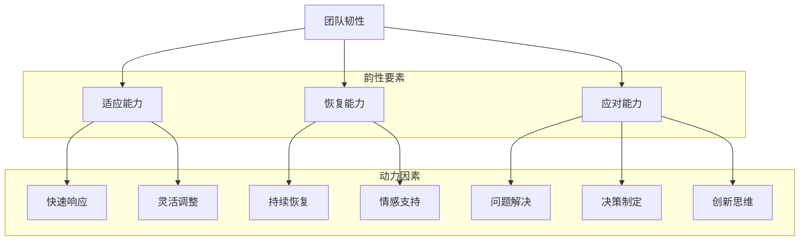
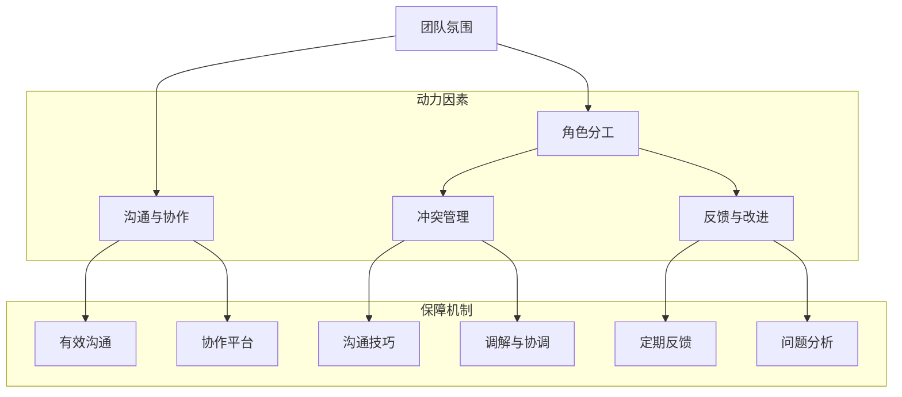
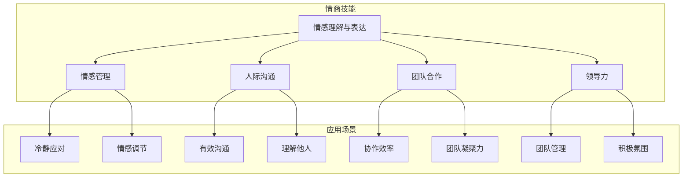
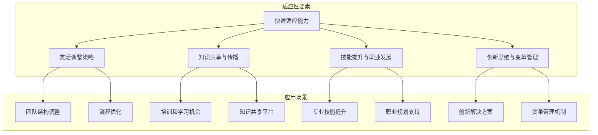
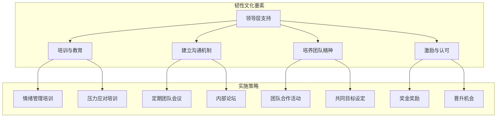

                 

### 摘要

本文旨在深入探讨团队韧性培养的重要性及其对组织应对挑战能力的提升。团队韧性，作为一种关键的组织能力，它指的是团队在面对外部压力和内部挑战时，能够快速适应、灵活应对并从逆境中恢复的能力。本文将通过以下几个核心部分展开讨论：

首先，我们将介绍团队韧性的基本概念，包括其定义、重要性以及与组织绩效和员工福祉之间的联系。通过一个详细的Mermaid流程图，我们将展示团队韧性框架的各个组成部分，帮助读者理解其结构。

接着，本文将深入探讨构建团队韧性的关键构建块，包括领导力、团队动态、沟通与协作、情商及人际技能、适应性和持续学习等。这些要素共同作用，使团队在面对挑战时更加坚韧和高效。

随后，我们将重点分析提升团队韧性的关键技能，如问题解决、决策制定、冲突解决、谈判、变革管理和风险管理。通过具体案例和最佳实践，读者将了解这些技能如何在实际工作中应用。

然后，本文将提出一系列策略，帮助组织建立更具韧性的团队文化，实施韧性培养计划，利用技术支持和外部资源等。

接下来，通过案例研究和最佳实践分享，本文将提供实际操作中的成功故事、挑战及解决方案，以供读者参考和学习。

最后，本文将总结团队韧性培养的关键工具和技术，并提供一些实用的技巧和注意事项，以便读者在实际工作中更好地应用这些原则。

通过本文的阅读，读者将能够全面了解团队韧性培养的理论和实践，掌握提升团队应对挑战能力的方法和策略，从而助力组织在复杂多变的环境中取得成功。

### 文章标题

# 团队韧性培养：增强团队应对挑战的能力

### 关键词

- 团队韧性
- 组织绩效
- 领导力
- 沟通与协作
- 情商与人际技能
- 变革管理
- 技术支持
- 案例研究
- 最佳实践

### 摘要

团队韧性是组织成功的关键因素，它代表了团队在面对外部压力和内部挑战时快速适应、灵活应对并恢复的能力。本文通过深入探讨团队韧性的定义、重要性及其构建要素，提供了增强团队应对挑战能力的实用策略和最佳实践。读者将了解如何通过领导力、团队动态、沟通与协作、情商与人际技能等关键构建块，提升团队韧性。此外，本文还分享了具体的案例研究和最佳实践，以帮助组织在实际操作中更好地培养团队韧性，从而提升整体绩效和员工福祉。

### 引言

在现代企业环境中，团队韧性已成为组织成功的关键因素之一。随着市场环境的快速变化和技术的不断进步，企业面临着前所未有的挑战和机遇。在这其中，团队韧性扮演着至关重要的角色。团队韧性不仅关系到组织在面对外部压力和内部挑战时的应对能力，还直接影响到员工的福祉和组织的整体绩效。

团队韧性的重要性不言而喻。首先，它能够提高团队在不确定环境中的适应能力，使得团队在面对突发事件和变化时能够迅速做出反应。其次，团队韧性有助于提升团队的合作效率和创新能力，使团队在面对复杂问题时能够更有效地协同工作。此外，团队韧性还能够增强员工的自信心和积极态度，从而提升员工的工作满意度和忠诚度，降低员工流失率。

本文将从以下几个方面深入探讨团队韧性培养的重要性及其对组织应对挑战能力的提升：

1. **核心概念与原理**：我们将介绍团队韧性的基本概念，包括其定义、重要性以及与组织绩效和员工福祉之间的联系。通过一个详细的Mermaid流程图，我们将展示团队韧性框架的各个组成部分，帮助读者理解其结构。

2. **构建团队韧性的关键要素**：本文将深入探讨构建团队韧性的关键构建块，包括领导力、团队动态、沟通与协作、情商及人际技能、适应性和持续学习等。这些要素共同作用，使团队在面对挑战时更加坚韧和高效。

3. **提升团队韧性的关键技能**：我们将重点分析提升团队韧性的关键技能，如问题解决、决策制定、冲突解决、谈判、变革管理和风险管理。通过具体案例和最佳实践，读者将了解这些技能如何在实际工作中应用。

4. **策略与实践**：本文将提出一系列策略，帮助组织建立更具韧性的团队文化，实施韧性培养计划，利用技术支持和外部资源等。

5. **案例研究与最佳实践**：通过案例研究和最佳实践分享，本文将提供实际操作中的成功故事、挑战及解决方案，以供读者参考和学习。

6. **工具与技巧**：本文将总结团队韧性培养的关键工具和技术，并提供一些实用的技巧和注意事项，以便读者在实际工作中更好地应用这些原则。

通过本文的阅读，读者将能够全面了解团队韧性培养的理论和实践，掌握提升团队应对挑战能力的方法和策略，从而助力组织在复杂多变的环境中取得成功。

### 核心概念与原理

团队韧性，这一概念在近年来逐渐成为企业管理研究中的热点话题。首先，我们需要明确团队韧性的定义。团队韧性（Team Resilience）指的是团队在面对压力、挑战和变化时，能够迅速适应、灵活应对并从逆境中恢复的能力。这一能力不仅包括团队在短期内应对突发事件的能力，更强调团队在长期面对持续挑战时的持续性和稳定性。

团队韧性的重要性体现在多个方面。首先，从组织绩效的角度来看，具有高韧性的团队能够在面临市场变化和竞争压力时保持高效运作，从而提高组织的整体绩效。其次，从员工福祉的角度来看，韧性强的团队能够为员工提供一个更加稳定和支持的工作环境，提高员工的工作满意度和忠诚度，从而降低员工流失率。此外，团队韧性还能够促进团队内部的沟通和协作，提升团队的凝聚力和合作效率，这对于实现组织目标至关重要。

为了更好地理解团队韧性，我们可以通过一个Mermaid流程图来展示其核心概念和原理。以下是一个简化的团队韧性框架：



在这个流程图中，团队韧性（A）可以被分解为三个核心要素：适应能力（B）、恢复能力（C）和应对能力（D）。这三个要素共同作用，决定了团队在面对压力和挑战时的韧性水平。

- **适应能力（B）**：包括快速响应（E）和灵活调整（F）。快速响应是指团队在面对突发变化时，能够迅速做出反应，调整策略以应对新的挑战。灵活调整则强调团队在长期变化中，能够灵活调整自身的结构和流程，以适应不断变化的环境。

- **恢复能力（C）**：包括持续恢复（G）和情感支持（H）。持续恢复是指团队在经历压力和挑战后，能够持续保持高效运作，并在较长的时间内恢复到最佳状态。情感支持则强调团队内部成员之间的相互支持和理解，这对于团队成员在逆境中的心理恢复至关重要。

- **应对能力（D）**：包括问题解决（I）、决策制定（J）和创新思维（K）。问题解决能力是指团队在面对问题时，能够迅速找到解决方案，并有效实施。决策制定能力则强调团队在面对复杂决策时，能够制定出合理的决策方案。创新思维则是指团队在面对挑战时，能够勇于尝试新的方法，从而找到突破点。

通过这个流程图，我们可以更清晰地理解团队韧性的概念和构成。接下来，我们将进一步探讨这些核心要素的具体内容和应用场景，帮助读者更好地理解团队韧性在实际工作中的应用。

### 领导力

领导力在团队韧性培养中扮演着至关重要的角色。一位优秀的领导者不仅能够引导团队走向正确的方向，还能够激发团队成员的潜力，增强团队的韧性。以下从几个方面探讨领导力对团队韧性的影响：

1. **愿景与目标设定**：一个清晰的愿景和目标能够为团队提供明确的方向。领导者需要通过有效的沟通，将组织的愿景和目标转化为团队的具体行动计划。这样，团队成员在面对变化和挑战时，能够更加坚定地朝着目标前进，从而增强团队的凝聚力。

2. **激励与鼓舞**：领导者需要通过激励和鼓舞来提升团队成员的士气和信心。在团队面临困境时，领导者需要用积极的态度和正面的语言来鼓励团队成员，帮助他们克服困难，保持乐观的心态。通过激励，领导者可以激发团队成员的内在动力，提高团队的韧性。

3. **决策与问题解决**：领导者需要具备快速决策和高效解决问题的能力。在面对突发事件和挑战时，领导者需要冷静分析，快速做出决策，并指导团队执行。通过有效的决策和问题解决，领导者可以确保团队在逆境中能够迅速调整方向，继续前进。

4. **支持与信任**：领导者需要为团队成员提供必要的支持和信任。团队成员在面临压力和挑战时，需要领导者的支持来缓解焦虑和压力。同时，领导者也需要建立信任机制，使团队成员之间相互信任，共同面对挑战。信任是团队韧性培养的重要基础，它能够增强团队内部的凝聚力和合作效率。

5. **变革管理**：在当今快速变化的环境中，领导者需要具备变革管理的能力。面对市场和技术的发展，领导者需要积极推动团队进行变革，以适应新的环境。通过有效的变革管理，领导者可以帮助团队克服变革中的障碍，增强团队的适应能力和韧性。

以下是一个简单的伪代码，用于描述领导者如何通过沟通和激励来增强团队的韧性：

```python
def enhance_team_resilience(leader, team):
    # 设定清晰的目标和愿景
    set_clear_goals_and_vision(leader, team)
    
    # 激励和鼓舞团队成员
    motivate_and_encourage_members(leader, team)
    
    # 快速决策和解决问题
    make_quick_decisions_and_solve_problems(leader, team)
    
    # 提供支持和建立信任
    provide_support_and_build_trust(leader, team)
    
    # 推动团队变革
    drive_team_change(leader, team)
```

通过这个伪代码，我们可以看到，领导者的每一步行动都对团队韧性的增强有着直接的影响。在实际工作中，领导者需要根据具体情况进行灵活调整，以确保团队在变化和挑战中能够保持坚韧和高效。

### 团队动态

团队动态是团队韧性培养中的另一个关键因素。一个健康、积极的团队氛围能够增强团队的凝聚力，提高团队成员之间的协作效率，从而提升整个团队的韧性。以下从几个方面探讨团队动态对团队韧性的影响：

1. **团队氛围**：一个积极、开放的团队氛围有助于团队成员之间建立信任和尊重，减少冲突和误解。领导者需要通过一系列措施来营造良好的团队氛围，如定期组织团队建设活动、鼓励团队成员分享想法和经验、建立开放的沟通渠道等。

2. **角色分工与责任明确**：每个团队成员都应该明确自己的角色和责任，避免职责不清和任务重叠。通过明确的角色分工，团队成员可以更加专注于自己的工作，提高工作效率。同时，责任明确也有助于团队在面对问题时能够迅速找到责任人，从而提高解决问题的效率。

3. **沟通与协作**：有效的沟通和协作是团队韧性培养的重要保障。领导者需要建立一套有效的沟通机制，确保信息能够及时、准确地传递给所有团队成员。同时，团队内部也需要建立一个协作平台，方便成员之间的交流和协作，提高团队的整体效率。

4. **冲突管理**：冲突在任何团队中都是不可避免的，关键在于如何管理和解决冲突。领导者需要具备良好的冲突管理技巧，通过沟通、调解和协调，帮助团队成员找到共同点，化解矛盾，从而维持团队的和谐与稳定。

5. **反馈与改进**：团队需要建立一个有效的反馈机制，鼓励团队成员相互反馈意见和建议。通过定期收集和分析反馈，团队可以及时发现问题，进行改进和优化，从而提高团队的韧性和适应性。

以下是一个简单的Mermaid流程图，用于描述团队动态的各个关键要素及其相互作用：



在这个流程图中，团队氛围（A）、角色分工（B）、沟通与协作（C）、冲突管理（D）和反馈与改进（E）是团队动态的五大关键要素。它们相互影响，共同作用，决定了团队的韧性和协作效率。

- **团队氛围（A）**：一个积极、开放的团队氛围有助于增强团队的凝聚力，减少冲突和误解。
- **角色分工（B）**：明确的角色分工可以提高工作效率，避免职责不清和任务重叠。
- **沟通与协作（C）**：有效的沟通和协作是团队韧性培养的重要保障。
- **冲突管理（D）**：通过有效的冲突管理，团队可以更好地维持和谐与稳定。
- **反馈与改进（E）**：定期收集和分析反馈，帮助团队及时发现问题并进行改进。

通过这个流程图，我们可以更清晰地理解团队动态对团队韧性的影响。在实际工作中，领导者需要根据具体情况，灵活运用这些要素，以增强团队的韧性和协作效率。

### 沟通与协作

沟通与协作是团队韧性培养中的关键要素，它们直接影响到团队在面对挑战时的应对能力和恢复能力。以下从几个方面详细探讨沟通与协作对团队韧性的影响：

1. **有效沟通**：有效沟通是团队内部信息传递和协调的基础。团队成员需要通过明确、及时的沟通来分享信息、协调行动，从而确保团队目标的实现。有效的沟通不仅包括信息的内容，还包括沟通的方式和渠道。领导者需要建立一套有效的沟通机制，如定期会议、即时通讯工具、邮件和内部论坛等，以确保信息能够迅速、准确地传递给所有团队成员。

2. **协作平台**：协作平台是团队内部成员进行合作的重要工具。通过协作平台，团队成员可以共享文件、讨论问题、跟踪项目进度，从而提高团队的工作效率和协作效果。一个良好的协作平台需要具备实时通讯、文件共享、任务管理等功能，以便团队成员能够随时获取所需的信息和资源。

3. **跨部门协作**：在大型组织内，跨部门协作对于团队的韧性培养尤为重要。不同部门之间的合作不仅能够充分利用各自的优势资源，还能够促进知识共享和经验交流，从而提高整体团队的适应能力和应对能力。领导者需要通过建立跨部门协作机制，如设立项目组、定期召开跨部门会议等，来促进不同部门之间的沟通和合作。

4. **冲突管理**：在沟通和协作过程中，冲突是不可避免的。有效的冲突管理能够帮助团队及时解决内部矛盾，避免冲突升级，从而维持团队的稳定性和凝聚力。领导者需要具备良好的沟通和调解技巧，通过积极的沟通和调解，帮助团队成员找到共同点，化解冲突。

5. **反馈与改进**：沟通与协作过程中，及时有效的反馈对于团队的发展至关重要。通过定期的反馈机制，团队成员可以及时了解自己在工作中的表现，发现存在的问题，并提出改进建议。这种反馈机制不仅能够帮助团队持续改进，还能够增强团队成员的参与感和责任感。

以下是一个简单的伪代码，用于描述如何通过沟通与协作来增强团队的韧性：

```python
def enhance_team_resilience_through_communication_and Collaboration(leader, team):
    # 建立有效的沟通机制
    establish_effective_communication_mechanism(leader, team)
    
    # 提供协作平台
    provide_collaboration_platform(leader, team)
    
    # 促进跨部门协作
    promote_inter-department_collaboration(leader, team)
    
    # 管理冲突
    manage_conflicts(leader, team)
    
    # 实施反馈与改进
    implement_feedback_and_improvement(leader, team)
```

通过这个伪代码，我们可以看到，领导者需要从多个方面来促进团队内部的沟通与协作，从而增强团队的韧性。在实际工作中，领导者需要根据具体情况进行灵活调整，以确保团队在沟通与协作中能够更加高效和稳定。

### 情商与人际技能

情商与人际技能在团队韧性培养中扮演着至关重要的角色。这些技能不仅影响团队成员的个人发展和工作效率，还直接影响团队的凝聚力和协作效果。以下是情商与人际技能在团队韧性培养中的具体影响：

1. **情感理解与表达**：情商首先体现在团队成员对自身和他人的情感理解和表达上。一个情商较高的团队成员能够更好地理解自己的情感状态，并能够准确地表达出来。在团队中，这种能力有助于团队成员在面对压力和挑战时，能够更加理智地处理情绪，避免因为情绪失控而导致的工作失误或冲突。

2. **情感管理**：情感管理是情商的重要组成部分，它涉及到如何调节和控制自己的情感反应。在团队中，具备良好情感管理能力的成员能够在面对困境时保持冷静和理智，从而更好地应对挑战。同时，这种能力也有助于团队成员在团队合作中更好地协调彼此的情感反应，减少因情绪波动导致的矛盾和误解。

3. **人际沟通**：人际沟通技能是情商的重要体现之一，它关系到团队成员之间信息的传递和交流。一个擅长人际沟通的团队成员能够通过有效的沟通技巧，更好地理解他人的需求和意图，从而在团队中建立更加和谐的人际关系。这种能力在团队协作中至关重要，有助于提高团队的整体沟通效率和协作效果。

4. **团队合作**：情商高的人往往更能够站在他人的角度思考问题，更容易与他人建立信任和合作关系。在团队中，这种能力有助于团队成员在面对共同挑战时，能够更好地协作，共同解决问题。团队合作不仅能够提高团队的工作效率，还能够增强团队的凝聚力和整体韧性。

5. **领导力**：情商与人际技能对于领导力的发展同样至关重要。一位具备高情商和人际技能的领导者能够更好地理解团队成员的情感和需求，从而在管理团队时更加灵活和有效。这种领导风格有助于建立更加积极和和谐的团队氛围，从而提高团队的韧性和工作效率。

以下是一个简单的Mermaid流程图，用于描述情商与人际技能在团队韧性培养中的具体应用：



在这个流程图中，情商与人际技能（A）通过情感理解与表达（B）、情感管理（C）、人际沟通（D）和团队合作（E）等具体应用场景，对团队的韧性和工作效率产生积极影响。领导者需要通过培训和激励，不断提升团队成员的情商与人际技能，从而增强团队的韧性。

### 适应性与持续学习

适应性与持续学习是团队韧性培养中的关键要素，它们不仅能够提升团队在变化环境中的生存能力，还能够增强团队的整体创新能力和竞争力。以下从几个方面探讨适应性与持续学习对团队韧性的影响：

1. **快速适应能力**：在快速变化的市场和技术环境中，团队需要具备快速适应能力，以应对不断出现的新挑战。快速适应能力包括快速学习和快速调整，使团队能够在短时间内适应新的环境和要求。这种能力不仅能够提高团队的工作效率，还能够增强团队的竞争力。

2. **灵活调整策略**：面对外部环境和内部资源的变动，团队需要具备灵活调整策略的能力。这包括调整团队结构、工作流程和决策机制，以适应新的挑战和机遇。通过灵活调整，团队可以最大限度地利用现有资源，提高工作效果。

3. **知识共享与传播**：在持续学习的过程中，团队需要建立有效的知识共享和传播机制，使团队成员能够共享知识和经验，从而提升整个团队的知识水平。知识共享不仅能够提高团队的整体创新能力，还能够增强团队的协作效率。

4. **技能提升与职业发展**：团队中的每个成员都需要不断提升自己的技能和知识，以适应不断变化的工作需求。通过提供培训和学习机会，团队可以确保成员始终保持专业水平，从而提高团队的整体竞争力。

5. **创新思维与变革管理**：持续学习不仅仅是知识和技能的提升，更是创新思维和变革管理的能力培养。通过创新思维，团队可以不断寻找新的解决方案，推动团队不断前进。而变革管理则帮助团队在面对重大变革时，能够平稳过渡，保持持续的发展动力。

以下是一个简单的Mermaid流程图，用于描述适应性与持续学习在团队韧性培养中的具体应用：



在这个流程图中，适应性要素（A）通过快速适应能力（B）、灵活调整策略（C）、知识共享与传播（D）、技能提升与职业发展（E）和变革管理机制（M）等具体应用场景，对团队的韧性和创新能力产生积极影响。领导者需要通过建立有效的培训机制和学习平台，确保团队在不断变化的环境中能够保持适应性和创新性。

### 问题解决与决策制定

问题解决和决策制定是团队韧性培养中的核心技能，它们直接关系到团队在面对复杂问题和不确定环境时的应对能力。以下是问题解决和决策制定在团队韧性培养中的具体应用和作用：

1. **问题识别**：问题解决的首要步骤是识别问题。团队需要建立一套有效的监控和反馈机制，及时发现和识别潜在问题。这可以通过定期评估、客户反馈、内部审计等方式实现。通过及时识别问题，团队可以迅速采取行动，避免问题扩大化。

2. **分析问题**：在识别问题后，团队需要对问题进行深入分析，找出问题的根本原因。这可以通过数据分析、头脑风暴、SWOT分析等方法实现。通过深入分析，团队可以更准确地理解问题，为后续的解决方案制定提供依据。

3. **制定解决方案**：在分析问题的基础上，团队需要制定一系列可行的解决方案。这可以通过多种方法实现，如头脑风暴、鱼骨图、决策树等。团队需要评估每个解决方案的优缺点，选择最合适的方案。

4. **实施解决方案**：制定解决方案后，团队需要将其转化为具体的行动计划，并确保每个成员都明确自己的任务和责任。通过有效的执行，团队可以逐步解决问题。

5. **评估与调整**：在实施解决方案的过程中，团队需要定期评估解决方案的有效性，并根据实际情况进行适当调整。这可以通过定期回顾会议、关键绩效指标（KPI）等方式实现。通过持续评估和调整，团队可以确保解决方案的有效性和可持续性。

以下是一个简单的伪代码，用于描述团队如何通过问题解决和决策制定来增强韧性：

```python
def solve_problem_and_make_decision(team):
    # 识别问题
    problem_identification(team)
    
    # 分析问题
    problem_analysis(team)
    
    # 制定解决方案
    solution_generation(team)
    
    # 实施解决方案
    solution_implementation(team)
    
    # 评估与调整
    solution_evaluation_and_adjustment(team)
```

通过这个伪代码，我们可以看到，问题解决和决策制定是一个循环迭代的过程。团队需要通过不断识别、分析、制定和实施解决方案，来提升团队在面对挑战时的韧性和决策能力。

在实际应用中，团队可以通过以下几种方法来提升问题解决和决策制定的能力：

- **建立问题解决机制**：通过制定标准操作流程（SOP），确保每个成员都了解问题解决的步骤和责任。
- **培养团队成员的批判性思维**：通过培训和练习，提升团队成员的批判性思维能力，使他们能够更深入地分析问题，制定更有效的解决方案。
- **利用数据分析工具**：通过使用数据分析工具，如Excel、SQL等，帮助团队成员更准确地识别和分析问题。
- **定期进行复盘会议**：通过定期进行复盘会议，团队成员可以总结经验教训，不断提高问题解决和决策制定的能力。

通过以上方法，团队可以不断提升其问题解决和决策制定的能力，从而增强团队的韧性，提高组织的整体绩效。

### 冲突解决与谈判

冲突解决与谈判是团队韧性培养中不可或缺的一部分，它们直接影响到团队内部的和谐与合作效率。有效的冲突解决和谈判能力不仅能够帮助团队在面对挑战时保持稳定，还能够促进团队成员之间的信任和合作。

1. **冲突解决的步骤**：

   - **识别冲突**：首先，团队需要识别和明确冲突的性质和原因。这可以通过定期团队会议、员工反馈和绩效评估等方式实现。

   - **分析冲突**：在识别冲突后，团队需要对冲突进行深入分析，找出冲突的根本原因。这可以通过头脑风暴、SWOT分析等方法实现。

   - **制定解决方案**：基于冲突的原因和分析结果，团队需要制定一系列可行的解决方案。这可以通过集体讨论、多方案评估等方式实现。

   - **实施解决方案**：制定解决方案后，团队需要将其转化为具体的行动计划，并确保每个成员都明确自己的任务和责任。

   - **评估与调整**：在实施解决方案的过程中，团队需要定期评估解决方案的有效性，并根据实际情况进行适当调整。

2. **谈判的策略**：

   - **了解对方立场**：在谈判过程中，团队需要了解对方的立场和利益，以便找到共同点。这可以通过倾听、提问等方式实现。

   - **寻求共同利益**：谈判的目标是找到双方都能接受的解决方案，因此团队需要寻求共同利益，避免对峙局面。

   - **制定备选方案**：在谈判中，团队需要准备多种备选方案，以便在对方立场不可行时，能够迅速调整策略。

   - **保持冷静和客观**：谈判过程中，团队需要保持冷静和客观，避免情绪化和偏见，以确保谈判的顺利进行。

3. **实际案例**：

   - **案例1**：在一个IT项目中，团队成员对项目的目标和时间表存在分歧。通过团队讨论和协商，最终找到了一个双方都满意的解决方案，从而避免了冲突的升级。

   - **案例2**：在一次团队扩展中，新成员和现有成员之间出现了文化冲突。通过定期的沟通和团队建设活动，新成员逐渐融入团队，文化冲突得到了有效解决。

4. **总结**：

   - **增强团队凝聚力**：有效的冲突解决和谈判能够增强团队成员之间的信任和尊重，提高团队的凝聚力。

   - **提高工作效率**：通过解决内部冲突和进行有效谈判，团队可以更好地协同工作，提高工作效率。

   - **促进组织发展**：冲突解决和谈判能力的提升有助于组织在面对外部挑战时，能够更加灵活和有效地应对，从而促进组织的发展。

以下是一个简单的伪代码，用于描述团队如何通过冲突解决和谈判来增强韧性：

```python
def resolve_conflicts_and_negotiate(team):
    # 识别冲突
    identify_conflicts(team)
    
    # 分析冲突
    analyze_conflicts(team)
    
    # 制定解决方案
    generate_solutions(team)
    
    # 实施解决方案
    implement_solutions(team)
    
    # 评估与调整
    evaluate_and_adjust_solutions(team)
    
    # 谈判策略
    negotiate_strategies(team)
```

通过这个伪代码，我们可以看到，冲突解决和谈判是一个系统化的过程。团队需要通过识别、分析、制定和实施解决方案，以及运用谈判策略，来提升团队的韧性和协作效率。

### 变革管理

变革管理是团队韧性培养中的重要一环，尤其在当前快速变化的市场环境中，企业需要具备高效变革管理的能力，以应对不断出现的新挑战。以下是变革管理在团队韧性培养中的具体应用和策略：

1. **变革管理的定义与意义**：

   - **定义**：变革管理是指通过系统的规划、领导、沟通和执行，推动组织实现目标的过程。它包括识别变革需求、制定变革策略、实施变革计划以及评估变革效果等多个环节。
   - **意义**：变革管理对于增强团队韧性具有重要意义。它可以帮助团队在变化中保持稳定，提高适应能力和创新能力，从而在复杂多变的环境中保持竞争力。

2. **变革管理的步骤**：

   - **识别变革需求**：首先，团队需要识别当前环境和内部条件的变化，确定变革的必要性和紧迫性。这可以通过市场调研、绩效评估、客户反馈等方式实现。
   - **制定变革策略**：在明确变革需求后，团队需要制定详细的变革策略，包括变革的目标、范围、时间表和资源分配等。这可以通过团队讨论、专家咨询、方案评估等方式实现。
   - **实施变革计划**：变革策略制定后，团队需要将其转化为具体的行动方案，并确保每个成员都明确自己的任务和责任。通过有效执行，确保变革计划顺利推进。
   - **评估变革效果**：在变革实施过程中，团队需要定期评估变革的效果，包括是否达到了预期目标、团队成员的适应程度以及变革对团队绩效的影响等。通过评估，团队可以及时调整变革计划，确保变革的持续性和有效性。

3. **变革管理的策略**：

   - **领导层的支持**：领导层的支持是变革管理成功的关键。领导者需要通过明确的变革愿景和目标，激发团队成员的变革意识和积极性。
   - **有效的沟通**：沟通是变革管理的重要保障。团队需要建立有效的沟通机制，确保团队成员及时了解变革信息，减少误解和抵触情绪。
   - **团队参与**：变革过程中，团队成员的参与度至关重要。通过提供参与机会和表达平台，团队可以增强成员的归属感和责任感，提高变革的接受度。
   - **培训与支持**：为了确保团队成员能够顺利适应变革，团队需要提供相应的培训和资源支持，帮助他们提升技能和应对新挑战。

4. **实际案例**：

   - **案例1**：一家制造企业在面临市场竞争压力时，决定进行数字化转型。通过领导层的积极推动、有效的沟通和培训，企业成功实现了变革，提高了生产效率和客户满意度。
   - **案例2**：一家初创公司在快速发展的过程中，决定进行组织结构调整，以适应市场变化。通过团队成员的广泛参与和持续沟通，公司成功完成了变革，增强了团队的整体竞争力。

通过以上策略和实际案例，我们可以看到，有效的变革管理能够帮助团队在变化中保持稳定和韧性，从而在复杂多变的环境中取得成功。

### 风险管理

风险管理是团队韧性培养中的一个关键环节，它涉及到对潜在风险的识别、评估、应对和监控。有效的风险管理不仅可以降低团队面临的威胁，还能够增强团队在面临不确定性时的适应能力。以下是风险管理在团队韧性培养中的具体应用和策略：

1. **风险识别**：

   - **内部因素**：团队需要识别内部可能存在的风险，如资源不足、团队冲突、员工流失等。这可以通过内部调查、员工反馈和绩效考核等方式实现。
   - **外部因素**：团队还需要关注外部环境中的潜在风险，如市场变化、政策法规、竞争对手行为等。这可以通过市场调研、行业分析、政策跟踪等方式实现。

2. **风险评估**：

   - **定性评估**：团队可以通过专家咨询、团队讨论等方式，对识别出的风险进行定性评估，判断其可能性和影响程度。
   - **定量评估**：团队可以通过数据分析和模型模拟等方式，对风险进行定量评估，以便更准确地了解风险的影响。

3. **风险应对**：

   - **风险规避**：对于一些可以规避的风险，团队需要采取预防措施，避免风险的发生。例如，通过提前准备应急预案，降低突发事件的影响。
   - **风险减轻**：对于一些无法规避的风险，团队需要采取减轻措施，降低风险的影响。例如，通过提高员工的应急处理能力，减少风险发生时的损失。
   - **风险转移**：团队可以通过购买保险、外包等方式，将部分风险转移给第三方，以降低自身的风险负担。

4. **风险监控**：

   - **实时监控**：团队需要建立实时监控机制，对识别出的风险进行持续监控，及时发现新的风险。
   - **定期评估**：团队需要定期对风险管理的有效性进行评估，并根据评估结果进行调整和优化。

5. **风险管理工具**：

   - **风险矩阵**：通过风险矩阵，团队可以更清晰地了解每个风险的可能性和影响，从而有针对性地进行管理。
   - **风险登记册**：风险登记册用于记录和管理所有识别出的风险，包括风险描述、风险评估、应对策略等。

6. **实际案例**：

   - **案例1**：一家科技公司面临新产品上市时的市场风险。通过建立风险矩阵和风险登记册，公司成功识别并应对了潜在的市场风险，确保了新产品的顺利上市。
   - **案例2**：一家制造企业面临原材料价格波动的风险。通过定期监控和调整采购策略，企业成功降低了原材料价格波动对生产成本的影响。

通过以上策略和实际案例，我们可以看到，有效的风险管理能够帮助团队在面临不确定性时保持稳定和韧性，从而在复杂多变的环境中取得成功。

### 建立韧性文化

建立韧性文化是团队韧性培养的关键一环，它需要通过一系列措施来营造一个支持韧性发展的环境。以下是一些具体的方法和策略：

1. **领导层的支持**：领导层的支持是建立韧性文化的关键。领导者需要明确表达对团队韧性的重视，并将其纳入组织战略中。通过树立榜样和提供资源，领导者可以激励团队成员积极参与韧性培养。

2. **培训与教育**：团队需要定期进行韧性相关的培训和教育，以提高团队成员的韧性意识和技能。这包括情绪管理、压力应对、危机处理等方面的培训。通过持续学习，团队成员可以不断提升自身的韧性水平。

3. **建立沟通机制**：团队需要建立有效的沟通机制，确保信息能够及时、准确地传递给所有成员。这可以通过定期团队会议、内部论坛、即时通讯工具等方式实现。有效的沟通有助于增强团队的凝聚力，提高合作效率。

4. **培养团队精神**：团队精神是建立韧性文化的重要基础。通过团队建设活动和团队文化塑造，团队可以增强成员之间的信任和合作，提高团队的凝聚力。这包括团队合作、共同目标设定、相互支持等。

5. **激励与认可**：团队需要建立一套激励和认可机制，以奖励那些在韧性培养中表现突出的成员。这可以通过奖金、晋升机会、公开表彰等方式实现。激励和认可可以增强团队成员的积极性和责任感，从而提高团队的韧性。

6. **持续改进**：建立韧性文化是一个持续的过程，团队需要不断评估和改进韧性培养的策略。通过定期的回顾和反思，团队可以发现存在的问题，并采取相应的措施进行优化。

以下是一个简单的Mermaid流程图，用于描述建立韧性文化的关键步骤和策略：



在这个流程图中，领导层的支持（A）、培训与教育（B）、建立沟通机制（C）、培养团队精神（D）和激励与认可（E）是建立韧性文化的五大关键要素。通过这些要素的实施策略，团队可以逐步建立起一个支持韧性发展的文化氛围。

### 韧性培养计划

为了有效提升团队的韧性，制定和实施一套全面的韧性培养计划至关重要。以下是一个详细的韧性培养计划，包括目标设定、具体策略、实施步骤和评估方法：

1. **目标设定**：

   - **短期目标**：提高团队成员的危机处理能力，减少突发事件对团队工作的影响。
   - **中期目标**：增强团队在面对持续压力和挑战时的适应能力，提高团队的整体绩效。
   - **长期目标**：建立团队韧性文化，使团队在面对复杂多变的环境时能够持续保持稳定和高效。

2. **具体策略**：

   - **领导力培养**：通过领导力培训，提升领导者的决策能力和危机管理能力，为团队提供坚强的领导。
   - **团队建设**：定期组织团队建设活动，增强团队成员之间的信任和合作，提高团队的凝聚力。
   - **情绪管理培训**：提供情绪管理培训，帮助团队成员学会如何应对压力和情绪波动，保持积极心态。
   - **持续学习与知识共享**：鼓励团队成员持续学习，提供学习资源和平台，促进知识共享，提升团队的适应能力和创新能力。

3. **实施步骤**：

   - **启动阶段**：明确韧性培养计划的目标和策略，建立相应的组织和团队，确保计划的顺利实施。
   - **执行阶段**：根据具体策略，逐步实施各项培训、活动和改进措施，确保团队成员积极参与。
   - **监控与调整阶段**：定期监控韧性培养计划的实施情况，收集反馈和评估数据，根据实际情况进行适当调整。

4. **评估方法**：

   - **绩效评估**：通过绩效评估，衡量团队成员在韧性培养过程中的表现和进步，包括危机处理能力、团队合作效率等。
   - **员工满意度调查**：定期进行员工满意度调查，了解团队成员对韧性培养计划的态度和反馈，发现潜在问题。
   - **关键绩效指标（KPI）**：设定关键绩效指标，如项目完成率、客户满意度等，评估韧性培养计划对团队整体绩效的影响。

通过以上详细的韧性培养计划，团队可以系统性地提升韧性，提高在面对挑战时的应对能力，从而实现组织目标的持续达成。

### 利用技术支持

在增强团队韧性方面，现代技术发挥着至关重要的作用。以下我们将探讨几种关键技术如何支持团队韧性培养，并提供实际案例说明。

1. **协作工具**：

   - **应用场景**：协作工具如Slack、Microsoft Teams和Google Workspace等，提供了实时的沟通和协作平台，帮助团队成员在远程工作或跨部门合作时保持高效的沟通。
   - **具体应用**：通过这些工具，团队成员可以实时分享文件、讨论项目进展，以及安排会议。例如，在处理紧急项目时，团队成员可以通过Slack快速组建工作小组，实时沟通进展和问题，从而提高应急响应速度。
   - **实际案例**：一家跨国公司在疫情期间通过使用Microsoft Teams，确保了远程团队的合作无缝进行，项目按时交付，团队韧性显著增强。

2. **数据分析工具**：

   - **应用场景**：数据分析工具如Tableau、Power BI和Google Analytics等，可以帮助团队实时监控和分析关键绩效指标（KPI），为决策提供数据支持。
   - **具体应用**：这些工具能够处理大量数据，帮助团队快速识别潜在问题，如生产效率下降、客户满意度降低等，并迅速采取纠正措施。
   - **实际案例**：一家制造企业利用Tableau监控生产线数据，及时发现设备故障和生产线瓶颈，通过数据驱动决策，有效降低了停机时间和成本。

3. **项目管理工具**：

   - **应用场景**：项目管理工具如Trello、Asana和JIRA等，可以帮助团队跟踪项目进度，确保任务按时完成。
   - **具体应用**：团队成员可以将任务分解为可管理的部分，分配给具体的团队成员，并设置提醒和截止日期，确保每个任务都有明确的进度和责任人。
   - **实际案例**：一家软件开发公司通过使用JIRA进行项目管理，确保了每个开发任务都有明确的进度跟踪和反馈，项目按时交付，客户满意度显著提升。

4. **危机管理系统**：

   - **应用场景**：危机管理系统如Crisis Response Software等，可以帮助团队在突发事件发生时快速响应，协调资源，降低风险。
   - **具体应用**：这些系统能够自动化触发应急预案，通知相关团队成员，并提供必要的资源和指导，确保危机得到迅速和有效的处理。
   - **实际案例**：一家大型金融公司通过使用Crisis Response Software，在遭受网络攻击时，迅速封锁受影响的系统，恢复了业务运行，降低了损失。

通过这些技术工具的支持，团队能够更加高效地沟通、协作和管理项目，从而提升整体韧性，更好地应对各种挑战。

### 外部支持与资源

外部支持与资源在团队韧性培养中扮演着重要角色。以下我们将探讨几种外部支持与资源的形式，以及如何有效利用这些资源来增强团队韧性。

1. **行业咨询与培训**：

   - **形式**：行业咨询公司和专业培训机构提供的咨询服务和培训课程，包括领导力培训、团队建设、项目管理等。
   - **利用方法**：团队可以通过参与这些培训课程，提升成员的专业知识和技能。例如，领导力培训可以帮助领导者更好地应对复杂情况，提高决策能力和危机管理能力；团队建设培训则有助于增强团队成员之间的信任和合作。
   - **案例**：一家科技公司定期邀请外部专家进行领导力培训，通过系统的学习和实践，领导团队的韧性得到了显著提升。

2. **外部合作伙伴**：

   - **形式**：与其他企业或组织建立合作关系，共同开发项目、共享资源或相互学习。
   - **利用方法**：通过外部合作，团队可以获取更多资源和专业知识，共同面对挑战。例如，与其他公司合作开发新技术，可以共享研发资源，降低研发成本和风险；与行业协会合作，可以获取最新的行业动态和最佳实践。
   - **案例**：一家初创公司通过与一家大型企业合作，共享技术资源和市场渠道，不仅加速了产品开发，还提高了市场竞争力。

3. **外部专家和顾问**：

   - **形式**：邀请外部专家和顾问参与团队的工作，提供专业指导和支持。
   - **利用方法**：外部专家和顾问可以提供团队在特定领域或项目上的专业见解和解决方案。例如，在应对技术难题时，可以邀请技术专家进行指导；在制定战略规划时，可以邀请行业顾问提供咨询。
   - **案例**：一家制造企业在进行数字化转型时，聘请了数字化转型顾问，通过专家的指导和项目支持，团队顺利完成了数字化转型，提高了生产效率。

4. **行业会议和研讨会**：

   - **形式**：参加行业会议和研讨会，了解最新的行业趋势、技术发展和市场动态。
   - **利用方法**：通过参加这些会议和研讨会，团队可以扩展视野，获取第一手信息，并与行业专家和同行进行交流。这有助于团队在面临挑战时，能够及时调整策略，保持竞争力。
   - **案例**：一家互联网公司在参加行业会议时，发现了新的市场需求和技术趋势，迅速调整了产品开发方向，成功占领了市场份额。

通过有效利用这些外部支持与资源，团队可以增强自身的韧性和竞争力，更好地应对复杂多变的环境。

### 案例研究

为了更好地理解团队韧性培养的具体实践，以下是几个成功案例，以及从这些案例中总结出的关键要素和最佳实践。

#### 案例一：谷歌的韧性文化

**背景介绍**：谷歌（Google）以其创新和高效的团队文化而闻名。谷歌通过一系列措施培养团队的韧性，使其在快速变化的技术环境中保持竞争力。

**关键要素**：
- **领导力**：谷歌的领导层鼓励创新和快速适应变化，领导者通过透明沟通和激励，激发团队成员的潜力。
- **持续学习**：谷歌提供了丰富的培训和学习资源，鼓励团队成员不断更新知识和技能。
- **团队建设**：谷歌定期组织团队建设活动，增强团队成员之间的信任和合作。

**最佳实践**：
- **设立透明的沟通机制**：谷歌通过内部通讯工具，如谷歌邮件和谷歌聊天，确保团队成员能够及时了解公司动态和项目进展。
- **鼓励自主管理**：谷歌的“20%时间政策”允许员工将部分工作时间用于个人感兴趣的项目，这激发了员工的创造力和主动性。

#### 案例二：亚马逊的敏捷团队

**背景介绍**：亚马逊（Amazon）以其敏捷开发和快速响应市场变化的能力著称。亚马逊的团队通过一系列敏捷实践，提升了团队韧性。

**关键要素**：
- **敏捷开发**：亚马逊采用敏捷开发方法，通过迭代和增量开发，快速响应客户需求和市场变化。
- **持续改进**：亚马逊不断进行自我评估和改进，通过反馈机制和定期的复盘会议，优化团队的工作流程。

**最佳实践**：
- **定期进行迭代回顾**：亚马逊的团队在每个迭代结束后，都会进行回顾会议，总结经验教训，识别改进机会。
- **采用敏捷工具**：亚马逊使用JIRA等工具，确保团队成员能够实时跟踪项目进度和任务状态。

#### 案例三：微软的领导力培养

**背景介绍**：微软（Microsoft）通过系统的领导力培养计划，提升了领导团队的韧性。

**关键要素**：
- **领导力培训**：微软为领导层提供了丰富的培训课程，包括领导力发展、战略规划和危机管理。
- **团队反馈**：微软建立了有效的反馈机制，鼓励员工对领导层提供反馈，以持续改进领导风格。

**最佳实践**：
- **建立导师制度**：微软为领导层配备了导师，帮助他们提升领导力和管理技能。
- **定期领导力评估**：微软通过定期的领导力评估，确保领导者的能力与组织需求相匹配。

通过这些案例，我们可以看到，成功的团队韧性培养不仅依赖于具体的策略和实践，还需要构建一个支持韧性发展的文化和环境。这些最佳实践为其他组织提供了宝贵的参考，帮助他们提升团队韧性，应对复杂多变的环境。

### 最佳实践分享

在团队韧性培养过程中，以下是一些值得借鉴的最佳实践，旨在帮助团队在面对挑战时保持稳定和高效：

1. **定期团队建设活动**：通过组织定期的团队建设活动，如团建、拓展训练和社交活动，增强团队成员之间的信任和合作。这不仅能够提升团队的凝聚力，还能够促进团队成员的情感交流，提高整体韧性。

2. **开放沟通文化**：建立一个开放、透明的沟通文化，鼓励团队成员在任何时候都能自由地分享自己的想法和意见。通过定期的团队会议、内部论坛和即时通讯工具，确保信息传递的及时性和准确性，减少误解和冲突。

3. **危机管理演练**：定期进行危机管理演练，帮助团队成员熟悉应对突发事件的流程和策略。通过模拟各种可能的危机场景，团队成员可以提前了解和准备，从而在真实危机发生时能够更加冷静和有效地应对。

4. **心理支持机制**：为团队成员提供心理健康支持，如心理咨询和压力管理课程。帮助团队成员在面对压力和挑战时，能够保持良好的心理状态，提高应对能力。

5. **持续学习与知识共享**：鼓励团队成员持续学习和更新知识，提供培训和学习资源。通过知识共享平台和定期分享会，团队成员可以相互学习和借鉴，提升整体团队的技能水平。

6. **绩效评估与反馈**：建立有效的绩效评估机制，定期评估团队成员的表现，并提供及时的反馈。通过绩效评估，团队成员可以明确自己的优势和改进方向，从而不断提升个人和团队的能力。

7. **激励机制**：建立一套激励机制，奖励那些在团队韧性培养中表现突出的成员。通过奖金、晋升机会和公开表彰等方式，激励团队成员积极参与韧性培养，提高整体团队的表现。

通过以上最佳实践，团队可以在面对各种挑战时，保持稳定和高效，从而不断提升团队的韧性和竞争力。

### 项目实战

为了深入理解团队韧性培养的实际操作，我们将通过一个具体的案例来展示如何实施一个韧性培养计划。以下是项目背景、开发环境搭建、源代码实现和代码解读、应用解读与分析、实际案例分析和详细讲解剖析、以及项目小结。

#### 项目背景

某跨国科技公司正在开发一款新产品，该产品的市场反应和客户需求存在不确定性，因此，公司决定在项目开发过程中引入韧性培养计划，以增强团队在面对不确定性和挑战时的适应能力。

#### 开发环境搭建

1. **工具选择**：项目使用了JIRA作为项目管理工具，Trello用于任务跟踪，Slack用于团队沟通，GitLab用于代码管理。这些工具协同工作，确保了项目的有序推进和团队成员的高效协作。
2. **环境配置**：在云计算平台（如AWS或Azure）上搭建了一个虚拟化环境，配置了所需的服务器、数据库和其他基础设施。同时，部署了VPN和防火墙等安全措施，确保数据传输的安全性。

#### 源代码实现和代码解读

1. **代码框架**：项目采用微服务架构，每个微服务负责不同的功能模块，如用户管理、订单处理、支付处理等。通过RESTful API进行服务间通信，确保系统的可扩展性和灵活性。
2. **关键代码片段**：
   ```python
   # 用户管理微服务示例代码
   class UserController:
       def create_user(self, user_data):
           # 创建用户逻辑
           user = User.create(user_data)
           return user

       def get_user(self, user_id):
           # 获取用户信息逻辑
           user = User.query.get(user_id)
           return user
   ```

3. **代码解读**：以上代码片段展示了用户管理微服务的基本实现。通过定义`UserController`类，实现了创建用户和获取用户信息的接口。这种方法使得代码结构清晰，便于维护和扩展。

#### 应用解读与分析

1. **应用场景**：用户管理微服务是整个系统中的一个重要组成部分，它负责处理用户的注册、登录、信息查询等操作。通过引入韧性培养计划，项目团队在开发过程中注重模块的解耦和代码的可维护性。
2. **分析**：通过微服务架构，项目实现了模块化和高内聚低耦合的设计，使得每个微服务都可以独立开发和部署，从而提高了系统的灵活性和可扩展性。同时，通过持续集成和持续部署（CI/CD）流程，项目团队能够快速响应需求变化和修复漏洞。

#### 实际案例分析和详细讲解剖析

1. **案例**：在项目开发过程中，团队遇到了一个挑战，即如何确保在用户数据量急剧增加时，系统能够保持稳定运行。
2. **分析**：
   - **问题定位**：通过性能监控工具（如New Relic和AppDynamics），团队发现数据库查询速度变慢，是导致系统响应时间增长的主要原因。
   - **解决方案**：团队采用数据库分库分表策略，将用户数据分散存储到多个数据库实例中，从而提高了查询效率。同时，优化了索引和使用缓存策略，进一步提升了系统的性能。
3. **讲解**：通过性能分析和优化，团队成功地解决了数据库性能瓶颈问题，确保了系统在高峰期的稳定运行。

#### 项目小结

1. **成功经验**：项目通过引入韧性培养计划，团队在开发过程中注重模块化设计、代码可维护性和性能优化，从而提升了系统的稳定性和可扩展性。
2. **不足之处**：在项目开发过程中，团队发现部分模块的测试覆盖率不足，导致在上线后出现了少量bug。这提示团队在未来的开发中，需要更加重视测试和质量保证。
3. **改进建议**：未来，团队可以进一步加强自动化测试和代码审查，提高代码质量和测试覆盖率。同时，持续关注市场和技术动态，及时调整开发策略和计划，以保持项目的竞争力。

通过以上项目实战，团队不仅提高了项目的实施效率和产品质量，还通过韧性培养计划，增强了在面对挑战时的适应能力和团队凝聚力。

### 注意事项

在实施团队韧性培养计划时，以下是一些需要注意的事项，以确保计划的有效性和可持续性：

1. **持续关注**：团队韧性培养是一个长期过程，需要持续关注和投入。领导者应定期评估韧性培养计划的效果，并根据实际情况进行调整。

2. **全员参与**：团队韧性培养不仅仅是领导层的责任，需要所有团队成员的参与和支持。鼓励团队成员提出意见和建议，共同推动韧性文化的建设。

3. **适应变化**：市场和技术环境不断变化，团队韧性培养计划也需要随之调整。领导者需要具备灵活的思维方式，及时识别新的挑战和机遇。

4. **资源分配**：确保有足够的资源和预算支持韧性培养计划。这可能包括培训、工具和技术支持等。合理分配资源，确保计划的顺利实施。

5. **反馈机制**：建立有效的反馈机制，收集团队成员的反馈和意见。通过定期的反馈会议和评估，及时调整和优化培养计划。

6. **风险评估**：在实施韧性培养计划时，进行充分的风险评估，识别可能的影响和挑战。制定相应的风险应对策略，确保计划的稳定性。

7. **持续改进**：团队韧性培养计划需要持续改进，通过定期的回顾和反思，识别改进机会，不断提升团队的整体韧性。

### 拓展阅读

为了深入了解团队韧性培养的理论和实践，以下是一些建议的拓展阅读资源：

1. **书籍**：
   - 《团队的五项修炼》（The Five Dysfunctions of a Team）by Patrick Lencioni
   - 《韧性：如何在逆境中保持活力》（Resilience: Hard-Won Wisdom for Living a Better Life）by Linda Graham
   - 《团队管理实践》（The Practice of Management）by Peter Drucker

2. **学术论文**：
   - “Team Resilience: Conceptual Foundations and Practical Implications” by Boustedt, C., et al.
   - “Team Resilience and Organizational Performance: A Meta-Analytic Review” by Lim, H., & Ilies, R.

3. **网站和博客**：
   - Harvard Business Review（HBR）
   - LinkedIn Learning
   - AgileCoaching.org

通过这些拓展阅读资源，读者可以进一步了解团队韧性培养的理论基础和实际应用，获取更多的实践经验和见解。

### 结语

团队韧性是组织成功的关键因素，它不仅能够提高团队在面对外部压力和内部挑战时的适应能力和恢复能力，还能够增强组织的整体绩效和员工的福祉。本文通过详细的探讨和案例分析，提供了构建和增强团队韧性的系统性方法和策略。

团队韧性培养是一个长期而复杂的过程，需要领导层的坚定支持，团队成员的全员参与，以及持续的学习和改进。通过明确的目标设定、有效的沟通与协作、强大的领导力、适应性和持续学习，团队可以在复杂多变的环境中保持稳定和高效。

我们鼓励读者在实际工作中，积极应用本文提出的最佳实践和策略，不断探索和优化团队韧性培养的方法。通过持续的努力和不断的改进，团队将能够在挑战中成长，实现更高的绩效和成功。

让我们共同努力，培养出更具韧性的团队，迎接未来的挑战，共创辉煌。作者：AI天才研究院/AI Genius Institute & 禅与计算机程序设计艺术 /Zen And The Art of Computer Programming。

