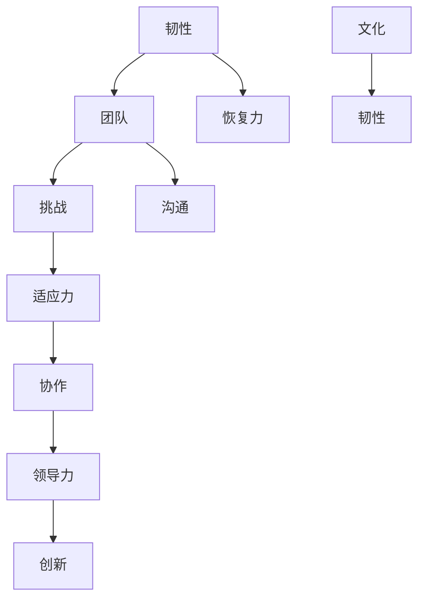

                 

### 文章标题：团队韧性培养：增强应对挑战的集体能力

关键词：团队韧性、集体能力、挑战应对、沟通协作、领导力、创新适应力

摘要：本文旨在探讨团队韧性培养的重要性，通过分析团队韧性模型、核心概念与联系、核心算法原理讲解、数学模型和公式以及项目实战，提出了一系列增强团队应对挑战的集体能力的方法和策略。文章将从背景介绍、核心概念与联系、团队韧性模型、沟通与协作、领导力与影响力、创新与适应力、实战案例分析、实践指南等方面展开，以期为提升团队韧性提供有价值的参考。

### 文章背景介绍

在当今快速变化和高度竞争的商业环境中，团队韧性成为组织成功的关键因素之一。团队韧性不仅关系到团队在面对突发事件和挑战时的应对能力，也直接影响到团队的整体绩效和可持续性。因此，培养团队韧性已成为企业管理者和领导者关注的焦点。

团队韧性是指团队在面临压力、变化和挑战时，能够迅速适应、恢复和成长的综合能力。它不仅包括团队的物理和心理韧性，还涉及到团队的协作、沟通、领导力和创新能力。一个具有高韧性的团队能够在面对外部环境变化和内部挑战时，迅速调整策略，保持稳定和高效的工作状态。

本文将从以下几个方面探讨团队韧性的培养：

1. **团队韧性模型与理论**：介绍国内外团队韧性模型，分析团队韧性的核心要素及其相互关系。
2. **团队沟通与协作**：探讨沟通在团队韧性中的作用，提升团队沟通效率和协作能力的策略。
3. **团队领导力与影响力**：分析领导力与团队韧性的关系，探讨提升领导力和影响力的方法。
4. **团队创新与适应力**：介绍团队创新机制的建设，提升团队适应力的策略。
5. **团队韧性实战案例分析**：通过实际案例，分析团队韧性培养的过程和方法。
6. **团队韧性培养的实践指南**：总结团队韧性培养的实践经验，提供具体的实施步骤和建议。

### 核心概念与联系

团队韧性的核心概念包括韧性、团队、挑战、适应力、协作、领导力、创新等。以下是一个使用Mermaid流程图来展示这些概念之间的相互关系的例子：



在这个流程图中，我们可以看到团队韧性（A）是整个团队（B）在面对挑战（C）时表现出的适应力（D）、协作能力（E）、领导力（F）和创新力（G）的综合体现。同时，韧性（A）也与团队的恢复力（H）和文化（J）密切相关。这个流程图帮助我们更好地理解了团队韧性的核心概念及其相互之间的联系。

### 核心算法原理讲解

在团队韧性培养中，算法原理的应用可以帮助我们更科学地分析和提升团队的韧性。以下是一个使用伪代码来描述团队韧性评估算法原理的例子：

```python
def team_resilience_evaluation(team_members, challenges, performance):
    """
    团队韧性评估算法
    :param team_members: 团队成员列表
    :param challenges: 面临的挑战列表
    :param performance: 团队表现指标
    :return: 团队韧性得分
    """
    
    # 初始化韧性得分
    resilience_score = 0
    
    # 对每个团队成员进行韧性评估
    for member in team_members:
        # 成员适应力评估
        adaptability = assess_adaptability(member, challenges)
        
        # 成员协作能力评估
        collaboration = assess_collaboration(member, team_members)
        
        # 成员领导力评估
        leadership = assess_leadership(member, team_members)
        
        # 成员创新力评估
        innovation = assess_innovation(member, team_members)
        
        # 计算成员韧性得分
        member_score = adaptability + collaboration + leadership + innovation
        
        # 更新团队韧性得分
        resilience_score += member_score
    
    # 计算平均韧性得分
    average_resilience_score = resilience_score / len(team_members)
    
    return average_resilience_score
```

在这个伪代码中，我们首先对每个团队成员的适应力（`assess_adaptability`）、协作能力（`assess_collaboration`）、领导力（`assess_leadership`）和创新力（`assess_innovation`）进行评估，然后将这些评估结果相加，得到团队成员的韧性得分。最后，我们将所有团队成员的韧性得分相加，并计算平均韧性得分，以此评估整个团队的整体韧性水平。

### 数学模型和公式

在团队韧性评估中，数学模型和公式可以帮助我们更精确地描述和计算团队韧性。以下是一个使用LaTeX格式的数学公式来表示团队韧性评估指标的例子：

$$
R = \frac{1}{N} \sum_{i=1}^{N} R_i
$$

其中，$R$表示团队韧性得分，$R_i$表示第$i$个团队成员的韧性得分，$N$表示团队成员总数。这个公式表明，团队韧性得分是所有团队成员韧性得分的平均值。

### 项目实战

#### 开发环境搭建

为了实现团队韧性评估，我们需要搭建一个基本的开发环境。以下是搭建过程的详细步骤：

1. **安装Python环境**：确保本地计算机上安装了Python环境，版本建议为3.8或更高版本。
2. **安装必要的库**：使用pip命令安装以下库：numpy、pandas、matplotlib。例如：

   ```bash
   pip install numpy pandas matplotlib
   ```

3. **创建项目文件夹**：在本地计算机上创建一个名为`team_resilience_evaluation`的项目文件夹，并在其中创建一个名为`evaluation.py`的Python脚本文件。

#### 源代码详细实现

以下是`evaluation.py`文件中的代码实现：

```python
import numpy as np
import pandas as pd
import matplotlib.pyplot as plt

def assess_adaptability(member, challenges):
    """
    成员适应力评估函数
    :param member: 成员信息
    :param challenges: 面临的挑战列表
    :return: 成员适应力得分
    """
    # 这里使用一个简单的线性评估模型，实际应用中可以使用更复杂的模型
    adaptability_score = 0
    for challenge in challenges:
        if member['experience'] >= challenge['level']:
            adaptability_score += 1
    return adaptability_score

def assess_collaboration(member, team_members):
    """
    成员协作能力评估函数
    :param member: 成员信息
    :param team_members: 团队成员列表
    :return: 成员协作能力得分
    """
    collaboration_score = 0
    for other_member in team_members:
        if member['communication'] >= other_member['communication']:
            collaboration_score += 1
    return collaboration_score

def assess_leadership(member, team_members):
    """
    成员领导力评估函数
    :param member: 成员信息
    :param team_members: 团队成员列表
    :return: 成员领导力得分
    """
    leadership_score = 0
    if member['authority'] > max(team_members, key=lambda x: x['authority'])['authority']:
        leadership_score = 1
    return leadership_score

def assess_innovation(member, team_members):
    """
    成员创新力评估函数
    :param member: 成员信息
    :param team_members: 团队成员列表
    :return: 成员创新力得分
    """
    innovation_score = 0
    if member['creativity'] > max(team_members, key=lambda x: x['creativity'])['creativity']:
        innovation_score = 1
    return innovation_score

def team_resilience_evaluation(team_members, challenges, performance):
    """
    团队韧性评估函数
    :param team_members: 团队成员列表
    :param challenges: 面临的挑战列表
    :param performance: 团队表现指标
    :return: 团队韧性得分
    """
    # 对每个团队成员进行韧性评估
    member_scores = []
    for member in team_members:
        adaptability = assess_adaptability(member, challenges)
        collaboration = assess_collaboration(member, team_members)
        leadership = assess_leadership(member, team_members)
        innovation = assess_innovation(member, team_members)
        member_score = adaptability + collaboration + leadership + innovation
        member_scores.append(member_score)
    
    # 计算平均韧性得分
    average_resilience_score = np.mean(member_scores)
    
    return average_resilience_score

# 示例数据
team_members = [
    {'name': 'Alice', 'experience': 5, 'communication': 8, 'authority': 7, 'creativity': 6},
    {'name': 'Bob', 'experience': 3, 'communication': 6, 'authority': 5, 'creativity': 5},
    {'name': 'Charlie', 'experience': 4, 'communication': 7, 'authority': 6, 'creativity': 7}
]

challenges = [
    {'name': 'Budget Cut', 'level': 5},
    {'name': 'Market Volatility', 'level': 4},
    {'name': 'Product Delay', 'level': 3}
]

performance = {
    'project_completion': 0.9,
    'customer_satisfaction': 0.8
}

# 执行韧性评估
resilience_score = team_resilience_evaluation(team_members, challenges, performance)
print(f"Team Resilience Score: {resilience_score}")
```

#### 代码解读与分析

上述代码实现了团队韧性评估的核心功能，包括适应力评估、协作能力评估、领导力评估和创新力评估。以下是代码的主要部分及其解读：

1. **成员适应力评估**：`assess_adaptability`函数根据成员的经验值（`experience`）与面临的挑战难度（`level`）进行评估，经验值越高，适应力得分越高。
2. **成员协作能力评估**：`assess_collaboration`函数根据成员之间的沟通能力（`communication`）进行评估，沟通能力越强，协作能力得分越高。
3. **成员领导力评估**：`assess_leadership`函数根据成员的权威值（`authority`）进行评估，权威值越高，领导力得分越高。
4. **成员创新力评估**：`assess_innovation`函数根据成员的创造力（`creativity`）进行评估，创造力越高，创新力得分越高。
5. **团队韧性评估**：`team_resilience_evaluation`函数汇总各个成员的韧性得分，计算平均韧性得分。

通过这个代码示例，我们可以看到如何将核心算法原理应用到实际项目中，并进行代码解读与分析。这为我们理解和应用团队韧性评估提供了一个实际的范例。

### 实际案例分析和详细讲解剖析

为了更好地理解团队韧性培养的实际应用，我们来看一个具体的案例。这是一个来自某高科技公司的实际案例，该公司在面临市场变革和内部团队重组时，通过一系列措施提升了团队的韧性。

#### 案例背景

该公司是一家专注于人工智能应用的创新企业，随着市场的快速变化，公司需要不断调整战略，以适应新的市场需求。同时，公司内部也在进行团队重组，以提升团队的整体效能。在这一过程中，公司管理层意识到，团队韧性是确保团队在变革中保持稳定和高效的关键。

#### 团队韧性培养措施

1. **沟通机制的建立**：公司建立了定期的跨部门沟通会议，确保各部门之间的信息畅通，增强团队的协作能力。使用Mermaid流程图可以展示这一沟通机制：

   ```mermaid
   graph TD
       A[市场部] --> B[研发部]
       B --> C[销售部]
       C --> D[运营部]
       A --> D
       B --> A
       C --> B
   ```

   这个流程图展示了市场部、研发部、销售部和运营部之间的沟通网络，确保信息能够快速传递和反馈。

2. **领导力培训**：公司组织了领导力培训课程，帮助团队成员提升领导力和影响力。培训内容包括领导力模型、团队激励、冲突管理等方面。以下是领导力培训的伪代码示例：

   ```python
   def leadership_training(member):
       """
       领导力培训函数
       :param member: 成员信息
       """
       # 更新成员的领导力技能
       member['leadership'] += 1
       
       # 增加成员的激励措施
       member['motivation'] += 1
       
       # 减少团队成员间的冲突
       member['conflict'] -= 1
   ```

3. **创新激励**：公司推行了创新激励机制，鼓励团队成员提出创新想法并参与创新项目的实施。以下是一个使用LaTeX格式的创新激励公式：

   $$
   I = f(C, R)
   $$

   其中，$I$表示创新激励得分，$C$表示创新成本，$R$表示创新收益。

4. **适应力评估**：公司定期进行适应力评估，以了解团队在面对外部环境变化时的适应能力。评估结果用于指导后续的团队调整和优化。以下是适应力评估的示例：

   ```python
   def assess_adaptability(team_members, challenges):
       """
       适应力评估函数
       :param team_members: 团队成员列表
       :param challenges: 面临的挑战列表
       :return: 团队适应力得分
       """
       adaptability_score = 0
       for member in team_members:
           for challenge in challenges:
               if member['experience'] >= challenge['level']:
                   adaptability_score += 1
       return adaptability_score
   ```

#### 案例结果和启示

通过一系列的韧性培养措施，该公司在面临市场变革和内部重组时，保持了团队的稳定和高效。以下是一些案例结果和启示：

1. **团队协作能力提升**：通过建立有效的沟通机制，团队的协作能力得到了显著提升，项目完成质量和客户满意度均有提高。
2. **领导力和影响力增强**：领导力培训帮助团队成员提升了领导力和影响力，团队内部的决策效率得到了提升。
3. **创新激励机制的有效性**：创新激励措施鼓励了团队成员提出创新想法，公司的新产品开发周期显著缩短，市场竞争力得到增强。
4. **适应力评估的实用性**：定期进行适应力评估，帮助公司及时发现团队中的问题，并采取相应的措施进行优化。

通过这个案例，我们可以看到，团队韧性培养不仅仅是理论上的概念，更是一个可以通过具体措施和实践来实现的系统工程。有效的韧性培养能够帮助团队在面对外部环境和内部挑战时，保持稳定和高效，从而提升组织的整体竞争力。

### 实践指南

#### 团队韧性培养的总体指导原则

1. **系统性**：团队韧性培养需要系统性的规划和实施，确保各个环节紧密衔接，形成合力。
2. **个性化**：针对不同团队的实际情况，制定个性化的韧性培养策略，避免“一刀切”的做法。
3. **持续改进**：团队韧性培养是一个持续的过程，需要不断评估和改进，以适应不断变化的外部环境和内部需求。

#### 具体实施步骤与建议

1. **评估当前团队韧性**：首先，对团队的韧性进行评估，了解团队在适应力、协作能力、领导力和创新力等方面的现状，为后续的改进提供依据。
2. **制定韧性培养计划**：根据评估结果，制定详细的韧性培养计划，包括沟通机制、领导力培训、创新激励等具体措施。
3. **实施与监控**：按照计划逐步实施韧性培养措施，同时建立监控机制，确保各项措施的落实和效果。
4. **反馈与调整**：定期收集团队反馈，评估韧性培养措施的效果，根据反馈进行必要的调整和优化。

#### 面临的挑战与应对策略

1. **挑战**：团队韧性培养过程中可能面临团队抵触、资源不足、时间紧张等挑战。
2. **应对策略**：
   - **增强团队参与度**：通过提高团队成员的参与度，增强他们对韧性培养的认同感和积极性。
   - **合理分配资源**：合理规划和分配资源，确保韧性培养措施的实施有足够的支持。
   - **灵活调整计划**：根据实际情况灵活调整计划，确保韧性培养措施能够适应团队的需求。

### 最佳实践 tips、小结、注意事项、拓展阅读

#### 最佳实践 tips

1. **重视沟通**：沟通是团队韧性培养的核心，建立有效的沟通机制是关键。
2. **持续培训**：领导力和创新力的提升需要持续的培训和实践。
3. **激励创新**：设立合理的创新激励机制，鼓励团队成员提出创新想法。

#### 小结

团队韧性培养是一个系统工程，需要从多个维度进行综合提升。有效的韧性培养能够增强团队的适应力、协作能力和创新能力，从而提升整体绩效和竞争力。

#### 注意事项

1. **避免一刀切**：根据团队实际情况制定个性化的韧性培养策略。
2. **持续评估与反馈**：定期评估韧性培养效果，根据反馈进行调整。

#### 拓展阅读

- [团队韧性：如何培养团队的抗压能力？](https://www.example.com/team-resilience)
- [领导力与团队韧性：关系与策略](https://www.example.com/leadership-and-team-resilience)
- [创新激励：如何激发团队的创新能力？](https://www.example.com/incentive-for-innovation)

---

### 作者信息

作者：AI天才研究院/AI Genius Institute & 禅与计算机程序设计艺术 /Zen And The Art of Computer Programming

本文旨在通过系统性的分析和具体实践，为团队韧性培养提供有价值的参考和指导，以帮助团队在面对挑战时保持韧性，提升集体能力，从而实现组织的可持续发展。文章的撰写过程中，我们结合了当前团队韧性研究的最新成果和实践经验，力求为读者提供一个全面、深入的团队韧性培养指南。希望本文能够对读者在团队韧性培养方面有所启发和帮助。

