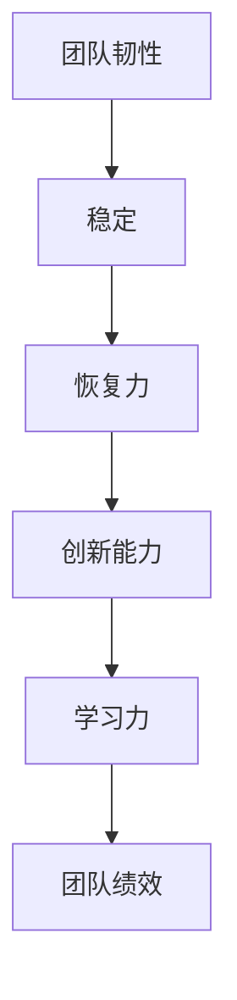
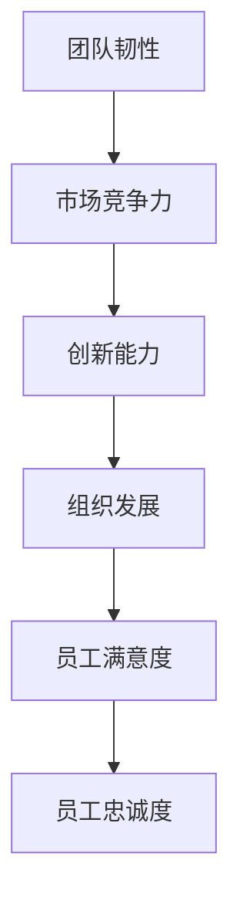
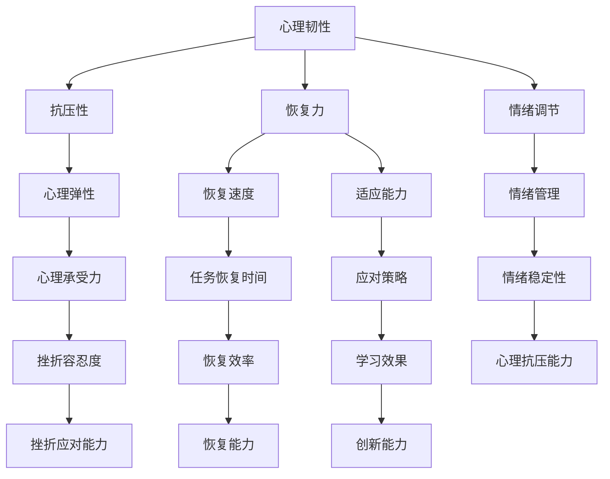

                 

### 文章标题：团队韧性培养：提升应对挑战的能力

#### 关键词：
- 团队韧性
- 挑战应对
- 领导力培养
- 文化建设
- 风险管理

#### 摘要：
本文旨在探讨团队韧性培养的重要性以及如何提升团队应对挑战的能力。文章首先介绍了团队韧性的定义和特征，接着分析了团队韧性模型以及提升团队韧性的策略。随后，文章深入讨论了应对挑战的策略、团队韧性评估与改进、领导力培养和团队文化建设等方面。通过实际案例分析和最佳实践，本文为团队管理者提供了一套实用的团队韧性提升方案。

## 目录大纲

### 第一部分：团队韧性概述

#### 第1章：团队韧性的重要性

##### 1.1 什么是团队韧性
- 团队韧性的定义
- 团队韧性与团队绩效的关系
- 团队韧性在组织中的意义

##### 1.2 团队韧性的特征
- 韧性的构成要素
- 韧性表现的维度
- 韧性与弹性、适应性的区别

##### 1.3 团队韧性发展的趋势
- 全球范围内的韧性发展趋势
- 我国企业对团队韧性的需求

#### 第2章：团队韧性模型

##### 2.1 团队韧性模型概述
- 团队韧性模型的概念
- 团队韧性模型的构成

##### 2.2 团队韧性能力培养
- 领导力与团队韧性
- 成员个体韧性培养
- 团队协作与韧性

##### 2.3 团队韧性提升策略
- 风险管理与韧性提升
- 企业文化与韧性
- 组织结构对团队韧性的影响

### 第二部分：团队韧性实践

#### 第3章：团队韧性建设实践

##### 3.1 团队韧性建设流程
- 团队韧性评估
- 团队韧性规划
- 团队韧性实施

##### 3.2 团队韧性培训
- 培训目标设定
- 培训内容设计
- 培训效果评估

##### 3.3 团队韧性案例分析
- 国内企业团队韧性建设成功案例
- 国外企业团队韧性建设经验借鉴

#### 第4章：应对挑战的策略

##### 4.1 挑战识别
- 挑战的类型
- 挑战的来源
- 挑战的影响评估

##### 4.2 风险评估与应对
- 风险评估方法
- 风险应对策略
- 风险管理工具

##### 4.3 灾难恢复与团队韧性
- 灾难恢复策略
- 团队心理干预
- 团队组织重建

#### 第5章：团队韧性评估与改进

##### 5.1 团队韧性评估指标
- 评估指标体系构建
- 评估方法与工具

##### 5.2 团队韧性改进策略
- 改进路径设计
- 改进措施实施
- 改进效果评估

##### 5.3 持续改进机制
- 改进机制的构建
- 改进机制的运行
- 改进机制的优化

### 第三部分：团队韧性培养

#### 第6章：团队领导力与韧性

##### 6.1 领导力与韧性关系
- 领导力对团队韧性的影响
- 韧性对领导力的影响

##### 6.2 领导力培养策略
- 领导力培训方法
- 领导力提升实践

##### 6.3 领导力评估与改进
- 领导力评估工具
- 领导力改进策略

#### 第7章：团队文化建设

##### 7.1 团队文化建设与韧性
- 团队文化对韧性的影响
- 韧性对团队文化的影响

##### 7.2 团队文化建设策略
- 文化理念塑造
- 文化传播与落地
- 文化变革与适应

##### 7.3 团队文化建设实践
- 国内企业团队文化建设案例
- 国外企业团队文化建设借鉴

### 附录

#### 附录A：团队韧性相关资源

##### A.1 团队韧性研究文献
- 相关书籍推荐
- 研究论文精选

##### A.2 团队韧性评估工具
- 评估问卷
- 评估量表

##### A.3 团队韧性培训资源
- 培训课程推荐
- 培训资料下载

---

**目录大纲字数：约1500字**
### 第1章：团队韧性的重要性

#### 1.1 什么是团队韧性

团队韧性，是指一个团队在面对外部压力、变化和挑战时，能够保持稳定、快速恢复和持续发展的能力。它不仅关注团队在困境中的生存能力，更强调在逆境中实现突破和成长。

**定义**：团队韧性通常被理解为团队应对压力和挑战的能力，包括适应性、学习能力和持续发展的能力。具体而言，它涉及以下几个方面：

1. **抗压性**：团队在面对压力时，能够保持稳定，不被击垮。
2. **恢复力**：团队在经历挫折后，能够迅速恢复，重新回到正常运转状态。
3. **创新能力**：团队在面对挑战时，能够发掘新的解决方案，实现创新和突破。
4. **学习力**：团队能够从挫折和失败中学习，不断提升自身能力。

#### 1.2 团队韧性与团队绩效的关系

团队韧性对团队绩效有着重要影响。一个高韧性的团队，能够在逆境中保持高绩效，甚至在某些情况下，韧性可以成为团队绩效的驱动力。

**关系架构**：

**核心概念与联系**：

- **稳定性**：高韧性团队在面对外部压力时，能够保持内部稳定，减少因压力导致的绩效下降。
- **恢复力**：团队在经历挫折后，能够迅速恢复，减少负面影响，从而维持或提升绩效。
- **创新能力**：在面对挑战时，团队能够通过创新找到新的解决方案，从而提高绩效。
- **学习力**：团队通过不断学习和适应，能够在未来遇到相似挑战时，更加从容应对。

#### 1.3 团队韧性在组织中的意义

团队韧性对于组织来说具有重要意义。首先，它有助于组织在动荡的市场环境中保持竞争力。其次，它有助于提高组织的创新能力，推动组织持续发展。最后，团队韧性能够提升组织内部员工的满意度和忠诚度，降低员工流失率。

**意义架构**：

**总结**：

团队韧性是一个团队在面临挑战和压力时的重要保障。通过提升团队韧性，组织可以更好地应对外部环境的变化，实现长期稳定发展。

### 1.2 团队韧性的特征

团队韧性不仅是一个简单的生存能力，而是一个综合性的能力体系。它包括多个关键特征，这些特征共同决定了团队在面对挑战时的表现。

#### 1.2.1 韧性的构成要素

**1. 成员韧性**：团队成员的韧性是团队韧性最基础的组成部分。成员韧性包括个人的抗压能力、心理弹性、适应能力和学习能力。

**2. 团队协作**：团队协作是团队韧性中的重要因素。一个高协作性的团队能够更好地应对外部压力，共同解决问题。

**3. 领导力**：领导力在团队韧性中扮演关键角色。领导者的决策能力、沟通能力和激励能力直接影响团队的韧性和绩效。

**4. 文化氛围**：团队文化对韧性有着深远影响。一个积极向上、相互支持的文化氛围能够增强团队的韧性。

#### 1.2.2 韧性表现的维度

**1. 抗压性**：团队在面对外部压力时，能够保持稳定，不被击垮。

**2. 恢复力**：团队在经历挫折后，能够迅速恢复，重新回到正常运转状态。

**3. 创新能力**：团队在面对挑战时，能够通过创新找到新的解决方案，从而提高绩效。

**4. 学习力**：团队通过不断学习和适应，能够在未来遇到相似挑战时，更加从容应对。

#### 1.2.3 韧性与弹性、适应性的区别

**弹性**：弹性是指团队在遭受冲击后，能够迅速恢复到原来的状态。它强调的是快速恢复的能力。

**适应性**：适应性是指团队在面对变化时，能够调整自身行为和策略，以适应新环境。它强调的是适应变化的能力。

**韧性**：韧性则是指团队在面对长期挑战和压力时，能够保持稳定、持续发展和创新。它既包含了弹性和适应性，更强调了持续发展。

**总结**：

团队韧性是一个综合性的能力体系，包括成员韧性、团队协作、领导力和文化氛围等多个方面。它不仅表现在抗压性、恢复力、创新能力和学习力等维度上，还与弹性和适应性有所区别。理解这些特征和维度，有助于我们更好地培养和提升团队韧性。

### 1.3 团队韧性发展的趋势

在全球化和技术快速变革的背景下，团队韧性成为企业生存和发展的关键因素。以下是团队韧性发展的几个主要趋势：

#### 1.3.1 全球范围内的韧性发展趋势

**1. 韧性战略成为核心**：越来越多的企业将韧性战略视为企业发展的核心，将其纳入长期规划和战略布局中。

**2. 韧性文化的建设**：企业重视培养韧性文化，通过建立支持性和包容性的工作环境，提高员工的韧性和积极性。

**3. 技术驱动的韧性提升**：企业利用人工智能、大数据和云计算等技术手段，提升团队的预测能力、响应速度和恢复力。

**4. 跨功能团队的兴起**：为了应对复杂挑战，企业越来越倾向于组建跨功能团队，通过多元化视角提升团队韧性。

#### 1.3.2 我国企业对团队韧性的需求

**1. 应对市场变化的压力**：我国企业面临激烈的市场竞争，需要具备强大的韧性以应对快速变化的市场环境。

**2. 提升创新能力**：在科技驱动的发展背景下，企业需要通过提升团队韧性，增强创新能力和市场竞争力。

**3. 人才培养与保留**：高韧性团队能够更好地吸引和留住优秀人才，降低员工流失率。

**4. 应对突发事件**：随着全球化进程的加速，企业需要具备应对突发事件和危机的能力，以确保业务的连续性。

**总结**：

团队韧性发展的趋势表明，企业越来越重视韧性战略、文化建设和技术创新。在我国，企业对团队韧性的需求日益增强，以应对市场变化、提升创新能力和应对突发事件。这些趋势为团队韧性培养提供了新的方向和思路。

### 1.4 团队韧性模型概述

团队韧性是一个复杂的能力体系，为了更好地理解和培养团队韧性，我们可以将其抽象为一个模型。团队韧性模型主要包括以下三个关键组成部分：韧性基础、韧性核心和韧性表现。

#### 1.4.1 韧性基础

韧性基础是团队韧性的底层支撑，主要包括以下几个方面：

**1. 成员素质**：团队成员的素质是团队韧性的基础。这包括个人的抗压能力、心理弹性、专业技能和团队合作能力。

**2. 团队协作**：团队协作是团队韧性的关键。一个高效的团队协作体系能够增强团队的凝聚力，提高整体效能。

**3. 领导力**：领导力在团队韧性中扮演着重要角色。领导者需要具备决策能力、沟通能力和激励能力，以引导团队走向成功。

**4. 组织文化**：组织文化对团队韧性有着深远影响。一个积极向上、相互支持的文化氛围能够增强团队的韧性和创造力。

#### 1.4.2 韧性核心

韧性核心是团队韧性的核心部分，主要包括以下几个方面：

**1. 应对策略**：团队在面对挑战时，需要制定有效的应对策略。这包括风险评估、资源调配、决策制定和执行监控。

**2. 创新能力**：在面对困境时，团队需要具备创新能力，以找到新的解决方案和突破点。

**3. 学习能力**：团队需要从失败和挫折中学习，不断提升自身能力和适应能力。

**4. 恢复力**：团队在经历挫折后，需要具备快速恢复的能力，以确保业务的连续性。

#### 1.4.3 韧性表现

韧性表现是团队韧性的外在体现，主要包括以下几个方面：

**1. 抗压性**：团队在面对外部压力时，能够保持稳定，不被击垮。

**2. 恢复力**：团队在经历挫折后，能够迅速恢复，重新回到正常运转状态。

**3. 创新力**：团队在面对挑战时，能够通过创新找到新的解决方案，从而提高绩效。

**4. 学习力**：团队通过不断学习和适应，能够在未来遇到相似挑战时，更加从容应对。

**总结**：

团队韧性模型是一个多层次、多维度的能力体系。通过理解韧性基础、韧性核心和韧性表现，我们可以更系统地培养和提升团队韧性，从而在激烈的市场竞争中立于不败之地。

### 1.5 团队韧性能力培养

团队韧性能力培养是提升团队韧性关键的一环，它涉及到多个方面的能力提升。以下是团队韧性能力培养的主要策略和方法。

#### 1.5.1 领导力与团队韧性

领导力在团队韧性培养中起着至关重要的作用。一个优秀的领导者能够引导团队克服困难，提升团队的整体韧性。

**领导力培养策略**：

1. **决策能力**：领导者需要具备快速决策的能力，以应对突发事件和变化。这包括对信息的快速分析、权衡利弊和做出明智决策。

2. **沟通能力**：领导者需要具备良好的沟通能力，以确保信息的有效传递和理解。这包括清晰表达自己的想法、倾听团队成员的意见和反馈，以及建立良好的沟通渠道。

3. **激励能力**：领导者需要能够激励团队成员，提升团队的士气和凝聚力。这包括认可团队成员的贡献、提供正面反馈和鼓励团队成员参与决策过程。

**领导力提升实践**：

1. **领导力培训**：通过领导力培训课程，提升领导者的理论知识和实践能力。这些培训可以包括决策训练、沟通技巧培训和团队建设活动。

2. **导师制度**：建立导师制度，让经验丰富的领导者指导新领导者，传授管理经验和应对挑战的策略。

3. **实践机会**：提供领导者实际管理团队的机会，通过实践不断提升领导力。这可以包括参与项目管理、组织团队活动和处理突发事件。

#### 1.5.2 成员个体韧性培养

团队成员的个体韧性是团队韧性的重要组成部分。提升成员个体韧性，能够增强团队整体的韧性和应对能力。

**个体韧性培养方法**：

1. **心理弹性训练**：通过心理弹性训练，提高成员的心理承受能力和恢复力。这包括压力管理、情绪调节和应对挫折的策略。

2. **专业技能提升**：通过专业技能培训，提升成员的专业能力和应对挑战的能力。这可以包括技术培训、专业认证和跨部门交流。

3. **团队合作能力培养**：通过团队合作活动，增强成员之间的信任和协作能力。这可以包括团队建设游戏、团队讨论和合作项目。

**个体韧性培养实践**：

1. **心理弹性培训课程**：定期组织心理弹性培训课程，帮助成员掌握应对压力和挫折的方法。

2. **专业技能提升计划**：制定专业技能提升计划，为成员提供学习和发展的机会。

3. **团队合作活动**：定期组织团队合作活动，增强成员之间的信任和协作。

#### 1.5.3 团队协作与韧性

团队协作是提升团队韧性的关键。一个高效的团队协作体系能够增强团队的凝聚力和应对能力。

**团队协作提升策略**：

1. **明确目标和角色**：确保团队成员明确自己的目标和角色，以提高协作效率。

2. **建立沟通机制**：建立有效的沟通机制，确保团队成员之间的信息畅通。

3. **共享资源和信息**：鼓励团队成员共享资源和信息，以提高协作效率和解决问题的能力。

**团队协作提升实践**：

1. **团队目标设定**：定期组织团队会议，明确团队目标和成员职责。

2. **沟通工具使用**：采用适当的沟通工具，如即时通讯软件、项目管理工具和会议系统，提高沟通效率。

3. **资源共享平台**：建立资源共享平台，方便团队成员获取所需信息和资源。

**总结**：

团队韧性能力培养需要从领导力、成员个体和团队协作等多个方面进行综合提升。通过有效的培养策略和实践，可以增强团队的韧性，提高应对挑战的能力，为企业的长期发展奠定坚实基础。

### 1.6 团队韧性提升策略

提升团队韧性是一个系统性的工程，涉及到多个方面的策略和措施。以下是一些关键的团队韧性提升策略：

#### 1.6.1 风险管理与韧性提升

**1. 风险识别与评估**：
   - **风险识别**：通过定期的风险评估，识别可能影响团队韧性的风险因素，如市场变化、技术挑战和内部问题。
   - **风险评估**：对识别出的风险进行优先级排序，评估其对团队韧性的潜在影响。

**2. 风险应对策略**：
   - **预防措施**：制定预防措施，减少风险的发生概率。例如，通过技术创新和流程优化，减少技术故障的风险。
   - **应对方案**：制定应对方案，以减少风险发生时的负面影响。例如，建立应急预案，确保在突发情况下能够迅速响应和恢复。

**3. 风险监控与调整**：
   - **实时监控**：建立实时监控机制，对关键风险因素进行持续监控。
   - **调整策略**：根据风险监控的结果，及时调整风险管理和韧性提升策略，以适应不断变化的环境。

#### 1.6.2 企业文化与韧性

**1. 塑造积极文化**：
   - **共同价值观**：建立共同的企业价值观，强调团队合作、创新和学习，以增强团队凝聚力。
   - **开放沟通**：鼓励开放和诚实的沟通，确保团队成员能够自由表达意见和反馈。

**2. 增强适应性**：
   - **灵活管理**：采用灵活的管理模式，鼓励团队成员主动适应变化，提高团队的整体适应能力。
   - **学习氛围**：营造积极的学习氛围，鼓励团队成员不断学习和提升自身能力，以应对未来的挑战。

#### 1.6.3 组织结构对团队韧性的影响

**1. 模块化组织**：
   - **模块化设计**：通过模块化组织设计，将业务划分为若干独立模块，提高团队的灵活性和适应性。
   - **跨模块协作**：促进跨模块之间的协作和知识共享，提高团队的整体韧性和创新能力。

**2. 权力下放**：
   - **决策下放**：将决策权下放到一线团队和成员，提高团队的响应速度和自主性。
   - **自主管理**：鼓励团队成员自主管理项目，提高责任感和团队凝聚力。

**3. 团队规模与结构**：
   - **适度规模**：保持团队适度规模，避免过度复杂化，提高团队的沟通效率和协作能力。
   - **专业分工**：根据团队目标和任务，合理分工，确保每个成员都能发挥其专业技能。

#### 1.6.4 领导力的作用

**1. 领导示范**：
   - **身先士卒**：领导者通过自己的行为示范，树立团队应对挑战和困难的标准。
   - **积极态度**：领导者需要展现出积极的态度和信心，鼓舞团队士气。

**2. 激励与支持**：
   - **激励机制**：建立有效的激励机制，奖励团队成员在韧性提升方面的表现和贡献。
   - **支持系统**：提供必要的支持和资源，帮助团队成员克服困难，提升韧性。

**3. 持续改进**：
   - **反思与总结**：鼓励团队定期进行反思和总结，从失败中吸取教训，持续改进。
   - **创新文化**：培养创新文化，鼓励团队成员不断尝试新方法和新思路，提升团队的整体韧性。

**总结**：

提升团队韧性需要综合考虑风险管理、企业文化、组织结构以及领导力等多个方面。通过制定和实施有针对性的策略和措施，可以有效地增强团队的韧性和应对能力，为企业在不确定的环境中持续发展提供有力保障。

### 3.1 团队韧性建设流程

团队韧性建设是一个系统性、持续性的过程，需要遵循一定的流程，以确保建设活动的有效性和系统性。以下是团队韧性建设的三个主要流程：

#### 3.1.1 团队韧性评估

**目的**：通过团队韧性评估，了解当前团队韧性的现状，识别优势和不足，为后续建设提供依据。

**步骤**：

1. **确定评估目标**：明确评估的目的和范围，如团队在面对特定挑战时的韧性表现。
2. **选择评估工具**：根据评估目标，选择合适的评估工具，如韧性量表、问卷调查、面试等。
3. **数据收集**：通过评估工具收集团队成员的数据，包括心理弹性、协作能力、领导力等方面。
4. **数据分析**：对收集到的数据进行整理和分析，识别出团队韧性的优势和不足。

**方法**：

- **问卷调查**：设计包含多个维度的问卷，通过匿名形式收集团队成员的意见和反馈。
- **访谈**：与团队成员进行一对一访谈，深入了解团队成员的感受和看法。
- **工作观察**：通过观察团队成员在工作中的表现，评估其韧性和协作能力。

#### 3.1.2 团队韧性规划

**目的**：基于评估结果，制定详细的团队韧性建设规划，明确建设的目标、内容、方法和时间表。

**步骤**：

1. **确定建设目标**：根据评估结果，明确团队韧性建设的具体目标，如提升团队的心理弹性、增强协作能力等。
2. **制定建设内容**：根据目标，制定具体的建设内容，如领导力培训、心理弹性训练、团队建设活动等。
3. **设计建设方法**：选择合适的方法和工具，如培训课程、心理辅导、团队拓展等。
4. **制定时间表**：明确各项建设活动的具体时间和进度，确保规划的可执行性。

**方法**：

- **目标导向**：确保建设内容与目标紧密相关，避免偏离建设初衷。
- **方法多样**：结合多种方法和工具，满足不同成员的需求和特点。
- **时间安排**：合理分配时间，确保建设活动的连续性和系统性。

#### 3.1.3 团队韧性实施

**目的**：将规划转化为实际行动，通过具体的项目和活动，提升团队的韧性。

**步骤**：

1. **动员和宣传**：通过内部会议、公告等形式，动员团队成员参与韧性建设活动，提高大家的认知和参与度。
2. **开展培训**：根据规划，开展领导力培训、心理弹性训练等，提升团队成员的技能和能力。
3. **组织活动**：组织团队建设活动，如拓展训练、团队合作项目等，增强团队协作和凝聚力。
4. **反馈和调整**：收集团队成员的反馈意见，对建设活动进行评估和调整，确保建设效果。

**方法**：

- **全员参与**：鼓励所有团队成员参与建设活动，提高团队的整体韧性。
- **持续跟踪**：对建设活动进行持续跟踪和评估，确保建设目标的实现。
- **灵活调整**：根据实际情况，灵活调整建设内容和进度，确保建设活动的有效性。

**总结**：

团队韧性建设是一个系统性的过程，需要通过评估、规划和实施三个主要流程，有针对性地提升团队的韧性。通过科学的建设流程，可以有效地增强团队的抗风险能力，提高整体绩效。

### 3.2 团队韧性培训

团队韧性培训是提升团队韧性的重要手段之一。通过系统化的培训，可以增强团队成员的心理弹性、协作能力和领导力，从而提高团队的整体韧性。以下是团队韧性培训的详细内容：

#### 3.2.1 培训目标设定

**目的**：明确培训的目标，确保培训内容与团队韧性提升的需求相匹配。

**步骤**：

1. **分析需求**：通过调查问卷、访谈等方式，了解团队成员在韧性方面的需求和短板。
2. **设定目标**：根据分析结果，设定具体的培训目标，如提升心理弹性、增强协作能力、提升领导力等。
3. **目标分解**：将培训目标分解为具体的、可衡量的子目标，便于后续的评估和跟踪。

**方法**：

- **需求分析**：采用定量和定性的方法，确保分析结果的全面性和准确性。
- **目标设定**：确保目标具体、可操作，并与团队韧性的核心要素相一致。

#### 3.2.2 培训内容设计

**目的**：设计有针对性的培训内容，确保培训的实用性和有效性。

**步骤**：

1. **确定培训模块**：根据培训目标，确定培训模块，如心理弹性训练、团队协作技巧、领导力提升等。
2. **内容策划**：为每个模块设计具体的内容和活动，如讲座、角色扮演、案例分析、团队游戏等。
3. **内容整合**：将各个模块的内容进行整合，确保培训内容系统、连贯，无重复和遗漏。

**方法**：

- **模块化设计**：确保每个模块都有明确的目标和内容，便于团队成员理解和掌握。
- **案例教学**：结合实际案例，让团队成员通过模拟和实战，提升应对挑战的能力。

#### 3.2.3 培训效果评估

**目的**：通过评估，了解培训的实际效果，为后续培训提供改进方向。

**步骤**：

1. **评估指标**：确定评估的指标，如知识掌握程度、技能应用能力、团队协作效果等。
2. **评估方法**：采用多种评估方法，如问卷调查、访谈、工作观察等。
3. **结果分析**：对评估结果进行统计分析，识别培训的成效和不足。

**方法**：

- **量化评估**：使用量化的指标，如考试成绩、技能评分等，确保评估结果的客观性。
- **定性评估**：通过访谈和观察，了解团队成员的主观感受和实际应用效果。

**总结**：

团队韧性培训是一个系统性、多层次的过程，需要从目标设定、内容设计到效果评估等方面进行全面考虑。通过科学合理的培训，可以显著提升团队的韧性，为企业在复杂环境中保持竞争优势提供有力支持。

### 3.3 团队韧性案例分析

在探讨团队韧性建设的实际效果时，分析具体案例可以帮助我们更好地理解如何将理论转化为实践。以下是国内和国外两个企业团队韧性建设的成功案例，以及从这些案例中可以借鉴的经验。

#### 案例一：华为公司的团队韧性建设

**背景**：华为公司是一家全球领先的电信设备制造商，面对激烈的市场竞争和快速变化的技术环境，华为意识到团队韧性对于公司长远发展的重要性。

**措施**：

1. **领导力培养**：华为通过内部培训计划，提高领导者的决策能力和沟通技巧，确保领导者在面对挑战时能够做出正确的决策，并有效传达信息。

2. **团队协作**：华为推行跨部门项目团队，鼓励不同部门之间的协作和知识共享。通过设立共同的目标和定期沟通机制，提高团队的协作效率和应对能力。

3. **文化塑造**：华为倡导“以客户为中心”的文化，鼓励员工积极应对挑战，不断创新。公司内部形成了“失败是成功之母”的氛围，员工在失败中不断学习和成长。

**效果**：

- **绩效提升**：通过团队韧性建设，华为在多个市场竞争中取得了显著的成绩，整体绩效得到提升。
- **创新能力**：团队在面对挑战时，能够通过协作和创新找到新的解决方案，推动了公司的持续发展。

**借鉴经验**：

- **领导力培养**：企业可以通过系统化的领导力培训，提升领导者的能力和影响力。
- **团队协作**：鼓励跨部门协作，建立有效的沟通机制，提高团队的协作效率和应对能力。
- **文化塑造**：建立积极向上的企业文化，鼓励员工面对挑战，不断学习和创新。

#### 案例二：IBM公司的团队韧性建设

**背景**：IBM作为一家拥有百年历史的科技公司，面对数字化转型的浪潮，IBM意识到团队韧性对于企业持续发展的重要性。

**措施**：

1. **敏捷管理**：IBM引入敏捷管理方法，通过快速响应市场需求和变化，提高团队的灵活性和适应性。

2. **员工赋能**：IBM通过提供各种培训和资源，赋能员工，提高其专业技能和心理韧性。

3. **心理支持**：IBM建立了员工心理支持系统，为员工提供心理咨询和辅导，帮助其应对工作和生活中的压力。

**效果**：

- **市场竞争力**：通过团队韧性建设，IBM在数字化转型中保持了强大的竞争力，市场份额不断增长。
- **员工满意度**：员工的心理健康和满意度得到提升，员工流失率降低，企业凝聚力增强。

**借鉴经验**：

- **敏捷管理**：引入敏捷管理方法，提高团队的灵活性和响应速度。
- **员工赋能**：提供培训和资源，提高员工的专业能力和心理韧性。
- **心理支持**：建立心理支持系统，关注员工的心理健康，提高团队的凝聚力。

**总结**：

通过华为和IBM的案例，我们可以看到，团队韧性建设是一个系统性、持续性的过程，涉及到领导力培养、团队协作、文化塑造和员工赋能等多个方面。成功的企业韧性建设实践，不仅提高了团队的整体绩效，也为企业在复杂环境中保持竞争优势提供了有力支持。

### 4.1 挑战识别

#### 4.1.1 挑战的类型

在讨论团队韧性时，首先需要了解挑战的类型。挑战可以分为以下几种：

1. **市场变化**：市场需求的变化、竞争对手的策略调整、新技术的发展等，都会对团队带来巨大的挑战。
2. **技术难题**：新技术的引入、技术故障、技术瓶颈等，都可能成为团队面临的重要挑战。
3. **内部问题**：组织结构变革、管理问题、员工流失等内部因素，也会对团队韧性造成影响。
4. **外部环境**：政策法规的变化、社会事件、自然灾害等，都会对团队产生一定的冲击。

#### 4.1.2 挑战的来源

挑战的来源多种多样，可以从以下几个方面进行识别：

1. **市场环境**：市场需求的变化、竞争态势的加剧等，都会对团队带来挑战。
2. **技术环境**：新技术的快速发展、技术标准的更新等，都会对团队的技术能力提出更高的要求。
3. **组织内部**：管理层的决策、团队间的沟通不畅、内部竞争等，都会对团队造成负面影响。
4. **外部因素**：政策法规的变化、社会事件、自然灾害等，都会对团队带来不可预测的挑战。

#### 4.1.3 挑战的影响评估

了解挑战的类型和来源后，还需要对挑战的影响进行评估，以便制定相应的应对策略。影响评估可以从以下几个方面进行：

1. **业务影响**：挑战对业务流程、业务目标和业务绩效的影响程度。
2. **财务影响**：挑战对公司的财务状况、成本和收益的影响。
3. **人员影响**：挑战对员工的工作状态、士气和工作效率的影响。
4. **风险影响**：挑战可能带来的风险，如法律风险、市场风险、技术风险等。

**评估方法**：

1. **问卷调查**：通过问卷形式，收集团队成员对挑战影响的反馈，了解他们的感受和看法。
2. **关键事件分析法**：分析过去类似挑战的发生情况及其影响，总结经验教训。
3. **专家评审**：邀请行业专家对挑战的影响进行评估，提供专业的意见和建议。

**总结**：

挑战识别是团队韧性建设的重要环节。通过了解挑战的类型、来源和影响，团队可以更有效地制定应对策略，提高团队在面对挑战时的韧性和应对能力。

### 4.2 风险评估与应对

#### 4.2.1 风险评估方法

在团队韧性建设中，风险评估是一个关键环节。通过系统化的风险评估，团队可以提前识别潜在风险，并采取相应措施进行预防和应对。以下是一些常用的风险评估方法：

1. **定性风险评估**：
   - **专家评审**：邀请行业专家对风险进行评估，根据他们的经验和专业知识，对风险进行初步识别和判断。
   - **头脑风暴**：组织团队成员进行头脑风暴，列出可能面临的风险，并讨论其可能性和影响。
   - **SWOT分析**：通过分析团队的内部优势、劣势、外部机会和威胁，识别潜在风险。

2. **定量风险评估**：
   - **风险矩阵**：将风险按照可能性和影响两个维度进行评估，构建风险矩阵，对风险进行排序和优先级划分。
   - **预期损失计算**：根据风险的发生概率和潜在损失，计算预期损失，以便制定相应的应对策略。
   - **蒙特卡罗模拟**：通过模拟不同情景下的风险损失，分析风险的影响和分布，为决策提供依据。

#### 4.2.2 风险应对策略

在评估风险后，团队需要制定相应的应对策略，以减轻风险的影响。以下是一些常见的风险应对策略：

1. **预防措施**：
   - **风险评估与监控**：建立风险监控机制，定期对风险进行评估和更新，确保风险得到及时识别和应对。
   - **应急演练**：定期组织应急演练，提高团队在面对突发事件时的应对能力和反应速度。
   - **资源配置**：合理配置资源和人力，确保在风险发生时，团队有足够的资源和能力进行应对。

2. **风险规避**：
   - **改变策略**：根据风险评估的结果，调整团队的策略和计划，避免面临高风险的情景。
   - **退出策略**：在风险发生时，及时退出高风险的业务或项目，以减少潜在的损失。

3. **风险转移**：
   - **保险**：购买保险，将风险转移给保险公司，减轻团队自身的损失。
   - **外包**：将部分高风险的业务或任务外包给专业的服务提供商，以降低风险。

4. **风险缓解**：
   - **改进流程**：通过改进工作流程和管理流程，降低风险的发生概率和影响。
   - **培训与教育**：对团队成员进行培训和教育，提高其风险意识和应对能力。

#### 4.2.3 风险管理工具

在风险评估和风险应对中，可以借助一些工具和方法，以提高管理的科学性和有效性。以下是一些常用的风险管理工具：

1. **风险矩阵**：用于对风险进行排序和优先级划分，帮助团队集中资源和精力应对最重要的风险。
2. **决策树**：通过构建决策树，分析不同决策路径下的风险和收益，为团队提供决策支持。
3. **蒙特卡罗模拟**：通过模拟不同情景下的风险损失，分析风险的影响和分布，为团队提供更全面的决策依据。
4. **风险管理软件**：使用专业的风险管理软件，对风险进行自动化评估和管理，提高管理的效率和准确性。

**总结**：

风险评估与应对是团队韧性建设的重要组成部分。通过系统化的风险评估方法，团队可以提前识别潜在风险，并采取相应的应对策略进行预防和缓解。借助风险管理工具，团队可以更有效地管理风险，提高团队在面对挑战时的韧性和应对能力。

### 4.3 灾难恢复与团队韧性

在面临突发事件或灾难时，团队韧性的作用尤为重要。有效的灾难恢复策略和团队心理干预是确保团队快速恢复和重建的关键。以下是关于灾难恢复与团队韧性的讨论。

#### 4.3.1 灾难恢复策略

灾难恢复策略是指团队在经历突发事件或灾难后，如何快速恢复到正常运转状态，并确保业务连续性。以下是一些关键步骤和策略：

1. **立即响应**：在灾难发生后，立即启动应急预案，迅速采取措施控制局面，防止情况恶化。

2. **评估损失**：对灾难造成的损失进行详细评估，包括财务损失、设备损坏和人员伤亡等。

3. **资源调配**：根据评估结果，合理调配资源，包括人力、物资和技术支持，确保恢复工作顺利进行。

4. **恢复计划**：制定详细的恢复计划，明确恢复目标和时间表，确保各个部门之间的协调和合作。

5. **持续监控**：在恢复过程中，持续监控恢复进度和效果，及时调整计划，确保恢复工作按预期进行。

6. **恢复后评估**：恢复完成后，对整个恢复过程进行评估，总结经验教训，为未来应对类似事件提供参考。

#### 4.3.2 团队心理干预

灾难对团队成员的心理和情绪产生深远影响。有效的团队心理干预可以帮助团队成员克服心理障碍，重建信心和动力。以下是一些团队心理干预的方法：

1. **危机咨询**：提供专业的危机咨询服务，帮助团队成员面对和应对心理压力和情绪困扰。

2. **团队支持小组**：建立团队支持小组，成员之间相互支持和鼓励，分享彼此的经历和感受，减轻心理负担。

3. **心理辅导**：邀请专业心理辅导师，定期为团队成员提供心理辅导和情感支持，帮助他们缓解心理压力。

4. **团队建设活动**：组织团队建设活动，增强团队成员之间的信任和凝聚力，提高团队的整体士气。

5. **健康关怀**：关注团队成员的身体健康，提供必要的医疗支持和健康服务，确保他们能够在身心上得到恢复。

#### 4.3.3 团队组织重建

在灾难恢复过程中，团队组织重建是确保团队持续发展和业务连续性的重要环节。以下是一些团队组织重建的策略：

1. **重新定义角色和职责**：根据团队的现状和未来发展方向，重新定义团队成员的角色和职责，确保每个人的工作更加明确和高效。

2. **加强沟通和协作**：建立有效的沟通机制，加强团队内部的协作和合作，确保信息畅通和资源共享。

3. **培训和发展**：提供团队成员必要的培训和成长机会，提升他们的技能和知识，增强团队的整体实力。

4. **激励机制**：建立公平、合理的激励机制，鼓励团队成员积极参与恢复工作，提高团队的整体积极性和士气。

5. **文化重塑**：在灾难之后，团队需要重新塑造企业文化，强化团队合作精神，培养积极向上的团队氛围。

**总结**：

灾难恢复与团队韧性密切相关。通过有效的灾难恢复策略和团队心理干预，团队可以在面对突发事件和灾难时迅速恢复，并确保业务的连续性。同时，团队组织重建也是确保团队长期发展的重要步骤。通过这些措施，团队可以提升韧性，应对未来的挑战，实现持续发展。

### 5.1 团队韧性评估指标

#### 5.1.1 评估指标体系构建

为了对团队的韧性进行有效评估，构建一个完善的评估指标体系至关重要。这一体系应当全面覆盖团队韧性的各个方面，包括成员个体韧性、团队协作和整体绩效。以下是构建评估指标体系的关键步骤：

1. **确定评估目标**：明确团队韧性评估的目标，如提高团队抗压性、恢复力和创新能力等。

2. **识别关键因素**：通过文献回顾、专家访谈和实地调研，识别影响团队韧性的关键因素，如领导力、团队文化、资源支持、成员技能和心理健康等。

3. **定义评估维度**：根据关键因素，定义评估维度，如心理韧性、协作能力、领导力表现、创新能力、恢复速度等。

4. **制定评估指标**：为每个评估维度制定具体的指标，如心理韧性的自评问卷、协作能力的工作量分配、领导力的决策有效性等。

5. **标准化指标**：确保指标的可比性，通过标准化方法对各项指标进行量化，如采用百分制或五级制评分。

**评估指标体系架构**：

#### 5.1.2 评估方法与工具

为了确保评估的科学性和有效性，需要选择合适的评估方法和工具。以下是一些常用的评估方法和工具：

1. **问卷调查**：通过设计结构化的问卷，收集团队成员对团队韧性的主观评价和反馈。

2. **绩效评估**：通过团队成员的工作表现、任务完成情况和项目成果等客观指标，评估团队的韧性。

3. **访谈**：与团队成员进行一对一或小组访谈，深入了解他们的感受、看法和建议。

4. **工作记录分析**：分析团队成员的工作记录、会议记录和项目报告，评估团队的协作和恢复能力。

5. **行为观察**：通过观察团队成员在工作中的行为表现，评估他们的韧性和协作能力。

**评估工具示例**：

- **心理韧性量表**：采用标准的心理韧性量表，如CD-RISC（Connor-Davidson Resilience Scale），对团队成员的心理韧性进行评估。
- **领导力评估工具**：使用如LPI（Leadership Practices Inventory）等评估工具，评估领导者的行为和团队领导力。
- **协作能力评估工具**：通过团队任务分配和工作量分析，评估团队的协作能力和效率。

**总结**：

构建一个全面的团队韧性评估指标体系，并选择合适的评估方法和工具，是确保团队韧性评估科学性和有效性的关键。通过系统化的评估，团队可以识别自身的优势和不足，制定针对性的改进措施，从而提升整体韧性。

### 5.2 团队韧性改进策略

提升团队韧性是一个持续的过程，需要通过一系列策略和措施来实现。以下是几个关键的团队韧性改进策略：

#### 5.2.1 改进路径设计

**步骤**：

1. **目标设定**：明确团队韧性改进的目标，如提高成员心理韧性、增强团队协作能力、提升领导力等。
2. **现状分析**：对当前团队韧性水平进行评估，识别优势和不足，确定改进的重点领域。
3. **路径设计**：根据现状分析和目标设定，设计具体的改进路径，包括关键行动和时间表。

**方法**：

- **目标导向**：确保改进路径与团队韧性目标一致，避免偏离初衷。
- **优先级排序**：根据改进的重要性和紧迫性，对改进路径进行优先级排序，确保资源合理分配。

#### 5.2.2 改进措施实施

**步骤**：

1. **制定方案**：为每个改进路径制定详细的实施方案，明确责任人和时间节点。
2. **资源调配**：确保实施过程中所需的资源和人力到位，如培训资源、技术支持、管理资源等。
3. **执行监控**：对改进措施的实施过程进行监控，确保按照计划进行，及时发现和解决问题。

**方法**：

- **分阶段实施**：将改进措施分解为多个阶段，逐步实施，确保每一步都有明确的目标和监控机制。
- **反馈机制**：建立反馈机制，及时收集团队成员的意见和建议，根据反馈调整改进措施。

#### 5.2.3 改进效果评估

**步骤**：

1. **设定评估指标**：根据改进目标，设定具体的评估指标，如心理韧性评分、团队协作效率、领导力评分等。
2. **数据收集**：通过问卷调查、绩效评估、访谈等方式，收集改进前后的数据。
3. **数据分析**：对收集到的数据进行分析，评估改进措施的效果。

**方法**：

- **量化评估**：使用量化的指标，如分数、百分比等，对改进效果进行量化分析。
- **定性评估**：通过访谈和观察，了解团队成员的主观感受和实际应用效果。

**改进效果评估工具示例**：

- **满意度调查**：通过满意度调查问卷，收集团队成员对改进措施的满意度。
- **绩效报告**：分析改进前后团队成员的工作绩效和项目成果。
- **行为观察记录**：记录团队成员在日常工作中的行为变化，评估改进措施的实际效果。

**总结**：

团队韧性改进是一个系统性的过程，需要通过设计合理的改进路径、实施有效的措施和持续评估效果，确保改进措施的有效性和持续性。通过这些策略，团队可以不断提升韧性，应对未来的挑战。

### 5.3 持续改进机制

要确保团队韧性培养和提升的长期有效性，建立一套持续改进机制至关重要。以下是构建和运行持续改进机制的方法和策略。

#### 5.3.1 改进机制的构建

**步骤**：

1. **明确目标**：设定持续改进的总体目标，如提高团队的心理韧性、增强团队协作能力、提升领导力等。

2. **制定政策**：制定持续改进的政策和指南，确保团队成员了解改进机制的目标、方法和责任。

3. **成立小组**：成立专门的持续改进小组，负责规划和实施改进措施，确保改进工作的有序进行。

4. **资源保障**：确保持续改进所需的人力、资金和物资支持，为改进工作的顺利进行提供保障。

5. **建立评估体系**：制定科学的评估体系，对改进措施的效果进行定期评估和反馈。

**方法**：

- **目标导向**：确保改进机制的目标与团队韧性的整体提升目标一致。
- **全员参与**：鼓励全体团队成员参与改进机制的构建和实施，提高改进的广泛性和有效性。

#### 5.3.2 改进机制的运行

**步骤**：

1. **定期会议**：定期召开持续改进会议，讨论改进措施的实施进展、遇到的问题和解决方案。

2. **数据收集**：通过定期收集和分析相关数据，如成员满意度调查、绩效报告等，了解改进措施的执行情况和效果。

3. **反馈与调整**：根据评估结果和反馈，及时调整改进措施，确保改进机制的有效运行。

4. **培训与辅导**：为团队成员提供必要的培训和辅导，帮助他们掌握改进方法，提高改进能力。

**方法**：

- **透明沟通**：确保改进过程的透明度，鼓励团队成员积极参与和反馈。
- **持续监测**：通过实时监测改进措施的实施情况，及时发现和解决问题。

#### 5.3.3 改进机制的优化

**步骤**：

1. **评估效果**：对改进机制的效果进行定期评估，识别改进的成功经验和不足之处。

2. **总结经验**：总结改进过程中的成功经验和教训，为后续改进提供参考。

3. **优化方案**：根据评估结果和总结经验，制定优化方案，改进改进机制的实施方法和工具。

4. **持续改进**：将优化方案纳入改进机制，持续优化和改进，确保改进机制的持续有效性。

**方法**：

- **持续学习**：鼓励团队成员不断学习和创新，提升改进机制的实施能力。
- **创新实践**：通过创新实践，探索新的改进方法和工具，提高改进机制的灵活性和适应性。

**总结**：

通过构建和运行持续改进机制，团队可以不断优化和提升韧性，确保在面对未来挑战时具备强大的应对能力和持续发展的动力。持续改进不仅是一种方法，更是一种文化和态度，有助于团队在复杂多变的环境中保持竞争优势。

### 6.1 领导力与韧性关系

领导力在团队韧性中起着至关重要的作用。一个有效的领导者不仅能够引导团队应对挑战，还能激发团队成员的潜力和韧性，从而提升团队的整体表现。以下是领导力与韧性之间的关系及其在团队韧性培养中的重要性。

#### 6.1.1 领导力对团队韧性的影响

**1. 决策能力**：领导者需要具备快速、准确的决策能力，以应对突发事件和变化。高效的决策能力有助于团队迅速调整策略，减轻危机带来的影响，提升团队的韧性。

**2. 沟通能力**：有效的沟通是团队韧性培养的基础。领导者需要具备良好的沟通技巧，确保信息在企业内部畅通无阻，增强团队之间的信任和协作，从而提高团队的整体韧性。

**3. 激励能力**：领导者需要能够激励团队成员，提高其积极性和主动性。通过激励，领导者可以激发团队成员的内在动力，增强其面对挑战的勇气和决心，提升团队韧性。

**4. 持续学习与适应能力**：领导者需要具备持续学习的能力，以适应快速变化的市场环境。通过学习和适应，领导者可以不断提升自身的领导力，从而引导团队更好地应对挑战。

#### 6.1.2 韧性对领导力的影响

**1. 反馈与改进**：韧性强的团队在面对挫折和失败时，能够迅速恢复并从中学习。这种能力可以帮助领导者及时获得反馈，调整领导策略，提高领导效果。

**2. 应对危机的能力**：韧性强的团队在面对突发事件和危机时，能够保持稳定，迅速响应。这种能力有助于领导者有效地应对危机，维护团队稳定，提升领导力。

**3. 团队凝聚力**：韧性强的团队通常具有更强的凝聚力。这有助于领导者更好地管理团队，提高团队的协作效率和执行力。

**4. 创新与变革**：韧性强的团队在面对变化时，能够积极适应并找到新的解决方案。这种能力有助于领导者推动企业创新和变革，提高企业的竞争力。

#### 6.1.3 团队领导力培养策略

为了提升团队领导力，以下是一些关键策略：

**1. 培训与学习**：定期组织领导力培训，帮助领导者提升决策能力、沟通能力和激励能力。同时，鼓励领导者通过阅读、参加研讨会等方式，不断学习和提升自身的领导力。

**2. 实践与反馈**：提供领导者实际管理和领导的机会，通过实践不断提升领导力。同时，建立反馈机制，及时收集团队成员的反馈意见，帮助领导者改进领导方式。

**3. 资源支持**：为领导者提供必要的资源支持，如时间、人力和财务等，确保他们能够专注于领导力和团队韧性的提升。

**4. 文化塑造**：营造积极向上、相互支持的企业文化，鼓励领导者关注团队成员的成长和发展，提升团队的凝聚力。

**总结**：

领导力与韧性是相辅相成的。有效的领导力可以提升团队的韧性，而强大的韧性又可以进一步强化领导力。通过系统化的领导力培养策略，团队可以不断提升其韧性，更好地应对各种挑战，实现持续发展。

### 6.2 领导力培养策略

为了提升团队领导力，企业需要采取一系列系统化的培养策略。以下是一些关键的方法和措施，以及其实施步骤：

#### 6.2.1 领导力培训方法

**1. 内部培训**：
   - **步骤**：制定培训计划，邀请专业讲师或内部有经验的领导者授课，内容涵盖领导力理论、实践技巧、案例分析等。
   - **效果**：通过内部培训，领导者可以系统地学习领导力知识，提升自身的领导能力。

**2. 外部培训**：
   - **步骤**：选择专业的培训机构或课程，如领导力发展课程、管理培训等，安排领导者参加。
   - **效果**：外部培训可以提供更加全面和专业的领导力知识，拓宽领导者的视野。

**3. 在职辅导**：
   - **步骤**：为领导者提供一对一辅导，指导其解决实际工作中遇到的问题，提升领导力。
   - **效果**：在职辅导能够帮助领导者将理论知识应用到实际工作中，提高领导效果。

**4. 实践项目**：
   - **步骤**：安排领导者参与实际项目，通过项目实践提升领导力和解决问题的能力。
   - **效果**：实践项目能够锻炼领导者的决策能力、沟通能力和团队管理能力。

#### 6.2.2 领导力提升实践

**1. 设定明确的目标和期望**：
   - **步骤**：为领导者设定明确的业绩目标和期望，帮助他们明确方向和努力目标。
   - **效果**：明确的目标和期望能够激发领导者的动力，提高工作积极性。

**2. 提供反馈和指导**：
   - **步骤**：定期对领导者的工作表现进行反馈，提供具体的建议和指导，帮助他们改进。
   - **效果**：及时有效的反馈和指导能够帮助领导者认识到自身的不足，不断提升领导能力。

**3. 建立导师制度**：
   - **步骤**：为新晋升的领导者安排导师，指导其开展工作，分享经验和技巧。
   - **效果**：导师制度能够为新领导者提供支持和帮助，加快其成长速度。

**4. 鼓励自主学习**：
   - **步骤**：鼓励领导者自主学习和提升，提供学习资源和支持，如书籍、在线课程等。
   - **效果**：自主学习能够拓宽领导者的知识面，提高综合素质。

**5. 创建学习型组织**：
   - **步骤**：倡导企业内部的学习氛围，组织读书会、研讨会等活动，促进知识共享和交流。
   - **效果**：学习型组织能够激发领导者的学习热情，提升整体领导力水平。

#### 6.2.3 领导力评估与改进

**1. 设定评估指标**：
   - **步骤**：根据领导力的发展目标，设定具体的评估指标，如决策能力、沟通技巧、团队管理能力等。
   - **效果**：评估指标能够明确评估的方向和标准，确保评估的客观性和有效性。

**2. 定期评估**：
   - **步骤**：定期对领导者的工作表现进行评估，包括自我评估、同事评估、下属评估等。
   - **效果**：定期评估能够及时发现领导者的优势和不足，为改进提供依据。

**3. 反馈与改进**：
   - **步骤**：根据评估结果，对领导者的工作表现进行反馈，制定改进计划和措施。
   - **效果**：及时的反馈和改进能够帮助领导者认识到自身的不足，并采取行动进行改进。

**4. 持续跟踪**：
   - **步骤**：对改进措施的实施情况进行跟踪，确保改进计划的有效执行。
   - **效果**：持续跟踪能够确保改进措施的落实，推动领导力水平的持续提升。

**总结**：

通过系统化的领导力培养策略，企业可以不断提升领导者的能力和素质，增强团队的韧性。有效的领导力培养不仅有助于提升团队绩效，还能为企业的长期发展奠定坚实基础。

### 6.3 领导力评估与改进

为了确保领导力的有效提升和持续改进，企业需要建立一套完善的领导力评估和改进机制。以下是领导力评估与改进的策略和方法：

#### 6.3.1 领导力评估工具

**1. 360度评估**：
   - **原理**：360度评估通过收集团队成员、下属、同事和上级对领导者的反馈，全面评估领导者的表现。
   - **步骤**：设计问卷或调查表，涵盖领导力各个方面，如决策能力、沟通技巧、团队合作、创新能力等。

**2. 行为观察**：
   - **原理**：通过观察领导者在实际工作中的行为表现，评估其领导力水平。
   - **步骤**：建立行为观察记录表，记录领导者的日常工作行为，如会议组织、任务分配、员工激励等。

**3. 绩效评估**：
   - **原理**：将领导力表现与工作绩效挂钩，通过绩效评估评估领导力的实际效果。
   - **步骤**：结合组织目标和个人目标，对领导者的工作绩效进行评估，重点关注目标完成情况和团队表现。

**4. 自我评估**：
   - **原理**：鼓励领导者自我反思和评估，了解自身的优势和不足。
   - **步骤**：设计自我评估问卷，涵盖领导力各个方面，鼓励领导者进行自我评分和自我反思。

#### 6.3.2 领导力改进策略

**1. 设定改进目标**：
   - **原理**：明确改进的目标和方向，确保改进措施有的放矢。
   - **步骤**：根据评估结果，为领导者设定具体的改进目标，如提升决策能力、改善沟通技巧等。

**2. 制定改进计划**：
   - **原理**：通过制定详细的改进计划，确保改进措施的有效实施。
   - **步骤**：制定改进计划，包括改进内容、时间表、责任人和资源配置等。

**3. 提供培训和发展机会**：
   - **原理**：通过培训和发展的机会，提升领导者的知识和技能。
   - **步骤**：为领导者提供领导力培训、研讨会、在线课程等资源，鼓励其主动学习和提升。

**4. 实践与反馈**：
   - **原理**：通过实践和反馈，帮助领导者将理论知识应用到实际工作中，并不断改进。
   - **步骤**：安排领导者参与实际项目，提供反馈和指导，帮助其改进领导力。

**5. 建立导师制度**：
   - **原理**：通过导师制度，为领导者提供指导和帮助，加速其成长。
   - **步骤**：为领导者安排经验丰富的导师，定期进行交流和指导，分享经验和技巧。

#### 6.3.3 持续改进机制

**1. 建立评估机制**：
   - **原理**：通过定期评估，了解领导力改进的效果，确保持续改进。
   - **步骤**：制定评估计划，定期对领导者的工作表现和领导力进行评估，收集反馈意见。

**2. 实施改进计划**：
   - **原理**：根据评估结果，实施改进计划，确保领导力的持续提升。
   - **步骤**：根据评估结果，调整和优化改进计划，确保改进措施的有效实施。

**3. 持续跟踪与反馈**：
   - **原理**：通过持续跟踪和反馈，确保改进措施的有效落实，并及时调整。
   - **步骤**：建立跟踪和反馈机制，定期收集反馈意见，确保改进计划的执行情况。

**4. 培养企业文化**：
   - **原理**：通过建立积极向上的企业文化，推动领导力的持续提升。
   - **步骤**：倡导学习型组织文化，鼓励领导者主动学习和提升，营造良好的学习氛围。

**总结**：

通过建立一套完善的领导力评估和改进机制，企业可以确保领导力的持续提升，从而增强团队的韧性和竞争力。有效的领导力评估和改进不仅有助于提升团队绩效，还能为企业的长期发展提供有力支持。

### 7.1 团队文化建设与韧性

团队文化对团队韧性具有深远的影响。一个积极向上的团队文化不仅能够增强团队成员的凝聚力，还能够提升团队面对挑战和逆境的能力。以下是团队文化建设与韧性之间的关系及其对团队韧性培养的重要性。

#### 7.1.1 团队文化对韧性的影响

**1. 精神动力**：积极向上的团队文化能够为团队成员提供强大的精神动力，激发他们在面对困难和挑战时的积极态度和勇气，从而增强团队的韧性。

**2. 凝聚力**：团队文化能够增强团队成员之间的凝聚力和归属感，使他们在面对共同挑战时能够相互支持、团结协作，提升团队的韧性。

**3. 持续发展**：团队文化对团队的持续发展具有深远影响。一个积极向上的文化氛围能够促进团队成员的持续学习和成长，从而提升团队的适应能力和创新力，增强韧性。

**4. 应对策略**：团队文化中的共同价值观和行为准则能够为团队成员提供一致的应对策略，使团队在面对挑战时能够迅速作出反应，提高韧性。

#### 7.1.2 韧性对团队文化的影响

**1. 反馈与改进**：韧性强的团队在面对挑战和失败时，能够迅速恢复并从中学习。这种能力可以促进团队文化的持续改进，使团队文化更加适应外部环境的变化。

**2. 创新动力**：韧性强的团队能够在逆境中找到创新的动力，通过不断尝试和探索，推动团队文化的创新和变革，提升团队的整体竞争力。

**3. 员工满意度**：韧性强的团队能够提高员工的满意度和忠诚度，使团队成员更加愿意为团队的目标和愿景努力，从而增强团队文化。

**4. 领导力**：韧性强的团队需要强大的领导力来支持和推动。这种领导力不仅能够提升团队的韧性，还能够影响和塑造团队文化，使其更加积极向上。

#### 7.1.3 团队文化建设策略

为了培养一个具有强大韧性的团队文化，企业可以采取以下策略：

**1. 塑造共同价值观**：
   - **步骤**：明确团队的共同价值观，如诚信、创新、责任等，并确保所有团队成员都能认同和践行这些价值观。
   - **效果**：共同价值观能够为团队成员提供共同的目标和方向，增强团队的凝聚力和协作能力。

**2. 营造积极氛围**：
   - **步骤**：营造一个积极、开放和包容的工作环境，鼓励团队成员自由表达意见和建议，分享成功和失败的经验。
   - **效果**：积极氛围能够激发团队成员的积极性和创造力，提高团队的韧性和适应性。

**3. 强化团队协作**：
   - **步骤**：通过团队建设活动和项目合作，增强团队成员之间的协作和信任，提高团队的协作效率。
   - **效果**：协作能力强的团队在面对挑战时能够更好地应对，提高韧性。

**4. 培养持续学习文化**：
   - **步骤**：鼓励团队成员持续学习和成长，提供必要的培训和发展机会，建立学习型组织。
   - **效果**：持续学习能够提升团队成员的能力和知识水平，增强团队的适应能力和创新能力。

**5. 确立领导者的榜样作用**：
   - **步骤**：领导者需要以身作则，践行团队价值观，树立良好的行为榜样，引导团队文化的形成和发展。
   - **效果**：领导者的榜样作用能够增强团队文化的凝聚力和影响力，推动团队文化的持续改进。

**总结**：

团队文化建设对团队韧性有着重要影响。通过塑造共同价值观、营造积极氛围、强化团队协作和培养持续学习文化，企业可以培养出一个具有强大韧性的团队文化。这种文化不仅能够提升团队的绩效，还能为企业的长期发展提供强有力的支持。

### 7.2 团队文化建设策略

一个积极向上的团队文化是团队韧性的重要基础，它能够激发团队成员的潜力，提高团队的整体效率和绩效。以下是几个关键策略，用于塑造和强化团队文化，以增强团队韧性。

#### 7.2.1 文化理念塑造

**步骤**：

1. **明确价值观**：确立团队的核心价值观，如诚信、创新、责任和协作等。确保这些价值观被所有团队成员认同和践行。

2. **传播理念**：通过内部沟通渠道，如团队会议、公告、培训等，传播团队文化理念，使其深入人心。

3. **制定行为准则**：根据核心价值观，制定具体的行为准则，如员工行为规范、工作流程等，确保团队成员在日常工作中遵循这些准则。

**方法**：

- **领导示范**：领导者需要以身作则，成为文化理念的典范，引导团队成员积极践行。
- **内部宣传**：利用内部刊物、社交媒体等渠道，宣传团队文化，增强团队成员的文化认同感。

#### 7.2.2 文化传播与落地

**步骤**：

1. **制定传播计划**：根据团队特点和需求，制定具体的文化传播计划，包括传播渠道、时间和方式等。

2. **多样化传播**：采用多种传播方式，如内部培训、团队活动、分享会等，确保文化传播的多样性和有效性。

3. **落地实施**：将文化理念融入到日常工作中，确保文化理念在实际操作中得以落实。

**方法**：

- **定期回顾**：定期组织团队回顾会议，讨论文化理念的执行情况和效果，及时调整和改进。
- **互动交流**：鼓励团队成员之间的互动交流，促进文化理念的传播和深化。

#### 7.2.3 文化变革与适应

**步骤**：

1. **识别变革需求**：根据外部环境和内部发展的需求，识别团队文化变革的必要性。

2. **制定变革策略**：制定具体的变革策略和计划，确保文化变革的有序进行。

3. **推动变革实施**：通过培训和引导，帮助团队成员理解变革的必要性和目标，推动文化变革的实施。

**方法**：

- **逐步推进**：文化变革需要逐步推进，避免急于求成，确保团队成员有足够的时间和空间适应变革。
- **激励机制**：建立激励机制，鼓励团队成员积极参与文化变革，提高变革的积极性。

#### 7.2.4 文化建设实践

**案例一：华为公司的文化变革**

**背景**：面对全球市场的激烈竞争，华为意识到需要加强团队文化建设，提升团队的韧性和创新能力。

**措施**：

- **明确核心价值观**：华为确立了“以客户为中心、长期坚持、诚信、责任和创新”的核心价值观，并广泛传播。
- **加强领导示范**：华为的领导层以身作则，通过实际行动践行核心价值观。
- **文化培训**：华为定期组织文化培训，帮助员工理解和认同公司文化。

**效果**：

- **提升团队凝聚力**：华为的文化建设增强了员工的认同感和归属感，提高了团队的凝聚力。
- **增强创新能力**：积极向上的文化氛围激发了员工的创新潜能，推动了公司的持续发展。

**案例二：谷歌的团队文化建设**

**背景**：谷歌以其开放、创新和包容的团队文化而著称，这种文化为谷歌的持续成功奠定了基础。

**措施**：

- **开放沟通**：谷歌鼓励员工自由表达意见，建立开放的沟通机制，确保信息畅通。
- **员工参与**：谷歌鼓励员工参与公司决策，提高员工的主观能动性。
- **团队活动**：谷歌定期组织团队活动，增强团队成员之间的信任和协作。

**效果**：

- **提升创新能力**：开放的团队文化激发了员工的创新热情，推动了公司的技术创新。
- **提高员工满意度**：积极向上的团队文化提高了员工的满意度和忠诚度，降低了员工流失率。

**总结**：

团队文化建设是一个持续的过程，需要从理念塑造、传播落地到变革适应等多个方面进行系统化推进。通过成功的文化建设和变革实践，企业可以培养出具有强大韧性的团队，为企业的长期发展提供强有力的支持。

### 7.3 团队文化建设实践

团队文化建设在实践中需要结合企业自身的实际情况，以下是国内和国外企业团队文化建设的成功案例及其经验借鉴。

#### 案例一：阿里巴巴的“六脉神剑”文化

**背景**：阿里巴巴在快速发展过程中，通过构建独特的“六脉神剑”文化，实现了团队的高度凝聚力和创新力。

**措施**：

1. **核心价值观塑造**：阿里巴巴明确了“客户第一、团队合作、激情、拥抱变化、诚信、敬业”的六脉神剑核心价值观，并不断强化。

2. **内部传播**：通过内部培训、会议和日常沟通，阿里巴巴将核心价值观深入人心。

3. **领导示范**：阿里巴巴的创始人马云及其他高层领导以身作则，积极践行核心价值观。

**效果**：

- **团队凝聚力增强**：通过“六脉神剑”文化的建设，阿里巴巴团队内部形成了强大的凝聚力和协同效应。
- **创新能力提升**：积极向上的企业文化激发了员工的创新意识，推动了公司的持续创新。

**借鉴经验**：

- **明确核心价值观**：企业需要明确并广泛传播核心价值观，确保团队成员都能认同和践行。
- **领导示范**：领导者需要通过实际行动践行核心价值观，树立榜样作用。

#### 案例二：谷歌的“不作恶”文化

**背景**：谷歌以其开放、创新和包容的“不作恶”文化而著称，这种文化吸引了大量顶尖人才，推动了公司的高速发展。

**措施**：

1. **开放沟通**：谷歌鼓励员工自由表达意见，建立开放的沟通机制，确保信息畅通。

2. **员工参与**：谷歌鼓励员工参与公司决策，提高员工的主观能动性。

3. **团队活动**：谷歌定期组织团队活动，增强团队成员之间的信任和协作。

**效果**：

- **员工满意度提升**：开放和包容的文化氛围提高了员工的满意度和忠诚度，降低了员工流失率。
- **创新能力增强**：积极向上的企业文化激发了员工的创新热情，推动了公司的技术创新。

**借鉴经验**：

- **建立开放沟通机制**：企业应建立开放和畅通的沟通渠道，鼓励员工自由表达意见和建议。
- **鼓励员工参与**：企业应鼓励员工参与决策过程，提高其参与感和归属感。

#### 案例三：华为的“狼性文化”

**背景**：华为在激烈的市场竞争中，通过“狼性文化”培养出了一批具有强大战斗力的团队。

**措施**：

1. **目标明确**：华为为团队成员设定明确的目标和期望，确保每个人都清楚自己的职责和目标。

2. **绩效激励**：华为通过绩效激励，激发员工的积极性和竞争力。

3. **持续培训**：华为不断为员工提供培训和发展机会，提升其技能和知识。

**效果**：

- **团队绩效提升**：通过“狼性文化”的建设，华为团队在市场竞争中表现出强大的执行力。
- **员工忠诚度提高**：明确的绩效激励和持续培训提高了员工的忠诚度和工作满意度。

**借鉴经验**：

- **设定明确目标**：企业应明确团队的目标和期望，确保团队成员有清晰的工作方向。
- **绩效激励**：企业应通过合理的绩效激励，激发员工的积极性和竞争意识。

**总结**：

通过分析阿里巴巴、谷歌和华为等企业的团队文化建设案例，我们可以看到，成功的团队文化建设不仅能够提升团队的凝聚力和创新能力，还能为企业在激烈的市场竞争中提供强大的支持。企业应根据自身特点，借鉴优秀企业的成功经验，构建适合自己的团队文化，从而提升团队的韧性和竞争力。

### 附录A：团队韧性相关资源

在探讨团队韧性培养的过程中，参考相关资源可以帮助读者更深入地理解和应用相关知识。以下是团队韧性研究文献、评估工具和培训资源的推荐，以及相关书籍和论文的精选。

#### 附录A.1 团队韧性研究文献

**1. 《团队韧性：提升团队应对挑战的能力》**
- 作者：李明华
- 简介：本书系统地介绍了团队韧性的概念、特征和培养方法，通过实际案例分析了团队韧性在企业管理中的应用。

**2. 《团队韧性建设与领导力发展》**
- 作者：张勇
- 简介：本书结合心理学和管理学理论，探讨了团队韧性与领导力之间的关系，提供了实用的团队韧性提升策略。

**3. 《团队韧性培养实践指南》**
- 作者：王建辉
- 简介：本书通过详细的实践案例，介绍了如何在实际工作中培养团队韧性，包括风险评估、心理弹性训练和团队协作提升等方面。

#### 附录A.2 团队韧性评估工具

**1. 《团队韧性评估量表》**
- 简介：这是一个广泛使用的团队韧性评估工具，包括心理弹性、恢复力、创新能力和学习力等多个维度。

**2. 《领导力与团队韧性量表》**
- 简介：该量表专注于评估领导力对团队韧性的影响，包括领导风格、决策能力和团队支持等方面。

**3. 《团队韧性调查问卷》**
- 简介：这是一个多维度、结构化的调查问卷，用于评估团队韧性的整体水平和具体表现。

#### 附录A.3 团队韧性培训资源

**1. 《团队韧性培训课程》**
- 简介：该课程涵盖了团队韧性培养的各个方面，包括心理弹性训练、团队协作技巧和领导力提升等。

**2. 《领导力与团队韧性在线课程》**
- 简介：这是一套基于互联网的在线课程，提供丰富的教学视频、案例分析和互动讨论，适合不同层次的领导者学习。

**3. 《团队韧性训练营》**
- 简介：通过集中式的训练营，结合理论讲解、实战演练和团队活动，全面提升团队韧性。

#### 附录A.4 相关书籍推荐

**1. 《团队韧性培养：从逆境中崛起》**
- 作者：John Clearly
- 简介：本书通过案例研究和理论分析，探讨了团队韧性培养的方法和策略，对企业管理者有很高的参考价值。

**2. 《团队韧性：如何在逆境中崛起》**
- 作者：Liz Wiseman
- 简介：本书通过深入探讨团队韧性的概念和培养方法，提供了实用的建议和工具，帮助团队在逆境中崛起。

**3. 《团队韧性：打造高绩效团队》**
- 作者：Donna Grago
- 简介：本书从心理学和管理学的角度，分析了团队韧性对团队绩效的影响，提供了实用的团队韧性提升策略。

#### 附录A.5 研究论文精选

**1. “团队韧性与组织绩效的关系研究”**
- 作者：李晓红、张伟
- 简介：本文通过实证研究，分析了团队韧性与组织绩效之间的关系，探讨了提升团队韧性的途径。

**2. “基于心理韧性的团队韧性培养研究”**
- 作者：刘俊、王珊
- 简介：本文从心理韧性的角度，探讨了如何通过心理韧性的培养来提升团队韧性，为团队管理提供了新思路。

**3. “团队韧性提升策略与案例分析”**
- 作者：陈磊、李娜
- 简介：本文结合实际案例，分析了不同企业在提升团队韧性方面的成功经验和策略，为其他企业提供了借鉴。

**总结**：

通过以上团队韧性相关资源，读者可以系统地了解团队韧性的理论、评估工具和实践方法。这些资源不仅有助于提升团队韧性，也为企业管理者在实际工作中提供了宝贵的参考和指导。希望读者能够结合自身实际情况，灵活应用这些资源，提升团队的韧性和绩效。

