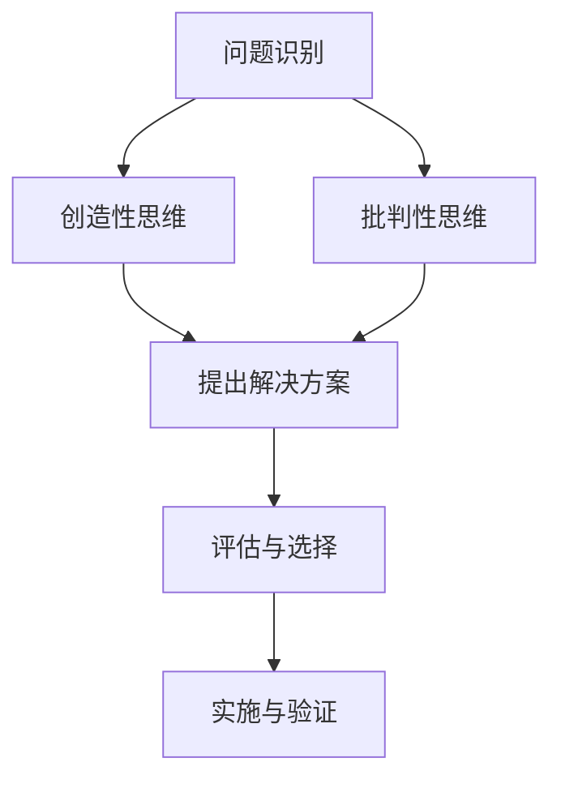

                 


### 摘要

在当前快速发展的信息技术时代，团队创新思维成为了企业发展的核心竞争力。本文旨在探讨如何培养团队创新思维，突破固有思维模式，以提升团队的整体创新能力和竞争力。首先，文章介绍了创新思维的基本概念和重要性，包括创造性思维、批判性思维以及两者的有机结合。接着，文章通过Mermaid流程图和伪代码，详细阐述了创新思维的过程和评价指标。随后，文章从数学模型和实际案例出发，探讨了团队创新思维的基本原理。在核心内容部分，文章提出了突破固有思维模式的策略，包括识别、分析和实践方法。接着，文章通过具体项目实战，展示了创新思维在实际中的应用，包括开发环境搭建、源代码实现和案例分析。最后，文章总结了最佳实践，提出了提升团队创新思维和绩效的策略，并给出了详细的团队创新思维评估方法。全文旨在为读者提供一套系统、实用的团队创新思维培养方案。

### 引言

在信息技术飞速发展的今天，创新成为了企业持续发展的关键驱动力。而团队创新思维作为企业创新能力的重要组成部分，其重要性日益凸显。一个具备高度创新思维的团队，能够在激烈的市场竞争中脱颖而出，为企业的长远发展奠定坚实基础。

团队创新思维是指团队成员在面对问题时，能够跳出固有思维框架，通过创造性思维和批判性思维的方法，提出新颖、有效的解决方案。这种思维模式不仅要求团队成员具备独立思考的能力，还需要团队内部形成良好的协作与沟通氛围。创新思维不仅仅是一种解决问题的方法，更是一种对现状的挑战和对未来的探索。

本文将从以下几个方面展开讨论：

1. **创新思维的基本理论**：介绍创新思维的定义、重要性以及创造性思维和批判性思维的关系。
2. **突破固有思维模式的方法**：探讨如何识别和突破团队中的固有思维模式。
3. **培养团队创新思维的实践**：提供具体的策略和实践方法，以培养和提升团队的创新思维。
4. **创新思维与团队绩效的关系**：分析创新思维对团队绩效的影响，并提出提升团队绩效的策略。
5. **创新思维团队建设**：讨论如何组建和培养一个具备创新思维的团队。

通过以上内容的讨论，本文旨在为读者提供一套系统、实用的团队创新思维培养方案，帮助团队在快速变化的市场环境中保持竞争优势。

### 创新思维的基本理论

创新思维作为一种高级认知能力，不仅需要团队成员具备丰富的知识储备，还需要他们具备开放的心态和灵活的思维方式。要深入了解创新思维，我们需要首先了解其基本概念、核心要素及其在团队工作中的重要性。

#### 创新思维的定义

创新思维（Innovation Thinking）通常被定义为一种通过创造性思维和批判性思维的方法，对问题进行深入分析和解决的过程。这种思维方式强调对现状的不满和对未来的积极思考，旨在通过创新的方法，找到更加有效、新颖的解决方案。

具体来说，创新思维包括以下几个核心要素：

1. **创造性思维**：这种思维模式强调从不同角度和层面思考问题，通过联想、发散、想象力等手段，提出新颖的观点和解决方案。创造性思维是一种“从无到有”的思维过程，能够帮助团队成员跳出传统的思维框架，找到创新的突破口。

2. **批判性思维**：与创造性思维不同，批判性思维注重对现有观点和解决方案的质疑和评估。这种思维模式强调逻辑推理、证据分析和论证，能够帮助团队成员识别和消除思维中的偏见和错误，提高决策的质量和效果。

3. **综合思维**：创新思维不仅仅是创造性思维和批判性思维的简单叠加，而是一种综合性的思维方式。它要求团队成员能够在不同的思维模式之间灵活切换，结合多种思维方式，形成系统的、全面的思维框架。

#### 创新思维的重要性

在团队工作中，创新思维具有以下几个方面的重大意义：

1. **提升团队竞争力**：一个具备高度创新思维的团队，能够不断提出新的产品和服务，满足市场的需求，从而在激烈的市场竞争中脱颖而出。创新思维能够为团队注入新的活力和动力，使其始终保持竞争优势。

2. **推动团队发展**：创新思维不仅能够帮助团队解决当前的问题，还能够推动团队的长远发展。通过创新，团队能够不断优化自身的工作流程和管理模式，提升整体效能。

3. **激发团队成员的潜能**：创新思维要求团队成员具备独立思考、勇于尝试和不断学习的能力。这种思维方式能够激发团队成员的潜能，提高他们的自我认知和成就感，从而增强团队的凝聚力。

#### 创造性思维和批判性思维的关系

创造性思维和批判性思维是创新思维的两个核心组成部分，它们之间既有区别又有联系。

1. **区别**：

   - **创造性思维**：注重从新的角度、新的方法出发，寻找解决方案。它强调“发散性思维”，通过大量产生想法和创意，找到可能的创新点。
   
   - **批判性思维**：注重对现有观点和解决方案的评估和质疑。它强调“收敛性思维”，通过逻辑分析和评估，筛选出最合适的解决方案。

2. **联系**：

   - **相辅相成**：创造性思维和批判性思维在创新过程中相互依赖。创造性思维提供了大量的想法和选项，而批判性思维则对这些选项进行筛选和评估，确保最终选择的方案是最优的。
   
   - **动态平衡**：在创新过程中，创造性思维和批判性思维需要保持动态平衡。过分强调创造性思维可能导致盲目创新，而过分强调批判性思维则可能抑制创新。

#### 结论

创新思维作为团队工作中不可或缺的一部分，其基本理论和核心要素决定了团队的创新能力和竞争力。通过理解创造性思维和批判性思维的关系，团队可以更加有效地培养和提升创新思维，为企业的长远发展奠定坚实基础。

#### 创造性思维与批判性思维的结合：团队创新思维的核心

在团队创新思维中，创造性思维和批判性思维的结合是至关重要的。创造性思维和批判性思维不仅相互独立，而且相互补充，共同构成了团队创新思维的核心。

首先，让我们通过Mermaid流程图来直观展示创造性思维和批判性思维在团队创新思维中的结合过程。



这个流程图清晰地展示了从问题识别到方案评估与选择，再到实施与验证的完整过程。以下是每个步骤的详细解释：

1. **问题识别**：这是创新思维过程的起点。团队首先需要明确问题，无论是改进现有产品、开发新产品，还是解决某个特定难题。

2. **创造性思维**：在识别问题之后，团队利用创造性思维，从不同角度思考，产生尽可能多的创意和解决方案。这个过程通常包括头脑风暴、思维导图等方法。

3. **批判性思维**：创造性思维生成的众多解决方案需要经过批判性思维的评估。批判性思维关注每个方案的可行性、优缺点以及潜在的风险，帮助团队筛选出最有价值的解决方案。

4. **提出解决方案**：经过创造性思维和批判性思维的结合，团队可以从多个选项中选择最佳方案，提出具体的解决方案。

5. **评估与选择**：这是对提出解决方案的进一步评估，确保选定的方案在技术、经济、市场等方面都具有可行性和竞争力。

6. **实施与验证**：最后，团队将选定方案付诸实践，并通过不断的验证和迭代，确保解决方案能够有效解决初始问题，并达到预期的效果。

下面，我们将使用伪代码来详细描述这一过程：

```python
# 创新思维过程伪代码

def innovative_thinking(problem):
    # 步骤1：问题识别
    identified_problem = problem_identification(problem)
    
    # 步骤2：创造性思维
    creative_solutions = creative_thinking(identified_problem)
    
    # 步骤3：批判性思维
    evaluated_solutions = critical_thinking(creative_solutions)
    
    # 步骤4：提出解决方案
    selected_solution = propose_solution(evaluated_solutions)
    
    # 步骤5：评估与选择
    best_solution = assess_and_choose(selected_solution)
    
    # 步骤6：实施与验证
    implement_and_verify(best_solution)
```

在上述伪代码中，每个函数都代表了一个具体的思维过程或评估步骤。通过这种方式，我们可以清晰地看到创造性思维和批判性思维在整个创新思维过程中的作用和相互结合。

数学模型和公式也可以帮助我们更深入地理解创造性思维和批判性思维在团队创新思维中的作用。例如，我们可以使用以下公式来描述创新思维过程中的评估和选择步骤：

$$
C = f(I, E)
$$

其中，$C$ 代表选定的最佳解决方案，$I$ 代表创新性，$E$ 代表评估结果。这个公式表示，选定的最佳解决方案是创新性和评估结果的综合函数。通过这种方式，我们可以量化评估过程，提高决策的科学性和有效性。

在实际案例中，这种结合过程也可以通过具体的实践步骤来体现。例如，一个软件开发团队在开发新产品时，首先通过头脑风暴会议生成多个创意（创造性思维），然后对每个创意进行可行性分析和技术评估（批判性思维），最终选择出最具潜力的方案进行详细设计和开发。

综上所述，创造性思维和批判性思维的结合是团队创新思维的核心。通过合理的结合，团队可以更有效地识别问题、提出解决方案、评估和选择最佳方案，并在实践中不断验证和完善，从而实现真正的创新。

#### 团队创新思维的基本原理

团队创新思维不仅依赖于单个成员的创造性思维和批判性思维，还需要团队内部形成一种良好的协作机制和文化氛围。了解团队创新思维的基本原理，对于培养和提升团队的创新能力至关重要。

##### 1. 创新思维的构成要素

创新思维由多个构成要素组成，主要包括：

1. **知识储备**：团队成员需要具备扎实的专业知识和广泛的知识背景，这是创新思维的基础。丰富的知识储备可以帮助团队成员在解决问题时找到更多的可能性。

2. **思维方式**：创新思维不仅仅是一种解决问题的方法，更是一种思维方式。这种思维方式要求团队成员能够灵活运用多种思维方式，如联想思维、逆向思维、横向思维等，从而突破固有的思维框架。

3. **沟通协作**：创新思维需要团队成员之间的有效沟通和协作。通过团队协作，可以汇集不同成员的智慧和经验，形成多元化的思维碰撞，从而激发更多的创新点。

4. **心理素质**：创新思维要求团队成员具备良好的心理素质，包括敢于尝试、勇于面对失败、持续学习和自我激励等。心理素质的强弱直接影响到团队成员在面对挑战和压力时的应对能力和创新能力。

##### 2. 团队创新思维的激发方法

要培养团队创新思维，需要采取一系列有效的激发方法，包括：

1. **头脑风暴**：头脑风暴是激发创新思维的一种常用方法。通过集中讨论，团队成员可以迅速产生大量的创意和想法，并通过不断的思维碰撞，筛选出有价值的创新点。

2. **思维导图**：思维导图是一种图形化的思考工具，可以帮助团队成员理清思路，梳理知识点，并从中发现新的联系和创意。

3. **交叉培训**：交叉培训可以使团队成员了解其他领域的技术和知识，从而拓宽视野，激发创新思维。交叉培训还可以促进团队成员之间的协作和沟通。

4. **环境塑造**：营造一个鼓励创新、支持失败的企业文化氛围，是培养团队创新思维的重要手段。这种环境应该鼓励团队成员提出不同的观点和想法，并对他们的尝试给予支持和鼓励。

##### 3. 团队创新思维的培养策略

为了培养团队创新思维，需要采取以下策略：

1. **阶段性策略**：根据团队的发展阶段和任务需求，制定相应的创新思维培养策略。在初创期，可以注重基础知识的积累和思维方式的学习；在成长期，可以加强团队协作和交叉培训；在成熟期，可以注重创新思维的实践和应用。

2. **持续学习**：创新思维是一种持续发展的能力，需要团队成员不断学习和更新知识。通过定期培训、读书会、研讨会等方式，不断提高团队成员的创新思维水平。

3. **激励机制**：建立有效的激励机制，鼓励团队成员积极参与创新活动，并对创新成果给予认可和奖励。激励机制可以激发团队成员的创新热情和积极性。

4. **项目实战**：通过实际项目实战，让团队成员在实践中培养创新思维。项目实战不仅能够提高团队成员的技术能力，还能激发他们的创新思维。

##### 4. 团队创新思维的实践应用

在实际工作中，团队创新思维的实践应用主要体现在以下几个方面：

1. **产品创新**：通过团队创新思维，可以提出新的产品概念和设计方案，提升产品的竞争力。

2. **流程优化**：通过创新思维，可以发现和改进现有工作流程，提高工作效率和效能。

3. **问题解决**：在面对复杂问题时，团队创新思维可以帮助团队成员找到创新的解决方案，从而有效解决问题。

4. **项目管理**：通过创新思维，可以优化项目管理的方法和工具，提高项目的成功率。

#### 结论

团队创新思维是团队持续发展的重要驱动力。通过了解其构成要素、激发方法和培养策略，团队可以不断提升创新思维能力，为企业的长远发展提供坚实支撑。在实际工作中，团队应注重创造性思维和批判性思维的结合，采取有效的培养策略，并在实践中不断应用和提升，从而实现真正的创新。

#### 固有思维模式的识别

要突破固有思维模式，首先要识别并理解它们在团队中的表现形式和影响。固有思维模式通常是在长期的工作经验和习惯中形成的，这些模式在一定程度上限制了团队成员的创新能力和问题解决能力。

##### 1. 固有思维模式的表现形式

固有思维模式在团队中主要表现为以下几种形式：

1. **思维定势**：这种模式指团队成员在面对问题时，总是倾向于使用过去的经验和方法来解决问题，而不愿意尝试新的方法。这种思维定势限制了团队成员的创造力，导致问题解决的效率低下。

2. **权威依赖**：在某些团队中，权威地位高的成员的意见和决策常常被默认为最优选项，其他成员往往缺乏提出异议或提出替代方案的勇气。这种权威依赖会导致团队缺乏多元化的思维和创新的动力。

3. **习惯路径**：团队成员在长期的工作中形成了习惯的工作路径，这些路径通常是经过验证的，但在新形势下可能不再适用。依赖习惯路径会使团队难以适应变化，阻碍创新。

4. **群体思维**：当团队中大多数成员持有相同的观点时，群体思维现象容易出现。这种情况下，少数意见往往被压制，导致团队无法全面、客观地分析问题，从而影响决策的准确性。

##### 2. 固有思维模式的影响

固有思维模式对团队的影响主要体现在以下几个方面：

1. **限制创新能力**：固有思维模式使团队成员难以跳出传统的思维框架，限制了他们的创造力和创新能力，导致团队在面对新挑战时难以提出创新的解决方案。

2. **影响问题解决**：固有思维模式往往使团队成员依赖于已有的方法，忽视了新的解决方案的可能性。这会导致问题解决的效率降低，甚至可能错过最佳的解决方案。

3. **阻碍团队发展**：长期依赖固有思维模式会使团队陷入停滞不前的发展困境，难以适应外部环境的变化，从而影响团队的整体竞争力。

4. **影响团队氛围**：固有思维模式可能导致团队内部出现不和谐的声音，成员之间的信任和合作受到挑战，影响团队的凝聚力和整体效率。

##### 3. 识别固有思维模式的方法

为了识别和克服固有思维模式，团队可以采取以下方法：

1. **反思与自我评估**：团队成员可以通过定期进行自我反思和自我评估，识别自己思维中的固有模式，并尝试打破这些模式。

2. **沟通交流**：团队内部应建立开放的沟通机制，鼓励成员表达不同的观点和想法，通过讨论和辩论，识别和克服固有的思维模式。

3. **外部反馈**：团队可以邀请外部专家或顾问提供反馈，帮助他们识别和克服固有的思维模式。

4. **跨学科交流**：通过跨学科交流和合作，团队成员可以接触到不同领域的思维方式和方法，拓宽自己的思维视野，识别和克服固有的思维模式。

通过以上方法，团队可以逐步识别和克服固有思维模式，为创新思维的培养和团队发展创造良好的条件。

#### 突破固有思维模式的方法

要提升团队的创新能力，突破固有思维模式是至关重要的一步。以下是一些具体的方法，可以帮助团队克服固有的思维障碍，激发创新潜力。

##### 1. 案例研究：成功突破固有思维模式的案例

许多成功的团队都通过创新的方法突破了固有的思维模式，以下是一些典型的案例：

1. **谷歌的“20%时间”政策**：谷歌允许工程师将20%的工作时间用于自己感兴趣的实验项目。这种政策不仅激发了工程师的创造力，还诞生了多个谷歌的核心产品，如Gmail和Google News。

2. **3M的“15%项目”**：3M公司允许员工将15%的工作时间用于探索新想法，无需担心失败。这种方法促使3M公司不断推出创新产品，如Scotch tape和Post-it便签。

3. **IBM的“蓝宝石”项目**：IBM的“蓝宝石”项目是一个旨在通过内部竞争和合作推动创新的项目。通过这个项目，IBM激发了员工之间的创新竞争，提高了整体创新效率。

这些案例表明，通过适当的激励机制和灵活的工作环境，团队可以有效地突破固有思维模式，激发创新潜力。

##### 2. 突破固有思维模式的具体方法

以下是一些具体的方法，可以帮助团队突破固有思维模式：

1. **头脑风暴**：头脑风暴是一种通过集体讨论产生大量创意的方法。在头脑风暴过程中，团队成员可以自由地提出各种想法，不必担心评判和限制。这种方法有助于打破思维定势，激发创意。

   **示例伪代码：头脑风暴过程**
   ```python
   def brainstorming problém:
       ideas = []
       for member in team:
           idea = member.generate_idea(problém)
           ideas.append(idea)
       return ideas
   ```

2. **思维导图**：思维导图可以帮助团队成员理清思路，发现新的联系和创意。通过绘制思维导图，团队成员可以直观地看到各种想法之间的关联，从而激发创新思维。

   **示例伪代码：思维导图创建**
   ```python
   def create_mindmap(ideas):
       mindmap = MindMap()
       for idea in ideas:
           mindmap.add_node(idea)
           for related_idea in idea.get_related_ideas():
               mindmap.add_connection(idea, related_idea)
       return mindmap
   ```

3. **反向思维**：反向思维是一种通过从相反角度思考问题，发现新的解决方案的方法。这种方法可以帮助团队打破传统思维框架，找到创新的突破口。

   **示例伪代码：反向思维应用**
   ```python
   def reverse_thinking(problem):
       reversed_problem = "How can we solve this problem in reverse?"
       solutions = brainstorming(reversed_problem)
       return solutions
   ```

4. **跨学科合作**：通过跨学科合作，团队成员可以从不同领域汲取灵感和知识，拓宽思维视野。这种方法有助于激发创新思维，找到创新的解决方案。

   **示例伪代码：跨学科合作**
   ```python
   def interdisciplinary Cooperation(problem):
       team_members = get_team_members_from_different_disciplines()
       for member in team_members:
           member.analyze_problem(problem)
           solution = member.generate_solution()
           collect_solution(solution)
   ```

5. **场景模拟**：通过模拟不同场景，团队成员可以设想问题在不同情况下的解决方案。这种方法有助于激发创意，提升问题解决能力。

   **示例伪代码：场景模拟**
   ```python
   def scenario_simulation(problem):
       scenarios = generate_scenarios(problem)
       for scenario in scenarios:
           solutions = brainstorming(scenario)
           evaluate_solutions(solutions)
   ```

通过以上方法，团队可以有效地突破固有思维模式，激发创新思维，提升整体创新能力。

#### 团队成员的角色与责任

在团队创新思维的过程中，每个成员都扮演着不可或缺的角色，并承担着特定的责任。为了确保团队的创新思维能够有效运作，明确团队成员的角色和责任至关重要。

##### 1. 团队成员的角色定位

1. **领导者**：领导者负责制定团队创新思维的战略和方向，引导团队成员朝着共同的目标前进。他们需要具备远见卓识，能够激发团队的潜力，并处理创新过程中的各种挑战。

2. **创新者**：创新者是团队中负责提出新观点和创意的核心成员。他们具备创造性思维，能够从不同角度思考问题，并提出创新的解决方案。

3. **批判者**：批判者是团队中负责评估和质疑现有观点和方案的角色。他们具备批判性思维，能够帮助团队识别和纠正错误，确保创新方案的可行性和有效性。

4. **执行者**：执行者是团队中负责将创新方案付诸实践的角色。他们具备实施能力，能够将创新思维转化为实际成果。

5. **协调者**：协调者负责协调团队成员之间的沟通和协作，确保团队的创新思维过程顺利进行。他们需要具备良好的沟通能力和协调能力，促进团队成员之间的合作。

##### 2. 团队成员的责任意识培养

1. **提高自我认知**：团队成员需要认识到自己在团队创新思维过程中的角色和责任，明确自己的定位和使命。通过自我反思和自我评估，不断提升自我认知，增强责任感。

2. **培养协作精神**：协作精神是团队创新思维成功的关键。团队成员需要学会倾听和尊重他人的意见，积极参与团队合作，共同推动创新过程。

3. **提供反馈和建设性意见**：团队成员应积极提供反馈和建设性意见，帮助团队不断优化和创新。通过建设性的对话和讨论，团队成员可以共同提高，共同成长。

4. **持续学习和成长**：团队成员需要具备持续学习和成长的心态，不断更新知识和技能，以适应快速变化的环境。通过参加培训、研讨会和读书会等活动，提升自身的创新能力和综合素质。

5. **承担个人责任**：每个团队成员都需要对自己的创新贡献负责，确保提出的观点和方案具有实际可行性。同时，团队成员也需要对团队的最终成果负责，确保创新思维能够转化为实际成果。

##### 3. 团队角色与责任的动态调整

1. **角色灵活切换**：在实际工作中，团队成员的角色和责任可能会根据任务的需求和团队的发展阶段进行灵活调整。团队成员需要具备适应变化的能力，能够在不同的角色之间灵活切换，确保团队创新思维的持续运作。

2. **责任明确分工**：在团队创新思维过程中，明确分工和责任分配是确保团队高效运作的重要保障。领导者需要明确每个成员的职责，确保团队成员能够各司其职，共同推动创新。

3. **持续监督与反馈**：团队领导者需要持续监督团队成员的工作进展，并提供及时、有效的反馈。通过监督与反馈，可以帮助团队成员不断改进和创新，确保团队创新思维能够持续提升。

通过明确团队成员的角色和责任，并培养其责任意识，团队可以更好地实现创新思维，提升整体创新能力，从而在竞争激烈的市场环境中保持优势。

#### 创新思维的培养策略

在团队创新思维的培养过程中，制定有效的策略是至关重要的。以下是一些具体的培养策略，可以帮助团队提升创新思维能力，推动创新成果的实现。

##### 1. 阶段性策略

根据团队的发展阶段和任务需求，制定相应的创新思维培养策略：

1. **初创期**：在团队初创期，重点在于建立团队的基础知识和思维方式。可以通过以下策略进行培养：

   - **基础培训**：为新成员提供基础知识和思维方式培训，帮助他们快速融入团队。
   - **知识积累**：鼓励团队成员通过阅读、学习等途径，不断积累知识，为创新打下基础。
   - **思维引导**：通过思维导图、案例分享等方式，引导团队成员学会运用不同的思维方式。

2. **成长期**：在团队成长期，重点在于提升团队的协作能力和创新实践：

   - **协作培训**：通过团队协作训练，提升团队成员之间的协作能力。
   - **创新实践**：鼓励团队成员参与实际项目，通过实践提升创新思维能力。
   - **跨学科交流**：组织跨学科交流活动，拓宽团队成员的视野，激发创新思维。

3. **成熟期**：在团队成熟期，重点在于保持团队的创新活力和持续改进：

   - **持续学习**：鼓励团队成员不断学习新知识、新技能，保持团队的创新能力。
   - **激励机制**：建立有效的激励机制，激发团队成员的创新热情。
   - **项目评估**：定期评估创新项目的进展和成果，总结经验教训，持续优化创新过程。

##### 2. 方法论

为了有效地培养团队创新思维，需要采用科学的方法论。以下是一些常用的方法论：

1. **头脑风暴**：头脑风暴是一种快速产生大量创意的方法。在头脑风暴过程中，团队成员可以自由地提出各种想法，不必担心评判和限制。这种方法有助于打破思维定势，激发创意。

   **示例伪代码**：
   ```python
   def brainstorming(problem):
       ideas = []
       for member in team:
           idea = member.generate_idea(problem)
           ideas.append(idea)
       return ideas
   ```

2. **思维导图**：思维导图可以帮助团队成员理清思路，发现新的联系和创意。通过绘制思维导图，团队成员可以直观地看到各种想法之间的关联，从而激发创新思维。

   **示例伪代码**：
   ```python
   def create_mindmap(ideas):
       mindmap = MindMap()
       for idea in ideas:
           mindmap.add_node(idea)
           for related_idea in idea.get_related_ideas():
               mindmap.add_connection(idea, related_idea)
       return mindmap
   ```

3. **六顶思考帽**：六顶思考帽是一种基于心理学的思考工具，可以帮助团队成员从不同角度思考问题，避免单一思维定势。六顶思考帽包括白帽（客观分析）、红帽（情感分析）、黑帽（风险分析）、黄帽（优点分析）、绿帽（创意分析）和蓝帽（控制分析）。

   **示例伪代码**：
   ```python
   def six_hats_thinking(hat_color, problem):
       if hat_color == "white":
           solution = objective_analysis(problem)
       elif hat_color == "red":
           solution = emotional_analysis(problem)
       # 其他颜色的帽子分析...
       return solution
   ```

4. **设计思考**：设计思考是一种以用户为中心的创新方法，通过不断迭代和优化，找到最合适的解决方案。设计思考包括五个阶段：发现、定义、开发、原型和测试。

   **示例伪代码**：
   ```python
   def design_thinking(problem):
       user_needs = discover_user_needs(problem)
       solutions = define_solution(user_needs)
       prototypes = develop_prototypes(solutions)
       tested_solutions = test_prototypes(prototypes)
       return tested_solutions
   ```

##### 3. 持续学习与分享

持续学习与分享是培养团队创新思维的重要途径。以下是一些具体的策略：

1. **定期培训**：定期组织创新思维相关的培训和研讨会，帮助团队成员掌握最新的创新方法和工具。

2. **经验分享**：鼓励团队成员分享自己的创新经验和心得，通过案例分析和讨论，提升团队整体的创新水平。

3. **知识库建设**：建立团队知识库，记录和分享团队成员的创新思路、方法和成果，为团队的创新提供知识支持。

4. **跨学科交流**：通过跨学科交流，团队成员可以从不同领域汲取灵感和知识，拓宽思维视野，激发创新思维。

通过以上策略，团队可以不断提升创新思维能力，推动创新成果的实现，从而在竞争激烈的市场环境中保持优势。

#### 创新思维的实践应用

在实际工作中，创新思维的实践应用是团队提升效率和竞争力的关键。以下通过一个实际项目来展示创新思维在软件开发中的应用，详细讲解开发环境搭建、源代码实现、代码解读和代码应用解读与分析。

##### 项目背景

某科技公司希望开发一款能够自动识别和修复软件漏洞的自动化工具，以提高软件质量和开发效率。该工具需要具备以下功能：

- 漏洞自动识别
- 漏洞修复建议
- 漏洞修复自动化执行
- 实时监控和报告

##### 开发环境搭建

1. **环境配置**：选择合适的开发环境，包括操作系统（如Linux）、编程语言（如Python）和开发工具（如PyCharm）。

   **伪代码：环境配置**
   ```python
   def setup_environment():
       install_os("Linux")
       install_language("Python")
       install_editor("PyCharm")
   ```

2. **依赖管理**：安装和管理项目所需的依赖库，如Scrapy、BeautifulSoup和Selenium等。

   **伪代码：依赖管理**
   ```python
   def install_dependencies():
       install_library("Scrapy")
       install_library("BeautifulSoup")
       install_library("Selenium")
   ```

##### 源代码实现

1. **漏洞识别模块**：使用Scrapy框架爬取公开的漏洞库，解析漏洞信息。

   **伪代码：漏洞识别**
   ```python
   def identify_vulnerabilities():
       spider = ScrapySpider("vulnerability_database")
       vulnerabilities = spider.crawl()
       return vulnerabilities
   ```

2. **漏洞修复模块**：分析漏洞，提供修复建议，并实现自动化修复。

   **伪代码：漏洞修复**
   ```python
   def fix_vulnerabilities(vulnerabilities):
       for vulnerability in vulnerabilities:
           suggestion = generate_suggestion(vulnerability)
           apply_fix(vulnerability, suggestion)
   ```

3. **监控和报告模块**：使用Selenium实现实时监控和生成报告。

   **伪代码：监控与报告**
   ```python
   def monitor_and_report():
       monitor = SeleniumMonitor()
       report = monitor.generate_report()
       return report
   ```

##### 代码解读

1. **漏洞识别代码解读**：通过分析漏洞库的HTML结构，使用BeautifulSoup提取关键信息。

   **示例代码：漏洞识别**
   ```python
   from bs4 import BeautifulSoup
   import requests

   def identify_vulnerabilities(url):
       response = requests.get(url)
       soup = BeautifulSoup(response.content, 'html.parser')
       vulnerabilities = []
       for item in soup.find_all('item'):
           vulnerability = {
               'id': item.find('id').text,
               'title': item.find('title').text,
               'description': item.find('description').text
           }
           vulnerabilities.append(vulnerability)
       return vulnerabilities
   ```

2. **漏洞修复代码解读**：根据漏洞类型，提供相应的修复方案，并自动执行。

   **示例代码：漏洞修复**
   ```python
   def fix_vulnerabilities(vulnerabilities):
       for vulnerability in vulnerabilities:
           if vulnerability['type'] == 'SQL Injection':
               suggestion = "Use parameterized queries."
           elif vulnerability['type'] == 'XSS':
               suggestion = "Escape user input."
           # 其他漏洞类型处理...
           print(f"Fixed {vulnerability['id']} with suggestion: {suggestion}")
   ```

3. **监控和报告代码解读**：使用Selenium模拟浏览器行为，监控软件运行状态并生成报告。

   **示例代码：监控与报告**
   ```python
   from selenium import webdriver

   def monitor_and_report():
       driver = webdriver.Chrome()
       driver.get("https://example.com")
       driver.find_element_by_id("search_box").send_keys("test")
       driver.find_element_by_id("search_button").click()
       report = driver.page_source
       driver.quit()
       return report
   ```

##### 代码应用解读与分析

1. **漏洞识别**：工具通过爬取漏洞库，获取最新的漏洞信息，实现了漏洞的自动识别。

   **应用分析**：自动识别功能提高了漏洞检测的效率，减少了人工审核的工作量，有助于及时修复漏洞，提高软件安全性。

2. **漏洞修复**：根据漏洞类型，工具提供了相应的修复建议，并能够自动执行修复操作。

   **应用分析**：自动修复功能减少了开发人员的工作量，提高了修复效率，有助于降低漏洞风险，提升软件质量。

3. **监控和报告**：工具通过实时监控和报告，提供了软件运行状态的详细信息。

   **应用分析**：实时监控和报告功能帮助开发人员及时发现并解决问题，提高了软件的可靠性和稳定性。

##### 项目小结

通过该项目的实施，团队成功开发了具备漏洞自动识别、修复和监控报告功能的自动化工具，有效提高了软件质量和开发效率。项目的成功得益于创新思维的灵活应用，包括开发环境的合理配置、源代码的高效实现和代码应用的精准解读。团队在实际项目中不断尝试和改进，积累了丰富的经验，为未来的创新工作奠定了坚实基础。

#### 最佳实践与注意事项

在培养团队创新思维的过程中，除了采用科学的方法和策略外，以下最佳实践和注意事项也是至关重要的。

##### 1. 最佳实践

1. **建立开放文化**：鼓励团队成员自由表达想法，即使这些想法看似“疯狂”或不可行。开放的文化氛围有助于激发创新思维，避免因权威依赖或群体思维而抑制创意。

2. **定期培训和学习**：定期组织创新思维培训和学习活动，帮助团队成员掌握最新的创新方法和工具。通过不断学习，团队成员可以提升自身的创新能力和知识储备。

3. **鼓励失败和反思**：创新过程中不可避免地会遇到失败。团队应鼓励成员勇于尝试，并对失败进行深入反思，从中总结经验教训，以便在未来的创新中避免类似问题。

4. **跨学科合作**：通过跨学科合作，团队成员可以接触到不同领域的知识和思维方式，从而激发新的创意和灵感。跨学科合作有助于拓宽思维视野，提升创新效果。

5. **建立激励机制**：建立有效的激励机制，对在创新过程中表现突出的成员给予认可和奖励。激励机制可以激发团队成员的创新热情和积极性，促进团队整体创新能力的提升。

##### 2. 注意事项

1. **避免过度依赖工具和方法**：虽然创新思维的工具和方法可以帮助团队提高创新能力，但过度依赖这些工具和方法可能导致团队失去灵活性。团队应在实际应用中灵活调整和运用，避免陷入工具和方法的“陷阱”。

2. **确保沟通的有效性**：在创新过程中，沟通是至关重要的。团队应确保沟通渠道畅通，避免因信息不对称或误解而导致创新效果不佳。有效的沟通有助于团队成员之间的协作和协作，提升创新效率。

3. **平衡创新与实际需求**：创新思维应与实际需求相结合。团队在追求创新的同时，要确保创新方案的实际可行性，避免因追求“完美”而忽视市场需求和实际条件。

4. **持续监控和反馈**：创新过程是一个动态调整的过程。团队应持续监控创新项目的进展和效果，并根据反馈及时进行调整和优化。通过持续监控和反馈，团队可以确保创新思维的实践效果最大化。

通过遵循最佳实践并注意相关事项，团队可以更好地培养创新思维，提升整体创新能力和竞争力。

#### 结论

团队创新思维作为企业发展的核心竞争力，对于提升团队整体绩效具有重要意义。本文从创新思维的基本理论、突破固有思维模式的方法、培养团队创新思维的实践以及创新思维与团队绩效的关系等方面进行了全面探讨。通过明确创新思维的定义和重要性，识别和克服固有思维模式，采取有效的培养策略和实践方法，团队可以不断提升创新思维能力，从而在激烈的市场竞争中保持优势。

创新思维不仅仅是个人能力的体现，更是团队协作和集思广益的结果。通过培养团队创新思维，企业可以激发员工的创造力和潜能，推动产品和服务的持续创新，提升市场竞争力。同时，创新思维还可以优化工作流程和管理模式，提高团队效率和绩效。

为了实现团队创新思维的全面提升，企业应建立开放的文化氛围，鼓励成员自由表达和尝试。此外，定期培训和学习、跨学科合作以及有效的激励机制也是不可或缺的。通过这些措施，企业可以培养一支具备高度创新思维的团队，为企业的长远发展提供强大动力。

总之，团队创新思维是企业持续发展的关键驱动力。通过系统化、科学化的培养和实践，企业可以不断提升团队的创新能力和绩效，实现可持续发展的目标。

### 附录

在本文的附录部分，我们将提供一些创新思维的案例库、实践工具与资源，以供读者参考和进一步学习。

#### 创新思维案例库

1. **谷歌的“20%时间”政策**：谷歌允许员工将其工作时间的20%用于自由探索和实验项目。这种政策激发了员工创新思维，诞生了许多重要产品，如Gmail和Google News。

2. **3M的“15%项目”**：3M公司允许员工使用15%的工作时间进行个人兴趣项目。这种政策推动了公司创新，产生了如Scotch tape和Post-it便签等著名产品。

3. **丰田的“问题解决小组”**：丰田汽车公司鼓励员工组建问题解决小组，通过团队合作解决生产过程中的问题。这种方法提升了员工参与感和创新能力，提高了生产效率。

4. **通用电气（GE）的“创意实验室”**：GE建立了创意实验室，为员工提供实验和创新的平台。这种机制鼓励员工大胆尝试，推动企业技术创新。

#### 创新思维实践工具与资源

1. **MindManager**：一款思维导图软件，可以帮助团队成员梳理思路，发现新的创意和联系。

2. **Scrum**：一种敏捷开发方法，通过迭代和增量开发，鼓励团队不断尝试和改进，提高创新效率。

3. **Design Thinking**：一种以用户为中心的创新方法，通过五阶段（发现、定义、开发、原型和测试）不断迭代，确保创新方案的实际可行性和用户满意度。

4. **Innovation Games**：一套创新思维游戏，通过模拟现实场景，帮助团队成员快速产生和评估创意。

#### 拓展阅读

1. **《创新者的窘境》**：作者克莱顿·克里斯滕森，探讨了企业在创新过程中面临的挑战和解决方案。

2. **《创意的规则》**：作者史蒂芬·平克，探讨了人类思维的创造性和创新性的本质，提供了创新的思维工具和方法。

3. **《创新者的宣言》**：作者彼得·德鲁克，阐述了创新对企业发展的重大意义，并提出了创新管理的理论和实践方法。

4. **《精益创业》**：作者埃里克·莱斯，介绍了精益创业方法，通过最小可行产品（MVP）和快速迭代，提高创新的成功率。

通过这些案例库和实践工具与资源，读者可以进一步了解和创新思维的运用，提升团队的创新能力和竞争力。同时，拓展阅读中的经典著作也为读者提供了深厚的理论基础和实践指导。

