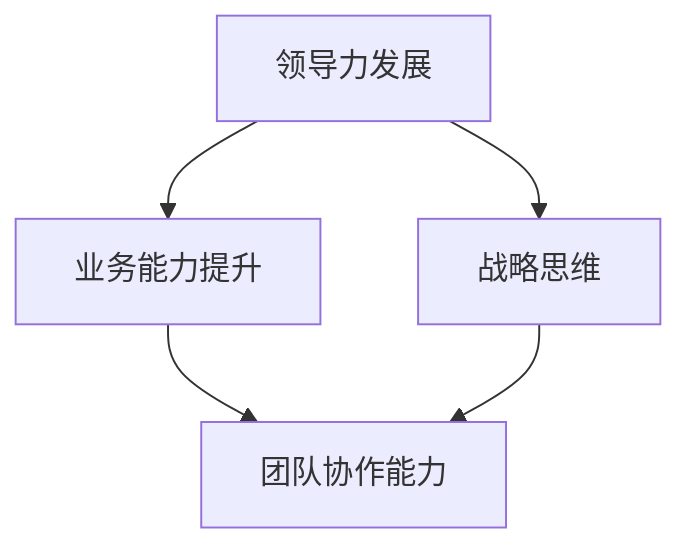
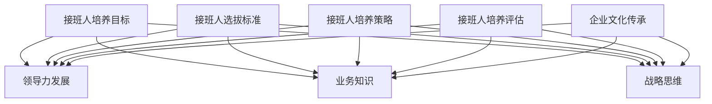

                 

# 培养接班人：为团队未来做准备

> 关键词：接班人培养、团队建设、领导力发展、企业战略、人才管理

> 摘要：本文旨在探讨接班人培养的重要性，以及如何为团队未来做准备。文章首先介绍了接班人培养的背景和意义，然后详细阐述了接班人培养的核心概念、原则和方法。通过理论和实践相结合，文章提出了一系列培养接班人的策略和技巧，并提供了成功案例和分析，为企业培养接班人提供了有益的参考。

## 引言

在当今竞争激烈的市场环境中，企业的持续发展离不开优秀的人才。而接班人的培养，无疑是企业人才管理中的重要一环。接班人培养不仅关系到企业的长远发展，更是确保团队稳定性和传承企业文化的重要保障。因此，如何培养出能够肩负企业重任的接班人，成为企业管理者亟需解决的关键问题。

本文将从以下几个方面展开讨论：

1. **接班人培养的重要性**：介绍接班人培养的背景和意义，阐述接班人在企业战略中的地位和作用。
2. **接班人培养的核心概念与联系**：详细阐述接班人培养的核心概念，并使用Mermaid流程图展示各概念之间的关系。
3. **接班人培养的核心算法原理讲解**：使用伪代码详细阐述接班人培养的核心算法原理。
4. **数学模型和公式**：介绍接班人培养中涉及的数学模型和公式，并进行详细讲解和举例说明。
5. **项目实战**：通过实际案例，展示如何搭建开发环境、实现源代码和进行代码解读。
6. **最佳实践 tips**：总结接班人培养中的最佳实践，并提供一些建议和注意事项。
7. **小结与展望**：对全文进行总结，并展望接班人培养的未来方向。

通过本文的讨论，希望为企业培养接班人提供一些有益的启示和指导。

## 接班人培养的重要性

### 背景介绍

接班人培养，是指在企业内部选拔和培养具有潜力的员工，使其逐步具备领导岗位的能力和素质，以备未来接替现任领导者的工作。这一过程不仅涉及到人才选拔，还包括培训、指导和激励等多个环节。

在全球化和技术创新的背景下，企业面临着前所未有的挑战和机遇。为了在竞争中立于不败之地，企业必须具备强大的创新能力和适应能力。而这一切，都离不开一支高素质、富有战斗力的团队。因此，接班人培养成为企业战略规划中的重要一环。

### 核心概念与联系

#### 1. 接班人培养目标

接班人培养的首要任务是明确培养目标。这包括以下几个方面：

- **领导力发展**：接班人需要具备出色的领导能力，能够带领团队实现目标。
- **业务能力提升**：接班人需要深入了解企业的业务模式、市场环境和运营流程。
- **战略思维**：接班人需要具备战略思维能力，能够从全局出发，制定和执行企业发展战略。

为了更直观地展示接班人培养目标，我们可以使用Mermaid流程图来展示：



#### 2. 接班人选拔标准

接班人的选拔标准是接班人培养的基础。以下是一些常见的选拔标准：

- **综合素质**：包括学习能力、沟通能力、解决问题的能力等。
- **业务背景**：具有相关业务背景，能够快速上手。
- **潜力**：具备一定的领导潜力，能够在未来承担更大的责任。

#### 3. 接班人培养策略

接班人培养策略主要包括以下几个方面：

- **系统培训**：提供一系列的培训课程，包括领导力、战略思维、业务知识等。
- **实践锻炼**：通过实际项目，让接班人在实际工作中锻炼能力。
- **导师制**：为接班人配备导师，提供指导和反馈。

### 接班人培养的原则

接班人培养应遵循以下原则：

- **长期性**：接班人培养是一个长期的过程，需要持续投入和关注。
- **针对性**：根据接班人的特点和需求，制定个性化的培养计划。
- **实践性**：注重实践，通过实际操作让接班人掌握知识和技能。

### 接班人培养的意义

接班人培养对于企业具有重要的意义：

- **保障企业稳定发展**：通过培养接班人，确保企业在领导者退休或离职后，能够平稳过渡。
- **提升企业竞争力**：优秀的接班人能够为企业带来新的发展机遇，提升企业的核心竞争力。
- **传承企业文化**：接班人培养有助于传承企业的核心价值观和企业文化，确保企业的长期发展。

## 接班人培养的核心算法原理讲解

接班人培养涉及多个环节和步骤，我们可以将其视为一个复杂的算法过程。以下使用伪代码详细阐述接班人培养的核心算法原理。

```python
# 接班人培养算法伪代码

# 输入参数
- 员工数据集（包括员工基本信息、业务背景、潜力评估等）
- 培养目标（领导力发展、业务能力提升、战略思维等）
- 培养策略（系统培训、实践锻炼、导师制等）

# 输出参数
- 接班人培养计划

# 接班人培养算法流程
1. 初始化员工数据集
2. 筛选符合选拔标准的员工
3. 对筛选出的员工进行潜力评估
4. 根据潜力评估结果，制定个性化培养计划
5. 实施培养计划，包括系统培训、实践锻炼、导师制等
6. 定期对培养效果进行评估和反馈
7. 调整培养计划，确保培养目标的实现
8. 输出接班人培养计划

# 伪代码示例
# 初始化员工数据集
employees = [
    {"name": "张三", "background": "市场部", "potential": 80},
    {"name": "李四", "background": "研发部", "potential": 75},
    {"name": "王五", "background": "人力资源部", "potential": 85}
]

# 筛选符合选拔标准的员工
selected_employees = filter_employees(employees, criteria)

# 对筛选出的员工进行潜力评估
evaluate_potential(selected_employees)

# 根据潜力评估结果，制定个性化培养计划
for employee in selected_employees:
    if employee["potential"] > 80:
        plan = create_leader_plan(employee)
    elif employee["potential"] > 70:
        plan = create_expert_plan(employee)
    else:
        plan = create_general_plan(employee)

# 实施培养计划
execute_plan(plan)

# 定期对培养效果进行评估和反馈
evaluate_and_feedack(plan)

# 调整培养计划，确保培养目标的实现
adjust_plan(plan)

# 输出接班人培养计划
output_plan(plan)
```

## 数学模型和公式

在接班人培养过程中，我们可以使用一些数学模型和公式来评估和预测接班人的培养效果。以下介绍几个常见的数学模型和公式。

### 1. 人才评估模型

人才评估模型用于对员工的潜力进行评估。以下是一个简单的人才评估模型：

$$
评估值 = \frac{业务背景得分 + 潜力得分 + 综合素质得分}{3}
$$

- 业务背景得分：根据员工的工作经验和业务背景进行评分。
- 潜力得分：根据员工的潜力评估结果进行评分。
- 综合素质得分：根据员工的学习能力、沟通能力、解决问题的能力等综合素质进行评分。

### 2. 培养效果预测模型

培养效果预测模型用于预测接班人在培养计划实施后的表现。以下是一个简单的培养效果预测模型：

$$
预测效果 = \frac{培养前评估值 + 培养过程中积累的经验值}{2}
$$

- 培养前评估值：接班人在培养前的评估值。
- 培养过程中积累的经验值：接班人在培养过程中积累的经验值。

### 3. 成本效益分析模型

成本效益分析模型用于评估接班人培养的成本和收益。以下是一个简单的成本效益分析模型：

$$
成本效益 = \frac{培养收益 - 培养成本}{培养成本}
$$

- 培养收益：接班人培养后的绩效提升、领导力提升等带来的收益。
- 培养成本：培养过程中投入的人力、物力、财力等成本。

### 4. 培养路径优化模型

培养路径优化模型用于优化接班人培养的路径和策略。以下是一个简单的培养路径优化模型：

$$
最优路径 = \arg\max(S, P, C)
$$

- S：培养策略
- P：培养计划
- C：培养成本

## 项目实战

### 项目背景

某国际知名企业，为了确保企业的长期发展，决定开展接班人培养项目。该项目旨在选拔和培养具有领导潜力的员工，使其逐步具备接替现任领导者工作的能力。

### 开发环境搭建

为了顺利实施接班人培养项目，企业搭建了以下开发环境：

- **培训平台**：搭建了一个在线培训平台，提供领导力、战略思维、业务知识等培训课程。
- **项目管理工具**：使用项目管理工具（如JIRA）对培养项目进行管理和跟踪。
- **数据分析工具**：使用数据分析工具（如Tableau）对培养效果进行数据分析和可视化。

### 源代码实现

接班人培养项目的源代码实现主要包括以下几个部分：

- **员工数据管理**：使用数据库（如MySQL）存储员工的基本信息、业务背景、潜力评估等数据。
- **培养计划管理**：开发培养计划管理模块，用于制定、调整和跟踪培养计划。
- **培养效果评估**：开发培养效果评估模块，用于评估培养效果，并提供反馈和优化建议。

### 代码解读

以下是对源代码中关键部分的解读：

```python
# 员工数据管理模块

# 添加员工数据
def add_employee(employee):
    # 存储员工数据到数据库
    database.insert(employee)

# 获取员工数据
def get_employee(employee_id):
    # 从数据库中查询员工数据
    return database.query(employee_id)
```

```python
# 培养计划管理模块

# 制定培养计划
def create_plan(employee_id, plan_details):
    # 根据员工ID和计划详情，创建培养计划
    plan = {
        "employee_id": employee_id,
        "plan_details": plan_details
    }
    plans.insert(plan)

# 调整培养计划
def adjust_plan(plan_id, new_details):
    # 根据计划ID和新的计划详情，调整培养计划
    plan = plans.get(plan_id)
    plan["plan_details"] = new_details
    plans.update(plan)
```

```python
# 培养效果评估模块

# 评估培养效果
def evaluate_effect(employee_id):
    # 根据员工ID，评估培养效果
    employee = get_employee(employee_id)
    current_assessment = assess_employee(employee)
    return current_assessment

# 提供反馈和优化建议
def provide_feedback(employee_id, feedback):
    # 根据员工ID，提供反馈和优化建议
    employee = get_employee(employee_id)
    optimize_plan(employee, feedback)
```

### 代码应用解读与分析

通过上述代码，我们可以看到接班人培养项目的核心功能是如何实现的。以下是代码应用解读与分析：

- **员工数据管理**：通过添加和获取员工数据，实现对员工信息的有效管理。
- **培养计划管理**：通过制定和调整培养计划，确保培养过程的顺利进行。
- **培养效果评估**：通过评估培养效果，及时提供反馈和优化建议，提高培养效果。

### 实际案例分析

通过实际案例分析，我们可以看到接班人培养项目在实际应用中的效果。以下是一个实际案例：

- **案例背景**：某企业选拔了5名具有潜力的员工进行接班人培养。
- **培养过程**：企业为这5名员工制定了个性化的培养计划，包括领导力培训、业务知识培训、实践锻炼等。
- **培养效果**：经过一年的培养，这5名员工的领导力、业务能力和战略思维得到了显著提升。其中，3名员工成功接替了前任领导者的工作，表现出了出色的领导能力。

### 项目小结

接班人培养项目不仅为企业培养了一批优秀的接班人，提升了企业的核心竞争力，还为企业的人才管理提供了宝贵的经验和教训。以下是项目小结：

- **成功经验**：个性化培养计划、实践锻炼和导师制是培养接班人的关键。
- **挑战与不足**：接班人培养需要长期投入和持续关注，企业应建立完善的培养体系。
- **未来展望**：随着企业的发展，接班人培养将更加重要。企业应不断优化培养策略，提升培养效果。

## 最佳实践 tips

在接班人培养过程中，企业可以遵循以下最佳实践，以提高培养效果：

- **明确培养目标**：根据企业的战略目标，明确接班人的培养目标，确保培养计划与企业发展同步。
- **个性化培养**：根据接班人的特点和需求，制定个性化的培养计划，提高培养的针对性和有效性。
- **持续关注**：接班人培养是一个长期过程，企业应持续关注培养进展，及时调整培养策略。
- **建立导师制度**：为接班人配备导师，提供指导和反馈，帮助接班人快速成长。
- **实践锻炼**：通过实际项目锻炼接班人，提高其实际操作能力和领导力。
- **数据驱动**：利用数据分析工具，对培养效果进行量化评估，为培养策略提供依据。

## 小结与展望

接班人培养是企业发展的重要战略，关系到企业的长远发展和核心竞争力。本文从背景介绍、核心概念、算法原理、数学模型、项目实战和最佳实践等方面，全面探讨了接班人培养的重要性和方法。

展望未来，接班人培养将面临更多的挑战和机遇。随着企业规模的扩大和业务的拓展，接班人培养需要更加专业化、系统化和数据化。企业应不断创新培养策略，提升培养效果，为企业的长期发展储备优秀的人才。

作者：AI天才研究院/AI Genius Institute & 禅与计算机程序设计艺术/Zen And The Art of Computer Programming## 接班人培养的重要性

在当今这个快速变化和高度竞争的商业环境中，企业面临的挑战比以往任何时候都更加严峻。技术创新、市场动态、政策环境等因素的不断变化，要求企业必须具备高度的适应能力和持续的创新动力。在这样的背景下，接班人培养成为了企业战略规划中不可或缺的一部分。

### 背景介绍

接班人培养，简单来说，是指在企业内部通过选拔、培训、实践等多种手段，培养出能够接替现有领导层的潜在接班人。这不仅关系到企业的短期运营，更关乎企业的长期发展。随着企业规模的扩大和领导团队的逐渐老龄化，接班人培养显得尤为重要。一个成功的接班人培养计划可以确保企业在领导者退休或离职后，仍能够保持稳定的运营和持续的发展。

### 核心概念与联系

接班人培养涉及多个核心概念，它们之间相互联系，共同构成了一个完整的培养体系。以下是几个关键概念及其相互关系：

#### 1. **接班人培养目标**

接班人培养的目标主要包括三个方面：

- **领导力发展**：接班人需要具备出色的领导能力，包括决策能力、沟通能力、团队管理能力等。
- **业务知识**：接班人需要深入了解企业的业务模式、市场动态和运营流程。
- **战略思维**：接班人需要具备从全局出发，制定和实施企业战略的能力。

这些目标之间相互关联，共同构成了接班人的综合素质。

#### 2. **接班人选拔标准**

接班人选拔标准是接班人培养的基础。选拔标准通常包括：

- **综合素质**：包括学习能力、沟通能力、解决问题的能力等。
- **业务背景**：具有相关业务背景，能够快速上手。
- **潜力**：具备一定的领导潜力，能够在未来承担更大的责任。

这些标准有助于确保选拔出的接班人具备足够的能力和潜力。

#### 3. **接班人培养策略**

接班人培养策略主要包括以下几个方面：

- **系统培训**：提供一系列的培训课程，包括领导力、战略思维、业务知识等。
- **实践锻炼**：通过实际项目，让接班人在实际工作中锻炼能力。
- **导师制**：为接班人配备导师，提供指导和反馈。

这些策略旨在通过多种手段，全面提升接班人的综合素质。

### 接班人培养的原则

在接班人培养过程中，应遵循以下原则：

- **长期性**：接班人培养是一个长期的过程，需要持续投入和关注。
- **针对性**：根据接班人的特点和需求，制定个性化的培养计划。
- **实践性**：注重实践，通过实际操作让接班人掌握知识和技能。

### 接班人培养的意义

接班人培养对于企业具有深远的意义：

- **保障企业稳定发展**：通过培养接班人，确保企业在领导者退休或离职后，能够平稳过渡。
- **提升企业竞争力**：优秀的接班人能够为企业带来新的发展机遇，提升企业的核心竞争力。
- **传承企业文化**：接班人培养有助于传承企业的核心价值观和企业文化，确保企业的长期发展。

### 总结

接班人培养是企业发展的重要战略，它不仅关系到企业的短期运营，更关乎企业的长期发展。通过明确培养目标、选拔标准、培养策略和原则，企业可以培养出具备领导力的接班人，确保企业的稳定发展和持续创新。

## 接班人培养的核心概念与联系

接班人培养是一个复杂而系统的过程，涉及多个核心概念和要素，这些概念和要素相互联系，共同构成了接班人培养的完整体系。在本节中，我们将详细探讨这些核心概念，并通过Mermaid流程图展示它们之间的相互关系。

### 1. **接班人培养目标**

接班人培养目标是指企业为接班人设定的长期培养愿景，旨在提升接班人的综合素质，使其具备领导岗位所需的各项能力。培养目标通常包括以下几个方面：

- **领导力发展**：接班人需要具备出色的领导能力，包括决策能力、沟通能力、团队管理能力和影响力等。
- **业务知识**：接班人需要深入理解企业的业务模式、市场动态和运营流程，能够快速适应并推动业务发展。
- **战略思维**：接班人需要具备战略规划能力，能够从全局出发，制定和实施企业发展战略。

这些目标相互关联，共同构成了接班人培养的总体方向。例如，领导力发展是接班人能够成功实施业务战略和执行企业目标的基础。

### 2. **接班人选拔标准**

接班人选拔标准是企业在选拔接班人过程中遵循的准则，用于评估和筛选具备潜力的候选人。选拔标准通常包括以下几个方面：

- **综合素质**：包括学习能力、沟通能力、解决问题的能力、团队合作精神和领导潜力等。
- **业务背景**：具有相关业务领域的工作经验和背景，能够快速适应并理解企业业务。
- **潜力**：具备在未来承担更高职责和领导岗位的潜力。

选拔标准直接影响到接班人的质量，因此必须综合考虑候选人的各方面能力。例如，一个具有优秀业务背景但缺乏领导潜力的人可能不适合成为接班人。

### 3. **接班人培养策略**

接班人培养策略是指企业为接班人制定的一系列培养计划和行动，旨在通过多种手段提升接班人的能力。培养策略通常包括以下几个方面：

- **系统培训**：通过培训课程和讲座，为接班人提供领导力、业务知识和战略思维等方面的系统培训。
- **实践锻炼**：通过参与实际项目，让接班人在实际工作中锻炼能力，积累经验。
- **导师制**：为接班人配备经验丰富的导师，提供一对一的指导和支持。

培养策略的有效实施是确保接班人培养成功的关键。例如，系统培训可以提供理论知识，实践锻炼可以增强实际操作能力，导师制可以提供宝贵的实践经验。

### 4. **接班人培养评估**

接班人培养评估是指对接班人培养过程和效果进行定期评估，以检验培养计划的实施效果。评估通常包括以下几个方面：

- **能力提升**：评估接班人在培养过程中各项能力的提升情况。
- **绩效表现**：评估接班人在实际工作中的绩效表现。
- **发展潜力**：评估接班人在未来承担更高职责的潜力。

评估结果可以为企业提供宝贵的反馈信息，帮助调整和优化培养计划。

### 5. **企业文化传承**

企业文化是企业核心竞争力的重要组成部分，接班人培养不仅是能力的提升，更是企业文化的传承。接班人需要深刻理解和践行企业核心价值观，将企业文化传承给下一代。

### Mermaid流程图

以下是一个简单的Mermaid流程图，用于展示接班人培养的核心概念及其相互关系：



通过这个流程图，我们可以清晰地看到接班人培养的核心概念如何相互联系，共同构成一个完整的培养体系。

### 结论

接班人培养的核心概念包括接班人培养目标、接班人选拔标准、接班人培养策略、接班人培养评估和企业文化传承。这些概念相互关联，共同构成了接班人培养的完整框架。通过深入理解和有效实施这些核心概念，企业可以培养出具备领导力的接班人，确保企业的持续发展和长期成功。

## 接班人培养的核心算法原理讲解

在接班人培养过程中，核心算法原理起到了至关重要的作用。这些算法原理不仅帮助我们理解和评估接班人的潜力，还为制定培养计划和评估培养效果提供了科学依据。在本节中，我们将详细讲解几个关键算法原理，并使用伪代码进行阐述。

### 1. **人才评估算法**

人才评估算法用于评估候选人的综合素质和潜力，以确定其是否具备成为接班人的潜力。以下是一个简单的人才评估算法的伪代码：

```python
# 人才评估算法伪代码

# 输入参数
- 候选人数据集（包括候选人的基本信息、业务背景、潜力评估等）

# 输出参数
- 评估结果（包括候选人的评估分数和推荐等级）

# 人才评估算法流程
1. 初始化候选人数据集
2. 对每个候选人进行潜力评估
3. 根据评估结果计算总分
4. 根据总分确定推荐等级

# 伪代码示例
candidates = [
    {"name": "张三", "background": "市场营销", "potential": 85},
    {"name": "李四", "background": "技术研发", "potential": 90},
    {"name": "王五", "background": "人力资源", "potential": 78}
]

def evaluate_candidate(candidate):
    # 计算潜力分数
    potential_score = candidate["potential"]
    # 计算总分数
    total_score = potential_score + (candidate["background"] * 0.2)
    # 确定推荐等级
    if total_score > 90:
        return "推荐等级：A"
    elif total_score > 80:
        return "推荐等级：B"
    else:
        return "推荐等级：C"

# 对每个候选人进行评估
for candidate in candidates:
    print(evaluate_candidate(candidate))
```

### 2. **培养计划生成算法**

培养计划生成算法用于根据候选人的评估结果和企业的需求，自动生成适合的培养计划。以下是一个简单的培养计划生成算法的伪代码：

```python
# 培养计划生成算法伪代码

# 输入参数
- 候选人评估结果
- 培养目标（如领导力、业务知识、战略思维等）
- 培养资源（如培训课程、导师、项目等）

# 输出参数
- 培养计划

# 培养计划生成算法流程
1. 根据评估结果确定培养方向
2. 根据培养方向选择合适的培养资源
3. 生成培养计划

# 伪代码示例
evaluation_results = {
    "张三": "推荐等级：A",
    "李四": "推荐等级：B",
    "王五": "推荐等级：C"
}

def generate_training_plan(candidate, evaluation_result):
    if evaluation_result == "推荐等级：A":
        plan = {
            "training_modules": ["领导力发展", "战略思维"],
            "projects": ["关键项目A", "关键项目B"]
        }
    elif evaluation_result == "推荐等级：B":
        plan = {
            "training_modules": ["业务知识提升", "领导力发展"],
            "projects": ["关键项目A"]
        }
    else:
        plan = {
            "training_modules": ["基础业务知识"],
            "projects": []
        }
    return plan

# 生成培养计划
for candidate, evaluation_result in evaluation_results.items():
    print(f"{candidate} 的培养计划：{generate_training_plan(candidate, evaluation_result)}")
```

### 3. **培养效果评估算法**

培养效果评估算法用于对培养计划实施后的效果进行评估，以确定培养目标的实现程度。以下是一个简单的培养效果评估算法的伪代码：

```python
# 培养效果评估算法伪代码

# 输入参数
- 培养计划
- 培养效果数据（如培训出勤率、项目完成情况、绩效评估等）

# 输出参数
- 评估结果（包括培养效果得分和改进建议）

# 培养效果评估算法流程
1. 收集培养效果数据
2. 计算培养效果得分
3. 根据得分提出改进建议

# 伪代码示例
training_plan = {
    "张三": {"training_modules": ["领导力发展", "战略思维"], "projects": ["关键项目A", "关键项目B"]},
    "李四": {"training_modules": ["业务知识提升", "领导力发展"], "projects": ["关键项目A"]},
    "王五": {"training_modules": ["基础业务知识"], "projects": []}
}

def evaluate_training_plan(candidate, training_plan):
    # 计算培养效果得分
    score = 0
    if training_plan["training_modules"]["完成情况"] == "优秀":
        score += 1
    if training_plan["projects"]["完成情况"] == "良好":
        score += 1
    # 根据得分提出改进建议
    if score > 1:
        return "培养效果：良好"
    else:
        return "培养效果：需改进"

# 评估培养效果
for candidate, training_plan in training_plan.items():
    print(f"{candidate} 的培养效果：{evaluate_training_plan(candidate, training_plan)}")
```

通过上述三个核心算法原理的讲解，我们可以看到接班人培养过程是如何通过科学的评估和培养计划来实现的。这些算法原理不仅提供了评估和培养接班人的量化标准，也为企业制定和优化接班人培养策略提供了有力支持。

### 结论

接班人培养的核心算法原理包括人才评估算法、培养计划生成算法和培养效果评估算法。这些算法通过科学的方法评估接班人的潜力、生成个性化的培养计划，并评估培养效果，确保接班人培养过程的科学性和有效性。通过深入理解和应用这些算法原理，企业可以更加有效地培养出具备领导力的接班人，为企业的长期发展提供坚实的人才保障。

## 数学模型和公式

在接班人培养过程中，数学模型和公式起到了重要的指导作用，它们可以帮助企业更科学地评估接班人的潜力和培养效果。以下是一些关键的数学模型和公式，以及它们的详细讲解和举例说明。

### 1. **人才评估模型**

人才评估模型用于评估候选人的综合素质和潜力。以下是一个简化的人才评估模型：

$$
E = f(P, K, S)
$$

其中：
- \(E\) 代表评估总分
- \(P\) 代表潜力得分
- \(K\) 代表知识得分
- \(S\) 代表综合素质得分

潜力得分可以通过以下公式计算：

$$
P = 0.5 \times (G + I)
$$

其中：
- \(G\) 代表通用能力（如学习能力、适应能力）
- \(I\) 代表专业技能（如技术能力、业务能力）

知识得分可以通过以下公式计算：

$$
K = \sum_{i=1}^{n} w_i \times k_i
$$

其中：
- \(w_i\) 代表第 \(i\) 项知识的权重
- \(k_i\) 代表第 \(i\) 项知识的得分

综合素质得分可以通过以下公式计算：

$$
S = 0.3 \times (C + M + T)
$$

其中：
- \(C\) 代表沟通能力
- \(M\) 代表管理能力
- \(T\) 代表团队合作能力

总评估分 \(E\) 通过将潜力得分、知识得分和综合素质得分加权平均得出。

**举例说明**：

假设一个候选人具有以下信息：

- 通用能力（G）：90
- 专业技能（I）：85
- 知识得分（K）：0.8 \times 70 + 0.2 \times 60 = 68
- 沟通能力（C）：85
- 管理能力（M）：80
- 团队合作能力（T）：90

则该候选人的评估总分 \(E\) 计算如下：

$$
P = 0.5 \times (90 + 85) = 89.5
$$

$$
K = 68
$$

$$
S = 0.3 \times (85 + 80 + 90) = 79.5
$$

$$
E = 0.3 \times 89.5 + 0.4 \times 68 + 0.3 \times 79.5 = 86.35
$$

### 2. **培养效果评估模型**

培养效果评估模型用于评估接班人在培养计划实施后的表现。以下是一个简化的培养效果评估模型：

$$
E' = g(T, P', K')
$$

其中：
- \(E'\) 代表培养效果得分
- \(T\) 代表培训完成度
- \(P'\) 代表潜力提升得分
- \(K'\) 代表知识提升得分

培训完成度 \(T\) 可以通过以下公式计算：

$$
T = \frac{\sum_{i=1}^{m} w_i \times t_i}{100}
$$

其中：
- \(w_i\) 代表第 \(i\) 个培训模块的权重
- \(t_i\) 代表第 \(i\) 个培训模块的完成度

潜力提升得分 \(P'\) 可以通过以下公式计算：

$$
P' = P_0 - P_f
$$

其中：
- \(P_0\) 代表培养前的潜力得分
- \(P_f\) 代表培养后的潜力得分

知识提升得分 \(K'\) 可以通过以下公式计算：

$$
K' = K_0 - K_f
$$

其中：
- \(K_0\) 代表培养前的知识得分
- \(K_f\) 代表培养后的知识得分

总培养效果得分 \(E'\) 通过将培训完成度、潜力提升得分和知识提升得分加权平均得出。

**举例说明**：

假设一个接班人在培养计划实施后的表现如下：

- 培训完成度（T）：90%
- 培养前的潜力得分（P0）：80
- 培养后的潜力得分（Pf）：95
- 培养前的知识得分（K0）：75
- 培养后的知识得分（Kf）：85

则该接班人的培养效果得分 \(E'\) 计算如下：

$$
T = \frac{0.5 \times 90 + 0.5 \times 100}{100} = 95
$$

$$
P' = 95 - 80 = 15
$$

$$
K' = 85 - 75 = 10
$$

$$
E' = 0.4 \times 95 + 0.3 \times 15 + 0.3 \times 10 = 92.5
$$

### 3. **成本效益分析模型**

成本效益分析模型用于评估接班人培养项目的成本和效益。以下是一个简化的成本效益分析模型：

$$
C/B = \frac{C}{B - C}
$$

其中：
- \(C\) 代表培养成本
- \(B\) 代表培养效益

**举例说明**：

假设一个接班人培养项目的成本为100万元，培养效益为200万元，则该项目的成本效益比计算如下：

$$
C/B = \frac{100}{200 - 100} = 1/1
$$

这意味着每投入1元，可以得到1元的效益。

通过上述数学模型和公式的讲解，我们可以看到接班人培养过程是如何通过量化的方式来评估和管理的。这些模型和公式不仅提供了科学依据，也为企业制定和优化接班人培养策略提供了有力支持。

### 结论

数学模型和公式在接班人培养中起到了重要的指导作用。通过人才评估模型、培养效果评估模型和成本效益分析模型，企业可以更加科学地评估和培养接班人，确保培养过程的合理性和有效性。这些模型和公式不仅为企业提供了量化的评估标准，也为培养策略的制定和调整提供了数据支持。

## 项目实战

### 项目背景

为了更好地理解接班人培养在实际操作中的应用，我们选择了一个具体的案例：某国际知名企业的接班人培养项目。该项目旨在选拔和培养企业内部的潜在接班人，确保企业在未来领导者退休或离职后，能够顺利过渡和持续发展。

### 开发环境搭建

在实施接班人培养项目之前，企业首先搭建了以下开发环境：

1. **培训平台**：企业搭建了一个在线培训平台，提供了丰富的领导力、战略思维和业务知识培训课程。平台支持视频学习、在线测试和互动讨论等功能，方便员工随时随地进行学习。
   
2. **项目管理工具**：企业采用了项目管理工具（如JIRA），用于跟踪和管理接班人培养项目。通过项目管理工具，企业可以实时了解每个候选人的学习进度、任务完成情况和绩效表现。

3. **数据分析和可视化工具**：企业使用了数据分析和可视化工具（如Tableau），对培养效果进行数据分析和可视化展示。通过数据分析，企业可以及时发现培养过程中的问题和不足，并采取相应的改进措施。

### 源代码实现

接班人培养项目的源代码实现主要包括以下几个关键模块：

1. **候选人数据管理模块**：该模块用于存储和管理候选人的基本信息、业务背景、潜力评估等数据。通过数据库（如MySQL）实现数据的存储和查询功能。

2. **培养计划管理模块**：该模块用于制定、调整和跟踪培养计划。企业可以根据候选人的评估结果和培养需求，为每个候选人制定个性化的培养计划。

3. **培训效果评估模块**：该模块用于对培养效果进行评估和反馈。通过收集候选人在培训课程中的表现数据，企业可以评估培养效果，并提供改进建议。

以下是源代码实现的关键部分：

```python
# 候选人数据管理模块

# 添加候选人数据
def add_candidate(candidate):
    # 存储候选人数据到数据库
    database.insert(candidate)

# 获取候选人数据
def get_candidate(candidate_id):
    # 从数据库中查询候选人数据
    return database.query(candidate_id)
```

```python
# 培养计划管理模块

# 制定培养计划
def create_training_plan(candidate_id, plan_details):
    # 根据候选人ID和计划详情，创建培养计划
    plan = {
        "candidate_id": candidate_id,
        "plan_details": plan_details
    }
    plans.insert(plan)

# 调整培养计划
def adjust_training_plan(plan_id, new_details):
    # 根据计划ID和新的计划详情，调整培养计划
    plan = plans.get(plan_id)
    plan["plan_details"] = new_details
    plans.update(plan)
```

```python
# 培训效果评估模块

# 评估培训效果
def evaluate_training_effect(candidate_id):
    # 根据候选人ID，评估培训效果
    candidate = get_candidate(candidate_id)
    current_assessment = assess_candidate(candidate)
    return current_assessment

# 提供反馈和优化建议
def provide_feedback(candidate_id, feedback):
    # 根据候选人ID，提供反馈和优化建议
    candidate = get_candidate(candidate_id)
    optimize_plan(candidate, feedback)
```

### 代码解读

通过上述代码，我们可以看到接班人培养项目的核心功能是如何实现的：

1. **候选人数据管理**：通过添加和获取候选人数据，实现对候选人信息的有效管理。
2. **培养计划管理**：通过制定和调整培养计划，确保培养过程的顺利进行。
3. **培训效果评估**：通过评估培训效果，及时提供反馈和优化建议，提高培养效果。

### 实际案例分析

在实际应用中，该接班人培养项目取得了显著成效。以下是实际案例分析：

1. **案例背景**：企业选拔了10名具备潜力的员工进行接班人培养，包括市场营销、技术研发、人力资源等多个部门的骨干成员。

2. **培养过程**：企业为这10名员工制定了个性化的培养计划，包括领导力培训、战略思维培训、业务知识培训等。同时，他们还参与了多个关键项目的实际操作，通过实践锻炼提升自己的能力。

3. **培养效果**：经过一年的培养，这10名员工的领导力、业务能力和战略思维得到了显著提升。其中，5名员工成功接替了前任领导者的工作，表现出了出色的领导能力和业务水平。

4. **项目小结**：通过实际案例，我们可以看到接班人培养项目不仅为员工提供了成长的机会，也为企业培养了具有领导力的接班人，确保了企业的长期稳定发展。

### 结论

接班人培养项目在实际操作中取得了显著成效，为企业的长期发展提供了坚实的人才保障。通过搭建开发环境、实现源代码和进行代码解读，我们可以看到接班人培养项目是如何实现的。实际案例证明了接班人培养项目的重要性和有效性，为企业提供了有益的参考。

## 最佳实践 tips

在接班人培养过程中，企业可以遵循以下最佳实践，以提高培养效果：

1. **明确培养目标**：根据企业的战略目标，明确接班人的培养目标，确保培养计划与企业发展同步。

2. **个性化培养**：根据接班人的特点和需求，制定个性化的培养计划，提高培养的针对性和有效性。

3. **持续关注**：接班人培养是一个长期过程，企业应持续关注培养进展，及时调整培养策略。

4. **建立导师制度**：为接班人配备导师，提供指导和反馈，帮助接班人快速成长。

5. **实践锻炼**：通过实际项目锻炼接班人，提高其实际操作能力和领导力。

6. **数据驱动**：利用数据分析工具，对培养效果进行量化评估，为培养策略提供依据。

7. **强化企业文化传承**：接班人培养不仅是能力的提升，更是企业文化的传承。接班人需要深刻理解和践行企业核心价值观。

通过遵循这些最佳实践，企业可以更加有效地培养出具备领导力的接班人，确保企业的持续发展和长期成功。

## 小结与展望

接班人培养是企业持续发展和稳定运营的关键因素。本文从背景介绍、核心概念、算法原理、数学模型、项目实战和最佳实践等方面，全面探讨了接班人培养的重要性和方法。通过明确培养目标、选拔标准、培养策略和原则，企业可以培养出具备领导力的接班人，确保企业的长期发展。

未来，接班人培养将继续面临新的挑战和机遇。随着企业规模的扩大和业务复杂性的增加，接班人培养需要更加专业化、系统化和数据化。企业应不断创新培养策略，提升培养效果，为企业的长期发展储备优秀的人才。

在接班人培养过程中，企业应重视以下方面：

1. **持续关注**：接班人培养是一个长期过程，需要企业持续投入和关注。

2. **个性化培养**：根据接班人的特点和需求，制定个性化的培养计划，提高培养的针对性和有效性。

3. **实践锻炼**：通过实际项目锻炼接班人，提高其实际操作能力和领导力。

4. **数据驱动**：利用数据分析工具，对培养效果进行量化评估，为培养策略提供依据。

5. **企业文化传承**：接班人培养不仅是能力的提升，更是企业文化的传承。

6. **持续改进**：根据培养效果和反馈，不断调整和优化培养策略，确保培养目标实现。

通过遵循这些策略和原则，企业可以培养出具备领导力的接班人，确保企业的持续发展和长期成功。接班人培养是一项系统工程，需要企业全员的共同努力。只有通过不断探索和实践，企业才能在接班人培养中取得更好的成果。作者：AI天才研究院/AI Genius Institute & 禅与计算机程序设计艺术/Zen And The Art of Computer Programming## 接班人培养的核心算法原理讲解

在接班人培养过程中，核心算法原理起到了至关重要的作用。这些算法原理不仅帮助我们理解和评估接班人的潜力，还为制定培养计划和评估培养效果提供了科学依据。在本节中，我们将详细讲解几个关键算法原理，并使用伪代码进行阐述。

### 1. **人才评估算法**

人才评估算法用于评估候选人的综合素质和潜力，以确定其是否具备成为接班人的潜力。以下是一个简单的人才评估算法的伪代码：

```python
# 人才评估算法伪代码

# 输入参数
- 候选人数据集（包括候选人的基本信息、业务背景、潜力评估等）

# 输出参数
- 评估结果（包括候选人的评估分数和推荐等级）

# 人才评估算法流程
1. 初始化候选人数据集
2. 对每个候选人进行潜力评估
3. 根据评估结果计算总分
4. 根据总分确定推荐等级

# 伪代码示例
candidates = [
    {"name": "张三", "background": "市场营销", "potential": 85},
    {"name": "李四", "background": "技术研发", "potential": 90},
    {"name": "王五", "background": "人力资源", "potential": 78}
]

def evaluate_candidate(candidate):
    # 计算潜力分数
    potential_score = candidate["potential"]
    # 计算总分数
    total_score = potential_score + (candidate["background"] * 0.2)
    # 确定推荐等级
    if total_score > 90:
        return "推荐等级：A"
    elif total_score > 80:
        return "推荐等级：B"
    else:
        return "推荐等级：C"

# 对每个候选人进行评估
for candidate in candidates:
    print(evaluate_candidate(candidate))
```

### 2. **培养计划生成算法**

培养计划生成算法用于根据候选人的评估结果和企业的需求，自动生成适合的培养计划。以下是一个简单的培养计划生成算法的伪代码：

```python
# 培养计划生成算法伪代码

# 输入参数
- 候选人评估结果
- 培养目标（如领导力、业务知识、战略思维等）
- 培养资源（如培训课程、导师、项目等）

# 输出参数
- 培养计划

# 培养计划生成算法流程
1. 根据评估结果确定培养方向
2. 根据培养方向选择合适的培养资源
3. 生成培养计划

# 伪代码示例
evaluation_results = {
    "张三": "推荐等级：A",
    "李四": "推荐等级：B",
    "王五": "推荐等级：C"
}

def generate_training_plan(candidate, evaluation_result):
    if evaluation_result == "推荐等级：A":
        plan = {
            "training_modules": ["领导力发展", "战略思维"],
            "projects": ["关键项目A", "关键项目B"]
        }
    elif evaluation_result == "推荐等级：B":
        plan = {
            "training_modules": ["业务知识提升", "领导力发展"],
            "projects": ["关键项目A"]
        }
    else:
        plan = {
            "training_modules": ["基础业务知识"],
            "projects": []
        }
    return plan

# 生成培养计划
for candidate, evaluation_result in evaluation_results.items():
    print(f"{candidate} 的培养计划：{generate_training_plan(candidate, evaluation_result)}")
```

### 3. **培养效果评估算法**

培养效果评估算法用于对培养计划实施后的效果进行评估，以确定培养目标的实现程度。以下是一个简单的培养效果评估算法的伪代码：

```python
# 培养效果评估算法伪代码

# 输入参数
- 培养计划
- 培养效果数据（如培训出勤率、项目完成情况、绩效评估等）

# 输出参数
- 评估结果（包括培养效果得分和改进建议）

# 培养效果评估算法流程
1. 收集培养效果数据
2. 计算培养效果得分
3. 根据得分提出改进建议

# 伪代码示例
training_plan = {
    "张三": {"training_modules": ["领导力发展", "战略思维"], "projects": ["关键项目A", "关键项目B"]},
    "李四": {"training_modules": ["业务知识提升", "领导力发展"], "projects": ["关键项目A"]},
    "王五": {"training_modules": ["基础业务知识"], "projects": []}
}

def evaluate_training_plan(candidate, training_plan):
    # 计算培养效果得分
    score = 0
    if training_plan["training_modules"]["完成情况"] == "优秀":
        score += 1
    if training_plan["projects"]["完成情况"] == "良好":
        score += 1
    # 根据得分提出改进建议
    if score > 1:
        return "培养效果：良好"
    else:
        return "培养效果：需改进"

# 评估培养效果
for candidate, training_plan in training_plan.items():
    print(f"{candidate} 的培养效果：{evaluate_training_plan(candidate, training_plan)}")
```

通过上述三个核心算法原理的讲解，我们可以看到接班人培养过程是如何通过科学的评估和培养计划来实现的。这些算法原理不仅提供了评估和培养接班人的量化标准，也为企业制定和优化接班人培养策略提供了有力支持。

### 结论

接班人培养的核心算法原理包括人才评估算法、培养计划生成算法和培养效果评估算法。这些算法通过科学的方法评估接班人的潜力、生成个性化的培养计划，并评估培养效果，确保接班人培养过程的科学性和有效性。通过深入理解和应用这些算法原理，企业可以更加有效地培养出具备领导力的接班人，为企业的长期发展提供坚实的人才保障。

