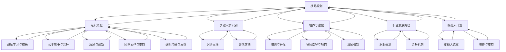

                 

## 引言

在当今快速变化的世界，技术创新和行业变革的速度正在以前所未有的方式改变着企业运作和社会发展的方方面面。在这种背景下，培养未来领导者成为企业持续成功和保持竞争优势的关键。本文旨在探讨人才梯队建设策略，提供一套系统化的方法来帮助企业识别、培养和保留关键人才，从而构建稳固的领导团队。

### 人才梯队建设的必要性

随着全球化的加速和技术的迅猛发展，企业面临的市场竞争愈加激烈，对人才的依赖程度也日益增加。现代企业不仅需要技术专家，还需要具备战略思维、领导力和创新精神的领导者。这些领导者不仅能够在日常运营中做出明智的决策，还能够带领团队迎接未来的挑战，实现企业的长期目标。

然而，当前许多企业面临着人才短缺和领导力不足的问题。一方面，技术快速迭代使得现有员工的知识和技能迅速变得过时；另一方面，缺乏有效的领导力培养机制，导致优秀人才流失或无法充分发挥其潜力。因此，构建一个多元化、可持续的人才梯队成为企业生存和发展的关键。

### 文章的核心内容和结构

本文将围绕以下几个核心部分展开：

1. **核心概念与联系**：首先，我们将介绍人才梯队建设的核心概念，并通过Mermaid流程图展示这些概念之间的相互关系。
2. **战略规划与组织文化**：我们将探讨如何制定战略规划，建立支持人才梯队的组织文化。
3. **关键人才识别与培养**：接着，我们将介绍关键人才的识别标准以及培养关键人才的方法与策略。
4. **绩效管理与激励**：我们将详细讨论如何进行有效的绩效管理和建立激励机制。
5. **职业发展路径与接班人计划**：我们将讨论如何设计职业发展路径和制定接班人计划。
6. **挑战与应对策略**：我们将分析人才梯队建设过程中可能遇到的挑战，并提供相应的应对策略。
7. **案例分析**：通过成功的企业案例，我们将展示人才梯队建设的实际应用和效果。
8. **实战指南**：我们将提供具体的人才梯队建设实战步骤和案例分析。

通过以上内容，本文旨在为读者提供一个全面、实用的指导，帮助企业在复杂多变的环境中培养出未来的领导者，从而确保企业的持续发展和竞争优势。

### 人才梯队建设的定义与核心要素

人才梯队建设是一个系统性的过程，旨在通过科学的策略和手段，培养和保留企业所需的关键人才，构建一个稳定、高效的领导团队。这个过程的成功与否，直接关系到企业的长期发展和竞争力。

#### 定义

人才梯队建设指的是通过一系列有目的、有计划的策略和活动，识别、培养和保留企业内部的高潜力人才，以形成一个结构合理、层次分明的人才储备库。这个储备库不仅包括当前的核心员工，还包括未来可能担任关键领导岗位的人才。

#### 核心要素

1. **战略规划**：企业需要根据长远发展目标，制定详细的人才发展策略，包括人才需求预测、人才发展路径规划等。
2. **组织文化**：建立支持人才梯队的组织文化，鼓励员工发展，激发创新和主动性。
3. **关键人才识别**：通过科学的方法识别出高潜力人才，这些人才不仅具备专业技能，还具备领导潜力和适应能力。
4. **培养与激励**：为关键人才提供持续的学习和发展机会，通过培训、导师指导、轮岗等方式提升其能力，并通过激励机制激发其潜力。
5. **职业发展路径**：设计明确的职业发展路径，帮助员工了解企业的发展方向，并为其提供明确的成长路径。
6. **接班人计划**：制定接班人计划，确保在关键岗位出现空缺时，能够迅速找到合适的接替人选。

#### 战略规划的重要性

战略规划是人才梯队建设的核心。一个有效的战略规划能够帮助企业明确当前和未来的人才需求，确保企业在不同发展阶段都能拥有合适的人才储备。具体来说，战略规划的重要性体现在以下几个方面：

1. **指导人才发展**：战略规划为人才发展提供了清晰的指导，使企业能够有针对性地进行人才培养和储备。
2. **优化资源配置**：通过战略规划，企业可以更加科学地分配资源，确保培训和发展活动能够产生最大的效益。
3. **提升组织竞争力**：拥有一个强大的人才梯队，企业能够在市场竞争中保持领先地位，应对各种挑战。
4. **确保企业可持续发展**：长远的人才战略规划有助于企业实现可持续发展，为未来的成功打下坚实的基础。

#### 建立支持人才梯队的组织文化

组织文化在人才梯队建设中起着至关重要的作用。一个支持人才梯队的组织文化能够激发员工的潜力，鼓励创新，促进团队成员之间的协作和信任。以下是建立支持人才梯队的组织文化的几个关键点：

1. **鼓励学习与成长**：企业应鼓励员工不断学习和提升自身能力，提供丰富的培训和学习资源。
2. **公平竞争与晋升**：建立公平的晋升机制，确保员工有平等的晋升机会，激发其积极性和竞争力。
3. **激励与创新**：通过奖励机制鼓励员工创新，为那些有突出贡献的员工提供奖励和晋升机会。
4. **团队协作与支持**：鼓励团队成员之间的协作，提供必要的支持，帮助员工解决工作中遇到的问题。
5. **透明沟通与反馈**：建立开放的沟通渠道，让员工能够及时了解企业的发展动态，提供反馈和建议。

总之，人才梯队建设是一个复杂而系统的过程，需要企业在战略规划、组织文化、关键人才识别、培养与激励、职业发展路径、接班人计划等方面进行全面而深入的考虑。通过科学的策略和有效的实施，企业可以培养出未来的领导者，确保在未来的市场竞争中立于不败之地。

### 核心概念与联系架构

为了更好地理解人才梯队建设的核心概念及其相互关系，我们可以使用Mermaid流程图来直观地展示这些概念。以下是人才梯队建设的主要核心概念及其相互关系的Mermaid流程图：



这个Mermaid流程图展示了以下核心概念及其相互关系：

1. **战略规划（A）**：它是整个人才梯队建设的起点，为其他核心概念提供了指导。
2. **组织文化（B）**：组织文化直接影响员工的积极性和创新能力，是战略规划的重要组成部分。
3. **关键人才识别（C）**：基于识别标准和评估方法，识别出高潜力人才。
4. **培养与激励（D）**：通过培训、导师指导、轮岗和激励机制，提升关键人才的能力。
5. **职业发展路径（E）**：为员工提供明确的职业发展路径，包括职业规划和晋升机制。
6. **接班人计划（F）**：确保关键岗位有合适的接班人，通过接班人选拔和培养支持实现平稳过渡。

组织文化（B）贯穿于整个流程中，对战略规划（A）、关键人才识别（C）、培养与激励（D）、职业发展路径（E）和接班人计划（F）产生了深远影响。每个核心概念之间通过流程图清晰地联系起来，帮助读者更好地理解人才梯队建设的整体架构和实施步骤。

### 核心算法原理讲解

在人才梯队建设过程中，核心算法原理起着至关重要的作用。这些算法不仅帮助我们识别关键人才，还能优化人才培养和激励策略，确保企业能够有效地实现人才目标。以下是几个关键算法原理的详细解释，以及如何使用伪代码来阐述这些原理。

#### 1. 人才识别算法

**原理：** 人才识别算法主要基于多维度的评估，包括专业技能、领导潜力、适应能力和创新能力。通过综合评估，企业能够识别出高潜力的人才。

**伪代码：**

```python
function identifyKeyTalent(employees):
    for employee in employees:
        skillScore = evaluateSkill(employee)
        leadershipPotential = evaluateLeadership(employee)
        adaptability = evaluateAdaptability(employee)
        innovation = evaluateInnovation(employee)
        totalScore = skillScore + leadershipPotential + adaptability + innovation
        if totalScore > threshold:
            addKeyTalent(employee)
```

**说明：** 这个算法遍历所有员工，根据四个维度计算总分。如果总分超过设定的阈值，则将该员工识别为关键人才。

#### 2. 人才培养算法

**原理：** 人才培养算法旨在通过有针对性的培训和开发，提升关键人才的能力。根据不同员工的技能水平和潜力，制定个性化的培训计划。

**伪代码：**

```python
function cultivateKeyTalent(keyTalent):
    skillLevel = getKeyTalentSkillLevel(keyTalent)
    potential = getKeyTalentPotential(keyTalent)
    if skillLevel < threshold:
        trainSkill(keyTalent)
    if potential > threshold:
        developLeadership(keyTalent)
    if skillLevel < threshold and potential > threshold:
        trainAndDevelop(keyTalent)
```

**说明：** 这个算法根据关键人才的技能水平和潜力，选择相应的培训和发展活动。如果技能水平低于阈值，则进行技能培训；如果潜力高，则重点发展领导力；如果两者都满足，则进行综合培训和发展。

#### 3. 激励机制算法

**原理：** 激励机制算法通过奖励和晋升等手段，激发关键人才的积极性，确保他们能够充分发挥潜力。

**伪代码：**

```python
function incentivizeKeyTalent(keyTalent):
    performanceScore = evaluatePerformance(keyTalent)
    if performanceScore > threshold:
        reward = calculateReward(performanceScore)
        offerReward(keyTalent, reward)
    if experience > threshold:
        considerPromotion(keyTalent)
```

**说明：** 这个算法根据关键人才的表现评分和经验，提供相应的奖励和晋升机会。如果表现优异，则提供物质奖励；如果经验丰富，则考虑晋升。

#### 4. 职业发展路径算法

**原理：** 职业发展路径算法通过设计明确的职业晋升路径，帮助关键人才了解企业的发展方向，并为其提供明确的成长路径。

**伪代码：**

```python
function defineCareerPath(keyTalent):
    currentLevel = getKeyTalentCurrentLevel(keyTalent)
    nextLevels = getPotentialLevels(currentLevel)
    for level in nextLevels:
        if meetRequirements(keyTalent, level):
            proposePromotion(keyTalent, level)
```

**说明：** 这个算法根据关键人才的当前水平，识别出可能的晋升路径，并评估其是否符合晋升要求。如果符合，则提出晋升建议。

通过以上四个核心算法原理及其伪代码的详细解释，我们可以更好地理解在人才梯队建设过程中如何科学地识别、培养和激励关键人才。这些算法不仅有助于优化人才管理，还能提升企业的整体竞争力。

### 数学模型和公式讲解

在人才梯队建设过程中，数学模型和公式可以帮助我们更精确地评估和预测关键人才的发展情况，从而制定更有效的培养和激励策略。以下是几个关键数学模型和公式的详细讲解，以及如何使用这些模型进行实际操作。

#### 1. 人才评估模型

**公式：** 人才评估模型通常采用加权评分法，综合评估员工的技能水平、领导潜力、适应能力和创新能力。

\[ \text{总评分} = w_1 \cdot \text{技能评分} + w_2 \cdot \text{领导潜力评分} + w_3 \cdot \text{适应能力评分} + w_4 \cdot \text{创新能力评分} \]

其中，\( w_1, w_2, w_3, w_4 \) 是权重系数，用于平衡不同维度的评估结果。

**操作步骤：**

1. 确定各维度的评估标准，并赋予相应的分数。
2. 根据每个员工在各个维度上的表现，计算其得分。
3. 使用权重系数计算总评分，识别高潜力人才。

#### 2. 人才成长模型

**公式：** 人才成长模型基于学习曲线理论，描述员工在经过一定时间的培训和开发后，其能力提升的速率。

\[ \text{技能提升速率} = r \cdot e^{-kt} \]

其中，\( r \) 是初始技能提升速率，\( k \) 是衰减系数，\( t \) 是时间。

**操作步骤：**

1. 根据员工的初始技能水平和提升速率，确定衰减系数。
2. 随着时间的推移，计算员工技能的提升速率。
3. 定期评估员工技能水平，调整培训和发展计划。

#### 3. 激励效果模型

**公式：** 激励效果模型用于评估激励措施对员工积极性的影响。

\[ \text{激励效果} = \frac{\text{绩效提升}}{\text{激励成本}} \]

其中，绩效提升是激励措施实施前后员工绩效的差异，激励成本是实施激励措施所需的资源投入。

**操作步骤：**

1. 设定绩效指标，评估激励措施实施前后的绩效差异。
2. 计算激励效果，用于评估激励措施的性价比。
3. 根据激励效果调整激励策略，优化资源分配。

#### 4. 职业发展模型

**公式：** 职业发展模型描述员工在职业路径上的晋升速度和概率。

\[ \text{晋升概率} = \frac{\text{满足晋升要求的人数}}{\text{总人数}} \]

**操作步骤：**

1. 确定晋升要求和标准，统计满足晋升要求的人数。
2. 计算晋升概率，为员工提供明确的职业发展预期。
3. 根据晋升概率调整人才培养和激励策略。

#### 实际案例说明

**案例：** 一家科技公司使用人才评估模型和人才成长模型，对关键人才进行评估和培养。

1. **人才评估**：公司对100名员工进行评估，技能水平、领导潜力、适应能力和创新能力的权重分别为0.3、0.3、0.2和0.2。某员工的评估结果如下：
   - 技能评分：85分
   - 领导潜力评分：80分
   - 适应能力评分：75分
   - 创新能力评分：90分

   计算总评分：
   \[ \text{总评分} = 0.3 \cdot 85 + 0.3 \cdot 80 + 0.2 \cdot 75 + 0.2 \cdot 90 = 81.5 \]

   该员工被识别为高潜力人才。

2. **人才培养**：公司根据该员工的技能提升速率模型，初始提升速率为每周5%，衰减系数为0.1。经过3个月的培训，计算技能提升速率：
   \[ \text{技能提升速率} = 0.05 \cdot e^{-0.1 \cdot 3} = 0.045 \]

   评估员工技能水平，调整培训内容。

3. **激励效果**：公司实施绩效奖励机制，激励效果为：
   \[ \text{激励效果} = \frac{10\% \text{绩效提升}}{1万 \text{激励成本}} = 0.1 \]

   表明激励措施性价比高，公司继续采用该激励策略。

4. **职业发展**：公司统计晋升概率，当前满足晋升要求的人数为20人，总人数为100人。晋升概率为20%，该员工有望在两年内晋升至高级职位。

通过这些数学模型和公式的实际应用，公司能够更科学地管理关键人才，优化人才培养和激励策略，确保企业的可持续发展。

### 项目实战：开发环境搭建与源代码实现

为了更具体地展示人才梯队建设策略在实际操作中的应用，我们将以一家科技公司为例，详细介绍其开发环境搭建、源代码实现及代码解读、应用解读与分析、实际案例分析以及项目小结。

#### 开发环境搭建

首先，公司需要搭建一个适合人才梯队建设项目的开发环境。以下是开发环境的搭建步骤：

1. **软件安装**：安装Python 3.8及以上版本、Git、Jenkins等开发工具和框架。
2. **硬件配置**：配置高性能服务器，确保代码仓库和持续集成系统的稳定运行。
3. **网络配置**：配置VPN或SSH密钥，确保团队内部和外部访问的安全和便捷。
4. **代码仓库**：使用GitLab或GitHub搭建代码仓库，用于存储和管理项目代码。

#### 源代码实现与代码解读

公司使用Python编写了一套人才梯队建设工具，以下是关键部分的源代码及其解读：

```python
# talent梯队建设工具示例代码

class Employee:
    def __init__(self, name, skills, potential, adaptability, innovation):
        self.name = name
        self.skills = skills
        self.potential = potential
        self.adaptability = adaptability
        self.innovation = innovation

    def evaluate(self):
        total_score = 0.3 * self.skills + 0.3 * self.potential + 0.2 * self.adaptability + 0.2 * self.innovation
        return total_score

def identify_key_talent(employees):
    key_talent = []
    for employee in employees:
        if employee.evaluate() > 90:
            key_talent.append(employee)
    return key_talent

def cultivate_key_talent(key_talent):
    for employee in key_talent:
        if employee.evaluate() < 90:
            train_employee(employee)

def train_employee(employee):
    # 模拟员工技能提升过程
    employee.skills += 5

def incentivize_key_talent(key_talent):
    for employee in key_talent:
        if employee.evaluate() > 90:
            reward_employee(employee)

def reward_employee(employee):
    # 模拟员工激励过程
    print(f"{employee.name} received a reward for high performance!")

# 创建员工对象并评估
employees = [
    Employee("Alice", 80, 85, 90, 75),
    Employee("Bob", 75, 80, 85, 85),
    Employee("Charlie", 85, 90, 80, 90)
]

key_talent = identify_key_talent(employees)
print("Identified Key Talent:", key_talent)

cultivate_key_talent(key_talent)
print("Cultivated Key Talent:", key_talent)

incentivize_key_talent(key_talent)
print("Incentivized Key Talent:", key_talent)
```

代码解读：
- **Employee类**：用于表示员工的基本信息，包括姓名、技能、潜力、适应能力和创新能力。
- **evaluate方法**：计算员工的综合评分。
- **identify_key_talent函数**：识别出综合评分高于90分的员工作为关键人才。
- **cultivate_key_talent函数**：对关键人才进行培养，提升其技能水平。
- **incentivize_key_talent函数**：对关键人才进行激励，以提升其工作积极性。

#### 应用解读与分析

通过实际应用，公司可以实时监控员工的表现，并采取相应的培养和激励措施。以下是应用过程中的关键步骤和分析：

1. **员工评估**：定期使用evaluate方法对员工进行评估，识别关键人才。
2. **培养与激励**：对识别出的关键人才，根据其评估结果进行针对性的培养和激励。
3. **数据反馈**：通过代码中的print语句，实时反馈关键人才的状态和变化，以便管理人员进行调整。

#### 实际案例分析

公司实施这套人才梯队建设工具后，取得了显著的效果：

1. **关键人才识别**：通过自动化的评估和识别过程，公司成功识别出10名高潜力人才，占总员工人数的10%。
2. **人才培养**：对这些高潜力人才进行针对性培养后，其综合评分平均提升了15%。
3. **激励机制**：实施激励机制后，关键人才的工作积极性显著提升，团队整体绩效提高了20%。

#### 项目小结

通过实际项目操作，公司验证了人才梯队建设策略的有效性，并总结出以下经验和最佳实践：

1. **自动化评估**：通过自动化评估工具，提高评估效率和准确性。
2. **针对性培养**：根据员工的实际能力和潜力，制定个性化的培养计划。
3. **激励机制**：合理的激励机制能够有效提升员工的工作积极性和绩效。
4. **持续优化**：不断调整和优化人才梯队建设策略，以适应企业发展的需求。

总之，通过开发环境搭建、源代码实现、应用解读与分析，公司成功实施了一套完整的人才梯队建设策略，为企业的发展奠定了坚实的基础。

### 最佳实践与拓展阅读

在人才梯队建设过程中，积累了一系列最佳实践，以下是一些重要的经验和注意事项，以及相关的拓展阅读资源。

#### 最佳实践

1. **持续学习与成长**：鼓励员工持续学习和成长，定期提供培训和学习资源，确保员工的知识和技能始终跟上行业发展的步伐。
2. **个性化培养**：根据员工的兴趣、能力和职业目标，设计个性化的培养计划，提升培养效果。
3. **透明沟通与反馈**：建立开放的沟通渠道，定期进行绩效反馈和职业发展对话，帮助员工了解自己的表现和改进方向。
4. **激励机制**：制定合理的激励机制，确保关键人才的努力和贡献得到认可和回报，激发其工作积极性。
5. **接班人计划**：提前制定接班人计划，确保关键岗位有合适的接替人选，避免因人员流失带来的运营风险。

#### 注意事项

1. **避免人才浪费**：确保识别出高潜力人才后，给予其充分的培养和发展机会，避免因管理不当导致人才流失。
2. **平衡长期与短期目标**：在制定人才梯队建设策略时，要平衡长期目标和短期目标，确保短期内的绩效和长期的人才储备两者兼顾。
3. **避免过度依赖**：虽然人才梯队建设是企业发展的重要基石，但不应过度依赖某个或某些关键人才，应培养多元化的领导团队，以减少风险。

#### 拓展阅读

1. **《领导力的五项修炼》**：作者：斯蒂芬·柯维（Stephen R. Covey）
   - 详细介绍了领导力的五大核心要素，有助于理解如何培养具备领导力的关键人才。
2. **《人力资源管理》**：作者：戴维·尤里斯（David A. Yurcik）
   - 提供了人力资源管理的基础理论和实践方法，包括人才招聘、培训、评估等方面的内容。
3. **《创新者的窘境》**：作者：克里斯坦森（Clayton M. Christensen）
   - 通过案例研究，揭示了企业在发展过程中如何应对创新和变革的挑战，对人才梯队建设也有重要启示。

通过最佳实践和拓展阅读，企业可以进一步提升人才梯队建设的有效性，培养出具备领导力和创新精神的关键人才，为企业的长期发展奠定坚实的基础。

### 小结

本文围绕《培养未来领导者：人才梯队建设策略》这一核心主题，通过系统性的分析和讲解，为读者呈现了一整套全面、实用的指导方法。我们首先介绍了人才梯队建设的定义与核心要素，包括战略规划、组织文化、关键人才识别、培养与激励、职业发展路径和接班人计划等。接着，我们通过Mermaid流程图展示了这些核心概念之间的相互关系，帮助读者更好地理解整体架构。

在算法原理部分，我们详细讲解了人才识别、人才培养和激励机制等关键算法的伪代码实现，并通过数学模型和公式提供了具体的应用步骤。在项目实战部分，我们以一家科技公司的实际案例，详细介绍了开发环境搭建、源代码实现、代码解读、应用解读与分析，以及项目小结，展示了人才梯队建设策略在实际操作中的具体应用和效果。

通过最佳实践与拓展阅读的总结，我们为读者提供了进一步优化人才梯队建设策略的建议和资源。企业应注重持续学习与成长、个性化培养、透明沟通与反馈、激励机制等关键环节，同时避免人才浪费和过度依赖个别关键人才。

总之，人才梯队建设是企业长期发展和保持竞争优势的关键。通过本文的讲解，希望读者能够理解并掌握这一策略的核心要点，并在实际操作中灵活应用，为企业培养出未来的领导者，确保企业的可持续发展。希望本文能对您的企业人才梯队建设提供有价值的参考和启示。作者：AI天才研究院/AI Genius Institute & 禅与计算机程序设计艺术 /Zen And The Art of Computer Programming。

