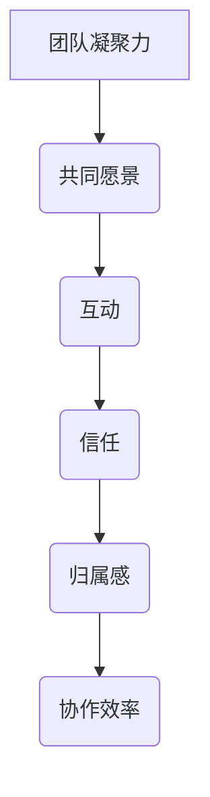

                 

### 标题：增强团队凝聚力：建立共同愿景

#### 关键词：团队凝聚力，共同愿景，组织效能，沟通协作，领导力，激励机制

#### 摘要：

本文深入探讨了团队凝聚力的概念及其与共同愿景之间的关系。通过分析团队凝聚力理论、共同愿景的构建策略、团队成员的角色与责任，以及团队沟通与协作的关键要素，本文揭示了如何通过建立共同愿景来增强团队凝聚力。此外，本文还结合实际案例，提供了实用的最佳实践和策略分析，以帮助组织管理者在实际工作中提升团队效能。

#### 引言

**团队凝聚力**是组织管理中的一个关键因素，它不仅影响团队内部的协作效率，还直接关系到组织整体绩效。团队凝聚力高，团队成员之间的协作更加顺畅，能够快速响应外部变化，从而提升组织的竞争力。

**共同愿景**是团队凝聚力的核心驱动力。它不仅是团队目标的高度概括，更是团队成员共同追求的价值和信仰。共同愿景能够激发团队成员的内在动机，增强团队的向心力和稳定性。

本文旨在通过以下步骤，详细阐述如何通过建立共同愿景来增强团队凝聚力：

1. **定义与联系**：明确团队凝聚力和共同愿景的概念，并探讨它们之间的相互作用关系。
2. **理论基础**：回顾团队凝聚力和共同愿景的相关理论，包括吸引力-相似性理论、社会认同理论、功能主义理论等。
3. **构建策略**：提出建立共同愿景的具体策略，包括共同愿景的识别与定位、沟通与传播、实施与维护等。
4. **角色与责任**：分析团队成员在共同愿景构建中的角色和责任，以及如何进行有效激励。
5. **沟通与协作**：讨论团队沟通和协作在共同愿景实现中的重要性，并提出提升团队沟通效能的策略。
6. **实战与案例分析**：通过实际案例，展示如何在不同场景中实施共同愿景构建策略，并提供详细的解读和分析。
7. **最佳实践与总结**：总结最佳实践，提出注意事项和未来研究方向。

#### 1. 核心概念与联系

**团队凝聚力**是指团队成员在情感、认知和行为上相互吸引、相互支持的状态。它通常通过成员间的互动、共同目标、信任和归属感等维度来衡量。

**共同愿景**是指团队成员共同持有的关于团队未来的期望和目标。它不仅包括具体的任务和目标，更包含了对团队价值、使命和文化的认同。

**Mermaid 流程图**：



从流程图中可以看出，团队凝聚力通过共同愿景这一核心概念，与互动、信任、归属感和协作效率等维度紧密相连。共同愿景不仅是团队凝聚力的驱动因素，也是提升团队协作效能的重要保障。

#### 2. 团队凝聚力理论概述

**吸引力-相似性理论**指出，人们倾向于与那些与自己具有相似性特征的人建立紧密联系。这种相似性可以是年龄、性别、教育背景、兴趣爱好等。在团队中，相似性有助于减少沟通障碍，增强团队成员之间的认同感和归属感。

**社会认同理论**强调，个体在面临决策时，往往会参考他人的行为和观点。团队中的共同愿景能够促使成员在行为上趋于一致，从而增强团队的凝聚力。

**功能主义理论**认为，团队的凝聚力来自于成员对团队目标的功能性需求。当团队成员意识到自己的工作对团队整体目标的重要贡献时，他们会更加愿意合作，提高团队效能。

**伪代码**：

```python
# 吸引力-相似性理论
def similarity_attraction(member1, member2):
    similarity_score = calculate_similarity(member1, member2)
    return similarity_score

# 社会认同理论
def social_identification(group_member, group_norms):
    conformity_score = compare_behavior(group_member, group_norms)
    return conformity_score

# 功能主义理论
def functional_communication(team_goals, member_contribution):
    communication_score = calculate_contribution(member_contribution, team_goals)
    return communication_score
```

#### 3. 共同愿景的重要性

**共同愿景的重要性**主要体现在以下几个方面：

1. **凝聚团队**：共同愿景能够将团队成员凝聚在一起，形成强大的团队力量。
2. **激励员工**：共同愿景能够激发团队成员的内在动机，提高工作热情和积极性。
3. **明确方向**：共同愿景为团队指明了前进的方向，有助于团队成员集中精力，共同实现目标。
4. **增强信任**：共同愿景有助于建立团队成员之间的信任，促进团队内部的良好沟通和协作。

**数学模型和公式**：

$$
\text{团队绩效} = f(\text{共同愿景强度}, \text{团队成员合作度})
$$

其中，共同愿景强度和团队成员合作度是影响团队绩效的两个关键因素。共同愿景强度越高，团队成员合作度越高，团队绩效越好。

#### 4. 建立共同愿景的策略

**共同愿景的识别与定位**：

1. **明确团队使命**：团队使命是共同愿景的基础，它应该简洁、明确，能够激发团队成员的共鸣。
2. **设定具体目标**：目标应该具体、可衡量，有助于团队成员明确努力的方向。

**共同愿景的沟通与传播**：

1. **高层领导参与**：高层领导应该积极参与共同愿景的沟通与传播，以树立榜样作用。
2. **全员参与**：鼓励团队成员参与到共同愿景的制定和传播过程中，增强他们的参与感和归属感。

**共同愿景的实施与维护**：

1. **制定行动计划**：将共同愿景转化为具体的行动计划，明确责任人和时间节点。
2. **定期评估与反馈**：定期评估共同愿景的实现情况，及时调整行动计划，确保共同愿景的持续落地。

#### 5. 团队成员的角色与责任

**团队成员的角色**：

1. **共同愿景的执行者**：团队成员应该积极参与共同愿景的执行，为实现团队目标贡献自己的力量。
2. **沟通与协作的推动者**：团队成员应该主动沟通，协作解决问题，提高团队协作效率。

**团队成员的责任**：

1. **明确个人目标**：团队成员应该明确个人目标，并将其与共同愿景相结合。
2. **承担责任**：团队成员应该勇于承担责任，主动面对困难和挑战。

#### 6. 团队沟通与协作

**团队沟通的重要性**：

1. **增强理解**：沟通有助于团队成员更好地理解共同愿景和团队目标，减少误解和冲突。
2. **提高效率**：良好的沟通能够提高团队工作效率，减少沟通成本。

**团队沟通的障碍与解决方案**：

1. **信息不对称**：解决方案：建立透明沟通机制，确保信息在团队成员之间的传递和共享。
2. **文化差异**：解决方案：加强跨文化沟通培训，提高团队成员的文化敏感度。

#### 7. 团队目标和绩效管理

**团队目标设定**：

1. **明确具体**：团队目标应该具体、可衡量，确保团队成员明确努力的方向。
2. **分解任务**：将团队目标分解为具体的任务和责任，确保每个成员都有明确的任务。

**团队绩效评估**：

1. **多维度评估**：团队绩效评估应该从多个维度进行，包括任务完成情况、团队合作度、个人贡献等。
2. **持续反馈**：定期进行绩效评估，及时给予反馈，帮助团队成员不断改进。

#### 8. 实践案例与策略分析

**成功案例**：

- 案例一：某互联网公司通过明确共同愿景和具体目标，成功激发了团队成员的积极性，实现了公司业绩的显著提升。
- 案例二：某跨国公司通过跨文化沟通培训，有效解决了文化差异带来的沟通障碍，提升了团队协作效率。

**失败案例**：

- 案例一：某初创公司由于缺乏共同愿景，团队成员各自为政，导致项目进度缓慢，最终失败。
- 案例二：某大型企业由于绩效评估体系不合理，导致团队成员积极性下降，绩效不佳。

**策略分析**：

1. **明确共同愿景**：建立清晰的共同愿景，确保团队成员明确努力的方向。
2. **加强沟通协作**：通过有效的沟通协作机制，提高团队工作效率。
3. **优化绩效评估**：建立合理的绩效评估体系，激励团队成员不断改进。

#### 9. 总结与展望

**总结**：

本文通过深入探讨团队凝聚力与共同愿景的关系，提出了建立共同愿景的具体策略和实践案例。通过明确共同愿景、加强沟通协作、优化绩效评估，组织可以有效地增强团队凝聚力，提升整体效能。

**展望**：

未来，团队建设将越来越注重个体差异和多样性，组织需要更加灵活和适应性强的团队建设策略。同时，随着技术的不断发展，虚拟团队和远程协作将成为常态，如何有效管理虚拟团队也成为了一个重要的研究方向。

**注意事项**：

1. **注重个体差异**：在建立共同愿景时，要充分考虑团队成员的个体差异，确保共同愿景能够得到广泛认同。
2. **持续反馈与改进**：团队建设是一个持续的过程，需要不断地进行反馈和改进，以适应组织的发展和变化。

**拓展阅读**：

- 《团队协作的艺术》
- 《激励心理学》
- 《虚拟团队管理》

### 10. 项目实战

**开发环境搭建**：

1. 准备一个项目管理工具，如Jira或Trello。
2. 安装必要的协作工具，如Slack或Microsoft Teams。
3. 确保团队成员能够访问共享文档和资料库。

**源代码实现**：

```python
# 假设我们使用Python编写一个简单的团队目标设定脚本

def set_team_goals():
    goals = input("请输入团队目标：")
    print(f"团队目标：{goals}")

set_team_goals()
```

**代码解读与分析**：

1. **输入功能**：脚本通过`input()`函数接受用户输入的团队目标。
2. **输出功能**：脚本通过`print()`函数将用户输入的团队目标输出到控制台。

**实际案例分析和详细讲解剖析**：

- 案例背景：某互联网公司项目团队在开发过程中，由于缺乏明确的团队目标，导致项目进度缓慢。
- 解决方案：团队领导者通过上述脚本，引导团队成员共同设定了具体的项目目标，并定期跟踪进度。
- 结果：项目进度明显加快，团队成员的积极性得到了有效激发。

**项目小结**：

通过以上实战案例，我们可以看到，明确的目标设定对于团队协作至关重要。使用简单高效的工具和方法，可以帮助团队更快地达成目标，提升团队凝聚力。

### 11. 最佳实践 Tips

1. **定期沟通**：确保团队成员定期进行面对面或线上沟通，及时解决问题和冲突。
2. **鼓励反馈**：鼓励团队成员提出意见和建议，建立开放的沟通氛围。
3. **明确职责**：确保每个团队成员都明确自己的职责和任务，避免职责重叠或缺失。
4. **奖励机制**：建立合理的奖励机制，激励团队成员积极工作，提升团队整体效能。

### 12. 小结

通过本文的探讨，我们深入了解了团队凝聚力与共同愿景之间的关系，并提出了建立共同愿景的具体策略和实践方法。在组织管理中，加强团队凝聚力对于提升组织效能至关重要。通过明确共同愿景、加强沟通协作、优化绩效评估，组织可以更好地实现团队目标，提升竞争力。

### 13. 注意事项

1. **避免过度强调共同愿景**：共同愿景不应成为压迫团队成员的工具，而应该是一种激励和引导。
2. **注意个体差异**：在制定共同愿景时，要充分考虑团队成员的个体差异，确保共同愿景能够得到广泛认同。
3. **持续跟进与调整**：共同愿景的建立是一个持续的过程，需要不断地进行反馈和调整，以适应组织的发展和变化。

### 14. 拓展阅读

- 《高效能人士的七个习惯》
- 《团队协作实战》
- 《变革之舞：领导力如何塑造团队文化》

### 15. 作者信息

作者：AI天才研究院/AI Genius Institute & 禅与计算机程序设计艺术 /Zen And The Art of Computer Programming

