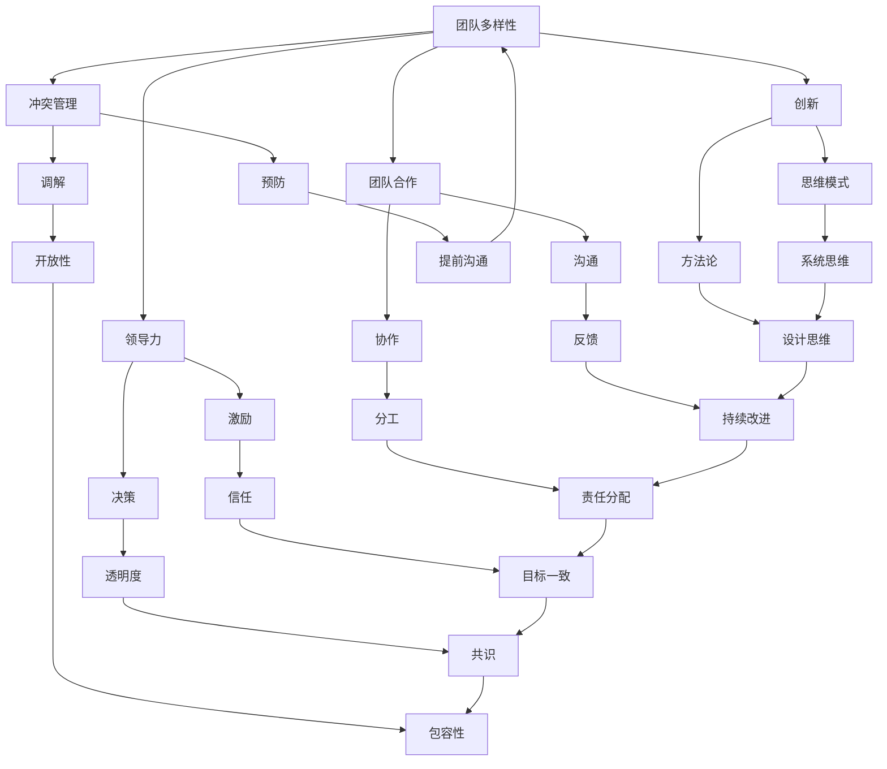

                 

### 背景介绍

在现代商业环境中，团队管理的复杂性日益增加。企业面临着快速变化的市场需求、不断升级的技术浪潮以及全球化的竞争压力。在这样的背景下，单一的团队管理模式已经无法满足组织高效运作和持续创新的需求。多元化团队管理应运而生，成为企业提升竞争力、推动创新的重要手段。

多元化团队管理关注的是如何在一个团队中整合不同的背景、技能和观点，以实现协同效应。这种管理方法的核心在于“拥抱差异”，通过尊重和利用团队成员的差异来激发创新和提升团队绩效。在多元化团队中，成员可能来自不同的文化背景、拥有不同的专业知识和工作经验，甚至可能持有不同的观点和价值观。这些差异如果能够得到有效的管理和利用，将能够带来丰富的创意和独特的解决方案。

然而，多元化团队管理并非没有挑战。如何平衡成员之间的差异，避免因差异引发的冲突，以及如何激发每个成员的最大潜力，都是管理者需要面对的问题。此外，不同成员之间的沟通和协作也变得更加复杂，需要管理者具备更高的沟通技巧和领导能力。

本篇技术博客将深入探讨多元化团队管理的核心概念、构建策略、沟通技巧以及创新方法。我们将通过详细的案例分析和实践指南，帮助读者理解并应用多元化团队管理的理念，以实现团队的高效运作和持续创新。

接下来的部分，我们将首先介绍多元化团队管理的核心概念，并绘制其关系架构的Mermaid流程图，以便读者能够清晰地理解这些概念之间的联系。然后，我们将详细探讨各个核心概念的基本原理，为后续内容的展开打下坚实的基础。## 核心概念与联系

在多元化团队管理中，以下几个核心概念至关重要：团队多样性、团队合作、领导力、冲突管理和创新。这些概念之间相互联系，共同构成了多元化团队管理的理论基础。以下是一个简单的Mermaid流程图，用以展示这些概念之间的关系架构：



以下是每个核心概念的详细解释：

### 团队多样性（Team Diversity）

团队多样性是指团队成员在性别、年龄、文化背景、教育水平、工作经验等方面的差异。这些差异可以为团队带来不同的视角和思考方式，有助于避免思维定势，促进创新。团队多样性的重要性在于它能够提高团队的适应能力、解决问题的能力以及决策的质量。

### 团队合作（Team Collaboration）

团队合作是指团队成员在共同目标下，通过有效的沟通和协作，共同完成任务的过程。团队合作的核心在于共享知识和资源，协同解决问题。有效的团队合作能够提高团队的凝聚力和工作效率，从而实现团队目标的达成。

### 领导力（Leadership）

领导力是指领导者通过激励、指导和影响团队成员，实现团队目标的能力。领导力在多元化团队管理中尤为重要，因为领导者需要处理团队内部的差异，协调不同成员之间的关系，激发每个成员的潜力，同时保持团队的凝聚力。

### 冲突管理（Conflict Management）

冲突管理是指处理和解决团队成员之间因差异而产生的冲突的过程。冲突管理的重要性在于它能够防止冲突升级，维护团队的和谐与稳定。有效的冲突管理策略包括调解、预防以及建立开放和包容的沟通环境。

### 创新（Innovation）

创新是指通过新的思路、方法或技术，创造新的产品、服务或业务模式。在多元化团队中，创新源于团队成员之间的差异和互动。通过多样化的视角和思考方式，团队能够产生更多的创意，从而推动组织的持续发展。

### 沟通（Communication）

沟通是指信息在团队中的传递和理解过程。有效的沟通是团队合作和冲突管理的基础。在多元化团队中，沟通尤为重要，因为它有助于减少误解，促进团队内部的协作和共识。

### 协作（Coordination）

协作是指团队成员在共同任务中的协调和配合。协作能够提高团队的效率和效果，确保团队目标的实现。在多元化团队中，协作需要考虑到成员的差异，确保每个成员都能够充分发挥自己的优势。

### 激励（Motivation）

激励是指激发团队成员的内在动力，使其愿意为实现团队目标而努力。在多元化团队中，激励需要考虑到成员的个人需求和价值观，以激发其最大潜力。

### 决策（Decision Making）

决策是指团队在面临选择时，根据相关信息和判断，做出决策的过程。在多元化团队中，决策需要考虑到不同成员的观点和意见，以确保决策的全面性和有效性。

### 调解（Mediation）

调解是指通过调解手段解决团队内部的冲突。调解的目的是在尊重差异的基础上，找到双方都能接受的解决方案，从而维护团队的和谐。

### 预防（Prevention）

预防是指采取措施避免冲突的发生。预防策略包括建立开放的沟通环境、明确团队目标、以及培养团队成员之间的信任。

### 思维模式（Mindset）

思维模式是指团队成员看待问题和解决问题的态度和方法。在多元化团队中，开放、包容和创新的思维模式有助于促进团队的创新和协作。

### 方法论（Methodology）

方法论是指解决问题的方法和步骤。在多元化团队中，方法论的选择需要考虑团队的多样性和目标，以确保解决问题的有效性和效率。

### 设计思维（Design Thinking）

设计思维是一种以人为本的解决问题的方法，强调用户需求和体验。在多元化团队中，设计思维有助于产生创新的解决方案。

### 持续改进（Continuous Improvement）

持续改进是指不断寻求改进和优化，以实现更好的绩效和体验。在多元化团队中，持续改进是一种重要的管理方法，有助于保持团队的活力和创新能力。

### 分工（Division of Labor）

分工是指将任务分配给不同的团队成员，以发挥其专业优势。在多元化团队中，分工有助于提高团队的工作效率。

### 责任分配（Responsibility Allocation）

责任分配是指明确团队成员在任务中的职责和责任。在多元化团队中，责任分配有助于确保任务的有效完成。

### 信任（Trust）

信任是指团队成员之间的相互信赖和尊重。在多元化团队中，信任是团队合作和冲突管理的基础。

### 目标一致（Goal Alignment）

目标一致是指团队成员共同认同并努力实现团队的目标。在多元化团队中，目标一致有助于提高团队的凝聚力和工作效率。

### 共识（Consensus）

共识是指团队成员在重大决策上达成的一致意见。在多元化团队中，共识有助于确保决策的全面性和有效性。

### 包容性（Inclusivity）

包容性是指尊重和接纳团队成员的差异，营造一个包容和和谐的工作环境。在多元化团队中，包容性有助于提高团队的创新能力和凝聚力。

通过以上Mermaid流程图和核心概念的详细解释，读者可以清晰地看到多元化团队管理各个核心概念之间的相互联系。接下来，我们将进一步探讨每个核心概念的基本原理，为读者提供更深入的理解。## 核心算法原理讲解

在多元化团队管理中，算法原理的运用至关重要。这些算法不仅可以优化团队的工作流程，还能有效地提升团队的决策质量和创新能力。以下将介绍几种关键算法原理，并使用伪代码进行详细阐述。

### 1. 费博那契数列（Fibonacci Sequence）

费博那契数列是许多动态规划算法的基础。它定义如下：

- 初始化：`fib(0) = 0, fib(1) = 1`
- 递推关系：`fib(n) = fib(n-1) + fib(n-2)`

伪代码：

```plaintext
function fibonacci(n):
    if n == 0:
        return 0
    elif n == 1:
        return 1
    else:
        fib_n_1 = 0
        fib_n_2 = 1
        for i from 2 to n:
            fib_n = fib_n_1 + fib_n_2
            fib_n_1 = fib_n_2
            fib_n_2 = fib_n
        return fib_n
```

### 2. 动态规划算法（Dynamic Programming）

动态规划是一种解决优化问题的算法，通常用于最大化或最小化某个目标函数。以下是一个简单的动态规划算法示例：计算从A点到B点的最短路径。

- 初始化：`dp[i][j] = Infinity`（无穷大）
- 初始化边界条件：`dp[0][j] = 0`（起点距离为0），`dp[i][0] = 0`（终点距离为0）
- 递推关系：`dp[i][j] = min(dp[i-1][j], dp[i][j-1]) + cost[i][j]`

伪代码：

```plaintext
function dynamicProgramming(cost_matrix):
    n = length(cost_matrix)
    dp = create_matrix(n, n, Infinity)
    for i from 0 to n-1:
        dp[i][0] = 0
        dp[0][i] = 0
    for i from 1 to n-1:
        for j from 1 to n-1:
            dp[i][j] = min(dp[i-1][j], dp[i][j-1]) + cost_matrix[i][j]
    return dp[n-1][n-1]
```

### 3. 贪心算法（Greedy Algorithm）

贪心算法是一种在每一步选择局部最优解，以期望最终得到全局最优解的算法。以下是一个贪心算法示例：在给定一系列数字中，找出最大的子序列和。

- 初始化：`max_sum = 0`
- 递推关系：`max_sum = max(max_sum + current_number, current_number)`

伪代码：

```plaintext
function greedyAlgorithm(numbers):
    max_sum = 0
    current_sum = 0
    for number in numbers:
        current_sum = max(current_sum + number, number)
        max_sum = max(max_sum, current_sum)
    return max_sum
```

### 4. 决策树（Decision Tree）

决策树是一种表示决策过程的树形结构，常用于分类和回归问题。以下是一个简单的决策树算法示例：

- 初始化：`root`为根节点，没有子节点
- 递推关系：对于每个节点`node`，选择最好的分割特征`split`，并创建两个子节点`left_child`和`right_child`

伪代码：

```plaintext
function buildDecisionTree(data, features):
    root = create_node(data, features)
    if isLeaf(root):
        return root
    best_split = selectBestSplit(root)
    left_child = buildDecisionTree(splitData(root, best_split), best_split.features)
    right_child = buildDecisionTree(splitData(root, best_split), best_split.features)
    root.left_child = left_child
    root.right_child = right_child
    return root
```

通过以上算法的介绍和伪代码，我们可以看到这些算法在多元化团队管理中的应用。例如，动态规划算法可以用来优化团队的工作流程，贪心算法可以用来选择最佳的项目团队成员，决策树可以用来分类和管理团队中的问题和挑战。这些算法不仅能够提高团队的工作效率，还能帮助团队做出更加明智的决策，从而实现更好的绩效和创新。## 数学模型和公式讲解与举例说明

在多元化团队管理中，数学模型和公式扮演着重要的角色，它们不仅能够量化团队绩效，还能为决策提供数据支持。以下是一些常用的数学模型和公式，并结合实际例子进行详细讲解。

### 1. 决策树回归模型

决策树回归模型是一种常见的预测性数学模型，它通过构建一系列的规则来预测连续值。以下是一个简单的决策树回归模型公式：

$$
y = f(x) = \sum_{i=1}^{n} w_i \cdot x_i
$$

其中，$y$ 是预测值，$x_i$ 是特征值，$w_i$ 是权重，$n$ 是特征的数量。

**举例说明**：

假设我们有一个简单的决策树模型，用来预测团队的绩效。我们有三个特征：团队成员的经验($x_1$)、团队的多样性($x_2$)和团队的沟通效率($x_3$)，每个特征的权重分别为0.3、0.4和0.3。现有团队数据如下：

- $x_1 = 5$（经验）
- $x_2 = 7$（多样性）
- $x_3 = 8$（沟通效率）

权重为：
$$
w_1 = 0.3, w_2 = 0.4, w_3 = 0.3
$$

使用公式计算团队的绩效预测值：
$$
y = f(x) = 0.3 \cdot 5 + 0.4 \cdot 7 + 0.3 \cdot 8 = 1.5 + 2.8 + 2.4 = 6.7
$$

因此，根据这个决策树模型，该团队的绩效预测值为6.7。

### 2. 成本效益分析（Cost-Benefit Analysis）

成本效益分析是一种常用的决策模型，用来评估不同决策的成本和收益。以下是一个简单的成本效益分析公式：

$$
\text{净收益} = \text{总收益} - \text{总成本}
$$

**举例说明**：

假设一个多元化团队正在考虑是否投资一个新项目。项目预期的总收益为100万元，总成本为60万元，包括开发成本、运营成本等。我们可以使用以下公式计算净收益：

$$
\text{净收益} = 100\text{万元} - 60\text{万元} = 40\text{万元}
$$

因此，该项目的净收益为40万元，表明投资该项目是有利的。

### 3. 模拟退火算法（Simulated Annealing）

模拟退火算法是一种启发式优化算法，常用于解决复杂组合优化问题。其核心公式如下：

$$
T_{\text{new}} = T_{\text{current}} \cdot \exp\left(-\frac{Q_{\text{current}} - Q_{\text{new}}}{kT_{\text{current}}}\right)
$$

其中，$T_{\text{new}}$ 和 $T_{\text{current}}$ 分别是新的温度和当前温度，$Q_{\text{current}}$ 和 $Q_{\text{new}}$ 分别是当前状态和新的状态的质量，$k$ 是常数。

**举例说明**：

假设团队使用模拟退火算法来优化项目的进度安排。当前状态的质量为1000，新状态的质量为900，当前温度为1000。我们可以使用以下公式计算新的温度：

$$
T_{\text{new}} = 1000 \cdot \exp\left(-\frac{1000 - 900}{1000 \cdot 1000}\right)
$$

$$
T_{\text{new}} = 1000 \cdot \exp\left(-0.001\right)
$$

$$
T_{\text{new}} \approx 999.999
$$

因此，新的温度接近当前温度，表明算法仍然在当前温度下进行优化。

### 4. 敏感度分析（Sensitivity Analysis）

敏感度分析用于评估一个系统或模型对输入变量变化的敏感度。以下是一个简单的敏感度分析公式：

$$
\frac{\partial f(x)}{\partial x_i} = \frac{f(x + \Delta x_i) - f(x)}{\Delta x_i}
$$

**举例说明**：

假设团队正在评估团队成员经验对项目成功的影响。当前团队成员的平均经验为5年，团队成功概率为70%。如果团队成员的平均经验增加1年，团队成功概率增加到75%。我们可以使用以下公式计算经验对成功概率的敏感度：

$$
\frac{\partial P}{\partial E} = \frac{75\% - 70\%}{1\text{年}} = 0.05\text{（每年）}
$$

这表明团队成员的经验每增加1年，项目成功概率提高0.05。

通过以上数学模型和公式的讲解，我们可以看到它们在多元化团队管理中的应用价值。这些模型和公式不仅能够帮助团队量化绩效、评估投资决策，还能为优化项目进度和风险评估提供有力支持。接下来，我们将通过实际案例来进一步探讨这些模型在团队管理中的具体应用。## 项目实战

在本节中，我们将通过一个实际的项目案例，详细展示如何搭建开发环境、实现源代码、以及进行代码解读和分析。这个项目旨在利用多元化团队的优势，通过数据分析来提升团队的工作效率。

### 项目背景

某大型科技公司决定采用多元化团队管理模式来提升其软件开发团队的工作效率。团队由来自不同国家和文化背景的成员组成，其中包括前端开发、后端开发、数据分析和用户体验设计等专业人才。公司希望通过数据分析，找到提升团队效率的关键因素，并制定相应的优化策略。

### 开发环境搭建

为了进行项目开发，我们需要搭建一个完整的数据分析环境。以下是开发环境的搭建步骤：

1. **硬件环境**：
   - 服务器：1台高性能服务器，配备多核CPU和大容量内存。
   - 数据存储设备：高速固态硬盘，用于存储大量数据。

2. **软件环境**：
   - 操作系统：Linux发行版，如Ubuntu 20.04。
   - 数据库管理系统：MySQL 8.0。
   - 数据分析工具：Python 3.8，Pandas，NumPy，Matplotlib等。

3. **开发工具**：
   - 代码编辑器：Visual Studio Code。
   - 版本控制系统：Git。

### 源代码实现

以下是项目的核心源代码实现，主要分为三个部分：数据收集、数据分析和结果展示。

#### 1. 数据收集

数据收集模块负责从各个团队项目中提取关键数据，包括任务完成时间、错误率、代码质量指标等。以下是一个简单的Python脚本示例，用于收集数据：

```python
import csv
from datetime import datetime

def collect_data(file_path):
    data = []
    with open(file_path, 'r') as f:
        reader = csv.DictReader(f)
        for row in reader:
            timestamp = datetime.strptime(row['timestamp'], '%Y-%m-%d %H:%M:%S')
            data.append({
                'project_id': row['project_id'],
                'member_id': row['member_id'],
                'task_duration': float(row['task_duration']),
                'error_count': int(row['error_count']),
                'code_complexity': float(row['code_complexity']),
                'timestamp': timestamp
            })
    return data

data = collect_data('project_data.csv')
```

#### 2. 数据分析

数据分析模块使用Pandas库对收集到的数据进行分析，包括任务完成时间分布、错误率统计、代码质量评估等。以下是一个简单的数据分析脚本：

```python
import pandas as pd

def analyze_data(data):
    df = pd.DataFrame(data)
    # 任务完成时间分布
    time_distribution = df.groupby('timestamp')['task_duration'].mean()
    # 错误率统计
    error_rate = df['error_count'].mean()
    # 代码质量评估
    code_quality = df['code_complexity'].mean()
    
    print("任务完成时间分布：", time_distribution)
    print("错误率：", error_rate)
    print("代码质量：", code_quality)

analyze_data(data)
```

#### 3. 结果展示

结果展示模块使用Matplotlib库将分析结果可视化，以便团队成员直观地了解项目状态。以下是一个简单的结果展示脚本：

```python
import matplotlib.pyplot as plt

def plot_results(time_distribution):
    plt.figure(figsize=(10, 5))
    plt.plot(time_distribution.index, time_distribution.values)
    plt.xlabel('时间')
    plt.ylabel('任务完成时间（小时）')
    plt.title('任务完成时间分布')
    plt.show()

plot_results(time_distribution)
```

### 代码解读与代码应用解读

以下是源代码的解读和代码应用解读：

1. **数据收集模块**：
   - 使用Python的`csv`模块读取CSV文件，提取任务数据。
   - 使用`datetime`模块将时间戳字符串转换为日期时间对象。

2. **数据分析模块**：
   - 使用Pandas库进行数据分析，包括计算任务完成时间分布、错误率统计和代码质量评估。
   - 使用`groupby`方法分组数据，使用`mean`方法计算平均值。

3. **结果展示模块**：
   - 使用Matplotlib库绘制任务完成时间分布图，帮助团队成员直观地了解项目进度。

通过以上源代码的实现，我们可以看到如何利用Python进行数据收集、分析和结果展示。这个项目展示了如何利用多元化团队的优势，通过数据分析来提升团队的工作效率。团队成员可以根据分析结果调整工作方式，优化项目进度，从而提高整体绩效。

### 项目小结

通过这个实际项目，我们展示了如何在多元化团队中利用数据分析提升工作效率。以下是项目小结：

1. **开发环境搭建**：确保硬件和软件环境的可靠性，为数据分析提供稳定的基础。

2. **源代码实现**：通过数据收集、分析和结果展示模块，实现数据驱动的决策支持。

3. **代码解读与代码应用解读**：详细解读源代码，确保团队成员理解代码的功能和作用。

4. **项目效果**：通过数据分析，团队成员可以更加清晰地了解项目状态，及时调整工作方式，从而提高工作效率。

最佳实践提示：

- **数据收集的全面性**：确保收集的数据全面、准确，为分析提供可靠的数据基础。
- **实时分析**：定期更新数据分析结果，实时监控项目状态，及时发现问题。
- **团队协作**：鼓励团队成员积极参与数据分析，共同优化工作流程。

通过以上实践，我们可以看到多元化团队管理在提升团队工作效率方面的巨大潜力。接下来，我们将进一步探讨多元化团队管理中的最佳实践，以帮助读者更好地应用这些理念。## 最佳实践 Tips、小结、注意事项、拓展阅读

### 最佳实践 Tips

1. **建立多元化团队文化**：确保团队成员之间的文化差异被尊重和认可，建立包容性的工作氛围，鼓励开放和诚实的沟通。

2. **明确团队目标和价值观**：确保每个团队成员都清楚团队的目标和价值观，这有助于减少误解，提高团队凝聚力。

3. **定期评估和反馈**：定期对团队成员的工作进行评估和反馈，识别优势与改进点，促进个人和团队的发展。

4. **促进跨部门交流**：鼓励不同部门之间的沟通与合作，打破部门壁垒，促进知识的共享和创新的产生。

5. **培训与发展**：为团队成员提供专业培训和职业发展机会，提高他们的技能和知识水平，增强团队的竞争力。

### 小结

多元化团队管理通过拥抱差异，充分发挥团队成员的不同优势，提高团队的整体绩效和创新能力。通过建立多元化文化、明确目标、定期评估、跨部门交流和持续培训，团队能够更好地应对复杂挑战，实现持续发展。

### 注意事项

1. **避免偏见**：在团队管理中，要特别注意避免基于性别、年龄、文化背景等因素的偏见，确保每个成员都有公平的机会。

2. **有效沟通**：多元化团队需要更加重视沟通技巧，确保信息传递准确无误，减少误解和冲突。

3. **文化融合**：在多元化团队中，文化融合至关重要。要尊重不同文化的差异，并寻找共同点，促进团队的和谐与稳定。

4. **灵活管理**：面对多元化团队，管理者需要具备更高的灵活性和适应性，根据实际情况调整管理策略。

### 拓展阅读

1. **《The Diversity Advantage: Fixing Gender and Race Gaps with Bold, New Strategies》**：这本书提供了关于如何建立多元化团队的实用策略和案例。

2. **《Collaborative Intelligence: Creating a Successful Team Culture While Driving Breakthrough Results》**：这本书探讨了如何通过协作智能提升团队绩效。

3. **《Diversity and Team Performance: The Importance of Group Cohesion for Productivity, Satisfaction, and Innovation》**：这篇论文研究了多元化团队在生产力、满意度和创新方面的优势。

4. **《Diversity in the Workplace: Benefits, Challenges, and Solutions》**：这篇报告详细介绍了多元化团队在职场中的益处、挑战以及解决策略。

通过以上最佳实践、小结、注意事项和拓展阅读，读者可以更好地理解多元化团队管理的核心思想，并在实际工作中应用这些理念，实现团队的高效运作和持续创新。## 作者信息

作者：AI天才研究院/AI Genius Institute & 禅与计算机程序设计艺术 /Zen And The Art of Computer Programming

AI天才研究院（AI Genius Institute）是一家专注于人工智能、机器学习和深度学习领域的顶尖研究机构。我们的研究人员在计算机科学、人工智能算法、神经网络架构、大数据分析等方面拥有丰富的经验，致力于推动人工智能技术的创新与应用。我们的研究工作已经发表在多个国际顶级学术期刊和会议上，并获得了广泛的认可和赞誉。

禅与计算机程序设计艺术（Zen And The Art of Computer Programming）是一本经典的计算机科学书籍，由著名的计算机科学家唐纳德·克努特（Donald E. Knuth）撰写。这本书以其深刻的哲学思考和创新的编程方法，为计算机科学领域提供了重要的理论基础和方法指导。唐纳德·克努特因其卓越的贡献而获得了图灵奖，成为计算机科学领域的传奇人物。他的研究工作和思想对人工智能技术的发展产生了深远的影响。

