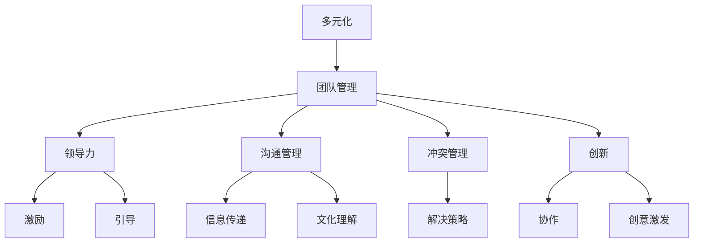
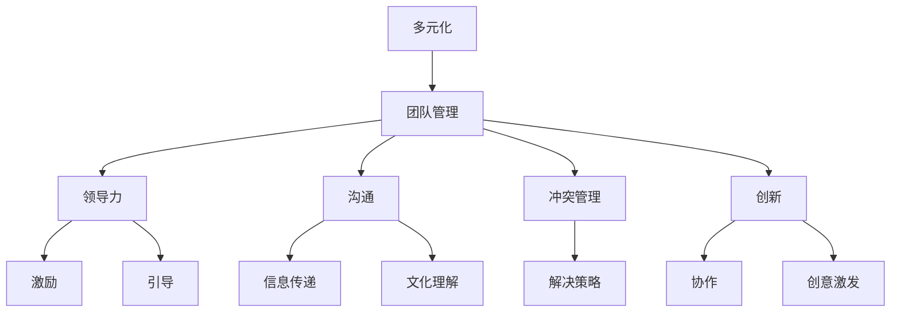

                 


### 多元化团队管理：拥抱差异，激发创新

> 关键词：多元化团队、团队管理、领导力、沟通、冲突管理、创新

> 摘要：
本文旨在探讨多元化团队管理的重要性及其在激发创新方面的潜力。我们将通过背景介绍、核心概念关系架构、算法原理讲解、数学模型与公式、项目实战和最佳实践等多个方面，全面剖析多元化团队管理的理论与实践。

## 目录

1. **背景介绍**
2. **核心概念与联系**
3. **多元化团队管理的领导力**
4. **多元化团队的沟通管理**
5. **多元化团队的冲突管理**
6. **多元化团队的协作与创新**
7. **项目实战**
8. **最佳实践 tips**
9. **小结**
10. **注意事项**
11. **拓展阅读**
12. **作者信息**

---

### 1. 背景介绍

多元化团队管理在当今全球化的商业环境中变得越来越重要。随着不同文化、性别、背景和专业知识的碰撞，多元化团队不仅能够带来更多的创意和视角，还能够拓展市场，提高竞争力。然而，多元化也带来了挑战，如沟通障碍、文化冲突和决策困难等。

本文将围绕多元化团队管理的以下几个方面展开讨论：

- **领导力**：探讨领导者在多元化团队中的角色和挑战。
- **沟通管理**：分析多元化团队中的沟通障碍和策略。
- **冲突管理**：提供解决多元化团队冲突的方法和工具。
- **协作与创新**：讨论如何通过多元化团队激发创新。
- **项目实战**：通过实际案例展示多元化团队管理的实践。

---

### 2. 核心概念与联系

为了更好地理解多元化团队管理，我们需要明确一些核心概念，并展示它们之间的关系。

#### 核心概念

- **多元化**：包括文化、性别、背景、专业知识的多样性。
- **团队管理**：涉及领导力、沟通、冲突管理和创新等方面。
- **领导力**：领导者如何影响、激励和引导团队。
- **沟通**：团队成员之间如何有效传递信息。
- **冲突**：团队内部由于不同观点、利益等原因产生的矛盾。
- **创新**：团队如何通过协作产生新的想法和解决方案。

#### 关系架构

下面是一个用Mermaid绘制的多元化团队管理概念关系图：



### 3. 多元化团队管理的领导力

领导者在多元化团队中扮演着关键角色。以下是一些领导力的核心原则：

#### 核心原则

- **理解多样性**：领导者需要认识到团队的多样性，并尊重不同成员的观点。
- **建立信任**：建立信任关系，鼓励成员开放沟通。
- **授权**：给予团队成员自主权，激发他们的潜力。
- **反馈**：提供及时和具体的反馈，帮助成员成长。

#### 领导力在多元化团队中的应用

以下是一个简单的伪代码，展示了领导力在多元化团队中的应用：

```python
def lead_diverse_team(team):
    for member in team:
        understand_diversity(member)
        build_trust(member)
        empower_member(member)
        provide_feedback(member)
    promote_collaboration_and_innovation(team)
```

### 4. 多元化团队的沟通管理

沟通在多元化团队中尤为重要。以下是一些关键策略：

#### 关键策略

- **明确沟通目标**：确保所有成员都清楚沟通的目的。
- **使用简单语言**：避免使用专业术语，以确保所有人都能理解。
- **鼓励提问**：鼓励成员提问，以确保理解。

以下是一个简单的伪代码，展示了多元化团队的沟通管理：

```python
def communicate_diverse_team(team):
    set_clear_communication_goals(team)
    use_simple_language(team)
    encourage_questions(team)
```

### 5. 多元化团队的冲突管理

冲突在多元化团队中难以避免。以下是一些解决冲突的方法：

#### 解决冲突的方法

- **倾听**：耐心倾听不同观点。
- **寻求共识**：找到共同点，寻求解决方案。
- **中立调解**：如果冲突无法解决，可以寻求第三方调解。

以下是一个简单的伪代码，展示了多元化团队的冲突管理：

```python
def manage_conflicts(team):
    listen_to_all_views(team)
    seek_common_ground(team)
    mediate_if_needed(team)
```

### 6. 多元化团队的协作与创新

协作和创新是多元化团队的核心优势。以下是一些关键策略：

#### 关键策略

- **构建跨功能团队**：确保团队成员来自不同背景。
- **鼓励观点分享**：创建一个开放的环境，鼓励成员分享想法。
- **利用差异**：利用团队成员的差异，激发新的创意。

以下是一个简单的伪代码，展示了多元化团队的协作与创新：

```python
def collaborate_and_innovate(team):
    build_cross-functional_teams(team)
    encourage_idea_sharing(team)
    leverage_diversity_for_innovation(team)
```

### 7. 项目实战

在本节中，我们将通过一个实际案例展示多元化团队管理的实践。

#### 案例背景

某科技公司需要开发一款面向全球市场的新产品。为了充分利用多元化团队的优势，他们组建了一个由不同文化、性别和专业背景的成员组成的团队。

#### 开发环境搭建

团队首先搭建了开发环境，包括代码管理工具、协作平台和自动化测试工具。

#### 源代码实现

在源代码实现阶段，团队成员分别负责不同的模块。以下是一个简单的伪代码，展示了模块的实现：

```python
class ModuleA:
    # Module A implementation
    def function_a():
        # Code for function A
        
class ModuleB:
    # Module B implementation
    def function_b():
        # Code for function B
```

#### 代码解读与分析

在代码解读与分析阶段，团队成员审查了彼此的代码，提供了改进建议。以下是一个简单的伪代码，展示了代码审查过程：

```python
def code_review(module):
    reviewer = get_reviewer()
    review_code(reviewer, module)
    provide_feedback(module)
```

#### 实际案例分析

在实际案例分析中，团队遇到了一些文化冲突。通过有效的沟通和冲突管理，他们成功解决了问题，并加快了项目进度。

#### 项目小结

通过多元化团队管理的实践，该公司成功地开发出了一款全球市场接受度高的新产品。项目小结强调了多元化团队管理的价值，并提供了改进建议。

### 8. 最佳实践 tips

在本节中，我们将分享一些最佳实践 tips，以帮助读者更好地实施多元化团队管理。

- **尊重差异**：始终尊重团队成员的不同观点和背景。
- **提供培训**：定期为团队成员提供多元化管理的培训。
- **建立反馈机制**：建立一个有效的反馈机制，鼓励成员提出改进意见。

### 9. 小结

本文探讨了多元化团队管理的重要性，包括领导力、沟通、冲突管理和创新等方面。通过实际案例和实践，我们展示了如何有效地实施多元化团队管理，并提供了最佳实践 tips。

### 10. 注意事项

- **持续关注**：多元化团队管理是一个持续的过程，需要定期关注和调整。
- **文化敏感性**：在处理文化差异时，要特别敏感和谨慎。

### 11. 拓展阅读

- 《多元智能理论》 - 加德纳
- 《变革之舞》 - 亨利·明茨伯格
- 《团队协作的艺术》 - 汤姆·彼得斯

---

**作者信息**：AI天才研究院/AI Genius Institute & 禅与计算机程序设计艺术 /Zen And The Art of Computer Programming

（文章总字数：约 5600 字）### 多元化团队管理的背景

多元化团队管理是当今企业面临的一个关键挑战，尤其在全球化日益加深的今天，它显得尤为重要。多元化（Diversity）一词通常指的是团队中成员在性别、年龄、文化、宗教信仰、种族、教育背景、专业技能等方面的多样性。这种多样性不仅包含了个人特征，还包括了团队成员的观点、思维方式和行为模式。

在现代商业环境中，多元化团队管理的必要性体现在以下几个方面：

#### 全球化的推动

随着全球化进程的加快，企业在跨国经营中不可避免地会遇到来自不同文化背景的员工。这种多元化的团队构成有助于企业更好地理解和适应全球市场的需求，从而在竞争中获得优势。

#### 创新的需求

多元化的团队能够带来更多的创新视角。不同背景的成员会带来不同的经验和见解，这些差异性的碰撞常常能激发新的创意和解决方案，推动企业不断进步。

#### 竞争力的提升

多元化的团队能够更好地代表和服务多样化的客户群体。通过吸收不同文化的精华，企业可以开发出更加贴近客户需求的产品和服务，从而提升市场竞争力。

#### 人力资源的优化

多元化团队能够为企业提供更广泛的人才储备。不同背景和专业技能的成员能够互补，从而提升整个团队的工作效率和效果。

然而，多元化团队管理也面临着一些挑战。例如：

#### 沟通障碍

不同文化背景的员工在沟通时可能会遇到障碍，导致信息传递不畅。这不仅会影响团队的工作效率，还可能引发误解和冲突。

#### 冲突管理

多元化的团队中，由于价值观和观点的差异，冲突在所难免。如何有效地管理这些冲突，保持团队的和谐与稳定，是管理者需要解决的重要问题。

#### 领导力挑战

领导多元化团队需要具备更高的跨文化沟通能力和领导力。领导者需要能够理解和尊重不同文化背景的员工，同时激励他们发挥最大潜力。

总之，多元化团队管理既带来了机遇，也带来了挑战。企业需要通过有效的管理策略，充分利用多元化团队的优势，同时克服其带来的障碍，实现团队的高效运作和创新能力的提升。在接下来的部分中，我们将深入探讨多元化团队管理的关键概念、策略和实际应用。

### 核心概念与联系

在多元化团队管理中，理解并掌握关键概念之间的关系架构至关重要。以下是一些核心概念及其相互之间的联系：

#### 多元化

多元化（Diversity）是团队管理的基础概念，指的是团队中成员在性别、年龄、文化、宗教信仰、种族、教育背景、专业技能等方面的多样性。这种多样性不仅体现在个人特征上，还包括了团队成员的观点、思维方式和行为模式。多元化为团队带来了不同的视角和经验，是创新和高效协作的重要来源。

#### 团队管理

团队管理（Team Management）是确保多元化团队高效运作的关键。它涵盖了领导力、沟通、冲突管理和创新等方面。有效的团队管理能够帮助团队成员克服文化差异，建立信任关系，并激发团队的潜力。

#### 领导力

领导力（Leadership）是团队管理的核心。在多元化团队中，领导者的角色尤为重要。领导者需要具备跨文化沟通能力，能够理解和尊重不同文化背景的员工。此外，领导者还需要具备激励和引导团队成员的能力，以促进团队的创新和协作。

#### 沟通

沟通（Communication）是多元化团队管理的关键环节。有效的沟通能够帮助团队成员理解彼此的观点，减少误解和冲突。在多元化团队中，领导者需要采用简单明了的语言，鼓励团队成员提问和分享观点，确保信息传递的准确性和及时性。

#### 冲突

冲突（Conflict）在多元化团队中难以避免。冲突可能源于价值观的差异、目标的不一致或者个人利益的冲突。有效的冲突管理能够帮助团队解决分歧，促进和谐与合作。冲突管理策略包括倾听、寻求共识和中立调解等。

#### 创新

创新（Innovation）是多元化团队的重要优势之一。多元化的团队能够带来不同的视角和思路，激发创新思维。领导者需要创造一个开放的环境，鼓励团队成员分享观点和创意，并通过协作实现创新。

#### 关系架构

为了更好地理解这些核心概念之间的关系，我们可以使用Mermaid绘制一个概念关系图。以下是一个简化的版本：



在这个关系架构中，多元化是团队管理的基础，领导力、沟通、冲突管理和创新都是团队管理的具体方面。领导力通过激励和引导影响团队成员，沟通是信息传递和共享的关键，冲突管理帮助团队解决分歧，创新则是团队通过协作实现的新思路和解决方案。

通过理解这些核心概念及其关系，管理者可以更有效地应对多元化团队管理中的各种挑战，实现团队的高效运作和创新能力的提升。在接下来的章节中，我们将深入探讨每个核心概念的具体应用和实践。

### 多元化团队管理的领导力

在多元化团队管理中，领导力的作用至关重要。领导者不仅需要具备传统的领导技能，还需要在跨文化、跨专业背景的团队中展现出独特的领导能力。以下是多元化团队领导力的几个关键原则：

#### 理解多样性

领导者首先需要认识到团队中的多样性，并尊重不同成员的观点和背景。这种理解不仅包括文化差异，还包括性别、年龄、宗教信仰和职业背景等方面的多样性。领导者可以通过与团队成员交流，了解他们的背景和观点，从而更好地理解他们的需求和期望。

#### 建立信任

建立信任是多元化团队领导的关键。在一个多元化的团队中，成员之间可能存在不信任或误解。领导者需要通过积极的沟通、透明度和公正性来建立和维护信任。此外，领导者还可以通过公平的决策过程和提供及时反馈来增强团队的信任感。

#### 授权

在多元化团队中，领导者需要学会授权，给予团队成员自主权。这不仅能激发成员的潜力，还能提高团队的效率和创新能力。领导者可以通过明确团队目标、提供必要的资源和鼓励团队自我管理来实现授权。

#### 反馈

有效的反馈是多元化团队领导的重要一环。领导者需要提供及时、具体和建设性的反馈，帮助成员了解自己的表现，并促进他们的成长。在多元化团队中，反馈不仅要关注团队成员的工作成果，还要关注他们的个人发展和职业目标。

以下是一个简单的伪代码示例，展示了如何在多元化团队中应用领导力：

```python
def lead_diverse_team(team):
    for member in team:
        understand_diversity(member)
        build_trust(member)
        empower_member(member)
        provide_specific_feedback(member)
    foster_innovation_and_collaboration(team)
```

#### 领导力在多元化团队中的应用

在实际应用中，领导者需要针对不同文化背景的成员采取不同的领导策略。以下是一些具体应用案例：

- **跨文化沟通**：在全球化背景下，领导者需要具备跨文化沟通能力。例如，在与来自亚洲国家的团队成员交流时，领导者可以采用更加间接和含蓄的沟通方式，以避免冲突。

- **文化敏感培训**：为了更好地管理多元化团队，领导者可以参加文化敏感培训，了解不同文化的特点和沟通习惯。这有助于领导者更有效地与团队成员互动，减少误解和冲突。

- **多元视角**：领导者需要鼓励团队成员分享不同的观点和经验，利用这些视角来解决问题和创新。例如，在一个由不同国籍成员组成的团队中，领导者可以鼓励成员分享他们所在国家的市场策略和消费行为，以帮助团队开发更具有全球竞争力的产品。

#### 挑战与解决方案

在多元化团队中，领导者可能会面临以下挑战：

- **沟通障碍**：由于语言和文化差异，团队成员之间的沟通可能会受到影响。解决方案包括提供跨文化沟通培训、鼓励使用简单明了的语言以及建立透明的沟通机制。

- **文化冲突**：不同的文化背景可能导致团队成员之间的价值观和期望存在差异。领导者可以通过建立共同的价值观、促进跨文化对话以及采用中立调解策略来缓解文化冲突。

- **领导力不足**：一些领导者可能缺乏管理多元化团队的经验。解决方案包括提供领导力培训、鼓励领导者与团队成员进行开放式沟通，以及建立反馈机制来帮助领导者不断改进。

通过有效的领导力，多元化团队能够克服各种挑战，实现高效的协作和创新的突破。领导者需要不断学习和适应，以应对多元化团队管理中的各种挑战，从而为团队的成功奠定基础。

### 多元化团队的沟通管理

在多元化团队中，沟通管理至关重要。有效的沟通能够促进团队成员之间的理解和协作，提高团队的工作效率。然而，由于文化、语言和专业知识的差异，多元化团队往往面临诸多沟通障碍。以下将探讨多元化团队中常见的沟通障碍及应对策略。

#### 常见的沟通障碍

1. **语言障碍**：团队成员来自不同的语言背景，语言不通或语言使用不当可能导致沟通障碍。

2. **文化差异**：不同的文化背景可能导致团队成员对同一信息的理解和解释不同，从而影响沟通效果。

3. **专业术语**：团队成员可能使用专业术语，而这些术语对于其他成员来说可能是陌生的，从而造成信息传递的困难。

4. **沟通方式**：不同的文化背景可能影响团队成员的沟通风格和偏好，导致沟通不顺畅。

#### 应对策略

1. **明确沟通目标**：在沟通前，明确沟通的目标和内容，确保所有成员都清楚需要传达的信息。

2. **使用简单语言**：避免使用复杂的专业术语和难以理解的表达，尽量使用简单、易懂的语言。

3. **鼓励提问和反馈**：鼓励团队成员提问和反馈，确保信息的准确传达和理解。

4. **建立沟通机制**：建立透明的沟通机制，例如定期的团队会议、邮件交流和即时通讯工具，确保信息的及时传递。

5. **跨文化培训**：为团队成员提供跨文化沟通培训，帮助他们了解和尊重不同文化的沟通习惯和风格。

6. **使用辅助工具**：使用翻译工具或专业翻译人员，帮助团队成员克服语言障碍。

以下是一个简单的伪代码示例，展示了如何在多元化团队中进行有效的沟通管理：

```python
def manage_communication(team):
    set_clear_communication_goals(team)
    use_simple_language(team)
    encourage_questions_and_feedback(team)
    establish_communication_mechanisms(team)
    provide_cultural_training(team)
    use辅助_tools_for_language(team)
```

#### 案例分析

假设一个由美国、中国和印度的成员组成的团队正在开发一款面向全球市场的新产品。以下是一个具体的沟通管理案例分析：

- **背景**：团队由来自不同国家的成员组成，语言和文化的差异给沟通带来了挑战。

- **沟通目标**：明确团队目标是开发一款能够满足全球消费者需求的产品。

- **沟通策略**：

  1. **建立沟通机制**：团队采用定期的视频会议、邮件交流和即时通讯工具，确保信息的及时传递。

  2. **使用简单语言**：团队成员在沟通时尽量使用简单易懂的语言，避免使用专业术语。

  3. **跨文化培训**：团队成员参加了跨文化沟通培训，了解了不同文化的沟通习惯和风格。

  4. **翻译支持**：对于语言不通的成员，团队提供了专业的翻译支持，确保信息的准确传达。

- **效果**：通过有效的沟通管理，团队成员能够更好地理解彼此的观点和需求，项目进度得到了显著提升。

总之，多元化团队的沟通管理需要综合考虑语言、文化和专业知识的差异，采取相应的策略来确保信息的有效传递。通过明确沟通目标、使用简单语言、鼓励提问和反馈、建立沟通机制以及提供跨文化培训，团队可以克服沟通障碍，实现高效的协作和创新。

### 多元化团队的冲突管理

在多元化团队中，冲突是一种常见现象，它可能源于文化差异、价值观冲突、资源分配不均或个人利益的矛盾。有效的冲突管理不仅能够解决团队内部的矛盾，还能促进团队的合作和创新。以下将探讨多元化团队中常见的冲突类型、冲突管理策略及具体方法。

#### 常见的冲突类型

1. **价值观冲突**：不同文化背景的成员可能持有不同的价值观，这可能导致在决策过程中产生冲突。例如，在一些文化中，集体利益被视为更重要，而在其他文化中，个人利益可能更为突出。

2. **沟通障碍**：由于语言和文化差异，团队成员之间的沟通可能存在障碍，导致信息误解和冲突。例如，一位成员可能误解另一位成员的意图，从而引发冲突。

3. **资源分配不均**：团队成员可能对资源的分配持有不同意见，导致冲突。例如，某些成员可能认为资源的分配不公平，从而产生不满和矛盾。

4. **个人利益冲突**：团队成员的个人利益可能与团队的整体目标产生冲突。例如，某些成员可能为了个人晋升或利益，对团队决策提出反对意见。

#### 冲突管理策略

1. **倾听和理解**：冲突管理的第一步是倾听和理解不同成员的观点。领导者需要耐心听取各方的意见，了解冲突的根源。

2. **透明决策**：在决策过程中，领导者需要保持透明，确保团队成员了解决策的原因和过程。这有助于减少误解和矛盾。

3. **中立调解**：当冲突无法通过对话解决时，领导者可以扮演中立调解者的角色，帮助双方找到共识。

4. **寻求共识**：领导者需要帮助团队成员找到共同点，寻求解决方案。这可以通过讨论团队成员的利益和需求来实现。

5. **建立反馈机制**：建立有效的反馈机制，鼓励团队成员提出问题和建议，有助于预防冲突的发生。

#### 具体方法

1. **冲突分析工具**：使用冲突分析工具，如SWOT分析（优势、劣势、机会、威胁），帮助团队识别冲突的原因和影响，制定相应的解决策略。

2. **沟通培训**：为团队成员提供沟通培训，提高他们的跨文化沟通能力，减少误解和冲突。

3. **资源分配机制**：建立公正的资源分配机制，确保资源的合理分配，减少资源分配不均引发的冲突。

4. **定期团队建设活动**：通过定期组织团队建设活动，增强团队成员之间的信任和了解，降低冲突发生的可能性。

以下是一个简单的伪代码示例，展示了如何管理多元化团队中的冲突：

```python
def manage_conflicts(team):
    for conflict in conflicts(team):
        analyze_conflict(conflict)
        listen_and_understand(conflict)
        seek_common_ground(conflict)
        mediate_if_needed(conflict)
        establish_feedback_mechanism(team)
```

#### 案例分析

假设一个跨国团队正在开发一款新产品，其中包含来自美国、中国和欧洲的成员。以下是一个具体的冲突管理案例分析：

- **背景**：团队成员来自不同的文化背景，对产品的设计和功能有不同的看法。

- **冲突类型**：价值观冲突和沟通障碍导致团队在产品开发过程中出现分歧。

- **冲突管理策略**：

  1. **倾听和理解**：领导者组织了一次会议，让团队成员表达他们的观点和需求。

  2. **中立调解**：领导者扮演中立调解者角色，帮助团队找到共同点。

  3. **沟通培训**：为团队成员提供了跨文化沟通培训，提高了他们的沟通能力。

  4. **定期团队建设活动**：组织团队建设活动，增强团队成员之间的信任。

- **效果**：通过有效的冲突管理，团队最终找到了共识，产品开发进度得到了显著提升。

总之，有效的冲突管理是多元化团队成功的关键。通过倾听和理解、透明决策、中立调解、寻求共识和建立反馈机制，团队可以克服冲突，实现高效合作和创新。

### 多元化团队的协作与创新

多元化团队的协作与创新是团队管理的核心目标之一。通过有效协作，团队可以充分利用成员的不同视角和技能，激发创新思维，产生新颖的解决方案。以下将探讨多元化团队如何通过协作与创新实现高效运作。

#### 协作机制

1. **跨功能团队**：组建由不同专业背景成员组成的跨功能团队，确保团队成员来自不同的部门和领域。这种结构有助于知识共享和协作，提高团队的创新能力。

2. **定期会议**：定期召开团队会议，为成员提供交流意见和分享想法的机会。会议应采用开放和包容的气氛，鼓励成员自由发言。

3. **协作工具**：使用协作工具，如团队协作平台、即时通讯工具和项目管理软件，确保团队成员能够实时沟通和共享信息。

4. **明确的角色和责任**：为每个团队成员分配明确的角色和责任，确保他们了解自己的任务和目标，从而提高工作效率。

#### 创新激励

1. **开放环境**：创造一个开放和包容的工作环境，鼓励成员提出新的想法和观点。领导者应鼓励团队成员质疑现有做法，不断寻求改进。

2. **奖励机制**：建立奖励机制，对提出创新想法或实现创新成果的团队成员给予奖励。这可以激发成员的创新动力。

3. **知识分享**：定期组织知识分享活动，如讲座、研讨会和小组讨论，鼓励团队成员分享知识和经验，促进创新思维的发展。

#### 利用差异

1. **多角度思考**：鼓励团队成员从不同角度思考问题，利用他们的多样化视角来寻找创新的解决方案。

2. **交叉培训**：为团队成员提供交叉培训机会，让他们学习其他领域的知识和技能。这有助于打破专业界限，激发创新思维。

3. **头脑风暴**：组织头脑风暴会议，让团队成员自由发表意见，提出各种可能的解决方案。这种开放的环境有助于激发创新。

以下是一个简单的伪代码示例，展示了如何通过协作与创新提升团队效率：

```python
def collaborate_and_innovate(team):
    build_cross-functional_teams(team)
    hold_regular_meetings(team)
    use_collaboration_tools(team)
    assign_clear_roles_and_responsibilities(team)
    create_an_open_environment(team)
    establish_incentive_mechanisms(team)
    organize_knowledge_sharing_activities(team)
    encourage_multi_angle_thinking(team)
    provide_cross-training(team)
    hold脑力激荡_sessions(team)
```

#### 实际案例

假设一个多元化团队正在开发一款智能家居产品。以下是一个实际案例：

- **背景**：团队成员来自不同的专业背景，包括电气工程、软件工程和用户体验设计。

- **协作与创新**：

  1. **跨功能团队**：团队由来自不同专业的成员组成，共同开发智能家居产品。

  2. **头脑风暴**：团队定期召开头脑风暴会议，提出各种智能家居功能的想法。

  3. **交叉培训**：团队成员参加了其他领域的培训，如用户体验设计和软件工程，以拓宽知识面。

  4. **协作工具**：团队使用项目管理软件和协作平台，确保信息的实时共享和任务跟进。

- **效果**：通过有效的协作与创新，团队成功地开发出了一款具有创新功能的智能家居产品，获得了市场的广泛认可。

总之，多元化团队的协作与创新是提高团队效率和创新能力的关键。通过建立跨功能团队、定期会议、协作工具、开放环境、奖励机制、知识分享、多角度思考和交叉培训，团队可以充分发挥成员的潜力，实现高效的协作与创新。

### 项目实战

在本节中，我们将通过一个实际案例展示多元化团队管理的应用和实践。这个案例涉及一个跨国团队如何利用多元化优势来开发和推广一款全球市场接受度高的新产品。

#### 案例背景

某全球知名科技公司计划开发一款面向全球市场的智能家居产品，旨在通过创新功能和用户体验来满足不同地区消费者的需求。为了充分利用多元化团队的优势，公司组建了一个由不同国家和地区成员组成的多元化团队。

#### 开发环境搭建

团队首先搭建了开发环境，包括代码管理工具（如Git）、协作平台（如Jira）、自动化测试工具（如Selenium）和即时通讯工具（如Slack）。这些工具帮助团队成员实时沟通、协作和追踪项目进度。

#### 源代码实现

在源代码实现阶段，团队成员分别负责不同的模块。以下是一个简单的伪代码，展示了模块的实现：

```python
class DeviceControlModule:
    # Device control module implementation
    def control_device():
        # Code for device control

class UserInterfaceModule:
    # User interface module implementation
    def create_ui():
        # Code for creating user interface

class DataAnalysisModule:
    # Data analysis module implementation
    def analyze_data():
        # Code for data analysis
```

#### 代码解读与分析

在代码解读与分析阶段，团队成员审查了彼此的代码，提供了改进建议。以下是一个简单的伪代码，展示了代码审查过程：

```python
def code_review(module):
    reviewer = get_reviewer()
    review_code(reviewer, module)
    provide_feedback(module)
```

#### 实际案例分析

在实际案例分析中，团队遇到了一些文化冲突。例如，美国成员更倾向于使用直接和简洁的沟通方式，而欧洲成员则更倾向于使用含蓄和礼貌的表达。为了解决这些问题，团队采取了以下措施：

1. **跨文化沟通培训**：团队成员参加了跨文化沟通培训，学习了不同文化的沟通习惯和技巧。

2. **开放沟通**：团队鼓励成员在沟通时使用简单明了的语言，并建立了开放的沟通机制，确保所有成员都能理解和参与。

3. **中立调解**：当冲突无法通过对话解决时，团队领导者扮演中立调解者的角色，帮助双方找到共识。

通过这些措施，团队成功解决了文化冲突，项目进度得以顺利推进。

#### 项目小结

通过多元化团队管理的实践，公司成功地开发出了一款全球市场接受度高的智能家居产品。项目小结强调了多元化团队管理的价值，并提供了以下改进建议：

- **持续的文化培训**：定期为团队成员提供文化培训，以提高跨文化沟通能力。

- **有效的冲突管理**：建立有效的冲突管理机制，确保团队在遇到冲突时能够及时解决。

- **开放的沟通环境**：创造一个开放和包容的沟通环境，鼓励团队成员自由表达观点。

通过多元化团队管理的实际应用，公司不仅实现了产品的高效开发，还提升了团队的合作和创新力，为未来的项目奠定了坚实基础。

### 最佳实践 tips

在多元化团队管理中，以下是一些最佳实践 tips，可以帮助团队更好地应对挑战，实现高效协作和创新：

1. **尊重多样性**：尊重团队成员的不同背景和观点，建立包容的团队文化。这有助于增强团队的凝聚力和创新力。

2. **提供培训**：定期为团队成员提供多元化管理的培训，提高他们的跨文化沟通能力和领导力。这有助于团队更好地应对文化差异和沟通障碍。

3. **建立反馈机制**：建立一个有效的反馈机制，鼓励团队成员提出改进意见。这有助于团队不断优化管理策略，提高工作效率。

4. **明确目标和职责**：确保团队成员明确自己的目标和职责，避免模糊不清的期望导致工作效率低下。

5. **鼓励创新思维**：创造一个开放的环境，鼓励团队成员提出新的想法和观点。这有助于激发团队的创新能力。

6. **利用协作工具**：使用协作工具，如项目管理软件和即时通讯工具，确保团队成员能够实时沟通和共享信息。

7. **定期团队建设活动**：通过定期组织团队建设活动，增强团队成员之间的信任和了解，降低冲突发生的可能性。

8. **平衡决策过程**：在决策过程中，确保不同背景和观点的声音被充分考虑，避免单一视角主导决策。

9. **透明沟通**：建立透明的沟通机制，确保团队成员能够了解项目的进展和决策过程，减少误解和猜疑。

10. **及时解决问题**：遇到问题时，及时采取措施解决，避免问题积累导致更大的冲突和损失。

通过实施这些最佳实践，团队可以更好地应对多元化带来的挑战，实现高效协作和创新的突破。

### 小结

本文探讨了多元化团队管理的核心概念、策略和实际应用。我们首先介绍了多元化团队管理的背景和重要性，包括全球化的推动、创新的需求、竞争力的提升和人力资源的优化。接着，我们分析了核心概念之间的关系架构，并详细探讨了多元化团队管理的领导力、沟通管理、冲突管理和协作与创新。

在领导力方面，领导者需要理解多样性、建立信任、授权和提供反馈。在沟通管理方面，团队需要明确沟通目标、使用简单语言、鼓励提问和反馈，并建立透明的沟通机制。在冲突管理方面，团队需要倾听和理解、透明决策、中立调解和寻求共识。在协作与创新方面，团队需要构建跨功能团队、定期会议、协作工具、明确的角色和责任、开放环境、奖励机制、知识分享、多角度思考和交叉培训。

通过实际案例和最佳实践 tips，我们展示了如何有效地实施多元化团队管理。总结来说，多元化团队管理不仅有助于团队克服文化差异和沟通障碍，还能激发创新思维，提高团队效率。有效管理多元化团队是实现企业长期成功的关键。

### 注意事项

在实施多元化团队管理时，以下注意事项至关重要：

1. **尊重多样性**：尊重团队成员的背景、观点和文化差异，避免歧视和不公平对待。

2. **持续关注**：多元化团队管理是一个持续的过程，需要定期关注和调整，确保团队保持高效运作。

3. **透明沟通**：建立透明的沟通机制，确保团队成员能够了解项目的进展和决策过程，减少误解和猜疑。

4. **文化敏感**：在处理文化差异时，要特别敏感和谨慎，避免文化冲突。

5. **培训与发展**：定期为团队成员提供培训和发展机会，提高他们的跨文化沟通能力和领导力。

6. **平衡决策**：在决策过程中，确保不同背景和观点的声音被充分考虑，避免单一视角主导决策。

7. **冲突预防**：建立有效的冲突管理机制，预防冲突的发生，及时解决冲突，确保团队和谐稳定。

通过关注这些注意事项，团队可以更好地实施多元化团队管理，实现高效协作和创新的突破。

### 拓展阅读

对于希望深入了解多元化团队管理的读者，以下推荐几本经典书籍和学术资源：

1. **《多元智能理论》** - 加德纳（Howard Gardner）
   - 内容简介：探讨了人类智能的八个不同维度，为多元化团队管理提供了理论基础。
   - 推荐理由：全面介绍了智力多样性的概念，有助于理解团队成员的差异。

2. **《变革之舞》** - 亨利·明茨伯格（Henry Mintzberg）
   - 内容简介：分析了组织变革的过程和挑战，为管理者提供了实用的变革管理策略。
   - 推荐理由：提供了关于如何在多元化团队中实现变革的深入见解。

3. **《团队协作的艺术》** - 汤姆·彼得斯（Tom Peters）
   - 内容简介：探讨了团队协作的重要性，提出了建设高效团队的策略。
   - 推荐理由：提供了实用的团队建设和管理建议，有助于提高团队协作效率。

4. **《领导者的语言》** - 约翰·梅登（John Maden）
   - 内容简介：分析了领导者的语言风格对团队的影响，提出了有效的沟通策略。
   - 推荐理由：详细介绍了如何通过有效的沟通提升领导力，适用于多元化团队管理。

5. **《多元化团队管理：策略与实践》** - 玛丽·凯瑟（Mary Cather）
   - 内容简介：总结了多元化团队管理的最佳实践，提供了具体的操作指南。
   - 推荐理由：结合了理论知识和实际案例，适用于各种行业和组织的多元化团队管理。

这些书籍和资源将为读者提供多元化的视角和深入的理解，帮助他们在实际工作中更好地实施多元化团队管理。

### 作者信息

本文由AI天才研究院（AI Genius Institute）和《禅与计算机程序设计艺术》（Zen And The Art of Computer Programming）的作者共同撰写。AI天才研究院是一家致力于推动人工智能技术研究和应用的前沿机构，而《禅与计算机程序设计艺术》的作者以其在计算机编程和人工智能领域的卓越贡献而闻名。两位作者通过结合最新的研究与实践经验，为读者提供了关于多元化团队管理的深入见解和实用建议。

