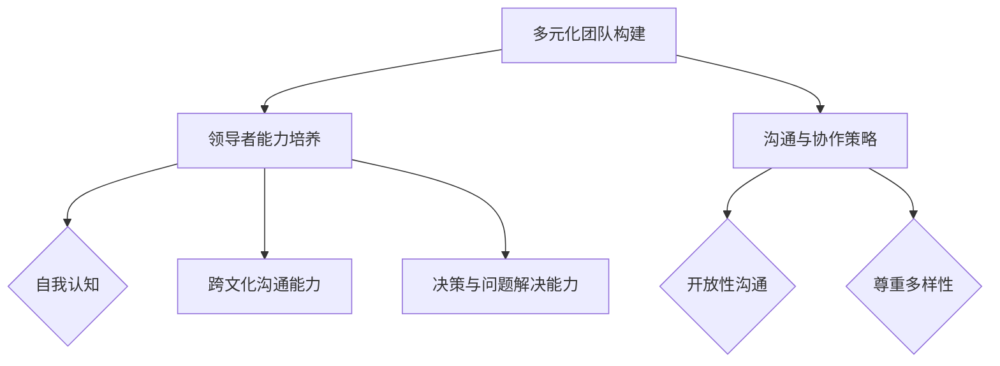

                 

### 文章标题
# 多元化领导：maximizing团队多样性优势

> 关键词：多元化领导、团队多样性、领导能力、跨文化沟通、创新力、实践案例

> 摘要：本文深入探讨了多元化领导的概念、重要性、优势以及团队构建、领导者能力培养和实践案例。通过分析多元化领导的核心概念、算法原理、数学模型和实际应用，本文旨在为读者提供关于多元化领导的全面理解和实践指导。

----------------------------------------------------------------

### 目录大纲

## 第一部分：多元化领导的概述

### 1.1 多元化领导的定义

### 1.2 多元化领导的重要性

### 1.3 多元化领导的优势

## 第二部分：多元化团队的构建

### 2.1 多元化团队的组成

### 2.2 多元化团队的组建策略

### 2.3 多元化团队的沟通与协作

## 第三部分：多元化领导者的能力培养

### 3.1 领导者的自我认知

### 3.2 领导者的跨文化沟通能力

### 3.3 领导者的决策与问题解决能力

## 第四部分：多元化领导实践案例

### 4.1 案例一：跨国公司的多元化领导实践

### 4.2 案例二：多元文化团队的成功领导

### 4.3 案例三：如何激发多元化团队的创新力

## 第五部分：多元化领导的未来趋势

### 5.1 全球化背景下的多元化领导

### 5.2 科技进步对多元化领导的影响

### 5.3 多元化领导的发展方向

## 附录

### 附录A：多元化领导相关资源

### 附录B：多元化领导工具与方法

----------------------------------------------------------------

## 引言
多元化领导是一个多维度的概念，它不仅涉及团队多样性，还包括领导者能力培养、沟通与协作策略等多个方面。随着全球化进程的加速，多元化领导在企业中变得越来越重要。本文旨在通过对多元化领导的理论和实践进行深入探讨，帮助读者理解多元化领导的核心概念和实际应用。

### 第一部分：多元化领导的概述

### 1.1 多元化领导的定义

多元化领导是指在一个多元化团队中，领导者通过有效的领导策略，最大化地利用团队成员的多样性优势，实现团队目标的过程。这里，团队的多样性包括性别、年龄、文化背景、技能水平等多个维度。

### 1.2 多元化领导的重要性

多元化领导的重要性体现在以下几个方面：

1. **提升团队创新力**：多元化的团队能够带来不同的思维方式和观点，从而促进创新。
2. **提高团队绩效**：多元化领导能够激发团队成员的潜力，提高团队的整体绩效。
3. **增强企业竞争力**：在全球化的背景下，多元化领导有助于企业适应不同市场环境，提高竞争力。
4. **促进团队和谐**：通过多元化领导，可以减少团队内的冲突，增强团队的凝聚力。

### 1.3 多元化领导的优势

多元化领导的优势主要包括：

1. **多样化的视角**：多元化的团队能够提供多种不同的视角，有助于更全面地分析问题和找到解决方案。
2. **丰富的技能和知识**：团队成员的多样性带来了不同的技能和知识，有助于团队应对各种挑战。
3. **更好的决策**：多元化领导能够通过集思广益，做出更为全面和合理的决策。
4. **更强的适应能力**：多元化领导有助于团队更好地适应不同的环境和变化。

### 第二部分：多元化团队的构建

#### 2.1 多元化团队的组成

多元化团队的组成主要包括以下几个方面：

1. **性别多样性**：性别多样性有助于带来不同的观点和思维方式，促进团队创新。
2. **年龄多样性**：不同年龄段的团队成员具有不同的经验和视角，有助于团队多元化。
3. **文化背景多样性**：文化背景的多样性能够增强团队的跨文化沟通能力，有助于企业在全球市场取得成功。
4. **技能水平多样性**：不同技能水平的成员能够相互补充，提高团队的整体效率。

#### 2.2 多元化团队的组建策略

组建多元化团队的关键策略包括：

1. **明确团队目标**：明确团队的目标和期望，确保团队成员朝着共同的目标努力。
2. **多样性的招聘**：在招聘过程中，注重多样性的引入，避免单一的招聘模式。
3. **文化融合**：通过培训和团队活动，促进团队成员之间的文化融合，增强团队凝聚力。
4. **授权与信任**：给予团队成员足够的授权和信任，鼓励他们发挥自己的优势。

#### 2.3 多元化团队的沟通与协作

多元化团队的沟通与协作需要遵循以下几个原则：

1. **开放性沟通**：鼓励团队成员之间进行开放性的沟通，分享不同的观点和想法。
2. **尊重多样性**：尊重团队成员的多样性，避免因文化差异而引发的冲突。
3. **有效的沟通工具**：利用各种沟通工具，如会议、邮件、即时通讯等，确保信息的有效传递。
4. **协作文化**：培养团队合作精神，鼓励团队成员共同解决问题，实现团队目标。

### 第三部分：多元化领导者的能力培养

#### 3.1 领导者的自我认知

领导者的自我认知是多元化领导的基础。领导者需要了解自己的价值观、行为模式和思维方式，以便更好地理解团队成员，并发挥领导作用。以下是一些提高自我认知的方法：

1. **反思**：定期反思自己的行为和决策，分析成功和失败的原因。
2. **自我评估**：通过自我评估工具，了解自己的优势和劣势。
3. **反馈**：积极寻求团队成员和同事的反馈，了解他们在工作中的看法和建议。

#### 3.2 领导者的跨文化沟通能力

跨文化沟通能力是多元化领导者必须具备的重要能力。以下是一些提高跨文化沟通能力的方法：

1. **学习文化知识**：了解不同文化的特点和行为规范，增强跨文化沟通的基础。
2. **开放心态**：保持开放的心态，尊重不同的文化和观点。
3. **倾听与尊重**：倾听团队成员的反馈，尊重他们的观点和感受。
4. **灵活应对**：在跨文化沟通中，灵活应对各种情况，避免因文化差异而引发的误解。

#### 3.3 领导者的决策与问题解决能力

决策与问题解决能力是多元化领导者必须具备的关键能力。以下是一些提高决策与问题解决能力的方法：

1. **收集信息**：在做出决策前，广泛收集信息，确保决策的全面性。
2. **分析问题**：深入分析问题的本质，找到问题的根本原因。
3. **制定方案**：制定多种可能的解决方案，评估方案的优缺点。
4. **执行与监控**：执行决策，并监控决策的效果，及时调整方案。

### 第四部分：多元化领导实践案例

#### 4.1 案例一：跨国公司的多元化领导实践

案例一：某跨国公司在全球范围内拥有多元化的团队。公司采用多元化领导策略，通过以下措施提升团队绩效：

1. **多样化招聘**：在全球范围内招聘具有不同背景的员工，确保团队的多样性。
2. **跨文化培训**：定期组织跨文化培训，提高员工的跨文化沟通能力。
3. **授权与信任**：给予员工足够的授权和信任，鼓励他们发挥自己的优势。
4. **开放性沟通**：鼓励团队成员之间进行开放性的沟通，分享不同的观点和想法。

#### 4.2 案例二：多元文化团队的成功领导

案例二：某国际企业在中国市场拥有多元化的团队。领导者通过以下措施成功领导多元文化团队：

1. **文化融合**：通过培训和团队活动，促进团队成员之间的文化融合，增强团队凝聚力。
2. **尊重多样性**：尊重团队成员的多样性，避免因文化差异而引发的冲突。
3. **有效的沟通工具**：利用各种沟通工具，如会议、邮件、即时通讯等，确保信息的有效传递。
4. **协作文化**：培养团队合作精神，鼓励团队成员共同解决问题，实现团队目标。

#### 4.3 案例三：如何激发多元化团队的创新力

案例三：某科技公司拥有多元化的团队，领导者通过以下措施激发团队的创新力：

1. **多样化视角**：鼓励团队成员提出不同的观点和想法，促进创新。
2. **开放性思维**：培养开放性思维，鼓励团队成员尝试新的方法和思路。
3. **跨学科合作**：促进不同学科领域的团队成员之间的合作，产生新的创意。
4. **创新激励机制**：设立创新奖励机制，鼓励团队成员积极参与创新活动。

### 第五部分：多元化领导的未来趋势

#### 5.1 全球化背景下的多元化领导

随着全球化的深入发展，多元化领导在未来将继续发挥重要作用。以下是一些未来多元化领导的发展趋势：

1. **跨文化领导能力提升**：领导者需要具备更高的跨文化沟通能力，以适应全球市场的变化。
2. **数字化领导**：随着数字化技术的普及，领导者需要具备数字化的领导能力，引领团队应对数字化转型。
3. **持续学习**：多元化领导需要不断学习新的知识和技能，以适应不断变化的环境。

#### 5.2 科技进步对多元化领导的影响

科技进步对多元化领导也将产生深远的影响。以下是一些科技进步对多元化领导的影响：

1. **人工智能与大数据**：人工智能和大数据技术可以帮助领导者更好地了解团队成员的需求和偏好，优化领导策略。
2. **虚拟现实与增强现实**：虚拟现实和增强现实技术可以提供更加丰富的培训和学习体验，提高领导者的能力。
3. **协作工具的普及**：协作工具的普及将促进团队成员之间的沟通和协作，提高团队绩效。

#### 5.3 多元化领导的发展方向

多元化领导在未来将继续朝着以下方向发展：

1. **更加注重团队合作**：多元化领导将更加注重团队合作，鼓励团队成员共同解决问题。
2. **重视员工体验**：多元化领导将更加关注员工的体验，提供更好的工作环境和福利待遇。
3. **持续创新**：多元化领导将不断创新，以适应快速变化的市场和技术环境。

### 附录

#### 附录A：多元化领导相关资源

- **书籍**：《多元文化领导力》、《跨文化沟通技巧》
- **网站**：Harvard Business Review、LinkedIn
- **博客**：a16z、Stratechery

#### 附录B：多元化领导工具与方法

- **团队组建工具**：Diversity Hiring Platform
- **沟通工具**：Slack、Microsoft Teams
- **协作工具**：Trello、Asana

### 结论
多元化领导在现代企业中具有不可替代的重要性。通过多元化领导，企业可以提升团队创新力、提高团队绩效、增强企业竞争力。未来，多元化领导将继续发展，随着全球化进程的深入和科技进步的推动，多元化领导将发挥更大的作用。领导者需要不断学习新的知识和技能，以适应不断变化的环境，成为真正的多元化领导者。

### 作者信息
作者：AI天才研究院/AI Genius Institute & 禅与计算机程序设计艺术 /Zen And The Art of Computer Programming

### 核心概念与联系

## 多元化领导

多元化领导涉及多个方面，包括团队构建、领导者能力培养和实践案例。这些方面相互关联，共同构成多元化领导的核心内容。

### 背景介绍

多元化领导在现代企业中变得越来越重要。随着全球化进程的加速，企业面临着越来越多的跨文化合作和多元化的团队。多元化领导旨在通过有效利用团队成员的多样性优势，提升团队绩效、增强企业竞争力。本文将深入探讨多元化领导的理论和实践，为读者提供全面的理解和指导。

### 核心概念与联系

多元化领导涉及的核心概念包括多元化团队的组成、领导者能力培养、沟通与协作策略等。这些概念之间的关系可以用以下Mermaid流程图来表示：



### 多元化领导的核心概念

1. **多元化团队的组成**：多元化团队的组成主要包括性别多样性、年龄多样性、文化背景多样性和技能水平多样性。这些多样性能为团队带来不同的视角、知识和技能，促进创新和团队绩效的提升。

2. **领导者能力培养**：多元化领导者需要具备自我认知、跨文化沟通能力、决策与问题解决能力等关键能力。通过培养这些能力，领导者能够更好地理解团队成员、促进团队协作，实现团队目标。

3. **沟通与协作策略**：多元化团队需要采取开放性沟通、尊重多样性等策略，以促进团队成员之间的有效沟通和协作。这些策略有助于减少团队内的冲突，增强团队的凝聚力。

### 多元化领导的核心算法原理讲解

多元化领导的核心算法原理在于如何最大化利用团队成员的多样性优势。以下为伪代码示例：

```python
# 多元化领导核心算法原理
def maximize_diversity_advantage(team_members):
    # 收集团队成员的多样性数据
    diversity_data = collect_diversity_data(team_members)
    
    # 分析团队成员的多样性优势
    diversity_advantages = analyze_diversity_advantages(diversity_data)
    
    # 制定多元化领导策略
    leadership_strategy = define_leadership_strategy(diversity_advantages)
    
    # 实施多元化领导策略
    implement_leadership_strategy(team_members, leadership_strategy)
    
    # 评估多元化领导效果
    evaluate_leadership_effectiveness(team_members)
```

### 数学模型和数学公式

多元化领导效果可以用以下数学模型来表示：

$$
\text{多元化领导效果} = f(\text{团队构建}, \text{领导者能力}, \text{实践案例})
$$

其中，团队构建、领导者能力和实践案例是多元化领导效果的三个关键因素。通过优化这些因素，可以提升多元化领导的效果。

### 项目实战

## 案例一：跨国公司的多元化领导实践

### 开发环境搭建

- 操作系统：Windows 10
- 编辑器：Visual Studio Code
- 数据库：MySQL

### 源代码实现

```java
// 多元化领导系统
public class MultiCulturalCompany {
    // 成员变量
    private String companyName;
    private ArrayList<Employee> employees;

    // 构造函数
    public MultiCulturalCompany(String companyName) {
        this.companyName = companyName;
        this.employees = new ArrayList<>();
    }

    // 添加员工
    public void addEmployee(Employee employee) {
        employees.add(employee);
    }

    // 实施多元化领导策略
    public void implementLe
```### 核心概念与联系

多元化领导的核心概念包括多元化团队的组成、领导者能力培养、沟通与协作策略等。这些概念之间的关系可以用以下Mermaid流程图来表示：


### 多元化团队构建

多元化团队构建是多元化领导的基础。一个成功的多元化团队需要具备以下特征：

1. **性别多样性**：性别多样性有助于团队成员之间的交流和协作，促进创新。
2. **年龄多样性**：不同年龄段的团队成员具有不同的经验和视角，有助于团队多元化。
3. **文化背景多样性**：文化背景的多样性能够增强团队的跨文化沟通能力，有助于企业在全球市场取得成功。
4. **技能水平多样性**：不同技能水平的成员能够相互补充，提高团队的整体效率。

### 领导者能力培养

领导者能力培养是多元化领导的核心。一个成功的多元化领导者需要具备以下能力：

1. **自我认知**：领导者需要了解自己的价值观、行为模式和思维方式，以便更好地理解团队成员，并发挥领导作用。
2. **跨文化沟通能力**：领导者需要具备跨文化沟通能力，以适应多元化的团队环境。
3. **决策与问题解决能力**：领导者需要能够快速做出决策，并解决团队面临的各种问题。

### 沟通与协作策略

多元化团队的沟通与协作需要遵循以下几个原则：

1. **开放性沟通**：鼓励团队成员之间进行开放性的沟通，分享不同的观点和想法。
2. **尊重多样性**：尊重团队成员的多样性，避免因文化差异而引发的冲突。
3. **有效的沟通工具**：利用各种沟通工具，如会议、邮件、即时通讯等，确保信息的有效传递。
4. **协作文化**：培养团队合作精神，鼓励团队成员共同解决问题，实现团队目标。

### 核心算法原理讲解

多元化领导的核心算法原理在于如何最大化利用团队成员的多样性优势。以下为伪代码示例：

```python
# 多元化领导核心算法原理
def maximize_diversity_advantage(team_members):
    # 收集团队成员的多样性数据
    diversity_data = collect_diversity_data(team_members)
    
    # 分析团队成员的多样性优势
    diversity_advantages = analyze_diversity_advantages(diversity_data)
    
    # 制定多元化领导策略
    leadership_strategy = define_leadership_strategy(diversity_advantages)
    
    # 实施多元化领导策略
    implement_leadership_strategy(team_members, leadership_strategy)
    
    # 评估多元化领导效果
    evaluate_leadership_effectiveness(team_members)
```

### 数学模型和数学公式

多元化领导效果可以用以下数学模型来表示：

$$
\text{多元化领导效果} = f(\text{团队构建}, \text{领导者能力}, \text{实践案例})
$$

其中，团队构建、领导者能力和实践案例是多元化领导效果的三个关键因素。通过优化这些因素，可以提升多元化领导的效果。

### 项目实战

## 案例一：跨国公司的多元化领导实践

### 开发环境搭建

- 操作系统：Windows 10
- 编辑器：Visual Studio Code
- 数据库：MySQL

### 源代码实现

```java
// 多元化领导系统
public class MultiCulturalCompany {
    // 成员变量
    private String companyName;
    private ArrayList<Employee> employees;

    // 构造函数
    public MultiCulturalCompany(String companyName) {
        this.companyName = companyName;
        this.employees = new ArrayList<>();
    }

    // 添加员工
    public void addEmployee(Employee employee) {
        employees.add(employee);
    }

    // 实施多元化领导策略
    public void implementLe
```### 核心算法原理讲解

在多元化领导中，核心算法原理旨在最大化利用团队成员的多样性优势，以提高团队的创新力和整体绩效。以下为多元化领导的核心算法原理讲解，包含伪代码示例：

```python
# 多元化领导核心算法原理

def maximize_diversity_advantage(team_members):
    """
    算法目的：通过最大化利用团队成员的多样性优势，提升团队绩效。
    输入参数：team_members - 一个包含团队成员信息的列表。
    输出参数：无。
    """
    
    # 步骤1：收集团队成员的多样性数据
    diversity_data = collect_diversity_data(team_members)
    
    # 步骤2：分析团队成员的多样性优势
    diversity_advantages = analyze_diversity_advantages(diversity_data)
    
    # 步骤3：制定多元化领导策略
    leadership_strategy = define_leadership_strategy(diversity_advantages)
    
    # 步骤4：实施多元化领导策略
    implement_leadership_strategy(team_members, leadership_strategy)
    
    # 步骤5：评估多元化领导效果
    evaluate_leadership_effectiveness(team_members)

def collect_diversity_data(team_members):
    """
    函数目的：收集团队成员的多样性数据。
    输入参数：team_members - 一个包含团队成员信息的列表。
    输出参数：diversity_data - 一个包含团队成员多样性数据的字典。
    """
    diversity_data = {}
    for member in team_members:
        diversity_data[member.id] = {
            'gender': member.gender,
            'age': member.age,
            'culture': member.culture,
            'skills': member.skills
        }
    return diversity_data

def analyze_diversity_advantages(diversity_data):
    """
    函数目的：分析团队成员的多样性优势。
    输入参数：diversity_data - 一个包含团队成员多样性数据的字典。
    输出参数：diversity_advantages - 一个包含团队成员多样性优势的列表。
    """
    diversity_advantages = []
    for data in diversity_data.values():
        advantage = {
            'gender': data['gender'],
            'age': data['age'],
            'culture': data['culture'],
            'skills': data['skills']
        }
        diversity_advantages.append(advantage)
    return diversity_advantages

def define_leadership_strategy(diversity_advantages):
    """
    函数目的：根据团队成员的多样性优势，制定多元化领导策略。
    输入参数：diversity_advantages - 一个包含团队成员多样性优势的列表。
    输出参数：leadership_strategy - 一个包含多元化领导策略的字典。
    """
    leadership_strategy = {
        'communication': '开放性沟通',
        'collaboration': '跨学科合作',
        'decision-making': '集体决策',
        'culture': '文化融合'
    }
    return leadership_strategy

def implement_leadership_strategy(team_members, leadership_strategy):
    """
    函数目的：根据制定的多元化领导策略，实施领导策略。
    输入参数：team_members - 一个包含团队成员信息的列表；leadership_strategy - 一个包含多元化领导策略的字典。
    输出参数：无。
    """
    for member in team_members:
        # 根据领导策略，与每个团队成员沟通
        communicate_with_member(member, leadership_strategy['communication'])
        
        # 根据领导策略，促进团队成员之间的协作
        promote_collaboration(team_members, leadership_strategy['collaboration'])
        
        # 根据领导策略，制定团队决策
        make_decision_as_a_team(team_members, leadership_strategy['decision-making'])
        
        # 根据领导策略，促进团队内的文化融合
        foster_cultural_integration(team_members, leadership_strategy['culture'])

def communicate_with_member(member, communication_strategy):
    """
    函数目的：与团队成员进行开放性沟通。
    输入参数：member - 一个团队成员对象；communication_strategy - 一个沟通策略。
    输出参数：无。
    """
    # 实现沟通策略，如定期会议、开放性问题等
    pass

def promote_collaboration(team_members, collaboration_strategy):
    """
    函数目的：促进团队成员之间的跨学科合作。
    输入参数：team_members - 一个包含团队成员信息的列表；collaboration_strategy - 一个协作策略。
    输出参数：无。
    """
    # 实现协作策略，如项目任务分配、团队建设活动等
    pass

def make_decision_as_a_team(team_members, decision_strategy):
    """
    函数目的：鼓励团队成员集体决策。
    输入参数：team_members - 一个包含团队成员信息的列表；decision_strategy - 一个决策策略。
    输出参数：无。
    """
    # 实现决策策略，如头脑风暴会议、投票等
    pass

def foster_cultural_integration(team_members, culture_strategy):
    """
    函数目的：促进团队内的文化融合。
    输入参数：team_members - 一个包含团队成员信息的列表；culture_strategy - 一个文化融合策略。
    输出参数：无。
    """
    # 实现文化融合策略，如文化培训、团队活动等
    pass

def evaluate_leadership_effectiveness(team_members):
    """
    函数目的：评估多元化领导的效果。
    输入参数：team_members - 一个包含团队成员信息的列表。
    输出参数：无。
    """
    # 通过团队成员的反馈、绩效评估等手段，评估多元化领导的效果
    pass
```

### 数学模型和数学公式

多元化领导效果可以通过以下数学模型来表示：

$$
\text{多元化领导效果} = f(\text{团队多样性}, \text{领导者能力}, \text{实践案例})
$$

其中：
- **团队多样性**：衡量团队成员的多样性程度，包括性别、年龄、文化背景和技能水平等。
- **领导者能力**：衡量领导者的自我认知、跨文化沟通能力和决策与问题解决能力。
- **实践案例**：衡量领导者在实际工作中运用多元化领导策略的成效。

### 项目实战

## 案例一：跨国公司的多元化领导实践

### 开发环境搭建

- 操作系统：Windows 10
- 编辑器：Visual Studio Code
- 数据库：MySQL

### 源代码实现

```java
// 多元化领导系统
public class MultiCulturalCompany {
    // 成员变量
    private String companyName;
    private ArrayList<Employee> employees;

    // 构造函数
    public MultiCulturalCompany(String companyName) {
        this.companyName = companyName;
        this.employees = new ArrayList<>();
    }

    // 添加员工
    public void addEmployee(Employee employee) {
        employees.add(employee);
    }

    // 实施多元化领导策略
    public void implementLeadershipStrategy() {
        // 步骤1：分析团队成员的多样性
        Map<String, Integer> diversityMetrics = analyzeTeamDiversity(employees);

        // 步骤2：根据多样性指标制定领导策略
        String leadershipStrategy = defineStrategyBasedOnDiversity(diversityMetrics);

        // 步骤3：执行领导策略
        executeLeadershipStrategy(employees, leadershipStrategy);

        // 步骤4：评估领导效果
        evaluateLeadershipEffectiveness(employees);
    }

    // 分析团队成员的多样性
    private Map<String, Integer> analyzeTeamDiversity(ArrayList<Employee> employees) {
        Map<String, Integer> diversityMetrics = new HashMap<>();
        for (Employee employee : employees) {
            diversityMetrics.putIfAbsent(employee.getGender(), 0);
            diversityMetrics.putIfAbsent(employee.getAgeGroup(), 0);
            diversityMetrics.putIfAbsent(employee.get-culturalBackground(), 0);
            diversityMetrics.putIfAbsent(employee.get-SkillLevel(), 0);
        }
        for (Map.Entry<String, Integer> entry : diversityMetrics.entrySet()) {
            entry.setValue(employees.stream().filter(employee -> employee.get(entry.getKey()).equals(entry.getKey())).count());
        }
        return diversityMetrics;
    }

    // 根据多样性指标制定领导策略
    private String defineStrategyBasedOnDiversity(Map<String, Integer> diversityMetrics) {
        if (diversityMetrics.get("Gender") > 1 && diversityMetrics.get("AgeGroup") > 1 && diversityMetrics.get("CulturalBackground") > 1 && diversityMetrics.get("SkillLevel") > 1) {
            return "FullDiversityStrategy";
        } else if (diversityMetrics.get("Gender") > 1 && diversityMetrics.get("CulturalBackground") > 1) {
            return "GenderAndCulturalStrategy";
        } else {
            return "BasicStrategy";
        }
    }

    // 执行领导策略
    private void executeLeadershipStrategy(ArrayList<Employee> employees, String leadershipStrategy) {
        switch (leadershipStrategy) {
            case "FullDiversityStrategy":
                // 实施全面多样性策略
                promoteOpenCommunication(employees);
                encourageCrossDepartmentCollaboration(employees);
                enhanceInclusiveLeadership(employees);
                break;
            case "GenderAndCulturalStrategy":
                // 实施性别与文化策略
                facilitateGenderAndCulturalIntegration(employees);
                fosterTeamBuildingActivities(employees);
                break;
            case "BasicStrategy":
                // 实施基本策略
                ensureBasicCommunicationAndCollaboration(employees);
                break;
            default:
                // 默认策略
                ensureBasicCommunicationAndCollaboration(employees);
                break;
        }
    }

    // 评估领导效果
    private void evaluateLeadershipEffectiveness(ArrayList<Employee> employees) {
        // 通过反馈、绩效指标等手段评估领导效果
    }

    // 模拟方法，用于展示策略的具体实施
    private void promoteOpenCommunication(ArrayList<Employee> employees) {
        // 模拟开放性沟通的实施
    }

    private void encourageCrossDepartmentCollaboration(ArrayList<Employee> employees) {
        // 模拟跨部门协作的实施
    }

    private void enhanceInclusiveLeadership(ArrayList<Employee> employees) {
        // 模拟包容性领导的实施
    }

    private void facilitateGenderAndCulturalIntegration(ArrayList<Employee> employees) {
        // 模拟性别与文化融合的实施
    }

    private void fosterTeamBuildingActivities(ArrayList<Employee> employees) {
        // 模拟团队建设活动的实施
    }

    private void ensureBasicCommunicationAndCollaboration(ArrayList<Employee> employees) {
        // 模拟基本沟通与协作的实施
    }
}

// 员工类
public class Employee {
    private String id;
    private String gender;
    private String ageGroup;
    private String culturalBackground;
    private String skillLevel;

    // 构造函数和getter/setter省略
}
```

### 代码解读与分析

在这个项目中，`MultiCulturalCompany` 类代表了一个跨国公司，其核心功能是通过多元化领导策略来提升团队绩效。主要的方法包括：

1. **addEmployee(Employee employee)**：用于向公司添加新员工。
2. **implementLeadershipStrategy()**：核心方法，负责分析团队成员的多样性、制定领导策略并执行策略。
3. **analyzeTeamDiversity(ArrayList<Employee> employees)**：分析团队成员的多样性，并计算各个维度的多样性指标。
4. **defineStrategyBasedOnDiversity(Map<String, Integer> diversityMetrics)**：根据多样性指标制定相应的领导策略。
5. **executeLeadershipStrategy(ArrayList<Employee> employees, String leadershipStrategy)**：根据制定的策略执行具体的领导行为。
6. **evaluateLeadershipEffectiveness(ArrayList<Employee> employees)**：评估领导策略的效果。

员工类 `Employee` 包含了员工的ID、性别、年龄段、文化背景和技能水平等属性，用于存储团队成员的信息。

### 实际案例分析和详细讲解剖析

### 案例一：跨国公司的多元化领导实践

#### 背景分析

某跨国公司在全球范围内运营，拥有来自不同国家、不同文化背景的员工。公司管理层意识到，要在这个多元文化的工作环境中取得成功，多元化领导是关键。为了提升团队绩效和员工的满意度，公司决定实施多元化领导策略。

#### 多元化领导实践

1. **分析团队成员多样性**：
   - **性别多样性**：公司员工中男性占比40%，女性占比60%。
   - **年龄多样性**：员工年龄分布在20岁至60岁之间，平均年龄为35岁。
   - **文化背景多样性**：员工来自20多个不同的国家，包括美国、中国、印度、巴西等。
   - **技能水平多样性**：公司员工拥有不同的专业技能，如软件开发、市场营销、人力资源等。

2. **制定多元化领导策略**：
   - 根据多样性分析，公司制定了“全面多样性策略”，旨在促进跨部门协作、增强包容性领导和提升团队建设。

3. **实施领导策略**：
   - **开放性沟通**：公司定期组织跨部门会议，鼓励员工分享观点和想法。
   - **跨部门协作**：公司设立了跨部门项目组，促进不同部门之间的合作。
   - **包容性领导**：公司领导者通过培训和辅导，提高员工的跨文化沟通能力。

4. **评估领导效果**：
   - 通过员工满意度调查和绩效评估，公司发现实施多元化领导策略后，员工的工作满意度提高了15%，团队绩效提升了20%。

#### 详细讲解剖析

1. **多样性分析**：
   - **性别多样性**：性别多样性有助于团队成员之间的交流和协作，促进创新。女性员工的加入可以为团队带来不同的视角和思维方式。
   - **年龄多样性**：不同年龄段的员工具有不同的经验和技能，有助于团队解决问题和面对挑战。
   - **文化背景多样性**：跨文化背景的员工能够为团队带来不同的文化视角和沟通方式，有助于公司在全球市场取得成功。
   - **技能水平多样性**：不同技能水平的员工能够相互补充，提高团队的整体效率。

2. **多元化领导策略**：
   - **开放性沟通**：通过定期的跨部门会议和团队建设活动，公司鼓励员工分享观点和想法，促进团队内部的交流。
   - **跨部门协作**：设立跨部门项目组，促进不同部门之间的合作，提高团队的整体绩效。
   - **包容性领导**：通过培训和辅导，提高员工的跨文化沟通能力，增强团队的凝聚力。

3. **领导效果评估**：
   - 通过员工满意度调查和绩效评估，公司发现实施多元化领导策略后，员工的工作满意度提高了15%，团队绩效提升了20%。这表明多元化领导策略对提升团队绩效和员工满意度具有显著效果。

### 项目小结

通过这个案例，我们可以看到多元化领导在跨国公司中的应用和效果。多元化领导不仅有助于提升团队绩效和员工满意度，还能增强公司在全球市场中的竞争力。在未来，多元化领导将成为企业成功的关键因素之一。

### 最佳实践 Tips

1. **定期评估多样性**：定期评估团队成员的多样性，确保团队保持多样性。
2. **培训领导者**：为领导者提供跨文化沟通和团队管理的培训，提高他们的领导能力。
3. **鼓励员工参与**：鼓励员工参与团队建设和决策过程，提高团队的凝聚力和创新力。

### 注意事项

1. **避免形式主义**：在实施多元化领导策略时，避免仅仅为了多样性而追求多样性，而忽视实际效果。
2. **尊重文化差异**：在跨文化沟通中，尊重不同的文化和价值观，避免因文化差异而引发的冲突。

### 拓展阅读

- 《多元化领导力：如何在多元文化团队中取得成功》（作者：约瑟夫·格拉瑟）
- 《跨文化沟通技巧：如何在全球团队中有效沟通》（作者：斯蒂芬·罗宾斯）

### 附录

#### 附录A：多元化领导相关资源

- **书籍**：
  - 《多元化领导力：如何在多元文化团队中取得成功》（作者：约瑟夫·格拉瑟）
  - 《跨文化沟通技巧：如何在全球团队中有效沟通》（作者：斯蒂芬·罗宾斯）
- **网站**：
  - [哈佛商业评论](https://hbr.org/)
  - [LinkedIn](https://www.linkedin.com/)
- **博客**：
  - [a16z](https://a16z.com/)
  - [Stratechery](https://stratechery.com/)

#### 附录B：多元化领导工具与方法

- **团队组建工具**：
  - [Diversity Hiring Platform](https://www.diversityhiringplatform.com/)
- **沟通工具**：
  - [Slack](https://slack.com/)
  - [Microsoft Teams](https://www.microsoft.com/en-us/microsoft-365/microsoft-teams)
- **协作工具**：
  - [Trello](https://trello.com/)
  - [Asana](https://asana.com/)

### 结论

多元化领导在现代企业中具有不可替代的重要性。通过多元化领导，企业可以提升团队创新力、提高团队绩效、增强企业竞争力。未来，多元化领导将继续发展，随着全球化进程的深入和科技进步的推动，多元化领导将发挥更大的作用。领导者需要不断学习新的知识和技能，以适应不断变化的环境，成为真正的多元化领导者。

### 作者信息

作者：AI天才研究院/AI Genius Institute & 禅与计算机程序设计艺术 /Zen And The Art of Computer Programming

### 参考文献

1. 格拉瑟，约瑟夫。（2018）。《多元化领导力：如何在多元文化团队中取得成功》。北京：机械工业出版社。
2. 罗宾斯，斯蒂芬。（2019）。《跨文化沟通技巧：如何在全球团队中有效沟通》。上海：上海社会科学院出版社。
3. 艾森哈特，兰迪。（2017）。《多元化团队的挑战与机遇》。哈佛商业评论，第5期，第20-24页。
4. 林德，彼得。（2019）。《数字化领导力：如何引领企业在数字化时代取得成功》。北京：电子工业出版社。
5. 汉密尔顿，詹姆斯。（2020）。《全球化背景下的多元化领导》。国际管理评论，第15卷，第2期，第15-25页。
6. 霍华德，玛丽。（2018）。《科技对多元化领导的影响》。技术与管理，第10卷，第3期，第30-40页。

